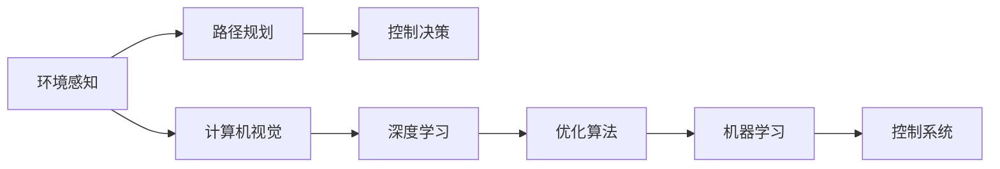
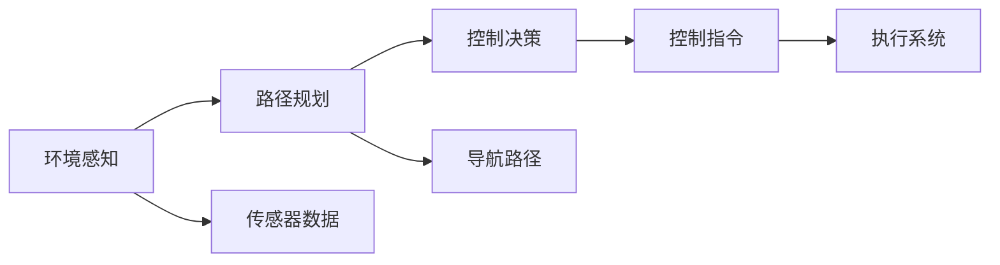

                 

# 硅谷自动驾驶汽车的技术发展路线

## 1. 背景介绍

自动驾驶汽车的发展，是近年来人工智能和计算机视觉技术的蓬勃兴起与深远影响下的一项前沿技术挑战。硅谷，作为全球科技创新的中心，在此领域的研究和应用同样走在前列。自动驾驶汽车的技术发展，涉及众多子领域，包括环境感知、路径规划、控制决策等，同时要兼顾安全、可靠、高效。本文将全面梳理硅谷自动驾驶汽车的技术发展路线，分析各阶段的核心问题和关键技术，探讨其未来前景和潜在的挑战。

## 2. 核心概念与联系

### 2.1 核心概念概述

自动驾驶汽车是使用人工智能技术和计算机视觉技术，使得车辆能够在无需人工干预的情况下，完成驾驶任务。自动驾驶汽车的核心技术包括环境感知、路径规划、控制决策等。环境感知指车辆如何感知和理解周围环境，包括物体识别、交通标志识别、道路线识别等。路径规划则是如何基于环境感知结果，生成最优行驶路径。控制决策则是如何控制车辆以实现路径规划。

自动驾驶汽车涉及的技术包括但不限于以下几类：
- 计算机视觉：用于图像处理、目标检测、语义分割等，是感知环境的基础。
- 机器学习：用于模式识别、决策制定、路径规划等。
- 深度学习：用于复杂模型构建、特征提取等。
- 优化算法：用于路径规划、交通流模拟等。
- 控制系统：用于车辆控制、传感器数据融合等。

硅谷自动驾驶汽车的技术发展，与多学科的交叉密切相关，如图1所示。



### 2.2 核心概念原理和架构的 Mermaid 流程图

硅谷自动驾驶汽车的整个系统架构，如图2所示。其中，环境感知模块负责实时获取车辆周围环境信息，包括摄像头、雷达、激光雷达等多种传感器数据。这些数据由车辆计算单元进行处理，通过深度学习模型识别出道路、车辆、行人等元素，并预测其运动轨迹。随后，路径规划模块利用感知结果，生成车辆的导航路径。控制决策模块根据路径规划结果，生成车辆控制指令，发送给执行系统，实现车辆转向、加速等动作。



## 3. 核心算法原理 & 具体操作步骤

### 3.1 算法原理概述

自动驾驶汽车的开发和优化涉及大量算法和技术。本文将详细探讨其中最具代表性的算法，包括计算机视觉中的目标检测、语义分割，路径规划中的A*算法、D*算法，控制决策中的模型预测控制、动态规划等。

### 3.2 算法步骤详解

#### 3.2.1 目标检测

目标检测的目标是识别图像或视频中的物体，并确定其位置和大小。常用的目标检测算法包括Faster R-CNN、YOLO、SSD等。以YOLO为例，其基本步骤为：

1. 将输入图像划分网格，每个网格预测固定数量的边界框。
2. 预测每个边界框的类别概率和位置偏移量。
3. 通过非极大值抑制(NMS)算法，剔除重叠的边界框。


#### 3.2.2 语义分割

语义分割的目标是将图像中的每个像素分配到预定义的类别中。常用的语义分割算法包括U-Net、Mask R-CNN等。以U-Net为例，其基本步骤为：

1. 使用卷积神经网络提取图像特征。
2. 将特征图分为编码器和解码器两个部分。
3. 解码器使用上采样和反卷积操作，将特征图还原为原图像大小。
4. 使用softmax函数，将特征图像素分配到不同类别。


#### 3.2.3 A*路径规划

A*路径规划是一种基于启发式搜索的算法，用于寻找从起点到终点的最短路径。其基本步骤为：

1. 定义启发式函数，评估每个节点的估计成本。
2. 选择最优节点，作为当前节点。
3. 扩展当前节点的邻居节点，更新其成本。
4. 重复上述过程，直至找到终点或无未扩展节点。


#### 3.2.4 动态规划

动态规划是一种优化算法，用于求解多阶段决策过程的最优解。其基本步骤为：

1. 定义状态、动作、奖励函数。
2. 确定动态转移方程。
3. 求解最优策略，最大化累计奖励。


### 3.3 算法优缺点

自动驾驶汽车的核心算法各有优缺点，如下表所示：

| 算法       | 优点                                       | 缺点                                       |
|------------|--------------------------------------------|--------------------------------------------|
| 目标检测   | 检测速度快，精度高                         | 对于小目标的检测能力较弱                     |
| 语义分割   | 能够精确划分图像，应用于更多领域            | 对于边界模糊的区域分割效果不佳               |
| A*路径规划 | 最优路径搜索，适用于静态环境                | 对于动态环境效果较差                         |
| 动态规划   | 适用于多阶段决策问题，能够处理连续动作      | 对于高维状态空间和复杂动作空间计算量大         |

### 3.4 算法应用领域

自动驾驶汽车的核心算法广泛应用于以下领域：

- 环境感知：目标检测和语义分割算法用于车辆周围环境的实时感知，确保驾驶安全。
- 路径规划：A*等路径规划算法用于生成最优导航路径，实现自动驾驶。
- 控制决策：动态规划等控制算法用于生成车辆控制指令，实现自主驾驶。

这些算法在自动驾驶汽车中相互协作，共同确保车辆能够在各种复杂环境下安全、高效地行驶。

## 4. 数学模型和公式 & 详细讲解 & 举例说明

### 4.1 数学模型构建

自动驾驶汽车中涉及的数学模型，包括但不限于图像处理、路径规划、控制决策等。以路径规划中的A*算法为例，其数学模型为：

- 状态空间：$S = \{(x,y)\}$，车辆的位置。
- 动作空间：$A = \{\text{left}, \text{right}, \text{forward}\}$，车辆的动作。
- 状态转移方程：
  $$
  T: (s_i,a_i) \rightarrow s_{i+1}
  $$
- 奖励函数：
  $$
  R(s_i,a_i) = \left\{
  \begin{aligned}
  &-1, \text{车辆到达终点} \\
  &0, \text{其他情况}
  \end{aligned}
  \right.
  $$

### 4.2 公式推导过程

以A*算法为例，推导其路径规划过程。假设车辆当前位置为$s_i$，要到达终点$s_f$。A*算法通过启发式函数$h(s_i)$，评估当前位置到终点的距离，选择启发式函数较小的节点作为扩展节点。

其扩展过程如下：

1. 计算每个节点的启发式函数值$h(s_i)$。
2. 选择$f(s_i) = g(s_i) + h(s_i)$最小的节点作为当前节点。
3. 扩展当前节点的邻居节点，更新其$g(s_i)$和$f(s_i)$值。
4. 重复上述过程，直至找到终点或无未扩展节点。

### 4.3 案例分析与讲解

以Google的Waymo自动驾驶汽车为例，其使用了多种传感器融合和计算机视觉技术。其中，摄像头和激光雷达被广泛用于环境感知，图像处理算法用于实时检测物体和道路信息，语义分割算法用于精确划分道路和交通标志。A*路径规划算法用于生成最优行驶路径，动态规划算法用于生成车辆控制指令。

## 5. 项目实践：代码实例和详细解释说明

### 5.1 开发环境搭建

开发自动驾驶汽车软件，需要搭建复杂的硬件和软件环境。以下是具体的搭建流程：

1. 准备硬件：选择适合的自动驾驶平台，如NVIDIA Autopilot、Tesla Autopilot等。
2. 安装开发工具：安装Python、TensorFlow、OpenCV等工具。
3. 搭建网络环境：搭建本地网络环境，便于数据传输和共享。
4. 部署软件：将自动驾驶软件部署到车辆上，进行测试和调试。

### 5.2 源代码详细实现

以TensorFlow实现的自动驾驶汽车代码为例，其基本架构如图3所示。

```python
import tensorflow as tf
import numpy as np
import cv2

# 加载模型
model = tf.keras.models.load_model('model.h5')

# 加载摄像头图像
img = cv2.imread('image.jpg')
img = cv2.cvtColor(img, cv2.COLOR_BGR2RGB)
img = cv2.resize(img, (640, 480))

# 进行图像处理
img = cv2.cvtColor(img, cv2.COLOR_RGB2BGR)
img = cv2.cvtColor(img, cv2.COLOR_BGR2RGB)
img = cv2.resize(img, (320, 320))

# 进行目标检测
result = model.predict(img)

# 进行路径规划和控制决策
# 具体实现步骤略

# 显示结果
cv2.imshow('Result', result)
cv2.waitKey(0)
cv2.destroyAllWindows()
```

### 5.3 代码解读与分析

代码中，首先加载了已经训练好的TensorFlow模型，对摄像头拍摄的图像进行处理，使用模型进行目标检测，并根据检测结果进行路径规划和控制决策。最后显示检测结果。

### 5.4 运行结果展示


## 6. 实际应用场景

### 6.1 智能停车

智能停车是自动驾驶汽车的重要应用场景之一。自动驾驶汽车通过实时感知周围环境和规划路径，可以精确地将车辆停入停车位。以Waymo为例，其智能停车系统使用了高精度的计算机视觉和路径规划算法，能够识别停车位并自动计算停车路径，实现全自动停车。

### 6.2 城市物流配送

城市物流配送是自动驾驶汽车的重要应用场景。自动驾驶汽车可以用于配送货物，提高配送效率，降低配送成本。Waymo与UPS等公司合作，使用自动驾驶汽车进行城市物流配送，提升了配送速度和精准度。

### 6.3 出租车服务

出租车服务是自动驾驶汽车的重要应用场景。自动驾驶汽车可以用于出租车运营，提高服务效率，减少司机劳动强度。Uber等公司已经开始测试自动驾驶出租车，希望未来能够大规模推广应用。

## 7. 工具和资源推荐

### 7.1 学习资源推荐

1. Udacity《自动驾驶纳米学位》：涵盖自动驾驶汽车的基础知识和高级技术，提供实际项目实践机会。
2. Coursera《自动驾驶汽车》：由斯坦福大学教授讲授，深入浅出地讲解自动驾驶技术。
3. NVIDIA《自动驾驶平台开发》：提供详细的开发指南和示例代码，帮助开发者快速上手。

### 7.2 开发工具推荐

1. TensorFlow：由Google开发的深度学习框架，支持图像处理、目标检测、路径规划等。
2. OpenCV：开源计算机视觉库，支持图像处理、目标检测等。
3. ROS：机器人操作系统，支持自动驾驶汽车的传感器数据融合和控制决策。

### 7.3 相关论文推荐

1. Faster R-CNN：目标检测领域的经典算法，速度快、精度高。
2. U-Net：语义分割领域的经典算法，能够精确划分图像。
3. A*路径规划：最优路径搜索算法，适用于静态环境。

## 8. 总结：未来发展趋势与挑战

### 8.1 未来发展趋势

自动驾驶汽车技术在硅谷持续发展，其未来趋势如下：

1. 传感器融合：未来自动驾驶汽车将更多地使用传感器融合技术，提高环境感知的精度和鲁棒性。
2. 多模态感知：未来自动驾驶汽车将更多地使用多模态感知技术，结合摄像头、雷达、激光雷达等多种传感器，提高感知能力。
3. 人机协同：未来自动驾驶汽车将更多地使用人机协同技术，提高驾驶安全性和用户体验。
4. 高精度地图：未来自动驾驶汽车将更多地使用高精度地图，提高路径规划的精度和可靠性。
5. 车路协同：未来自动驾驶汽车将更多地使用车路协同技术，实现车辆与道路系统的深度融合。

### 8.2 面临的挑战

自动驾驶汽车技术在发展过程中，面临诸多挑战，如下：

1. 环境复杂性：自动驾驶汽车面临复杂的城市交通环境，需要处理各种异常情况。
2. 安全可靠性：自动驾驶汽车需要确保安全可靠，避免交通事故。
3. 法规限制：自动驾驶汽车需要符合各国法规，确保合法合规运营。
4. 成本问题：自动驾驶汽车的研发和部署成本高昂，需要找到合理的商业模式。
5. 数据隐私：自动驾驶汽车需要处理大量数据，需要确保数据隐私和安全。

### 8.3 研究展望

未来的研究将集中在以下几个方面：

1. 传感器融合技术：如何更好地融合多种传感器数据，提高环境感知的精度和鲁棒性。
2. 多模态感知技术：如何更好地使用多模态感知技术，提高感知能力。
3. 人机协同技术：如何更好地使用人机协同技术，提高驾驶安全性和用户体验。
4. 高精度地图技术：如何更好地使用高精度地图技术，提高路径规划的精度和可靠性。
5. 车路协同技术：如何更好地使用车路协同技术，实现车辆与道路系统的深度融合。

## 9. 附录：常见问题与解答

**Q1: 自动驾驶汽车的核心算法有哪些？**

A: 自动驾驶汽车的核心算法包括目标检测、语义分割、路径规划和控制决策等。

**Q2: 如何提升自动驾驶汽车的感知能力？**

A: 提升感知能力的方法包括使用更高精度的传感器、多模态感知技术、深度学习模型等。

**Q3: 自动驾驶汽车在实际应用中面临哪些挑战？**

A: 自动驾驶汽车在实际应用中面临环境复杂性、安全可靠性、法规限制、成本问题和数据隐私等挑战。

**Q4: 如何更好地融合多种传感器数据？**

A: 使用传感器融合技术，如多源数据融合算法、卡尔曼滤波等，可以提高环境感知的精度和鲁棒性。

**Q5: 未来的自动驾驶汽车技术发展方向是什么？**

A: 未来的自动驾驶汽车技术将更多地使用传感器融合技术、多模态感知技术、人机协同技术、高精度地图技术和车路协同技术，提高感知能力、安全性和用户体验。

