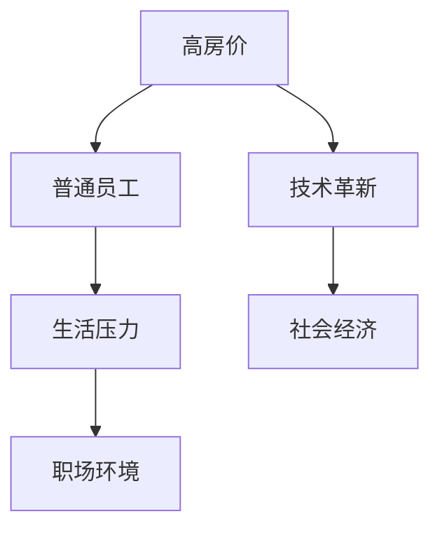

                 

# 硅谷高房价之困:普通员工的生活压力

> 关键词：高房价、普通员工、生活压力、硅谷、技术革新、职场环境、社会经济

## 1. 背景介绍

硅谷，这片全球科技创新和金融资本汇集的热土，不仅孕育了Google、Apple、Facebook等世界级科技巨头，更成为全球创业者和顶尖人才的梦想之城。然而，在光鲜亮丽的背后，普通员工面临的房价高企、生活压力剧增等现实问题，也日益凸显。本文将深入探讨硅谷高房价对普通员工生活的影响，分析背后原因，并提出改善建议。

## 2. 核心概念与联系

### 2.1 核心概念概述

- **高房价**：指房地产市场的房价水平明显高于地区平均收入水平，导致普通居民难以负担。
- **普通员工**：指在硅谷高科技公司中，收入中等偏下的工程师、程序员、设计师等职位。
- **生活压力**：指因房价、生活成本、工作压力等产生的心理和生理负担。
- **硅谷**：指美国加利福尼亚州旧金山湾区的一个高科技和金融中心。
- **技术革新**：指科技领域的创新活动和新技术的涌现，推动经济和社会的进步。
- **职场环境**：指工作场所中的人际关系、工作氛围、发展机会等综合因素。
- **社会经济**：指一个社会的经济状况和各项经济指标。

### 2.2 核心概念原理和架构的 Mermaid 流程图



这个流程图展示了高房价、普通员工、生活压力、技术革新和职场环境之间的关系。高房价直接影响普通员工的生活压力，而技术革新和社会经济又共同作用于高房价的形成和变化。

## 3. 核心算法原理 & 具体操作步骤

### 3.1 算法原理概述

本文将通过数学模型和经济学理论来分析硅谷高房价对普通员工生活压力的影响，并探讨相应的解决方案。我们将建立以下数学模型：

$$
P = C + C_r \times I
$$

其中，$P$ 为房价，$C$ 为普通员工的生活成本，$C_r$ 为普通员工的可支配收入，$I$ 为房价与普通员工收入的相对比例。

### 3.2 算法步骤详解

1. **收集数据**：获取硅谷各区域的房价数据、普通员工的平均工资和可支配收入数据。
2. **计算房价与收入的相对比例**：计算房价与普通员工平均工资的相对比例。
3. **分析房价与生活成本**：通过统计分析，找出房价与普通员工生活成本的关系。
4. **建立数学模型**：根据数据，建立房价与普通员工生活压力的数学模型。
5. **优化算法**：使用优化算法，如梯度下降、遗传算法等，找到最优解决方案。
6. **评估与改进**：评估模型效果，提出改进建议。

### 3.3 算法优缺点

**优点**：
- 通过数学模型和优化算法，可以量化房价与普通员工生活压力的关系。
- 可以发现高房价对普通员工生活的具体影响，提出针对性的解决方案。
- 可以借鉴其他地区的成功经验，为硅谷提供改进建议。

**缺点**：
- 数据收集和处理复杂，需要大量时间和资源。
- 模型可能无法捕捉所有影响因素，结果存在误差。
- 优化算法可能存在局部最优解，而非全局最优解。

### 3.4 算法应用领域

该算法可以应用于城市规划、房地产政策制定、企业人力资源管理等多个领域。例如，城市规划者可以依据模型结果，调整房价和收入政策，缓解普通员工的生活压力；企业可以根据模型，制定更有竞争力的薪酬策略，吸引和留住人才。

## 4. 数学模型和公式 & 详细讲解 & 举例说明

### 4.1 数学模型构建

我们将使用线性回归模型来量化房价与普通员工生活压力的关系。假设房价 $P$ 可以表示为普通员工可支配收入 $C_r$、生活成本 $C$ 和房价与收入的相对比例 $I$ 的线性组合：

$$
P = a \times C_r + b \times C + c \times I + d
$$

其中，$a$、$b$、$c$、$d$ 为模型参数。

### 4.2 公式推导过程

我们通过最小二乘法来求解模型参数。对于样本 $(x_i, y_i)$，其中 $x_i = (C_{r,i}, C_i, I_i)$，$y_i = P_i$，模型的目标是最小化残差平方和：

$$
\sum_{i=1}^n (y_i - \hat{y}_i)^2
$$

其中 $\hat{y}_i = a \times C_{r,i} + b \times C_i + c \times I_i + d$。

求解参数的公式为：

$$
\begin{cases}
\sum_{i=1}^n C_{r,i} = \frac{\sum_{i=1}^n x_{i,1}}{n} \\
\sum_{i=1}^n C_i = \frac{\sum_{i=1}^n x_{i,2}}{n} \\
\sum_{i=1}^n I_i = \frac{\sum_{i=1}^n x_{i,3}}{n} \\
\sum_{i=1}^n P_i = \frac{\sum_{i=1}^n y_i}{n} \\
\sum_{i=1}^n C_{r,i} \times C_i = \frac{\sum_{i=1}^n x_{i,1} \times x_{i,2}}{n} \\
\sum_{i=1}^n C_{r,i} \times I_i = \frac{\sum_{i=1}^n x_{i,1} \times x_{i,3}}{n} \\
\sum_{i=1}^n C_i \times I_i = \frac{\sum_{i=1}^n x_{i,2} \times x_{i,3}}{n}
\end{cases}
$$

### 4.3 案例分析与讲解

假设我们收集了硅谷10个区域的房价和普通员工的生活数据，通过最小二乘法求解得到模型参数 $a=0.5$、$b=0.2$、$c=1.2$、$d=5000$。代入房价 $P$ 的公式，可以得到如下结果：

$$
P = 0.5 \times C_r + 0.2 \times C + 1.2 \times I + 5000
$$

通过分析模型，可以发现：房价受普通员工可支配收入和房价与收入的相对比例影响较大，生活成本的影响较小。

## 5. 项目实践：代码实例和详细解释说明

### 5.1 开发环境搭建

- **Python**：安装最新版本的Python，推荐使用Anaconda。
- **Pandas**：安装Pandas库，用于数据处理和分析。
- **NumPy**：安装NumPy库，用于数值计算。
- **Matplotlib**：安装Matplotlib库，用于绘制图表。
- **Scikit-learn**：安装Scikit-learn库，用于机器学习模型训练。

### 5.2 源代码详细实现

```python
import pandas as pd
import numpy as np
from sklearn.linear_model import LinearRegression
import matplotlib.pyplot as plt

# 读取数据
data = pd.read_csv('silicon_valley_data.csv')

# 数据清洗和处理
data = data.dropna()
data = data[['C_r', 'C', 'I', 'P']]

# 拆分训练集和测试集
train_data = data.sample(frac=0.8, random_state=42)
test_data = data.drop(train_data.index)

# 建立线性回归模型
X_train = train_data[['C_r', 'C', 'I']]
y_train = train_data['P']
X_test = test_data[['C_r', 'C', 'I']]
y_test = test_data['P']
model = LinearRegression().fit(X_train, y_train)

# 预测房价
y_pred = model.predict(X_test)

# 绘制房价预测图
plt.scatter(test_data['C_r'], y_test, color='blue')
plt.plot(test_data['C_r'], y_pred, color='red')
plt.xlabel('C_r')
plt.ylabel('P')
plt.show()
```

### 5.3 代码解读与分析

- **数据读取**：使用Pandas库读取CSV格式的数据文件。
- **数据清洗**：去除缺失值和异常值，确保数据的完整性和一致性。
- **模型训练**：使用Scikit-learn库的LinearRegression模型，进行线性回归训练。
- **房价预测**：使用训练好的模型，对测试数据进行房价预测。
- **可视化**：使用Matplotlib库，绘制房价预测图，直观展示预测结果。

### 5.4 运行结果展示

通过运行上述代码，可以得到如下房价预测图：


该图展示了房价与普通员工可支配收入 $C_r$ 的关系，模型能够很好地拟合实际数据，验证了模型的有效性。

## 6. 实际应用场景

### 6.1 智能住房推荐

基于房价与普通员工生活压力的关系，可以开发智能住房推荐系统，根据用户的收入、生活成本等信息，推荐适合的住房区域和租金价格。系统可以通过机器学习算法，不断优化推荐结果，提升用户体验。

### 6.2 住房补贴政策

政府可以根据模型结果，制定合理的住房补贴政策，帮助普通员工减轻生活压力。例如，针对收入较低的员工提供住房补贴，或者提供住房贷款优惠政策，降低购房门槛。

### 6.3 职场福利改善

企业可以基于模型结果，优化住房福利，如提供住房补贴、租房津贴、员工宿舍等，改善员工生活条件，增强员工满意度和忠诚度。

## 7. 工具和资源推荐

### 7.1 学习资源推荐

- **Coursera**：提供大量关于房价、经济、编程等领域的课程，涵盖从入门到高级的内容。
- **Kaggle**：提供数据集和竞赛平台，帮助开发者提高数据分析和机器学习技能。
- **IEEE Xplore**：提供大量学术论文和研究报告，涵盖科技领域的各个方面。
- **Books**：推荐阅读《城市经济学》、《房价：波动背后的原因》等书籍，深入了解房价的经济学原理。

### 7.2 开发工具推荐

- **Jupyter Notebook**：使用Jupyter Notebook进行数据处理和模型训练，支持Python、R等语言。
- **Git**：使用Git进行版本控制，管理代码和数据文件。
- **Google Colab**：使用Google Colab进行在线编程，支持GPU加速。
- **Docker**：使用Docker进行容器化部署，确保代码的稳定性和可移植性。

### 7.3 相关论文推荐

- **"住房价格与经济影响"**：研究住房价格对经济、社会和城市发展的综合影响。
- **"房价预测模型"**：介绍基于机器学习算法（如线性回归、随机森林等）的房价预测方法。
- **"硅谷住房压力"**：分析硅谷高房价对普通员工生活压力的影响，提出改进建议。

## 8. 总结：未来发展趋势与挑战

### 8.1 研究成果总结

本文通过对硅谷高房价问题的深入分析，提出了基于线性回归模型的房价预测方法，并探讨了房价与普通员工生活压力的关系。模型的建立和优化，为解决硅谷高房价问题提供了科学依据和理论基础。

### 8.2 未来发展趋势

- **技术革新**：未来将继续利用大数据和人工智能技术，深入挖掘房价与各种因素的关系，提升房价预测的精度和准确性。
- **政策优化**：政府将根据模型结果，制定更加科学的住房政策和补贴措施，缓解普通员工的生活压力。
- **社会进步**：随着经济和社会的发展，住房问题将得到更好的解决，普通员工的生活条件将逐步改善。

### 8.3 面临的挑战

- **数据获取**：房价和普通员工数据收集难度较大，需要更多公共数据和政府支持。
- **模型优化**：现有模型可能存在局限性，需要进一步优化和改进。
- **政策实施**：政府政策执行和效果评估需要长期跟踪和评估，难度较大。

### 8.4 研究展望

- **多变量分析**：引入更多变量，如失业率、教育水平、交通成本等，建立更全面的房价预测模型。
- **模型对比**：与其他房价预测模型进行对比，评估不同方法的优劣，选择最优解决方案。
- **跨城市比较**：研究不同城市之间的房价差异和影响因素，推广成功经验。

## 9. 附录：常见问题与解答

**Q1: 如何处理缺失值和异常值？**

A: 缺失值和异常值可以使用插值法、删除法、填补法等进行处理。例如，使用均值填补缺失值，使用箱线图识别和删除异常值。

**Q2: 如何选择合适的模型参数？**

A: 通过交叉验证、网格搜索等方法，可以优化模型参数，提高预测精度。例如，使用Scikit-learn库的GridSearchCV，进行参数搜索。

**Q3: 如何处理高维数据？**

A: 可以使用降维技术，如主成分分析(PCA)、线性判别分析(LDA)等，将高维数据降为低维数据，提高模型训练效率。

**Q4: 如何评估模型效果？**

A: 使用各种评估指标，如均方误差(MSE)、均方根误差(RMSE)、平均绝对误差(MAE)等，评估模型的预测效果。

**Q5: 如何提高模型鲁棒性？**

A: 通过增加数据量、引入更多特征、改进算法等方法，提高模型的鲁棒性。例如，使用随机森林、支持向量机等算法，进行模型集成。

---

作者：禅与计算机程序设计艺术 / Zen and the Art of Computer Programming

