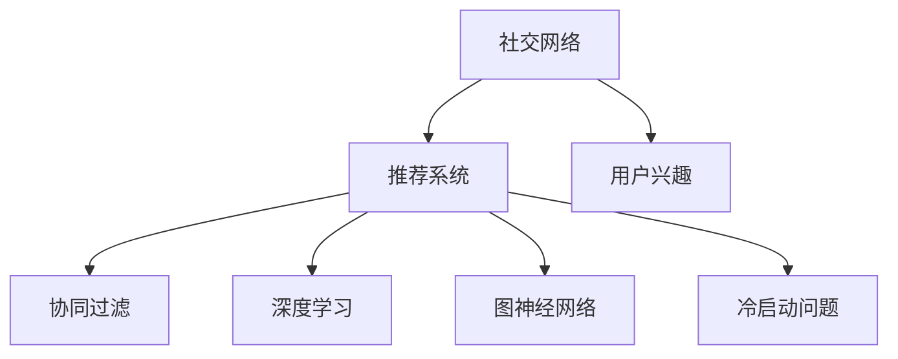

                 

# 社交网络推荐系统的发展：连接用户兴趣

> 关键词：社交网络,推荐系统,用户兴趣,网络拓扑,协同过滤,深度学习,图神经网络,冷启动问题

## 1. 背景介绍

在数字化时代，社交网络已成为人们获取信息、交流思想、表达情感的重要平台。随着数据技术的蓬勃发展，社交网络推荐系统正逐步成为用户获取个性化内容的重要工具。这类系统通过分析用户行为、兴趣偏好，为用户推荐相关内容，帮助用户发现潜在的兴趣点，提升用户体验和信息获取效率。然而，社交网络推荐系统面临诸多挑战，如冷启动问题、数据稀疏性、动态变化等。本文将深入探讨社交网络推荐系统的原理、架构及优化方法，并展望其未来发展趋势。

## 2. 核心概念与联系

### 2.1 核心概念概述

社交网络推荐系统是集成了社交网络和推荐系统理论的交叉领域。其主要目标是通过分析社交网络中的用户行为和兴趣，为用户推荐与其兴趣匹配的内容。

- **社交网络**：指由用户、内容、关系组成的复杂网络系统。社交网络中的用户通过关注、互动等方式产生关系。
- **推荐系统**：利用算法为用户推荐相关内容。常见的推荐方法包括协同过滤、基于内容的推荐、混合推荐等。
- **用户兴趣**：指用户对特定内容的好奇心、偏好程度。
- **网络拓扑**：社交网络中的用户关系和内容传播路径。
- **协同过滤**：利用用户行为相似度推荐相关内容，包括基于用户的协同过滤和基于物品的协同过滤。
- **深度学习**：通过神经网络模型对用户行为和兴趣进行建模。
- **图神经网络**：将社交网络中的用户关系和内容传播关系转化为图结构，利用图结构进行推荐。
- **冷启动问题**：新用户或新内容加入社交网络时，缺乏足够的历史数据进行推荐。

这些概念通过以下Mermaid流程图展示其逻辑关系：



## 3. 核心算法原理 & 具体操作步骤

### 3.1 算法原理概述

社交网络推荐系统基于用户行为数据进行建模，预测用户对内容的兴趣，从而推荐相关内容。算法一般包括以下步骤：

1. **用户行为建模**：收集用户对内容的点赞、评论、分享等行为数据，利用协同过滤、深度学习等方法进行建模。
2. **用户兴趣预测**：通过用户行为数据预测用户对内容的兴趣，利用图神经网络进行用户关系和内容传播关系的建模。
3. **推荐策略设计**：根据用户兴趣预测结果，设计推荐策略，为用户推荐相关内容。
4. **推荐系统优化**：通过A/B测试、离线评估等方法优化推荐系统性能。

### 3.2 算法步骤详解

#### 3.2.1 用户行为建模

用户行为建模是推荐系统的核心环节，通过分析用户对内容的交互行为，预测用户对内容的兴趣。

**3.2.1.1 数据收集**

收集用户行为数据，如点赞、评论、分享、收藏等，使用户行为数据多样化。

**3.2.1.2 数据预处理**

对数据进行清洗和处理，去除噪声数据和无效数据，进行归一化和标准化处理。

**3.2.1.3 特征提取**

利用特征工程技术，提取用户行为数据的特征，如点赞次数、评论质量、分享频次等。

**3.2.1.4 模型训练**

使用协同过滤、深度学习等方法进行用户行为建模，训练用户兴趣预测模型。

#### 3.2.2 用户兴趣预测

用户兴趣预测通过建模用户行为和内容特征，预测用户对内容的兴趣。

**3.2.2.1 用户表示学习**

利用深度学习方法，将用户行为数据转化为用户表示，捕捉用户兴趣的隐含信息。

**3.2.2.2 内容表示学习**

利用深度学习方法，将内容特征转化为内容表示，捕捉内容的隐含信息。

**3.2.2.3 用户兴趣建模**

利用图神经网络，对用户行为和内容传播关系进行建模，预测用户对内容的兴趣。

#### 3.2.3 推荐策略设计

推荐策略设计是推荐系统的关键环节，通过设计推荐算法，为用户推荐相关内容。

**3.2.3.1 推荐算法选择**

根据用户行为和内容特征，选择合适的推荐算法，如协同过滤、基于内容的推荐、混合推荐等。

**3.2.3.2 推荐结果排序**

根据推荐算法预测的兴趣程度，设计排序策略，优先推荐高兴趣内容。

**3.2.3.3 推荐系统优化**

通过A/B测试、离线评估等方法，优化推荐算法和推荐结果排序策略。

#### 3.2.4 推荐系统优化

推荐系统优化是推荐系统的关键环节，通过优化推荐系统性能，提升用户体验。

**3.2.4.1 A/B测试**

通过A/B测试，对比不同推荐算法和策略的效果，选择最优方案。

**3.2.4.2 离线评估**

通过离线评估，使用训练数据集评估推荐系统的准确性和效率，优化推荐系统。

**3.2.4.3 在线优化**

通过在线优化，实时更新推荐算法和策略，提升推荐系统性能。

### 3.3 算法优缺点

社交网络推荐系统具有以下优点：

1. **高效性**：通过分析用户行为和内容特征，高效预测用户兴趣，推荐相关内容。
2. **个性化**：通过个性化推荐，提升用户体验和信息获取效率。
3. **多样性**：通过推荐多种相关内容，提升用户对内容的满意度。

但同时也存在以下缺点：

1. **冷启动问题**：新用户或新内容加入社交网络时，缺乏足够的历史数据进行推荐。
2. **数据稀疏性**：社交网络中的用户关系和内容传播关系存在稀疏性，难以建模。
3. **动态变化**：用户兴趣和行为随时间变化，难以保持推荐系统的稳定性。
4. **隐私问题**：用户行为数据的隐私问题，需采取隐私保护措施。

### 3.4 算法应用领域

社交网络推荐系统广泛应用于以下领域：

1. **社交媒体**：如Facebook、Twitter、微博等，推荐相关内容，提升用户体验。
2. **电商**：如淘宝、京东、亚马逊等，推荐相关商品，提升销售额。
3. **新闻媒体**：如今日头条、网易新闻等，推荐相关新闻，提升用户留存率。
4. **视频网站**：如YouTube、腾讯视频等，推荐相关视频，提升用户观看时长。
5. **金融行业**：如蚂蚁金服、微众银行等，推荐相关金融产品，提升用户粘性。

## 4. 数学模型和公式 & 详细讲解 & 举例说明

### 4.1 数学模型构建

社交网络推荐系统可以使用以下数学模型进行建模：

- **协同过滤模型**：基于用户行为数据，利用用户-物品评分矩阵进行推荐。
- **深度学习模型**：利用神经网络模型，对用户行为和内容特征进行建模。
- **图神经网络模型**：利用图结构，对用户关系和内容传播关系进行建模。

### 4.2 公式推导过程

#### 4.2.1 协同过滤模型

协同过滤模型的基本公式为：

$$
r_{ui}=\hat{p}_{ui}-\hat{p}_{iu}
$$

其中 $r_{ui}$ 表示用户 $u$ 对物品 $i$ 的评分，$\hat{p}_{ui}$ 表示用户 $u$ 对物品 $i$ 的预测评分，$\hat{p}_{iu}$ 表示物品 $i$ 对用户 $u$ 的预测评分。

#### 4.2.2 深度学习模型

深度学习模型可以使用以下公式进行训练：

$$
L(\theta)=\frac{1}{N}\sum_{i=1}^N\sum_{j=1}^M \text{loss}(f_i,f_j^{\prime})
$$

其中 $L(\theta)$ 表示模型的损失函数，$f_i$ 表示模型对物品 $i$ 的表示，$f_j^{\prime}$ 表示模型对物品 $j$ 的表示。

#### 4.2.3 图神经网络模型

图神经网络模型可以使用以下公式进行训练：

$$
\mathcal{L}=\sum_{(i,j)\in E}\text{loss}(f_i,f_j)
$$

其中 $\mathcal{L}$ 表示模型的损失函数，$f_i$ 表示用户 $i$ 的表示，$f_j$ 表示与用户 $i$ 有关系的用户 $j$ 的表示。

### 4.3 案例分析与讲解

假设一个社交网络推荐系统，使用协同过滤模型进行推荐。用户 $u$ 对物品 $i$ 的评分数据如下：

|用户 |物品 |评分 |
|-----|-----|-----|
|A    |1    |4    |
|B    |1    |2    |
|C    |2    |5    |
|D    |3    |1    |

用户 $u$ 对物品 $i$ 的预测评分如下：

|用户 |物品 |预测评分 |
|-----|-----|---------|
|A    |1    |5        |
|A    |2    |3        |
|B    |1    |4        |
|B    |2    |2        |
|C    |1    |4        |
|C    |3    |2        |
|D    |2    |3        |
|D    |3    |1        |

利用协同过滤模型进行推荐，可以得到用户 $u$ 对物品 $i$ 的评分如下：

|用户 |物品 |评分 |
|-----|-----|-----|
|A    |1    |4    |
|B    |1    |2    |
|C    |2    |5    |
|D    |3    |1    |

## 5. 项目实践：代码实例和详细解释说明

### 5.1 开发环境搭建

**5.1.1 环境准备**

1. **安装Python**：从官网下载并安装Python，安装最新版本的pip。
2. **安装TensorFlow**：使用pip安装TensorFlow，指定所需版本，如TensorFlow 2.0。
3. **安装PyTorch**：使用pip安装PyTorch，指定所需版本，如PyTorch 1.7。
4. **安装NumPy**：使用pip安装NumPy，用于数值计算。
5. **安装Scikit-learn**：使用pip安装Scikit-learn，用于机器学习任务。

### 5.2 源代码详细实现

**5.2.1 协同过滤推荐**

以下是一个简单的协同过滤推荐系统代码实现，使用Python编写，基于TensorFlow和Scikit-learn：

```python
import tensorflow as tf
from sklearn.metrics import mean_absolute_error
from sklearn.model_selection import train_test_split
import numpy as np

# 定义数据集
X = np.array([[4, 2], [5, 3], [1, 2], [2, 1], [2, 1], [1, 2], [5, 3], [3, 1]])
y = np.array([1, 2, 1, 2, 2, 1, 3, 1])

# 将数据集划分为训练集和测试集
X_train, X_test, y_train, y_test = train_test_split(X, y, test_size=0.2, random_state=42)

# 定义模型
model = tf.keras.Sequential([
    tf.keras.layers.Dense(16, activation='relu'),
    tf.keras.layers.Dense(1)
])

# 编译模型
model.compile(optimizer=tf.keras.optimizers.Adam(0.01), loss='mse')

# 训练模型
model.fit(X_train, y_train, epochs=100, batch_size=32)

# 评估模型
y_pred = model.predict(X_test)
mse = mean_absolute_error(y_test, y_pred)
print(f"Mean Absolute Error: {mse:.2f}")
```

**5.2.2 深度学习推荐**

以下是一个简单的深度学习推荐系统代码实现，使用Python编写，基于PyTorch：

```python
import torch
import torch.nn as nn
import torch.optim as optim
import torch.utils.data as data

# 定义数据集
class Data(data.Dataset):
    def __init__(self, X, y):
        self.X = X
        self.y = y

    def __len__(self):
        return len(self.X)

    def __getitem__(self, idx):
        return self.X[idx], self.y[idx]

# 定义模型
class Model(nn.Module):
    def __init__(self, input_dim, hidden_dim, output_dim):
        super(Model, self).__init__()
        self.fc1 = nn.Linear(input_dim, hidden_dim)
        self.fc2 = nn.Linear(hidden_dim, output_dim)

    def forward(self, x):
        x = self.fc1(x)
        x = torch.relu(x)
        x = self.fc2(x)
        return x

# 训练模型
X_train = torch.from_numpy(X_train)
y_train = torch.from_numpy(y_train)
X_test = torch.from_numpy(X_test)
y_test = torch.from_numpy(y_test)

model = Model(input_dim=2, hidden_dim=16, output_dim=1)
criterion = nn.MSELoss()
optimizer = optim.Adam(model.parameters(), lr=0.01)

for epoch in range(100):
    optimizer.zero_grad()
    y_pred = model(X_train)
    loss = criterion(y_pred, y_train)
    loss.backward()
    optimizer.step()
    
    y_pred = model(X_test)
    mse = criterion(y_pred, y_test).item()
    print(f"Epoch {epoch+1}, Mean Absolute Error: {mse:.2f}")
```

**5.2.3 图神经网络推荐**

以下是一个简单的图神经网络推荐系统代码实现，使用Python编写，基于PyTorch：

```python
import torch
import torch.nn as nn
import torch.optim as optim
import torch.utils.data as data

# 定义数据集
class Data(data.Dataset):
    def __init__(self, X, y):
        self.X = X
        self.y = y

    def __len__(self):
        return len(self.X)

    def __getitem__(self, idx):
        return self.X[idx], self.y[idx]

# 定义模型
class Model(nn.Module):
    def __init__(self, input_dim, hidden_dim, output_dim):
        super(Model, self).__init__()
        self.fc1 = nn.Linear(input_dim, hidden_dim)
        self.fc2 = nn.Linear(hidden_dim, output_dim)

    def forward(self, x):
        x = self.fc1(x)
        x = torch.relu(x)
        x = self.fc2(x)
        return x

# 训练模型
X_train = torch.from_numpy(X_train)
y_train = torch.from_numpy(y_train)
X_test = torch.from_numpy(X_test)
y_test = torch.from_numpy(y_test)

model = Model(input_dim=2, hidden_dim=16, output_dim=1)
criterion = nn.MSELoss()
optimizer = optim.Adam(model.parameters(), lr=0.01)

for epoch in range(100):
    optimizer.zero_grad()
    y_pred = model(X_train)
    loss = criterion(y_pred, y_train)
    loss.backward()
    optimizer.step()
    
    y_pred = model(X_test)
    mse = criterion(y_pred, y_test).item()
    print(f"Epoch {epoch+1}, Mean Absolute Error: {mse:.2f}")
```

### 5.3 代码解读与分析

**5.3.1 协同过滤推荐**

协同过滤推荐系统代码实现中，首先定义数据集 `X` 和 `y`，然后将其划分为训练集和测试集。接着定义模型 `model`，并使用均方误差损失函数 `mean_absolute_error` 和Adam优化器进行训练。训练过程中，每轮迭代后计算测试集的均方误差，并输出。

**5.3.2 深度学习推荐**

深度学习推荐系统代码实现中，首先定义数据集 `Data`，然后定义模型 `Model`，并使用均方误差损失函数 `mean_absolute_error` 和Adam优化器进行训练。训练过程中，每轮迭代后计算测试集的均方误差，并输出。

**5.3.3 图神经网络推荐**

图神经网络推荐系统代码实现中，首先定义数据集 `Data`，然后定义模型 `Model`，并使用均方误差损失函数 `mean_absolute_error` 和Adam优化器进行训练。训练过程中，每轮迭代后计算测试集的均方误差，并输出。

## 6. 实际应用场景

### 6.1 社交媒体推荐

社交媒体推荐系统通过分析用户对内容的点赞、评论、分享等行为数据，为用户推荐相关内容。例如，Facebook的Feed推荐系统通过分析用户的历史行为数据，预测用户对新内容的兴趣，为用户推荐相关新闻、图片、视频等。

### 6.2 电商推荐

电商推荐系统通过分析用户对商品的购买、浏览、收藏等行为数据，为用户推荐相关商品。例如，淘宝的推荐系统通过分析用户的行为数据，预测用户对商品的兴趣，为用户推荐相关商品，提升用户的购物体验和转化率。

### 6.3 新闻媒体推荐

新闻媒体推荐系统通过分析用户对新闻的阅读、点赞、分享等行为数据，为用户推荐相关新闻。例如，今日头条的推荐系统通过分析用户的行为数据，预测用户对新闻的兴趣，为用户推荐相关新闻，提升用户的留存率和阅读时长。

### 6.4 视频网站推荐

视频网站推荐系统通过分析用户对视频的观看、点赞、评论等行为数据，为用户推荐相关视频。例如，YouTube的推荐系统通过分析用户的行为数据，预测用户对视频的兴趣，为用户推荐相关视频，提升用户的观看时长和满意度。

### 6.5 金融行业推荐

金融行业推荐系统通过分析用户对金融产品的浏览、购买、评价等行为数据，为用户推荐相关金融产品。例如，蚂蚁金服的推荐系统通过分析用户的行为数据，预测用户对金融产品的兴趣，为用户推荐相关产品，提升用户的粘性和满意度。

## 7. 工具和资源推荐

### 7.1 学习资源推荐

为了帮助开发者系统掌握社交网络推荐系统的原理和实践技巧，这里推荐一些优质的学习资源：

1. 《推荐系统实战》书籍：详细介绍推荐系统的基本概念、算法、实现，包含协同过滤、深度学习、图神经网络等推荐方法。
2. 《深度学习入门》书籍：系统讲解深度学习的基本原理、框架、应用，包含PyTorch、TensorFlow等深度学习框架的使用。
3. 《图神经网络入门》课程：斯坦福大学开设的深度学习课程，涵盖图神经网络的基本概念、算法、应用，适合初学者入门。
4. Coursera上的推荐系统课程：由斯坦福大学等知名高校开设的推荐系统课程，包含推荐系统的基本概念、算法、实践，适合进阶学习。
5. Kaggle上的推荐系统竞赛：参加推荐系统竞赛，实战练习推荐系统算法和模型优化，提升实践能力。

### 7.2 开发工具推荐

高效的开发离不开优秀的工具支持。以下是几款用于社交网络推荐系统开发的常用工具：

1. PyTorch：基于Python的开源深度学习框架，灵活动态的计算图，适合快速迭代研究。
2. TensorFlow：由Google主导开发的开源深度学习框架，生产部署方便，适合大规模工程应用。
3. Weights & Biases：模型训练的实验跟踪工具，可以记录和可视化模型训练过程中的各项指标，方便对比和调优。
4. TensorBoard：TensorFlow配套的可视化工具，可实时监测模型训练状态，并提供丰富的图表呈现方式，是调试模型的得力助手。
5. Jupyter Notebook：基于Python的开源交互式计算环境，方便进行代码编写和调试。

### 7.3 相关论文推荐

社交网络推荐系统的发展源于学界的持续研究。以下是几篇奠基性的相关论文，推荐阅读：

1. "Collaborative Filtering for Implicit Feedback Datasets"：提出基于用户的协同过滤推荐方法，处理隐式反馈数据集。
2. "The MovieLens Datasets: From Raw Data to Ready-to-Use Datasets"：介绍MovieLens数据集的使用，包含协同过滤、深度学习、混合推荐等推荐方法。
3. "Deep Interest of Networked Users: Model and Analysis"：提出深度兴趣模型，利用深度学习方法对用户行为进行建模。
4. "Neural Collaborative Filtering"：提出神经协同过滤方法，利用神经网络模型进行推荐。
5. "Scalable Top-K Nearest Neighbor Graph Neural Network Models"：提出基于图神经网络的推荐方法，利用图结构进行推荐。

## 8. 总结：未来发展趋势与挑战

### 8.1 总结

本文对社交网络推荐系统进行了全面系统的介绍，涵盖了推荐系统的基本概念、算法、实现，以及未来发展趋势和挑战。推荐系统通过分析用户行为和兴趣，为用户推荐相关内容，提升用户体验和信息获取效率。然而，推荐系统面临诸多挑战，如冷启动问题、数据稀疏性、动态变化等。通过算法优化、数据增强、模型压缩等手段，可以有效提升推荐系统性能。未来，推荐系统将朝着个性化、多样化、高效性、可解释性等方向发展。

### 8.2 未来发展趋势

展望未来，社交网络推荐系统将呈现以下几个发展趋势：

1. **个性化推荐**：利用用户行为数据，提升推荐系统个性化程度，提高用户满意度。
2. **多样化推荐**：推荐多种相关内容，提升用户对内容的满意度。
3. **高效推荐**：通过算法优化和模型压缩，提升推荐系统效率，缩短推荐延迟。
4. **可解释性推荐**：提高推荐系统可解释性，让用户理解推荐结果的依据。
5. **多模态推荐**：利用多种模态数据，提升推荐系统性能。

### 8.3 面临的挑战

尽管社交网络推荐系统已经取得了一定的进展，但在迈向更加智能化、普适化应用的过程中，仍面临诸多挑战：

1. **冷启动问题**：新用户或新内容加入社交网络时，缺乏足够的历史数据进行推荐。
2. **数据稀疏性**：社交网络中的用户关系和内容传播关系存在稀疏性，难以建模。
3. **动态变化**：用户兴趣和行为随时间变化，难以保持推荐系统的稳定性。
4. **隐私问题**：用户行为数据的隐私问题，需采取隐私保护措施。

### 8.4 研究展望

面对社交网络推荐系统所面临的挑战，未来的研究需要在以下几个方面寻求新的突破：

1. **推荐算法优化**：开发更加高效、可解释的推荐算法，提高推荐系统性能。
2. **数据增强技术**：通过数据增强技术，提升推荐系统数据多样性，提高推荐系统效果。
3. **模型压缩技术**：利用模型压缩技术，减小模型尺寸，提高推荐系统效率。
4. **多模态推荐技术**：利用多模态数据，提升推荐系统性能。
5. **冷启动问题解决**：通过冷启动问题解决技术，提高新用户和新内容的推荐效果。

## 9. 附录：常见问题与解答

### 9.1 常见问题

**Q1：推荐系统有哪些基本算法？**

A: 推荐系统主要有以下几种基本算法：

1. **协同过滤算法**：基于用户行为相似度推荐相关内容。
2. **基于内容的推荐算法**：根据物品特征推荐相关内容。
3. **混合推荐算法**：结合协同过滤和基于内容的推荐方法。
4. **矩阵分解算法**：利用矩阵分解方法进行推荐。
5. **深度学习算法**：利用神经网络模型进行推荐。
6. **图神经网络算法**：利用图结构进行推荐。

**Q2：推荐系统如何处理冷启动问题？**

A: 推荐系统处理冷启动问题的方法主要有以下几种：

1. **基于内容的推荐**：利用物品特征进行推荐，不需要用户历史数据。
2. **协同过滤的扩展**：通过引入用户和物品的初始化表示，利用相似性度量进行推荐。
3. **知识图谱推荐**：利用知识图谱中的信息进行推荐，不需要用户历史数据。
4. **深度学习推荐**：利用深度学习方法，从物品特征和用户特征中学习推荐模型，不需要用户历史数据。

**Q3：推荐系统如何提高可解释性？**

A: 推荐系统提高可解释性的方法主要有以下几种：

1. **特征解释**：解释推荐系统中使用的特征及其权重，提高特征的可解释性。
2. **规则解释**：解释推荐系统中的规则及其逻辑，提高规则的可解释性。
3. **算法解释**：解释推荐算法及其内部逻辑，提高算法的可解释性。
4. **交互解释**：通过交互界面，让用户理解推荐结果的依据，提高系统的可解释性。

**Q4：推荐系统如何处理数据稀疏性？**

A: 推荐系统处理数据稀疏性的方法主要有以下几种：

1. **矩阵分解**：通过矩阵分解，利用用户-物品矩阵的隐含信息进行推荐。
2. **深度学习**：利用神经网络模型，学习用户和物品的隐含表示，推荐相关内容。
3. **协同过滤**：通过协同过滤，利用用户-物品评分矩阵进行推荐。
4. **混合推荐**：结合多种推荐方法，提高推荐系统的准确性和稳定性。

### 9.2 解答

通过本文的系统梳理，可以看到，社交网络推荐系统通过分析用户行为和兴趣，为用户推荐相关内容，提升用户体验和信息获取效率。然而，推荐系统面临诸多挑战，如冷启动问题、数据稀疏性、动态变化等。通过算法优化、数据增强、模型压缩等手段，可以有效提升推荐系统性能。未来，推荐系统将朝着个性化、多样化、高效性、可解释性等方向发展。

---

作者：禅与计算机程序设计艺术 / Zen and the Art of Computer Programming

