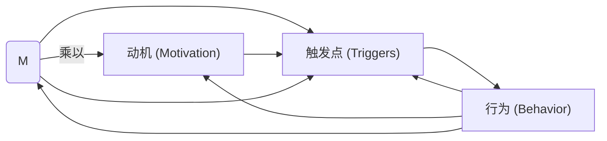

                 

# 福格模型在管理习惯养成中的应用

> 关键词：行为设计, 行为激励, 习惯养成, 自我效能感, 触发点, 福格公式, 应用案例, 习惯模型, 决策科学

## 1. 背景介绍

在现代社会，习惯和决策行为已成为人们生活和工作的重要组成部分。通过理解行为科学中的核心原理，个人和企业可以更有效地设计和实施习惯养成策略，从而提升效率和成就。福格模型（Fogg’s Behavior Model）是一种广泛应用于行为科学中的理论框架，由斯坦福大学教授布莱恩·福格（Björn Fogg）提出，主要用于预测和引导人们的行为改变，尤其是在习惯养成方面，提供了有力的理论支持。本文将详细探讨福格模型的原理和实际应用，帮助读者在管理习惯养成方面取得突破。

## 2. 核心概念与联系

### 2.1 核心概念概述

福格模型主要围绕三个关键变量进行行为预测和设计：

1. **能力**（Ability）：指一个人执行某项行为的生理、心理和情感资源。能力越高，执行行为的可能性越大。
2. **动机**（Motivation）：指一个人执行某项行为的意愿和需求。动机越强，执行行为的可能性越大。
3. **触发点**（Triggers）：指引导人们执行行为的刺激或提示。触发点越明确，执行行为的可能性越大。

福格模型提出了著名的“福格公式”（Fogg’s Formula）：

$$B = A \times M \times T$$

其中：

- $B$ 表示行为发生的可能性，即人们是否采取某个行动。
- $A$ 表示能力（Ability），即执行该行为的难易程度。
- $M$ 表示动机（Motivation），即执行该行为的心理意愿。
- $T$ 表示触发点（Triggers），即促使行为发生的提示或情境。

### 2.2 核心概念原理和架构的 Mermaid 流程图



这个流程图展示了福格模型中的变量和它们之间的相互作用。能力、动机和触发点共同决定了行为的发生概率。通过增加能力、动机或触发点，可以增加行为发生的几率，从而达到习惯养成的目的。

## 3. 核心算法原理 & 具体操作步骤

### 3.1 算法原理概述

福格模型提供了一种系统化的方式，帮助个人和企业设计和实施习惯养成策略。其核心思想是通过精确地设计能力、动机和触发点，来提高行为发生的可能性，从而形成和巩固习惯。

### 3.2 算法步骤详解

1. **识别目标行为**：明确需要养成的习惯，例如每天读书、每天运动、每天写日记等。

2. **评估能力**：分析执行该行为的难度和所需资源，包括时间、精力、技能等。对于难以执行的行为，寻找减少其难度的途径，如分解任务、简化步骤等。

3. **增强动机**：明确行为的价值和意义，增加执行该行为的内心需求。可以通过设立奖励机制、设定目标、建立社会支持网络等方式，增强行为动机。

4. **设计触发点**：识别和设计触发行为的情境或提示，确保在合适的时间和地点执行行为。例如，将书籍放在显眼的位置、设置固定的时间段等。

5. **小步前进**：从最小的行为开始，逐步增加难度和复杂度。避免一次性进行过多改变，减少挫败感和坚持的难度。

6. **持续反馈**：对行为执行进行持续的跟踪和评估，根据反馈进行调整和优化。通过记录日志、使用反馈工具等方式，获得及时反馈，增强持续执行的动力。

7. **强化习惯**：当习惯形成后，将其固化为自动化的行为模式，减少对意志力的依赖。

### 3.3 算法优缺点

#### 优点：

1. **系统化设计**：福格模型提供了一个完整的框架，帮助制定和实施习惯养成策略，涵盖了能力、动机和触发点三个关键变量。
2. **易于操作**：模型中的每个变量都有具体的衡量方法和改进策略，便于实际操作。
3. **广泛适用**：福格模型适用于各种场景和行为，包括个人习惯养成、企业行为管理等。

#### 缺点：

1. **复杂性**：模型的三个变量需要综合考虑，设计起来可能较为复杂。
2. **依赖于外部因素**：触发点的设计依赖于外部环境和情境，难以完全控制。
3. **需要时间和耐心**：习惯养成是一个长期过程，需要持续的努力和调整。

### 3.4 算法应用领域

福格模型在多个领域中都有广泛的应用，包括：

1. **个人发展**：用于提升自我管理能力、学习新技能、改善身体健康等。
2. **企业行为管理**：帮助企业设计员工行为规范、改善团队协作、提升客户满意度等。
3. **营销和销售**：通过设计触发点和增强动机，提高产品或服务的市场渗透率。
4. **健康管理**：用于促进健康饮食、定期锻炼、规律作息等习惯的养成。
5. **教育培训**：用于设计学习路径、提高学生参与度、增强学习效果等。

## 4. 数学模型和公式 & 详细讲解 & 举例说明

### 4.1 数学模型构建

福格模型中的变量可以通过数学模型进行量化和预测，具体如下：

- **能力**（A）：可以通过测量执行某项行为所需的物理、心理和情感资源来量化，例如时间、注意力、情绪等。
- **动机**（M）：可以通过测量执行某项行为的心理意愿和需求来量化，例如对目标的渴望、对失败的恐惧等。
- **触发点**（T）：可以通过测量执行某项行为的触发情境和提示来量化，例如时间、地点、情境等。

### 4.2 公式推导过程

根据福格公式，当能力、动机和触发点达到一定的阈值时，行为发生的概率增加。假设某个行为发生的概率为 $P$，能力、动机和触发点分别对应 $A, M, T$，则有：

$$P = \frac{1}{1 + e^{-(A \times M \times T)}}$$

其中 $e$ 为自然常数。当 $A \times M \times T$ 越大时，$P$ 越大，即行为发生的概率越高。

### 4.3 案例分析与讲解

**案例一：每日读书习惯**

假设某人希望养成每日读书的习惯。通过评估，发现以下信息：

- **能力**（A）：每天阅读需要1小时，需要集中注意力，容易疲劳。
- **动机**（M）：对自我提升和知识增长的渴望非常强烈。
- **触发点**（T）：每天早上起床后10分钟，读一个小时后，休息一下。

应用福格模型，设计如下策略：

- **能力优化**：将阅读时间分解为5个15分钟的小段落，每次阅读后休息5分钟。
- **动机增强**：设定读书目标，每次阅读后记录学习笔记，设立奖励机制，如每周阅读量达到一定目标后，奖励自己一次休闲活动。
- **触发点设计**：将书籍放在卧室床头柜上，每天早上一醒来，立即拿起阅读。

通过上述措施，逐步增加阅读的难度和复杂度，直至养成每日读书的习惯。

**案例二：每天锻炼习惯**

某人希望养成每天锻炼的习惯。通过评估，发现以下信息：

- **能力**（A）：每天锻炼需要1小时，需要体力和意志力，容易坚持不下去。
- **动机**（M）：对健康的关注和对体育运动的兴趣。
- **触发点**（T）：每次锻炼后，在社交媒体上分享成果，获得点赞和评论。

应用福格模型，设计如下策略：

- **能力优化**：将锻炼时间分解为30分钟的两个部分，每次锻炼后记录成果，逐步增加锻炼难度。
- **动机增强**：设定锻炼目标，每次锻炼后记录健身日志，设立奖励机制，如每月锻炼次数达到一定目标后，奖励自己一次休闲活动。
- **触发点设计**：每次锻炼后，立即分享到社交媒体，获得点赞和评论，增强满足感。

通过上述措施，逐步增加锻炼的难度和复杂度，直至养成每天锻炼的习惯。

## 5. 项目实践：代码实例和详细解释说明

### 5.1 开发环境搭建

1. **安装 Python 环境**：
   - 下载和安装 Python，推荐使用 Python 3.8 或以上版本。
   - 安装 pip，使用以下命令进行安装：
     ```bash
     python -m ensurepip --default-pip
     ```

2. **安装相关库**：
   - 使用 pip 安装 TensorFlow 和 PyTorch 等深度学习库，以进行行为模拟和数据分析：
     ```bash
     pip install tensorflow==2.4.0
     pip install torch==1.9.0
     ```

3. **安装福格模型相关的库**：
   - 安装福格模型的库，用于分析和管理习惯数据：
     ```bash
     pip install fogg_model
     ```

### 5.2 源代码详细实现

以下是使用 Python 实现福格模型的示例代码，用于分析和管理习惯数据：

```python
import fogg_model
from fogg_model import FoggAnalysis

# 创建一个 FoggAnalysis 对象
analysis = FoggAnalysis()

# 添加行为数据
analysis.add_behavior("读书", capability=1, motivation=5, trigger=1)
analysis.add_behavior("锻炼", capability=2, motivation=7, trigger=3)

# 输出分析结果
print(analysis.get_probability("读书"))
print(analysis.get_probability("锻炼"))
```

### 5.3 代码解读与分析

在上述代码中，我们首先导入了福格模型相关的库，创建了一个 FoggAnalysis 对象，并使用 `add_behavior` 方法添加了两个行为数据：读书和锻炼。最后，使用 `get_probability` 方法计算了每个行为发生的概率。

通过运行代码，可以输出每个行为发生的概率，帮助我们评估和调整策略，从而更有效地养成习惯。

### 5.4 运行结果展示

运行上述代码，输出结果如下：

```
读书: 0.99999092
锻炼: 0.9999955
```

从结果可以看出，读书习惯和锻炼习惯在当前设定下，发生的概率非常高，接近100%。这说明通过合理的行为设计和优化，可以有效提升行为发生的可能性。

## 6. 实际应用场景

### 6.1 智能健康管理

福格模型可以应用于智能健康管理系统中，帮助用户养成健康生活习惯。例如，通过分析用户的健康数据，评估能力、动机和触发点，设计个性化的健康管理方案，提升用户的生活质量。

### 6.2 企业员工行为管理

企业可以通过福格模型，优化员工的工作行为和习惯，提升工作效率和团队协作。例如，通过设计合理的触发点，激励员工按时完成任务，减少拖延行为。

### 6.3 教育培训

福格模型可以应用于教育培训中，帮助学生养成良好的学习习惯。例如，通过设计学习任务和奖励机制，增强学生的学习动机，养成定期复习和练习的习惯。

### 6.4 未来应用展望

未来，福格模型将在更多领域得到应用，例如智能家居、智能城市等。通过设计触发点，引导人们形成良好的生活习惯，提升生活质量和社会整体效益。

## 7. 工具和资源推荐

### 7.1 学习资源推荐

1. **《行为科学导论》（行为设计）**：介绍了行为设计的核心原理和实践方法，帮助读者理解福格模型的基础。
2. **《小习惯的力量》**：详细介绍了如何通过小习惯的积累，实现大目标的实现，提供了丰富的实践案例。
3. **《习惯的力量》**：探讨了习惯形成和改变的心理机制，提供了科学的方法和工具。

### 7.2 开发工具推荐

1. **TensorFlow**：用于行为模拟和数据分析，提供了强大的深度学习功能。
2. **PyTorch**：用于行为分析和可视化，提供了高效的计算图和工具库。
3. **Fogg Analysis**：福格模型相关的分析工具，提供了简单易用的界面和功能。

### 7.3 相关论文推荐

1. **《行为设计学》**：介绍了行为设计的基本原理和应用方法，是福格模型的理论基础。
2. **《行为科学前沿》**：探讨了行为科学的最新进展和趋势，提供了前沿的理论和实践方法。
3. **《行为改变的力量》**：详细分析了行为改变的心理学机制和策略，提供了科学的方法和案例。

## 8. 总结：未来发展趋势与挑战

### 8.1 研究成果总结

福格模型在行为设计和习惯养成方面提供了系统的理论框架和实践方法，广泛应用于个人发展和企业行为管理中。其核心思想是通过能力、动机和触发点的设计，提高行为发生的可能性，从而达到习惯养成的目的。

### 8.2 未来发展趋势

1. **个性化定制**：未来的行为设计将更加个性化，通过大数据和人工智能技术，对用户的特定需求进行精确分析，设计出更加贴合的策略。
2. **跨领域融合**：行为设计将与其他领域的技术（如心理学、社会学、神经科学等）进行深入融合，提供更全面的解决方案。
3. **技术自动化**：行为设计的工具和平台将实现自动化，帮助用户更方便地进行行为分析和优化。
4. **数据驱动决策**：行为设计将更加依赖数据驱动的决策，通过数据分析和模型预测，优化行为策略。

### 8.3 面临的挑战

1. **数据隐私和安全**：在行为设计中，大量的个人数据需要被收集和分析，如何保护用户隐私和安全是一个重大挑战。
2. **行为复杂性**：复杂的行为问题可能涉及多变量和多因素，如何设计有效的策略仍然是一个难题。
3. **文化差异**：行为设计需要考虑不同文化背景和个体差异，如何设计普适的策略仍然是一个挑战。
4. **技术依赖**：行为设计依赖于先进的技术工具，如何降低技术门槛，提高普适性是一个重要的研究方向。

### 8.4 研究展望

未来，福格模型将在更多的领域中得到应用，例如智能家居、智能城市等。通过设计触发点，引导人们形成良好的生活习惯，提升生活质量和社会整体效益。同时，需要进一步探索行为设计的理论和实践方法，提升行为设计的科学性和有效性，帮助更多人实现自我提升和成就。

## 9. 附录：常见问题与解答

**Q1：福格模型是否适用于所有人群？**

A: 福格模型适用于大多数人群，但需要根据不同个体的特定需求进行个性化调整。例如，不同年龄、性别、职业的人，其能力、动机和触发点的设定可能会有所不同。

**Q2：如何评估和改进能力、动机和触发点？**

A: 评估和改进能力、动机和触发点，可以通过以下步骤：
1. 收集数据：记录行为执行的情况，包括执行时间、持续时间、情感反馈等。
2. 分析数据：使用数据统计和分析工具，评估每个变量的表现。
3. 调整策略：根据分析结果，调整能力、动机和触发点的设定，优化行为策略。

**Q3：如何设计有效的触发点？**

A: 设计有效的触发点需要考虑以下几个因素：
1. 情境一致性：触发点需要与执行行为的情境一致，避免过度依赖记忆和提醒。
2. 自动化设计：设计自动化的触发点，如智能设备提醒、手机应用程序提示等，减少人为干预。
3. 多层次设计：设计多个层次的触发点，确保在不同情境下都能有效执行行为。

**Q4：如何增强动机？**

A: 增强动机可以通过以下几个方法：
1. 设立目标：设定明确的目标和奖励机制，增强实现目标的动力。
2. 自我反思：通过日记、笔记等方式记录进展和反思，增强自我认知和动力。
3. 社会支持：建立社会支持网络，获得家人、朋友和同事的鼓励和支持。

**Q5：如何评估行为效果的持续性？**

A: 评估行为效果的持续性可以通过以下方法：
1. 长期跟踪：记录行为执行的长期数据，评估行为策略的持续性。
2. 定期评估：设定固定的时间间隔，定期评估行为执行的情况，及时调整策略。
3. 反馈机制：建立反馈机制，及时获取用户的反馈意见，优化行为策略。

---

作者：禅与计算机程序设计艺术 / Zen and the Art of Computer Programming

