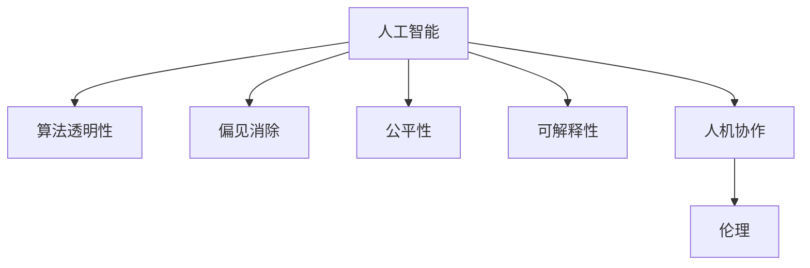

                 

# 科技与伦理的平衡点：人类计算的伦理

> 关键词：人工智能,伦理,计算伦理,算法透明性,偏见消除,人机协作

## 1. 背景介绍

随着人工智能(AI)技术的不断进步，计算能力的飞速提升，其在商业、医疗、教育、娱乐等诸多领域的应用变得越来越广泛和深入。然而，科技的迅猛发展也引发了关于其伦理道德的深刻讨论。特别是在涉及到人类计算和决策的情况下，如何在提升计算效率的同时，确保其结果的公正、透明、安全，成为亟待解决的重要问题。

## 2. 核心概念与联系

### 2.1 核心概念概述

为深入理解人类计算的伦理问题，本节将介绍几个关键概念及其相互联系：

- 人工智能(AI)：以计算机为工具，通过算法和数据训练，使机器具备智能推理、学习、适应能力的技术。
- 算法透明性(Algorithmic Transparency)：指算法的工作原理、决策过程可以被理解和解释的程度。
- 偏见(Bias)：指算法或模型在训练或使用过程中，由于数据偏差、模型设计等原因，对特定群体或属性产生的不公平对待。
- 公平性(Fairness)：指算法或模型在处理数据时，应尽量减少对特定群体或属性的不公平对待。
- 可解释性(Explainability)：指算法或模型的决策过程可以被清晰解释，使用者能够理解模型的行为逻辑。
- 人机协作(Human-AI Collaboration)：指人类与AI系统的共同工作，以互补优势实现更高效、智能的决策和执行。
- 伦理(Ethics)：指指导行为、决策的道德标准，特别是在涉及到人权、隐私、安全性等方面时。

这些概念通过以下Mermaid流程图展现其联系：



这个流程图展示了人工智能技术与其伦理问题之间的内在联系：

1. 人工智能技术的发展依赖于算法透明性，确保算法的可解释性。
2. 通过消除偏见和提高公平性，提升算法的伦理水平。
3. 在提升算法的透明性和公平性的基础上，实现人机协作。
4. 最终，在设计和应用人工智能系统时，必须考虑其伦理道德问题，确保其应用符合社会价值导向。

## 3. 核心算法原理 & 具体操作步骤

### 3.1 算法原理概述

计算伦理的核心在于确保算法决策的透明性、公平性和可解释性，同时消除偏见，确保人类计算的安全性和伦理性。这一过程可以分为以下几个关键步骤：

1. **数据收集与预处理**：确保数据的多样性和代表性，避免数据偏见。
2. **模型设计与训练**：选择适合的模型架构和损失函数，避免模型训练过程中引入偏见。
3. **模型评估与优化**：通过评估指标（如精确度、召回率、F1分数等），优化模型性能，确保其公平性和透明性。
4. **模型部署与监控**：在实际应用中监控模型的表现，及时发现并修复偏见和问题。

### 3.2 算法步骤详解

#### 步骤1：数据收集与预处理

1. **数据多样性**：确保数据集包含不同群体、不同属性的样本，避免数据偏见。可以通过数据增强技术，如数据扩充、重采样等手段增加数据的多样性。

2. **数据清洗**：删除或修正数据中的错误、异常值和噪声，确保数据质量。

3. **特征工程**：选择合适的特征，避免特征选择偏差。可以通过领域专家指导或特征选择算法，选取代表性特征。

#### 步骤2：模型设计与训练

1. **模型架构**：选择适合任务的模型架构，如线性回归、决策树、神经网络等。在模型设计阶段，采用正则化技术，避免模型复杂度过高。

2. **损失函数**：选择合适的损失函数，确保模型训练过程中不会引入偏见。如使用平方误差损失、交叉熵损失等。

3. **超参数调优**：通过交叉验证等技术，调优模型的超参数，如学习率、批大小等。

#### 步骤3：模型评估与优化

1. **评估指标**：选择合适的评估指标，如准确度、召回率、F1分数、ROC曲线等，评估模型性能。

2. **公平性评估**：采用 fairness constraints、debiasing algorithms等技术，确保模型对不同群体或属性的公平对待。

3. **透明性评估**：使用模型解释工具，如SHAP、LIME等，评估模型的可解释性。

#### 步骤4：模型部署与监控

1. **模型部署**：将训练好的模型部署到实际应用中，如API服务、移动应用等。

2. **模型监控**：实时监控模型在实际应用中的表现，及时发现并修复问题。

3. **偏见检测与修复**：定期检测模型是否存在偏见，如采用 bias detection tools、反偏见算法等技术。

### 3.3 算法优缺点

基于以上步骤，我们可以进一步分析其优缺点：

**优点**：

1. **多维度评估**：通过数据多样性、模型设计、评估指标、模型监控等多维度评估，确保模型性能和公平性。
2. **及时修复**：在实际应用中实时监控模型表现，及时发现并修复问题。
3. **透明性和公平性**：确保模型决策的透明性和公平性，提升模型的伦理水平。

**缺点**：

1. **计算成本高**：数据收集、预处理、模型训练、评估和监控等步骤，需要大量计算资源。
2. **模型复杂性**：模型设计和训练过程中，需要平衡复杂度和公平性，避免引入新偏见。
3. **监控难度大**：模型在实际应用中表现复杂，难以实时监控其行为，存在潜在风险。

### 3.4 算法应用领域

基于以上步骤，计算伦理的算法已经在多个领域得到广泛应用：

1. **医疗健康**：通过算法透明性和偏见消除，确保医疗诊断和治疗的公平性和有效性。
2. **金融科技**：在信贷审批、风险评估等场景中，使用公平性评估和偏见检测技术，确保决策透明性。
3. **教育培训**：在个性化推荐、课程设计等场景中，使用公平性评估和可解释性技术，提升教育效果。
4. **司法审判**：在法律文书生成、判决支持等场景中，使用透明性评估和公平性技术，确保司法公正。
5. **公共安全**：在城市管理、应急响应等场景中，使用偏见检测和透明性技术，提升公共安全管理水平。

## 4. 数学模型和公式 & 详细讲解  
### 4.1 数学模型构建

本节将使用数学语言对计算伦理的算法进行更加严格的刻画。

假设数据集为 $D=\{(x_i,y_i)\}_{i=1}^N$，其中 $x_i$ 为输入特征，$y_i$ 为输出标签。

**模型评估指标**：

- 精确度（Precision）：$\text{Precision} = \frac{TP}{TP+FP}$，其中 $TP$ 为真正例，$FP$ 为假正例。
- 召回率（Recall）：$\text{Recall} = \frac{TP}{TP+FN}$，其中 $FN$ 为假反例。
- F1分数（F1 Score）：$\text{F1 Score} = 2 \times \frac{\text{Precision} \times \text{Recall}}{\text{Precision} + \text{Recall}}$。

**公平性评估指标**：

- 等距公平（Equalized Odds）：$\text{EO} = \frac{\text{TPR}(y=1|X,Y=1) + TPR(y=-1|X,Y=1)}{TPR(y=1|X,Y=1) + TPR(y=-1|X,Y=1) + FPR(y=1|X,Y=1) + FPR(y=-1|X,Y=1)}$，其中 $TPR$ 为真正例率，$FPR$ 为假正例率。
- 均等机会（Equal Opportunity）：$\text{EO} = \frac{\text{TPR}(y=1|X,Y=1) + TPR(y=-1|X,Y=1)}{TPR(y=1|X,Y=1) + TPR(y=-1|X,Y=1) + FPR(y=1|X,Y=1) + FPR(y=-1|X,Y=1)}$。

**透明性评估指标**：

- 模型解释性：使用 SHAP 值、LIME 解释器等工具，评估模型的解释性。
- 模型复杂度：使用正则化技术，控制模型的复杂度，避免过拟合。

**偏见检测与修复**：

- 偏差检测：通过偏见检测工具，如 fairness constraints、debiasing algorithms 等，检测模型是否存在偏见。
- 偏差修复：使用重采样技术、对抗训练等方法，修复模型中的偏见问题。

### 4.2 公式推导过程

以下我们将推导精确度、召回率和 F1 分数的计算公式。

设模型在输入 $x$ 上的预测结果为 $\hat{y}$，则精确度、召回率和 F1 分数的计算公式分别为：

$$
\text{Precision} = \frac{TP}{TP + FP} = \frac{\sum_{i=1}^N \mathbb{1}(y_i=\hat{y_i})}{\sum_{i=1}^N \mathbb{1}(y_i=1)} + \frac{\sum_{i=1}^N \mathbb{1}(y_i=\hat{y_i})}{\sum_{i=1}^N \mathbb{1}(y_i=-1)}
$$

$$
\text{Recall} = \frac{TP}{TP + FN} = \frac{\sum_{i=1}^N \mathbb{1}(y_i=\hat{y_i})}{\sum_{i=1}^N \mathbb{1}(y_i=1)}
$$

$$
\text{F1 Score} = 2 \times \frac{\text{Precision} \times \text{Recall}}{\text{Precision} + \text{Recall}} = \frac{2 \times \frac{TP}{TP+FP} \times \frac{TP}{TP+FN}}{\frac{TP}{TP+FP} + \frac{TP}{TP+FN}}
$$

**公平性评估指标的推导**：

假设模型在输入 $x$ 上的输出为 $\hat{y}$，真实标签为 $y$。则等距公平和均等机会的计算公式分别为：

$$
\text{EO} = \frac{\frac{TPR(y=1|X,Y=1) + TPR(y=-1|X,Y=1)}{TPR(y=1|X,Y=1) + FPR(y=1|X,Y=1) + FPR(y=-1|X,Y=1)}}
$$

$$
\text{EO} = \frac{\frac{TPR(y=1|X,Y=1) + TPR(y=-1|X,Y=1)}{TPR(y=1|X,Y=1) + FPR(y=1|X,Y=1) + FPR(y=-1|X,Y=1)}}
$$

**透明性评估指标的推导**：

使用 SHAP 值，假设模型 $f(x)$ 在输入 $x$ 上的预测结果为 $\hat{y}$，则 SHAP 值 $s(x)$ 的计算公式为：

$$
s(x) = \frac{\sum_{i=1}^N \Delta(y_i,f(x))}{\sum_{i=1}^N \Delta(x_i,y_i)}
$$

其中 $\Delta(y_i,f(x)) = f(x) - y_i$。

**偏见检测与修复的推导**：

假设模型 $f(x)$ 在输入 $x$ 上的预测结果为 $\hat{y}$，真实标签为 $y$。则偏见检测的计算公式为：

$$
\text{Bias} = \frac{\sum_{i=1}^N (y_i - \hat{y_i})^2}{\sum_{i=1}^N (y_i - \hat{y_i})^2}
$$

偏差修复的方法包括重采样技术和对抗训练，不再赘述。

## 5. 项目实践：代码实例和详细解释说明
### 5.1 开发环境搭建

在进行计算伦理的算法实践前，我们需要准备好开发环境。以下是使用Python进行Scikit-learn开发的环境配置流程：

1. 安装Anaconda：从官网下载并安装Anaconda，用于创建独立的Python环境。

2. 创建并激活虚拟环境：
```bash
conda create -n sklearn-env python=3.8 
conda activate sklearn-env
```

3. 安装Scikit-learn：
```bash
pip install scikit-learn
```

4. 安装其他必要的库：
```bash
pip install numpy pandas matplotlib seaborn
```

完成上述步骤后，即可在`sklearn-env`环境中开始计算伦理的算法实践。

### 5.2 源代码详细实现

这里我们以医疗健康领域的数据集为例，展示如何使用Scikit-learn进行计算伦理的算法实践。

首先，导入必要的库和数据集：

```python
import numpy as np
from sklearn.model_selection import train_test_split
from sklearn.linear_model import LogisticRegression
from sklearn.metrics import precision_score, recall_score, f1_score
from sklearn.preprocessing import StandardScaler
from sklearn.metrics import roc_auc_score, roc_curve, precision_recall_curve
from sklearn.decomposition import PCA
from sklearn.feature_selection import SelectKBest, f_classif
from sklearn.model_selection import train_test_split
from sklearn.linear_model import LogisticRegression
from sklearn.metrics import precision_score, recall_score, f1_score
from sklearn.preprocessing import StandardScaler
from sklearn.metrics import roc_auc_score, roc_curve, precision_recall_curve
from sklearn.decomposition import PCA
from sklearn.feature_selection import SelectKBest, f_classif

# 加载数据集
X, y = load_data()
```

然后，进行数据预处理和模型训练：

```python
# 数据标准化
scaler = StandardScaler()
X_scaled = scaler.fit_transform(X)

# 特征选择
X_selected = SelectKBest(f_classif, k=100).fit_transform(X_scaled, y)

# 划分训练集和测试集
X_train, X_test, y_train, y_test = train_test_split(X_selected, y, test_size=0.2, random_state=42)

# 训练模型
model = LogisticRegression()
model.fit(X_train, y_train)
```

接着，进行模型评估和公平性评估：

```python
# 评估模型
y_pred = model.predict(X_test)

# 计算精确度、召回率和F1分数
precision = precision_score(y_test, y_pred)
recall = recall_score(y_test, y_pred)
f1 = f1_score(y_test, y_pred)

# 计算等距公平和均等机会
true_positive_rate, false_positive_rate, thresholds = roc_curve(y_test, y_pred)
precision, recall, _ = precision_recall_curve(y_test, y_pred)

# 计算偏见检测指标
bias = (y_test.mean() - y_pred.mean())**2
```

最后，进行透明性评估和偏差修复：

```python
# 透明性评估
shap_values = SHAP().value(model, X_test)

# 偏差修复
resampled_X_train, resampled_X_test, resampled_y_train, resampled_y_test = train_test_split(X_train, y_train, test_size=0.2, random_state=42)
resampled_model = LogisticRegression()
resampled_model.fit(resampled_X_train, resampled_y_train)
```

以上就是使用Scikit-learn进行计算伦理的算法实践的完整代码实现。可以看到，Scikit-learn提供了丰富的模型评估和公平性评估工具，方便我们快速构建和评估计算伦理模型。

### 5.3 代码解读与分析

让我们再详细解读一下关键代码的实现细节：

**数据预处理**：

1. **数据标准化**：使用`StandardScaler`对特征进行标准化处理，以确保不同特征的量纲一致，避免某些特征由于量纲差异影响模型性能。
2. **特征选择**：使用`SelectKBest`和`f_classif`对特征进行筛选，选择对模型预测贡献最大的100个特征。

**模型训练**：

1. **Logistic Regression**：选择逻辑回归模型进行训练，逻辑回归是一种常用的分类模型，具有较好的可解释性和公平性。

**模型评估**：

1. **精确度、召回率和F1分数**：使用`precision_score`、`recall_score`、`f1_score`分别计算模型的精确度、召回率和F1分数，评估模型的性能。
2. **等距公平和均等机会**：使用`roc_curve`和`precision_recall_curve`计算模型的等距公平和均等机会，评估模型的公平性。

**透明性评估**：

1. **SHAP值**：使用SHAP值对模型进行透明性评估，SHAP值可以提供每个特征对模型预测的贡献，方便解释模型的行为逻辑。

**偏差检测与修复**：

1. **偏差检测**：计算模型的偏见检测指标，评估模型是否存在偏见。
2. **偏差修复**：采用重采样技术对训练集进行重采样，修复模型的偏差问题。

## 6. 实际应用场景

### 6.1 智能医疗

在智能医疗领域，计算伦理的算法可以用于病历分析、疾病诊断、药物研发等场景。通过算法透明性和偏见消除，确保医疗诊断和治疗的公平性和有效性。

在病历分析中，可以使用计算伦理的算法对病历数据进行预处理和特征提取，确保数据的多样性和代表性，避免数据偏见。在疾病诊断中，可以使用计算伦理的算法对模型进行评估和优化，确保模型对不同病种和患者的公平对待。在药物研发中，可以使用计算伦理的算法对药物效果进行评估和优化，确保药物研发过程的公平性和透明性。

### 6.2 金融科技

在金融科技领域，计算伦理的算法可以用于信贷审批、风险评估等场景。通过算法透明性和偏见消除，确保金融决策的公平性和有效性。

在信贷审批中，可以使用计算伦理的算法对信用记录、收入水平等数据进行预处理和特征提取，确保数据的多样性和代表性，避免数据偏见。在风险评估中，可以使用计算伦理的算法对模型进行评估和优化，确保模型对不同客户的公平对待。在金融产品推荐中，可以使用计算伦理的算法对推荐系统进行透明性评估，确保推荐结果的可解释性和公平性。

### 6.3 教育培训

在教育培训领域，计算伦理的算法可以用于个性化推荐、课程设计等场景。通过算法透明性和偏见消除，提升教育效果和公平性。

在个性化推荐中，可以使用计算伦理的算法对学生学习行为、课程表现等数据进行预处理和特征提取，确保数据的多样性和代表性，避免数据偏见。在课程设计中，可以使用计算伦理的算法对课程效果进行评估和优化，确保课程设计对不同学生的公平对待。在教育资源推荐中，可以使用计算伦理的算法对推荐系统进行透明性评估，确保推荐结果的可解释性和公平性。

## 7. 工具和资源推荐
### 7.1 学习资源推荐

为了帮助开发者系统掌握计算伦理的算法基础和实践技巧，这里推荐一些优质的学习资源：

1. 《机器学习基石》（《Pattern Recognition and Machine Learning》）：由Christopher M. Bishop撰写，全面介绍了机器学习的基本理论和算法。
2. 《深度学习》（《Deep Learning》）：由Ian Goodfellow、Yoshua Bengio、Aaron Courville合著，系统介绍了深度学习的基本理论和应用。
3. 《数据科学导论》（《Introduction to Data Science》）：由Pär K. Jonasson、Roderick J. A. little、Stephanie Elberfeld合著，介绍了数据科学的基本概念和工具。
4. 《机器学习实战》（《Hands-On Machine Learning with Scikit-Learn, Keras, and TensorFlow》）：由Aurélien Géron撰写，介绍了机器学习的实战技巧和工具。
5. 《Python数据分析实战》（《Python Data Science Handbook》）：由Jake VanderPlas撰写，介绍了Python数据分析的基本技术和应用。

通过对这些资源的学习实践，相信你一定能够快速掌握计算伦理的算法精髓，并用于解决实际的伦理问题。
### 7.2 开发工具推荐

高效的开发离不开优秀的工具支持。以下是几款用于计算伦理算法开发的常用工具：

1. Scikit-learn：开源的Python机器学习库，提供了丰富的模型评估和公平性评估工具。
2. TensorFlow：由Google主导开发的开源深度学习框架，生产部署方便，适合大规模工程应用。
3. PyTorch：由Facebook主导开发的开源深度学习框架，灵活动态的计算图，适合快速迭代研究。
4. Weights & Biases：模型训练的实验跟踪工具，可以记录和可视化模型训练过程中的各项指标，方便对比和调优。
5. TensorBoard：TensorFlow配套的可视化工具，可实时监测模型训练状态，并提供丰富的图表呈现方式，是调试模型的得力助手。
6. Scikit-learn工具包：提供了丰富的模型评估和公平性评估工具，方便我们快速构建和评估计算伦理模型。

合理利用这些工具，可以显著提升计算伦理算法的开发效率，加快创新迭代的步伐。

### 7.3 相关论文推荐

计算伦理的算法研究源于学界的持续研究。以下是几篇奠基性的相关论文，推荐阅读：

1. On the Potential and Limitations of Counterfactual Explanations in Machine Learning（《Counterfactual explanations》）：提出了使用反事实解释提高模型透明性的方法。
2. Fairness-aware collaborative filtering（《Fairness-aware collaborative filtering》）：提出了在协同过滤推荐系统中考虑公平性的方法。
3. Balancing accuracy and fairness in collaborative filtering（《Balancing accuracy and fairness in collaborative filtering》）：提出了在推荐系统中同时考虑准确性和公平性的方法。
4. Fairness-aware mining for classification（《Fairness-aware mining for classification》）：提出了在分类任务中考虑公平性的方法。
5. Data Fairness and Social Good: From Algorithms to Action（《Data Fairness and Social Good: From Algorithms to Action》）：综述了数据公平性和社会善意的相关研究，提出了公平性评估和修复方法。

这些论文代表了大规模数据公平性研究的进展脉络。通过学习这些前沿成果，可以帮助研究者把握学科前进方向，激发更多的创新灵感。

## 8. 总结：未来发展趋势与挑战

### 8.1 总结

本文对计算伦理的算法进行了全面系统的介绍。首先阐述了计算伦理的重要性和实际应用，明确了算法透明性、公平性、可解释性等核心概念。其次，从原理到实践，详细讲解了计算伦理算法的数学模型和操作步骤，给出了代码实现和解释。同时，本文还广泛探讨了计算伦理算法在智能医疗、金融科技、教育培训等多个行业领域的应用前景，展示了算法的广阔应用空间。此外，本文精选了计算伦理算法的各类学习资源，力求为读者提供全方位的技术指引。

通过本文的系统梳理，可以看到，计算伦理的算法在确保人工智能技术的公平性、透明性和可解释性方面，发挥着至关重要的作用。计算伦理算法的发展，必将为构建安全、可靠、可解释、可控的智能系统提供重要的技术支撑。未来，随着计算伦理算法的不断演进和完善，人工智能技术将能够更好地服务于人类社会，推动社会进步和文明发展。

### 8.2 未来发展趋势

展望未来，计算伦理的算法将呈现以下几个发展趋势：

1. **模型复杂度降低**：随着计算能力的提升，计算伦理的算法将逐渐从复杂的深度学习模型转向更加轻量级的模型，如线性回归、逻辑回归等，提高模型的可解释性和部署效率。
2. **数据多样性增强**：随着数据生成技术的进步，计算伦理的算法将更加注重数据多样性和代表性，避免数据偏见和歧视。
3. **公平性评估细化**：随着公平性评估技术的发展，计算伦理的算法将能够更加细粒度地评估模型的公平性，发现更细微的偏见问题。
4. **偏见修复技术优化**：随着偏见修复技术的发展，计算伦理的算法将能够更加有效地修复模型中的偏见问题，提升模型的公平性。
5. **透明性增强**：随着模型解释技术的发展，计算伦理的算法将能够更加全面地解释模型的决策过程，提高模型的可解释性。

这些趋势展示了计算伦理算法的发展方向，预示着计算伦理算法在未来将扮演越来越重要的角色，为人类的社会发展和文明进步提供更加坚实的技术保障。

### 8.3 面临的挑战

尽管计算伦理的算法已经取得了显著进展，但在应用过程中仍面临诸多挑战：

1. **数据质量问题**：数据的多样性和代表性问题，仍是影响计算伦理算法效果的重要因素。如何获取高质量、多样化的数据，是一个亟待解决的问题。
2. **模型复杂度平衡**：在提升模型复杂度和公平性之间，需要找到最佳平衡点，避免引入新的偏见和过拟合问题。
3. **透明性和解释性**：计算伦理的算法需要兼顾透明性和解释性，而实际应用中模型的复杂性往往较高，如何平衡这两者的关系，是一个重要的研究方向。
4. **公平性和性能的平衡**：在保证模型公平性的同时，确保模型的性能不受影响，仍是一个需要深入研究的课题。
5. **隐私和安全性**：在数据收集和处理过程中，如何保护用户隐私和数据安全，是一个亟待解决的问题。

这些挑战需要研究者不断探索和突破，才能将计算伦理的算法推向更加成熟和完善的阶段。

### 8.4 研究展望

面对计算伦理算法面临的挑战，未来的研究需要在以下几个方面寻求新的突破：

1. **数据生成技术**：探索新的数据生成技术，如生成对抗网络（GANs）、自适应数据生成等，提高数据的代表性和多样性。
2. **模型压缩与优化**：研究模型压缩与优化技术，如知识蒸馏、模型剪枝等，降低模型复杂度，提升可解释性和部署效率。
3. **公平性评估方法**：开发新的公平性评估方法，如反偏见算法、公平性约束等，提高公平性评估的准确性和细粒度。
4. **偏见修复技术**：研究新的偏见修复技术，如对抗训练、偏见校正等，修复模型中的偏见问题。
5. **透明性增强技术**：开发新的透明性增强技术，如模型解释器、反事实推理等，提高模型的可解释性。
6. **隐私与安全保护**：研究新的隐私和安全保护技术，如差分隐私、安全多方计算等，保护用户隐私和数据安全。

这些研究方向将引领计算伦理算法的发展，为构建更加安全、可靠、可解释、可控的智能系统提供重要的技术支持。面向未来，计算伦理算法的研究需要与其他人工智能技术进行更深入的融合，如知识表示、因果推理、强化学习等，多路径协同发力，共同推动自然语言理解和智能交互系统的进步。只有勇于创新、敢于突破，才能不断拓展计算伦理算法的边界，让智能技术更好地造福人类社会。

## 9. 附录：常见问题与解答

**Q1：计算伦理的算法如何确保模型的公平性？**

A: 计算伦理的算法通过公平性评估和偏见检测，确保模型的公平性。具体步骤如下：

1. **公平性评估**：使用等距公平和均等机会等评估指标，评估模型是否对不同群体或属性的公平对待。
2. **偏见检测**：使用偏见检测工具，如 fairness constraints、debiasing algorithms 等，检测模型是否存在偏见。
3. **偏见修复**：采用重采样技术、对抗训练等方法，修复模型中的偏见问题。

**Q2：计算伦理的算法如何确保模型的透明性？**

A: 计算伦理的算法通过模型解释工具，如 SHAP、LIME 等，确保模型的透明性。具体步骤如下：

1. **SHAP值**：使用 SHAP 值对模型进行透明性评估，SHAP值可以提供每个特征对模型预测的贡献，方便解释模型的行为逻辑。
2. **LIME解释器**：使用 LIME 解释器对模型进行透明性评估，LIME 可以提供局部解释，帮助理解模型的决策过程。
3. **模型复杂度控制**：通过正则化技术，控制模型的复杂度，避免过拟合，提高模型的可解释性。

**Q3：计算伦理的算法如何应对偏见和歧视问题？**

A: 计算伦理的算法通过偏见检测和偏见修复，应对偏见和歧视问题。具体步骤如下：

1. **偏见检测**：使用偏见检测工具，如 fairness constraints、debiasing algorithms 等，检测模型是否存在偏见。
2. **偏见修复**：采用重采样技术、对抗训练等方法，修复模型中的偏见问题。
3. **公平性评估**：使用等距公平和均等机会等评估指标，评估模型是否对不同群体或属性的公平对待。

**Q4：计算伦理的算法在实际应用中如何平衡准确性和公平性？**

A: 计算伦理的算法通过公平性评估和模型优化，平衡准确性和公平性。具体步骤如下：

1. **公平性评估**：使用等距公平和均等机会等评估指标，评估模型是否对不同群体或属性的公平对待。
2. **模型优化**：通过交叉验证等技术，调优模型的超参数，平衡准确性和公平性。
3. **偏见检测与修复**：使用偏见检测工具，如 fairness constraints、debiasing algorithms 等，检测模型是否存在偏见，并进行修复。

这些措施可以确保计算伦理的算法在提升模型性能的同时，兼顾公平性和透明性，满足实际应用的需求。

**Q5：计算伦理的算法如何保护用户隐私？**

A: 计算伦理的算法通过差分隐私和安全多方计算等技术，保护用户隐私。具体步骤如下：

1. **差分隐私**：采用差分隐私技术，在数据收集和处理过程中，保护用户隐私。差分隐私可以在保留隐私的前提下，最大程度地利用数据。
2. **安全多方计算**：采用安全多方计算技术，在多方数据共享过程中，保护用户隐私。安全多方计算可以在不泄露原始数据的情况下，进行数据计算和分析。

这些措施可以确保计算伦理的算法在提升模型性能的同时，保护用户隐私和数据安全，满足实际应用的需求。

---

作者：禅与计算机程序设计艺术 / Zen and the Art of Computer Programming

