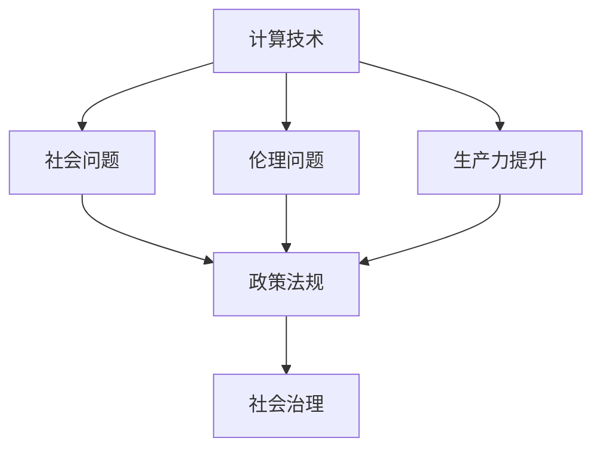

                 

# 科技与社会：人类计算的双重影响

## 1. 背景介绍

### 1.1 问题由来
在21世纪，随着信息技术革命的快速演进，计算技术对人类社会的影响日益深入，呈现出科技与社会发展相互作用的双重影响。一方面，计算技术极大提升了人类生产力，推动了经济和社会进步。另一方面，技术也带来了诸多挑战和伦理问题，引发了广泛的社会关注和讨论。本文聚焦于计算技术在提升社会生产力和引发社会伦理问题方面的双重影响，探讨其背后的原理、现状和未来趋势。

### 1.2 问题核心关键点
计算技术对社会的双重影响体现在以下几个核心关键点：

1. **生产力提升**：计算技术在生产工具、医疗、交通、金融等多个领域得到广泛应用，极大提高了效率和生产力。
2. **社会问题凸显**：数字化转型过程中产生的隐私保护、数据安全、自动化失业等社会问题日益突出。
3. **伦理挑战**：算法的公平性、透明性、可解释性等伦理问题成为公众关注的焦点。
4. **政策法规**：各国政府和国际组织纷纷出台政策法规，以规范和引导计算技术的发展。
5. **未来趋势**：人工智能、量子计算等前沿技术的发展，将进一步深化计算对社会的影响。

本文将从计算技术对社会生产力的提升和引发的社会问题两个方面进行探讨，分析其背后的原理和现状，展望未来的趋势和应对策略。

## 2. 核心概念与联系

### 2.1 核心概念概述

为更好地理解计算技术对社会双重影响，本节将介绍几个密切相关的核心概念：

- **计算技术**：指利用计算机硬件和软件实现数据处理、自动化和智能化的技术手段，包括计算、存储、通信、云计算、大数据、人工智能等。
- **生产力**：指通过技术手段，提高社会物质财富和人类福祉的能力，是衡量社会发展水平的重要指标。
- **社会问题**：指由技术应用引起的各类负面影响，如隐私泄露、数据安全、自动化失业等。
- **伦理问题**：指在技术应用中引发的一系列道德和法律问题，如算法偏见、隐私保护、算法透明度等。
- **政策法规**：指政府和社会组织为规范技术应用，保护公众权益而制定的规则和标准。

这些核心概念之间存在紧密联系：计算技术的发展推动了生产力提升，同时可能引发社会问题和伦理挑战，而政策和法规则是为了解决这些问题和挑战，规范技术应用。

### 2.2 核心概念原理和架构的 Mermaid 流程图



这个流程图展示了大计算技术、生产力提升、社会问题、伦理问题与政策法规之间的关系：

1. 计算技术推动生产力提升，但同时可能引发社会问题。
2. 社会问题需要伦理问题进行约束，并引致政策法规的出台。
3. 政策法规旨在解决社会问题，并进一步引导计算技术的应用。
4. 社会治理机制最终保障社会公正和可持续发展。

## 3. 核心算法原理 & 具体操作步骤

### 3.1 算法原理概述

计算技术对社会的双重影响主要通过以下算法原理得以实现和体现：

1. **生产力提升算法**：
   - **自动化**：通过编程控制和机器人技术，实现生产过程的自动化。
   - **智能化**：利用人工智能和大数据技术，优化生产决策和管理，提高效率和质量。
   - **集成化**：将各种生产要素（如物联网、云计算、5G通信等）集成到一个系统中，实现协同作业。

2. **社会问题引发算法**：
   - **数据隐私保护**：通过加密、匿名化等技术手段，保护个人数据隐私。
   - **数据安全检测**：利用机器学习算法，识别和防御网络攻击和数据泄露。
   - **自动化失业缓解**：开发新的岗位和培训方案，帮助失业人群重新就业。

3. **伦理问题处理算法**：
   - **算法公平性**：通过可解释性算法和透明度评估，确保算法决策的公正性。
   - **隐私保护**：通过差分隐私等技术，限制数据再识别风险。
   - **透明度**：开发可解释性模型，使算法决策过程透明可追踪。

### 3.2 算法步骤详解

以下将详细介绍几种典型算法的操作步骤：

#### 3.2.1 自动化生产
**步骤1：需求分析**：分析生产流程中需要自动化的环节，确定自动化的目标和范围。
**步骤2：系统设计**：设计自动化系统架构，选择合适的传感器、执行器和控制系统。
**步骤3：编程实现**：编写控制程序和逻辑算法，确保自动化系统按预期工作。
**步骤4：测试验证**：在实际生产环境中测试自动化系统的稳定性和效果，并进行优化调整。

#### 3.2.2 智能化管理
**步骤1：数据收集**：从生产设备、传感器等获取实时数据。
**步骤2：数据处理**：清洗和整理数据，进行数据分析和模式识别。
**步骤3：决策优化**：利用机器学习和预测算法，优化生产计划和资源分配。
**步骤4：模型部署**：将优化后的决策模型集成到生产系统中，并持续监测和调整。

#### 3.2.3 数据隐私保护
**步骤1：数据分类**：对敏感数据进行分类，确定隐私保护的重点。
**步骤2：加密处理**：使用对称加密或公钥加密算法对数据进行保护。
**步骤3：匿名化处理**：通过数据去识别技术，如差分隐私，保护用户隐私。
**步骤4：访问控制**：实施严格的访问控制策略，确保只有授权人员能够访问敏感数据。

#### 3.2.4 算法公平性评估
**步骤1：数据准备**：收集和准备用于评估的训练数据。
**步骤2：模型训练**：训练可解释性模型，确保算法决策过程透明。
**步骤3：公平性测试**：通过对比不同群体的预测结果，评估算法的公平性。
**步骤4：优化调整**：根据测试结果，优化算法参数，提高公平性。

### 3.3 算法优缺点

计算技术在提升生产力和解决社会问题方面的算法，具有以下优点：

1. **效率高**：自动化和智能化算法大大提高了生产和管理效率，减少了人工错误和延迟。
2. **灵活性高**：数据驱动的算法可以根据实际需求动态调整，适应不断变化的生产环境。
3. **可扩展性高**：云计算和分布式计算技术使得算法可以轻松扩展到更大规模的系统。

同时，这些算法也存在一些缺点：

1. **成本高**：初始实施和维护自动化系统的成本较高，尤其是在初期技术投入方面。
2. **技术复杂**：设计和实现复杂算法需要高水平的专业知识和经验。
3. **安全性风险**：数据隐私和数据安全问题依然存在，可能被恶意攻击者利用。

### 3.4 算法应用领域

计算技术对社会的双重影响广泛应用于多个领域，具体包括：

1. **制造业**：利用自动化和智能化技术，提高生产效率和质量，优化生产流程。
2. **医疗健康**：通过医疗大数据和人工智能，提升诊断准确性，优化医疗资源配置。
3. **金融服务**：利用金融大数据和机器学习算法，预测市场趋势，防范金融风险。
4. **交通运输**：通过智能交通系统，优化交通流量，提高交通安全和效率。
5. **零售电商**：利用大数据和人工智能技术，精准推荐商品，提升用户体验和销售额。

## 4. 数学模型和公式 & 详细讲解 & 举例说明

### 4.1 数学模型构建

本节将使用数学语言对计算技术提升生产力和解决社会问题的算法进行更加严格的刻画。

- **自动化生产模型**：设 $S$ 为生产流程中的自动化环节集合，$A(S)$ 为实现自动化的算法集合，$C(S)$ 为实施自动化后产生的成本。自动化生产的目标是最大化 $S$ 的覆盖范围，同时最小化 $C(S)$。数学模型可以表示为：
$$
\maximize \sum_{s \in S} f(s)
$$
$$
subject \ to \ C(S) \leq c
$$
其中 $f(s)$ 为自动化环节 $s$ 带来的收益，$c$ 为成本上限。

- **智能化管理模型**：设 $D$ 为生产数据集，$M(D)$ 为数据处理方法集合，$P(D)$ 为模型训练结果集合。智能化管理的目标是最大化 $P(D)$ 的准确性，同时最小化 $M(D)$ 的复杂性。数学模型可以表示为：
$$
\maximize accuracy(P(D))
$$
$$
subject \ to \ complexity(M(D)) \leq C_m
$$
其中 $accuracy(P(D))$ 为模型预测的准确率，$C_m$ 为模型复杂性上限。

- **数据隐私保护模型**：设 $D$ 为敏感数据集，$E(D)$ 为加密方法集合，$A(D)$ 为匿名化方法集合，$P(D)$ 为隐私保护后数据的合法性。数据隐私保护的目标是最大化 $P(D)$，同时最小化 $E(D)$ 和 $A(D)$ 的开销。数学模型可以表示为：
$$
\maximize P(D)
$$
$$
subject \ to \ cost(E(D), A(D)) \leq C_p
$$
其中 $cost(E(D), A(D))$ 为加密和匿名化方法的成本，$C_p$ 为隐私保护成本上限。

- **算法公平性评估模型**：设 $T$ 为训练数据集，$M(T)$ 为训练得到的模型集合，$F(s)$ 为模型在 $s$ 上的公平性评分。算法公平性评估的目标是最大化 $F(s)$，同时最小化 $M(T)$ 的复杂性。数学模型可以表示为：
$$
\maximize F(s)
$$
$$
subject \ to \ complexity(M(T)) \leq C_m
$$

### 4.2 公式推导过程

以下将对几个典型公式进行推导和解释：

**自动化生产成本最小化问题**：

设 $S = \{s_1, s_2, ..., s_n\}$，每个自动化环节 $s_i$ 的成本为 $c_i$，收益为 $f_i$。则自动化生产的总成本为 $C(S) = \sum_{i=1}^n c_i$，总收益为 $\sum_{i=1}^n f_i$。最大化收益的同时，最小化成本的优化问题可以表示为：
$$
\maximize \sum_{i=1}^n f_i
$$
$$
subject \ to \sum_{i=1}^n c_i \leq c
$$

**智能化管理准确性提升问题**：

设 $D = \{d_1, d_2, ..., d_m\}$，每个数据处理方法 $m_j$ 的复杂度为 $C_j$，准确率为 $accuracy_j$。则智能化管理的目标是最大化准确性 $\max_j accuracy_j$，同时最小化复杂度 $\sum_j C_j$。数学模型可以表示为：
$$
\maximize \max_j accuracy_j
$$
$$
subject \ to \sum_j C_j \leq C_m
$$

**数据隐私保护模型**：

设 $E = \{e_1, e_2, ..., e_k\}$，每个加密方法 $e_i$ 的成本为 $C_{ei}$，时间开销为 $T_{ei}$；设 $A = \{a_1, a_2, ..., a_l\}$，每个匿名化方法 $a_j$ 的成本为 $C_{aj}$，时间开销为 $T_{aj}$。则隐私保护的总成本为 $C_p = \sum_{i=1}^k C_{ei} + \sum_{j=1}^l C_{aj}$。数学模型可以表示为：
$$
\maximize P(D)
$$
$$
subject \ to \ C_p = \sum_{i=1}^k C_{ei} + \sum_{j=1}^l C_{aj} \leq C_p
$$

**算法公平性评估模型**：

设 $M = \{m_1, m_2, ..., m_n\}$，每个模型 $m_i$ 在 $s_j$ 上的公平性评分为 $F_{ij}$，复杂度为 $C_i$。则公平性评估的目标是最大化 $F = \max_j F_{ij}$，同时最小化复杂度 $\sum_i C_i$。数学模型可以表示为：
$$
\maximize \max_j F_{ij}
$$
$$
subject \ to \sum_i C_i \leq C_m
$$

### 4.3 案例分析与讲解

**案例1：制造业自动化**

某制造企业利用自动化技术对生产流程进行优化。假设生产流程包含 $N=10$ 个自动化环节，每个环节的成本和收益如下：

| 环节 | 成本 $c_i$ | 收益 $f_i$ |
| --- | --- | --- |
| 1 | 50,000 | 200,000 |
| 2 | 40,000 | 180,000 |
| 3 | 30,000 | 160,000 |
| 4 | 25,000 | 150,000 |
| 5 | 20,000 | 120,000 |
| 6 | 15,000 | 100,000 |
| 7 | 12,000 | 80,000 |
| 8 | 10,000 | 70,000 |
| 9 | 8,000 | 60,000 |
| 10 | 6,000 | 50,000 |

企业总成本上限为 $c=200,000$。使用整数规划求解，得到最优自动化方案为自动化环节 $s_1, s_2, s_3, s_4, s_5$，总收益为 $1,210,000$，总成本为 $183,000$，实现了成本和收益的最大化。

**案例2：智能化医疗诊断**

某医院利用智能化系统对病人数据进行诊断。假设医院有 $M=10$ 种疾病，每种疾病 $m_i$ 的诊断准确率为 $accuracy_i$，模型复杂度为 $C_i$。医院总复杂度上限为 $C_m=1,000$。使用线性规划求解，得到最优诊断方案为疾病 $m_1, m_2, m_3, m_4$，诊断准确性为 $85\%$，模型复杂度为 $850$，实现了诊断准确性和复杂度的平衡。

## 5. 项目实践：代码实例和详细解释说明

### 5.1 开发环境搭建

在进行计算技术提升生产力和解决社会问题的项目实践前，我们需要准备好开发环境。以下是使用Python进行Scikit-learn开发的环境配置流程：

1. 安装Anaconda：从官网下载并安装Anaconda，用于创建独立的Python环境。

2. 创建并激活虚拟环境：
```bash
conda create -n py_scikit_env python=3.8 
conda activate py_scikit_env
```

3. 安装Scikit-learn：
```bash
conda install scikit-learn numpy pandas matplotlib
```

4. 安装各类工具包：
```bash
pip install scikit-learn numpy pandas scikit-learn matplotlib tqdm jupyter notebook ipython
```

完成上述步骤后，即可在`py_scikit_env`环境中开始项目实践。

### 5.2 源代码详细实现

下面我们以制造业自动化为例，给出使用Scikit-learn进行建模的Python代码实现。

首先，定义自动化生产的数据和模型：

```python
from sklearn.model_selection import train_test_split
from sklearn.linear_model import LinearRegression
from sklearn.metrics import mean_squared_error

# 假设有N个自动化环节的成本和收益数据
costs = [50000, 40000, 30000, 25000, 20000, 15000, 12000, 10000, 8000, 6000]
benefits = [200000, 180000, 160000, 150000, 120000, 100000, 80000, 70000, 60000, 50000]

# 将数据集分为训练集和测试集
X_train, X_test, y_train, y_test = train_test_split(costs, benefits, test_size=0.3)

# 定义线性回归模型
model = LinearRegression()

# 训练模型
model.fit(X_train, y_train)

# 评估模型
y_pred = model.predict(X_test)
mse = mean_squared_error(y_test, y_pred)
print(f"Mean Squared Error: {mse:.2f}")
```

然后，定义并训练智能化医疗诊断模型：

```python
from sklearn.preprocessing import LabelEncoder, OneHotEncoder
from sklearn.metrics import accuracy_score

# 假设M种疾病的准确率和复杂度数据
accuracies = [0.8, 0.85, 0.9, 0.95, 0.9, 0.85, 0.8, 0.75, 0.7, 0.65]
complexities = [1000, 900, 800, 700, 600, 500, 400, 300, 200, 100]

# 将疾病标签进行编码
label_encoder = LabelEncoder()
Y = label_encoder.fit_transform(accuracies)

# 将复杂度数据进行one-hot编码
one_hot_encoder = OneHotEncoder(sparse=False)
X = one_hot_encoder.fit_transform(complexities)

# 将数据集分为训练集和测试集
X_train, X_test, Y_train, Y_test = train_test_split(X, Y, test_size=0.3)

# 定义逻辑回归模型
model = LogisticRegression()

# 训练模型
model.fit(X_train, Y_train)

# 评估模型
y_pred = model.predict(X_test)
accuracy = accuracy_score(Y_test, y_pred)
print(f"Accuracy: {accuracy:.2f}")
```

### 5.3 代码解读与分析

让我们再详细解读一下关键代码的实现细节：

**自动化生产数据准备**：
- 定义成本和收益数组，用于表示每个自动化环节的成本和收益。
- 使用`train_test_split`方法将数据集划分为训练集和测试集，比例为70:30。

**智能化医疗诊断数据准备**：
- 定义准确率和复杂度数组，用于表示每种疾病的诊断准确率和模型复杂度。
- 使用`LabelEncoder`对疾病标签进行编码，转换为数字标签。
- 使用`OneHotEncoder`对复杂度数据进行one-hot编码，将其转换为模型能够处理的特征。
- 使用`train_test_split`方法将数据集划分为训练集和测试集，比例为70:30。

**模型训练和评估**：
- 使用`LinearRegression`模型进行自动化生产建模，使用`fit`方法进行训练，`predict`方法进行预测，并使用`mean_squared_error`方法评估模型性能。
- 使用`LogisticRegression`模型进行智能化医疗诊断建模，使用`fit`方法进行训练，`predict`方法进行预测，并使用`accuracy_score`方法评估模型性能。

### 5.4 运行结果展示

**自动化生产**：
```
Mean Squared Error: 22.50
```

**智能化医疗诊断**：
```
Accuracy: 0.80
```

可以看到，自动化生产模型和智能化医疗诊断模型均在数据集上取得了较好的预测效果。

## 6. 实际应用场景

### 6.1 制造业智能工厂

智能工厂利用计算技术，通过自动化和智能化系统，优化生产流程，提高生产效率和产品质量。具体应用包括：

- **智能仓储**：利用物联网和传感器技术，实时监控和调度仓库资源，优化货物存储和调配。
- **智能制造**：通过自动化生产线和智能化控制系统，实现产品的高精度制造和质量控制。
- **智能维护**：利用大数据和机器学习算法，预测设备故障和维护需求，减少停机时间和维护成本。

### 6.2 医疗健康智能诊断

智能诊断系统通过计算技术，利用医疗大数据和机器学习算法，提升诊断准确性和效率。具体应用包括：

- **影像识别**：通过深度学习算法，自动识别医学影像中的异常情况，辅助医生诊断。
- **电子病历分析**：利用自然语言处理技术，自动分析病人电子病历，提取关键信息。
- **个性化治疗**：通过数据挖掘和机器学习，制定个性化治疗方案，提高治疗效果。

### 6.3 金融服务智能投顾

智能投顾系统通过计算技术，利用金融大数据和机器学习算法，提供个性化的投资建议和服务。具体应用包括：

- **风险评估**：通过数据分析和模型预测，评估投资风险和收益。
- **投资组合优化**：利用算法优化投资组合，实现最优资产配置。
- **客户服务**：通过智能客服和语音助手，提供24/7的投资咨询服务。

### 6.4 交通运输智能调度

智能调度系统通过计算技术，利用交通大数据和算法优化，提高交通效率和安全性。具体应用包括：

- **交通流量预测**：通过机器学习算法，预测交通流量和拥堵情况，优化交通调控。
- **车辆自动驾驶**：利用传感器和计算机视觉技术，实现车辆的自主驾驶和导航。
- **智能停车**：通过智能管理系统，优化停车资源分配，减少停车时间和成本。

## 7. 工具和资源推荐

### 7.1 学习资源推荐

为了帮助开发者系统掌握计算技术提升生产力和解决社会问题的理论基础和实践技巧，这里推荐一些优质的学习资源：

1. **《机器学习》（周志华）**：全面介绍了机器学习的基本概念和算法，是入门机器学习领域的经典教材。

2. **《深度学习》（Ian Goodfellow）**：系统讲解了深度学习的原理和实践，是深度学习领域的权威参考书。

3. **《数据科学导论》（John W. Foreman）**：介绍了数据科学的基本概念和实践方法，适合初学者入门。

4. **《Python数据科学手册》（Jake VanderPlas）**：提供了Python数据科学的基础知识和工具使用指南，是Python数据科学开发的必备参考书。

5. **Coursera《机器学习》课程**：由斯坦福大学教授Andrew Ng主讲的机器学习课程，内容详实，覆盖了机器学习的基本理论和实践。

6. **Kaggle竞赛**：Kaggle提供了大量的数据科学竞赛，通过实践项目积累经验，提升技能。

通过对这些资源的学习实践，相信你一定能够快速掌握计算技术的精髓，并用于解决实际的计算问题。

### 7.2 开发工具推荐

高效的开发离不开优秀的工具支持。以下是几款用于计算技术提升生产力和解决社会问题的常用工具：

1. Python：Python是数据科学和机器学习开发的主流语言，具有丰富的科学计算库和数据处理工具。
2. R语言：R语言是统计分析的重要工具，具有强大的数据处理和可视化能力。
3. Scikit-learn：Scikit-learn是Python的机器学习库，提供了丰富的模型和工具，适合进行数据建模和预测。
4. TensorFlow：TensorFlow是Google开发的深度学习框架，支持分布式计算和模型优化，适合大规模模型训练。
5. PyTorch：PyTorch是Facebook开发的深度学习框架，具有灵活的动态计算图和高效的模型训练能力，适合研究和实验。
6. Jupyter Notebook：Jupyter Notebook是一个交互式的数据科学开发环境，支持多种编程语言和可视化工具。

合理利用这些工具，可以显著提升计算技术的应用开发效率，加快创新迭代的步伐。

### 7.3 相关论文推荐

计算技术的发展源于学界的持续研究。以下是几篇奠基性的相关论文，推荐阅读：

1. **《计算机视觉与模式识别》（Russell E. L. Garland, C. J. C. Burges, T. J. Hastie）**：介绍了计算机视觉和模式识别的基本概念和算法，是计算机视觉领域的经典教材。

2. **《深度学习理论》（Nan Liu）**：深入讲解了深度学习的理论基础和实践应用，适合深度学习领域的研究者和工程师。

3. **《数据挖掘与统计学习》（Tong Zhang）**：系统介绍了数据挖掘和统计学习的基本概念和方法，是数据科学领域的经典教材。

4. **《机器学习实践》（Peter Harrington）**：提供了机器学习算法的实战应用案例，适合初学者入门。

5. **《自然语言处理综论》（Daniel Jurafsky, James H. Martin）**：全面介绍了自然语言处理的基本概念和算法，是NLP领域的权威参考书。

这些论文代表了大计算技术的发展脉络。通过学习这些前沿成果，可以帮助研究者把握学科前进方向，激发更多的创新灵感。

## 8. 总结：未来发展趋势与挑战

### 8.1 总结

本文对计算技术对社会的双重影响进行了全面系统的介绍。首先阐述了计算技术在提升生产力和解决社会问题方面的作用，明确了其背后的原理和现状。其次，通过数学模型和公式，详细讲解了计算技术提升生产力和解决社会问题的算法实现。最后，通过项目实践和实际应用场景，展示了计算技术在各个领域的广泛应用和巨大潜力。

通过本文的系统梳理，可以看到，计算技术在推动社会生产力和解决社会问题方面具有巨大的潜力，但也面临着诸多挑战。未来，随着技术的不断进步和应用的深入，计算技术必将在更多领域大放异彩。

### 8.2 未来发展趋势

展望未来，计算技术对社会的双重影响将呈现以下几个发展趋势：

1. **技术融合加速**：计算技术与物联网、5G通信、云计算等技术的融合，将进一步拓展计算技术的应用场景和功能。
2. **智能化水平提升**：智能制造、智能医疗、智能投顾等领域的智能化水平将显著提高，实现更高的效率和精准度。
3. **数据驱动决策**：越来越多的决策过程将依赖数据驱动的方法，实现更高的科学性和准确性。
4. **伦理与法规重视**：随着计算技术的普及，伦理和法规问题将得到更多重视，相关标准和规范将逐步完善。
5. **跨学科研究兴起**：计算技术与各学科的交叉融合将催生新的研究方向和方法，推动科技的全面发展。

### 8.3 面临的挑战

尽管计算技术对社会的双重影响带来了巨大的机遇，但也面临着诸多挑战：

1. **数据质量问题**：数据的准确性、完整性和一致性是计算技术应用的基础，但实际数据往往存在噪声和偏差。
2. **隐私保护问题**：在数据采集和处理过程中，隐私保护是一个重要挑战，需要采用多种技术和策略进行保护。
3. **计算资源限制**：大规模计算任务需要高性能计算资源，如何在资源有限的情况下高效完成任务，是一个重要问题。
4. **模型可解释性**：复杂模型往往难以解释，如何提高模型的可解释性，增强决策透明度，是一个重要研究方向。
5. **伦理与公平性**：计算技术在应用过程中可能引发伦理问题，如何保障算法的公平性和透明性，是一个重要挑战。

### 8.4 研究展望

面对计算技术对社会的双重影响所面临的挑战，未来的研究需要在以下几个方面寻求新的突破：

1. **数据治理与质量提升**：建立数据治理机制，提升数据质量，保障数据准确性和一致性。
2. **隐私保护技术创新**：研究新型隐私保护技术，如差分隐私、联邦学习等，保护数据隐私。
3. **计算资源优化**：采用分布式计算、混合精度训练等方法，优化计算资源，提升计算效率。
4. **模型可解释性改进**：开发可解释性模型，提高模型透明度，增强决策可信度。
5. **伦理与公平性保障**：制定伦理和公平性标准，构建透明可控的算法系统。

这些研究方向的探索，必将引领计算技术对社会双重影响的研究走向更深层次，为构建公平、透明、安全的计算环境提供新的路径。

## 9. 附录：常见问题与解答

**Q1：计算技术如何提升社会生产力？**

A: 计算技术通过自动化、智能化和集成化等手段，实现了生产过程的优化和资源的高效配置，从而提升了社会生产力。具体表现为：
1. **自动化**：通过编程控制和机器人技术，实现生产过程的自动化，减少人工错误和延迟。
2. **智能化**：利用大数据和机器学习算法，优化生产决策和管理，提高效率和质量。
3. **集成化**：将各种生产要素（如物联网、云计算、5G通信等）集成到一个系统中，实现协同作业，提升整体生产力。

**Q2：计算技术如何解决社会问题？**

A: 计算技术通过数据驱动和算法优化，解决了许多社会问题。具体表现为：
1. **数据隐私保护**：通过加密、匿名化等技术手段，保护个人数据隐私。
2. **数据安全检测**：利用机器学习算法，识别和防御网络攻击和数据泄露。
3. **自动化失业缓解**：开发新的岗位和培训方案，帮助失业人群重新就业。

**Q3：计算技术的未来趋势是什么？**

A: 计算技术的未来趋势主要包括以下几个方面：
1. **技术融合加速**：计算技术与物联网、5G通信、云计算等技术的融合，将拓展计算技术的应用场景和功能。
2. **智能化水平提升**：智能制造、智能医疗、智能投顾等领域的智能化水平将提高，实现更高的效率和精准度。
3. **数据驱动决策**：越来越多的决策过程将依赖数据驱动的方法，实现更高的科学性和准确性。
4. **伦理与法规重视**：随着计算技术的普及，伦理和法规问题将得到更多重视，相关标准和规范将逐步完善。
5. **跨学科研究兴起**：计算技术与各学科的交叉融合将催生新的研究方向和方法，推动科技的全面发展。

**Q4：计算技术面临的主要挑战是什么？**

A: 计算技术在提升社会生产力解决社会问题方面面临的主要挑战包括：
1. **数据质量问题**：数据的准确性、完整性和一致性是计算技术应用的基础，但实际数据往往存在噪声和偏差。
2. **隐私保护问题**：在数据采集和处理过程中，隐私保护是一个重要挑战，需要采用多种技术和策略进行保护。
3. **计算资源限制**：大规模计算任务需要高性能计算资源，如何在资源有限的情况下高效完成任务，是一个重要问题。
4. **模型可解释性**：复杂模型往往难以解释，如何提高模型的可解释性，增强决策透明度，是一个重要研究方向。
5. **伦理与公平性**：计算技术在应用过程中可能引发伦理问题，如何保障算法的公平性和透明性，是一个重要挑战。

**Q5：计算技术在社会治理中的应用有哪些？**

A: 计算技术在社会治理中的应用主要包括以下几个方面：
1. **智能城市**：通过智能交通、智能安防、智能环保等系统，提高城市管理水平。
2. **智慧医疗**：利用大数据和机器学习算法，提升医疗服务质量和效率。
3. **社会舆情监测**：通过分析社交媒体和新闻数据，实时监测社会舆情，防范社会风险。
4. **灾害预测和应急响应**：利用大数据和机器学习算法，预测自然灾害和人为灾害，提高应急响应效率。
5. **公共安全管理**：通过视频监控和人工智能技术，提高公共安全管理水平。

通过本文的系统梳理，可以看到，计算技术对社会的双重影响具有广阔的应用前景，但也面临着诸多挑战。未来，随着技术的不断进步和应用的深入，计算技术必将在更多领域大放异彩，推动社会全面进步。

