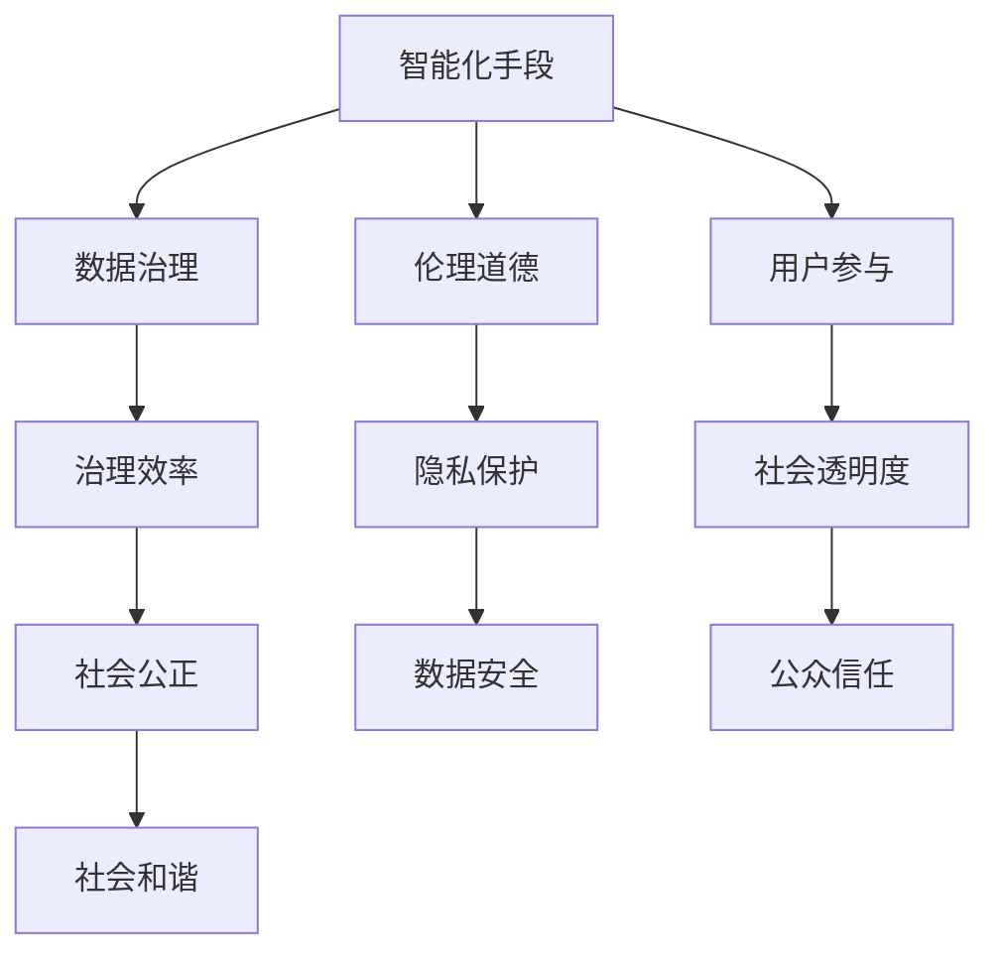

                 

# 科技创新：社会治理的新思路

## 1. 背景介绍

### 1.1 问题由来

随着科技的迅猛发展，社会治理的方式也面临着深刻的变革。传统意义上的社会治理往往依赖于人力和政策的有效结合，而如今，技术的进步为社会治理带来了新的可能。尤其是在大数据、人工智能、物联网等前沿科技的推动下，社会治理的模式正在发生根本性的变化。

科技创新为社会治理带来了前所未有的机遇与挑战。通过智能化的手段，可以更高效地处理社会问题，提升治理效率，实现精准施策，为公众提供更优质的服务。但同时，也伴随着数据安全、隐私保护、伦理道德等新的问题需要解决。

### 1.2 问题核心关键点

本文将从以下几个关键点探讨科技创新在社会治理中的应用：

- **智能化手段**：如何利用AI、大数据、物联网等技术手段提升社会治理的智能化水平。
- **数据治理**：在社会治理中如何有效管理和利用数据资源。
- **伦理道德**：在科技应用中如何处理伦理道德问题。
- **用户参与**：如何构建开放、透明的社会治理平台，实现公众参与。

这些关键点构成了科技创新在社会治理中的核心框架，旨在通过技术手段提升治理效率，实现社会公正与和谐。

## 2. 核心概念与联系

### 2.1 核心概念概述

- **智能化手段**：指的是利用人工智能、大数据、物联网等前沿技术，对社会现象进行数据驱动的分析和决策支持。
- **数据治理**：是指对数据资源进行有效的收集、存储、管理和利用，确保数据的质量和安全，同时满足治理需求。
- **伦理道德**：涉及在科技应用中如何平衡技术进步与伦理道德的关系，保护个人隐私，维护社会公正。
- **用户参与**：强调构建透明、开放的平台，让公众参与到社会治理过程中，提升社会透明度和信任度。

这些核心概念之间的逻辑关系可以通过以下Mermaid流程图来展示：



这个流程图展示了一系列核心概念及其之间的关系：

1. 智能化手段利用数据资源提升治理效率。
2. 数据治理保障数据的质和量，是提升智能化手段的基础。
3. 伦理道德确保科技应用的道德底线，保护隐私，维护社会公正。
4. 用户参与增强治理的透明性和信任度，实现公众监督。

## 3. 核心算法原理 & 具体操作步骤

### 3.1 算法原理概述

科技创新在社会治理中的应用，核心在于如何利用算法和技术手段提升治理效率和效果。以下是几个关键算法的原理概述：

- **机器学习与深度学习**：通过数据分析和模型训练，实现对社会现象的预测和分类。
- **自然语言处理**：利用语言模型处理和理解海量文本数据，提取社会事件、情感等信息。
- **图像识别**：通过图像识别技术，识别社会事件中的关键要素，提升事件处理效率。

这些算法共同构成了科技创新在社会治理中的基础技术框架，通过数据驱动的分析，为决策提供科学的依据。

### 3.2 算法步骤详解

以**机器学习与深度学习**为例，其步骤包括以下几个方面：

1. **数据准备**：收集相关的社会数据，如社会事件、人口统计、地理信息等，作为机器学习的输入。
2. **模型选择与训练**：选择合适的机器学习模型，利用训练数据对模型进行训练，使其具备预测和分类能力。
3. **模型评估与优化**：通过验证数据对模型进行评估，不断优化模型参数，提高模型性能。
4. **模型部署与监控**：将训练好的模型部署到实际环境中，实时监控模型表现，并根据反馈进行调整。

### 3.3 算法优缺点

科技创新在社会治理中的应用算法，具有以下优缺点：

- **优点**：
  - 数据驱动，提升决策科学性。
  - 自动化处理海量数据，提升效率。
  - 可以通过不断的优化和学习，提高模型的准确性和泛化能力。

- **缺点**：
  - 需要大量的数据和计算资源，对硬件要求较高。
  - 模型结果可能存在黑箱问题，难以解释。
  - 数据质量和模型训练质量直接影响治理效果。

### 3.4 算法应用领域

科技创新在社会治理中的应用，主要包括以下几个领域：

- **公共安全**：利用图像识别和自然语言处理技术，提升犯罪预测和情报分析能力。
- **环境保护**：通过大数据分析和机器学习，实现对环境问题的实时监控和预警。
- **医疗健康**：利用深度学习技术，实现对疾病的早期诊断和精准治疗。
- **教育公平**：通过数据分析和机器学习，提升教育资源的分配和公平性。

这些领域的应用展示了科技创新在社会治理中的巨大潜力和广泛前景。

## 4. 数学模型和公式 & 详细讲解 & 举例说明

### 4.1 数学模型构建

以**机器学习与深度学习**为例，构建一个基本的分类模型。假设有一个二分类问题，模型输入为 $x_i$，模型预测为 $y_i$，真实标签为 $t_i$。常用的分类模型为逻辑回归（Logistic Regression），其数学模型为：

$$
P(y_i=1|x_i;\theta) = \sigma(\theta^T x_i)
$$

其中 $\sigma$ 为sigmoid函数，$\theta$ 为模型参数。

### 4.2 公式推导过程

在训练过程中，我们使用交叉熵损失函数：

$$
L = -\frac{1}{N}\sum_{i=1}^N [t_i \log \sigma(\theta^T x_i) + (1-t_i) \log(1-\sigma(\theta^T x_i))]
$$

通过反向传播算法，计算损失函数对参数 $\theta$ 的梯度，并使用梯度下降法进行参数更新。

### 4.3 案例分析与讲解

以**自然语言处理**为例，分析如何利用语言模型进行情感分析。假设有一个情感分类任务，模型输入为文本 $x$，模型预测为情感标签 $y$，真实标签为 $t$。常用的语言模型为BERT，其训练过程包括以下几个步骤：

1. 预训练：在无标签文本数据上，利用语言模型进行预训练，学习语言表示。
2. 微调：在标注数据上，利用微调技术，调整模型参数，使其适应特定的情感分类任务。
3. 评估：在验证数据上，对模型进行评估，选择最优模型。
4. 部署：将模型部署到实际环境中，进行实时情感分析。

## 5. 项目实践：代码实例和详细解释说明

### 5.1 开发环境搭建

以下是使用Python和PyTorch进行情感分析项目的开发环境搭建步骤：

1. 安装Python 3.8及以上版本，推荐使用Anaconda。
2. 创建虚拟环境：
   ```
   conda create -n nlp-env python=3.8 
   conda activate nlp-env
   ```
3. 安装相关库：
   ```
   pip install torch torchtext transformers sklearn
   ```

### 5.2 源代码详细实现

以下是一个简单的情感分析项目实现：

```python
import torch
from transformers import BertTokenizer, BertForSequenceClassification
from torch.utils.data import DataLoader, Dataset
from sklearn.model_selection import train_test_split

# 定义数据集
class TextDataset(Dataset):
    def __init__(self, texts, labels):
        self.texts = texts
        self.labels = labels
        self.tokenizer = BertTokenizer.from_pretrained('bert-base-uncased')
        
    def __len__(self):
        return len(self.texts)
    
    def __getitem__(self, index):
        text = self.texts[index]
        label = self.labels[index]
        
        encoding = self.tokenizer(text, return_tensors='pt', truncation=True, padding='max_length', max_length=128)
        input_ids = encoding['input_ids']
        attention_mask = encoding['attention_mask']
        return {'input_ids': input_ids, 
                'attention_mask': attention_mask,
                'labels': torch.tensor(label, dtype=torch.long)}

# 加载数据
texts = ['I love this movie', 'This movie is terrible', 'The plot is good but the acting is bad']
labels = [1, 0, 1]
train_texts, test_texts, train_labels, test_labels = train_test_split(texts, labels, test_size=0.2, random_state=42)

# 构建数据集
train_dataset = TextDataset(train_texts, train_labels)
test_dataset = TextDataset(test_texts, test_labels)

# 构建模型
model = BertForSequenceClassification.from_pretrained('bert-base-uncased', num_labels=2)

# 定义优化器
optimizer = torch.optim.Adam(model.parameters(), lr=2e-5)

# 训练模型
device = torch.device('cuda' if torch.cuda.is_available() else 'cpu')
model.to(device)

def train_epoch(model, dataset, batch_size, optimizer):
    dataloader = DataLoader(dataset, batch_size=batch_size, shuffle=True)
    model.train()
    epoch_loss = 0
    for batch in dataloader:
        input_ids = batch['input_ids'].to(device)
        attention_mask = batch['attention_mask'].to(device)
        labels = batch['labels'].to(device)
        model.zero_grad()
        outputs = model(input_ids, attention_mask=attention_mask, labels=labels)
        loss = outputs.loss
        epoch_loss += loss.item()
        loss.backward()
        optimizer.step()
    return epoch_loss / len(dataloader)

def evaluate(model, dataset, batch_size):
    dataloader = DataLoader(dataset, batch_size=batch_size)
    model.eval()
    preds, labels = [], []
    with torch.no_grad():
        for batch in dataloader:
            input_ids = batch['input_ids'].to(device)
            attention_mask = batch['attention_mask'].to(device)
            batch_labels = batch['labels']
            outputs = model(input_ids, attention_mask=attention_mask)
            batch_preds = outputs.logits.argmax(dim=1).to('cpu').tolist()
            batch_labels = batch_labels.to('cpu').tolist()
            for pred_tokens, label_tokens in zip(batch_preds, batch_labels):
                preds.append(pred_tokens)
                labels.append(label_tokens)
                
    print(classification_report(labels, preds))

# 训练模型
epochs = 5
batch_size = 16

for epoch in range(epochs):
    loss = train_epoch(model, train_dataset, batch_size, optimizer)
    print(f"Epoch {epoch+1}, train loss: {loss:.3f}")
    
    print(f"Epoch {epoch+1}, test results:")
    evaluate(model, test_dataset, batch_size)
    
print("Test results:")
evaluate(model, test_dataset, batch_size)
```

### 5.3 代码解读与分析

**TextDataset类**：
- `__init__`方法：初始化文本、标签、分词器等关键组件。
- `__len__`方法：返回数据集的样本数量。
- `__getitem__`方法：对单个样本进行处理，将文本输入编码为token ids，并将标签进行编码。

**模型构建**：
- 选择预训练模型BERT，设置输出层和损失函数，并在GPU上部署模型。

**训练和评估函数**：
- 使用PyTorch的DataLoader对数据集进行批次化加载，供模型训练和推理使用。
- 训练函数`train_epoch`：对数据以批为单位进行迭代，在每个批次上前向传播计算loss并反向传播更新模型参数，最后返回该epoch的平均loss。
- 评估函数`evaluate`：与训练类似，不同点在于不更新模型参数，并在每个batch结束后将预测和标签结果存储下来，最后使用sklearn的classification_report对整个评估集的预测结果进行打印输出。

**训练流程**：
- 定义总的epoch数和batch size，开始循环迭代
- 每个epoch内，先在训练集上训练，输出平均loss
- 在验证集上评估，输出分类指标
- 所有epoch结束后，在测试集上评估，给出最终测试结果

## 6. 实际应用场景

### 6.1 公共安全

科技创新在公共安全中的应用，可以显著提升犯罪预测和情报分析能力。例如，利用图像识别技术，对公共视频监控图像进行实时分析，识别可疑人物和行为，提升安全防范水平。此外，自然语言处理技术可以对社交媒体、论坛等平台上的言论进行分析，预测可能发生的暴力事件，提前采取防范措施。

### 6.2 环境保护

在环境保护领域，科技创新可以通过大数据分析和机器学习，实现对环境问题的实时监控和预警。例如，利用物联网设备采集环境数据，通过数据融合和分析，预测空气质量、水质变化等环境问题，及时发布预警信息，减少环境污染对公众健康的影响。

### 6.3 医疗健康

在医疗健康领域，科技创新可以提升疾病的早期诊断和精准治疗。例如，利用深度学习技术，对医疗影像进行分析和识别，实现对疾病的早期筛查和诊断。同时，利用自然语言处理技术，分析患者病历和医疗记录，提供个性化的治疗建议。

### 6.4 教育公平

在教育公平领域，科技创新可以通过数据分析和机器学习，提升教育资源的分配和公平性。例如，利用自然语言处理技术，对学生的作业和考试答案进行自动评分，减轻教师负担，同时提供个性化学习建议，提升教育效果。

## 7. 工具和资源推荐

### 7.1 学习资源推荐

为了帮助开发者系统掌握科技创新在社会治理中的应用，这里推荐一些优质的学习资源：

1. **Kaggle**：提供大量的数据分析和机器学习竞赛，让你在实践中学习和提升。
2. **Coursera**：提供多门关于大数据、人工智能的课程，让你系统学习前沿技术。
3. **GitHub**：提供大量的开源项目和代码示例，帮助你深入了解科技创新应用的具体实现。
4. **斯坦福大学CS229课程**：提供机器学习理论和算法的深入讲解，是机器学习领域的经典课程。
5. **Google AI博客**：提供最新的AI技术和应用案例，让你了解科技创新在社会治理中的最新进展。

通过对这些资源的学习实践，相信你一定能够快速掌握科技创新的精髓，并用于解决实际的治理问题。

### 7.2 开发工具推荐

高效的开发离不开优秀的工具支持。以下是几款用于科技创新在社会治理中应用开发的常用工具：

1. **Python**：作为AI和数据科学的主流语言，Python拥有丰富的第三方库和工具，适合数据分析和模型训练。
2. **PyTorch**：基于Python的开源深度学习框架，支持动态计算图，适合快速迭代研究。
3. **TensorFlow**：由Google主导开发的开源深度学习框架，生产部署方便，适合大规模工程应用。
4. **Jupyter Notebook**：提供交互式的数据分析和模型训练环境，适合开发和实验。
5. **Keras**：高层次的深度学习框架，提供了简单易用的API，适合快速搭建模型。

合理利用这些工具，可以显著提升科技创新在社会治理中的开发效率，加快创新迭代的步伐。

### 7.3 相关论文推荐

科技创新在社会治理中的应用涉及诸多前沿技术，以下是几篇奠基性的相关论文，推荐阅读：

1. **Deep Learning for Crime Prediction**：展示如何利用深度学习技术预测犯罪发生。
2. **AI in Environmental Monitoring**：讨论如何利用AI技术提升环境监测的效率和准确性。
3. **Machine Learning for Healthcare**：探讨机器学习在疾病诊断和治疗中的应用。
4. **Natural Language Processing for Education**：研究自然语言处理技术在教育中的应用。

这些论文代表了大数据和人工智能技术在社会治理中的应用方向，通过学习这些前沿成果，可以帮助研究者把握学科前进方向，激发更多的创新灵感。

## 8. 总结：未来发展趋势与挑战

### 8.1 总结

本文从智能化手段、数据治理、伦理道德、用户参与等多个维度，探讨了科技创新在社会治理中的应用。通过智能化手段和数据驱动的决策支持，可以提升治理效率和效果，实现精准施策。但同时，也面临着数据安全、隐私保护、伦理道德等新的问题需要解决。

科技创新在社会治理中的应用前景广阔，但需要平衡技术进步与伦理道德的关系，保护个人隐私，维护社会公正。只有通过全面优化，才能最大限度地发挥科技创新的威力，实现社会治理的智能化和公平化。

### 8.2 未来发展趋势

展望未来，科技创新在社会治理中的应用将呈现以下几个发展趋势：

1. **数据驱动的治理**：数据资源将成为社会治理的重要基础，通过大数据分析和机器学习，提升治理效率和效果。
2. **智能化手段的普及**：随着技术的成熟，智能化手段将在更多领域得到应用，提升治理的智能化水平。
3. **隐私保护和伦理道德**：在科技应用中，如何处理伦理道德问题，保护个人隐私，将成为重要的研究方向。
4. **公众参与和透明化**：构建开放、透明的社会治理平台，实现公众参与，提升治理的透明性和信任度。

以上趋势凸显了科技创新在社会治理中的广阔前景，这些方向的探索发展，必将进一步提升社会治理的效率和公平性，为构建人机协同的智能治理体系奠定基础。

### 8.3 面临的挑战

尽管科技创新在社会治理中的应用已经取得了一定的进展，但在迈向更加智能化、普适化应用的过程中，仍面临诸多挑战：

1. **数据质量和隐私保护**：在科技应用中，如何保证数据的质量和隐私保护，防止数据泄露和滥用，是一个重要的课题。
2. **技术算法的透明度和可解释性**：在复杂多变的治理场景中，如何让科技应用的决策过程更透明、可解释，是一个需要解决的难题。
3. **跨领域融合的挑战**：如何将不同领域的数据和知识融合，提升科技应用的效果，是一个复杂的技术挑战。
4. **技术伦理和道德**：在科技应用中，如何平衡技术进步与伦理道德的关系，防止技术滥用，是一个重要的课题。

这些挑战需要研究者从技术、伦理和社会多个维度进行综合考虑，才能实现科技创新在社会治理中的可持续应用。

### 8.4 研究展望

面向未来，科技创新在社会治理中的研究需要关注以下几个方面：

1. **数据治理和隐私保护**：研究如何高效管理和利用数据资源，保护个人隐私，确保数据安全。
2. **技术算法的透明度和可解释性**：研究如何让科技应用的决策过程更透明、可解释，提升治理的可信度。
3. **跨领域融合**：研究如何将不同领域的数据和知识融合，提升科技应用的效果。
4. **技术伦理和道德**：研究如何在科技应用中平衡技术进步与伦理道德的关系，防止技术滥用。

这些研究方向的探索，必将引领科技创新在社会治理中的应用走向新的高度，为构建更加公正、透明的智能治理体系提供强有力的支持。

## 9. 附录：常见问题与解答

**Q1：科技创新在社会治理中的应用，是否会侵犯个人隐私？**

A: 科技创新在社会治理中的应用，需要严格遵守隐私保护法规，确保个人隐私不被侵犯。在数据收集和处理过程中，应遵循匿名化、去标识化等隐私保护措施，防止数据泄露和滥用。同时，应设立隐私保护机制，确保数据使用的合法性和透明性。

**Q2：科技创新在社会治理中，如何保证技术算法的透明度和可解释性？**

A: 保证技术算法的透明度和可解释性，需要从算法设计、模型训练、数据处理等多个环节进行全面优化。具体方法包括：
1. 设计可解释的模型，如决策树、规则系统等。
2. 使用可解释的特征工程方法，如特征选择、降维等。
3. 在模型训练和部署过程中，记录模型决策过程，进行可视化分析。

**Q3：科技创新在社会治理中，如何处理跨领域融合的问题？**

A: 跨领域融合是科技创新在社会治理中面临的重要挑战。具体方法包括：
1. 建立跨领域数据共享机制，整合不同领域的数据资源。
2. 采用多模态数据融合技术，如视觉、语音、文本等数据的联合分析。
3. 构建跨领域的知识图谱，实现不同领域知识的协同共享和应用。

**Q4：科技创新在社会治理中，如何处理技术伦理和道德问题？**

A: 在科技创新在社会治理中的应用中，处理技术伦理和道德问题，需要从多个维度进行综合考虑：
1. 设立伦理审查机制，评估科技应用的伦理风险。
2. 建立伦理指导原则，明确技术应用的伦理边界。
3. 设立伦理监督机制，防止技术滥用，确保技术应用符合伦理道德标准。

这些问题的探讨和解决，需要跨学科的合作和研究，才能实现科技创新在社会治理中的可持续应用。

---

作者：禅与计算机程序设计艺术 / Zen and the Art of Computer Programming

