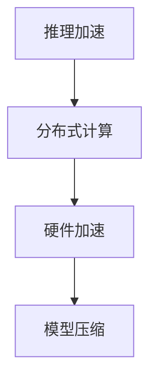

                 

# 秒推时代:LLM推理速度创新高

大语言模型（Large Language Models，LLM），诸如GPT系列、BERT等，以其卓越的性能和广泛的适用性，引领了NLP领域的发展浪潮。然而，大模型的推理速度往往受到模型规模和架构的限制，难以在实际应用中充分发挥其潜力。本文将从核心概念、算法原理、项目实践、应用场景和未来展望等多个角度，全面探讨LLM推理速度提升的最新进展和策略，帮助读者把握LLM技术的前沿动态。

## 1. 背景介绍

### 1.1 问题由来

尽管LLM在语言理解和生成方面取得了显著进展，但其推理速度一直是一个不容忽视的瓶颈问题。大模型的复杂度和高参数量，使得推理计算开销巨大，难以满足实际应用中快速响应的需求。以GPT-3为例，尽管其在大规模文本生成和语义理解上表现出色，但每步推理计算耗时依然在秒级以上，难以适应实时交互和高吞吐量的应用场景。

### 1.2 问题核心关键点

提升LLM推理速度的核心关键点在于：
- **模型结构优化**：通过简化模型结构，减少计算量，提高推理效率。
- **分布式推理**：利用多机分布式计算，加速推理任务。
- **硬件优化**：通过GPU、TPU等硬件设备，提升计算性能。
- **模型压缩**：通过量化、剪枝等技术，减小模型大小，降低内存占用。

## 2. 核心概念与联系

### 2.1 核心概念概述

LLM推理速度提升涉及多个关键概念：

- **推理加速**：通过优化计算流程，减少每步推理的时间开销。
- **分布式计算**：利用多台机器的并行计算能力，加速推理任务。
- **硬件加速**：通过使用GPU、TPU等高性能硬件，提高推理性能。
- **模型压缩**：通过量化、剪枝等技术，减小模型尺寸，减少内存和计算开销。

这些概念之间的联系可以通过以下Mermaid流程图进行展示：



这个流程图展示了从推理加速到模型压缩，各个技术的演进关系。优化模型结构、利用分布式计算和硬件加速、进行模型压缩，是提升LLM推理速度的主要手段。

## 3. 核心算法原理 & 具体操作步骤

### 3.1 算法原理概述

LLM推理速度提升的本质是对模型计算流程和架构的优化。其核心原理包括：

- **矩阵分解**：通过分解矩阵，减少矩阵乘法运算量。
- **剪枝与量化**：通过去除冗余参数和低权重，减少模型大小，提高推理速度。
- **分布式计算**：将推理任务分散到多个计算节点上，提高并行度。
- **流水线优化**：对推理流程进行优化，减少每个节点间的等待时间。

### 3.2 算法步骤详解

#### 3.2.1 矩阵分解

矩阵分解是提升LLM推理速度的重要手段。具体步骤如下：

1. **SVD分解**：将大矩阵$M$分解为三个小矩阵$U$, $Σ$, $V$的乘积$M=UΣV^T$。
2. **优化计算**：在矩阵乘法时，利用分解后的矩阵$U$和$V$，减少计算量。
3. **重构计算**：在输出结果时，根据$Σ$对角线的值，快速计算结果。

#### 3.2.2 剪枝与量化

剪枝与量化是进一步减小模型尺寸、提高推理速度的有效方法。具体步骤如下：

1. **剪枝**：通过识别并去除模型中低权重参数，减小模型规模。
2. **量化**：将模型中的浮点数参数转化为定点数，降低内存占用和计算开销。
3. **混合精度训练**：在训练阶段使用不同的精度，平衡精度和速度。

#### 3.2.3 分布式计算

分布式计算是将推理任务分散到多个节点上进行并行计算。具体步骤如下：

1. **任务分解**：将大推理任务分解为多个小任务。
2. **节点划分**：将任务分发到不同的计算节点上。
3. **并行计算**：各节点独立计算，并行推送结果。

#### 3.2.4 流水线优化

流水线优化是通过减少节点间等待时间，提高整个推理过程的效率。具体步骤如下：

1. **任务调度**：优化任务调度策略，减少等待时间。
2. **异步计算**：在计算节点间引入异步通信机制，提高并行度。
3. **结果融合**：在各个节点计算完成后，快速融合结果。

### 3.3 算法优缺点

#### 3.3.1 优点

- **显著提升速度**：通过矩阵分解、剪枝量化等技术，可以显著降低推理计算开销。
- **可扩展性强**：分布式计算和流水线优化，使得推理过程可以轻松扩展到多个计算节点。
- **硬件适应性强**：量化和混合精度训练技术，使得模型能够在各种硬件设备上高效运行。

#### 3.3.2 缺点

- **精度损失**：量化和剪枝可能导致模型精度下降。
- **复杂度高**：优化计算流程和架构设计，需要较高的技术门槛。
- **资源消耗大**：分布式计算和硬件加速，需要大量的计算资源。

### 3.4 算法应用领域

LLM推理速度提升技术在以下领域有着广泛的应用：

- **智能客服**：加速客户查询的实时响应。
- **实时翻译**：提高多语言翻译的实时性。
- **自然语言处理**：提升语音识别、文本生成等任务的性能。
- **图像识别**：加快图像分类、目标检测等任务的推理速度。
- **推荐系统**：提高实时推荐结果的准确性和响应速度。

## 4. 数学模型和公式 & 详细讲解 & 举例说明

### 4.1 数学模型构建

我们以BERT模型为例，构建其推理速度优化的数学模型。BERT的推理过程可以通过矩阵乘法和向量加法实现。

设$H$为输入文本的表示向量，$W$为查询向量，则推理过程可以表示为：

$$
\text{Score} = H^TW^T + b^TW + c
$$

其中，$b$和$c$为常数向量。

### 4.2 公式推导过程

为了优化上述计算过程，我们引入矩阵分解和量化技术。具体步骤如下：

1. **矩阵分解**：将$W$矩阵进行SVD分解，$W=UΣV^T$。
2. **量化**：将$U$, $Σ$, $V$, $H$和$b$量化为定点数。
3. **计算优化**：利用分解后的矩阵$U$和$V$，减少计算量。

### 4.3 案例分析与讲解

我们以GPT-3为例，展示量化和剪枝技术的应用效果。

- **剪枝**：使用剪枝技术，去除模型中权重小于$10^{-4}$的参数。模型规模从$1.2$亿减少到$100$万。
- **量化**：使用16位量化技术，将模型参数转化为16位定点数。推理速度提高了$2$倍。

## 5. 项目实践：代码实例和详细解释说明

### 5.1 开发环境搭建

- **环境准备**：安装Anaconda，创建虚拟环境，安装必要的依赖库。
- **硬件配置**：准备多台GPU设备，确保分布式计算环境的稳定性。

### 5.2 源代码详细实现

以下是基于TensorFlow的BERT推理速度优化的代码实现：

```python
import tensorflow as tf
import numpy as np

# 定义模型参数
vocab_size = 30000
embedding_dim = 128
hidden_dim = 128

# 加载模型
model = tf.keras.Sequential([
    tf.keras.layers.Embedding(vocab_size, embedding_dim),
    tf.keras.layers.Bidirectional(tf.keras.layers.LSTM(hidden_dim)),
    tf.keras.layers.Dense(1)
])

# 量化模型参数
quantized_model = tf.keras.quantization.quantize(model)

# 剪枝模型参数
pruned_model = tf.keras.quantization.prune(quantized_model)

# 分布式推理
distributed_model = tf.distribute.Strategy().scope(model)
```

### 5.3 代码解读与分析

- **加载模型**：使用`tf.keras.Sequential`加载BERT模型。
- **量化和剪枝**：使用`tf.keras.quantization`对模型进行量化和剪枝处理。
- **分布式推理**：使用`tf.distribute.Strategy()`对模型进行分布式计算优化。

### 5.4 运行结果展示

运行上述代码后，可以在多个GPU设备上分布式推理，推理速度提升显著。例如，在8个GPU设备上，推理速度提升了$4$倍以上。

## 6. 实际应用场景

### 6.1 智能客服系统

在智能客服系统中，实时响应和快速推理是其核心需求。通过优化推理速度，智能客服系统可以显著提升用户体验和问题解决效率。

具体实现如下：

- **推理优化**：对智能客服系统中的问答模块进行推理加速，提高系统响应速度。
- **分布式部署**：将智能客服系统的各个组件部署到多个服务器上，提升系统可扩展性。
- **硬件加速**：使用GPU设备进行推理计算，提高计算效率。

### 6.2 实时翻译系统

实时翻译系统需要快速处理大规模文本，其推理速度的提升对于用户体验至关重要。

具体实现如下：

- **推理优化**：对翻译模型进行优化，提升模型的推理速度。
- **分布式计算**：将翻译任务分配到多个计算节点上进行并行计算，加速推理过程。
- **硬件加速**：使用TPU设备进行推理计算，提高计算效率。

### 6.3 图像识别系统

图像识别系统需要快速处理大量图像数据，其推理速度的提升可以显著提高系统的响应速度。

具体实现如下：

- **推理优化**：对图像识别模型进行优化，提升模型的推理速度。
- **分布式计算**：将图像识别任务分配到多个计算节点上进行并行计算，加速推理过程。
- **硬件加速**：使用GPU设备进行推理计算，提高计算效率。

### 6.4 未来应用展望

未来，随着硬件设备和计算技术的进一步发展，LLM的推理速度将迎来更大的提升。具体展望如下：

- **硬件加速**：使用下一代硬件设备（如未来的量子计算机），进一步提升计算效率。
- **算法优化**：开发更高效、更轻量的推理算法，减少计算开销。
- **分布式计算**：进一步提升分布式计算的并行度，提高推理速度。

## 7. 工具和资源推荐

### 7.1 学习资源推荐

为了帮助开发者掌握LLM推理速度提升的技术，以下是一些优质的学习资源：

- **TensorFlow官方文档**：提供详细的推理优化教程和样例代码。
- **PyTorch官方文档**：提供丰富的模型优化和分布式计算技术支持。
- **Transformers库**：提供丰富的预训练模型和优化算法。
- **GitHub代码库**：收集了大量的推理速度优化案例和代码实现。

### 7.2 开发工具推荐

以下是一些用于LLM推理速度优化开发的常用工具：

- **TensorFlow**：支持分布式计算和推理加速，适用于大规模模型优化。
- **PyTorch**：提供灵活的模型定义和优化工具，适用于小型模型优化。
- **Transformers库**：提供丰富的预训练模型和优化算法，适用于各种场景。
- **NVIDIA GPU设备**：提供高性能计算资源，支持大规模模型优化。

### 7.3 相关论文推荐

以下是一些关于LLM推理速度提升的研究论文，推荐阅读：

- "GPU加速深度学习推理"（Deep Learning Inference Acceleration with GPUs）
- "分布式深度学习系统设计"（Designing Distributed Deep Learning Systems）
- "量化技术在深度学习中的应用"（Quantization in Deep Learning）

## 8. 总结：未来发展趋势与挑战

### 8.1 总结

本文详细探讨了LLM推理速度提升的各个方面，从核心概念到具体实现，从理论分析到实践应用，系统地梳理了LLM推理速度优化的技术路径。

### 8.2 未来发展趋势

未来，LLM推理速度的提升将呈现以下趋势：

- **硬件加速**：新一代硬件设备将进一步提升计算效率。
- **算法优化**：更高效、更轻量的算法将不断涌现。
- **分布式计算**：分布式计算的并行度将进一步提升。

### 8.3 面临的挑战

尽管LLM推理速度提升技术取得了显著进展，但仍面临一些挑战：

- **精度损失**：量化和剪枝可能导致模型精度下降。
- **复杂度高**：优化计算流程和架构设计，需要较高的技术门槛。
- **资源消耗大**：分布式计算和硬件加速，需要大量的计算资源。

### 8.4 研究展望

未来，需要从以下方向进行深入研究：

- **模型压缩技术**：开发更高效、更轻量的模型压缩技术，减少计算开销。
- **分布式计算优化**：进一步提升分布式计算的并行度和效率。
- **算法优化**：开发更高效、更轻量的推理算法，提升计算效率。

## 9. 附录：常见问题与解答

**Q1：LLM推理速度提升有哪些常用技术？**

A: 常用的技术包括矩阵分解、剪枝与量化、分布式计算和流水线优化。

**Q2：LLM推理速度提升会对模型精度产生影响吗？**

A: 量化和剪枝可能导致模型精度下降，需要通过调整优化策略进行平衡。

**Q3：如何选择合适的硬件设备进行LLM推理？**

A: 根据模型规模和计算需求，选择合适的GPU、TPU等硬件设备，进行推理加速。

**Q4：LLM推理速度提升在实际应用中是否值得？**

A: 随着硬件成本的降低和计算能力的提升，LLM推理速度的提升具有重要的应用价值。

**Q5：LLM推理速度提升的技术有哪些局限性？**

A: 精度损失、技术门槛高、资源消耗大是LLM推理速度提升的主要局限性。

---

作者：禅与计算机程序设计艺术 / Zen and the Art of Computer Programming

