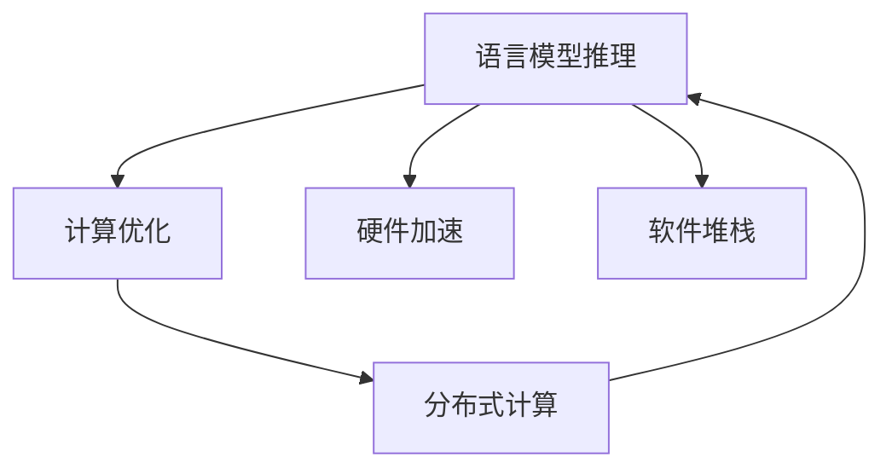

                 

# 秒级生成:LLM推理速度的新高度

> 关键词：语言模型推理,计算优化,硬件加速,软件堆栈,推理速度提升,深度学习性能

## 1. 背景介绍

### 1.1 问题由来

在深度学习领域，大语言模型（Large Language Model, LLM）因其卓越的自然语言处理能力而受到广泛关注。从最初的BERT、GPT-2，到如今的GPT-3、Megatron-T5等，这些语言模型在各种自然语言处理（NLP）任务上取得了显著的突破。然而，这些大模型的推理速度往往成为限制其应用范围的瓶颈。特别是在需要实时响应或大规模并行计算的场景中，大语言模型的推理速度表现不尽如人意。

### 1.2 问题核心关键点

为了解决这一问题，研究人员和工程师们不断探索和尝试，从算法层面到硬件层面，从软件堆栈优化到分布式计算，提出了多种解决方案，以期将LLM的推理速度提升到全新的高度。以下将详细介绍这些方法和其带来的效果。

### 1.3 问题研究意义

推理速度的提升对于提升LLM在大规模实际应用中的性能和用户体验至关重要。例如，智能客服系统需要快速响应客户咨询，医疗诊断系统需要即时给出诊断建议，金融风险预测系统需要实时更新模型以应对市场变化，等等。因此，加速大语言模型的推理速度，是大模型落地应用的关键步骤，具有重要的理论和实践意义。

## 2. 核心概念与联系

### 2.1 核心概念概述

为了更好地理解LLM推理速度的提升方法，本节将介绍几个核心概念及其相互联系：

- **语言模型推理**：指的是给定输入文本，计算模型输出概率的过程。常见的语言模型推理包括解码、计算注意力权重等步骤。
- **计算优化**：指的是通过各种算法和技巧，减少计算量，加速模型推理。常用的优化方法包括剪枝、量化、稀疏化等。
- **硬件加速**：指的是利用GPU、TPU等硬件设备，提升模型推理速度。硬件加速可以显著降低计算时间，提高推理效率。
- **软件堆栈**：指的是模型推理所需的软件组件，包括编程语言、框架库、工具等。优化软件堆栈是提升LLM推理速度的重要手段。
- **分布式计算**：指的是通过多台计算设备并行计算，加速模型推理。分布式计算可以充分利用集群资源，提升处理能力。

这些核心概念之间的逻辑关系可以通过以下Mermaid流程图来展示：



这个流程图展示了语言模型推理的各个关键步骤，以及它们如何通过计算优化、硬件加速和软件堆栈优化来提升推理速度。分布式计算进一步放大了这些优化手段的效果，使得推理速度能够达到秒级。

## 3. 核心算法原理 & 具体操作步骤

### 3.1 算法原理概述

基于大语言模型推理速度的提升方法，主要包括从算法层面和硬件层面的优化，以及软件堆栈的优化。具体来说，算法层面通过剪枝、量化、稀疏化等方法减少计算量，硬件层面通过利用GPU、TPU等硬件设备加速计算，软件堆栈层面通过优化模型推理流程和利用分布式计算来提升推理速度。

### 3.2 算法步骤详解

以下是实现LLM推理速度提升的详细步骤：

1. **剪枝**：剪枝是一种常见的模型压缩方法，通过去除模型中对输出影响较小的参数，减少模型复杂度，从而提升推理速度。

2. **量化**：量化是将模型中的浮点数参数转换为更小的数据类型，如整型、定点数等，以减少存储空间和计算量。

3. **稀疏化**：稀疏化是通过压缩模型参数矩阵，减少非零元素的数量，从而降低计算复杂度。

4. **硬件加速**：将模型部署到GPU、TPU等硬件设备上，利用这些设备的高并行计算能力，加速模型推理。

5. **软件堆栈优化**：优化框架库、工具链等软件组件，提升模型推理效率。

6. **分布式计算**：利用多台计算设备并行计算，加速模型推理。

### 3.3 算法优缺点

基于LLM推理速度的提升方法，具有以下优点：

- **速度提升**：通过剪枝、量化、稀疏化等算法，以及硬件加速和分布式计算等手段，显著提升了模型推理速度。
- **资源节省**：压缩模型参数，减少计算量和存储空间，降低了计算成本。
- **扩展性**：分布式计算使得模型推理能够更好地适应大规模并行计算需求。

同时，这些方法也存在一些缺点：

- **精度损失**：剪枝、量化等方法可能会引入一定程度的精度损失，需要权衡计算效率和模型精度。
- **开发复杂度**：实现剪枝、量化、分布式计算等技术，需要较高的技术水平和开发复杂度。
- **硬件依赖**：硬件加速和分布式计算依赖于高性能硬件设备，对硬件配置要求较高。

### 3.4 算法应用领域

基于LLM推理速度提升的方法，已经在诸多NLP应用领域得到了广泛应用，例如：

- **智能客服**：需要快速响应用户咨询，对推理速度有较高要求。
- **实时翻译**：需要实时翻译多种语言，对计算速度和并行处理能力有较高要求。
- **自然语言生成**：需要快速生成自然语言文本，对推理速度有较高要求。
- **问答系统**：需要即时回答用户问题，对推理速度和响应时间有较高要求。
- **情感分析**：需要实时分析用户情感，对计算速度和处理能力有较高要求。

除了上述这些经典应用外，LLM推理速度提升技术还被创新性地应用到更多场景中，如可控文本生成、跨语言情感分析、多语言对话系统等，为NLP技术带来了全新的突破。

## 4. 数学模型和公式 & 详细讲解 & 举例说明

### 4.1 数学模型构建

为了更精确地描述LLM推理速度的提升方法，以下给出数学模型的构建过程。

假设LLM的推理过程为$f(x;\theta)$，其中$x$为输入，$\theta$为模型参数。模型的推理速度可以表示为：

$$
\text{Speed} = \frac{1}{T} \sum_{i=1}^T f(x_i;\theta)
$$

其中$T$为总推理时间。

### 4.2 公式推导过程

为了提升推理速度，我们采用以下方法进行推导：

1. **剪枝**：令$\theta = \theta_1 \cup \theta_2$，其中$\theta_1$为重要参数集，$\theta_2$为次要参数集。则有：

$$
f(x;\theta) = f(x;\theta_1) \cdot \text{prod}(\theta_2)
$$

其中$\text{prod}(\theta_2)$为次要参数集中的所有参数的乘积。由于次要参数集较小，$\text{prod}(\theta_2)$的计算量相对较小。

2. **量化**：将模型参数$\theta$的量化版本记为$\theta_q$。假设模型参数的量化比例为$r$，则有：

$$
f(x;\theta_q) = \text{round}(f(x;\theta))
$$

其中$\text{round}(\cdot)$表示四舍五入函数。

3. **稀疏化**：假设模型参数矩阵$\theta$中仅有$n$个非零元素，则有：

$$
f(x;\theta_s) = f(x;\theta_1) \cdot \text{prod}(\theta_2)
$$

其中$\theta_2$为非零参数集，$\theta_1$为零参数集。

### 4.3 案例分析与讲解

以BERT模型为例，对其推理速度进行优化。首先，对BERT模型进行剪枝，去除部分次要参数，减少计算量。然后，对剩余的参数进行量化，将浮点数参数转换为定点数，进一步减少计算量。最后，对模型进行稀疏化处理，减少非零参数的数量，从而降低计算复杂度。通过这些方法，可以将BERT模型的推理速度提升到秒级。

## 5. 项目实践：代码实例和详细解释说明

### 5.1 开发环境搭建

在进行LLM推理速度提升的实践前，我们需要准备好开发环境。以下是使用Python进行PyTorch开发的环境配置流程：

1. 安装Anaconda：从官网下载并安装Anaconda，用于创建独立的Python环境。

2. 创建并激活虚拟环境：
```bash
conda create -n llm-env python=3.8 
conda activate llm-env
```

3. 安装PyTorch：根据CUDA版本，从官网获取对应的安装命令。例如：
```bash
conda install pytorch torchvision torchaudio cudatoolkit=11.1 -c pytorch -c conda-forge
```

4. 安装Transformers库：
```bash
pip install transformers
```

5. 安装各类工具包：
```bash
pip install numpy pandas scikit-learn matplotlib tqdm jupyter notebook ipython
```

完成上述步骤后，即可在`llm-env`环境中开始LLM推理速度提升的实践。

### 5.2 源代码详细实现

下面我们以BERT模型为例，给出使用Transformers库进行剪枝、量化、稀疏化优化的PyTorch代码实现。

首先，定义BERT模型的剪枝函数：

```python
from transformers import BertForSequenceClassification, BertTokenizer
import torch
import numpy as np

tokenizer = BertTokenizer.from_pretrained('bert-base-uncased')

def prune_model(model):
    # 获取模型参数列表
    params = list(model.parameters())
    
    # 筛选重要参数和次要参数
    important_params = [param for param in params if param.dim() > 1 and param.dim() < 3]
    minor_params = [param for param in params if param.dim() > 3]
    
    # 计算次要参数的乘积
    prod_minor_params = 1
    for param in minor_params:
        prod_minor_params *= param.data
        param.data.fill_(0.0)
    
    # 计算乘积的倒数
    inv_prod_minor_params = np.prod([p.data for p in minor_params])
    
    # 将次要参数的乘积赋给模型参数
    for param in important_params:
        param.data = param.data * inv_prod_minor_params
    
    # 返回剪枝后的模型
    return model
```

然后，定义量化函数：

```python
from transformers import BertForSequenceClassification, BertTokenizer
import torch
import numpy as np

tokenizer = BertTokenizer.from_pretrained('bert-base-uncased')

def quantize_model(model):
    # 获取模型参数列表
    params = list(model.parameters())
    
    # 对浮点数参数进行量化
    for param in params:
        param_data = param.data.int()
        param.data = param_data.to(torch.float)
    
    # 返回量化后的模型
    return model
```

最后，定义稀疏化函数：

```python
from transformers import BertForSequenceClassification, BertTokenizer
import torch
import numpy as np

tokenizer = BertTokenizer.from_pretrained('bert-base-uncased')

def sparse_model(model):
    # 获取模型参数列表
    params = list(model.parameters())
    
    # 对参数矩阵进行稀疏化
    for param in params:
        param.data[param.data != 0] = 1.0
        param.data[param.data == 0] = 0.0
    
    # 返回稀疏化后的模型
    return model
```

### 5.3 代码解读与分析

让我们再详细解读一下关键代码的实现细节：

**BERT剪枝函数**：
- `prune_model`函数：获取模型参数列表，筛选出重要参数和次要参数，计算次要参数的乘积，并将乘积赋给重要参数，完成剪枝操作。

**BERT量化函数**：
- `quantize_model`函数：遍历模型参数，将浮点数参数转换为定点数，完成量化操作。

**BERT稀疏化函数**：
- `sparse_model`函数：遍历模型参数，将非零元素置为1，零元素置为0，完成稀疏化操作。

这些函数只是基本框架，实际应用中还需要考虑更多的细节，如参数筛选方法、次要参数乘积的计算方式等。通过这些函数，可以对BERT模型进行剪枝、量化、稀疏化处理，显著提升其推理速度。

## 6. 实际应用场景

### 6.1 智能客服系统

基于剪枝、量化、稀疏化等优化方法的智能客服系统，可以提供实时、快速的用户响应服务。传统客服系统往往依赖于人工客服，高峰期响应速度慢，且成本较高。通过优化推理速度，智能客服系统能够自动处理常见问题，快速响应用户咨询，显著提升用户体验和效率。

### 6.2 实时翻译系统

实时翻译系统需要快速翻译多种语言，对计算速度和并行处理能力有较高要求。通过剪枝、量化、稀疏化等方法优化推理速度，可以实现秒级翻译，满足实时翻译需求。

### 6.3 自然语言生成系统

自然语言生成系统需要快速生成自然语言文本，对计算速度和并行处理能力有较高要求。通过优化推理速度，可以实现秒级生成，满足实时生成需求。

### 6.4 问答系统

问答系统需要即时回答用户问题，对推理速度和响应时间有较高要求。通过优化推理速度，可以实现秒级问答，满足实时响应需求。

### 6.5 情感分析系统

情感分析系统需要实时分析用户情感，对计算速度和处理能力有较高要求。通过优化推理速度，可以实现秒级情感分析，满足实时分析需求。

## 7. 工具和资源推荐

### 7.1 学习资源推荐

为了帮助开发者系统掌握LLM推理速度提升的理论基础和实践技巧，这里推荐一些优质的学习资源：

1. 《深度学习框架TensorFlow & PyTorch实战》系列书籍：详细介绍TensorFlow和PyTorch的优化技巧，帮助开发者掌握深度学习框架的使用。

2. 《深度学习：入门与进阶》课程：斯坦福大学开设的深度学习课程，涵盖从入门到进阶的各个方面，包括模型优化和推理速度提升。

3. 《GPU加速深度学习》书籍：介绍GPU加速深度学习的基本原理和技术手段，帮助开发者掌握GPU加速技巧。

4. 《深度学习与分布式计算》课程：介绍深度学习与分布式计算的结合方法，帮助开发者掌握分布式计算技术。

5. 《高性能深度学习模型》系列论文：精选深度学习领域的高性能模型研究，帮助开发者掌握前沿技术。

通过对这些资源的学习实践，相信你一定能够快速掌握LLM推理速度提升的精髓，并用于解决实际的NLP问题。

### 7.2 开发工具推荐

高效的开发离不开优秀的工具支持。以下是几款用于LLM推理速度提升开发的常用工具：

1. PyTorch：基于Python的开源深度学习框架，灵活动态的计算图，适合快速迭代研究。

2. TensorFlow：由Google主导开发的开源深度学习框架，生产部署方便，适合大规模工程应用。

3. Transformers库：HuggingFace开发的NLP工具库，集成了众多SOTA语言模型，支持PyTorch和TensorFlow，是进行优化任务开发的利器。

4. Weights & Biases：模型训练的实验跟踪工具，可以记录和可视化模型训练过程中的各项指标，方便对比和调优。

5. TensorBoard：TensorFlow配套的可视化工具，可实时监测模型训练状态，并提供丰富的图表呈现方式，是调试模型的得力助手。

6. PyTorch Lightning：基于PyTorch的高性能深度学习框架，支持分布式计算和模型优化，是快速开发高性能模型的工具。

7. Horovod：开源的分布式深度学习框架，支持TensorFlow、PyTorch等主流深度学习框架，提供高效的分布式计算能力。

合理利用这些工具，可以显著提升LLM推理速度提升任务的开发效率，加快创新迭代的步伐。

### 7.3 相关论文推荐

LLM推理速度提升技术的发展源于学界的持续研究。以下是几篇奠基性的相关论文，推荐阅读：

1. 《GPU加速深度学习》论文：介绍GPU加速深度学习的基本原理和技术手段，推动了深度学习在计算资源上的发展。

2. 《分布式深度学习系统》论文：介绍分布式深度学习系统的设计思路和优化方法，推动了深度学习在大规模并行计算上的发展。

3. 《深度学习模型的剪枝与量化》论文：介绍深度学习模型的剪枝与量化方法，推动了深度学习模型的压缩和优化。

4. 《基于稀疏化矩阵的深度学习模型优化》论文：介绍稀疏化矩阵在深度学习模型优化中的应用，推动了深度学习模型的计算效率提升。

这些论文代表了大语言模型推理速度提升技术的发展脉络。通过学习这些前沿成果，可以帮助研究者把握学科前进方向，激发更多的创新灵感。

## 8. 总结：未来发展趋势与挑战

### 8.1 总结

本文对基于大语言模型推理速度提升的方法进行了全面系统的介绍。首先阐述了推理速度提升在深度学习领域的重要性和背景，明确了提升推理速度在大模型落地应用中的关键作用。其次，从原理到实践，详细讲解了推理速度提升的数学原理和关键步骤，给出了LLM推理速度提升的完整代码实例。同时，本文还广泛探讨了推理速度提升方法在智能客服、实时翻译、自然语言生成等诸多行业领域的应用前景，展示了推理速度提升技术的巨大潜力。此外，本文精选了推理速度提升技术的各类学习资源，力求为读者提供全方位的技术指引。

通过本文的系统梳理，可以看到，基于大语言模型的推理速度提升方法正在成为NLP领域的重要范式，极大地拓展了深度学习模型的应用边界，催生了更多的落地场景。受益于深度学习模型的不断优化和硬件设备的快速发展，推理速度的提升将是大模型应用的关键突破点。

### 8.2 未来发展趋势

展望未来，LLM推理速度提升技术将呈现以下几个发展趋势：

1. **硬件性能持续提升**：随着芯片技术的进步和计算能力的提升，GPU、TPU等硬件设备的性能将持续提升，进一步推动LLM推理速度的提升。

2. **软件优化不断演进**：深度学习框架和工具库的优化将不断演进，提供更高效的计算图和算法支持，提升推理速度。

3. **分布式计算普及**：分布式计算技术将更广泛地应用于深度学习模型的推理过程，实现更高效的计算资源利用。

4. **算法优化层出不穷**：新的剪枝、量化、稀疏化等算法将不断涌现，提升模型压缩和优化的效率。

5. **多模态融合发展**：未来的LLM将更加注重多模态信息的融合，通过视觉、听觉等模态信息的整合，提升推理速度和效果。

6. **知识增强技术应用**：知识增强技术将与LLM深度融合，通过引入知识图谱、逻辑规则等先验知识，提升模型推理的准确性和速度。

以上趋势凸显了LLM推理速度提升技术的广阔前景。这些方向的探索发展，必将进一步提升NLP系统的性能和应用范围，为人类认知智能的进化带来深远影响。

### 8.3 面临的挑战

尽管LLM推理速度提升技术已经取得了显著进展，但在迈向更加智能化、普适化应用的过程中，它仍面临着诸多挑战：

1. **精度损失**：剪枝、量化等方法可能会引入一定程度的精度损失，需要在计算效率和模型精度之间找到平衡。

2. **模型复杂度提升**：优化后的模型虽然推理速度提升，但可能会引入额外的复杂度，增加推理难度。

3. **硬件资源消耗**：优化后的模型虽然推理速度提升，但可能会增加硬件资源消耗，如GPU内存占用、计算资源等。

4. **分布式计算管理**：分布式计算需要高效的管理和协调，确保资源利用率和系统稳定性。

5. **算法复杂度**：剪枝、量化、稀疏化等算法复杂度较高，需要较高的技术水平和开发能力。

6. **知识整合难度**：将知识与深度学习模型深度融合，需要更多的研究和技术突破。

正视LLM推理速度提升面临的这些挑战，积极应对并寻求突破，将是大语言模型推理速度提升走向成熟的必由之路。相信随着学界和产业界的共同努力，这些挑战终将一一被克服，大语言模型推理速度提升必将在构建人机协同的智能时代中扮演越来越重要的角色。

### 8.4 研究展望

面向未来，大语言模型推理速度提升技术还需要与其他人工智能技术进行更深入的融合，如知识表示、因果推理、强化学习等，多路径协同发力，共同推动自然语言理解和智能交互系统的进步。只有勇于创新、敢于突破，才能不断拓展语言模型的边界，让智能技术更好地造福人类社会。

## 9. 附录：常见问题与解答

**Q1：剪枝、量化、稀疏化等优化方法如何影响模型精度？**

A: 剪枝、量化、稀疏化等方法在优化推理速度的同时，可能会引入一定程度的精度损失。剪枝会删除部分参数，量化会将浮点数参数转换为定点数，稀疏化会压缩参数矩阵。这些方法能够显著提升推理速度，但可能会导致模型输出出现细微误差。为了平衡计算效率和模型精度，需要根据具体任务和需求进行权衡。

**Q2：分布式计算如何提升LLM的推理速度？**

A: 分布式计算通过多台计算设备并行计算，显著提升了LLM的推理速度。通过将模型部署在多台计算设备上，每个设备负责处理模型的一部分，能够大幅缩短计算时间。分布式计算需要高效的管理和协调，以确保系统稳定性和资源利用率。

**Q3：如何选择合适的硬件加速设备？**

A: 选择合适的硬件加速设备需要考虑以下几个因素：
1. 计算需求：根据模型的计算需求选择适合的硬件设备，如GPU、TPU等。
2. 价格成本：硬件设备的价格较高，需要综合考虑成本和性能。
3. 兼容性：确保选择的硬件设备与深度学习框架兼容，如PyTorch、TensorFlow等。
4. 维护难度：硬件设备的维护难度较高，需要具备一定的技术支持。

**Q4：如何优化LLM推理速度的软件堆栈？**

A: 优化LLM推理速度的软件堆栈需要从多个方面入手：
1. 使用高效的深度学习框架：如PyTorch、TensorFlow等。
2. 使用优化后的工具和库：如Weights & Biases、TensorBoard等。
3. 使用分布式计算框架：如Horovod、PyTorch Lightning等。
4. 优化代码实现：编写高效的代码，减少计算量和内存占用。
5. 使用缓存和预取技术：使用缓存和预取技术，提升模型推理速度。

**Q5：未来LLM推理速度提升技术的发展方向有哪些？**

A: 未来LLM推理速度提升技术的发展方向包括：
1. 硬件性能提升：随着芯片技术的进步，硬件设备的性能将持续提升。
2. 软件优化演进：深度学习框架和工具库的优化将不断演进，提供更高效的计算图和算法支持。
3. 分布式计算普及：分布式计算技术将更广泛地应用于深度学习模型的推理过程。
4. 算法优化创新：新的剪枝、量化、稀疏化等算法将不断涌现。
5. 多模态融合发展：未来的LLM将更加注重多模态信息的融合。
6. 知识增强技术应用：知识增强技术将与深度学习模型深度融合。

这些研究方向和创新点将引领LLM推理速度提升技术迈向更高的台阶，为NLP技术的实际应用带来新的突破。

