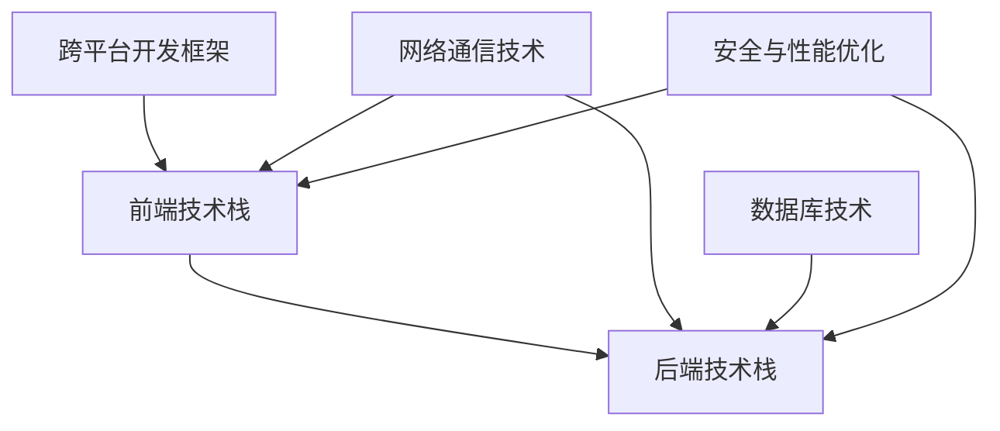

                 

# 移动端全栈开发：iOS和Android平台技能

## 1. 背景介绍

### 1.1 问题由来
近年来，随着移动互联网的发展，越来越多的企业和开发者意识到，要想在竞争激烈的移动应用市场中取得成功，不仅需要开发出色的iOS或Android应用，还需要具备全栈开发的能力，以便在前后端协同工作、跨平台开发等方面都能游刃有余。全栈开发人员能够涵盖前端和后端开发的知识，以一种统一的方式来构建高质量的移动应用，极大地提高了开发效率和应用性能。

### 1.2 问题核心关键点
移动端全栈开发的核心在于如何将前端和后端的技能结合起来，构建出一个高性能、易维护的移动应用。关键点包括但不限于以下几点：
- **前端技能**：HTML、CSS、JavaScript、React、Vue等前端技术栈。
- **后端技能**：Node.js、Python、Ruby、Java等后端技术栈。
- **跨平台开发**：Flutter、Xamarin、Electron等跨平台框架。
- **数据库技术**：MySQL、MongoDB、SQLite等数据库管理系统。
- **网络技术**：RESTful API、WebSocket等网络通信技术。
- **安全与性能**：SSL/TLS、HTTPS、网络缓存等安全与性能优化技术。

### 1.3 问题研究意义
掌握移动端全栈开发技能，对于构建高效、安全、易维护的移动应用具有重要意义：

1. **提高开发效率**：前端和后端的技能都掌握在手中，可以大幅缩短开发周期，减少沟通成本。
2. **提升应用性能**：全栈开发人员能够从数据存储、网络通信等底层技术入手，优化应用性能。
3. **增强跨平台能力**：跨平台开发框架使得应用能够在多个平台上无缝部署，减少开发和维护成本。
4. **保障应用安全**：了解前端和后端的安全机制，能够全面保障应用的安全性。
5. **支持新技术创新**：不断学习和应用最新的技术，保持应用的技术领先性。

## 2. 核心概念与联系

### 2.1 核心概念概述

移动端全栈开发涉及众多关键概念，以下是其中的一些核心概念及其相互联系：

- **前端技术栈**：包括HTML、CSS、JavaScript、React、Vue等，用于构建移动应用的用户界面。
- **后端技术栈**：包括Node.js、Python、Ruby、Java等，用于处理数据逻辑、网络通信、数据库操作等。
- **跨平台开发框架**：如Flutter、Xamarin、Electron等，用于构建跨平台的移动应用，减少开发成本。
- **网络通信技术**：包括RESTful API、WebSocket等，用于前后端数据交互。
- **数据库技术**：如MySQL、MongoDB、SQLite等，用于数据存储和管理。
- **安全与性能优化**：包括SSL/TLS、HTTPS、网络缓存等，用于保障应用的安全性和性能。

这些概念之间的联系可以通过以下Mermaid流程图来展示：



这个流程图展示前端、后端、跨平台、网络通信、数据库、安全与性能优化等关键概念之间的联系：

1. 前端技术栈构建应用的用户界面。
2. 后端技术栈处理数据逻辑、网络通信、数据库操作等。
3. 跨平台开发框架减少开发成本，支持多个平台部署。
4. 网络通信技术用于前后端数据交互。
5. 数据库技术用于数据存储和管理。
6. 安全与性能优化保障应用的安全性和性能。

## 3. 核心算法原理 & 具体操作步骤

### 3.1 算法原理概述

移动端全栈开发的算法原理主要围绕前端和后端的交互、数据处理、网络通信等方面展开。其核心思想是通过前后端的协同工作，构建出一个高性能、易维护的移动应用。

前端通过JavaScript等技术实现用户界面的展示和交互，而后端通过Node.js、Python等技术处理数据逻辑、网络通信、数据库操作等。两者通过RESTful API、WebSocket等技术进行数据交互。

### 3.2 算法步骤详解

基于移动端全栈开发的算法原理，其操作步骤主要包括：

1. **需求分析**：明确应用的需求和功能，确定前端和后端的分工。
2. **设计架构**：设计前端和后端的架构，包括模块划分、数据流、网络通信等。
3. **前端开发**：使用HTML、CSS、JavaScript、React、Vue等技术开发前端应用界面。
4. **后端开发**：使用Node.js、Python、Ruby、Java等技术开发后端服务，处理数据逻辑和网络通信。
5. **跨平台开发**：使用Flutter、Xamarin、Electron等框架构建跨平台的移动应用。
6. **数据库设计**：设计数据库结构，选择合适的数据库管理系统，如MySQL、MongoDB、SQLite等。
7. **网络通信**：实现前后端的RESTful API和WebSocket通信，保障数据交互的实时性和安全性。
8. **安全与性能优化**：采用SSL/TLS、HTTPS、网络缓存等技术，保障应用的安全性和性能。
9. **测试与部署**：进行单元测试、集成测试、性能测试，然后将应用部署到目标平台。

### 3.3 算法优缺点

移动端全栈开发算法具有以下优点：

1. **提高开发效率**：全栈开发人员能够同时处理前端和后端的工作，减少沟通成本，缩短开发周期。
2. **提升应用性能**：全栈开发人员能够从数据存储、网络通信等底层技术入手，优化应用性能。
3. **增强跨平台能力**：使用跨平台开发框架，能够构建跨平台的移动应用，减少开发和维护成本。
4. **保障应用安全**：了解前端和后端的安全机制，能够全面保障应用的安全性。

同时，该算法也存在一些局限性：

1. **技能要求高**：全栈开发需要掌握多种技术和工具，对开发者的技能要求较高。
2. **学习成本高**：需要同时学习和掌握前端和后端的技术栈，学习成本较高。
3. **维护复杂**：前端和后端的工作同时进行，可能会导致代码维护变得复杂。

### 3.4 算法应用领域

移动端全栈开发技术已经广泛应用于多个领域，包括但不限于以下领域：

- **电商应用**：构建商品展示、购物车、订单处理等功能，同时保障应用的安全性和性能。
- **社交媒体应用**：实现用户登录、消息推送、朋友圈等功能，提升用户体验。
- **金融应用**：开发在线支付、账户管理、股票交易等功能，保障用户资产安全。
- **教育应用**：提供在线课程、作业提交、成绩管理等功能，支持远程教学。
- **医疗应用**：实现预约挂号、电子病历、在线咨询等功能，提高医疗服务的效率和便捷性。

除了上述这些经典领域外，全栈开发技术还在智能家居、智能穿戴、智能交通等新兴领域中得到了广泛应用，为各行业提供了强大的技术支持。

## 4. 数学模型和公式 & 详细讲解 & 举例说明

### 4.1 数学模型构建

移动端全栈开发涉及的数学模型主要集中在网络通信、数据处理等方面。这里以RESTful API为例，构建一个基本的数学模型。

假设前端和后端之间的数据交互通过RESTful API进行，数据以JSON格式传递。前端向后端发送请求，后端处理请求并返回JSON数据，前端解析JSON数据后进行展示。

### 4.2 公式推导过程

假设后端服务提供了一个RESTful API，其URL为 `https://api.example.com/users`，返回的JSON数据格式如下：

```json
{
    "users": [
        {
            "id": 1,
            "name": "Alice",
            "age": 25
        },
        {
            "id": 2,
            "name": "Bob",
            "age": 30
        }
    ]
}
```

前端通过JavaScript代码发送GET请求，获取用户数据，代码如下：

```javascript
fetch('https://api.example.com/users')
    .then(response => response.json())
    .then(data => {
        // 处理返回的JSON数据
        const users = data.users;
        users.forEach(user => {
            console.log(user.name);
        });
    });
```

后端服务使用Node.js编写，处理请求并返回JSON数据，代码如下：

```javascript
const express = require('express');
const app = express();

app.get('/users', (req, res) => {
    // 处理请求并返回JSON数据
    const users = [
        { id: 1, name: 'Alice', age: 25 },
        { id: 2, name: 'Bob', age: 30 }
    ];
    res.json({ users });
});

app.listen(3000, () => {
    console.log('Server listening on port 3000');
});
```

通过上述代码，可以看出前端和后端通过RESTful API进行数据交互的数学模型。

### 4.3 案例分析与讲解

以电商应用为例，分析全栈开发技术的应用。电商应用需要处理商品展示、购物车、订单处理等功能，需要前端和后端的协同工作。

前端通过React等技术开发商品展示页面，使用Axios等工具进行HTTP请求，获取商品数据。后端使用Node.js编写API，处理订单和支付功能，存储订单数据到MySQL数据库中。

具体步骤如下：

1. **需求分析**：明确电商应用的需求和功能，如商品展示、购物车、订单处理等。
2. **设计架构**：设计前端和后端的架构，包括商品展示、购物车、订单处理等功能模块。
3. **前端开发**：使用React等技术开发前端应用界面，通过Axios等工具发送HTTP请求，获取商品数据。
4. **后端开发**：使用Node.js编写API，处理订单和支付功能，存储订单数据到MySQL数据库中。
5. **跨平台开发**：使用Flutter等框架，构建跨平台的移动应用，减少开发和维护成本。
6. **数据库设计**：设计商品、订单、用户等数据表，选择合适的数据库管理系统。
7. **网络通信**：实现前后端的RESTful API通信，保障数据交互的实时性和安全性。
8. **安全与性能优化**：采用SSL/TLS、HTTPS、网络缓存等技术，保障应用的安全性和性能。
9. **测试与部署**：进行单元测试、集成测试、性能测试，然后将应用部署到目标平台。

## 5. 项目实践：代码实例和详细解释说明

### 5.1 开发环境搭建

进行移动端全栈开发实践前，需要先准备好开发环境。以下是使用Node.js、React和MySQL进行开发的环境配置流程：

1. **安装Node.js和npm**：从官网下载并安装Node.js，配置全局npm。

2. **安装MySQL数据库**：从官网下载安装MySQL数据库，并配置MySQL服务。

3. **安装IDE和工具**：安装Visual Studio Code、Sublime Text等IDE，以及ESLint、Prettier、ES6等前端开发工具。

4. **安装Git和GitHub**：安装Git版本控制系统，并注册GitHub账号，用于版本控制和代码管理。

完成上述步骤后，即可在本地环境中开始全栈开发实践。

### 5.2 源代码详细实现

这里我们以电商应用为例，使用Node.js和React构建前端和后端服务，使用MySQL数据库存储数据，并使用Axios进行前后端数据交互。

**前端开发**：

```javascript
import React, { useState, useEffect } from 'react';
import axios from 'axios';

const ProductList = () => {
    const [products, setProducts] = useState([]);

    useEffect(() => {
        axios.get('https://api.example.com/products')
            .then(response => {
                setProducts(response.data);
            })
            .catch(error => {
                console.log(error);
            });
    }, []);

    return (
        <div>
            {products.map(product => (
                <div key={product.id}>
                    <h2>{product.name}</h2>
                    <p>{product.price}</p>
                </div>
            ))}
        </div>
    );
};

export default ProductList;
```

**后端开发**：

```javascript
const express = require('express');
const app = express();
const mysql = require('mysql');

const connection = mysql.createConnection({
    host: 'localhost',
    user: 'root',
    password: 'password',
    database: 'mydb'
});

app.get('/products', (req, res) => {
    connection.query('SELECT * FROM products', (error, results, fields) => {
        if (error) throw error;
        res.json(results);
    });
});

app.listen(3000, () => {
    console.log('Server listening on port 3000');
});
```

**数据库设计**：

使用MySQL数据库设计商品表、订单表、用户表等，如：

```sql
CREATE TABLE products (
    id INT PRIMARY KEY AUTO_INCREMENT,
    name VARCHAR(255),
    price DECIMAL(10, 2)
);

CREATE TABLE orders (
    id INT PRIMARY KEY AUTO_INCREMENT,
    user_id INT,
    product_id INT,
    amount DECIMAL(10, 2),
    FOREIGN KEY (user_id) REFERENCES users(id),
    FOREIGN KEY (product_id) REFERENCES products(id)
);

CREATE TABLE users (
    id INT PRIMARY KEY AUTO_INCREMENT,
    name VARCHAR(255),
    email VARCHAR(255)
);
```

通过上述代码，可以看出前端和后端通过RESTful API进行数据交互的实现。前端通过React等技术开发商品展示页面，使用Axios等工具进行HTTP请求，获取商品数据。后端使用Node.js编写API，处理订单和支付功能，存储订单数据到MySQL数据库中。

### 5.3 代码解读与分析

让我们再详细解读一下关键代码的实现细节：

**前端代码**：

```javascript
import React, { useState, useEffect } from 'react';
import axios from 'axios';

const ProductList = () => {
    const [products, setProducts] = useState([]);

    useEffect(() => {
        axios.get('https://api.example.com/products')
            .then(response => {
                setProducts(response.data);
            })
            .catch(error => {
                console.log(error);
            });
    }, []);

    return (
        <div>
            {products.map(product => (
                <div key={product.id}>
                    <h2>{product.name}</h2>
                    <p>{product.price}</p>
                </div>
            ))}
        </div>
    );
};

export default ProductList;
```

**后端代码**：

```javascript
const express = require('express');
const app = express();
const mysql = require('mysql');

const connection = mysql.createConnection({
    host: 'localhost',
    user: 'root',
    password: 'password',
    database: 'mydb'
});

app.get('/products', (req, res) => {
    connection.query('SELECT * FROM products', (error, results, fields) => {
        if (error) throw error;
        res.json(results);
    });
});

app.listen(3000, () => {
    console.log('Server listening on port 3000');
});
```

**数据库代码**：

```sql
CREATE TABLE products (
    id INT PRIMARY KEY AUTO_INCREMENT,
    name VARCHAR(255),
    price DECIMAL(10, 2)
);

CREATE TABLE orders (
    id INT PRIMARY KEY AUTO_INCREMENT,
    user_id INT,
    product_id INT,
    amount DECIMAL(10, 2),
    FOREIGN KEY (user_id) REFERENCES users(id),
    FOREIGN KEY (product_id) REFERENCES products(id)
);

CREATE TABLE users (
    id INT PRIMARY KEY AUTO_INCREMENT,
    name VARCHAR(255),
    email VARCHAR(255)
);
```

这些代码实现了前端和后端通过RESTful API进行数据交互的全栈开发过程。前端通过React等技术开发商品展示页面，使用Axios等工具发送HTTP请求，获取商品数据。后端使用Node.js编写API，处理订单和支付功能，存储订单数据到MySQL数据库中。

## 6. 实际应用场景

### 6.1 电商应用

电商应用需要处理商品展示、购物车、订单处理等功能，需要前端和后端的协同工作。以淘宝、京东等知名电商平台为例，通过全栈开发技术，可以构建一个高效、稳定、易维护的电商应用。

### 6.2 社交媒体应用

社交媒体应用需要处理用户登录、消息推送、朋友圈等功能，通过全栈开发技术，可以构建一个实时、互动、友好的社交媒体平台。

### 6.3 金融应用

金融应用需要处理在线支付、账户管理、股票交易等功能，通过全栈开发技术，可以构建一个安全、可靠、易用的金融服务平台。

### 6.4 教育应用

教育应用需要处理在线课程、作业提交、成绩管理等功能，通过全栈开发技术，可以构建一个高效、互动、个性化的教育平台。

### 6.5 医疗应用

医疗应用需要处理预约挂号、电子病历、在线咨询等功能，通过全栈开发技术，可以构建一个高效、便捷、安全的医疗服务平台。

### 6.6 未来应用展望

随着技术的不断进步，全栈开发技术将在更多领域得到应用，为各行业提供强大的技术支持：

1. **智能家居**：构建智能音箱、智能门锁、智能温控等功能，提升家居生活的智能化水平。
2. **智能穿戴**：开发智能手表、智能眼镜、智能手环等功能，实现健康监测、运动跟踪、信息提示等功能。
3. **智能交通**：构建智能导航、智能停车、智能调度等功能，提高交通管理的效率和安全性。

## 7. 工具和资源推荐

### 7.1 学习资源推荐

为了帮助开发者系统掌握移动端全栈开发的技术基础和实践技巧，这里推荐一些优质的学习资源：

1. **《JavaScript高级程序设计》**：详细讲解JavaScript语言特性和开发技巧，是前端开发的必备书籍。
2. **《Node.js设计模式与最佳实践》**：讲解Node.js的应用场景、开发模式和最佳实践，是后端开发的必备书籍。
3. **《React核心技术与最佳实践》**：讲解React框架的核心技术和开发技巧，是前端开发的必备书籍。
4. **《Flutter实战》**：讲解Flutter框架的开发技巧和实战项目，是跨平台开发的必备书籍。
5. **《MySQL必知必会》**：讲解MySQL数据库的核心特性和开发技巧，是数据库开发的必备书籍。
6. **《RESTful API设计与构建》**：讲解RESTful API的设计原则和开发技巧，是API开发的必备书籍。
7. **《微服务设计与实践》**：讲解微服务的架构设计、开发模式和最佳实践，是后端开发的必备书籍。

通过这些资源的学习实践，相信你一定能够快速掌握移动端全栈开发的技能，并用于解决实际的移动应用问题。

### 7.2 开发工具推荐

高效的开发离不开优秀的工具支持。以下是几款用于移动端全栈开发开发的常用工具：

1. **Visual Studio Code**：一款功能强大的IDE，支持多种编程语言和工具链，适合前端和后端的开发。
2. **Sublime Text**：一款轻量级的文本编辑器，支持多种编程语言和插件，适合前端和后端的开发。
3. **Git**：一款版本控制系统，支持本地和远程协作开发，适合版本管理和代码共享。
4. **GitHub**：一款代码托管平台，支持代码仓库、项目管理、协作开发等功能，适合代码管理和团队协作。
5. **Axios**：一款HTTP请求库，支持Promise和async/await语法，适合前端和后端的数据交互。
6. **ESLint**：一款代码质量检查工具，支持多种编程语言和配置，适合代码规范和错误检查。
7. **Prettier**：一款代码格式化工具，支持多种编程语言和配置，适合代码风格和格式规范。
8. **MySQL Workbench**：一款数据库管理工具，支持SQL查询、数据建模和数据库设计，适合数据库管理和开发。

合理利用这些工具，可以显著提升移动端全栈开发的开发效率，加快创新迭代的步伐。

### 7.3 相关论文推荐

全栈开发技术的发展源于学界的持续研究。以下是几篇奠基性的相关论文，推荐阅读：

1. **《RESTful API的架构设计》**：探讨RESTful API的设计原则和最佳实践，是API开发的经典论文。
2. **《微服务架构的演变与实践》**：探讨微服务的架构设计、开发模式和最佳实践，是微服务开发的经典论文。
3. **《跨平台开发技术的研究进展》**：探讨跨平台开发框架的技术进展和应用场景，是跨平台开发的经典论文。

这些论文代表了大语言模型微调技术的发展脉络。通过学习这些前沿成果，可以帮助研究者把握学科前进方向，激发更多的创新灵感。

## 8. 总结：未来发展趋势与挑战

### 8.1 总结

本文对移动端全栈开发技术进行了全面系统的介绍。首先阐述了移动端全栈开发的研究背景和意义，明确了全栈开发在提高开发效率、提升应用性能、增强跨平台能力等方面的独特价值。其次，从原理到实践，详细讲解了全栈开发的核心步骤和实现技巧，给出了移动端全栈开发的全过程代码实例。同时，本文还广泛探讨了全栈开发技术在电商、社交、金融、教育、医疗等多个行业领域的应用前景，展示了全栈开发技术的巨大潜力。此外，本文精选了全栈开发技术的各类学习资源，力求为读者提供全方位的技术指引。

通过本文的系统梳理，可以看到，移动端全栈开发技术正在成为移动互联网开发的重要范式，极大地提高了开发效率和应用性能。得益于全栈开发技术的不断演进，未来的移动应用将更加高效、安全、易维护。

### 8.2 未来发展趋势

展望未来，移动端全栈开发技术将呈现以下几个发展趋势：

1. **技术栈多样化**：随着新技术的出现，全栈开发技术栈将更加多样化，开发者需要不断学习和掌握新的技术。
2. **跨平台能力提升**：随着跨平台开发框架的不断优化，全栈开发能力将进一步提升，应用可以在多个平台上无缝部署。
3. **前端和后端融合**：前端和后端的界限将更加模糊，全栈开发人员能够更加灵活地处理前端和后端的工作。
4. **数据驱动开发**：全栈开发将更加注重数据驱动，通过数据模型和数据交互提升应用性能和用户体验。
5. **实时数据处理**：全栈开发将更加注重实时数据处理，通过WebSocket等技术实现数据流实时交互。
6. **多模态应用开发**：全栈开发将更加注重多模态应用开发，支持语音、图像、视频等多模态数据的处理。

以上趋势凸显了移动端全栈开发技术的广阔前景。这些方向的探索发展，必将进一步提升全栈开发技术的应用范围和效果，为移动互联网的应用提供更强大的技术支持。

### 8.3 面临的挑战

尽管全栈开发技术已经取得了一定的成果，但在迈向更加智能化、普适化应用的过程中，它仍面临着诸多挑战：

1. **技术栈选择**：全栈开发需要掌握多种技术和工具，选择合适的技术栈是一个难点。
2. **开发效率提升**：全栈开发需要在多个技术栈间切换，开发效率可能不如纯前端或后端开发。
3. **维护成本高**：全栈开发需要在前端和后端同时维护，维护成本可能较高。
4. **跨平台兼容性**：跨平台开发可能存在兼容性问题，需要更多测试和优化。
5. **性能优化**：全栈开发需要在前端和后端同时优化，性能优化难度较大。

### 8.4 研究展望

面对全栈开发所面临的挑战，未来的研究需要在以下几个方面寻求新的突破：

1. **技术栈优化**：选择合适的技术栈，降低开发成本和维护难度。
2. **开发效率提升**：开发模式和工具的改进，提高开发效率。
3. **跨平台兼容性**：优化跨平台开发框架，提升应用的兼容性。
4. **性能优化**：优化前端和后端的性能，提升应用的用户体验。
5. **数据驱动开发**：通过数据模型和数据交互提升应用性能和用户体验。
6. **实时数据处理**：采用WebSocket等技术，实现数据流实时交互。
7. **多模态应用开发**：支持语音、图像、视频等多模态数据的处理，提升应用的智能化水平。

这些研究方向的探索，必将引领全栈开发技术迈向更高的台阶，为移动互联网的应用提供更强大的技术支持。面向未来，全栈开发技术还需要与其他人工智能技术进行更深入的融合，如自然语言处理、计算机视觉、增强现实等，多路径协同发力，共同推动移动互联网技术的进步。只有勇于创新、敢于突破，才能不断拓展全栈开发技术的边界，让移动互联网技术更好地服务于社会和人类。

## 9. 附录：常见问题与解答

**Q1：全栈开发技能需要掌握哪些核心技术？**

A: 全栈开发需要掌握的核心技术包括但不限于：

- HTML、CSS、JavaScript、React、Vue等前端技术栈。
- Node.js、Python、Ruby、Java等后端技术栈。
- Flutter、Xamarin、Electron等跨平台开发框架。
- MySQL、MongoDB、SQLite等数据库管理系统。
- RESTful API、WebSocket等网络通信技术。
- SSL/TLS、HTTPS、网络缓存等安全与性能优化技术。

**Q2：如何选择合适的技术栈进行全栈开发？**

A: 选择合适的技术栈需要考虑多个因素，包括但不限于：

- 项目需求：根据项目需求选择合适的技术栈。
- 团队技能：根据团队成员的技能水平选择合适的技术栈。
- 开发效率：选择能够提高开发效率的技术栈。
- 性能要求：选择能够满足性能要求的技术栈。
- 维护成本：选择能够降低维护成本的技术栈。
- 扩展性：选择能够支持未来扩展的技术栈。

**Q3：全栈开发过程中需要注意哪些问题？**

A: 全栈开发过程中需要注意以下问题：

- 技术栈选择：选择合适的技术栈，降低开发成本和维护难度。
- 开发效率提升：开发模式和工具的改进，提高开发效率。
- 跨平台兼容性：优化跨平台开发框架，提升应用的兼容性。
- 性能优化：优化前端和后端的性能，提升应用的用户体验。
- 数据驱动开发：通过数据模型和数据交互提升应用性能和用户体验。
- 实时数据处理：采用WebSocket等技术，实现数据流实时交互。
- 多模态应用开发：支持语音、图像、视频等多模态数据的处理，提升应用的智能化水平。

通过关注这些问题，可以帮助全栈开发人员更好地处理前端和后端的工作，构建高效、稳定、易维护的移动应用。

**Q4：如何保障全栈开发应用的安全性？**

A: 保障全栈开发应用的安全性需要从多个方面入手，包括但不限于：

- 前端安全性：采用HTTPS协议，防止中间人攻击；采用CORS策略，防止跨站请求。
- 后端安全性：采用SSL/TLS协议，防止中间人攻击；采用OAuth 2.0认证机制，防止未授权访问。
- 数据安全性：采用数据加密、访问控制等技术，保护数据安全。
- 应用安全性：采用安全框架和工具，如OWASP、Snyk等，进行安全检测和修复。

**Q5：全栈开发过程中如何优化性能？**

A: 全栈开发过程中可以通过以下方式优化性能：

- 前端优化：采用代码压缩、图片优化、懒加载等技术，提升前端性能。
- 后端优化：采用缓存机制、负载均衡、分布式架构等技术，提升后端性能。
- 跨平台优化：采用异步处理、数据流优化等技术，提升跨平台性能。
- 数据优化：采用数据压缩、数据分区等技术，提升数据处理性能。
- 网络优化：采用CDN加速、网络缓存等技术，提升网络性能。

通过这些优化手段，可以显著提升全栈开发应用的性能，提升用户体验。

---

作者：禅与计算机程序设计艺术 / Zen and the Art of Computer Programming

