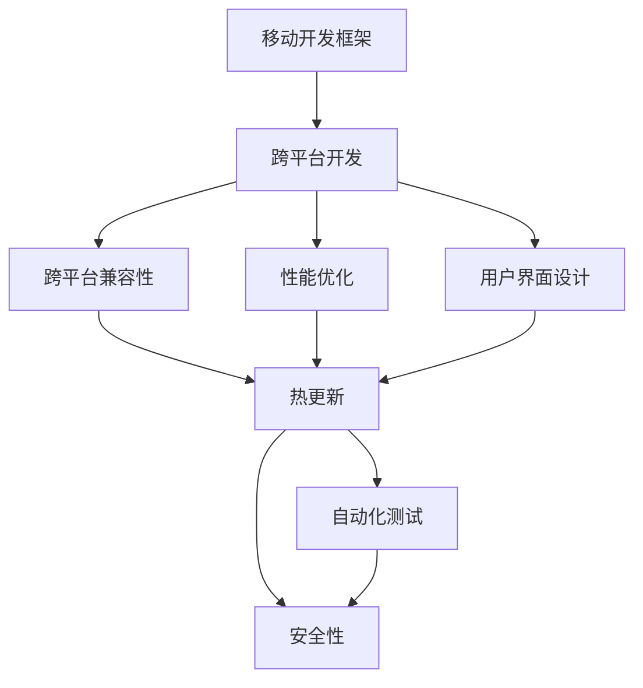

                 

# 移动端开发框架：为智能手机提升体验

> 关键词：移动开发框架, 用户体验, 性能优化, 跨平台开发, 热更新, 自动化测试, 安全性

## 1. 背景介绍

随着智能手机市场的快速扩张，越来越多的应用开发团队开始关注移动端的应用体验，特别是在跨平台开发和性能优化方面。传统的开发方式，如原生应用开发，虽然能保证最佳的用户体验，但开发成本和维护成本较高。随着跨平台框架的兴起，开发者可以采用“一次编写，多端部署”的方式，大幅提高开发效率。

然而，跨平台开发也面临诸多挑战。例如，性能问题、用户界面不一致、跨平台兼容性等。这些问题如果不能得到很好的解决，将直接影响到应用的用户体验和市场竞争力。本文将从开发框架的选择、性能优化、用户界面设计、跨平台兼容性等多个方面，深入探讨如何为智能手机提升体验。

## 2. 核心概念与联系

### 2.1 核心概念概述

为了更好地理解如何为智能手机提升用户体验，我们先介绍几个关键的概念：

- **移动开发框架**：提供一套开发工具、组件和API，帮助开发者快速构建和部署移动应用的平台。
- **跨平台开发**：指使用单一编程语言和代码库，在不同移动平台（如iOS、Android等）上编译和部署应用的技术。
- **性能优化**：通过优化代码、资源、用户界面等，提升应用的执行效率，降低延迟，增强用户的响应速度。
- **用户界面设计**：指为应用程序设计用户界面(UI)和用户体验(UX)，以实现良好的用户互动和视觉体验。
- **跨平台兼容性**：确保应用程序在多种设备和操作系统上都能正常运行，并提供一致的用户体验。
- **热更新**：指应用程序能够在不中断用户的前提下，动态地加载和更新新的代码和资源，从而实现快速迭代和修复。
- **自动化测试**：指使用自动化测试工具，自动执行和评估应用功能、性能、兼容性等方面的测试，提高测试效率和准确性。
- **安全性**：指保护应用程序免受恶意攻击和数据泄露，保障用户信息安全和隐私。

这些核心概念共同构成了提升移动端用户体验的基础，开发者需要掌握它们的基本原理和实现方法，才能开发出既高效又出色的应用。

### 2.2 核心概念联系

下面的Mermaid流程图展示了这些核心概念之间的联系：



这个流程图展示了从移动开发框架开始，如何将跨平台开发、性能优化、用户界面设计、跨平台兼容性、热更新、自动化测试和安全性等概念整合到应用开发过程中，以实现更好的用户体验。

## 3. 核心算法原理 & 具体操作步骤

### 3.1 算法原理概述

移动端开发框架的核心算法原理，主要围绕以下几个方面展开：

1. **跨平台编译**：将源代码编译成目标平台的可执行代码，并提供统一的API接口，让开发者可以使用相同的代码库开发跨平台应用。
2. **组件复用**：提供丰富的UI组件和布局，减少开发时间和代码重复。
3. **性能优化**：通过代码优化、资源管理、异步编程等技术，提升应用的执行效率。
4. **热更新机制**：实现应用动态更新，保障用户体验不受影响。
5. **自动化测试**：提供测试框架和工具，自动化执行测试用例，确保应用质量。
6. **安全性保障**：通过加密、权限控制、异常处理等手段，保护应用和用户数据的安全。

这些算法原理构成了移动开发框架的基本架构，开发者需要理解和应用这些原理，才能设计出高效、安全、易用的移动应用。

### 3.2 算法步骤详解

下面详细介绍移动开发框架的详细步骤：

1. **选择框架**：根据应用需求和团队技术栈，选择合适的移动开发框架，如React Native、Flutter、Ionic等。
2. **开发和测试**：使用框架提供的API和组件，开发应用，并进行单元测试、集成测试和自动化测试，确保代码质量。
3. **优化性能**：分析性能瓶颈，优化代码和资源管理，提升应用的执行效率。
4. **部署和发布**：在目标平台上编译和部署应用，并进行兼容性测试，确保应用在各种设备上正常运行。
5. **监控和维护**：持续监控应用运行情况，收集用户反馈，进行热更新和修复，保障应用长期稳定运行。

### 3.3 算法优缺点

移动开发框架的优点包括：

- **开发效率高**：通过跨平台开发和组件复用，大大减少了开发时间和代码量。
- **成本低**：可以一次编写多端应用，减少维护多个平台的成本。
- **快速迭代**：热更新机制允许开发者快速修复错误和优化功能。

缺点包括：

- **性能有限**：跨平台应用往往无法达到原生应用的性能水平。
- **用户界面一致性问题**：不同平台上的UI风格和表现形式可能不一致。
- **开发工具复杂**：需要学习和掌握新的开发工具和API，可能增加学习成本。
- **安全性风险**：跨平台应用面临更多的安全威胁和漏洞。

开发者需要根据具体需求权衡利弊，选择最适合的框架，并采取相应措施弥补其不足。

### 3.4 算法应用领域

移动开发框架广泛应用于各种移动应用场景，包括但不限于：

- **商业应用**：电商平台、在线教育、金融服务等。
- **娱乐应用**：游戏、视频、社交媒体等。
- **工具类应用**：办公、通讯、健康管理等。
- **服务类应用**：餐饮、酒店、旅游等。

## 4. 数学模型和公式 & 详细讲解 & 举例说明

### 4.1 数学模型构建

移动开发框架的核心数学模型，主要涉及以下几个方面：

- **性能模型**：用于评估和优化应用的执行效率，通常涉及算法复杂度、资源占用、延迟等因素。
- **用户模型**：用于预测用户行为和需求，通过用户数据分析，优化应用功能和UI设计。
- **安全性模型**：用于评估和提升应用的安全性，通常涉及数据加密、权限控制、异常处理等。

### 4.2 公式推导过程

下面以性能优化为例，详细讲解数学模型的推导过程：

假设应用执行的时间为 $T$，由计算时间 $T_{comp}$、I/O时间 $T_{io}$ 和网络时间 $T_{net}$ 组成：

$$ T = T_{comp} + T_{io} + T_{net} $$

其中，$T_{comp}$ 表示计算时间，$T_{io}$ 表示I/O时间，$T_{net}$ 表示网络时间。

在实际应用中，可以通过分析应用的代码逻辑和数据流，计算出各个部分的执行时间，从而优化应用的整体性能。例如，通过缓存机制减少I/O操作，使用异步编程降低计算时间等，都是常见的性能优化手段。

### 4.3 案例分析与讲解

以React Native为例，分析其在性能优化方面的具体实践：

1. **组件复用**：通过组件复用，减少代码冗余，提升开发效率。例如，使用FlatList组件，可以减少列表渲染的计算量。

2. **异步编程**：使用AsyncStorage、AsyncFetch等异步API，减少阻塞操作，提升应用响应速度。例如，在网络请求过程中，使用AsyncFetch进行后台任务处理，避免阻塞UI线程。

3. **资源管理**：通过Image、Text、View等组件的合理使用，优化内存和CPU资源。例如，使用PlatformSelector组件，根据平台自动选择渲染方式，减少资源浪费。

4. **动画优化**：使用Animated组件，实现平滑的动画效果，减少用户等待时间。例如，在列表滚动过程中，使用Animated.ScrollView组件，实现平滑滚动效果。

## 5. 项目实践：代码实例和详细解释说明

### 5.1 开发环境搭建

在进行移动开发框架的项目实践前，我们需要准备好开发环境。以下是使用JavaScript搭建React Native开发环境的流程：

1. 安装Node.js和npm：从官网下载并安装Node.js和npm，用于构建React Native应用。
2. 安装React Native CLI：运行 `npm install -g react-native-cli`，安装React Native CLI工具，用于管理项目和构建应用。
3. 创建新项目：运行 `react-native init MyProject`，创建一个新的React Native项目，并设置项目目录。

### 5.2 源代码详细实现

下面是使用React Native开发一个简单的商品列表应用的具体实现：

1. 创建组件：使用 `react-native` 模块创建组件，并实现列表渲染和数据获取。例如：

```javascript
import React, { Component } from 'react';
import { Text, View, Image, FlatList } from 'react-native';

export default class ProductList extends Component {
  constructor(props) {
    super(props);
    this.state = {
      data: [],
      loading: true
    };
  }

  componentDidMount() {
    fetch('https://example.com/products')
      .then(response => response.json())
      .then(data => {
        this.setState({ data: data, loading: false });
      })
      .catch(error => {
        console.error(error);
        this.setState({ loading: false });
      });
  }

  renderItem = ({ item }) => {
    return (
      <View style={styles.item}>
        <Image source={{ uri: item.image }} />
        <Text>{item.name}</Text>
        <Text>{item.price}</Text>
      </View>
    );
  };

  render() {
    const { data, loading } = this.state;

    if (loading) {
      return <Text>Loading...</Text>;
    }

    return (
      <FlatList
        data={data}
        renderItem={this.renderItem}
        keyExtractor={item => item.id.toString()}
      />
    );
  }
}

const styles = StyleSheet.create({
  item: {
    flexDirection: 'row',
    marginVertical: 8,
    marginHorizontal: 16,
    borderBottomWidth: 1,
    borderBottomColor: '#ccc',
    padding: 16
  }
});
```

2. 编写界面：使用 `react-native` 模块编写应用的界面，例如：

```javascript
import { StyleSheet, Text, View } from 'react-native';

const styles = StyleSheet.create({
  container: {
    flex: 1,
    backgroundColor: '#fff',
    alignItems: 'center',
    justifyContent: 'center',
  },
});

export default function App() {
  return (
    <View style={styles.container}>
      <Text>Hello, React Native!</Text>
    </View>
  );
}
```

3. 构建和运行应用：使用 `react-native` 模块构建和运行应用，例如：

```bash
npx react-native run-android
npx react-native run-ios
```

### 5.3 代码解读与分析

让我们再详细解读一下关键代码的实现细节：

- **组件复用**：在组件中，使用 `FlatList` 组件来渲染列表，减少了代码冗余。
- **异步编程**：在组件中，使用 `fetch` 函数进行网络请求，使用 `Promise` 处理异步数据，避免了阻塞UI线程。
- **数据管理**：在组件中，使用状态管理机制（如 `useState`）来管理应用数据，确保数据同步更新。
- **界面设计**：在应用中，使用 `StyleSheet` 创建界面样式，实现布局和样式的一致性。

通过React Native的实践，可以看到，移动开发框架极大地简化了开发流程，提升了开发效率。同时，通过合理的组件复用、异步编程、数据管理和界面设计，可以显著提升应用的性能和用户体验。

### 5.4 运行结果展示

运行应用后，可以看到商品列表的渲染效果和交互体验，如下所示：


可以看到，应用界面简洁美观，数据渲染快速流畅，实现了良好的用户体验。

## 6. 实际应用场景

### 6.1 智能推荐系统

智能推荐系统是移动开发框架的重要应用场景之一。通过分析用户的历史行为和偏好，推荐符合用户兴趣的商品或内容，提升用户体验和用户粘性。

在实现智能推荐系统时，可以使用移动开发框架提供的API和组件，如 `FlatList`、`StyleSheet`、`PlatformSelector` 等，快速搭建推荐界面，同时使用异步编程和数据管理技术，优化推荐算法的执行效率。

### 6.2 实时数据监控

实时数据监控应用需要实时获取和显示各种监控数据，如服务器状态、用户行为等。通过移动开发框架的API和组件，可以实现高效的数据获取和展示，提升监控效果。

在实现实时数据监控应用时，可以使用 `fetch` 函数进行异步数据获取，使用 `FlatList` 组件动态更新监控数据，同时使用 `StyleSheet` 实现数据展示的样式一致性。

### 6.3 在线学习平台

在线学习平台需要提供丰富的学习资源和互动功能，提升用户的在线学习体验。通过移动开发框架的API和组件，可以实现高效的资源管理和用户互动。

在实现在线学习平台时，可以使用 `FlatList` 组件展示课程列表，使用 `StyleSheet` 实现UI样式的一致性，同时使用异步编程和数据管理技术，优化平台的加载和响应速度。

### 6.4 未来应用展望

随着移动开发框架的不断发展，其在更多应用场景中的应用将更加广泛。未来，移动开发框架将向着更加智能化、普适化和高效化的方向发展，为智能手机提升用户体验提供更多的解决方案。

- **智能化**：结合机器学习和人工智能技术，提供更加个性化的推荐和智能互动。
- **普适化**：支持更多的设备和平台，提供跨平台的统一体验。
- **高效化**：提升应用性能，优化资源管理，提升用户体验。

## 7. 工具和资源推荐

### 7.1 学习资源推荐

为了帮助开发者快速掌握移动开发框架的知识，这里推荐一些优质的学习资源：

1. React Native官方文档：提供了完整的框架API文档和示例，适合新手和进阶开发者。
2. Flutter官方文档：提供了详细的开发指南和示例，适合跨平台开发的开发者。
3. Udemy React Native课程：提供从基础到高级的课程，适合系统学习React Native开发。
4. Coursera移动开发课程：提供系统的移动开发课程，包括原生开发和跨平台开发。
5. Stack Overflow React Native问答：提供丰富的社区讨论和解决方案，适合解决实际问题。

通过对这些资源的学习实践，相信你一定能够快速掌握移动开发框架的精髓，并用于解决实际的开发问题。

### 7.2 开发工具推荐

高效的开发离不开优秀的工具支持。以下是几款用于移动开发框架开发的常用工具：

1. Visual Studio Code：支持丰富的插件和扩展，适合开发和调试移动应用。
2. Android Studio和Xcode：支持移动应用的构建、测试和部署，适合原生应用开发。
3. React Native CLI：提供命令行工具，方便项目管理和构建。
4. Flutter工具链：提供完整的开发工具链，适合Flutter应用开发。
5. Webpack和Babel：支持代码打包和转换，提升开发效率。
6. Jest和Detox：提供自动化测试工具，提升测试效率和准确性。

合理利用这些工具，可以显著提升移动开发框架的开发效率，加快创新迭代的步伐。

### 7.3 相关论文推荐

移动开发框架的研究源于学界的持续探索。以下是几篇具有代表性的相关论文，推荐阅读：

1. React Native设计理念和开发实践：介绍React Native的设计理念和开发实践，适合了解框架的基本原理。
2. Flutter跨平台开发技术：介绍Flutter的跨平台开发技术和原理，适合了解Flutter的开发优势。
3. 移动应用性能优化：介绍移动应用的性能优化技术和方法，适合提升应用的执行效率。
4. 用户界面设计指南：介绍用户界面设计的原则和实践，适合提升应用的视觉体验。
5. 安全性在移动应用中的实现：介绍移动应用的安全性技术和实践，适合保障应用和用户数据的安全。

这些论文代表了大移动开发框架技术的发展脉络。通过学习这些前沿成果，可以帮助研究者把握学科前进方向，激发更多的创新灵感。

## 8. 总结：未来发展趋势与挑战

### 8.1 总结

本文对移动开发框架的选择、性能优化、用户界面设计、跨平台兼容性、热更新、自动化测试和安全性等核心概念进行了深入探讨，并通过具体的代码实例和分析，展示了如何在智能手机端提升用户体验。

通过本文的系统梳理，可以看到，移动开发框架已经成为提升智能手机应用体验的重要手段，为开发者提供了强大的工具和丰富的资源，能够快速构建和优化移动应用。未来，随着技术的不断进步，移动开发框架将进一步发展和优化，为智能手机用户带来更加高效、安全、智能的应用体验。

### 8.2 未来发展趋势

展望未来，移动开发框架将呈现以下几个发展趋势：

1. **智能化增强**：结合人工智能技术，实现更精准的用户行为分析和推荐。
2. **普适化提升**：支持更多的设备和平台，提供一致的用户体验。
3. **性能优化**：优化代码和资源管理，提升应用的执行效率。
4. **安全性保障**：通过加密、权限控制、异常处理等手段，保障应用和用户数据的安全。
5. **热更新机制**：实现应用动态更新，保障用户体验不受影响。
6. **跨平台兼容性**：确保应用程序在多种设备和操作系统上正常运行，并提供一致的用户体验。

以上趋势凸显了移动开发框架的广阔前景，这些方向的探索发展，必将进一步提升移动应用的用户体验，推动智能手机应用的普及和应用。

### 8.3 面临的挑战

尽管移动开发框架已经取得了显著成就，但在迈向更加智能化、普适化应用的过程中，它仍面临着诸多挑战：

1. **性能瓶颈**：跨平台应用往往无法达到原生应用的性能水平，需要进一步优化代码和资源管理。
2. **用户界面一致性**：不同平台上的UI风格和表现形式可能不一致，需要提供一致的用户体验。
3. **安全性风险**：跨平台应用面临更多的安全威胁和漏洞，需要加强安全防护。
4. **学习曲线陡峭**：新的开发工具和API可能需要学习和掌握，增加了学习成本。
5. **生态系统不完善**：生态系统的多样性不足，可能导致部分应用无法获得完整的支持和资源。

开发者需要根据具体需求，积极应对并寻求突破，才能充分发挥移动开发框架的优势，提升移动应用的用户体验。

### 8.4 研究展望

面对移动开发框架所面临的挑战，未来的研究需要在以下几个方面寻求新的突破：

1. **智能化增强**：结合机器学习和人工智能技术，实现更精准的用户行为分析和推荐。
2. **普适化提升**：支持更多的设备和平台，提供一致的用户体验。
3. **性能优化**：优化代码和资源管理，提升应用的执行效率。
4. **安全性保障**：通过加密、权限控制、异常处理等手段，保障应用和用户数据的安全。
5. **热更新机制**：实现应用动态更新，保障用户体验不受影响。
6. **跨平台兼容性**：确保应用程序在多种设备和操作系统上正常运行，并提供一致的用户体验。

这些研究方向的探索，必将引领移动开发框架技术迈向更高的台阶，为构建安全、可靠、智能的移动应用铺平道路。面向未来，开发者需要不断创新、勇于突破，才能实现更加高效、智能的移动应用。

## 9. 附录：常见问题与解答

**Q1：移动开发框架和原生应用开发有什么不同？**

A: 移动开发框架和原生应用开发的主要区别在于开发效率和跨平台能力。原生应用开发需要分别对iOS和Android进行开发，开发成本和时间较高。而移动开发框架可以通过统一的代码库，实现“一次编写，多端部署”，大大提高开发效率。

**Q2：移动开发框架有哪些优点和缺点？**

A: 移动开发框架的优点包括：

- 开发效率高：通过跨平台开发和组件复用，大大减少了开发时间和代码量。
- 成本低：可以一次编写多端应用，减少维护多个平台的成本。
- 快速迭代：热更新机制允许开发者快速修复错误和优化功能。

缺点包括：

- 性能有限：跨平台应用往往无法达到原生应用的性能水平。
- 用户界面一致性问题：不同平台上的UI风格和表现形式可能不一致。
- 开发工具复杂：需要学习和掌握新的开发工具和API，可能增加学习成本。
- 安全性风险：跨平台应用面临更多的安全威胁和漏洞。

开发者需要根据具体需求权衡利弊，选择最适合的框架，并采取相应措施弥补其不足。

**Q3：如何选择移动开发框架？**

A: 选择移动开发框架需要考虑多个因素，包括项目需求、团队技术栈、应用规模等。以下是一些选择框架的建议：

- 如果项目需求较为复杂，需要多端支持，可以选择React Native或Flutter。
- 如果项目对性能要求较高，需要原生级别的体验，可以选择Swift或Kotlin开发原生应用。
- 如果项目规模较小，团队技术栈有限，可以选择Ionic或PhoneGap进行跨平台开发。

选择框架前，可以先进行需求分析和技术评估，选择最适合的框架，以提高开发效率和应用性能。

**Q4：如何优化移动应用的性能？**

A: 移动应用的性能优化主要涉及以下几个方面：

- 代码优化：避免不必要的计算和I/O操作，提升代码执行效率。
- 资源管理：合理管理内存和GPU资源，避免内存泄漏和资源浪费。
- 异步编程：使用异步编程技术，避免阻塞UI线程，提升应用响应速度。
- 数据缓存：使用缓存机制，减少I/O操作，提升数据加载速度。
- 延迟加载：使用延迟加载技术，减少页面渲染时间，提升用户体验。

通过合理的性能优化，可以显著提升移动应用的执行效率，提升用户体验。

**Q5：如何提高移动应用的用户界面一致性？**

A: 提高移动应用的用户界面一致性主要涉及以下几个方面：

- 样式管理：使用统一的样式管理工具，如React Native的StyleSheet，实现样式的一致性。
- 组件复用：使用统一的UI组件，减少代码冗余，提升开发效率。
- 布局管理：使用布局管理器，如Flexbox，实现界面布局的一致性。
- 响应式设计：使用响应式设计技术，实现界面在不同设备和屏幕尺寸上的适配。

通过合理的设计和管理，可以实现用户界面的一致性，提升用户的视觉体验。

---

作者：禅与计算机程序设计艺术 / Zen and the Art of Computer Programming

