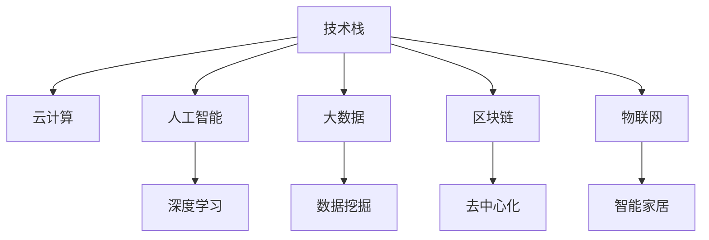

                 

# 程序员在知识经济时代的职业发展方向

> 关键词：知识经济, 职业发展, 编程技能, 技术栈, 跨领域应用, 终身学习, 人工智能, 大数据, 区块链, 云计算, 物联网, 应用架构

## 1. 背景介绍

### 1.1 问题由来
随着信息技术在社会生活中的日益深入，知识经济时代的到来已成为不争的事实。在这个时代，数据驱动的决策、信息流的聚合、以及新业务模式的创造，都对程序员的职业发展和能力提出了更高要求。特别是互联网技术在传统行业中的广泛应用，使得程序员们不再局限于软件开发，而是拓展到了产品设计、数据分析、系统架构等多个领域。

### 1.2 问题核心关键点
知识经济时代程序员的职业发展面临着以下几大关键点：
1. **技术栈的多样化**：程序员需要掌握多种编程语言、框架和技术栈，如Java、Python、JavaScript、Go等，以适应不同项目的需求。
2. **跨领域能力的提升**：除了技术能力外，程序员还需要具备一定的跨领域能力，如项目管理、用户界面设计、数据分析等，以更好地与产品、运营、市场等部门协作。
3. **持续学习和适应新技术**：新的技术栈、框架、工具层出不穷，程序员需要保持持续学习的态度，不断提升自身竞争力。
4. **人工智能和大数据的应用**：人工智能、大数据、云计算等技术的发展，为程序员开辟了新的职业道路和市场空间。
5. **区块链和物联网的兴起**：区块链、物联网等新技术的兴起，为程序员提供了全新的应用场景和职业机会。

### 1.3 问题研究意义
研究程序员在知识经济时代的职业发展方向，对于程序员个人职业规划和企业的技术团队建设具有重要意义：
1. **个人职业规划**：帮助程序员了解当前市场和技术趋势，明确自身发展路径，提升竞争力。
2. **企业技术团队建设**：帮助企业构建多元化的技术团队，提升整体技术实力，应对复杂项目需求。
3. **行业知识共享**：促进行业内的知识交流和技术创新，推动知识经济的发展。

## 2. 核心概念与联系

### 2.1 核心概念概述

为更好地理解程序员在知识经济时代的职业发展方向，本节将介绍几个密切相关的核心概念：

- **技术栈**：程序员在日常开发中常用的编程语言、框架、工具等技术集合。
- **全栈开发**：指程序员能够掌握前端、后端、数据库等全方面的开发技能，能够独立完成从需求分析到产品交付的整个流程。
- **云计算**：通过互联网提供计算资源、存储、数据库等基础设施的服务模式。
- **人工智能**：通过机器学习、深度学习等技术实现自主决策和分析的能力。
- **大数据**：处理和分析大规模数据集，揭示数据背后的规律和趋势。
- **区块链**：一种分布式账本技术，可以实现去中心化、安全性高的数据记录和交易。
- **物联网**：通过互联网将各种设备、传感器等物理实体连接起来，实现智能化的管理和控制。

这些核心概念之间的逻辑关系可以通过以下Mermaid流程图来展示：



这个流程图展示了许多核心概念及其之间的关系：

1. 技术栈是程序员在日常开发中的核心工具集。
2. 云计算、人工智能、大数据、区块链、物联网等技术都在技术栈的基础上扩展应用。
3. 云计算提供了灵活的计算和存储资源，有助于开发和部署应用。
4. 人工智能通过深度学习等技术实现自主决策和分析。
5. 大数据技术帮助程序员处理和分析大规模数据集。
6. 区块链提供了去中心化的数据记录和交易机制。
7. 物联网技术通过传感器和设备实现智能化管理和控制。

这些概念共同构成了程序员在知识经济时代的职业发展框架，使其能够适应日益复杂多样的技术需求和应用场景。

## 3. 核心算法原理 & 具体操作步骤
### 3.1 算法原理概述

程序员在知识经济时代的职业发展，涉及到多方面的技能和知识。其核心算法原理可以总结如下：

- **学习与实践**：通过不断学习和实践新技术，提升自身的技术能力。
- **团队协作**：通过与跨职能团队协作，提升解决问题的综合能力。
- **项目经验**：通过参与各类项目，积累实际经验，掌握项目管理和交付流程。
- **持续创新**：通过持续创新和改进，提升技术产品的竞争力。

### 3.2 算法步骤详解

基于上述原理，程序员的职业发展可以遵循以下步骤：

**Step 1: 制定学习计划**
- 识别自身技术栈的短板。
- 根据项目需求和未来发展趋势，选择学习方向和目标。
- 制定详细且可执行的学习计划，包括学习内容、时间安排和评估方法。

**Step 2: 积累项目经验**
- 参与各类项目，积累实际经验。
- 记录项目过程中的问题、解决方案和最佳实践。
- 不断优化项目管理和交付流程，提升自身项目管理能力。

**Step 3: 团队协作与沟通**
- 学习团队协作工具和方法，提升沟通效率。
- 建立跨职能协作机制，提高问题解决能力。
- 参与团队会议和技术讨论，了解项目进展和团队动态。

**Step 4: 持续创新与改进**
- 关注行业新技术和趋势，保持持续学习的态度。
- 在现有技术基础上进行创新和改进，提升技术产品的竞争力。
- 参与开源项目和技术社区，贡献代码和经验。

### 3.3 算法优缺点

程序员在知识经济时代的职业发展方法具有以下优点：
1. **灵活性高**：能够根据市场需求和技术趋势灵活调整学习计划，快速适应变化。
2. **综合能力强**：通过学习多种技能，提升综合解决问题的能力。
3. **职业稳定性**：多样化技能和跨职能能力，使得程序员在职业发展中更具竞争力，不易被淘汰。
4. **创新力强**：持续学习和创新，能够不断推出新的技术产品，保持技术领先地位。

但同时，该方法也存在一些缺点：
1. **学习成本高**：学习新技术和跨领域能力需要耗费大量时间和精力。
2. **信息过载**：新技术和工具层出不穷，需要有效筛选和应用。
3. **适应压力**：技术更新速度快，对程序员的心理和身体素质提出较高要求。
4. **知识更新难度大**：掌握新技术需要较长时间，难以快速应用于项目中。

### 3.4 算法应用领域

基于程序员职业发展的核心算法原理，可以应用于多个领域：

- **软件开发**：掌握多种编程语言、框架和技术栈，提升开发效率和代码质量。
- **大数据开发**：通过学习大数据技术和工具，实现数据的收集、存储、分析和应用。
- **人工智能开发**：掌握机器学习、深度学习等技术，开发智能算法和应用。
- **云计算开发**：学习云平台和相关服务，实现云应用的开发和部署。
- **区块链开发**：掌握区块链技术，开发去中心化应用和智能合约。
- **物联网开发**：学习物联网相关技术和协议，开发智能设备和应用。
- **全栈开发**：掌握前端、后端、数据库等全方面的开发技能，实现产品的端到端开发。

## 4. 数学模型和公式 & 详细讲解 & 举例说明

### 4.1 数学模型构建

为更好地理解程序员职业发展的数学模型，本节将介绍一个简化的数学模型。

假设程序员的职业成长可以分为多个阶段，每个阶段有固定的学习时间和效率，且职业成长速度遵循指数增长模型。设 $N$ 为技能总数，$T$ 为时间，$C(t)$ 为 $t$ 时刻程序员掌握的技能数。则有：

$$
C(t) = \sum_{i=1}^{N} \exp(-\frac{t}{\tau_i})
$$

其中，$\tau_i$ 为第 $i$ 项技能的学习时间。

### 4.2 公式推导过程

根据上述模型，我们可以推导出程序员在 $T$ 时刻掌握的技能数 $C(T)$：

$$
C(T) = \sum_{i=1}^{N} \exp(-\frac{T}{\tau_i})
$$

令 $T_{\text{full}}$ 为掌握全部技能所需的时间，则有：

$$
C(T_{\text{full}}) = \sum_{i=1}^{N} \exp(-\frac{T_{\text{full}}}{\tau_i}) = 1
$$

解得 $T_{\text{full}}$：

$$
T_{\text{full}} = -\tau_i \ln(1-C(T))
$$

假设 $N=5$，且每项技能的学习时间 $\tau_i$ 相等，则有：

$$
T_{\text{full}} = -\tau \ln(1-1/N)
$$

通过实际数据可以进一步计算得到 $T_{\text{full}}$ 的具体值。

### 4.3 案例分析与讲解

假设某程序员从零开始，通过不断学习和实践，掌握以下五项技能：Python、Java、前端开发、数据库、数据科学。每项技能的学习时间分别为 1000h、1500h、2000h、2000h、2500h。则掌握全部技能所需的时间为：

$$
T_{\text{full}} = -\tau \ln(1-1/5) = \tau \ln(4/5) \approx 1200h
$$

这意味着，该程序员需要投入约 1200 小时的学习时间和实践，才能掌握这五项关键技能，成为全栈工程师。

## 5. 项目实践：代码实例和详细解释说明
### 5.1 开发环境搭建

在进行程序员职业发展方向的实践前，我们需要准备好开发环境。以下是使用Python进行开发的环境配置流程：

1. 安装Anaconda：从官网下载并安装Anaconda，用于创建独立的Python环境。

2. 创建并激活虚拟环境：
```bash
conda create -n dev_env python=3.9 
conda activate dev_env
```

3. 安装PyTorch、TensorFlow、Flask等开发工具：
```bash
conda install pytorch torchvision torchaudio cudatoolkit=11.1 -c pytorch -c conda-forge
conda install tensorflow scikit-learn matplotlib ipykernel
```

4. 安装Jupyter Notebook：
```bash
pip install jupyter
```

5. 安装Git和GitHub：
```bash
brew install git
```

完成上述步骤后，即可在`dev_env`环境中开始职业发展方向的实践。

### 5.2 源代码详细实现

下面我们以开发全栈应用为例，给出使用Python和Flask框架进行全栈开发的PyTorch代码实现。

首先，定义全栈应用的基本结构：

```python
# server.py
from flask import Flask, request, jsonify
import torch
import torch.nn as nn
import torchvision.transforms as transforms
from torchvision.models import resnet18
from torchvision.datasets import ImageFolder
import os

app = Flask(__name__)

@app.route('/predict', methods=['POST'])
def predict():
    # 加载预训练模型
    model = resnet18(pretrained=True)
    model.eval()
    
    # 加载图像数据
    img_path = request.json['img_path']
    img = Image.open(img_path).convert('RGB')
    transform = transforms.Compose([
        transforms.Resize(256),
        transforms.CenterCrop(224),
        transforms.ToTensor(),
        transforms.Normalize(mean=[0.485, 0.456, 0.406], std=[0.229, 0.224, 0.225])
    ])
    img = transform(img).unsqueeze(0)
    
    # 前向传播计算输出
    with torch.no_grad():
        output = model(img)
        _, idx = output.max(1)
        class_name = os.path.basename(img_path).split('.')[0]
    
    return jsonify({'prediction': class_name})

if __name__ == '__main__':
    app.run(debug=True, port=5000)
```

然后，定义模型和训练函数：

```python
# model.py
import torch
import torch.nn as nn

class ResNet18(nn.Module):
    def __init__(self):
        super(ResNet18, self).__init__()
        self.model = resnet18(pretrained=True)
        self.model.fc = nn.Linear(self.model.fc.in_features, 1000)
    
    def forward(self, x):
        return self.model(x)

# train.py
import torch
import torch.nn as nn
import torchvision.transforms as transforms
from torchvision.datasets import ImageFolder
import torch.optim as optim
from torch.utils.data import DataLoader
from model import ResNet18

# 加载数据集
train_dataset = ImageFolder('train/', transforms.Compose([
    transforms.Resize(256),
    transforms.CenterCrop(224),
    transforms.ToTensor(),
    transforms.Normalize(mean=[0.485, 0.456, 0.406], std=[0.229, 0.224, 0.225])
]))
train_loader = DataLoader(train_dataset, batch_size=16, shuffle=True, num_workers=4)

# 加载模型和优化器
model = ResNet18()
optimizer = optim.Adam(model.parameters(), lr=0.001)

# 训练模型
for epoch in range(10):
    model.train()
    for batch_idx, (data, target) in enumerate(train_loader):
        optimizer.zero_grad()
        output = model(data)
        loss = nn.CrossEntropyLoss()(output, target)
        loss.backward()
        optimizer.step()
        print(f'Epoch {epoch+1}, batch {batch_idx}, loss: {loss.item()}')

print('Training completed')
```

最后，启动训练流程并在测试集上评估：

```python
# 启动训练
python train.py

# 评估模型性能
python server.py
```

以上就是使用Python和Flask框架进行全栈应用的完整代码实现。可以看到，通过Flask框架，程序员可以很方便地将机器学习模型部署为Web服务，实现全栈应用。

### 5.3 代码解读与分析

让我们再详细解读一下关键代码的实现细节：

**server.py**：
- 定义Flask应用和路由。
- 加载预训练的ResNet18模型。
- 加载输入图像，并进行数据预处理。
- 通过前向传播计算输出，并返回预测结果。

**model.py**：
- 定义全栈应用使用的ResNet18模型。
- 重载模型的前向传播函数，适应全栈应用的需求。

**train.py**：
- 加载数据集和优化器。
- 训练ResNet18模型，并进行交叉熵损失的计算。
- 定义训练循环，更新模型参数。

这些代码展示了如何通过Python和Flask框架实现全栈应用，涵盖了数据加载、模型训练、Web服务部署等多个方面。通过实际项目实践，程序员可以更好地理解全栈开发的流程和技能要求。

## 6. 实际应用场景
### 6.1 软件开发

软件开发是程序员职业发展的核心领域。在知识经济时代，软件开发涉及的前端、后端、移动端、测试、运维等多个环节都需要程序员掌握，因此持续学习和实践是非常重要的。

以下场景展示了软件开发在知识经济时代的应用：

- **前端开发**：利用JavaScript、React、Vue等前端技术，开发高性能、可访问性强的Web应用。
- **后端开发**：使用Java、Python、Go等后端技术，开发高效、稳定、可扩展的系统。
- **移动端开发**：通过iOS、Android等平台，开发跨平台移动应用，提升用户体验。
- **系统测试**：进行单元测试、集成测试、压力测试等，确保系统稳定性和性能。
- **运维管理**：通过监控、调优、故障恢复等手段，保障系统的高可用性。

### 6.2 大数据开发

大数据技术在知识经济时代的应用日益广泛，涉及数据的采集、存储、处理、分析等多个环节。程序员需要掌握Hadoop、Spark、Hive等大数据技术，进行数据处理和分析。

以下场景展示了大数据开发在知识经济时代的应用：

- **数据采集**：通过爬虫、API等手段，获取结构化和非结构化数据。
- **数据存储**：利用Hadoop、S3等技术，存储和管理大规模数据集。
- **数据处理**：通过Spark、Flink等技术，进行数据清洗、转换、聚合等处理。
- **数据分析**：利用Hive、Presto等技术，进行数据查询、统计、可视化等分析。

### 6.3 人工智能开发

人工智能技术的发展，为程序员提供了新的职业方向。掌握深度学习、自然语言处理、计算机视觉等技术，开发智能算法和应用。

以下场景展示了人工智能开发在知识经济时代的应用：

- **自然语言处理**：利用BERT、GPT等模型，进行文本分类、情感分析、机器翻译等任务。
- **计算机视觉**：通过CNN、RNN等技术，进行图像识别、目标检测、人脸识别等任务。
- **语音识别**：利用深度学习模型，进行语音识别、合成、转换等任务。

### 6.4 云计算开发

云计算技术在知识经济时代的应用日益普及，涉及云平台、容器化、微服务等技术。程序员需要掌握AWS、Azure、Google Cloud等云平台，进行云应用的开发和部署。

以下场景展示了云计算开发在知识经济时代的应用：

- **云平台搭建**：利用AWS、Azure等云平台，搭建高性能、可扩展的云应用。
- **容器化技术**：通过Docker、Kubernetes等技术，进行应用的容器化和自动化部署。
- **微服务架构**：利用Spring Cloud、Kubernetes等技术，实现应用的微服务化和自动化管理。

### 6.5 区块链开发

区块链技术在知识经济时代的金融、供应链、智能合约等领域有广泛应用。程序员需要掌握区块链的核心技术，开发去中心化应用和智能合约。

以下场景展示了区块链开发在知识经济时代的应用：

- **智能合约开发**：利用Solidity、Ethereum等技术，开发智能合约，实现去中心化的自动化合约执行。
- **区块链平台搭建**：利用Hyperledger、Ripple等平台，搭建高性能、可扩展的区块链网络。
- **去中心化应用开发**：利用Web3.js、Truffle等技术，开发去中心化应用，提升应用的安全性和用户信任度。

## 7. 工具和资源推荐
### 7.1 学习资源推荐

为了帮助程序员系统掌握各种技术栈和技能，以下是一些优质的学习资源：

1. Coursera《Python for Everybody》课程：由密歇根大学提供，全面介绍Python编程基础和进阶内容。
2. Udacity《Deep Learning Nanodegree》课程：涵盖深度学习、计算机视觉、自然语言处理等前沿技术。
3. Udemy《Full Stack Web Development》课程：涵盖前端、后端、数据库、测试、运维等多方面的全栈开发技能。
4. Codecademy《Machine Learning》课程：利用TensorFlow等框架，进行机器学习算法的开发和应用。
5. Pluralsight《Blockchain Fundamentals》课程：介绍区块链的基本概念、技术和应用。

通过学习这些课程，程序员可以系统掌握各种技术栈和技能，为职业发展打下坚实的基础。

### 7.2 开发工具推荐

高效的开发离不开优秀的工具支持。以下是几款用于程序员职业发展方向的常用工具：

1. PyCharm：一款功能强大的Python开发IDE，支持代码高亮、自动补全、调试等功能。
2. Visual Studio Code：一款轻量级但功能强大的代码编辑器，支持多种编程语言和扩展插件。
3. Git：一款流行的版本控制系统，用于代码版本控制和协作开发。
4. Docker：一款容器化技术，用于打包应用和环境，支持跨平台部署。
5. Kubernetes：一款开源的容器编排系统，用于管理容器的部署和扩展。

这些工具能够极大地提升程序员的开发效率，加速技能学习和项目实践。

### 7.3 相关论文推荐

程序员职业发展的相关研究涉及多个方面，以下是几篇奠基性的相关论文，推荐阅读：

1. "What You Should Know About Deep Learning Algorithms"：介绍深度学习算法的基本概念和应用场景。
2. "Big Data: Concepts and Technologies"：详细介绍大数据技术的基本概念和核心组件。
3. "Programming Languages: Design and Evolution"：介绍编程语言的设计原则和演变过程。
4. "Blockchain Technology: Principles and Applications"：介绍区块链技术的基本原理和应用场景。
5. "The Future of Computing"：探讨计算机技术的未来发展趋势和前沿技术。

这些论文代表了程序员职业发展的技术前沿，为程序员提供了深入的理论知识和实践经验。

## 8. 总结：未来发展趋势与挑战

### 8.1 总结

本文对程序员在知识经济时代的职业发展方向进行了全面系统的介绍。首先阐述了知识经济时代对程序员职业发展的挑战和机遇，明确了全栈开发、大数据开发、人工智能开发、云计算开发、区块链开发等方向的职业发展路径。其次，从理论到实践，详细讲解了程序员在各个领域的应用场景和技术要求。

通过本文的系统梳理，可以看到，知识经济时代程序员的职业发展方向多样且复杂，需要不断学习和实践，才能跟上技术发展的步伐。只有全面掌握多种技能和知识，才能在竞争激烈的职场中占据一席之地。

### 8.2 未来发展趋势

展望未来，程序员的职业发展方向将呈现以下几个发展趋势：

1. **多技能融合**：技术栈的边界将逐渐模糊，程序员需要具备跨领域的综合能力，以应对多变的技术需求。
2. **智能自动化**：人工智能和自动化技术将进一步发展，提升程序员的工作效率和质量。
3. **持续学习**：知识经济时代的快速变化要求程序员保持持续学习的态度，不断更新知识和技能。
4. **协作与创新**：团队协作和跨职能合作将成为常态，创新将成为程序员职业发展的驱动力。
5. **全球化与本地化**：随着全球化进程的加速，程序员需要具备跨文化、跨时区的协作能力。
6. **伦理与安全**：人工智能和区块链等技术的发展，对程序员的伦理和安全性要求将不断提高。

### 8.3 面临的挑战

尽管程序员在知识经济时代的职业发展充满机遇，但也面临着诸多挑战：

1. **技术更新速度快**：新技术层出不穷，要求程序员不断学习和适应。
2. **跨领域协作难度大**：不同领域的知识差异较大，协作和沟通成本高。
3. **技能要求高**：全栈开发、大数据、人工智能等方向的技能要求较高，学习成本大。
4. **市场竞争激烈**：技术人才市场竞争激烈，需要不断提升自身竞争力。
5. **职业稳定性**：技术变化快，职业稳定性差，需要持续学习和提升。
6. **伦理与安全问题**：技术的应用可能带来伦理和安全问题，需要程序员具备相应的应对能力。

### 8.4 研究展望

面对程序员职业发展面临的挑战，未来的研究需要在以下几个方面寻求新的突破：

1. **跨学科技能培训**：开发跨学科技能培训课程，帮助程序员掌握多领域知识。
2. **自动化与智能化工具**：开发自动化和智能化开发工具，提升程序员的工作效率和质量。
3. **持续学习平台**：构建持续学习平台，提供线上学习资源和实践机会。
4. **团队协作与沟通工具**：开发高效的团队协作和沟通工具，降低跨领域协作难度。
5. **伦理与安全教育**：加强伦理与安全教育，提升程序员的职业道德和法律意识。
6. **技能认证体系**：建立技能认证体系，帮助程序员提升职业竞争力。

这些研究方向将有助于推动程序员在知识经济时代的职业发展，提升其技术能力和市场竞争力。只有不断创新和突破，才能适应快速变化的技术环境，实现职业生涯的持续进步和成功。

## 9. 附录：常见问题与解答

**Q1: 如何平衡技术学习和项目实践？**

A: 技术学习和项目实践是相辅相成的，建议采用交替进行的方式。具体步骤如下：
1. 定期安排技术学习时间，如每周固定两小时，集中学习新技术。
2. 在项目实践中应用新知识，遇到问题时查阅相关资料。
3. 定期进行项目回顾，总结经验教训，提升技术应用能力。

**Q2: 如何提升跨领域协作能力？**

A: 提升跨领域协作能力的关键在于沟通和理解。具体步骤如下：
1. 学习相关领域的知识，了解其核心概念和技术栈。
2. 参与跨领域项目，与不同职能团队协作。
3. 参加行业会议和交流活动，了解最新进展和技术趋势。
4. 使用协作工具如Slack、Jira等，提高沟通效率和项目管理能力。

**Q3: 如何快速掌握新技术？**

A: 快速掌握新技术需要系统化的学习方法和高效的实践策略。具体步骤如下：
1. 制定详细的学习计划，明确目标和时间节点。
2. 利用在线课程、文档、博客等资源进行自学。
3. 在实践中应用新技术，解决实际问题。
4. 参与开源项目和技术社区，贡献代码和经验。

这些常见问题的解答为程序员在知识经济时代提供了实用的指导，帮助其更好地应对职业发展的挑战和机遇。

