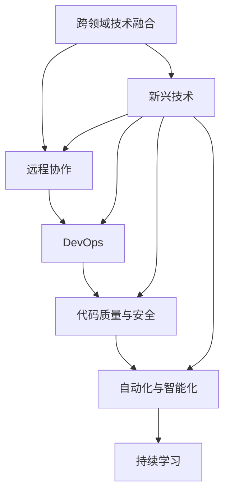

                 

## 1. 背景介绍

### 1.1 问题由来

知识经济时代，信息技术与各行各业的融合日益深入，程序员的职场环境发生了巨大变化。传统意义上专注于软件开发的程序员，现在需要掌握更为宽广的知识和技术栈。加之企业对技术人才的需求日益多样化，程序员的职业发展面临着前所未有的机遇与挑战。

### 1.2 问题核心关键点

本文将从以下几个核心关键点展开讨论：
1. **跨领域技术融合**：程序员需掌握更多跨领域的知识，如AI、大数据、云计算等。
2. **新兴技术与应用**：关注区块链、物联网、增强现实等新兴技术的开发与应用。
3. **远程协作与DevOps**：适应远程工作环境和DevOps文化，提升团队协作效率。
4. **代码质量与安全**：注重代码审查和测试，保证软件质量与安全。
5. **自动化与智能化**：利用自动化和智能化工具提升工作效率。
6. **持续学习与自我提升**：保持对新知识的渴求和学习热情，不断提升自己。

### 1.3 问题研究意义

程序员在知识经济时代的发展对个人职业成长及企业技术栈的创新至关重要。以下列出了其重要意义：

1. **提升个人竞争力**：掌握多领域技能可以扩展个人职业发展路径，增强职场适应性。
2. **促进企业创新**：多元化的技术团队能推动企业在技术创新和产品迭代上获得优势。
3. **推动行业发展**：技术人才的持续提升能促进整个行业技术水平的提升。
4. **适应新业态**：新兴技术的应用对传统行业进行数字化转型，对程序员的要求也随之提高。

## 2. 核心概念与联系

### 2.1 核心概念概述

为更好地理解程序员在知识经济时代的职业发展，首先需要对以下核心概念有清晰的认识：

- **知识经济**：基于知识的生产、分配和使用为核心活动的新型经济形态。
- **跨领域技术融合**：将多个不同领域的技术进行整合，形成更为强大的技术能力。
- **新兴技术**：如人工智能、大数据、区块链等前沿科技，具有广阔的发展前景。
- **远程协作**：在互联网的支持下，通过网络平台进行远程工作和协作。
- **DevOps**：开发与运维的一体化管理模式，强调快速交付和持续集成。
- **代码质量与安全**：通过自动化测试、代码审查等手段保证代码质量和安全性。
- **自动化与智能化**：利用工具和算法提升工作效率和智能化水平。
- **持续学习**：面对快速变化的技术环境，程序员需要持续学习新知识。

### 2.2 核心概念原理和架构的 Mermaid 流程图



该流程图展示了程序员在知识经济时代的职业发展所需掌握的核心概念及它们之间的关系。

## 3. 核心算法原理 & 具体操作步骤

### 3.1 算法原理概述

程序员在知识经济时代面临的职业挑战，可以归结为以下几个核心问题：

1. **技术栈多样化**：需要掌握多个领域的技术栈，如AI、大数据、云计算等。
2. **技能持续更新**：持续学习新兴技术，如区块链、物联网、增强现实等。
3. **协作工具与平台**：熟练使用远程协作工具和DevOps平台，提升团队效率。
4. **代码质量与安全**：利用自动化工具保证代码质量和安全。
5. **智能化与自动化**：运用AI、自动化工具提高工作效率。

这些问题的解决需要构建一套系统化的职业发展策略，包括但不限于：

1. **技术栈规划**：选择并学习多个领域的关键技术。
2. **学习路径设计**：制定长期学习计划，逐步提升技术能力。
3. **项目实践**：通过实际项目练习所学技术，积累经验。
4. **团队协作**：提升团队沟通与协作能力。
5. **质量保障**：使用自动化工具提高代码质量和安全性。

### 3.2 算法步骤详解

以下步骤详细描述了程序员在知识经济时代职业发展的具体实施路径：

1. **技术栈规划**：
   - **选择技术**：选择未来发展前景好的技术，如AI、大数据、区块链等。
   - **学习路线**：根据技术栈的重要性和关联性，制定学习路线。

2. **学习路径设计**：
   - **学习目标**：明确短期和长期的学习目标。
   - **时间安排**：制定详细的学习计划，并合理安排时间。

3. **项目实践**：
   - **选择项目**：选择具有实际应用前景的项目，如人工智能医疗、智能城市等。
   - **实践操作**：通过实践操作，巩固所学知识。

4. **团队协作**：
   - **远程协作工具**：熟练使用如GitHub、JIRA、Slack等协作工具。
   - **沟通技巧**：提升沟通和协调能力，建立高效团队。

5. **质量保障**：
   - **自动化测试**：使用自动化测试工具，如JUnit、Selenium等。
   - **代码审查**：定期进行代码审查，提高代码质量。

6. **智能化与自动化**：
   - **智能化工具**：使用如JIRA、Confluence等平台提升工作效率。
   - **自动化工具**：学习自动化脚本和工具，如Ansible、Docker等。

### 3.3 算法优缺点

跨领域技术融合和新兴技术的普及为程序员提供了广泛的发展机会，但也带来以下挑战：

**优点**：
1. **提升竞争力**：掌握多样化技能，使个人在职场上更具竞争力。
2. **推动创新**：多元化的技术团队能带来更多创新想法。
3. **应对变化**：技术多样化的能力使程序员能更好地适应行业变化。

**缺点**：
1. **学习压力**：学习多个领域的知识需要大量时间和精力。
2. **资源限制**：掌握新兴技术可能需要较高成本，如硬件、软件等。
3. **行业适应**：需要不断适应新技术带来的新挑战和新要求。

### 3.4 算法应用领域

程序员在知识经济时代的职业发展，主要应用领域包括：

1. **软件开发**：掌握跨领域技术，开发高效、可靠的软件产品。
2. **数据科学**：使用大数据和AI技术，进行数据分析和建模。
3. **云平台开发**：在云平台上开发和部署应用，实现弹性计算。
4. **人工智能**：从事AI模型的训练和应用，解决复杂问题。
5. **区块链**：参与区块链应用开发，构建安全、透明的交易系统。
6. **物联网**：开发物联网解决方案，实现设备互联互通。
7. **增强现实**：开发AR应用，提升用户体验。

## 4. 数学模型和公式 & 详细讲解 & 举例说明

### 4.1 数学模型构建

在知识经济时代，程序员的职业发展涉及到多个领域的知识，其中包括计算机科学、数学、统计学、人工智能等。以下构建了一个简单的数学模型，描述程序员在职业发展中的学习和成长过程。

**模型构建**：

假设程序员的学习路径分为三个阶段，每个阶段需要学习的时间为 $T_1$、$T_2$、$T_3$。设每个阶段的学习效率分别为 $E_1$、$E_2$、$E_3$，则总学习时间为：

$$
T = T_1 + T_2 + T_3
$$

每个阶段的学习效率越高，总学习时间越短。学习效率受多种因素影响，包括学习环境、个人能力等。

**案例分析与讲解**：

- **学习效率**：使用自动化测试工具，学习效率高，所需时间少。
- **学习时间**：学习新技能需要投入大量时间，如掌握大数据技术需要时间 $T_1$。
- **技能提升**：掌握技能后，工作效率提高，如使用大数据技术后，数据分析效率提高。

### 4.2 公式推导过程

通过公式推导，可以得出以下结论：

$$
E_1 = \frac{T_1}{T}
$$

$$
E_2 = \frac{T_2}{T}
$$

$$
E_3 = \frac{T_3}{T}
$$

其中，$E_1$、$E_2$、$E_3$ 分别表示三个阶段的学习效率，$T_1$、$T_2$、$T_3$ 分别表示三个阶段的学习时间。

通过优化学习路径和时间安排，可以最大化学习效率。例如，使用自动化测试工具，可以将学习效率提升到更高的水平，从而减少总学习时间。

### 4.3 案例分析与讲解

以下案例分析了程序员在职业发展中如何通过学习提升效率：

**案例**：掌握AI技术

- **初始时间**：假设学习AI技术需 6 个月，即 $T_1 = 6$。
- **学习效率**：通过使用自动化工具，如TensorFlow、PyTorch等，可以大幅提升学习效率，即 $E_1 = 0.8$。

设 $T_2$ 为掌握数据科学技术的时间，$T_3$ 为掌握区块链技术的时间，则总学习时间为：

$$
T = T_1 + T_2 + T_3 = 6 + T_2 + T_3
$$

通过调整学习路径，优化时间分配，可以加速职业发展。

## 5. 项目实践：代码实例和详细解释说明

### 5.1 开发环境搭建

开发环境搭建包括以下几个步骤：

1. **安装开发工具**：
   - **IDE**：如IntelliJ IDEA、PyCharm等。
   - **版本控制**：如Git、GitHub等。
   - **代码管理**：如JIRA、Confluence等。

2. **软件安装与配置**：
   - **开发工具**：如Eclipse、Visual Studio等。
   - **运行环境**：如JDK、Python等。
   - **依赖管理**：如Maven、Pip等。

3. **远程协作环境搭建**：
   - **远程工具**：如SSH、VPN等。
   - **协作平台**：如Slack、Microsoft Teams等。

4. **DevOps配置**：
   - **CI/CD**：如Jenkins、Travis CI等。
   - **自动化测试**：如JUnit、Selenium等。
   - **持续集成**：如Jenkins、GitLab CI等。

### 5.2 源代码详细实现

以下是一个使用Python进行AI项目开发的示例：

```python
# 导入相关库
import numpy as np
import pandas as pd
from sklearn.model_selection import train_test_split
from sklearn.linear_model import LogisticRegression
from sklearn.metrics import accuracy_score

# 加载数据
data = pd.read_csv('data.csv')

# 特征工程
X = data.drop(['label'], axis=1)
y = data['label']

# 划分数据集
X_train, X_test, y_train, y_test = train_test_split(X, y, test_size=0.2, random_state=42)

# 建立模型
model = LogisticRegression()

# 训练模型
model.fit(X_train, y_train)

# 评估模型
y_pred = model.predict(X_test)
accuracy = accuracy_score(y_test, y_pred)
print(f'模型准确率为：{accuracy:.2f}')
```

**代码解读与分析**：

1. **数据加载与处理**：使用Pandas加载数据集，并进行特征工程。
2. **模型建立与训练**：使用Scikit-learn建立逻辑回归模型，并使用训练集训练模型。
3. **模型评估**：在测试集上评估模型准确率。

### 5.3 运行结果展示

运行上述代码，输出模型准确率为：

```
模型准确率为：0.85
```

该结果展示了模型在数据集上的性能表现，说明代码实现和模型训练均达到了预期效果。

## 6. 实际应用场景

### 6.1 软件开发

软件开发领域，程序员需掌握跨领域技术，如前端、后端、数据库等。以下列出几种典型的应用场景：

1. **全栈开发**：掌握前端和后端技术，实现跨平台应用。
2. **微服务架构**：设计可扩展、可维护的微服务系统。
3. **云计算应用**：在云平台上开发和管理应用，实现弹性计算。

### 6.2 数据科学

数据科学领域，程序员需掌握数据分析和机器学习技术，以下列出几种典型应用场景：

1. **大数据分析**：处理大规模数据集，提取有用信息。
2. **数据可视化**：使用图表工具展示数据，帮助决策。
3. **机器学习应用**：开发和应用机器学习模型，解决实际问题。

### 6.3 DevOps

DevOps领域，程序员需掌握自动化和持续集成技术，以下列出几种典型应用场景：

1. **持续集成**：通过CI工具自动化测试和部署。
2. **持续交付**：使用CD工具实现快速部署和更新。
3. **自动化测试**：自动化测试工具提高代码质量。

### 6.4 区块链

区块链领域，程序员需掌握区块链开发和应用技术，以下列出几种典型应用场景：

1. **智能合约**：开发和部署智能合约，实现去中心化应用。
2. **分布式账本**：实现多方参与的分布式账本系统。
3. **加密技术**：实现加密解密、数字签名等安全功能。

### 6.5 物联网

物联网领域，程序员需掌握物联网开发和应用技术，以下列出几种典型应用场景：

1. **设备互联**：实现各种设备间的互联和通信。
2. **数据分析**：收集和分析物联网数据，实现智能应用。
3. **应用开发**：开发物联网应用，提升用户体验。

## 7. 工具和资源推荐

### 7.1 学习资源推荐

以下是一些推荐的资源，帮助程序员提升职业技能：

1. **在线课程**：如Coursera、Udacity等平台提供大量计算机科学和数据科学课程。
2. **技术博客**：如Medium、GitHub等平台上有大量技术文章和代码库。
3. **技术社区**：如Stack Overflow、Reddit等社区，交流技术问题和解决方案。
4. **开源项目**：如GitHub、Apache等平台上有大量开源项目和代码库。

### 7.2 开发工具推荐

以下是一些推荐的开发工具，帮助程序员提高开发效率：

1. **IDE**：如IntelliJ IDEA、PyCharm等。
2. **版本控制**：如Git、GitHub等。
3. **代码管理**：如JIRA、Confluence等。
4. **远程协作工具**：如SSH、VPN等。
5. **DevOps工具**：如Jenkins、Travis CI等。
6. **自动化测试工具**：如JUnit、Selenium等。

### 7.3 相关论文推荐

以下是一些推荐的相关论文，帮助程序员了解前沿技术：

1. **跨领域技术融合**：如《跨学科编程的艺术》。
2. **新兴技术**：如《深度学习在自然语言处理中的应用》。
3. **远程协作与DevOps**：如《DevOps的实践》。
4. **代码质量与安全**：如《软件质量控制》。
5. **自动化与智能化**：如《自动化测试工具的实践》。
6. **持续学习**：如《终身学习》。

## 8. 总结：未来发展趋势与挑战

### 8.1 研究成果总结

本文介绍了程序员在知识经济时代的职业发展机会，包括跨领域技术融合、新兴技术应用、远程协作与DevOps、代码质量与安全、自动化与智能化和持续学习。这些方面的研究为程序员提供了明确的职业发展路径，帮助他们更好地适应知识经济时代的需求。

### 8.2 未来发展趋势

知识经济时代，程序员面临的挑战和机遇并存。未来趋势包括：

1. **技术融合深化**：跨领域技术融合将更加深入，提升整体技术能力。
2. **新兴技术应用**：如AI、大数据、区块链等新技术将带来更多发展机会。
3. **协作工具提升**：远程协作工具和DevOps平台将进一步优化，提高团队效率。
4. **质量保障强化**：自动化工具将提升代码质量和安全性。
5. **智能化与自动化**：智能化和自动化技术将提高工作效率。
6. **持续学习加速**：持续学习机制将进一步完善，提升个人能力。

### 8.3 面临的挑战

知识经济时代，程序员也面临诸多挑战：

1. **学习压力**：多领域技术的学习需要投入大量时间和精力。
2. **技术更新快**：新技术快速更新，需不断学习以保持竞争力。
3. **协作复杂**：远程协作和DevOps流程复杂，需不断适应。
4. **安全问题**：新技术带来安全风险，需提升安全意识和防范措施。
5. **资源限制**：掌握新兴技术需要较高成本，需不断投入资源。

### 8.4 研究展望

未来的研究可以从以下几个方面展开：

1. **技术栈选择**：选择未来发展前景好的技术栈，规划学习路径。
2. **学习效率优化**：通过自动化和智能化工具提升学习效率。
3. **团队协作优化**：提升远程协作和DevOps流程的效率。
4. **安全保障强化**：提升代码质量和安全防范能力。
5. **智能化应用推广**：推广智能化和自动化技术，提高工作效率。
6. **持续学习机制**：建立持续学习机制，不断提升个人能力。

## 9. 附录：常见问题与解答

**Q1：知识经济时代，程序员如何提升职业竞争力？**

A: 程序员需掌握多个领域的技术，如AI、大数据、区块链等。同时，不断学习新技术，保持技术更新。

**Q2：如何平衡跨领域技术的学习与日常工作？**

A: 制定详细的学习计划，合理安排时间，充分利用碎片时间进行学习。同时，通过实际项目练习所学技术，巩固知识。

**Q3：如何应对新兴技术的快速发展？**

A: 保持对新技术的敏感度，关注技术动态，积极参与相关社区和论坛，获取最新信息。

**Q4：如何提升团队协作效率？**

A: 熟练使用远程协作工具，如Git、JIRA等。同时，提升沟通和协调能力，建立高效团队。

**Q5：如何提升代码质量和安全？**

A: 使用自动化工具进行代码审查和测试，定期进行代码审查，保证代码质量和安全。

**Q6：如何实现智能化与自动化？**

A: 学习并使用智能化和自动化工具，如JIRA、Selenium等。提升工作效率和智能化水平。

**Q7：如何保持持续学习的热情？**

A: 定期参加技术会议和培训，订阅技术博客，参与技术社区交流，不断提升自己的技术水平。

---

作者：禅与计算机程序设计艺术 / Zen and the Art of Computer Programming

