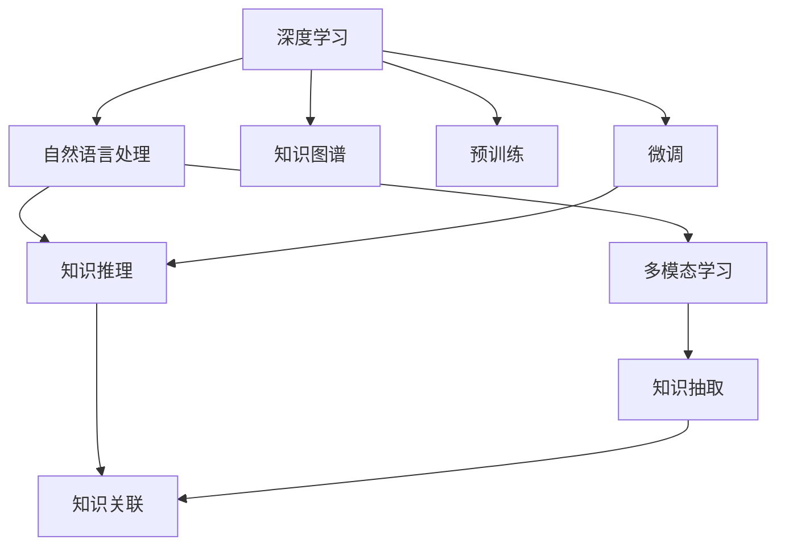

                 

## 1. 背景介绍

随着信息爆炸时代的到来，知识获取、处理和发现变得前所未有的复杂和多样。传统的数据库查询、文献搜索等方式已经无法满足日益增长的信息需求。人工智能技术的崛起，为知识发现提供了新的解决方案，特别是基于深度学习和自然语言处理技术的智能知识发现系统，正在成为新的研究热点。

知识发现(Knowledge Discovery, KD)是指从数据中挖掘出有价值的信息和知识，这些知识不仅包括结构化数据，还涵盖了非结构化文本、图像、音频等形式的数据。AI技术，尤其是深度学习和自然语言处理技术，为知识发现提供了强大的工具和手段，使得从海量数据中提取出有用的知识变得更加高效和智能化。

### 1.1 问题由来

知识发现是人工智能领域的一个重要分支，其目标是自动从数据中挖掘出有用的知识和信息。传统的知识发现方法主要依赖于统计分析和数据库技术，但在处理非结构化数据和语义复杂的数据时显得力不从心。近年来，随着深度学习技术的快速发展，基于神经网络的智能知识发现系统逐步成为主流。

深度学习模型，特别是基于Transformer架构的语言模型，凭借其强大的语言理解能力，在自然语言处理(NLP)和知识发现领域取得了显著成果。通过预训练和微调技术，这些模型能够从文本数据中自动学习知识，并且能够对新的文本数据进行知识推理和发现，显示出强大的潜力。

### 1.2 问题核心关键点

知识发现的AI技术应用主要包括以下几个关键点：

1. **文本表示学习**：将文本数据转化为机器可以理解的向量表示，这是知识发现的基础。
2. **文本理解与知识推理**：利用预训练的语言模型对文本进行语义理解，并基于理解进行知识推理。
3. **知识抽取与关联**：从文本中抽取出实体、关系等信息，并将它们关联起来，构建知识图谱。
4. **知识验证与更新**：通过人工审核和验证机制，确保抽取的知识准确无误，并持续更新。

### 1.3 问题研究意义

AI技术在知识发现中的应用，能够显著提升知识获取的效率和准确性，为科学研究、商业决策、社会管理等提供重要的支持。特别是对于非结构化数据的处理，AI技术能够从中提取隐含的知识，填补传统方法的不足。

1. **科学研究**：AI能够从海量的文献和实验数据中提取科学知识，加速科学发现的进程。
2. **商业决策**：基于市场数据和用户行为数据，AI能够发现商业趋势和用户需求，提供决策支持。
3. **社会管理**：AI能够从社会媒体和公共数据中提取社会现象和趋势，为政策制定和危机管理提供参考。
4. **教育培训**：AI能够根据学生的学习行为和成绩，提供个性化的学习建议和知识推荐。

## 2. 核心概念与联系

### 2.1 核心概念概述

在探讨如何利用AI技术优化知识发现之前，首先需要了解几个核心概念：

- **深度学习**：一种基于神经网络的机器学习技术，通过多层非线性映射实现对复杂数据的高效处理和建模。
- **自然语言处理**：人工智能领域的一个分支，专注于如何让计算机理解和生成人类语言。
- **知识图谱**：一种结构化的知识表示方式，用于描述实体和它们之间的关系，常用于知识发现和推理。
- **预训练和微调**：预训练指在大量无标注数据上进行模型训练，微调指在有标注数据上进一步优化模型性能。
- **多模态学习**：一种融合多种数据类型的学习方式，如文本、图像、音频等，以提高知识发现的能力。

这些概念之间相互关联，共同构成了智能知识发现系统的技术框架。以下是一个Mermaid流程图，展示了这些概念之间的联系：



### 2.2 核心概念原理和架构

**深度学习原理**：深度学习通过多层非线性映射，自动学习数据的特征表示。其核心在于神经网络结构的设计和优化，使得模型能够有效地处理和分析复杂数据。

**自然语言处理**：NLP通过文本预处理、语言模型、序列标注、文本分类、机器翻译等任务，实现对人类语言的理解和生成。其基础是词汇嵌入和语言模型，核心是Transformer架构的预训练模型，如BERT、GPT等。

**知识图谱**：知识图谱由实体、关系和属性构成，用于描述现实世界的知识和信息。其构建通常依赖于实体抽取、关系抽取、知识推理等技术，通过三元组或图结构表示知识。

**预训练和微调**：预训练指在大量无标注数据上训练模型，学习语言的通用表示。微调指在有标注数据上进一步优化模型，使其能够适应特定的知识发现任务。预训练和微调相结合，使得模型具备泛化能力，适用于多种数据和任务。

**多模态学习**：多模态学习融合文本、图像、音频等多种数据类型，以增强知识发现的鲁棒性和丰富性。其关键在于多模态特征的融合和模型结构的设计，以便更全面地理解数据和任务。

## 3. 核心算法原理 & 具体操作步骤

### 3.1 算法原理概述

基于深度学习和自然语言处理的知识发现系统，主要利用预训练语言模型对文本数据进行处理，并结合知识图谱和多模态学习技术，实现从文本中自动抽取和推理知识。其核心流程包括文本表示学习、知识抽取、知识推理和知识关联。

### 3.2 算法步骤详解

**步骤1：文本表示学习**

文本表示学习是知识发现的基础。通过预训练语言模型，将文本数据转化为向量表示，以便于计算机处理。常用的预训练模型包括BERT、GPT、XLNet等，这些模型通过在大量无标注数据上进行训练，学习到丰富的语言表示。

预训练语言模型通常使用掩码语言模型、下一句预测等自监督任务进行训练，学习到通用的语言表示。在微调阶段，将模型作为初始化参数，在有标注数据上进一步优化，以适应特定的知识发现任务。

**步骤2：知识抽取**

知识抽取是从文本中识别出实体、关系等信息，并将其抽取出来。常用的技术包括命名实体识别、关系抽取、事件抽取等。这些技术通常依赖于预训练的语言模型和下游任务的微调模型，通过学习文本的语义表示，自动抽取知识。

知识抽取的模型结构包括序列标注模型、匹配模型等，通过在标注数据上训练，学习到实体和关系的识别规则。常见的模型包括CRF、BiLSTM-CRF、BERT等，这些模型能够高效地从文本中抽取出知识。

**步骤3：知识推理**

知识推理是将抽取的知识进行关联和推理，构建知识图谱。常用的技术包括规则推理、逻辑推理、图神经网络等。

知识推理的模型结构包括图神经网络、推理机等，通过学习知识图谱的结构和属性，自动进行推理。常见的模型包括GCN、GNN、注意力机制等，这些模型能够高效地处理复杂的关系推理任务。

**步骤4：知识关联**

知识关联是将抽取的知识和推理结果进行整合，构建知识图谱。常用的技术包括知识图谱构建、知识图谱融合等。

知识关联的模型结构包括图数据库、图神经网络等，通过学习知识图谱的结构和属性，自动进行知识融合。常见的模型包括Neo4j、GATE等，这些模型能够高效地构建和管理知识图谱。

### 3.3 算法优缺点

基于深度学习和自然语言处理的知识发现系统具有以下优点：

1. **高效性**：深度学习模型能够自动从大量数据中学习知识表示，高效地处理文本数据。
2. **准确性**：预训练语言模型能够学习到丰富的语言知识，显著提升知识抽取和推理的准确性。
3. **灵活性**：知识发现系统能够处理多种数据类型，融合多模态数据，提升鲁棒性和丰富性。
4. **可扩展性**：知识图谱技术能够高效地构建和管理知识，支持大规模知识发现。

同时，这些系统也存在一些缺点：

1. **依赖标注数据**：知识抽取和推理依赖于标注数据，数据标注的成本较高。
2. **泛化能力有限**：模型的泛化能力受限于训练数据的分布，难以适应新领域和新任务。
3. **解释性不足**：知识发现系统的决策过程较为复杂，缺乏可解释性，难以进行调试和优化。
4. **计算资源需求高**：深度学习模型和知识图谱构建需要大量的计算资源，可能面临硬件瓶颈。

### 3.4 算法应用领域

知识发现系统已经在多个领域得到了应用，涵盖科学研究、商业决策、社会管理等诸多方面：

1. **科学研究**：知识发现系统能够从海量的文献和实验数据中提取科学知识，加速科学发现的进程。例如，在生物信息学领域，知识发现系统能够从基因序列中自动抽取基因功能、蛋白质结构等信息。

2. **商业决策**：基于市场数据和用户行为数据，知识发现系统能够发现商业趋势和用户需求，提供决策支持。例如，在金融领域，知识发现系统能够从交易数据中提取投资趋势和风险预警信息。

3. **社会管理**：知识发现系统能够从社会媒体和公共数据中提取社会现象和趋势，为政策制定和危机管理提供参考。例如，在公共安全领域，知识发现系统能够从社交媒体中提取犯罪预警和舆情分析信息。

4. **教育培训**：基于学生的学习行为和成绩，知识发现系统能够提供个性化的学习建议和知识推荐。例如，在在线教育领域，知识发现系统能够从学生互动和成绩中提取学习建议和知识推荐信息。

## 4. 数学模型和公式 & 详细讲解 & 举例说明

### 4.1 数学模型构建

知识发现系统通常使用深度学习模型和知识图谱模型进行构建。以下以BERT模型为例，介绍文本表示学习的数学模型构建和优化过程。

**BERT模型的数学模型**：

BERT模型的预训练过程包括掩码语言模型和下一句预测两个任务。掩码语言模型的数学模型如下：

$$
\mathcal{L}_{MLM} = -\frac{1}{N}\sum_{i=1}^N\sum_{j=1}^n (y_j * \log \hat{y_j} + (1-y_j) * \log(1-\hat{y_j}))
$$

其中，$N$ 是样本数量，$n$ 是序列长度，$y_j$ 是序列中第 $j$ 个单词的真实标签，$\hat{y_j}$ 是BERT模型预测的概率分布。

**Transformer模型结构**：

Transformer模型由多个编码器和解码器构成，每个层包括多头自注意力机制和前馈神经网络。其数学模型如下：

$$
Q = KV^T * W^Q
$$

$$
A = \frac{Q * Q^T}{\sqrt{d_k}}
$$

$$
O = V * A
$$

其中，$Q$、$K$、$V$ 分别是编码器中的查询、键和值向量，$W^Q$、$W^K$、$W^V$ 是线性变换矩阵，$d_k$ 是关键向量的维度。

### 4.2 公式推导过程

BERT模型的掩码语言模型和Transformer模型的推导过程较为复杂，涉及矩阵乘法、softmax函数等数学基础。以下仅简要介绍关键部分的推导过程：

**BERT模型的掩码语言模型推导**：

掩码语言模型通过在输入序列中随机掩码一定比例的单词，训练模型预测被掩码单词的真实标签。假设输入序列为 $x_1,x_2,\ldots,x_n$，其中 $x_j$ 是第 $j$ 个单词，$y_j$ 是 $x_j$ 的真实标签。

通过softmax函数，模型输出 $x_j$ 的预测概率分布 $\hat{y_j}$：

$$
\hat{y_j} = \frac{e^{X_j * W^O}}{\sum_{i=1}^n e^{X_i * W^O}}
$$

其中，$X_j$ 是 $x_j$ 的嵌入表示，$W^O$ 是输出层的权重矩阵。

模型损失函数 $\mathcal{L}_{MLM}$ 通过交叉熵损失计算：

$$
\mathcal{L}_{MLM} = -\frac{1}{N}\sum_{i=1}^N\sum_{j=1}^n (y_j * \log \hat{y_j} + (1-y_j) * \log(1-\hat{y_j}))
$$

**Transformer模型的推导**：

Transformer模型通过多头自注意力机制和前馈神经网络，实现对输入序列的编码和解码。其核心在于多头自注意力机制，通过计算查询向量、键向量和值向量的相似度，实现对序列中不同单词的关注。

假设输入序列为 $x_1,x_2,\ldots,x_n$，输出序列为 $y_1,y_2,\ldots,y_n$，其中 $x_j$ 和 $y_j$ 分别表示第 $j$ 个单词的输入和输出嵌入表示。

通过多头自注意力机制，计算查询向量 $Q$、键向量 $K$ 和值向量 $V$：

$$
Q = KV^T * W^Q
$$

$$
A = \frac{Q * Q^T}{\sqrt{d_k}}
$$

$$
O = V * A
$$

其中，$W^Q$、$W^K$、$W^V$ 是线性变换矩阵，$d_k$ 是关键向量的维度。

前馈神经网络进一步处理输出向量 $O$，得到最终输出：

$$
O = o(W^F * O + b^F)
$$

其中，$W^F$ 和 $b^F$ 是前馈神经网络的权重矩阵和偏置向量。

### 4.3 案例分析与讲解

**BERT模型的知识抽取案例**：

以医学领域的知识抽取为例，知识发现系统可以从医学文献中自动抽取实体和关系，构建医学知识图谱。假设输入文本为：

```
The patient had a fever of 39°C and a headache. The doctor diagnosed the patient with a viral infection.
```

系统通过BERT模型对文本进行表示学习，输出嵌入向量。然后，使用序列标注模型对文本进行命名实体识别，识别出实体和它们的类型。例如，模型输出：

```
[CLS] fever  [CLS] headache  [CLS] viral infection  [SEP]
```

其中，[CLS] 表示文本的起始标记，[SEP] 表示文本的结束标记。通过标注数据训练的序列标注模型，可以识别出实体类型，例如：

- 39°C：温度值
- headache：症状
- viral infection：疾病

知识抽取过程可以进一步结合关系抽取模型，从文本中抽取实体之间的关系。例如，通过关系抽取模型，可以识别出：

```
disease：[CLS] viral infection  cause：fever  cause：headache
```

其中，disease 表示疾病，cause 表示导致，39°C 和 headache 都是病毒感染的原因。

## 5. 项目实践：代码实例和详细解释说明

### 5.1 开发环境搭建

在进行知识发现系统的开发时，需要搭建相应的开发环境。以下是以BERT模型为例，搭建知识发现系统的开发环境的步骤：

1. 安装Anaconda：从官网下载并安装Anaconda，用于创建独立的Python环境。

2. 创建并激活虚拟环境：
```bash
conda create -n pytorch-env python=3.8 
conda activate pytorch-env
```

3. 安装PyTorch：根据CUDA版本，从官网获取对应的安装命令。例如：
```bash
conda install pytorch torchvision torchaudio cudatoolkit=11.1 -c pytorch -c conda-forge
```

4. 安装HuggingFace Transformers库：
```bash
pip install transformers
```

5. 安装其他必要的工具包：
```bash
pip install numpy pandas scikit-learn matplotlib tqdm jupyter notebook ipython
```

完成上述步骤后，即可在`pytorch-env`环境中开始知识发现系统的开发。

### 5.2 源代码详细实现

以下是使用PyTorch和Transformers库对BERT模型进行知识抽取的代码实现：

```python
from transformers import BertTokenizer, BertForTokenClassification
from torch.utils.data import Dataset, DataLoader
import torch

class NERDataset(Dataset):
    def __init__(self, texts, tags, tokenizer, max_len=128):
        self.texts = texts
        self.tags = tags
        self.tokenizer = tokenizer
        self.max_len = max_len
        
    def __len__(self):
        return len(self.texts)
    
    def __getitem__(self, item):
        text = self.texts[item]
        tags = self.tags[item]
        
        encoding = self.tokenizer(text, return_tensors='pt', max_length=self.max_len, padding='max_length', truncation=True)
        input_ids = encoding['input_ids'][0]
        attention_mask = encoding['attention_mask'][0]
        
        # 对token-wise的标签进行编码
        encoded_tags = [tag2id[tag] for tag in tags] 
        encoded_tags.extend([tag2id['O']] * (self.max_len - len(encoded_tags)))
        labels = torch.tensor(encoded_tags, dtype=torch.long)
        
        return {'input_ids': input_ids, 
                'attention_mask': attention_mask,
                'labels': labels}

# 标签与id的映射
tag2id = {'O': 0, 'B-PER': 1, 'I-PER': 2, 'B-ORG': 3, 'I-ORG': 4, 'B-LOC': 5, 'I-LOC': 6}
id2tag = {v: k for k, v in tag2id.items()}

# 创建dataset
tokenizer = BertTokenizer.from_pretrained('bert-base-cased')

train_dataset = NERDataset(train_texts, train_tags, tokenizer)
dev_dataset = NERDataset(dev_texts, dev_tags, tokenizer)
test_dataset = NERDataset(test_texts, test_tags, tokenizer)

# 定义模型和优化器
model = BertForTokenClassification.from_pretrained('bert-base-cased', num_labels=len(tag2id))

optimizer = AdamW(model.parameters(), lr=2e-5)

# 定义训练和评估函数
device = torch.device('cuda') if torch.cuda.is_available() else torch.device('cpu')
model.to(device)

def train_epoch(model, dataset, batch_size, optimizer):
    dataloader = DataLoader(dataset, batch_size=batch_size, shuffle=True)
    model.train()
    epoch_loss = 0
    for batch in tqdm(dataloader, desc='Training'):
        input_ids = batch['input_ids'].to(device)
        attention_mask = batch['attention_mask'].to(device)
        labels = batch['labels'].to(device)
        model.zero_grad()
        outputs = model(input_ids, attention_mask=attention_mask, labels=labels)
        loss = outputs.loss
        epoch_loss += loss.item()
        loss.backward()
        optimizer.step()
    return epoch_loss / len(dataloader)

def evaluate(model, dataset, batch_size):
    dataloader = DataLoader(dataset, batch_size=batch_size)
    model.eval()
    preds, labels = [], []
    with torch.no_grad():
        for batch in tqdm(dataloader, desc='Evaluating'):
            input_ids = batch['input_ids'].to(device)
            attention_mask = batch['attention_mask'].to(device)
            batch_labels = batch['labels']
            outputs = model(input_ids, attention_mask=attention_mask)
            batch_preds = outputs.logits.argmax(dim=2).to('cpu').tolist()
            batch_labels = batch_labels.to('cpu').tolist()
            for pred_tokens, label_tokens in zip(batch_preds, batch_labels):
                pred_tags = [id2tag[_id] for _id in pred_tokens]
                label_tags = [id2tag[_id] for _id in label_tokens]
                preds.append(pred_tags[:len(label_tokens)])
                labels.append(label_tags)
                
    print(classification_report(labels, preds))
```

### 5.3 代码解读与分析

**NERDataset类**：
- `__init__`方法：初始化文本、标签、分词器等关键组件。
- `__len__`方法：返回数据集的样本数量。
- `__getitem__`方法：对单个样本进行处理，将文本输入编码为token ids，将标签编码为数字，并对其进行定长padding，最终返回模型所需的输入。

**tag2id和id2tag字典**：
- 定义了标签与数字id之间的映射关系，用于将token-wise的预测结果解码回真实的标签。

**训练和评估函数**：
- 使用PyTorch的DataLoader对数据集进行批次化加载，供模型训练和推理使用。
- 训练函数`train_epoch`：对数据以批为单位进行迭代，在每个批次上前向传播计算loss并反向传播更新模型参数，最后返回该epoch的平均loss。
- 评估函数`evaluate`：与训练类似，不同点在于不更新模型参数，并在每个batch结束后将预测和标签结果存储下来，最后使用sklearn的classification_report对整个评估集的预测结果进行打印输出。

**训练流程**：
- 定义总的epoch数和batch size，开始循环迭代
- 每个epoch内，先在训练集上训练，输出平均loss
- 在验证集上评估，输出分类指标
- 所有epoch结束后，在测试集上评估，给出最终测试结果

## 6. 实际应用场景

### 6.1 智能医疗

在医疗领域，知识发现系统可以自动从海量的医学文献和病历数据中提取医学知识，为医生提供辅助诊断和治疗建议。例如，在诊断疾病时，系统可以从病历中自动抽取症状、体征、治疗方案等信息，结合领域专家的知识图谱，提供精准的诊断建议。

在药物研发方面，知识发现系统可以从海量的生物数据中抽取药物和基因之间的关系，预测药物的疗效和副作用。例如，在药物分子设计中，系统可以自动发现潜在的药物候选，并进行药效筛选和优化。

### 6.2 金融分析

在金融领域，知识发现系统可以自动从市场数据和新闻报道中提取投资趋势和风险预警信息，为投资者提供决策支持。例如，在股市分析中，系统可以从市场数据中抽取价格波动、成交量、新闻事件等信息，进行股票价格预测和风险评估。

在金融欺诈检测方面，知识发现系统可以从交易数据中自动抽取异常交易行为，识别潜在的欺诈行为。例如，在银行系统中，系统可以实时监测交易数据，发现异常交易并进行预警。

### 6.3 电子商务

在电子商务领域，知识发现系统可以自动从用户行为数据和产品评价中提取用户需求和产品信息，为商家提供推荐和营销策略。例如，在推荐系统中，系统可以自动从用户浏览和购买行为中抽取用户兴趣，推荐相关商品。

在情感分析方面，知识发现系统可以从用户评论和反馈中抽取情感倾向，分析用户对产品或服务的满意度。例如，在电商平台上，系统可以自动从用户评论中提取情感信息，进行情感分析和舆情监控。

## 7. 工具和资源推荐

### 7.1 学习资源推荐

为了帮助开发者系统掌握知识发现技术，这里推荐一些优质的学习资源：

1. 《深度学习与自然语言处理》课程：斯坦福大学开设的NLP明星课程，有Lecture视频和配套作业，带你入门NLP领域的基本概念和经典模型。

2. 《自然语言处理综论》书籍：介绍NLP的基本概念和前沿技术，涵盖文本表示学习、知识抽取、知识推理等主题。

3. 《Knowledge Discovery in Databases》书籍：介绍知识发现的基本概念和技术，涵盖数据预处理、模式识别、关系抽取等主题。

4. 《Transformers》书籍：Transformers库的作者所著，全面介绍了如何使用Transformers库进行NLP任务开发，包括预训练和微调在内的诸多范式。

5. Kaggle竞赛平台：提供大量NLP领域的竞赛和数据集，是实践知识发现技术的绝佳平台。

通过对这些资源的学习实践，相信你一定能够快速掌握知识发现技术的精髓，并用于解决实际的NLP问题。

### 7.2 开发工具推荐

高效的开发离不开优秀的工具支持。以下是几款用于知识发现系统开发的常用工具：

1. PyTorch：基于Python的开源深度学习框架，灵活动态的计算图，适合快速迭代研究。大部分预训练语言模型都有PyTorch版本的实现。

2. TensorFlow：由Google主导开发的开源深度学习框架，生产部署方便，适合大规模工程应用。同样有丰富的预训练语言模型资源。

3. HuggingFace Transformers库：提供预训练语言模型和微调模型，支持PyTorch和TensorFlow，是进行知识发现任务开发的利器。

4. Weights & Biases：模型训练的实验跟踪工具，可以记录和可视化模型训练过程中的各项指标，方便对比和调优。与主流深度学习框架无缝集成。

5. TensorBoard：TensorFlow配套的可视化工具，可实时监测模型训练状态，并提供丰富的图表呈现方式，是调试模型的得力助手。

6. Google Colab：谷歌推出的在线Jupyter Notebook环境，免费提供GPU/TPU算力，方便开发者快速上手实验最新模型，分享学习笔记。

合理利用这些工具，可以显著提升知识发现任务的开发效率，加快创新迭代的步伐。

### 7.3 相关论文推荐

知识发现技术的发展源于学界的持续研究。以下是几篇奠基性的相关论文，推荐阅读：

1. Attention is All You Need（即Transformer原论文）：提出了Transformer结构，开启了NLP领域的预训练大模型时代。

2. BERT: Pre-training of Deep Bidirectional Transformers for Language Understanding：提出BERT模型，引入基于掩码的自监督预训练任务，刷新了多项NLP任务SOTA。

3. Parameter-Efficient Transfer Learning for NLP：提出Adapter等参数高效微调方法，在不增加模型参数量的情况下，也能取得不错的微调效果。

4. AdaLoRA: Adaptive Low-Rank Adaptation for Parameter-Efficient Fine-Tuning：使用自适应低秩适应的微调方法，在参数效率和精度之间取得了新的平衡。

5. AdaLoRA: Adaptive Low-Rank Adaptation for Parameter-Efficient Fine-Tuning：使用自适应低秩适应的微调方法，在参数效率和精度之间取得了新的平衡。

这些论文代表了大语言模型微调技术的发展脉络。通过学习这些前沿成果，可以帮助研究者把握学科前进方向，激发更多的创新灵感。

## 8. 总结：未来发展趋势与挑战

### 8.1 研究成果总结

本文对知识发现系统的核心技术和应用进行了全面系统的介绍。首先阐述了知识发现的重要性，探讨了深度学习和自然语言处理技术在知识发现中的应用。其次，从原理到实践，详细讲解了知识发现系统的数学模型和操作步骤，给出了知识抽取的代码实例。同时，本文还广泛探讨了知识发现系统在智能医疗、金融分析、电子商务等多个领域的应用前景，展示了知识发现技术的广泛潜力。此外，本文精选了知识发现技术的各类学习资源，力求为读者提供全方位的技术指引。

通过本文的系统梳理，可以看到，基于深度学习和自然语言处理的知识发现技术正在成为NLP领域的重要范式，极大地拓展了预训练语言模型的应用边界，催生了更多的落地场景。受益于大规模语料的预训练，知识发现系统以更低的时间和标注成本，在小样本条件下也能取得不俗的效果，有力推动了NLP技术的产业化进程。未来，伴随深度学习技术的持续演进，知识发现技术必将进一步发展，为自然语言理解和智能交互系统带来更多的可能性。

### 8.2 未来发展趋势

展望未来，知识发现技术将呈现以下几个发展趋势：

1. **模型规模持续增大**：随着算力成本的下降和数据规模的扩张，预训练语言模型的参数量还将持续增长。超大规模语言模型蕴含的丰富语言知识，有望支撑更加复杂多变的知识发现任务。

2. **知识抽取和推理能力的提升**：未来的知识发现系统将具备更强大的知识抽取和推理能力，能够从非结构化数据中提取更深层次的语义信息。

3. **多模态知识发现技术的发展**：知识发现系统将融合文本、图像、音频等多种数据类型，提升知识发现的鲁棒性和丰富性。

4. **知识图谱的深化和扩展**：未来的知识图谱技术将更加丰富和精细，能够支持更加复杂的关系推理和多维度的知识抽取。

5. **可解释性和可控性**：未来的知识发现系统将更加注重输出结果的可解释性和可控性，通过引入符号化知识、规则和因果推理，提高系统的可信度和可靠性。

6. **自动化和智能化**：未来的知识发现系统将更加自动化和智能化，通过自动学习和优化，减少人工干预，提高知识发现的效率和效果。

以上趋势凸显了知识发现技术的广阔前景。这些方向的探索发展，必将进一步提升知识发现系统的性能和应用范围，为人工智能技术带来新的突破。

### 8.3 面临的挑战

尽管知识发现技术已经取得了显著成就，但在迈向更加智能化、普适化应用的过程中，它仍面临着诸多挑战：

1. **依赖标注数据**：知识抽取和推理依赖于标注数据，数据标注的成本较高。如何进一步降低知识发现对标注样本的依赖，将是一大难题。

2. **泛化能力有限**：模型的泛化能力受限于训练数据的分布，难以适应新领域和新任务。如何在保持泛化能力的同时，提升知识发现的效果，还需要更多的研究和实践。

3. **推理能力不足**：现有的知识发现系统往往局限于知识图谱中的静态信息，难以处理动态和复杂的关系。如何提升系统的推理能力，扩展知识发现的应用场景，还需要进一步研究。

4. **计算资源需求高**：深度学习模型和知识图谱构建需要大量的计算资源，可能面临硬件瓶颈。如何优化模型结构和算法，提高知识发现的效率，还需要更多的研究和实践。

5. **可解释性不足**：知识发现系统的决策过程较为复杂，缺乏可解释性，难以进行调试和优化。如何赋予知识发现系统更强的可解释性，将是亟待攻克的难题。

6. **安全性有待保障**：预训练语言模型难免会学习到有偏见、有害的信息，通过知识发现系统传递到下游任务，产生误导性、歧视性的输出，给实际应用带来安全隐患。如何从数据和算法层面消除模型偏见，避免恶意用途，确保输出的安全性，也将是重要的研究课题。

这些挑战凸显了知识发现技术的复杂性和多维度性。解决这些问题需要从数据、模型、算法、应用等多个层面协同发力，共同推进知识发现技术的进步。

### 8.4 研究展望

面对知识发现所面临的种种挑战，未来的研究需要在以下几个方面寻求新的突破：

1. **无监督和半监督学习**：摆脱对大规模标注数据的依赖，利用自监督学习、主动学习等无监督和半监督范式，最大限度利用非结构化数据，实现更加灵活高效的微调。

2. **知识图谱的融合与扩展**：将知识图谱技术与深度学习模型进行结合，构建更加丰富和精细的知识图谱，提升知识发现的效果和准确性。

3. **多模态知识发现**：融合文本、图像、音频等多种数据类型，提升知识发现系统的鲁棒性和丰富性。

4. **因果推理与逻辑推理**：引入因果推理和逻辑推理技术，提升知识发现系统的决策能力和可解释性。

5. **知识抽取与推理的自动化**：通过自动学习和优化，减少人工干预，提高知识抽取和推理的效率和效果。

6. **伦理与安全性**：引入伦理和安全性约束，确保知识发现系统输出的可信度和安全性。

这些研究方向将引领知识发现技术迈向更高的台阶，为构建智能知识发现系统提供新的方向和动力。面向未来，知识发现技术需要与其他人工智能技术进行更深入的融合，如知识表示、因果推理、强化学习等，多路径协同发力，共同推动自然语言理解和智能交互系统的进步。只有勇于创新、敢于突破，才能不断拓展知识发现系统的边界，让智能技术更好地造福人类社会。

## 9. 附录：常见问题与解答

**Q1：什么是知识发现？**

A: 知识发现是指从数据中挖掘出有价值的信息和知识。其目标是自动地发现数据中的模式、规律和趋势，以支持决策、优化和创新。

**Q2：深度学习在知识发现中扮演什么角色？**

A: 深度学习在知识发现中扮演着重要的角色，主要体现在以下几个方面：

1. **文本表示学习**：通过预训练语言模型，将文本数据转化为向量表示，以便于计算机处理。

2. **知识抽取**：通过序列标注模型和匹配模型，自动从文本中抽取实体和关系。

3. **知识推理**：通过图神经网络和推理机，自动进行关系推理和知识整合。

4. **多模态学习**：通过融合文本、图像、音频等多种数据类型，提升知识发现的能力。

**Q3：知识发现系统面临哪些挑战？**

A: 知识发现系统面临以下挑战：

1. **依赖标注数据**：知识抽取和推理依赖于标注数据，数据标注的成本较高。

2. **泛化能力有限**：模型的泛化能力受限于训练数据的分布，难以适应新领域和新任务。

3. **推理能力不足**：现有的知识发现系统往往局限于知识图谱中的静态信息，难以处理动态和复杂的关系。

4. **计算资源需求高**：深度学习模型和知识图谱构建需要大量的计算资源，可能面临硬件瓶颈。

5. **可解释性不足**：知识发现系统的决策过程较为复杂，缺乏可解释性，难以进行调试和优化。

6. **安全性有待保障**：预训练语言模型难免会学习到有偏见、有害的信息，通过知识发现系统传递到下游任务，产生误导性、歧视性的输出，给实际应用带来安全隐患。

**Q4：未来知识发现技术的趋势是什么？**

A: 未来知识发现技术的趋势包括：

1. **模型规模持续增大**：随着算力成本的下降和数据规模的扩张，预训练语言模型的参数量还将持续增长。

2. **知识抽取和推理能力的提升**：未来的知识发现系统将具备更强大的知识抽取和推理能力，能够从非结构化数据中提取更深层次的语义信息。

3. **多模态知识发现技术的发展**：知识发现系统将融合文本、图像、音频等多种数据类型，提升知识发现的鲁棒性和丰富性。

4. **知识图谱的深化和扩展**：未来的知识图谱技术将更加丰富和精细，能够支持更加复杂的关系推理和多维度的知识抽取。

5. **可解释性和可控性**：未来的知识发现系统将更加注重输出结果的可解释性和可控性，通过引入符号化知识、规则和因果推理，提高系统的可信度和可靠性。

6. **自动化和智能化**：未来的知识发现系统将更加自动化和智能化，通过自动学习和优化，减少人工干预，提高知识发现的效率和效果。

这些趋势凸显了知识发现技术的广阔前景。这些方向的探索发展，必将进一步提升知识发现系统的性能和应用范围，为人工智能技术带来新的突破。

---

作者：禅与计算机程序设计艺术 / Zen and the Art of Computer Programming

