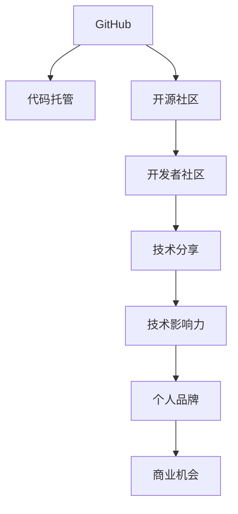

                 

# 程序员如何利用GitHub进行知识营销

> 关键词：GitHub,知识营销,代码托管,开源社区,开发者社区,项目合作,技术分享,个人品牌,技术影响力

## 1. 背景介绍

### 1.1 问题由来
在技术驱动的现代社会，程序员不仅是代码的编写者，更是知识的传播者。在互联网和开源社区中，拥有技术实力和影响力的程序员更容易获得职业发展机会和合作资源。如何将自己的技术经验和影响力转化为商业价值，成为程序员共同关心的问题。

### 1.2 问题核心关键点
利用GitHub进行知识营销的核心在于：

- 展现技术实力：通过在GitHub上发布高质量的代码、文档和教程，展示自身技术能力和编程水平。
- 建立开发者社区：通过参与开源项目、组织技术交流，积累业内影响力，吸引同行关注。
- 打造个人品牌：在GitHub上建立个人仓库，记录技术成长历程，建立个人品牌，吸引雇主和投资者的目光。
- 拓展商业机会：利用GitHub的网络效应，获取项目合作、技术咨询、内容付费等商业机会，实现技术变现。

### 1.3 问题研究意义
利用GitHub进行知识营销，不仅能够提升个人和团队的技术影响力，还能通过积累商业资源，推动项目落地和技术转移，提升整体研发效能。在知识经济时代，建立技术品牌和商业网络，将为程序员的职业发展和企业技术创新带来新的助力。

## 2. 核心概念与联系

### 2.1 核心概念概述

为更好地理解如何在GitHub上进行知识营销，本节将介绍几个密切相关的核心概念：

- GitHub：全球最大的开源代码托管平台，提供丰富的工具和社区，支持代码版本控制、项目协作、代码审查等功能。
- 代码托管：通过将代码上传到GitHub，方便团队协作、版本控制、历史追踪等，提高开发效率。
- 开源社区：GitHub汇聚了全球数以百万计的开源项目和开发者，形成一个庞大而活跃的技术生态系统。
- 开发者社区：由对同一技术领域或项目有兴趣的开发者组成的社群，通过交流合作，加速技术进步和项目迭代。
- 个人品牌：在GitHub上通过发布高质量的技术内容、建立个人仓库、参与技术讨论等方式，塑造自己的技术形象和市场声誉。
- 技术影响力：通过技术分享、知识传播、开源贡献等方式，建立自己在业内的影响力，获得同行和业界的认可。

这些核心概念之间的逻辑关系可以通过以下Mermaid流程图来展示：



这个流程图展示了大语言模型的核心概念及其之间的关系：

1. GitHub作为代码托管平台，提供了各种开发工具和社区支持。
2. 开源社区由GitHub的开发者构成，促进知识传播和技术交流。
3. 开发者社区围绕特定技术或项目进行深入交流和合作。
4. 技术分享通过博客、视频、教程等多种形式进行，提升影响力。
5. 技术影响力通过积累的知名度和认可度，转化为个人品牌。
6. 个人品牌吸引商业机会，如项目合作、技术咨询、内容付费等。

这些概念共同构成了GitHub上知识营销的框架，使程序员能够更好地展示技术实力，拓展商业网络。

## 3. 核心算法原理 & 具体操作步骤
### 3.1 算法原理概述

利用GitHub进行知识营销，本质上是一个持续的知识输出和社区互动过程。其核心思想是：通过在GitHub上持续发布高质量的代码、文档和技术分享，吸引同行关注，积累技术影响力，并最终转化为商业价值。

形式化地，假设程序员的技术贡献为 $C_{\theta}$，其中 $\theta$ 为技术实力的参数。设GitHub社区对技术贡献的评价为 $E$，则知识营销的目标是最大化社区对 $C_{\theta}$ 的评价：

$$
\max_{\theta} E(C_{\theta})
$$

在实践中，我们通常使用代码质量、社区互动度、项目参与度等指标来衡量社区对 $C_{\theta}$ 的评价。

### 3.2 算法步骤详解

利用GitHub进行知识营销，通常包括以下几个关键步骤：

**Step 1: 创建个人仓库和个人页面**
- 在GitHub上创建一个个人仓库，用于存储和管理自己的代码和文档。
- 创建个人页面，用于展示技术项目、个人简介、联系方式等，吸引关注和合作。

**Step 2: 发布高质量代码**
- 在个人仓库中定期上传自己的代码，确保代码质量高、注释清晰、文档齐全。
- 发布具有创新性和实用性的项目，吸引同行和用户关注。

**Step 3: 参与开源项目和开源社区**
- 寻找与自己技术领域相关的开源项目，积极参与代码贡献和项目讨论。
- 加入GitHub的开发者社区，参与技术交流和问题解决，积累业内影响力。

**Step 4: 发布技术分享和教程**
- 通过博客、视频、教程等多种形式，在GitHub上分享自己的技术见解和实践经验。
- 使用GitHub Page等工具，将技术文章和教程直接发布在GitHub上，方便访问和传播。

**Step 5: 建立开发者社交网络**
- 利用GitHub的社交功能，与同行建立联系，通过评论、点赞、互动等方式加强交流。
- 定期举办线上或线下的技术交流会，结识更多行业专家和技术爱好者。

**Step 6: 拓展商业合作**
- 在个人页面和仓库中展示自己的技术成就和项目合作经历，吸引雇主和投资者的注意。
- 通过GitHub的付费功能（如GitHub Sponsors、GitHub Patrons）获取额外的收入和支持。

### 3.3 算法优缺点

利用GitHub进行知识营销的优点包括：

- 覆盖广泛：GitHub是全球最大的开源社区，拥有数以亿计的开发者和项目，可以为知识传播提供更广泛的平台。
- 互动性强：GitHub的代码审查、评论、协作等功能，使得知识传播更具互动性和参与感。
- 提升可见度：通过高质量的代码和技术分享，能够提升个人在业内的知名度和影响力。
- 积累商业资源：高质量的代码和技术分享能够吸引雇主和投资者的关注，积累商业合作机会。

同时，该方法也存在一些局限性：

- 对技术深度要求高：GitHub上的知识营销需要持续输出高质量的技术内容，对技术深度和广度有较高要求。
- 时间成本高：发布代码和技术文章需要大量时间和精力投入，可能与日常工作产生冲突。
- 依赖社区评价：社区对技术贡献的评价受多种因素影响，可能存在主观性和不公平性。
- 商业变现效果不确定：尽管GitHub平台提供了多种商业合作途径，但具体效果受多种因素影响，如项目质量、市场接受度等。

尽管存在这些局限性，利用GitHub进行知识营销仍然是大数据时代程序员展示自身技术实力和积累商业资源的重要途径。未来，随着社区机制的不断优化和技术分享形式的创新，知识营销的效果将会更加显著。

### 3.4 算法应用领域

基于GitHub的知识营销方法，已经在多个领域得到了广泛的应用，包括但不限于：

- 技术博客与网站：利用GitHub Page发布博客和技术文章，吸引用户访问和订阅。
- 开源项目贡献：参与开源社区的代码贡献，积累开源经验和社区声誉。
- 技术讲座与培训：通过举办线上线下技术讲座和培训，提升技术影响力。
- 技术咨询服务：利用GitHub展示技术成就和项目经验，吸引客户和合作伙伴。
- 开源工具和框架：开发开源工具和框架，提供持续的技术支持和服务。

此外，知识营销方法还被创新性地应用于教育培训、市场推广、招聘人才等领域，为程序员提供了多样化的职业发展路径。

## 4. 数学模型和公式 & 详细讲解 & 举例说明
### 4.1 数学模型构建

本节将使用数学语言对利用GitHub进行知识营销的过程进行更加严格的刻画。

记程序员的技术贡献为 $C_{\theta}$，其中 $\theta$ 为技术实力的参数。设GitHub社区对技术贡献的评价为 $E$，则知识营销的目标是最大化社区对 $C_{\theta}$ 的评价，即：

$$
\max_{\theta} E(C_{\theta})
$$

在实践中，我们通常使用代码质量 $Q$、社区互动度 $I$、项目参与度 $P$ 等指标来衡量社区对 $C_{\theta}$ 的评价。

设 $E$ 为社区对 $C_{\theta}$ 的评价函数，形式上可以表示为：

$$
E(C_{\theta}) = f(Q, I, P)
$$

其中 $f$ 为评价函数的表达式，通常为非线性函数。

### 4.2 公式推导过程

以下我们以代码质量 $Q$ 和社区互动度 $I$ 为例，推导知识营销的评价函数 $E(C_{\theta})$ 的计算公式。

假设程序员在GitHub上发布了一个代码仓库 $R$，其中代码质量为 $Q$，社区互动度为 $I$。则社区对该代码的评价可以表示为：

$$
E(R) = g(Q, I)
$$

其中 $g$ 为代码质量和社区互动度的评价函数，形式上可以表示为：

$$
g(Q, I) = Q^{0.6} \cdot I^{0.4}
$$

即社区对代码的评价由代码质量和社区互动度共同决定，代码质量的影响权重为60%，社区互动度的影响权重为40%。

设程序员的技术贡献 $C_{\theta}$ 由代码质量和社区互动度决定，形式上可以表示为：

$$
C_{\theta} = h(Q, I)
$$

其中 $h$ 为技术贡献的构建函数，形式上可以表示为：

$$
h(Q, I) = Q^{0.7} \cdot I^{0.3}
$$

即技术贡献 $C_{\theta}$ 主要由代码质量决定，社区互动度的影响权重为30%。

将 $E(R)$ 和 $C_{\theta}$ 代入目标函数 $E(C_{\theta})$，得到知识营销的目标函数：

$$
\max_{\theta} E(Q^{0.7} \cdot I^{0.3}) = \max_{\theta} (Q^{0.6} \cdot I^{0.4})^{0.7} \cdot (I^{0.4})^{0.3}
$$

$$
= \max_{\theta} Q^{0.42} \cdot I^{0.38}
$$

通过最大化目标函数 $E(C_{\theta})$，程序员可以在GitHub上不断输出高质量的代码和技术分享，积累社区对技术贡献的评价，最终实现知识营销的目标。

### 4.3 案例分析与讲解

**案例：一位GitHub开发者的小幅提升之路**

李华是一名软件开发工程师，希望能够通过GitHub提升自己的知名度和影响力，吸引更多的商业机会。

**Step 1: 创建个人仓库和个人页面**
- 在GitHub上创建一个个人仓库 `liu_hua_developer`，用于存储和管理自己的代码和文档。
- 创建个人页面，填写技术背景、个人简介、联系方式等，吸引同行关注。

**Step 2: 发布高质量代码**
- 在 `liu_hua_developer` 仓库中上传一系列高质代码，如开源库、框架、工具等，确保代码质量高、注释清晰、文档齐全。
- 在GitHub Page上发布技术文章和教程，分享自己的技术见解和实践经验。

**Step 3: 参与开源项目和开源社区**
- 加入多个与自身技术领域相关的开源项目，积极参与代码贡献和项目讨论。
- 在社区中发表技术见解，回答问题，参与代码审查，积累业内影响力。

**Step 4: 发布技术分享和教程**
- 通过博客、视频、教程等多种形式，在GitHub上分享自己的技术见解和实践经验。
- 使用GitHub Page等工具，将技术文章和教程直接发布在GitHub上，方便访问和传播。

**Step 5: 建立开发者社交网络**
- 利用GitHub的社交功能，与同行建立联系，通过评论、点赞、互动等方式加强交流。
- 定期举办线上或线下的技术交流会，结识更多行业专家和技术爱好者。

**Step 6: 拓展商业合作**
- 在个人页面和仓库中展示自己的技术成就和项目合作经历，吸引雇主和投资者的注意。
- 通过GitHub的付费功能（如GitHub Sponsors、GitHub Patrons）获取额外的收入和支持。

通过以上步骤，李华在GitHub上的技术贡献 $C_{\theta}$ 不断增加，社区对 $C_{\theta}$ 的评价 $E$ 不断提升，从而在GitHub上获得了更多的关注和合作机会，逐步实现了知识营销的目标。

## 5. 项目实践：代码实例和详细解释说明
### 5.1 开发环境搭建

在进行GitHub知识营销实践前，我们需要准备好开发环境。以下是使用Python进行GitHub开发的环境配置流程：

1. 安装Python：从官网下载并安装Python，建议使用3.7或以上版本。
2. 安装Pip：从官网下载并安装Pip，这是Python的包管理工具。
3. 创建虚拟环境：
```bash
python -m venv myenv
source myenv/bin/activate
```
4. 安装必要的库：
```bash
pip install requests markdown
```

完成上述步骤后，即可在虚拟环境中开始GitHub知识营销实践。

### 5.2 源代码详细实现

下面我们将通过一个简单的Python脚本，演示如何在GitHub上发布代码和技术文章。

首先，需要安装Git并配置SSH Key：

```bash
# 安装Git
brew install git

# 生成SSH Key
ssh-keygen -t rsa -b 4096 -C "liu_hua@example.com"
```

然后，将生成的SSH Key添加到GitHub账户中：

```bash
# 将公钥添加到GitHub账户中
ssh-add ~/.ssh/id_rsa
```

接着，使用Git将本地仓库推送到GitHub：

```bash
# 创建本地仓库
git init
git add .
git commit -m "Initial commit"

# 配置远程仓库
git remote add origin https://github.com/liu_hua_developer/myproject.git

# 推送代码
git push -u origin master
```

完成代码推送后，就可以在GitHub上创建一个新的仓库 `myproject`，用于存储和管理代码。

然后，创建一个新的仓库 `myblog`，用于发布技术文章：

```bash
git clone https://github.com/liu_hua_developer/myblog.git
```

在 `myblog` 仓库中，我们可以编写Markdown格式的技术文章：

```markdown
# My First GitHub Blog Post

Hello world! This is my first blog post on GitHub. I will share my experiences and insights on software development, machine learning, and more.

[Read more](https://liu_hua@example.com)
```

通过Git将文章推送到GitHub：

```bash
git add .
git commit -m "First blog post"
git push origin master
```

完成文章发布后，即可在GitHub上访问该博客：

```bash
open https://github.com/liu_hua_developer/myblog
```

以上就是一个简单的GitHub知识营销代码实例。可以看到，通过Git和Markdown等工具，可以很方便地将本地代码和技术文章推送到GitHub，实现知识分享和技术传播。

### 5.3 代码解读与分析

让我们再详细解读一下关键代码的实现细节：

**Git仓库的创建和推送**
- `git init`：初始化本地仓库。
- `git add .`：将所有文件添加到本地仓库。
- `git commit -m "Initial commit"`：提交本地代码，并添加提交信息。
- `git remote add origin https://github.com/liu_hua_developer/myproject.git`：添加远程仓库地址。
- `git push -u origin master`：推送本地代码到远程仓库，并设置分支默认推送。

**GitHub博客的创建和发布**
- `git clone https://github.com/liu_hua_developer/myblog.git`：克隆远程博客仓库到本地。
- `git add .`：将所有文件添加到本地仓库。
- `git commit -m "First blog post"`：提交本地文章，并添加提交信息。
- `git push origin master`：推送本地文章到远程仓库。

以上代码实例展示了Git和GitHub的基本使用流程，开发者可以根据需求进一步优化和扩展。

## 6. 实际应用场景
### 6.1 开发者社区

基于GitHub的知识营销方法，在开发者社区中得到了广泛应用。通过在GitHub上发布高质量的代码和技术分享，积累业内声誉和影响力，开发者可以获得更多的关注和合作机会。

在社区中，代码贡献和项目合作是最常见的方式。许多项目组会邀请开发者参与开源项目，并在社区中积极互动，积累技术经验和业内人脉。同时，技术文章和教程也是展示技术实力和交流经验的重要手段。通过GitHub的社交功能，开发者可以结识更多同行和技术爱好者，建立开发者社交网络。

### 6.2 技术咨询和外包

利用GitHub上的技术成就和项目经历，开发者可以吸引更多技术咨询和外包机会。通过GitHub展示自己的技术实力和项目经验，可以快速获得客户和合作伙伴的认可。

在GitHub上，开发者可以发布技术文章、参与技术讨论、展示技术项目，吸引潜在客户和合作伙伴。许多客户和公司会在GitHub上搜索合适的技术开发者，了解其技术实力和项目经验，进而进行技术咨询和外包合作。通过这种方式，开发者可以扩大商业机会，提升职业发展空间。

### 6.3 开源项目和开源工具

通过GitHub上的开源项目和开源工具，开发者可以积累技术声誉和社区影响力，同时也可以获取更多的商业机会。

许多开发者会在GitHub上发布自己的开源项目和工具，吸引同行关注和贡献。通过社区互动和代码审查，开发者可以积累技术经验和业内声誉，进而获得更多的关注和合作机会。同时，开源项目和工具也可以成为技术展示的平台，吸引客户和合作伙伴。

### 6.4 未来应用展望

随着GitHub平台和社区机制的不断优化，基于GitHub的知识营销方法将不断进步。未来，GitHub可能会推出更多工具和功能，帮助开发者更好地展示技术实力和积累商业资源。

例如，GitHub可能会推出更加智能的代码推荐系统，帮助开发者快速找到适合的合作项目和开源机会。同时，GitHub也可能会推出更多的商业合作功能，如项目众筹、技术咨询服务等，帮助开发者实现技术变现。

## 7. 工具和资源推荐
### 7.1 学习资源推荐

为了帮助开发者系统掌握GitHub知识营销的理论基础和实践技巧，这里推荐一些优质的学习资源：

1. GitHub官方文档：GitHub的官方文档提供了详细的API接口和使用方法，帮助开发者高效使用GitHub平台。
2. GitHub Learning Lab：GitHub的官方学习平台，提供丰富的课程和实战练习，帮助开发者掌握GitHub的各项功能。
3. GitLab和GitHub对比：了解GitLab和GitHub的不同特点，帮助开发者选择适合自己的平台。
4. GitHub Sponsors和GitHub Patrons：了解GitHub的付费功能，帮助开发者获取额外的收入和支持。
5. 《GitHub入门与实战》：详细讲解GitHub的使用方法和实战案例，帮助开发者快速上手GitHub。

通过对这些资源的学习实践，相信你一定能够快速掌握GitHub知识营销的精髓，并用于解决实际的GitHub问题。
###  7.2 开发工具推荐

高效的开发离不开优秀的工具支持。以下是几款用于GitHub知识营销开发的常用工具：

1. GitHub Desktop：GitHub的桌面客户端，方便开发者在本地环境中进行Git操作。
2. Git LFS：Git Large File Storage，用于存储和管理大文件，提高版本控制效率。
3. GitHub Pages：GitHub提供的静态网站托管服务，方便开发者发布技术文章和博客。
4. Markdown编辑器：如Typora、VS Code等，支持Markdown格式，方便开发者编写技术文章和代码。
5. Jekyll：基于Ruby的静态网站生成工具，帮助开发者快速搭建博客。

合理利用这些工具，可以显著提升GitHub知识营销的开发效率，加快创新迭代的步伐。

### 7.3 相关论文推荐

GitHub知识营销的发展源于学界的持续研究。以下是几篇奠基性的相关论文，推荐阅读：

1. 《GitHub生态系统的社区研究》：分析GitHub上的开发者社区结构，探讨社区互动对技术发展的贡献。
2. 《GitHub平台下的开源项目合作机制》：研究开源项目合作模式，探讨如何利用GitHub平台建立合作网络。
3. 《GitHub上的技术影响力和知识传播》：分析GitHub上的技术影响力指标，探讨如何利用GitHub提升个人和技术影响力。
4. 《GitHub上的代码质量和社区互动度评估》：研究GitHub上的代码质量和社区互动度评估方法，探讨如何量化技术贡献。
5. 《GitHub上的技术文章和教程影响分析》：分析GitHub上的技术文章和教程对开发者和技术传播的影响。

这些论文代表了大语言模型微调技术的发展脉络。通过学习这些前沿成果，可以帮助研究者把握学科前进方向，激发更多的创新灵感。

## 8. 总结：未来发展趋势与挑战
### 8.1 总结

本文对利用GitHub进行知识营销的方法进行了全面系统的介绍。首先阐述了利用GitHub进行知识营销的背景和意义，明确了GitHub在知识传播和社区互动中的重要作用。其次，从原理到实践，详细讲解了GitHub知识营销的数学模型和具体操作步骤，给出了GitHub知识营销的代码实例。同时，本文还广泛探讨了知识营销方法在开发者社区、技术咨询、开源项目等多个领域的应用前景，展示了GitHub知识营销的巨大潜力。此外，本文精选了GitHub知识营销的学习资源，力求为开发者提供全方位的技术指引。

通过本文的系统梳理，可以看到，利用GitHub进行知识营销已经成为GitHub上程序员展示自身技术实力和积累商业资源的重要途径。GitHub平台作为全球最大的开源社区，为知识传播和技术交流提供了广阔的舞台。利用GitHub进行知识营销，不仅可以提升个人和团队的技术影响力，还能通过积累商业资源，推动项目落地和技术转移，提升整体研发效能。

### 8.2 未来发展趋势

展望未来，GitHub知识营销技术将呈现以下几个发展趋势：

1. 社区功能持续优化：GitHub将不断优化社区功能，提高开发者之间的互动性和协作性，加速技术交流和知识传播。
2. 智能推荐系统增强：GitHub可能会引入更加智能的推荐系统，帮助开发者快速找到适合的合作项目和开源机会。
3. 商业合作模式多样化：GitHub将推出更多商业合作功能，如项目众筹、技术咨询服务等，帮助开发者实现技术变现。
4. 开源工具和框架繁荣：GitHub上的开源项目和工具将不断增多，帮助开发者积累技术声誉和社区影响力。
5. 技术文章和教程规范化：GitHub可能会推出技术文章和教程的规范化标准，提升技术传播的质量和效果。

以上趋势凸显了GitHub知识营销技术的广阔前景。这些方向的探索发展，必将进一步提升GitHub上知识传播和社区互动的效果，推动开发者的职业发展和企业技术创新。

### 8.3 面临的挑战

尽管GitHub知识营销技术已经取得了瞩目成就，但在迈向更加智能化、普适化应用的过程中，它仍面临着诸多挑战：

1. 技术深度要求高：GitHub上的知识营销需要持续输出高质量的技术内容，对技术深度和广度有较高要求。
2. 时间成本高：发布代码和技术文章需要大量时间和精力投入，可能与日常工作产生冲突。
3. 社区评价主观性强：社区对技术贡献的评价受多种因素影响，可能存在主观性和不公平性。
4. 商业变现效果不确定：尽管GitHub平台提供了多种商业合作途径，但具体效果受多种因素影响，如项目质量、市场接受度等。

尽管存在这些挑战，GitHub知识营销仍是大数据时代程序员展示自身技术实力和积累商业资源的重要途径。未来，随着社区机制的不断优化和技术分享形式的创新，知识营销的效果将会更加显著。

### 8.4 研究展望

面对GitHub知识营销所面临的种种挑战，未来的研究需要在以下几个方面寻求新的突破：

1. 探索低成本知识营销方法：如何利用GitHub的现有功能和社区资源，降低技术输出的成本和难度，让更多的开发者能够参与进来。
2. 开发自动化工具和系统：开发更多的自动化工具和系统，帮助开发者更高效地进行代码发布和技术分享。
3. 引入更多先验知识：将符号化的先验知识，如知识图谱、逻辑规则等，与GitHub平台进行巧妙融合，增强知识传播的效果。
4. 结合因果分析和博弈论工具：将因果分析方法引入GitHub平台，识别出技术传播的关键特征，增强输出解释的因果性和逻辑性。
5. 纳入伦理道德约束：在技术传播和知识营销的过程中，建立伦理导向的评价指标，过滤和惩罚有害的内容输出，确保技术传播的合规性和安全性。

这些研究方向的探索，必将引领GitHub知识营销技术迈向更高的台阶，为构建安全、可靠、可解释、可控的智能系统铺平道路。面向未来，GitHub知识营销技术还需要与其他人工智能技术进行更深入的融合，如知识表示、因果推理、强化学习等，多路径协同发力，共同推动技术传播和知识营销的进步。只有勇于创新、敢于突破，才能不断拓展知识营销的边界，让技术传播更加广泛和深入。

## 9. 附录：常见问题与解答

**Q1：GitHub知识营销是否适用于所有GitHub用户？**

A: GitHub知识营销对GitHub用户的技术实力和社交能力有较高要求，适合有一定技术基础和社区互动经验的开发者。但对于初学者，可以通过GitHub Learning Lab等平台逐步学习，积累经验后逐步提升影响力。

**Q2：如何选择GitHub上的开源项目和合作机会？**

A: 选择GitHub上的开源项目和合作机会时，可以从以下几个方面考虑：
1. 项目质量：选择技术成熟、文档齐全、代码质量高的项目。
2. 项目热度：选择社区活跃、贡献频繁的项目。
3. 项目内容：选择与自身技术领域相关的项目。
4. 项目贡献：选择贡献方式多样、合作机会丰富的项目。

**Q3：GitHub上的技术文章和教程如何获得更多关注？**

A: 提高GitHub上的技术文章和教程关注度，可以从以下几个方面考虑：
1. 标题和摘要：选择吸引眼球的标题和简洁明了的摘要，吸引读者点击。
2. 内容质量：确保文章和教程内容高质量、实用性强，能够解决实际问题。
3. 互动和推广：通过评论、点赞、分享等方式与读者互动，借助社区推广扩大影响力。
4. 技术博客：利用GitHub Page等工具，将文章和教程发布到个人博客，增加曝光率。

**Q4：GitHub上的技术交流和合作如何有效进行？**

A: 在GitHub上进行技术交流和合作时，可以从以下几个方面考虑：
1. 选择合适的项目：选择与自己技术领域相关、社区活跃的项目进行合作。
2. 主动参与贡献：积极参与代码贡献和项目讨论，展示技术实力。
3. 建立联系：利用GitHub的社交功能，与项目维护者和社区成员建立联系，加深交流。
4. 技术文章：通过撰写技术文章和教程，展示技术见解和实践经验，吸引同行关注。

通过以上步骤，能够在GitHub上有效地进行技术交流和合作，积累业内声誉和影响力。

**Q5：GitHub上的技术文章和教程如何转化为商业机会？**

A: 将GitHub上的技术文章和教程转化为商业机会，可以从以下几个方面考虑：
1. 展示技术实力：在技术文章和教程中展示自己的技术成就和项目经验，吸引潜在客户和合作伙伴。
2. 技术咨询：通过GitHub上的技术文章和教程，提供技术咨询服务，帮助客户解决实际问题。
3. 项目合作：利用GitHub上的技术文章和教程，吸引项目合作机会，提供技术支持和服务。
4. 技术培训：通过GitHub上的技术文章和教程，提供技术培训课程，帮助客户提升技术能力。

通过以上方法，能够将GitHub上的技术文章和教程转化为商业机会，实现技术变现。

---

作者：禅与计算机程序设计艺术 / Zen and the Art of Computer Programming

