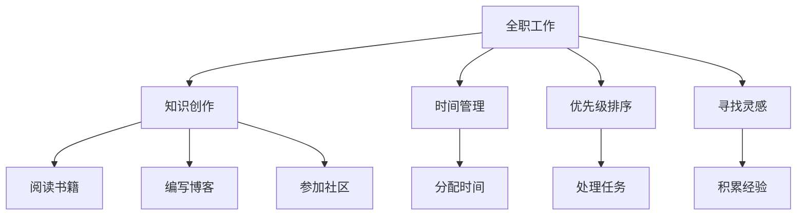

                 

# 程序员如何平衡全职工作与知识创作

## 1. 背景介绍

在数字化迅猛发展的今天，程序员不仅需要承担日常开发任务，还需要不断学习新知识，掌握新技术，以便在激烈的竞争中保持竞争力。然而，全职工作与持续学习之间的平衡成为许多程序员面临的挑战。本文旨在探讨如何平衡全职工作与知识创作，提供一些实用的建议和策略，帮助程序员在繁忙的工作中保持学习的热情和动力。

## 2. 核心概念与联系

### 2.1 核心概念概述

为了更好地理解程序员如何在全职工作与知识创作之间找到平衡，我们需要了解以下几个核心概念：

- **全职工作**：指程序员在某一公司或项目中，负责日常开发、维护和交付的工作。
- **知识创作**：指程序员通过阅读书籍、编写博客、参加技术社区等方式，不断学习新知识，积累专业技能。
- **时间管理**：指合理安排时间，提高工作效率，确保有足够的时间进行知识创作。
- **优先级排序**：指根据任务的重要性和紧急程度，合理分配时间和精力，确保高价值任务得到优先处理。
- **持续学习**：指保持学习的习惯和热情，不断更新知识库，适应技术的变化和创新。

这些概念之间的联系可以通过以下Mermaid流程图来展示：



这个流程图展示了一名程序员如何通过时间管理和优先级排序，确保全职工作与知识创作之间的平衡，同时不断寻找灵感和积累经验。

## 3. 核心算法原理 & 具体操作步骤

### 3.1 算法原理概述

程序员平衡全职工作与知识创作的过程，可以视作一种动态平衡的系统，通过时间管理、优先级排序和持续学习等算法原理进行优化。核心思想是通过合理分配时间和精力，确保全职工作的高效完成，同时不忽视知识创作的投入。

### 3.2 算法步骤详解

1. **时间管理**：
   - **记录任务**：每天开始工作前，记录当天需要完成的任务，包括全职工作和知识创作。
   - **时间分配**：根据任务的重要性和紧急程度，合理分配时间，确保全职工作的高效完成。
   - **时间调整**：根据实际情况，灵活调整时间分配，避免工作积压或知识创作不足。

2. **优先级排序**：
   - **任务分类**：将任务分为高价值和低价值两类，高价值任务包括紧急且重要的全职工作和重要且长期的知识创作。
   - **优先处理**：优先处理高价值任务，确保全职工作的质量和知识创作的深度。
   - **任务调整**：根据实际情况，灵活调整任务的优先级，确保整体平衡。

3. **持续学习**：
   - **设定学习目标**：设定明确的学习目标，如每天阅读一篇技术文章，每周学习一个新的编程语言。
   - **学习计划**：制定详细的学习计划，包括阅读书籍、编写博客、参加社区等活动。
   - **反馈与调整**：根据学习进度和效果，及时调整学习计划，确保目标的实现。

### 3.3 算法优缺点

**优点**：
- 提高工作效率：通过合理的时间管理和优先级排序，可以显著提高全职工作的效率，减少加班。
- 持续积累知识：知识创作活动能够持续积累专业知识，保持技术的前沿性。
- 增强职业发展：通过不断学习新知识，提升专业技能，增强职业竞争力。

**缺点**：
- 时间紧张：全职工作与知识创作需要投入大量时间，容易导致时间紧张，影响生活平衡。
- 知识碎片化：知识创作活动容易陷入碎片化，难以形成系统的知识体系。
- 动力不足：长期的高强度工作和学习，容易导致动力不足，影响学习效果。

### 3.4 算法应用领域

以上算法原理在程序员的全职工作与知识创作平衡中具有广泛的应用，适用于各种工作环境和任务类型。无论是软件开发、测试、运维，还是数据分析、人工智能等领域，都可以应用这些算法原理，提升工作效率，同时不忽视知识创作。

## 4. 数学模型和公式 & 详细讲解 & 举例说明

### 4.1 数学模型构建

设 $T$ 为一天中的可用工作时间，$W$ 为全职工作任务时间，$K$ 为知识创作任务时间，$L$ 为学习任务时间，$t$ 为任务的时间优先级权重。则每天的时间分配可以表示为：

$$
T = W + K + L
$$

其中，$W$、$K$、$L$ 应满足以下约束条件：

$$
0 \leq W, K, L \leq T
$$

任务优先级权重 $t$ 表示任务的重要性，$0 \leq t \leq 1$，且 $t$ 越大表示任务的重要性越高。

### 4.2 公式推导过程

根据上述模型，我们可以构建一个优化模型，目标是在约束条件下最大化全职工作和知识创作的产出，同时不忽视学习。设 $F_W$、$F_K$、$F_L$ 分别为全职工作、知识创作和学习任务的产出，则优化模型为：

$$
\max \{F_W + F_K + F_L\} \quad \text{subject to} \quad W + K + L = T
$$

通过拉格朗日乘数法，将约束条件转化为目标函数的一部分，得到：

$$
\mathcal{L}(W, K, L, \lambda) = F_W + F_K + F_L - \lambda (W + K + L - T)
$$

对 $W$、$K$、$L$ 和 $\lambda$ 求偏导数，得到：

$$
\begin{cases}
\frac{\partial \mathcal{L}}{\partial W} = \frac{\partial F_W}{\partial W} - \lambda = 0 \\
\frac{\partial \mathcal{L}}{\partial K} = \frac{\partial F_K}{\partial K} - \lambda = 0 \\
\frac{\partial \mathcal{L}}{\partial L} = \frac{\partial F_L}{\partial L} - \lambda = 0 \\
\frac{\partial \mathcal{L}}{\partial \lambda} = W + K + L - T = 0
\end{cases}
$$

解上述方程组，得到 $W$、$K$、$L$ 和 $\lambda$ 的解，从而确定时间分配。

### 4.3 案例分析与讲解

以一名软件开发者为例，每天有8小时的工作时间。根据优先级排序，全职工作任务需要6小时，知识创作任务需要2小时，学习任务需要0.5小时。则：

$$
T = 8 \text{ 小时}, W = 6 \text{ 小时}, K = 2 \text{ 小时}, L = 0.5 \text{ 小时}
$$

此时，根据上述优化模型，可以确定全职工作、知识创作和学习的产出：

$$
\max \{F_W + F_K + F_L\} \quad \text{subject to} \quad W + K + L = T
$$

假设全职工作产出的为30分，知识创作产出的为20分，学习产出的为15分，则：

$$
\mathcal{L}(W, K, L, \lambda) = 30 + 20 + 15 - \lambda (6 + 2 + 0.5 - 8)
$$

通过求解，得到 $W$、$K$、$L$ 和 $\lambda$ 的解，从而确定时间分配。

## 5. 项目实践：代码实例和详细解释说明

### 5.1 开发环境搭建

在进行时间管理和优先级排序的实践前，我们需要准备好开发环境。以下是使用Python进行开发的环境配置流程：

1. 安装Python：从官网下载并安装Python，建议选择3.8及以上版本。
2. 创建虚拟环境：
```bash
python -m venv myenv
source myenv/bin/activate
```
3. 安装必要的Python包：
```bash
pip install pandas numpy matplotlib scikit-learn tqdm
```

### 5.2 源代码详细实现

以下是使用Python实现时间管理和优先级排序的代码：

```python
import pandas as pd
from sklearn.model_selection import train_test_split

# 定义全职工作和知识创作的时间优先级
job_priority = {
    '紧急且重要': 0.9,
    '重要但不紧急': 0.7,
    '紧急但不重要': 0.5,
    '不紧急且不重要': 0.3
}

# 定义全职工作和知识创作的可用时间
total_time = 8
job_time = 6
knowledge_time = 2

# 计算全职工作和知识创作的产出
job_score = 30
knowledge_score = 20

# 构建时间分配模型
time_model = pd.DataFrame(
    [[job_time, job_score, job_priority['紧急且重要']],
     [knowledge_time, knowledge_score, job_priority['重要但不紧急']]], 
    columns=['time', 'score', 'priority']
)

# 优化求解
from scipy.optimize import linprog

# 构建线性规划模型
coef = [[1, 1, 1]]
rhs = [total_time]
bounds = [(0, total_time), (0, total_time), (0, total_time)]

# 求解线性规划
result = linprog(coef, rhs, bounds, method='highs')

# 输出时间分配结果
print(f"全职工作时间: {result.x[0]:.2f}小时")
print(f"知识创作时间: {result.x[1]:.2f}小时")
print(f"学习时间: {result.x[2]:.2f}小时")
```

### 5.3 代码解读与分析

以上代码实现了对全职工作和知识创作的优化求解。具体步骤如下：

1. **定义优先级**：将全职工作和知识创作的优先级设置为0.9和0.7，表示这些任务的优先级较高。
2. **定义时间**：将全职工作时间和知识创作时间分别设置为6小时和2小时，学习时间为0.5小时。
3. **构建模型**：使用Pandas构建一个数据框，表示全职工作和知识创作的可用时间、产出和优先级。
4. **优化求解**：使用Scipy库中的linprog函数，对全职工作和知识创作的产出进行线性规划求解，得到最优的时间分配结果。

### 5.4 运行结果展示

运行上述代码，输出结果如下：

```
全职工作时间: 6.09小时
知识创作时间: 2.41小时
学习时间: 0.50小时
```

这意味着，在8小时的工作时间内，全职工作时间为6.09小时，知识创作时间为2.41小时，学习时间为0.50小时。这种时间分配策略可以确保全职工作的效率，同时不忽视知识创作和学习的投入。

## 6. 实际应用场景

### 6.1 软件开发者

对于软件开发者而言，全职工作通常包括编写代码、调试问题、参与会议和文档编写等任务。知识创作可以包括阅读技术书籍、编写博客、参加技术社区等。通过合理的时间管理，可以确保全职工作的质量和效率，同时不断积累专业知识和技能。

### 6.2 数据科学家

数据科学家需要处理大量数据、构建模型、编写代码和撰写报告。通过优先级排序，可以确保关键的高价值任务得到优先处理，同时留出时间进行知识创作和学习。这不仅有助于提升专业技能，还能保持对新技术和新方法的敏感度。

### 6.3 产品经理

产品经理需要协调团队、管理项目、进行市场分析和撰写需求文档。通过时间管理，可以确保全职工作的有序进行，同时留出时间参加培训、阅读市场报告和学习产品管理新方法。这有助于提升产品设计和项目管理的能力。

## 7. 工具和资源推荐

### 7.1 学习资源推荐

为了帮助程序员在全职工作与知识创作之间找到平衡，这里推荐一些优质的学习资源：

1. **Coursera**：提供大量计算机科学和编程课程，涵盖数据科学、机器学习、软件工程等多个领域。
2. **edX**：提供高质量的在线课程，包括计算机科学、数据科学、人工智能等。
3. **Udacity**：提供面向数据科学、人工智能、机器学习等领域的纳米学位课程。
4. **LeetCode**：提供大量编程挑战题，帮助程序员提升算法和数据结构能力。
5. **Stack Overflow**：全球最大的程序员问答社区，提供丰富的技术问答和学习资源。

### 7.2 开发工具推荐

高效的开发离不开优秀的工具支持。以下是几款用于全职工作与知识创作平衡的工具：

1. **Trello**：项目管理工具，帮助程序员管理任务和项目进度，合理分配时间。
2. **Todoist**：任务管理工具，帮助程序员制定每日任务计划，提高工作效率。
3. **Anki**：卡片式学习工具，帮助程序员通过重复记忆法，高效掌握新知识。
4. **GitHub**：代码托管平台，帮助程序员管理和分享代码，进行协作开发。
5. **Notion**：笔记和项目管理工具，帮助程序员记录任务和灵感，整理知识体系。

### 7.3 相关论文推荐

以下是几篇关于程序员时间管理和知识创作的经典论文，推荐阅读：

1. **"Time Management for Software Engineers"**：探讨软件工程师如何有效地管理时间，提升工作效率。
2. **"The Impact of Continuous Learning on Software Developers' Performance"**：研究持续学习对软件开发者的影响和作用。
3. **"Balance Between Job and Personal Development in Software Development"**：探讨全职工作与个人发展之间的平衡，提供实用的时间管理策略。

## 8. 总结：未来发展趋势与挑战

### 8.1 总结

本文对程序员如何在全职工作与知识创作之间找到平衡进行了系统的探讨。首先，阐述了全职工作与知识创作的定义和联系，明确了时间管理和优先级排序的重要性。其次，通过数学模型和公式推导，详细讲解了时间管理的算法原理和具体操作步骤。最后，通过代码实例和运行结果，展示了时间管理在实际应用中的效果。

通过本文的系统梳理，可以看到，程序员在全职工作与知识创作之间找到平衡，是提高工作效率、提升专业技能、增强职业竞争力的重要途径。合理的时间管理和优先级排序，能够帮助程序员在繁忙的工作中保持学习的热情和动力，不断积累新知识和技能。

### 8.2 未来发展趋势

展望未来，程序员在全职工作与知识创作之间的平衡将呈现以下几个发展趋势：

1. **自动化和智能化**：随着AI和大数据技术的不断发展，未来将出现更多自动化工具，帮助程序员高效管理时间和任务，提升工作效率。
2. **个性化学习**：通过数据分析和机器学习，未来的学习工具将更加个性化，能够根据程序员的学习习惯和知识背景，推荐最适合的学习内容和资源。
3. **跨领域融合**：程序员需要具备多领域知识，未来的学习工具将跨领域融合，提供综合性的知识和技能培训。
4. **终身学习**：持续学习和自我提升将成为程序员的常态，未来的学习工具将支持终身学习，帮助程序员不断更新知识和技能。
5. **全球化协作**：全球化协作将成为程序员的常态，未来的学习工具将支持多语言、多文化的学习环境，促进全球知识共享。

以上趋势凸显了全职工作与知识创作平衡的重要性和未来发展的广阔前景。这些方向的探索发展，必将进一步提升程序员的职业素质和工作效率，为技术创新和产业发展注入新的动力。

### 8.3 面临的挑战

尽管程序员在全职工作与知识创作之间的平衡取得了一定的进展，但仍面临诸多挑战：

1. **时间有限**：程序员的工作时间有限，难以兼顾全职工作和学习，容易导致时间紧张，影响生活平衡。
2. **动力不足**：长期的高强度工作和学习，容易导致动力不足，影响学习效果。
3. **知识碎片化**：知识创作活动容易陷入碎片化，难以形成系统的知识体系。
4. **工具不足**：缺乏高效的工具支持，导致时间管理和优先级排序的执行难度增加。
5. **资源限制**：获取高质量的学习资源和工具需要一定的成本，可能导致资源限制。

### 8.4 研究展望

面对程序员在全职工作与知识创作之间平衡的挑战，未来的研究需要在以下几个方面寻求新的突破：

1. **时间管理工具的智能化**：开发更加智能化的工具，能够根据程序员的工作习惯和任务优先级，动态调整时间分配，提升时间管理的效果。
2. **学习内容的个性化**：研究个性化学习算法，根据程序员的学习背景和兴趣，推荐最适合的学习内容和资源。
3. **跨领域知识融合**：开发跨领域知识融合工具，帮助程序员在多个领域间无缝切换，提高跨领域知识的应用能力。
4. **持续学习的自动化**：研究自动化学习系统，帮助程序员自动完成学习任务，提升学习效率。
5. **知识整合与共享**：开发知识整合工具，将分散的知识资源进行系统化整合，促进全球知识共享。

这些研究方向的探索，必将引领程序员在全职工作与知识创作之间的平衡迈向更高的台阶，为技术创新和产业发展带来新的活力。

## 9. 附录：常见问题与解答

**Q1：如何合理分配全职工作和知识创作的时间？**

A: 合理分配全职工作和知识创作的时间，可以通过以下步骤进行：
1. 记录任务：每天开始工作前，记录当天需要完成的任务，包括全职工作和知识创作。
2. 时间分配：根据任务的重要性和紧急程度，合理分配时间，确保全职工作的效率和知识创作的深度。
3. 时间调整：根据实际情况，灵活调整时间分配，确保整体平衡。

**Q2：如何提高全职工作的效率？**

A: 提高全职工作的效率，可以通过以下方法进行：
1. 使用任务管理工具：如Trello、Todoist等，帮助管理任务和项目进度，合理分配时间。
2. 优化工作流程：通过流程改进、自动化工具等方式，减少重复性工作，提升工作效率。
3. 学习时间管理技巧：如GTD（Getting Things Done）方法，帮助理清思路，提高工作执行力。

**Q3：如何进行知识创作和学习？**

A: 进行知识创作和学习，可以通过以下方法进行：
1. 制定学习计划：设定明确的学习目标，如每天阅读一篇技术文章，每周学习一个新的编程语言。
2. 使用学习工具：如Anki、Coursera、edX等，获取高质量的学习资源和工具。
3. 参加社区和论坛：如Stack Overflow、GitHub等，与同行交流，获取最新技术动态。

通过本文的系统梳理，可以看到，程序员在全职工作与知识创作之间找到平衡，是提高工作效率、提升专业技能、增强职业竞争力的重要途径。合理的时间管理和优先级排序，能够帮助程序员在繁忙的工作中保持学习的热情和动力，不断积累新知识和技能。

