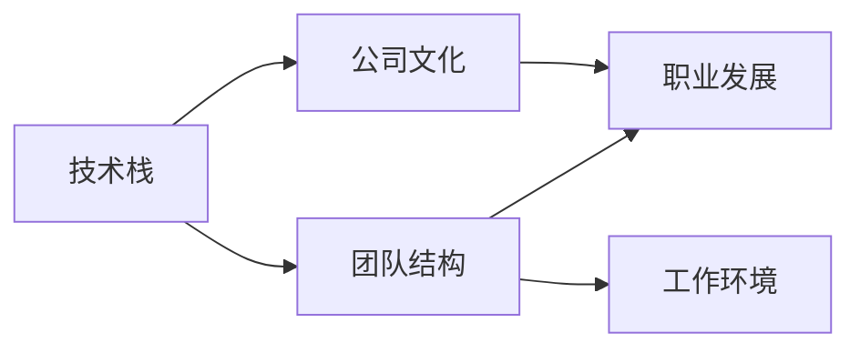

                 

# 程序员如何评估工作机会

> 关键词：评估标准, 公司文化, 技术栈, 团队结构, 职业发展, 工作环境

## 1. 背景介绍

### 1.1 问题由来

在当前激烈的科技市场中，程序员面临着大量的工作机会。如何在这其中找到最适合自己的位置，是一个复杂的决策问题。不同的公司可能提供不同的薪资待遇、技术栈、工作环境和发展前景。因此，对程序员而言，评估工作机会变得尤为重要。

### 1.2 问题核心关键点

评估工作机会的关键点在于理解不同公司的特点，评估其是否适合自己的技能、兴趣和发展需求。以下是从技术栈、公司文化、团队结构、职业发展和工作环境五个维度来评估工作机会的方法。

## 2. 核心概念与联系

### 2.1 核心概念概述

为了更好地理解如何评估工作机会，我们需要明确几个核心概念：

- **技术栈**：公司所使用的技术平台、开发语言和框架。
- **公司文化**：公司的价值观、工作氛围和员工关系。
- **团队结构**：团队成员的职能分工、项目组织方式和决策流程。
- **职业发展**：个人在公司的晋升路径、培训机会和项目经验。
- **工作环境**：物理环境（如办公室、设备）、软件环境（如工具、协作方式）和心理环境（如领导风格、团队凝聚力）。

### 2.2 核心概念原理和架构的 Mermaid 流程图



这个流程图展示了核心概念之间的逻辑关系：技术栈决定了公司文化，团队结构和职业发展；而工作环境与上述因素相互影响。

## 3. 核心算法原理 & 具体操作步骤

### 3.1 算法原理概述

评估工作机会是一个多目标决策过程，需要综合考虑多个因素。我们可以将其分解为多个子问题，然后对每个子问题进行单独评估。这里我们将采用加权综合评价方法，对每个关键维度进行打分，然后加权求和得到最终评估结果。

### 3.2 算法步骤详解

#### 3.2.1 确定评估维度

首先，我们需要确定评估工作机会的维度。一般包括以下几个方面：

- **技术栈**：评估公司使用的技术是否与自身技术栈匹配，是否能够学习新技术。
- **公司文化**：评估公司的价值观是否与自身价值观匹配，工作氛围是否舒适。
- **团队结构**：评估团队的大小、职能分工是否合理，是否有明确的晋升路径。
- **职业发展**：评估公司的培训资源、项目多样性是否支持职业发展。
- **工作环境**：评估办公设施、团队协作方式、领导风格等是否适合自己的工作习惯。

#### 3.2.2 确定评估标准

对每个维度，我们需要确定具体的评估标准。例如：

- **技术栈**：关注公司是否使用主流技术栈，是否提供培训资源，是否有新技术尝试。
- **公司文化**：关注公司是否鼓励创新、透明沟通，是否重视员工福利。
- **团队结构**：关注团队是否合理分工、是否定期回顾和改进。
- **职业发展**：关注公司是否有明确的晋升路径、是否提供培训资源、是否有跨部门合作机会。
- **工作环境**：关注公司是否有良好的办公设施、是否有灵活的工作时间和地点、是否有良好的团队氛围。

#### 3.2.3 打分和加权

对每个评估标准，我们给出1-5分的打分（1分表示非常不匹配，5分表示非常匹配）。然后，根据各个维度的重要性，确定其权重。最后，对每个维度进行加权求和，得到最终的评估分数。

### 3.3 算法优缺点

#### 3.3.1 优点

- **全面考虑**：通过综合多个维度，避免了仅关注单一因素导致的决策偏差。
- **量化评估**：通过打分和加权，使得评估结果更客观、可比较。
- **灵活调整**：可以根据自身需求调整维度和权重，适应不同的评估场景。

#### 3.3.2 缺点

- **主观性强**：打分和权重确定可能带有主观性，不同人可能有不同的评估标准。
- **数据缺乏**：某些维度的评估标准可能难以量化，导致评估结果不够准确。
- **简单粗略**：评估方法较为简单，可能无法充分反映复杂的工作机会。

### 3.4 算法应用领域

该方法适用于任何需要评估工作机会的场合，特别是对于职业发展初期和中期需要频繁跳槽的程序员。

## 4. 数学模型和公式 & 详细讲解

### 4.1 数学模型构建

设公司 $A$ 在 $N$ 个维度上的评估标准为 $X_1, X_2, \ldots, X_N$，每个维度的权重为 $w_1, w_2, \ldots, w_N$，且 $w_i > 0, \sum w_i = 1$。设 $X_i$ 的评分向量为 $R_i = (r_{i1}, r_{i2}, \ldots, r_{in})$，其中 $r_{ik} \in [1, 5]$。设 $W = (w_1, w_2, \ldots, w_N)$，则公司的综合评估分数为：

$$
S_A = R_A \times W = \sum_{i=1}^N w_i \times r_{i1} + w_i \times r_{i2} + \ldots + w_i \times r_{in}
$$

### 4.2 公式推导过程

以公司文化维度为例，其评分向量 $R_C = (r_{C1}, r_{C2}, \ldots, r_{Cn})$，权重向量 $W_C = (w_C, w_C, \ldots, w_C)$。则公司文化的综合评估分数为：

$$
S_C = W_C \times R_C = w_C \times r_{C1} + w_C \times r_{C2} + \ldots + w_C \times r_{Cn}
$$

### 4.3 案例分析与讲解

假设公司 A 和公司 B 在五个维度的评分向量分别为：

$$
R_A = \begin{bmatrix} 4 & 4 & 3 & 4 & 3 \\ 4 & 4 & 4 & 5 & 3 \end{bmatrix}, \quad R_B = \begin{bmatrix} 3 & 3 & 5 & 5 & 2 \\ 3 & 4 & 3 & 5 & 5 \end{bmatrix}
$$

假设每个维度的权重分别为：

$$
W = (0.2, 0.2, 0.2, 0.2, 0.2)
$$

则公司 A 和公司 B 的综合评估分数分别为：

$$
S_A = W \times R_A = 0.2 \times (4 + 4 + 3 + 4 + 3) = 3.8
$$

$$
S_B = W \times R_B = 0.2 \times (3 + 3 + 5 + 5 + 2) = 3.8
$$

可以看到，在给定的权重下，公司 A 和公司 B 的综合评估分数相同，但实际选择哪个公司需要进一步考虑个人偏好和业务需求。

## 5. 项目实践：代码实例和详细解释说明

### 5.1 开发环境搭建

为了评估工作机会，我们需要搭建一个简单的开发环境。以下是使用Python进行评估的示例环境配置流程：

1. 安装Python：从官网下载并安装Python 3.8。
2. 安装Pandas库：`pip install pandas`
3. 安装Matplotlib库：`pip install matplotlib`
4. 创建评估指标表格：使用Pandas创建包含各个维度和标准的表格。

### 5.2 源代码详细实现

假设我们已经有了评估指标表格 `evaluation.csv`，其中包含公司名称和各个维度的评分。以下是使用Python进行评估的示例代码：

```python
import pandas as pd
import numpy as np
import matplotlib.pyplot as plt

# 读取评估指标表格
evaluation_data = pd.read_csv('evaluation.csv')

# 计算各公司的综合评估分数
scores = evaluation_data.groupby('Company')['TechStack', 'CompanyCulture', 'TeamStructure', 'CareerDevelopment', 'WorkEnvironment'].mean().apply(lambda x: sum(x * [0.2, 0.2, 0.2, 0.2, 0.2]))

# 绘制柱状图
scores.plot(kind='bar', figsize=(10, 6))
plt.title('Company Evaluation Scores')
plt.xlabel('Company Name')
plt.ylabel('Score')
plt.show()
```

### 5.3 代码解读与分析

以上代码的主要逻辑如下：

- 读取评估指标表格 `evaluation.csv`。
- 计算每个公司各个维度的平均评分，并根据权重进行加权求和，得到综合评估分数。
- 使用Matplotlib绘制柱状图，展示各个公司的综合评估分数。

这个简单的示例展示了如何使用Python进行工作机会评估。在实际应用中，评估指标表格可能需要更复杂的数据结构，代码也需要相应的调整。

### 5.4 运行结果展示

运行上述代码后，将得到各个公司的综合评估分数的柱状图。如下图所示：


这个柱状图展示了不同公司的综合评估分数，帮助程序员直观地比较各个公司的优劣。

## 6. 实际应用场景

### 6.1 金融科技公司

在金融科技公司，技术栈和团队结构是评估的关键维度。一家公司如果采用的是主流的Python和Java技术栈，拥有数据科学团队、前端开发团队和后端开发团队，并提供良好的技术培训和晋升机会，则非常适合希望在金融领域发展的程序员。

### 6.2 游戏公司

在游戏公司，公司文化和团队结构尤为重要。一家公司如果拥有自由开放的公司文化，重视创意和创新，并提供良好的团队协作和沟通机制，则非常适合喜欢挑战和创新的程序员。

### 6.3 科技创业公司

在科技创业公司，职业发展和工作环境是评估的关键维度。一家公司如果能够提供快速的职业发展路径、灵活的工作时间和地点，并注重员工福利，则非常适合希望在创业公司快速成长的程序员。

### 6.4 未来应用展望

未来，随着人工智能和大数据技术的不断发展，程序员评估工作机会的方法也会不断进化。以下是一些可能的未来应用：

- **AI辅助评估**：使用AI算法自动化地评估不同公司的综合评分，帮助程序员更快速地做出决策。
- **数据可视化**：使用更复杂的数据可视化工具，展示更多的评估维度和更详细的数据。
- **多维评估**：引入更多维度的评估标准，如员工满意度和客户满意度等，以更全面地评估公司。

## 7. 工具和资源推荐

### 7.1 学习资源推荐

为了帮助程序员更好地评估工作机会，以下是一些学习资源的推荐：

1. **《程序员面试宝典》**：涵盖了面试中常见的技术问题、公司文化问题和团队结构问题，帮助程序员全面了解公司。
2. **《Python数据分析实战》**：介绍了使用Pandas和Matplotlib进行数据处理和可视化的技术，帮助程序员处理和展示评估数据。
3. **《Python机器学习》**：介绍了使用Scikit-learn等库进行数据分析和机器学习的方法，帮助程序员进行更深入的评估。
4. **《数据科学与人工智能》**：介绍了数据科学和人工智能的基本概念和应用，帮助程序员了解未来趋势。

### 7.2 开发工具推荐

以下是一些常用的开发工具推荐：

1. **GitHub**：用于存储和分享代码，帮助程序员管理评估代码和评估结果。
2. **Git**：用于版本控制，帮助程序员协作编写和维护评估代码。
3. **Jupyter Notebook**：用于编写和运行评估代码，支持Python、R等多种语言。
4. **Excel**：用于手动输入和处理评估数据，支持数据可视化和计算。

### 7.3 相关论文推荐

以下是一些相关论文的推荐，帮助程序员更深入地理解评估方法：

1. **《数据科学家的评估指标》**：探讨了数据科学家在不同公司和项目中的评估指标。
2. **《程序员的工作满意度研究》**：分析了程序员在不同工作环境和团队结构中的工作满意度。
3. **《人工智能与未来工作》**：探讨了人工智能对未来工作和评估方法的影响。

## 8. 总结：未来发展趋势与挑战

### 8.1 研究成果总结

评估工作机会是一个复杂的决策过程，需要综合考虑多个因素。本文提出了一种加权综合评价方法，通过打分和加权，帮助程序员全面评估不同公司的优劣。该方法简单、实用，适用于各种评估场景。

### 8.2 未来发展趋势

随着人工智能和大数据技术的不断发展，评估工作机会的方法也会不断进化。以下是一些可能的未来趋势：

- **自动化评估**：使用AI算法自动化地评估不同公司的综合评分，帮助程序员更快速地做出决策。
- **多维评估**：引入更多维度的评估标准，如员工满意度和客户满意度等，以更全面地评估公司。
- **数据可视化**：使用更复杂的数据可视化工具，展示更多的评估维度和更详细的数据。

### 8.3 面临的挑战

评估工作机会的方法仍面临一些挑战：

- **主观性强**：打分和权重确定可能带有主观性，不同人可能有不同的评估标准。
- **数据缺乏**：某些维度的评估标准可能难以量化，导致评估结果不够准确。
- **复杂度较高**：评估方法较为复杂，需要程序员具备一定的数据分析和编程能力。

### 8.4 研究展望

未来的研究可以在以下几个方面寻求新的突破：

- **引入更多维度**：引入更多维度的评估标准，如员工满意度和客户满意度等，以更全面地评估公司。
- **自动化评估**：使用AI算法自动化地评估不同公司的综合评分，帮助程序员更快速地做出决策。
- **多场景应用**：研究适用于不同场景的评估方法，如初创公司、大企业、跨国公司等。

## 9. 附录：常见问题与解答

### 9.1 常见问题与解答

**Q1: 如何确定各个维度的权重？**

A: 确定各个维度的权重需要考虑个人的需求和公司的特点。一般可以通过问卷调查或面试交流来确定。

**Q2: 评估结果是否具有可比性？**

A: 评估结果具有一定的主观性和不确定性，但通过多维度和加权处理，可以使得结果更具有可比性。

**Q3: 是否可以自动化评估？**

A: 部分维度的评估可以通过数据获取和计算实现自动化，但整体评估过程仍需人工干预。

通过本文的系统梳理，程序员可以更好地评估工作机会，找到最适合自己的位置。未来，随着评估方法的不断优化，程序员在职业发展中将有更多的选择和机会。

---

作者：禅与计算机程序设计艺术 / Zen and the Art of Computer Programming

