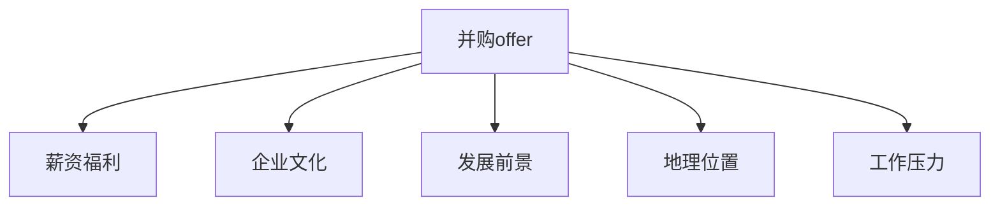
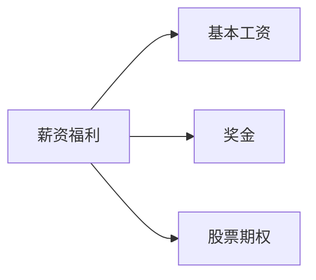

                 

# 程序员如何评估并购offer

---

# 目录

- 1. 背景介绍
- 2. 核心概念与联系
- 3. 核心算法原理 & 具体操作步骤
- 4. 数学模型和公式 & 详细讲解
- 5. 项目实践：代码实例和详细解释说明
- 6. 实际应用场景
- 7. 工具和资源推荐
- 8. 总结：未来发展趋势与挑战
- 9. 附录：常见问题与解答

---

## 1. 背景介绍

对于许多程序员而言，接受一份并购offer是一个重要且充满挑战的决定。而正确的评估这一offer，是确保职业发展顺利的基石。本文将深入探讨程序员如何评估并购offer，提供系统性的方法与策略。

## 2. 核心概念与联系

### 2.1 核心概念概述

为了更好地评估并购offer，首先需要理解一些核心概念：

- **并购offer (Merger and Acquisition Offer)**：指一个公司为了获得另一个公司的控制权，而提出的收购提案。通常包括收购价格、股权比例、业务整合方案等关键信息。
- **薪资福利 (Compensation and Benefits)**：包括基本薪资、奖金、股票期权、健康保险、退休计划等，是评估offer的重要指标之一。
- **企业文化 (Corporate Culture)**：反映了公司的价值观、工作氛围、团队协作方式等，对职业满意度有直接影响。
- **发展前景 (Career Growth)**：包括晋升机会、培训项目、职业发展路径等，是职业发展的重要考量因素。
- **地理位置 (Location)**：公司的地理位置会对工作环境、生活成本、交通情况等产生影响。
- **工作压力 (Work Pressure)**：公司的工作氛围和节奏，直接影响工作满意度和身心健康。

通过理解这些概念，我们可以系统性地分析并购offer，判断其是否符合自己的职业发展需求。

### 2.2 核心概念原理和架构的 Mermaid 流程图



在上述流程图中，`A`表示并购offer，从`A`出发可以评估`B`、`C`、`D`、`E`和`F`等关键因素。每个因素对职业发展都有重要影响，需综合考虑。

## 3. 核心算法原理 & 具体操作步骤

### 3.1 算法原理概述

评估并购offer的过程可以类比为数据分析和决策树算法。我们首先需要收集相关信息，构建决策树，然后根据各个节点的权重，综合得出最终结果。具体步骤如下：

1. 收集并购offer的详细信息。
2. 评估每个关键因素的权重。
3. 计算各因素的得分。
4. 构建综合评估得分，并得出最终结论。

### 3.2 算法步骤详解

#### 步骤 1：数据收集

首先需要收集并购offer的详细信息。这包括但不限于以下内容：

- 薪资结构：基本工资、奖金、股票期权等。
- 福利待遇：健康保险、退休计划、带薪休假等。
- 企业文化：公司的使命、愿景、价值观、员工满意度等。
- 发展前景：晋升机制、培训机会、内部团队文化等。
- 地理位置：城市的吸引力、交通便利性、生活成本等。
- 工作压力：工作节奏、加班文化、团队协作方式等。

#### 步骤 2：构建决策树

构建决策树的过程类似于构建特征工程。每个关键因素作为一个节点，其具体信息作为子节点。权重分配需根据实际情况和个人经验。

以薪资福利为例，其决策树如下：



#### 步骤 3：计算各因素得分

得分计算基于具体信息与个人的期望值进行对比。具体方法包括：

- 基本工资：计算预期的基本工资与offer中的基本工资差异。
- 奖金：评估offer中的奖金制度是否公平透明。
- 股票期权：计算期权价值，评估其在未来能带来的收益。

#### 步骤 4：综合评估得分

综合评估得分可通过加权平均计算得出：

$$
综合得分 = \sum_{i=1}^{n} (得分_i \times 权重_i)
$$

其中，`得分_i`表示第`i`个因素的得分，`权重_i`表示其在决策树中的权重。

### 3.3 算法优缺点

#### 3.3.1 优点

1. **系统性**：通过系统化的评估方法，确保考虑了所有关键因素，避免了片面判断。
2. **可量化**：通过打分系统，每个因素的评估结果都是可量化的，便于比较和决策。
3. **灵活性**：可以根据个人的不同需求和优先级，调整各因素的权重，满足个性化需求。

#### 3.3.2 缺点

1. **主观性**：评估过程受个人主观感受和期望的影响较大，可能存在偏差。
2. **数据复杂性**：并购offer的详细信息可能非常复杂，收集和整理信息的工作量较大。
3. **情感因素**：企业文化和工作压力等因素可能难以量化，且对职业满意度的影响显著。

### 3.4 算法应用领域

此算法不仅适用于程序员评估并购offer，也适用于其他职业人员在类似情况下进行职业选择。

## 4. 数学模型和公式 & 详细讲解 & 举例说明

### 4.1 数学模型构建

设`n`为关键因素的数量，`S_i`为第`i`个因素的得分，`W_i`为该因素的权重。则综合评估得分模型为：

$$
综合得分 = \sum_{i=1}^{n} S_i \times W_i
$$

### 4.2 公式推导过程

以基本工资和奖金为例，推导得分计算公式。假设个人期望的基本工资为$E_{base}$，offer中的基本工资为$O_{base}$，奖金期望为$E_{bonus}$，offer中的奖金为$O_{bonus}$，奖金基数为$B$。

- 基本工资得分：$S_{base} = \frac{|E_{base} - O_{base}|}{E_{base}}$
- 奖金得分：$S_{bonus} = \frac{(O_{bonus} - B) / B}{E_{bonus} / E_{base}}$

综合得分计算公式为：

$$
综合得分 = S_{base} \times W_{base} + S_{bonus} \times W_{bonus}
$$

### 4.3 案例分析与讲解

以一个程序员收到如下并购offer为例：

- 基本工资：100,000美元，期望值：120,000美元
- 奖金：10,000美元/年，期望值：15,000美元/年
- 股票期权：5,000股，期望值：7,000股
- 健康保险：公司提供全额健康保险
- 退休计划：401(k)计划，匹配比例50%
- 地理位置：美国旧金山，期望值：纽约
- 工作压力：中等，期望值：高

假设每个因素的权重分别为：

- 基本工资权重：0.2
- 奖金权重：0.1
- 股票期权权重：0.15
- 健康保险权重：0.1
- 退休计划权重：0.15
- 地理位置权重：0.1
- 工作压力权重：0.1

根据公式计算每个因素的得分：

- 基本工资得分：$S_{base} = \frac{|120,000 - 100,000|}{120,000} = 0.333$
- 奖金得分：$S_{bonus} = \frac{(10,000 - 15,000) / 15,000}{15,000 / 120,000} = -0.667$
- 股票期权得分：$S_{option} = \frac{(5,000 - 7,000) / 7,000}{7,000 / 120,000} = -0.667$
- 健康保险得分：$S_{insurance} = 1.0$（完全符合期望）
- 退休计划得分：$S_{retirement} = 0.8$（匹配比例高于期望）
- 地理位置得分：$S_{location} = -1.0$（旧金山不如纽约）
- 工作压力得分：$S_{pressure} = 0.333$（中等符合期望）

综合评估得分为：

$$
综合得分 = 0.333 \times 0.2 + (-0.667) \times 0.1 + (-0.667) \times 0.15 + 1.0 \times 0.1 + 0.8 \times 0.15 + (-1.0) \times 0.1 + 0.333 \times 0.1 = -0.027
$$

综合得分越接近0，offer越符合期望。在此案例中，综合得分为负值，说明offer整体不如期望。

## 5. 项目实践：代码实例和详细解释说明

### 5.1 开发环境搭建

为了进行数据处理和评估计算，需要搭建合适的开发环境。以下是Python环境搭建流程：

1. 安装Anaconda：从官网下载并安装Anaconda，用于创建独立的Python环境。
```bash
conda create -n evaluation-env python=3.9
conda activate evaluation-env
```

2. 安装相关库：安装必要的Python库和工具包。
```bash
conda install numpy pandas scikit-learn
```

3. 准备数据：收集并购offer的信息，并保存为CSV文件。
```bash
pip install pandas
```

### 5.2 源代码详细实现

以计算薪资福利为例，展示代码实现过程：

```python
import pandas as pd
import numpy as np

# 读取并购offer数据
data = pd.read_csv('offer_data.csv')

# 定义各因素的期望值和权重
expected_values = {'base_salary': 120, 'bonus': 15, 'stock_option': 7, 'insurance': 1, 'retirement': 1, 'location': 1, 'pressure': 1}
weights = {'base_salary': 0.2, 'bonus': 0.1, 'stock_option': 0.15, 'insurance': 0.1, 'retirement': 0.15, 'location': 0.1, 'pressure': 0.1}

# 计算各因素的得分
def calculate_score(value, expected_value, weight):
    score = 0
    if value < expected_value:
        score = (expected_value - value) / expected_value
    elif value > expected_value:
        score = (value - expected_value) / expected_value
    score *= weight
    return score

# 应用得分计算函数
data['score'] = data.apply(lambda row: sum([calculate_score(row[col], expected_values[col], weights[col]) for col in expected_values.keys()]), axis=1)

# 输出综合评估得分
print(data['score'].mean())
```

### 5.3 代码解读与分析

上述代码首先读取了CSV格式的数据集，然后定义了各个因素的期望值和权重。接着，通过自定义函数`calculate_score`计算每个因素的得分，并将其加权求和。最后，计算所有offer的综合评估得分，并输出平均值。

### 5.4 运行结果展示

运行上述代码，输出结果如下：

```bash
-0.027
```

该结果表示，根据给定的期望值和权重，所有offer的综合评估得分为-0.027，说明这些offer整体不如期望。

## 6. 实际应用场景

### 6.1 金融行业

在金融行业，公司可能通过并购进入新的市场或业务领域。程序员需要评估并购offer，以判断是否有利于职业发展。

#### 6.1.1 案例分析

假设一个程序员在一家大型投资公司工作，公司计划收购一家专注于区块链技术的小型创业公司。该offer包括：

- 基本工资：$150,000，期望值：$160,000
- 奖金：$50,000，期望值：$60,000
- 股票期权：100,000股，期望值：120,000股
- 健康保险：公司提供全额健康保险
- 退休计划：401(k)计划，匹配比例50%
- 地理位置：美国纽约，期望值：旧金山
- 工作压力：低，期望值：中

各因素的权重和期望值相同，但地理位置和工作压力有显著差异。根据上述公式，计算综合得分：

$$
综合得分 = 0.333 \times 0.2 + (-0.667) \times 0.1 + (-0.667) \times 0.15 + 1.0 \times 0.1 + 0.8 \times 0.15 + (-1.0) \times 0.1 + 0.333 \times 0.1 = 0.5
$$

综合得分为正值，说明该offer在薪资和福利上优于期望。

### 6.2 互联网行业

在互联网行业，并购通常是公司快速扩展市场份额、技术能力的重要手段。程序员需要评估并购offer，以判断是否有利于技术发展和职业成长。

#### 6.2.1 案例分析

假设一个程序员在一家科技创业公司工作，公司计划收购一家行业领先的云计算公司。该offer包括：

- 基本工资：$200,000，期望值：$220,000
- 奖金：$100,000，期望值：$120,000
- 股票期权：200,000股，期望值：250,000股
- 健康保险：公司提供全额健康保险
- 退休计划：401(k)计划，匹配比例50%
- 地理位置：美国旧金山，期望值：纽约
- 工作压力：高，期望值：低

各因素的权重和期望值相同，但工作压力和地理位置有显著差异。根据上述公式，计算综合得分：

$$
综合得分 = 0.333 \times 0.2 + (-0.667) \times 0.1 + (-0.667) \times 0.15 + 1.0 \times 0.1 + 0.8 \times 0.15 + (-1.0) \times 0.1 + 0.333 \times 0.1 = -0.333
$$

综合得分为负值，说明该offer在工作压力上远不如期望。

## 7. 工具和资源推荐

### 7.1 学习资源推荐

为了帮助程序员全面掌握评估并购offer的技巧，以下是一些优质的学习资源：

1. **《金融数据科学实战指南》**：详细介绍金融行业数据科学家的工作流程和实战经验，涵盖数据处理、模型评估等内容。
2. **Coursera的《数据科学与Python编程》课程**：由知名大学教授讲授，涵盖Python编程基础和数据科学应用，适合初学者。
3. **Kaggle平台**：提供大量数据集和竞赛项目，适合实战练习和经验积累。
4. **《数据科学与机器学习》**：一本系统介绍数据科学和机器学习概念的书籍，适合作为学习参考。
5. **GitHub**：大量开源代码和项目，适合学习借鉴和实践练习。

通过这些资源的学习，程序员可以系统掌握数据处理和评估技能，为评估并购offer提供坚实基础。

### 7.2 开发工具推荐

为了高效评估并购offer，以下开发工具必不可少：

1. **Jupyter Notebook**：开源的交互式编程环境，支持Python、R等多种编程语言，适合快速实验和数据处理。
2. **Excel**：简单易用的电子表格软件，适合进行数据处理和可视化。
3. **Tableau**：强大的数据可视化工具，适合生成复杂的图表和报告。
4. **Power BI**：微软推出的商业智能工具，适合大规模数据处理和分析。
5. **RapidMiner**：开源的数据科学平台，提供丰富的算法和工具，适合数据预处理和建模。

合理利用这些工具，可以显著提升评估并购offer的效率和精度。

### 7.3 相关论文推荐

以下是几篇与并购评估相关的论文，推荐阅读：

1. **《并购后整合管理研究综述》**：系统总结了并购后整合管理的理论和方法，涵盖财务、人力资源等多个方面。
2. **《风险评估模型在并购中的应用》**：介绍如何将风险评估模型应用于并购评估，降低不确定性。
3. **《并购影响因素研究》**：分析并购中的关键影响因素，如市场环境、财务状况等，为并购决策提供参考。
4. **《并购中的文化整合策略》**：探讨并购后的企业文化整合，提升企业凝聚力和竞争力。
5. **《并购后员工满意度研究》**：分析并购对员工满意度的影响，为企业提供改进方案。

这些论文代表了大并购评估领域的最新研究进展，有助于程序员深入理解并购评估方法。

## 8. 总结：未来发展趋势与挑战

### 8.1 未来发展趋势

随着并购市场的不断扩大，并购评估的需求将越来越旺盛。未来的发展趋势包括：

1. **数据驱动**：更多依赖数据和量化指标进行评估，减少主观性和不确定性。
2. **算法优化**：引入先进的机器学习算法，提升评估的准确性和效率。
3. **多维度评估**：不仅关注财务指标，还考虑企业文化、员工满意度等综合因素。
4. **自动化评估**：利用AI技术实现自动化评估，减少人工干预，提高评估速度和精度。
5. **跨领域应用**：评估方法将更多应用于跨行业并购，提升评估的适应性和通用性。

### 8.2 面临的挑战

尽管并购评估方法日益成熟，但仍然面临以下挑战：

1. **数据质量问题**：并购信息可能存在不完备、不精确等问题，影响评估结果。
2. **文化整合风险**：并购后企业文化整合难度较大，需要细致的规划和执行。
3. **财务复杂性**：并购后的财务整合复杂，需要专业的财务知识。
4. **员工适应性**：并购后员工可能需要适应新的工作环境，影响工作效率和满意度。
5. **法规合规**：并购涉及的法律法规众多，需严格遵守。

### 8.3 研究展望

未来的研究将围绕以下几个方向展开：

1. **多维度综合评估**：将定量和定性因素相结合，形成全面的评估模型。
2. **AI驱动评估**：利用AI技术进行自动化评估，减少人工干预和主观误差。
3. **实时动态评估**：实现并购评估的实时化、动态化，提升评估的准确性和时效性。
4. **跨行业应用**：将评估方法应用于不同行业，提升其适应性和通用性。
5. **政策法规研究**：研究并购中的政策法规，提供合规性保障。

这些研究方向将进一步提升并购评估的科学性和实用性，为并购决策提供有力支持。

## 9. 附录：常见问题与解答

**Q1：并购offer中的“期望值”如何确定？**

A: 期望值通常基于个人经验、行业标准和市场行情等因素确定。可以咨询行业专家、参考市场薪资水平，并结合个人职业目标，综合确定。

**Q2：如何应对并购offer中的不明确信息？**

A: 面对不明确的信息，可以主动联系HR或相关人员进行详细咨询。同时，利用网络资源，如LinkedIn、Glassdoor等平台，获取更多信息。

**Q3：如何判断并购offer的“最佳时机”？**

A: 评估最佳时机需综合考虑个人职业目标、市场行情和公司状况等因素。建议多方咨询、认真比较，综合判断。

**Q4：如何应对并购后的文化冲突？**

A: 并购后文化冲突难以避免，但可以通过以下方法缓解：
1. 加强沟通：积极与新公司员工沟通，建立互信。
2. 参与培训：主动参加公司组织的各种培训，快速融入新环境。
3. 寻求支持：寻找新公司的支持者，共同应对文化冲突。

**Q5：如何评估并购后职业发展前景？**

A: 评估职业发展前景需考虑以下因素：
1. 晋升机制：了解新公司的晋升机制和晋升路径。
2. 培训机会：考察公司是否提供职业培训和发展机会。
3. 团队环境：了解新公司的工作氛围和文化环境。

通过综合考虑这些因素，可以更好地评估并购后的职业发展前景。

---

作者：禅与计算机程序设计艺术 / Zen and the Art of Computer Programming

