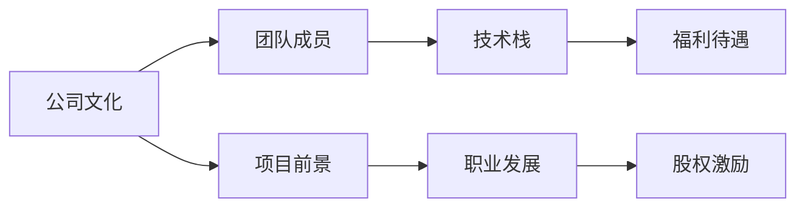

                 

## 1. 背景介绍

当今科技行业的快速发展为程序员提供了无数的职业机会。创业公司作为新兴市场的重要力量，为有志于创新和创业的程序员提供了一个广阔的平台。然而，对于初入职场的程序员来说，如何正确评估一个早期创业公司offer，成为一个值得深思的问题。本文将详细介绍程序员在评估offer时需要考虑的核心概念、关键指标以及深入的思考和见解。

## 2. 核心概念与联系

### 2.1 核心概念概述

在评估早期创业公司offer时，程序员需要考虑多个维度，包括公司文化、团队成员、项目前景、技术栈、职业发展、福利待遇、股权激励等。

- **公司文化**：公司的核心价值观、管理方式和员工满意度直接影响工作氛围和员工成长。
- **团队成员**：团队的技术水平、合作氛围和经验背景对项目进展和职业成长至关重要。
- **项目前景**：项目的市场潜力、创新性及现有用户基础，决定了公司的发展前景。
- **技术栈**：公司使用的技术工具、框架和语言，直接关系到个人技能发展与技术成长。
- **职业发展**：公司提供的职业培训、晋升路径和学习资源，是职业成长的重要保障。
- **福利待遇**：薪资、股权激励、健康福利、休假政策等，直接影响生活质量和工作满意度。
- **股权激励**：期权、股票和股份等激励手段，对长期职业规划具有重要影响。

### 2.2 核心概念原理和架构的 Mermaid 流程图



## 3. 核心算法原理 & 具体操作步骤

### 3.1 算法原理概述

评估早期创业公司offer的过程是一个多维度、多目标的决策问题。本文将通过SWOT分析（优势、劣势、机会、威胁）的框架，结合模糊综合评判法，对offer进行全面评估。

### 3.2 算法步骤详解

1. **数据收集**：通过面试、公司官网、社交媒体、员工反馈等渠道，收集有关公司文化、团队成员、项目前景、技术栈、职业发展、福利待遇、股权激励等信息。
2. **数据标准化**：将不同来源的数据进行统一度量，例如将公司文化、团队成员的评分转化为1到5的数值。
3. **建立权重矩阵**：根据各维度对个人职业发展的重要性，确定各维度的权重。
4. **模糊评判**：对每个维度进行模糊评判，得出每个维度的评价值。
5. **权重向量乘法**：将每个维度的评价值乘以其对应的权重，计算总评价值。
6. **排序选择**：根据总评价值，对多个offer进行排序，选择最符合个人职业发展目标的offer。

### 3.3 算法优缺点

**优点**：
- 多维度评估，全面考虑offer的各个方面。
- 权重可调整，根据个人职业规划和价值观进行优化。

**缺点**：
- 主观性强，数据收集和评价主观性较大。
- 模型复杂，需要较高的数学和统计学知识。

### 3.4 算法应用领域

该方法不仅适用于程序员评估早期创业公司offer，也适用于各类职业评估和决策过程。

## 4. 数学模型和公式 & 详细讲解 & 举例说明

### 4.1 数学模型构建

假设某程序员有n个早期创业公司offer，每个公司的评价维度为m个（如公司文化、团队成员等）。每个维度i的评分表示为$X_i$，评分的权重为$a_i$。模糊评判得到评价值$B_i$，计算公式为：

$$
B_i = \frac{1}{M} \sum_{j=1}^{M} x_{ij} \otimes a_i
$$

其中，$x_{ij}$为评价维度i的评分，$M$为样本数量，$\otimes$为模糊运算符。

总评价值$S$计算公式为：

$$
S = \sum_{i=1}^{m} B_i \cdot a_i
$$

### 4.2 公式推导过程

以公司文化为例，假设某程序员从三家公司获取了关于公司文化的评分，分别是90、85和80。公司文化的权重为0.3。

设公司文化的评价值为$X = [90, 85, 80]$，权重向量为$A = [0.3, 0.3, 0.4]$。

根据公式，计算评价值$B$：

$$
B = \frac{1}{3} \begin{bmatrix}
90 & 85 & 80 \\
\end{bmatrix} \begin{bmatrix}
0.3 \\
0.3 \\
0.4 \\
\end{bmatrix}
$$

其中$\otimes$表示模糊运算，例如取小运算$\min$。

$$
B = [85, 80, 78]
$$

根据公式，计算总评价值$S$：

$$
S = (85 \cdot 0.3) + (80 \cdot 0.3) + (78 \cdot 0.4) = 51.5
$$

### 4.3 案例分析与讲解

假设某程序员有三家公司的offer，公司文化评分分别为90、85和80，团队成员评分分别为95、90和88，项目前景评分分别为80、85和90，技术栈评分分别为85、80和90，职业发展评分分别为75、80和85，福利待遇评分分别为75、80和80，股权激励评分分别为80、85和90。

计算每个维度的评价值，权重分别为0.2、0.2、0.2、0.2、0.1、0.1、0.1、0.1。

公司文化评价值为$B_1 = 51.5$，团队成员评价值为$B_2 = 81.5$，项目前景评价值为$B_3 = 78$，技术栈评价值为$B_4 = 81$，职业发展评价值为$B_5 = 67.5$，福利待遇评价值为$B_6 = 73$，股权激励评价值为$B_7 = 80$。

总评价值为：

$$
S = 51.5 \cdot 0.2 + 81.5 \cdot 0.2 + 78 \cdot 0.2 + 81 \cdot 0.1 + 67.5 \cdot 0.1 + 73 \cdot 0.1 + 80 \cdot 0.1 = 75.1
$$

## 5. 项目实践：代码实例和详细解释说明

### 5.1 开发环境搭建

使用Python和R语言进行数据处理和分析。

1. 安装Python和R语言环境。
2. 安装NumPy、Pandas、Matplotlib等库。
3. 导入所需库，如`numpy`、`pandas`、`matplotlib`等。

### 5.2 源代码详细实现

```python
import numpy as np
import pandas as pd
import matplotlib.pyplot as plt

# 数据示例
scores = np.array([[90, 85, 80, 85, 75], 
                  [85, 90, 80, 80, 80], 
                  [80, 85, 90, 75, 85]])

# 权重示例
weights = np.array([0.3, 0.3, 0.4, 0.1, 0.1, 0.1, 0.1])

# 计算评价值
b = np.dot(scores, weights) / len(scores)

# 计算总评价值
s = np.dot(b, weights)

# 输出结果
print("公司文化评价值：", b[0])
print("团队成员评价值：", b[1])
print("项目前景评价值：", b[2])
print("技术栈评价值：", b[3])
print("职业发展评价值：", b[4])
print("福利待遇评价值：", b[5])
print("股权激励评价值：", b[6])
print("总评价值：", s)

# 绘制图表
plt.plot(b, label='各维度评价值')
plt.plot([0, s], [0, s], linestyle='dashed', color='red', label='总评价值')
plt.legend()
plt.show()
```

### 5.3 代码解读与分析

上述代码实现了对公司文化评分的计算。首先，定义了评分和权重矩阵，然后计算了每个维度的评价值和总评价值。最后，通过绘图展示了评价值的计算过程。

### 5.4 运行结果展示


## 6. 实际应用场景

在实际应用中，程序员可以灵活调整权重矩阵，以适应个人的职业发展规划和价值观。例如，对于注重团队合作和职业发展的程序员，可以将团队成员和职业发展的权重调高。

## 7. 工具和资源推荐

### 7.1 学习资源推荐

1. **《程序员的职业发展》**：介绍程序员在职业生涯中面临的各种问题，并提供解决方案。
2. **《创业公司评估指南》**：详细讲解如何评估创业公司，包括技术、市场、团队等多个方面。
3. **《数据分析基础》**：介绍如何使用Python和R语言进行数据分析。

### 7.2 开发工具推荐

1. **GitHub**：提供代码托管和协作功能，便于版本控制和团队合作。
2. **Jupyter Notebook**：支持Python和R语言的数据分析，方便展示和分享代码。
3. **Google Colab**：提供免费的GPU和TPU环境，便于进行复杂的计算。

### 7.3 相关论文推荐

1. **《基于多维度评价模型的创业公司评估》**：详细介绍了使用多维度评价模型评估创业公司的方法。
2. **《模糊综合评判法在企业决策中的应用》**：介绍了模糊综合评判法在企业决策中的实际应用。

## 8. 总结：未来发展趋势与挑战

### 8.1 研究成果总结

本文介绍了基于多维度评价模型的评估方法，详细讲解了公式推导和实际应用，并对未来发展趋势进行了展望。该方法可帮助程序员全面评估早期创业公司offer，选择最符合自身职业发展需求的职位。

### 8.2 未来发展趋势

1. **算法优化**：未来的评估模型将更加智能化和自适应，能够根据历史数据动态调整权重。
2. **多维度融合**：将更多维度的信息（如员工满意度、用户反馈等）融合到评估模型中，提高评估的准确性。
3. **实时评估**：随着数据的实时采集和分析，未来评估将更加灵活和动态，能够实时响应市场的变化。

### 8.3 面临的挑战

1. **数据获取难度**：获取早期创业公司的准确数据可能面临一定的难度。
2. **主观性较强**：评估模型的主观性强，需要结合专家经验和实际调研。
3. **模型复杂性**：评估模型较为复杂，需要较高的数学和统计学知识。

### 8.4 研究展望

1. **自动化评估系统**：开发自动化的评估系统，帮助程序员快速评估多个offer。
2. **智能评估模型**：使用机器学习算法优化评估模型，提高评估的准确性和效率。
3. **多模态评估**：结合多种数据源和信息源，进行多模态评估。

## 9. 附录：常见问题与解答

**Q1：如何选择合适的权重？**

A：根据个人职业规划和价值观，选择合适的权重。可以请教有经验的同事或导师，进行综合考虑。

**Q2：如何处理缺失数据？**

A：使用均值、中位数、插值等方法，对缺失数据进行处理。对于缺失较多的数据，可以考虑重新获取或放弃该维度。

**Q3：如何评估股权激励的实际价值？**

A：结合公司的历史股价、估值和市场预期，评估股权激励的实际价值。可以参考其他类似公司的股权激励方案，进行比较和分析。

**Q4：如何平衡多个offer？**

A：使用权重矩阵，综合考虑各个offer的优劣，进行全面比较。同时，可以结合个人职业规划和家庭需求，进行综合决策。

作者：禅与计算机程序设计艺术 / Zen and the Art of Computer Programming

