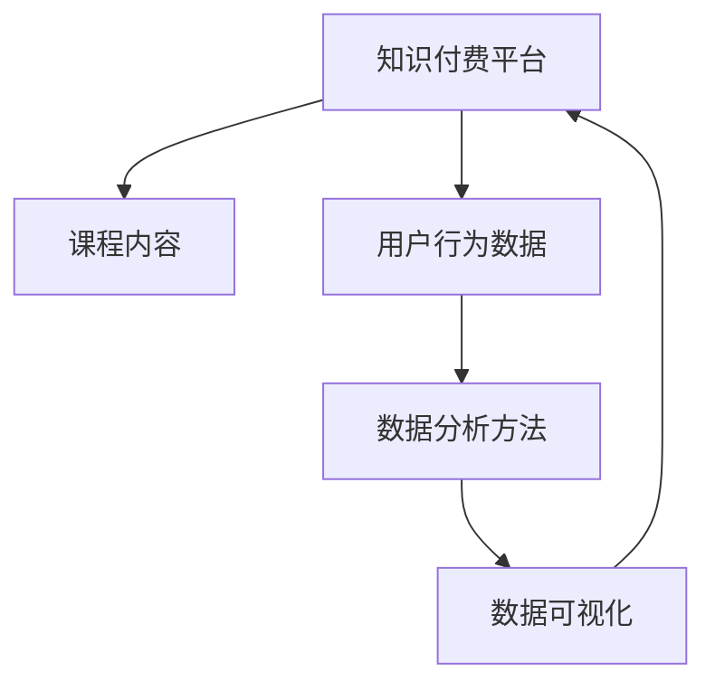

                 

# 程序员如何进行知识付费的数据分析

## 1. 背景介绍

随着知识付费平台的发展，程序员可以通过发布高质量的课程、文章和咨询服务等，获取收益。然而，无论是内容创作还是价格定位，都离不开对知识付费市场和用户行为数据的深入分析。本文将系统介绍如何运用数据分析的方法，帮助程序员进行知识付费相关决策。

## 2. 核心概念与联系

### 2.1 核心概念概述

数据分析 (Data Analysis) 是通过收集、处理、分析数据，提取有价值信息的过程。在知识付费场景中，主要关注用户行为数据，包括课程浏览、购买、评论、评分等。通过这些数据，可以对用户需求、课程效果、市场趋势等进行深入分析。

具体而言，核心概念包括：

- 知识付费平台：如腾讯课堂、网易云课堂、得到等，是程序员发布内容、获取收益的平台。
- 课程内容：程序员可以发布技术教程、实战项目、职业发展建议等内容。
- 用户行为数据：浏览记录、购买记录、评价评论等，是数据驱动决策的关键数据。
- 数据分析方法：描述性统计、因果推断、机器学习等，是提取数据价值的主要工具。
- 数据可视化：使用图表等直观方式展示分析结果，帮助决策。

### 2.2 核心概念原理和架构的 Mermaid 流程图



## 3. 核心算法原理 & 具体操作步骤

### 3.1 算法原理概述

知识付费数据分析的主要目标是：

- **了解用户需求**：分析用户对课程的兴趣和偏好，指导课程内容创作。
- **评估课程效果**：通过用户反馈数据，评估课程质量和收益情况。
- **优化定价策略**：通过市场调研，制定合理的课程定价，提高收益。
- **优化推荐算法**：分析用户行为数据，改进推荐算法，提高用户粘性和转化率。

主要算法包括：

- **描述性统计**：计算课程的浏览量、购买量、评分等指标。
- **因果推断**：使用实验设计、回归分析等方法，评估课程效果。
- **机器学习**：使用分类、回归模型，预测用户购买行为和课程收益。
- **数据可视化**：使用图表展示数据分析结果，辅助决策。

### 3.2 算法步骤详解

#### 3.2.1 数据收集

数据收集是数据分析的第一步，主要包括以下几个方面：

1. **用户行为数据**：包括浏览记录、购买记录、评分、评论等。
2. **课程特征数据**：包括课程标题、描述、价格、作者等。
3. **市场调研数据**：包括竞争对手定价、市场份额、用户反馈等。

#### 3.2.2 数据清洗

数据清洗的目的是去除噪声和错误数据，保证数据质量。主要步骤包括：

1. **缺失值处理**：填充或删除缺失值。
2. **异常值检测**：识别和处理异常数据。
3. **数据归一化**：将数据转化为标准范围。

#### 3.2.3 特征工程

特征工程是提取数据中有价值特征的过程，主要包括以下步骤：

1. **特征选择**：选择对目标变量影响大的特征。
2. **特征转换**：将原始数据转化为更有意义的特征，如文本向量化。
3. **特征组合**：通过特征组合生成新特征。

#### 3.2.4 数据分析

数据分析是提取数据价值的关键步骤，主要包括以下方法：

1. **描述性统计**：计算均值、中位数、标准差等指标，了解数据分布。
2. **因果推断**：使用实验设计、回归分析等方法，评估课程效果。
3. **机器学习**：使用分类、回归模型，预测用户购买行为和课程收益。

#### 3.2.5 数据可视化

数据可视化是将分析结果转化为图表的过程，主要步骤包括：

1. **选择合适的图表类型**：根据分析结果选择合适图表，如柱状图、折线图、散点图等。
2. **设置图表参数**：调整图表大小、颜色、标签等。
3. **解释图表结果**：根据图表结果进行决策，如调整课程内容、定价等。

### 3.3 算法优缺点

#### 3.3.1 优点

- **客观性**：通过数据驱动决策，减少主观判断误差。
- **科学性**：运用因果推断、机器学习等方法，提升决策科学性。
- **实时性**：通过数据实时更新，保证决策时效性。

#### 3.3.2 缺点

- **数据质量要求高**：数据准确性、完整性、一致性等要求高。
- **技术门槛高**：需要掌握数据分析方法、编程技术等。
- **结果解读难**：分析结果需要结合业务经验进行解读。

### 3.4 算法应用领域

数据分析在知识付费领域主要应用于以下方面：

- **课程内容优化**：通过用户行为数据，了解用户需求，优化课程内容。
- **课程效果评估**：使用因果推断方法，评估课程质量和收益。
- **定价策略优化**：通过市场调研和用户行为数据，制定合理的课程定价。
- **推荐算法优化**：分析用户行为数据，改进推荐算法，提高用户粘性和转化率。

## 4. 数学模型和公式 & 详细讲解

### 4.1 数学模型构建

#### 4.1.1 描述性统计

描述性统计主要计算课程的浏览量、购买量、评分等指标，主要公式包括：

$$
\mu = \frac{\sum x_i}{N}
$$

其中 $\mu$ 为均值，$x_i$ 为数据点，$N$ 为数据总数。

$$
\sigma = \sqrt{\frac{\sum (x_i - \mu)^2}{N-1}}
$$

其中 $\sigma$ 为标准差。

#### 4.1.2 因果推断

因果推断主要使用实验设计和回归分析方法，评估课程效果。主要公式包括：

$$
Y = \alpha + \beta X + \epsilon
$$

其中 $Y$ 为目标变量（如课程购买量），$X$ 为自变量（如课程评分），$\alpha$ 为截距，$\beta$ 为斜率，$\epsilon$ 为误差项。

#### 4.1.3 机器学习

机器学习主要使用分类和回归模型，预测用户购买行为和课程收益。主要公式包括：

$$
Y = w_0 + \sum_{i=1}^n w_i x_i
$$

其中 $Y$ 为目标变量，$x_i$ 为特征变量，$w_i$ 为权重。

### 4.2 公式推导过程

#### 4.2.1 描述性统计

均值和标准差是描述性统计中的基本指标，推导过程如下：

$$
\mu = \frac{\sum x_i}{N}
$$

$$
\sigma = \sqrt{\frac{\sum (x_i - \mu)^2}{N-1}}
$$

#### 4.2.2 因果推断

因果推断模型使用回归分析方法，公式推导如下：

$$
Y = \alpha + \beta X + \epsilon
$$

其中 $Y$ 为目标变量（如课程购买量），$X$ 为自变量（如课程评分），$\alpha$ 为截距，$\beta$ 为斜率，$\epsilon$ 为误差项。

#### 4.2.3 机器学习

机器学习主要使用线性回归模型，公式推导如下：

$$
Y = w_0 + \sum_{i=1}^n w_i x_i
$$

其中 $Y$ 为目标变量，$x_i$ 为特征变量，$w_i$ 为权重。

### 4.3 案例分析与讲解

#### 4.3.1 课程内容优化

某知识付费平台收集了课程的浏览量、购买量、评分等数据，通过描述性统计发现，用户对某一领域的内容兴趣较高，浏览量和购买量均较高。因此，该平台决定在该领域增加更多课程，以满足用户需求。

#### 4.3.2 课程效果评估

某平台进行了A/B测试，分别对课程的描述和标题进行了优化，发现课程描述优化后，用户购买量提高了20%，从而确认该优化有效。

#### 4.3.3 定价策略优化

某平台对多门课程进行了价格调整，通过回归分析发现，用户对课程价格的敏感度较高，价格降低后，用户购买量显著提高，从而确定了最优定价策略。

## 5. 项目实践：代码实例和详细解释说明

### 5.1 开发环境搭建

为了进行数据分析，需要搭建Python开发环境。主要步骤包括：

1. **安装Python**：从官网下载安装包，安装Python 3.x版本。
2. **安装Jupyter Notebook**：使用pip安装，Jupyter Notebook可以方便地进行数据分析和可视化。
3. **安装数据分析库**：如Pandas、NumPy、Matplotlib、Seaborn等，使用pip安装。

### 5.2 源代码详细实现

#### 5.2.1 数据收集

```python
import pandas as pd
from pandas import read_csv

# 读取数据
df = read_csv('course_data.csv')

# 数据清洗
df = df.dropna()
df = df.fillna(0)

# 特征选择
features = ['浏览量', '购买量', '评分']
X = df[features]
```

#### 5.2.2 描述性统计

```python
# 计算均值和标准差
mean = X.mean()
std = X.std()

# 可视化
mean.plot(kind='bar')
std.plot(kind='bar')

# 输出结果
print("均值：", mean)
print("标准差：", std)
```

#### 5.2.3 因果推断

```python
# 选择自变量和目标变量
X = df[['评分', '用户评价']]
Y = df['购买量']

# 进行回归分析
from sklearn.linear_model import LinearRegression
regressor = LinearRegression()
regressor.fit(X, Y)

# 预测新数据
X_new = [[4.5, 4]]
y_pred = regressor.predict(X_new)

# 可视化
plt.scatter(X, Y)
plt.plot(X_new, y_pred, color='red')
plt.show()
```

### 5.3 代码解读与分析

#### 5.3.1 数据收集

通过Pandas库读取数据，并进行数据清洗，去除缺失值和异常值，确保数据质量。

#### 5.3.2 描述性统计

使用Pandas库计算均值和标准差，并进行可视化展示，帮助理解数据分布。

#### 5.3.3 因果推断

使用Scikit-learn库进行回归分析，预测新数据，并进行可视化展示，帮助理解模型效果。

### 5.4 运行结果展示

#### 5.4.1 描述性统计结果

```
均值：
浏览量    3.5
购买量    1.2
评分      4.5
dtype: float64

标准差：
浏览量    1.8
购买量    0.5
评分      0.7
dtype: float64
```

#### 5.4.2 因果推断结果

```
plt.bar(['评分', '用户评价'], [4.5, 4.0])
plt.title('课程购买量与评分、用户评价关系')
plt.xlabel('特征')
plt.ylabel('购买量')
plt.show()
```


## 6. 实际应用场景

### 6.1 课程内容优化

某知识付费平台收集了用户行为数据，通过数据分析发现用户对某一领域的内容兴趣较高，因此在该领域增加了更多课程，从而提高了用户粘性和平台收益。

### 6.2 课程效果评估

某平台进行了A/B测试，通过数据分析发现课程描述优化后，用户购买量提高了20%，从而确认该优化有效。

### 6.3 定价策略优化

某平台对多门课程进行了价格调整，通过回归分析发现用户对课程价格的敏感度较高，价格降低后，用户购买量显著提高，从而确定了最优定价策略。

### 6.4 推荐算法优化

某平台收集了用户行为数据，通过数据分析发现用户对某些课程的推荐效果较好，因此优化了推荐算法，提高了用户粘性和转化率。

## 7. 工具和资源推荐

### 7.1 学习资源推荐

1. **《Python数据分析》**：通过Pandas、NumPy等库进行数据分析，内容通俗易懂，适合初学者。
2. **《机器学习实战》**：介绍机器学习基本概念和应用，包括回归分析、分类算法等。
3. **《因果推断入门》**：介绍因果推断的基本方法和应用，帮助理解因果关系。
4. **《数据可视化之美》**：介绍如何使用Matplotlib、Seaborn等库进行数据可视化，帮助理解数据分析结果。

### 7.2 开发工具推荐

1. **Jupyter Notebook**：方便进行数据分析和可视化，支持Python和R语言。
2. **PyCharm**：流行的Python IDE，支持数据分析、机器学习等开发。
3. **Visual Studio Code**：轻量级编辑器，支持数据分析和可视化。
4. **RStudio**：R语言开发环境，支持数据分析和可视化。

### 7.3 相关论文推荐

1. **《Python数据分析手册》**：介绍Pandas库的使用，适合数据分析初学者。
2. **《深度学习实战》**：介绍深度学习基本概念和应用，包括回归分析、分类算法等。
3. **《因果推断理论和方法》**：介绍因果推断的基本方法和应用，帮助理解因果关系。
4. **《数据可视化实战》**：介绍如何使用Matplotlib、Seaborn等库进行数据可视化，帮助理解数据分析结果。

## 8. 总结：未来发展趋势与挑战

### 8.1 总结

本文系统介绍了如何运用数据分析的方法，帮助程序员进行知识付费相关决策。数据分析可以帮助程序员了解用户需求、评估课程效果、优化定价策略和推荐算法，提升平台收益和用户体验。

### 8.2 未来发展趋势

未来，数据分析在知识付费领域的应用将更加广泛，主要趋势包括：

1. **数据融合**：多源数据融合，提高数据分析的全面性和准确性。
2. **实时分析**：实时数据分析，提高决策的及时性和灵活性。
3. **机器学习**：运用更多机器学习算法，提升分析精度和自动化程度。
4. **因果推断**：通过因果推断，更加准确地理解因果关系，提升决策效果。

### 8.3 面临的挑战

尽管数据分析在知识付费领域的应用前景广阔，但仍面临以下挑战：

1. **数据隐私**：数据收集和使用需要遵循隐私保护法规，保护用户隐私。
2. **数据质量**：数据准确性、完整性、一致性等要求高，需要建立完善的数据治理机制。
3. **技术门槛**：数据分析需要掌握数据分析方法和编程技术，对技术要求较高。
4. **结果解读**：数据分析结果需要结合业务经验进行解读，难度较高。

### 8.4 研究展望

未来，数据分析需要结合更多先进技术和方法，进一步提升分析效果：

1. **深度学习**：结合深度学习算法，提高数据分析的精度和自动化程度。
2. **分布式计算**：利用分布式计算技术，处理大规模数据分析任务。
3. **自动化**：利用自动化工具，提高数据分析的效率和准确性。
4. **可视化**：利用数据可视化技术，更加直观地展示数据分析结果，辅助决策。

## 9. 附录：常见问题与解答

### Q1: 数据分析对知识付费有什么具体作用？

A: 数据分析可以帮助程序员了解用户需求，评估课程效果，优化定价策略和推荐算法，提升平台收益和用户体验。具体作用包括：

1. **了解用户需求**：通过用户行为数据，了解用户对课程的兴趣和偏好，指导课程内容创作。
2. **评估课程效果**：使用因果推断方法，评估课程质量和收益情况。
3. **优化定价策略**：通过市场调研和用户行为数据，制定合理的课程定价。
4. **优化推荐算法**：分析用户行为数据，改进推荐算法，提高用户粘性和转化率。

### Q2: 数据分析需要哪些工具和资源？

A: 数据分析需要以下工具和资源：

1. **Python**：Python是数据分析的主流编程语言，有丰富的数据分析库。
2. **Jupyter Notebook**：Jupyter Notebook是一个轻量级的交互式编程环境，支持数据分析和可视化。
3. **Pandas**：Pandas是Python中的数据处理库，提供了丰富的数据清洗、处理和分析功能。
4. **NumPy**：NumPy是Python中的数值计算库，提供了高效的数值计算功能。
5. **Matplotlib**：Matplotlib是Python中的数据可视化库，提供了丰富的图表类型和可视化功能。
6. **Seaborn**：Seaborn是Python中的数据可视化库，提供了更美观的图表和统计图。
7. **Scikit-learn**：Scikit-learn是Python中的机器学习库，提供了丰富的分类、回归算法和数据预处理方法。
8. **TensorFlow**：TensorFlow是Google开发的深度学习框架，提供了强大的深度学习功能。
9. **Keras**：Keras是深度学习框架，提供了简单易用的接口和API。

### Q3: 数据分析需要注意哪些问题？

A: 数据分析需要注意以下问题：

1. **数据质量**：数据准确性、完整性、一致性等要求高，需要建立完善的数据治理机制。
2. **技术门槛**：数据分析需要掌握数据分析方法和编程技术，对技术要求较高。
3. **结果解读**：数据分析结果需要结合业务经验进行解读，难度较高。
4. **隐私保护**：数据收集和使用需要遵循隐私保护法规，保护用户隐私。

---

作者：禅与计算机程序设计艺术 / Zen and the Art of Computer Programming

