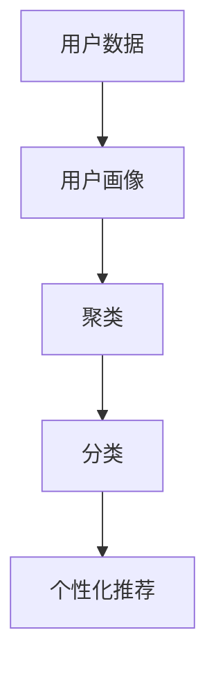

                 

# 程序员如何进行知识付费的用户细分

> 关键词：知识付费, 用户细分, 数据科学, 数据分析, 机器学习, 用户行为分析, 推荐系统

## 1. 背景介绍

### 1.1 问题由来

随着互联网的普及和数字经济的崛起，知识付费市场迅速崛起，成为新常态。从在线课程、电子书、远程咨询到短视频等形式，知识付费产品和服务日益丰富，满足了用户日益增长的知识需求。然而，知识付费市场鱼龙混杂，用户流失率高，难以获得稳定收入。

知识付费平台如何精准定位用户，有效识别其需求，提升用户体验和满意度，成为亟需解决的问题。用户细分是实现这一目标的重要手段，通过将用户群体细分为不同的特征集合，针对性地提供个性化的内容和推荐，从而提升转化率和用户粘性。

### 1.2 问题核心关键点

进行知识付费用户细分的关键在于：
1. 收集和整合用户数据，构建用户画像。
2. 应用数据分析和机器学习技术，对用户进行分类和聚类。
3. 根据不同用户群体特点，定制个性化推荐方案。
4. 评估细分策略的效果，持续优化。

## 2. 核心概念与联系

### 2.1 核心概念概述

为了更好地理解知识付费用户细分，本节将介绍几个关键概念：

- 用户细分(User Segmentation)：将用户按照某些特征划分成不同的子群体，以便针对性地进行产品设计、推广和优化。
- 用户画像(User Persona)：基于用户行为数据和属性，构建详细的用户特征模型。
- 聚类(Clustering)：通过算法将相似的用户分为同一类，形成多个用户群体的过程。
- 分类(Classification)：将用户根据标签或属性进行分类，提升推荐的准确性。
- 个性化推荐系统：根据用户特征，推荐用户可能感兴趣的内容。

这些概念之间的联系可以用以下Mermaid流程图来表示：



该流程图展示了用户数据如何通过用户画像构建、聚类分析、分类建模和个性化推荐，最终形成完整的用户细分和推荐流程。

## 3. 核心算法原理 & 具体操作步骤
### 3.1 算法原理概述

知识付费用户细分主要涉及数据分析、聚类和分类等算法技术。其核心思想是通过对用户行为数据和属性数据进行分析，利用聚类和分类算法，将用户划分为不同的子群体，并根据不同群体特征提供个性化推荐，以提升用户体验和满意度。

具体步骤如下：
1. 数据收集：从用户注册、登录、购买行为、阅读时长、点击路径、评论等行为数据中收集用户信息。
2. 用户画像构建：基于收集到的数据，使用统计分析或机器学习算法，构建用户画像。
3. 聚类分析：通过聚类算法，将用户画像相似的用户划分为同一类别。
4. 分类建模：通过分类算法，为不同类别用户打上特定标签，如初级、中级、高级用户。
5. 推荐系统定制：针对不同用户群体，定制个性化推荐策略，提升用户转化率和满意度。

### 3.2 算法步骤详解

**Step 1: 数据收集和预处理**
- 收集用户行为数据：从知识付费平台收集用户的注册、登录、购买行为、阅读时长、点击路径、评论等数据。
- 数据清洗和处理：去除重复、异常数据，填补缺失值，标准化数据格式。
- 特征提取：从收集到的数据中提取用户特征，如购买频率、学习时长、热门课程、购买金额等。

**Step 2: 用户画像构建**
- 统计分析：通过统计方法，如平均值、中位数、标准差等，对用户特征进行初步分析，得到用户基础画像。
- 机器学习：使用监督学习算法，如随机森林、逻辑回归等，对用户特征进行建模，得到用户高级画像。
- 可视化展示：将用户画像可视化，展示用户基本信息和特征分布，便于理解用户行为和偏好。

**Step 3: 聚类分析**
- 选择合适的聚类算法：如K-means、层次聚类、DBSCAN等，根据用户特征将用户分为若干类别。
- 确定聚类数量：通过肘部法则、轮廓系数等方法，确定最佳聚类数量。
- 评估聚类效果：使用轮廓系数、Calinski-Harabasz指数等指标，评估聚类质量。

**Step 4: 分类建模**
- 选择合适的分类算法：如决策树、支持向量机、神经网络等，根据用户特征进行分类。
- 训练和验证模型：使用训练集训练分类模型，使用验证集评估模型性能。
- 调整和优化模型：根据验证集结果调整模型参数，优化模型效果。

**Step 5: 个性化推荐系统定制**
- 推荐算法选择：如协同过滤、基于内容的推荐、混合推荐等，根据不同用户群体的特征选择适合的推荐算法。
- 个性化推荐定制：根据用户特征，定制推荐方案，如课程推荐、学习路径推荐等。
- 评估和优化推荐效果：使用A/B测试等方法，评估推荐效果，持续优化推荐算法。

### 3.3 算法优缺点

知识付费用户细分的算法技术具有以下优点：
1. 个性化推荐：根据用户特征，提供个性化推荐，提升用户体验和满意度。
2. 用户分类：通过聚类和分类算法，精准识别不同用户群体，针对性地进行产品和营销。
3. 持续优化：通过数据驱动，持续优化推荐算法和用户画像，提升推荐效果和用户粘性。

同时，也存在一些局限性：
1. 数据隐私：用户行为数据涉及个人隐私，数据收集和使用需遵循法律法规。
2. 算法复杂：聚类和分类算法复杂，算法选择和调参需具备专业技能。
3. 用户流失：用户行为数据和特征多样，用户细分和推荐效果难以保证。
4. 动态变化：用户需求和行为随时间变化，需持续监测和更新用户画像和推荐策略。

## 4. 数学模型和公式 & 详细讲解 & 举例说明
### 4.1 数学模型构建

知识付费用户细分的数学模型主要包括以下几部分：

- **用户特征建模**：将用户行为数据和属性数据转化为数值特征。
- **聚类算法建模**：选择合适的聚类算法，如K-means、层次聚类等，将用户分为若干类别。
- **分类算法建模**：选择合适的分类算法，如逻辑回归、决策树等，对用户进行分类。
- **推荐算法建模**：选择合适的推荐算法，如协同过滤、基于内容的推荐等，对用户进行推荐。

### 4.2 公式推导过程

以K-means聚类算法为例，推导聚类中心点的更新公式。

K-means聚类算法的基本步骤如下：
1. 随机初始化聚类中心点。
2. 对于每个样本点 $x_i$，计算其与每个聚类中心点的距离 $d(x_i,k)$，将其划分到距离最近的聚类 $k$。
3. 根据当前聚类 $k$ 中的所有样本点 $x$，重新计算聚类中心点 $c_k$。
4. 重复步骤2和3，直至聚类中心点不再变化或达到预设迭代次数。

具体地，聚类中心点的更新公式为：

$$
c_k = \frac{1}{|C_k|} \sum_{x_i \in C_k} x_i
$$

其中 $C_k$ 表示当前聚类 $k$ 中的样本点集合，$|C_k|$ 表示集合的大小。

### 4.3 案例分析与讲解

假设某知识付费平台收集了用户注册、购买行为、阅读时长、点击路径等数据，构建用户画像并进行聚类和分类。

首先，从数据中提取用户特征，如购买频率、学习时长、热门课程等，进行初步统计分析，得到用户基础画像。

接着，使用K-means聚类算法将用户分为若干类别，假设得到3个类别，分别为初级用户、中级用户、高级用户。

最后，根据不同类别用户的特点，定制个性化推荐策略。例如，对于初级用户，推荐入门级别的课程；对于中级用户，推荐进阶课程；对于高级用户，推荐深度学习、人工智能等高阶课程。

## 5. 项目实践：代码实例和详细解释说明
### 5.1 开发环境搭建

在进行知识付费用户细分时，需要使用Python进行数据分析和机器学习建模。以下是开发环境搭建流程：

1. 安装Python：从官网下载并安装Python，建议使用Python 3.6及以上版本。
2. 安装数据分析库：如Pandas、NumPy等，用于数据预处理和分析。
3. 安装机器学习库：如Scikit-learn、TensorFlow等，用于构建用户画像和推荐模型。
4. 安装可视化工具：如Matplotlib、Seaborn等，用于数据可视化和展示。

### 5.2 源代码详细实现

以下以用户聚类为例，展示K-means聚类算法的Python代码实现：

```python
from sklearn.cluster import KMeans
import pandas as pd
import numpy as np

# 读取用户数据
data = pd.read_csv('user_data.csv')

# 数据预处理：去除重复和异常数据，填补缺失值，标准化数据格式
data = data.drop_duplicates().dropna().apply(lambda x: x if pd.notnull(x) else 0)
data = (data - data.mean()) / data.std()

# 特征提取：从用户数据中提取用户特征，如购买频率、学习时长、热门课程等
features = data[['purchase_frequency', 'study_time', 'popular_courses']]

# 聚类分析：使用K-means算法对用户进行聚类
kmeans = KMeans(n_clusters=3, random_state=0)
kmeans.fit(features)

# 输出聚类结果
labels = kmeans.labels_
print(labels)
```

### 5.3 代码解读与分析

**用户数据读取和预处理**：
- 使用Pandas库读取用户数据，并进行数据清洗和处理。
- 数据预处理包括去除重复和异常数据，填补缺失值，标准化数据格式，以便后续建模。

**特征提取**：
- 从用户数据中提取关键特征，如购买频率、学习时长、热门课程等，以便聚类分析。

**聚类分析**：
- 使用K-means算法，将用户分为3个类别。
- 通过设置`n_clusters`参数，指定聚类数量为3。
- 使用`random_state`参数，确保结果的可复现性。

**输出聚类结果**：
- 通过`labels`变量，获取每个用户所属的聚类类别。
- 输出聚类结果，便于后续分析和推荐。

## 6. 实际应用场景
### 6.1 智能推荐系统

智能推荐系统是知识付费平台的核心功能之一，通过用户细分，可以更精准地进行个性化推荐。

以某知识付费平台为例，平台收集用户的学习行为数据，构建用户画像并进行聚类分析，将用户分为初级、中级、高级三个群体。针对不同用户群体，定制不同的推荐策略：

- 初级用户：推荐入门级别的课程，如Python基础、数据科学入门等。
- 中级用户：推荐进阶课程，如Python高级应用、机器学习基础等。
- 高级用户：推荐深度学习、人工智能等高阶课程。

通过个性化推荐，用户能够获得更符合自身需求的学习内容，提升学习体验和满意度。

### 6.2 用户画像构建

用户画像构建是知识付费平台的重要环节，通过聚类分析，可以更全面地了解用户行为和偏好。

以某知识付费平台为例，平台收集用户的学习行为数据，构建用户画像并进行聚类分析，将用户分为以下几个群体：

- 学习频率低用户：每周学习时长少于5小时，建议增加学习频率，推荐简单易懂的入门课程。
- 学习频率高用户：每周学习时长超过15小时，建议增加课程难度，推荐深度学习、人工智能等高阶课程。
- 课程偏好用户：偏好某一类课程，如Python、数据科学等，推荐相关课程。

通过用户画像构建，平台能够更好地了解用户需求，进行精准营销和产品优化。

### 6.3 用户行为分析

用户行为分析是知识付费平台的重要工具，通过数据分析，可以更深入地了解用户行为和需求。

以某知识付费平台为例，平台收集用户的学习行为数据，进行行为分析：

- 用户活跃时间：分析用户学习的高峰时间，调整内容发布策略。
- 用户兴趣偏好：分析用户喜欢的课程类型和主题，推荐相关课程。
- 用户流失原因：分析用户流失的原因，提升用户留存率。

通过用户行为分析，平台能够更好地优化用户体验，提升用户满意度和忠诚度。

### 6.4 未来应用展望

随着知识付费市场的持续发展，用户细分技术将迎来更多应用场景：

1. 个性化推荐系统：通过用户细分，提升推荐效果和用户满意度，成为知识付费平台的核心竞争力。
2. 精准营销：通过用户细分，进行精准营销和广告投放，提升平台收入。
3. 用户行为分析：通过用户细分，深入了解用户行为和需求，优化产品和服务。
4. 知识图谱构建：通过用户细分，构建知识图谱，提升知识搜索和推荐效果。

## 7. 工具和资源推荐
### 7.1 学习资源推荐

为了帮助开发者系统掌握知识付费用户细分技术，这里推荐一些优质的学习资源：

1. 《Python数据分析与可视化》书籍：详细介绍Python数据分析和可视化技术，是入门学习的好资料。
2. 《机器学习实战》书籍：介绍了机器学习的基本算法和技术，适合深入学习。
3. Coursera《机器学习》课程：由斯坦福大学开设，涵盖机器学习的基本概念和经典算法。
4 在线Kaggle平台：提供海量数据集和竞赛，适合实践和锻炼。
5 知乎专栏《数据科学》：提供大量数据科学和机器学习技术文章，适合持续学习。

通过对这些资源的学习实践，相信你一定能够快速掌握知识付费用户细分的精髓，并用于解决实际的NLP问题。

### 7.2 开发工具推荐

高效的开发离不开优秀的工具支持。以下是几款用于知识付费用户细分开发的常用工具：

1. Jupyter Notebook：开源的Jupyter Notebook环境，支持Python代码和可视化，适合数据分析和建模。
2. Visual Studio Code：功能强大的代码编辑器，支持多种编程语言和数据可视化工具。
3. Tableau：流行的数据可视化工具，适合数据探索和展示。
4. Plotly：基于Web的可视化工具，支持交互式可视化，适合数据分析和报告。
5. Python环境：如Anaconda、Miniconda等，方便安装和管理Python依赖库。

合理利用这些工具，可以显著提升知识付费用户细分的开发效率，加快创新迭代的步伐。

### 7.3 相关论文推荐

知识付费用户细分技术的发展源于学界的持续研究。以下是几篇奠基性的相关论文，推荐阅读：

1. 《用户行为分析：基于聚类分析的用户细分》：研究如何将用户分为不同群体，提升用户体验。
2. 《基于分类算法的用户画像构建》：探讨如何通过分类算法，构建详细的用户画像。
3. 《个性化推荐系统：协同过滤与内容推荐》：介绍协同过滤和内容推荐算法，提升推荐效果。
4. 《深度学习在知识付费用户推荐中的应用》：研究如何使用深度学习技术，提升个性化推荐效果。
5. 《用户行为分析与聚类：基于机器学习的方法》：介绍如何使用机器学习技术，分析用户行为和需求。

这些论文代表了大语言模型微调技术的发展脉络。通过学习这些前沿成果，可以帮助研究者把握学科前进方向，激发更多的创新灵感。

## 8. 总结：未来发展趋势与挑战

### 8.1 总结

本文对知识付费用户细分的核心技术进行了全面系统的介绍。首先阐述了用户细分的背景和重要性，明确了微调在精准定位用户、提升用户体验和满意度方面的独特价值。其次，从原理到实践，详细讲解了聚类和分类算法的数学原理和具体步骤，给出了用户细分的完整代码实例。同时，本文还广泛探讨了用户细分的应用场景，展示了用户细分的广阔前景。

通过本文的系统梳理，可以看到，知识付费用户细分技术正在成为知识付费平台的核心竞争力，极大地提升了平台的收入和用户满意度。未来，伴随数据科学和机器学习技术的不断进步，用户细分技术也将迎来更多创新和突破。

### 8.2 未来发展趋势

展望未来，知识付费用户细分技术将呈现以下几个发展趋势：

1. 自动化和智能化：通过自动化算法，实时分析用户行为和需求，提升推荐效果和用户满意度。
2. 跨平台集成：将用户画像和推荐系统集成到各个平台，提升用户体验和粘性。
3. 多维度融合：结合多种数据源和算法，构建更加全面、准确的用户画像。
4. 实时动态调整：根据用户行为变化，实时调整推荐策略，提升推荐效果。
5. 多模态融合：结合文本、图像、语音等多模态数据，提升推荐效果和用户体验。

这些趋势凸显了用户细分技术的广阔前景。这些方向的探索发展，必将进一步提升知识付费平台的性能和应用范围，为知识付费用户带来更好的服务体验。

### 8.3 面临的挑战

尽管知识付费用户细分技术已经取得了瞩目成就，但在迈向更加智能化、普适化应用的过程中，它仍面临着诸多挑战：

1. 数据隐私：用户行为数据涉及个人隐私，数据收集和使用需遵循法律法规。
2. 算法复杂：聚类和分类算法复杂，算法选择和调参需具备专业技能。
3. 用户流失：用户行为数据和特征多样，用户细分和推荐效果难以保证。
4. 动态变化：用户需求和行为随时间变化，需持续监测和更新用户画像和推荐策略。

## 9. 附录：常见问题与解答

**Q1：知识付费平台如何进行用户细分？**

A: 知识付费平台进行用户细分的步骤如下：
1. 收集和整合用户数据，构建用户画像。
2. 应用数据分析和机器学习技术，对用户进行分类和聚类。
3. 根据不同用户群体特点，定制个性化推荐方案。
4. 评估细分策略的效果，持续优化。

**Q2：用户细分的关键技术有哪些？**

A: 用户细分的关键技术包括：
1. 数据分析：使用统计方法和机器学习算法，对用户数据进行建模和分析。
2. 聚类算法：将用户分为不同的类别，如K-means、层次聚类等。
3. 分类算法：对用户进行分类，如逻辑回归、决策树等。
4. 个性化推荐系统：根据用户特征，推荐用户可能感兴趣的内容。

**Q3：如何进行数据预处理？**

A: 数据预处理的步骤包括：
1. 去除重复和异常数据。
2. 填补缺失值。
3. 标准化数据格式。
4. 特征提取。

**Q4：如何进行用户画像构建？**

A: 用户画像构建的步骤包括：
1. 统计分析用户数据，得到用户基础画像。
2. 使用机器学习算法，建模用户高级画像。
3. 可视化展示用户画像，便于理解。

**Q5：如何进行个性化推荐？**

A: 个性化推荐的步骤包括：
1. 选择合适的推荐算法，如协同过滤、基于内容的推荐等。
2. 根据用户特征，定制推荐方案。
3. 评估和优化推荐效果。

---

作者：禅与计算机程序设计艺术 / Zen and the Art of Computer Programming

