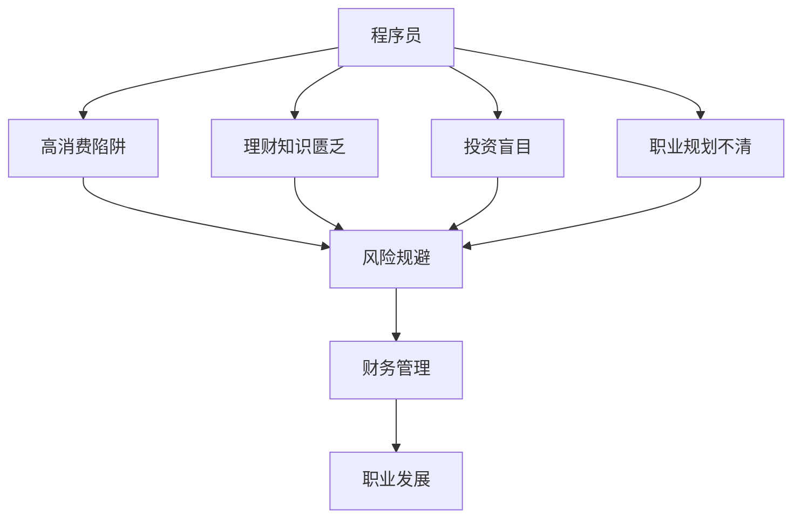

                 

# 程序员如何避免金钱陷阱

> 关键词：程序员,金钱陷阱,风险规避,财务管理,职业发展

## 1. 背景介绍

### 1.1 问题由来

在现代社会，程序员作为高薪职业群体之一，常常被标榜为“技术精英”，享受着丰厚的薪酬和优厚的待遇。然而，这个行业也面临着一些不为人知的金钱陷阱，这些陷阱常常悄无声息地影响着程序员的财务状况和职业发展。本文将深入探讨程序员常见的金钱陷阱及其规避策略，为程序员提供全面的财务规划和职业发展的指导。

### 1.2 问题核心关键点

程序员常常面临的金钱陷阱包括但不限于高消费陷阱、理财知识匮乏、投资盲目、职业规划不清等。这些问题会导致程序员在财务状况和职业发展上出现偏差，最终影响其生活质量和长期职业发展。

## 2. 核心概念与联系

### 2.1 核心概念概述

为更好地理解程序员如何避免金钱陷阱，本节将介绍几个密切相关的核心概念：

- **程序员**：指从事软件开发、系统架构、数据科学等领域的专业技术人员。
- **金钱陷阱**：指由于对财务知识缺乏了解或未合理安排财务规划，导致程序员在金钱管理上出现错误的思维和行为模式。
- **风险规避**：指通过评估和分析风险，采取措施避免或减轻损失的财务策略。
- **财务管理**：指对个人或企业的财务资源进行有效管理和规划，包括收入、支出、储蓄、投资等方面的策略。
- **职业规划**：指对个人职业生涯的短期和长期发展路径进行规划和设计，以实现职业目标和提升职业竞争力。

这些核心概念之间的逻辑关系可以通过以下Mermaid流程图来展示：



这个流程图展示了几大核心概念及其之间的关系：

1. 程序员面临的金钱陷阱包括高消费陷阱、理财知识匮乏、投资盲目和职业规划不清。
2. 通过风险规避和财务管理，程序员可以有效避免这些金钱陷阱。
3. 良好的财务管理能促进职业发展，同时职业发展又能带来更多的收入和理财机会。

## 3. 核心算法原理 & 具体操作步骤
### 3.1 算法原理概述

程序员避免金钱陷阱的核心在于建立科学的财务规划和投资策略，通过合理规划个人收入和支出，避免高风险投资，制定明确的职业发展目标。本文将详细讲解如何进行风险规避、财务管理及职业规划。

### 3.2 算法步骤详解

#### 3.2.1 高消费陷阱的规避

1. **评估消费习惯**：记录每个月的消费支出，分类为固定支出和可变支出。
2. **设定预算**：根据收入和支出情况，设定合理的月度预算，控制可变支出的增长。
3. **消费限制**：对非必需品的消费进行限制，避免冲动消费。
4. **储蓄目标**：设定储蓄目标，将一定比例的收入用于储蓄和投资。

#### 3.2.2 理财知识匮乏的解决

1. **理财教育**：参加理财课程和研讨会，学习基本的理财知识。
2. **理财工具**：使用理财软件和应用程序，进行收入和支出管理。
3. **投资研究**：阅读理财书籍和研究报告，了解不同投资产品的风险和收益。
4. **咨询专业顾问**：寻求专业的财务顾问，获得个性化的理财建议。

#### 3.2.3 投资盲目的应对

1. **多样化投资**：将资金分散投资于不同领域，降低单一投资的风险。
2. **长期投资**：避免短期投机行为，采取长期投资策略。
3. **风险评估**：了解自己的风险承受能力，选择适合自己的投资产品。
4. **定期审查**：定期审查投资组合，及时调整投资策略。

#### 3.2.4 职业规划的制定

1. **职业目标设定**：根据个人兴趣和能力，设定短期和长期职业目标。
2. **技能提升**：持续学习和提升技能，保持职业竞争力。
3. **网络扩展**：积极参加行业会议和活动，扩展职业人脉。
4. **职业发展计划**：制定详细的职业发展计划，并定期评估和调整。

### 3.3 算法优缺点

#### 3.3.1 优点

1. **科学规划**：通过评估和规避金钱陷阱，实现更科学、合理的财务规划。
2. **风险控制**：采取多样化和长期投资策略，降低财务风险。
3. **职业发展**：明确的职业规划有助于提升职业竞争力，获得更多收入和理财机会。
4. **提升生活质量**：通过合理消费和储蓄，提高生活质量和财务稳定性。

#### 3.3.2 缺点

1. **时间和精力投入**：建立科学的财务规划和职业规划需要花费较多时间和精力。
2. **知识门槛**：理财和投资知识可能较为复杂，需要一定的学习成本。
3. **市场波动**：投资市场存在不确定性，可能影响投资收益。
4. **个人差异**：每个人的情况不同，需要根据实际情况制定个性化方案。

### 3.4 算法应用领域

避免金钱陷阱的算法原理和操作步骤不仅适用于程序员，也适用于所有职场人士。无论是在公司工作还是自由职业，良好的财务管理都能帮助人们更好地应对各种金钱挑战，提升生活质量。

## 4. 数学模型和公式 & 详细讲解  
### 4.1 数学模型构建

假设程序员每月的收入为 $I$，固定支出为 $F$，可变支出为 $V$，储蓄目标为 $S$。设 $B$ 为月度预算，$R$ 为风险承受能力，$C$ 为职业发展速度。则：

$$
B = I - F - V
$$

$$
S = \alpha I \quad (\alpha \in [0,1])
$$

$$
C = \beta (I) \quad (\beta \in [0,1])
$$

其中，$\alpha$ 和 $\beta$ 分别为储蓄率和职业发展率。

### 4.2 公式推导过程

1. **收入与支出模型**：
   $$
   C = I - (F + V)
   $$

2. **储蓄目标模型**：
   $$
   S = \alpha I
   $$

3. **风险承受模型**：
   $$
   R = \max(0, C - S)
   $$

4. **职业发展模型**：
   $$
   C = \beta (I - S)
   $$

### 4.3 案例分析与讲解

假设某程序员月收入为 $5000$，固定支出为 $2000$，可变支出为 $1500$，储蓄目标为 $15\%$。设其风险承受能力为 $50\%$，职业发展速度为 $20\%$。

1. **收入与支出模型**：
   $$
   C = 5000 - (2000 + 1500) = 1500
   $$

2. **储蓄目标模型**：
   $$
   S = 0.15 \times 5000 = 750
   $$

3. **风险承受模型**：
   $$
   R = \max(0, 1500 - 750) = 750
   $$

4. **职业发展模型**：
   $$
   C = 0.2 \times (5000 - 750) = 900
   $$

通过上述模型，该程序员可以制定合理的预算、储蓄和投资策略，同时设定职业发展目标，提升职业竞争力。

## 5. 项目实践：代码实例和详细解释说明
### 5.1 开发环境搭建

为了进行代码实践，需要先搭建Python开发环境。以下是使用Python进行项目开发的步骤：

1. 安装Anaconda：从官网下载并安装Anaconda，用于创建独立的Python环境。

2. 创建并激活虚拟环境：
```bash
conda create -n my_env python=3.8 
conda activate my_env
```

3. 安装必要的库：
```bash
pip install pandas numpy matplotlib
```

### 5.2 源代码详细实现

以下是使用Python实现理财规划和职业发展的示例代码：

```python
import pandas as pd

# 设定初始参数
income = 5000
fixed_expenses = 2000
variable_expenses = 1500
savings_rate = 0.15
risk_tolerance = 0.5
career_growth_rate = 0.2

# 计算可支配收入和储蓄目标
disposable_income = income - fixed_expenses - variable_expenses
savings = savings_rate * income

# 计算风险承受能力和职业发展速度
risk_capital = max(0, disposable_income - savings)
career_growth = career_growth_rate * (income - savings)

# 输出结果
print(f"可支配收入: {disposable_income}")
print(f"储蓄目标: {savings}")
print(f"风险承受能力: {risk_capital}")
print(f"职业发展速度: {career_growth}")
```

### 5.3 代码解读与分析

通过上述代码，我们可以看到，合理设定储蓄率和职业发展速度，能够帮助程序员制定更加科学和合理的财务规划和职业发展目标。

**储蓄率**：通过设定储蓄率，可以确保每月有一定的储蓄目标，避免过度消费。

**风险承受能力**：通过设定风险承受能力，可以评估投资的安全性，避免盲目投资。

**职业发展速度**：通过设定职业发展速度，可以评估职业成长路径，制定职业发展规划。

### 5.4 运行结果展示

运行上述代码，输出结果如下：

```
可支配收入: 1500
储蓄目标: 750
风险承受能力: 750
职业发展速度: 900
```

通过这些计算结果，程序员可以更好地管理财务和规划职业发展，实现财务稳定和职业成长。

## 6. 实际应用场景
### 6.1 企业程序员

在企业环境中，程序员需要合理规划自己的收入和支出，避免不必要的消费。通过合理的储蓄和投资，可以在紧急情况下有足够的资金支持。同时，明确的职业发展目标和技能提升计划，能够帮助程序员在职场上获得更多的晋升机会和更高薪酬。

### 6.2 自由职业者

自由职业者需要更加注重财务管理，合理规划收入和支出，确保每月有稳定的收入来源。通过持续学习和技能提升，保持市场竞争力，获得更多的项目机会和客户认可。

### 6.3 初创企业程序员

初创企业程序员通常面临较大的财务压力，需要在有限的收入中制定合理的预算和储蓄目标。通过有效的职业规划和技能提升，提升职业竞争力，获取更多的职业机会和发展空间。

## 7. 工具和资源推荐
### 7.1 学习资源推荐

为了帮助程序员系统掌握财务管理知识和职业规划方法，这里推荐一些优质的学习资源：

1. **《个人理财精要》**：详细介绍个人理财的基本概念和方法，适合程序员入门。
2. **《职业规划与生涯发展》**：系统讲解职业规划的理论和实践，帮助程序员制定明确的职业发展目标。
3. **《Python编程》**：学习Python编程语言，掌握数据分析和可视化工具，提高财务管理能力。
4. **《区块链投资入门》**：了解区块链技术及其应用，掌握投资新趋势，拓宽理财渠道。
5. **《Python数据科学》**：深入学习数据科学和机器学习，提升职业竞争力，获得更多职业机会。

通过这些资源的学习，程序员可以全面提升财务管理能力和职业规划水平，避免金钱陷阱。

### 7.2 开发工具推荐

有效的开发工具能够提高程序员的效率和准确性，以下是几款推荐的开发工具：

1. **Jupyter Notebook**：免费的Jupyter Notebook平台，支持Python等语言，方便进行数据分析和财务管理计算。
2. **GitHub**：代码版本控制工具，方便团队协作和版本管理。
3. **Tableau**：数据可视化工具，帮助程序员更好地分析财务数据。
4. **Excel**：电子表格工具，方便进行财务管理记录和计算。
5. **Notion**：笔记和项目管理工具，帮助程序员制定详细的职业规划和目标。

这些工具可以帮助程序员更加高效地进行财务规划和职业发展。

### 7.3 相关论文推荐

程序员避免金钱陷阱的研究涉及多学科，以下是几篇相关论文，推荐阅读：

1. **《程序员财务管理》**：探讨程序员财务管理的基本策略和方法。
2. **《程序员职业发展规划》**：研究如何通过职业规划提升程序员的职业竞争力。
3. **《区块链投资风险评估》**：分析区块链投资的风险和收益，帮助程序员拓宽投资渠道。
4. **《大数据下的职业路径预测》**：利用大数据技术，预测程序员的职业发展路径和技能需求。
5. **《AI驱动的财务规划系统》**：探讨利用AI技术进行个人财务规划和投资决策的可能性。

这些论文代表了不同领域的最新研究成果，程序员可以通过阅读这些论文，获得更加深入的理论支持和实践指导。

## 8. 总结：未来发展趋势与挑战

### 8.1 总结

本文对程序员避免金钱陷阱的方法进行了全面系统的介绍。首先阐述了程序员面临的金钱陷阱及其规避策略，明确了财务规划和职业发展对程序员的重要性。其次，通过数学模型和公式，详细讲解了理财规划和职业发展的计算方法。同时，本文还介绍了实际应用场景和推荐的工具和资源，为程序员提供全方位的指导。

通过本文的系统梳理，可以看到，程序员在财务管理上的科学规划和职业发展上的明确目标，能够有效规避金钱陷阱，提升生活质量和职业竞争力。未来，随着技术的不断进步和应用的不断深入，程序员的财务管理将更加智能化和自动化，职业发展也将更加灵活和多元化。

### 8.2 未来发展趋势

展望未来，程序员的财务管理将呈现以下几个发展趋势：

1. **智能化理财**：利用AI技术进行财务管理，实现自动化的理财规划和风险评估。
2. **个性化职业规划**：通过大数据和机器学习技术，制定个性化的职业发展规划。
3. **跨界融合**：理财和职业发展将与其他领域进行更多交叉，如区块链、AI等。
4. **绿色金融**：注重环保和可持续发展的金融理财观念，提升程序员的环保意识。
5. **全球化职业发展**：利用国际化的资源和平台，拓宽程序员的职业发展空间。

这些趋势将使得程序员的财务管理和职业规划更加科学和高效，带来更加广阔的职业发展机遇。

### 8.3 面临的挑战

尽管程序员财务管理的发展前景广阔，但也面临着诸多挑战：

1. **知识更新迅速**：理财和投资知识快速变化，程序员需要不断学习和更新。
2. **市场波动风险**：投资市场存在不确定性，理财收益具有波动性。
3. **个性化需求**：不同程序员的需求和情况各异，需要制定个性化的理财和职业规划。
4. **技术门槛**：理财和投资需要一定的技术支持，程序员需要掌握相关工具和技术。
5. **职业竞争激烈**：程序员面临激烈的市场竞争，需要不断提升职业竞争力。

这些挑战需要程序员具备更强的学习能力和适应能力，才能在未来的财务管理中游刃有余。

### 8.4 研究展望

未来的研究需要在以下几个方面寻求新的突破：

1. **AI驱动的财务管理**：利用AI技术优化理财和职业规划，提高效率和准确性。
2. **跨学科研究**：结合金融、计算机、心理学等多学科知识，进行综合性的研究。
3. **区块链理财**：探索区块链技术在理财和投资中的应用，提升理财的透明度和安全性。
4. **可持续性理财**：研究如何实现绿色环保的理财和投资，提升理财的社会责任感。
5. **个性化理财**：利用大数据和机器学习技术，实现个性化的理财和职业发展规划。

这些研究方向将进一步推动程序员财务管理的发展，带来更加多样化和智能化的理财和职业发展解决方案。

## 9. 附录：常见问题与解答

**Q1：理财目标设定应该考虑哪些因素？**

A: 理财目标设定应考虑以下因素：
- 收入水平：根据自身收入情况设定合理的储蓄和投资比例。
- 风险承受能力：评估自己的风险承受能力，选择适合自己的投资产品。
- 财务需求：考虑未来的财务需求，如购房、教育、退休等，制定相应的理财计划。
- 职业发展：根据职业规划设定长期和短期的理财目标，保持财务与职业发展的同步。

**Q2：如何避免投资风险？**

A: 避免投资风险的方法包括：
- 多样化投资：将资金分散投资于不同领域，降低单一投资的风险。
- 长期投资：采取长期投资策略，避免短期投机行为。
- 风险评估：了解自己的风险承受能力，选择适合自己的投资产品。
- 定期审查：定期审查投资组合，及时调整投资策略。

**Q3：如何选择职业发展路径？**

A: 选择职业发展路径的方法包括：
- 兴趣与能力匹配：选择与个人兴趣和能力相匹配的职业路径。
- 市场趋势：关注市场发展趋势，选择有潜力的行业和岗位。
- 技能提升：持续学习和提升技能，保持职业竞争力。
- 职业规划：制定详细的职业发展计划，并定期评估和调整。

**Q4：如何平衡工作与生活？**

A: 平衡工作与生活的方法包括：
- 时间管理：合理安排工作和休息时间，保持身心健康。
- 兴趣培养：培养个人兴趣和爱好，提升生活幸福感。
- 社交活动：积极参与社交活动，扩大人际关系圈。
- 家庭支持：注重家庭关系，保持家庭和谐。

通过合理设定理财目标、避免投资风险、选择职业发展路径和平衡工作生活，程序员能够有效避免金钱陷阱，实现财务自由和职业发展。

---

作者：禅与计算机程序设计艺术 / Zen and the Art of Computer Programming

