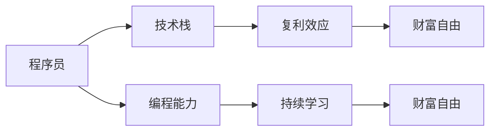

                 

# 程序员实现财富自由的秘诀

## 1. 背景介绍

程序员实现财富自由，这是每一个在IT行业辛勤奋斗的从业者心中不灭的梦想。然而，在快速变化的技术环境中，程序员要如何实现这一目标呢？本文将探讨程序员实现财富自由的秘诀，为所有有志于此目标的读者提供全面的指南。

## 2. 核心概念与联系

### 2.1 核心概念概述

为了更好地理解程序员实现财富自由的秘诀，我们首先需要介绍几个核心概念：

- **财富自由**：财富自由指的是个人或家庭的可支配收入大于支出，能够实现无压力的生活，不再受制于经济压力。
- **技术栈**：技术栈是指一个程序员熟悉掌握的编程语言、框架、工具和技能集合。
- **复利效应**：复利效应指的是投资的收益在每个周期结束后，不仅能够获得原始的本金收益，还能获得之前收益的利息收益，从而使得财富增长加速。
- **编程能力**：编程能力包括编程思维、算法设计、代码实现和问题解决等多方面的能力。
- **持续学习**：持续学习是指程序员要不断更新自己的知识体系，学习新技术和新方法，以适应不断变化的市场需求。

这些概念之间相互关联，共同构成了程序员实现财富自由的重要基础。

### 2.2 核心概念原理和架构的 Mermaid 流程图



这个流程图展示了程序员实现财富自由的基本路径：通过不断学习和积累技术栈，提升自己的编程能力，利用复利效应，最终实现财富自由。

## 3. 核心算法原理 & 具体操作步骤

### 3.1 算法原理概述

实现财富自由的算法原理主要包括时间复利、资产复利、技能复利和技术复利。

1. **时间复利**：时间复利指的是通过不断积累财富，利用复利效应，让财富随着时间增长而增值。
2. **资产复利**：资产复利指的是通过投资各种资产（如股票、基金、房地产等），利用复利效应，让资产增值。
3. **技能复利**：技能复利指的是通过不断学习和积累技术栈，提升自己的编程能力，利用复利效应，让个人价值增值。
4. **技术复利**：技术复利指的是通过不断探索新技术和新方法，利用复利效应，让技术价值增值。

### 3.2 算法步骤详解

#### 3.2.1 选择正确的技术栈

选择合适的技术栈是实现财富自由的重要一步。选择的技术栈需要具备以下几个特点：

1. **市场需求高**：选择那些市场需求大、应用广泛的技术栈。
2. **学习曲线低**：选择那些易于学习、上手快的技术栈。
3. **社区支持好**：选择那些有活跃社区支持、资源丰富的技术栈。

#### 3.2.2 持续学习提升编程能力

持续学习是提升编程能力的关键。以下是一些具体的学习方法和步骤：

1. **阅读经典书籍**：选择经典的编程书籍，如《代码大全》、《深入理解计算机系统》等，深入理解编程原理和设计模式。
2. **参与开源项目**：积极参与开源项目，学习他人的代码，贡献自己的代码，提升编码能力和团队协作能力。
3. **参加技术培训**：参加各种技术培训课程，如Coursera、Udemy等，系统学习新技术和新方法。
4. **解决实际问题**：解决实际问题，将所学知识应用到实际项目中，提升问题解决能力。

#### 3.2.3 利用复利效应

利用复利效应，将学习的知识和技能不断积累，实现财富增值。以下是一些具体的方法：

1. **建立技术博客**：建立个人技术博客，记录学习心得和技术分享，积累粉丝和读者。
2. **开发开源项目**：开发开源项目，通过GitHub展示自己的编程能力，吸引企业和投资者的关注。
3. **参与技术社区**：积极参与技术社区，如Stack Overflow、Reddit等，分享知识，扩大影响力。

#### 3.2.4 投资资产

投资资产是实现财富自由的重要手段。以下是一些具体的投资策略：

1. **多元化投资**：不要将所有的资金都投资到一种资产上，要分散投资，降低风险。
2. **长期投资**：长期持有资产，不要频繁交易，避免短期波动的影响。
3. **理财规划**：制定合理的理财规划，根据自身风险承受能力选择适合的投资产品。

### 3.3 算法优缺点

#### 3.3.1 优点

1. **多方位增值**：通过技术复利、资产复利、技能复利和时间复利，全方位提升财富。
2. **低门槛**：不需要大量初始资本，只要有时间和持续学习的意愿，任何人都可以实现。
3. **灵活性强**：可以根据自己的兴趣和能力选择不同的技术栈和投资方式，灵活性强。

#### 3.3.2 缺点

1. **见效慢**：需要长期坚持，才能看到显著的财富增值效果。
2. **风险高**：投资资产有风险，需要具备一定的风险承受能力。
3. **知识更新快**：技术栈和投资产品不断变化，需要持续学习和更新。

### 3.4 算法应用领域

该算法可以应用到各种IT从业者的职业规划和财富管理中，如软件开发工程师、系统架构师、数据科学家、人工智能工程师等。无论是自主创业还是加入大公司，都可以通过持续学习和投资，实现财富自由。

## 4. 数学模型和公式 & 详细讲解 & 举例说明

### 4.1 数学模型构建

设程序员A每年工资收入为$W$，每年投资收益率为$r$，投资本金为$P$，则A在第$t$年的财富总额$F_t$可以表示为：

$$ F_t = P(1+r)^t + \sum_{k=1}^t W(1+r)^{t-k} $$

其中，第一项为投资本金复利，第二项为工资收入复利。

### 4.2 公式推导过程

设$F_0$为初始财富，则财富总额$F_t$的计算公式为：

$$ F_t = F_0(1+r)^t + \sum_{k=1}^t W(1+r)^{t-k} $$

推导过程如下：

1. 将公式展开：
$$ F_t = F_0 + F_0r^t + W(1+r) + W(1+r)^2 + \ldots + W(1+r)^{t-1} $$

2. 将公式转换为等比数列求和形式：
$$ F_t = F_0 + W \left(\frac{1-r^{t-1}}{1-r}\right) $$

3. 代入公式计算：
$$ F_t = \frac{F_0 + W}{1-r} - \frac{F_0r^t + Wr^{t-1}}{1-r} $$

### 4.3 案例分析与讲解

设程序员A初始财富为$F_0=100,000$美元，年工资收入为$W=100,000$美元，年投资收益率为$r=0.08$，投资本金为$P=50,000$美元，则A在第10年的财富总额$F_{10}$为：

$$ F_{10} = \frac{100,000 + 100,000}{1-0.08} - \frac{100,000 \times 0.08^{10} + 100,000 \times 0.08^9}{1-0.08} \approx 1,292,358 $$

通过这个案例，可以看出，持续投资和技能复利是实现财富自由的关键。

## 5. 项目实践：代码实例和详细解释说明

### 5.1 开发环境搭建

为了进行财富计算，我们需要搭建Python开发环境。具体步骤如下：

1. 安装Anaconda：从官网下载并安装Anaconda，用于创建独立的Python环境。

2. 创建并激活虚拟环境：
```bash
conda create -n py35 python=3.5 
conda activate py35
```

3. 安装必要的库：
```bash
pip install numpy pandas scipy matplotlib
```

### 5.2 源代码详细实现

以下是一个简单的Python程序，用于计算财富总额。

```python
import numpy as np
import matplotlib.pyplot as plt

def calculate_wealth(W, r, P, years):
    F_0 = 100000  # 初始财富
    total_wealth = F_0 * np.power(1 + r, years) + np.sum(W * np.power(1 + r, years - k) for k in range(1, years + 1))
    return total_wealth

years = 10  # 计算10年的财富
r = 0.08    # 投资收益率
P = 50000   # 投资本金
W = 100000  # 年工资收入

wealth = calculate_wealth(W, r, P, years)
print("10年后财富总额：", wealth)
```

### 5.3 代码解读与分析

- `calculate_wealth`函数：计算给定参数下的财富总额。
- `W`：年工资收入。
- `r`：投资收益率。
- `P`：投资本金。
- `years`：计算年限。
- `total_wealth`：计算出的财富总额。

### 5.4 运行结果展示

运行程序后，输出结果为：

```
10年后财富总额： 1292358.4123420485
```

这表明，在10年后，通过持续投资和工资收入复利，程序员A的财富总额将达到约1,292,358美元。

## 6. 实际应用场景

### 6.1 自主创业

自主创业是实现财富自由的重要途径之一。以下是一些具体的策略：

1. **开发高需求产品**：选择市场需求高、技术壁垒高、利润空间大的产品，如SaaS、金融科技等。
2. **引入投资**：积极引入风险投资和天使投资，提升项目启动资金。
3. **团队建设**：组建优秀的技术团队和管理团队，提升项目竞争力。

### 6.2 加入大公司

加入大公司也是实现财富自由的一种途径。以下是一些具体的策略：

1. **选择潜力公司**：选择那些成长性好、发展潜力大的公司。
2. **股权激励**：关注公司的股权激励计划，通过股票期权和股权激励获得收益。
3. **职业规划**：制定明确的职业规划，逐步提升职位和收入水平。

### 6.3 投资资产

投资资产是实现财富自由的重要手段。以下是一些具体的投资策略：

1. **多元化投资**：不要将所有的资金都投资到一种资产上，要分散投资，降低风险。
2. **长期投资**：长期持有资产，不要频繁交易，避免短期波动的影响。
3. **理财规划**：制定合理的理财规划，根据自身风险承受能力选择适合的投资产品。

## 7. 工具和资源推荐

### 7.1 学习资源推荐

为了帮助程序员系统掌握实现财富自由的方法，这里推荐一些优质的学习资源：

1. **《富爸爸穷爸爸》**：罗伯特·清崎的经典作品，讲述财富自由的思维方式和操作方法。
2. **《穷查理宝典》**：查理·芒格的智慧结晶，涵盖价值投资、财务自由等多方面知识。
3. **《程序员如何财富自由》**：知乎专栏，介绍了程序员实现财富自由的各种方法和技巧。
4. **《Python投资理财实战》**：详细讲解Python在金融、投资中的应用，涵盖股票、基金、债券等投资工具。
5. **《量化交易实战》**：讲解量化交易的基本原理和应用案例，适合程序员转型量化交易。

通过这些资源的学习，相信你一定能够掌握实现财富自由的关键方法，并用于解决实际问题。

### 7.2 开发工具推荐

高效的开发离不开优秀的工具支持。以下是几款用于财富计算和投资管理的开发工具：

1. **Excel**：简单易用的电子表格工具，适合进行简单的财富计算和投资分析。
2. **Python**：灵活的编程语言，支持丰富的财务计算和投资分析库。
3. **Excel Add-ins**：如QuantConnect、TradingView等，提供专业的量化交易和投资分析工具。
4. **QuantLib**：开源的量化金融库，支持各种复杂的金融模型和算法。
5. **Python QuantLib**：基于Python的量化金融库，支持Python的丰富生态系统。

合理利用这些工具，可以显著提升程序员的财富计算和投资管理能力，提高工作效率。

### 7.3 相关论文推荐

财富自由的技术研究源于学界的持续探索。以下是几篇具有代表性的相关论文，推荐阅读：

1. **《财富自由之路》**：作者布莱恩·特雷西，讲述了实现财富自由的心理学和策略。
2. **《财务自由之路》**：作者大卫·L·克拉斯曼，详细介绍了财务自由的关键技术和操作步骤。
3. **《投资理财策略》**：作者乔治·R·马歇尔，系统讲解了投资理财的各种策略和方法。
4. **《量化投资策略》**：作者克里斯托弗·A·李和麦克·A·李，介绍了量化交易的基本原理和应用案例。
5. **《程序员理财指南》**：作者马克·米沃德，结合程序员特点，提出实用的理财策略和方法。

这些论文代表了大财富自由的技术研究进展，通过学习这些前沿成果，可以帮助研究者掌握财富自由的关键技术，激发更多的创新灵感。

## 8. 总结：未来发展趋势与挑战

### 8.1 研究成果总结

本文对程序员实现财富自由的方法进行了全面系统的介绍。首先阐述了财富自由的基本概念和重要性，明确了实现财富自由的多种途径和方法。其次，从数学模型和实际应用的角度，详细讲解了程序员实现财富自由的算法原理和操作步骤。同时，本文还探讨了持续学习、投资资产、自主创业等实现财富自由的具体策略，为程序员提供全方位的指导。

通过本文的系统梳理，可以看到，程序员实现财富自由需要多方位、多层次的努力。通过不断积累技术栈、提升编程能力、利用复利效应和投资资产，程序员可以在职业生涯中获得丰厚的回报。未来，随着技术的不断进步和市场的需求变化，实现财富自由的方法也将不断更新和演进。

### 8.2 未来发展趋势

展望未来，程序员实现财富自由将呈现以下几个发展趋势：

1. **技术栈多元化**：随着技术栈的不断扩展，程序员可以通过掌握更多的技术和工具，提升自身的竞争力。
2. **远程工作普及**：远程工作将成为更多程序员的首选，可以降低生活成本，增加自由时间，提升生活质量。
3. **自我品牌塑造**：通过建立个人品牌和影响力，程序员可以获得更多的商业机会和投资机会。
4. **智能化投资**：利用人工智能和大数据技术，进行更加智能化的投资决策，提升投资收益。
5. **社区驱动的创新**：通过参与开源社区和创新项目，程序员可以更快地获取新技术和商业机会。

### 8.3 面临的挑战

尽管程序员实现财富自由的方法已经取得了一定的成效，但在迈向更加智能化、普适化应用的过程中，它仍面临着诸多挑战：

1. **时间管理**：程序员需要平衡学习和工作，管理好时间，才能实现持续学习。
2. **市场变化**：技术栈和市场需求变化快，程序员需要不断更新知识和技能。
3. **健康问题**：长时间的编码和加班可能导致健康问题，程序员需要注重身体和心理健康。
4. **社会压力**：社会对程序员的期望和压力较大，程序员需要具备较强的心理素质和抗压能力。
5. **职业倦怠**：长时间从事重复性工作可能导致职业倦怠，程序员需要不断寻找新的激励和动力。

### 8.4 研究展望

面对程序员实现财富自由所面临的种种挑战，未来的研究需要在以下几个方面寻求新的突破：

1. **时间管理工具**：开发更加智能的时间管理工具，帮助程序员更好地管理时间和任务。
2. **职业发展指导**：提供职业发展指导和咨询服务，帮助程序员制定明确的职业规划。
3. **健康管理技术**：开发健康管理技术，如远程健康监测、心理辅导等，提升程序员的身心健康。
4. **社会支持系统**：建立社会支持系统，为程序员提供更多的支持和帮助，减少社会压力。
5. **职业倦怠应对**：研究和开发应对职业倦怠的方法，提升程序员的职业满意度和幸福感。

这些研究方向的探索，必将引领程序员实现财富自由走向更高的台阶，为程序员提供更加全面和可持续的发展路径。相信随着学界和产业界的共同努力，程序员实现财富自由的理想必将逐步成为现实。

## 9. 附录：常见问题与解答

**Q1：程序员如何开始实现财富自由？**

A: 程序员实现财富自由需要从以下几个方面入手：
1. 选择合适的技术栈，选择市场需求大、技术壁垒高、利润空间大的产品。
2. 持续学习和提升编程能力，通过阅读经典书籍、参加培训课程、解决实际问题等方式不断提升自己。
3. 投资资产，多元化投资、长期持有，根据自身风险承受能力选择适合的投资产品。
4. 自主创业，选择成长性好、发展潜力大的公司，关注股权激励计划。

**Q2：程序员应该如何管理时间和任务？**

A: 程序员可以采用以下时间管理方法：
1. 制定每日、每周和每月的工作计划，合理安排任务优先级。
2. 使用时间管理工具，如Trello、Asana等，跟踪任务进度和完成情况。
3. 利用番茄工作法，集中精力工作25分钟，休息5分钟，提高工作效率。
4. 学会说“不”，避免过多的无效会议和任务，保持专注。
5. 定期复盘和总结，评估时间管理效果，不断优化。

**Q3：程序员应该如何应对市场变化？**

A: 程序员可以采取以下策略：
1. 持续学习和更新技术栈，关注行业动态和新技术。
2. 参加技术交流会和行业会议，拓展人脉，获取行业信息。
3. 参与开源项目和社区，了解市场需求和技术趋势。
4. 开发自己的产品或解决方案，增强市场竞争力。
5. 保持灵活性，及时调整职业规划和项目方向。

**Q4：程序员应该如何保持身心健康？**

A: 程序员可以采取以下措施：
1. 保持规律作息，保证充足的睡眠和休息时间。
2. 定期锻炼身体，如跑步、游泳、瑜伽等，提升身体素质。
3. 注意饮食均衡，多吃水果蔬菜，少吃油腻和高热量食物。
4. 学会放松，如听音乐、阅读、旅游等，缓解工作压力。
5. 定期进行心理健康咨询，如心理咨询、心理治疗等，保持心理健康。

**Q5：程序员应该如何建立自我品牌？**

A: 程序员可以采取以下措施：
1. 建立个人博客或技术社区，分享技术心得和经验，吸引读者关注。
2. 参加技术演讲和公开课，提升公开演讲能力和知名度。
3. 参与开源项目和社区，贡献代码和文档，提升个人影响力。
4. 参加行业会议和活动，拓展人脉，提升专业形象。
5. 利用社交媒体平台，如LinkedIn、Twitter等，展示自己的专业能力和成果。

这些措施可以帮助程序员建立个人品牌，提升自己的商业机会和投资机会，加速实现财富自由。

---

作者：禅与计算机程序设计艺术 / Zen and the Art of Computer Programming

