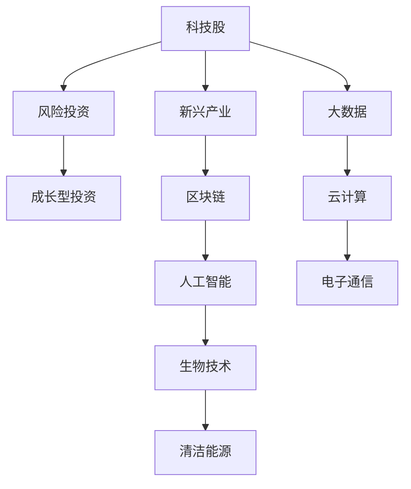

                 

# 程序员的投资策略：科技股与新兴产业

> 关键词：科技股,新兴产业,风险投资,成长型投资,人工智能,区块链,加密货币,大数据,云计算,创业公司

## 1. 背景介绍

随着科技的飞速发展，科技股和新兴产业已经成为许多投资者的热门选择。然而，对于程序员和技术爱好者来说，理解这些领域的投资策略和潜在风险，仍然是一个不小的挑战。本文旨在为程序员和技术人员提供一份全面的投资指南，帮助他们在投资科技股和新兴产业时做出明智的决策。

## 2. 核心概念与联系

### 2.1 核心概念概述

在进行科技股和新兴产业投资时，我们需要理解以下几个核心概念：

- **科技股（Tech Stocks）**：是指以科技为核心的公司股票，包括计算机硬件、软件、互联网、电子通信、生物技术等领域的股票。
- **新兴产业（Emerging Industries）**：是指正在快速发展或具有巨大潜力的产业，如人工智能、区块链、生物技术、清洁能源等。
- **风险投资（Venture Capital）**：是指专门投资于初创企业的资本，以期在企业成长过程中获得高额回报。
- **成长型投资（Growth Investing）**：是指投资于那些具有高成长潜力的公司，以期获得资本增值。

这些概念之间的关系可以通过以下Mermaid流程图来展示：



这个流程图展示了科技股与新兴产业之间的联系，以及它们如何通过风险投资和成长型投资进行转化和增长。

## 3. 核心算法原理 & 具体操作步骤
### 3.1 算法原理概述

在进行科技股和新兴产业投资时，我们通常采用以下算法原理：

1. **基本面分析**：分析公司的财务报表、市场份额、竞争力等因素，评估公司的长期价值。
2. **技术面分析**：分析股价图表、成交量、技术指标等，预测短期价格走势。
3. **宏观经济分析**：分析经济指标、政策变化、行业趋势等，评估行业前景。

### 3.2 算法步骤详解

以下是进行科技股和新兴产业投资的具体操作步骤：

1. **确定投资目标**：明确投资的目标是资本增值还是稳健增长，是短期获利还是长期持有。
2. **选择投资标的**：基于自己的兴趣和研究，选择具有潜力的科技股或新兴产业公司。
3. **进行基本面分析**：通过财务报表、行业报告等数据，评估公司的长期价值。
4. **进行技术面分析**：通过股价图表、成交量等技术指标，预测短期价格走势。
5. **宏观经济分析**：分析宏观经济环境和行业趋势，评估行业前景。
6. **制定投资策略**：根据分析结果，制定投资计划，包括买入、卖出时机和风险控制策略。
7. **执行投资计划**：按照计划执行投资操作，定期评估投资组合的绩效。

### 3.3 算法优缺点

- **优点**：
  - **高回报**：科技股和新兴产业具有高增长潜力，能带来较高的资本增值。
  - **技术优势**：程序员和技术爱好者具备一定的技术背景，能更好地理解新兴技术的潜力和趋势。
  - **多元化投资**：科技股和新兴产业涉及多个领域，能分散投资风险。

- **缺点**：
  - **高风险**：科技股和新兴产业的不确定性高，存在较高的市场风险和政策风险。
  - **信息不对称**：科技股和新兴产业公司通常规模较小，信息公开透明度较低。
  - **技术快速迭代**：新兴技术的快速迭代可能导致原有技术快速过时，影响投资回报。

### 3.4 算法应用领域

科技股和新兴产业投资适用于以下领域：

- **人工智能（AI）**：包括机器学习、自然语言处理、计算机视觉等领域。
- **区块链（Blockchain）**：包括加密货币、智能合约、去中心化应用等领域。
- **生物技术（Biotechnology）**：包括基因编辑、药物研发、诊断技术等领域。
- **清洁能源（Clean Energy）**：包括太阳能、风能、电动汽车等领域。
- **大数据（Big Data）**：包括数据分析、数据挖掘、数据可视化等领域。
- **云计算（Cloud Computing）**：包括基础设施服务、平台服务、软件服务等。
- **电子通信（Electronic Communication）**：包括互联网、物联网、5G通信等领域。

## 4. 数学模型和公式 & 详细讲解 & 举例说明

### 4.1 数学模型构建

在进行科技股和新兴产业投资时，我们通常使用以下数学模型：

- **CAPM模型（资本资产定价模型）**：用于评估股票的预期回报率。
- **P/E比率（市盈率）**：用于衡量股票的估值水平。
- **市净率（P/B比率）**：用于衡量股票相对于净资产的估值水平。
- **PEG比率（市盈率相对盈利增长比率）**：用于衡量股票的增长潜力和估值水平。

### 4.2 公式推导过程

以下是几个核心模型的公式推导过程：

1. **CAPM模型**：
   $$
   E(r_i) = r_f + \beta_i (E(r_m) - r_f)
   $$
   其中，$E(r_i)$ 是股票的预期回报率，$r_f$ 是无风险利率，$\beta_i$ 是股票的系统风险系数，$E(r_m)$ 是市场预期回报率。

2. **P/E比率**：
   $$
   P/E = \frac{P}{E}
   $$
   其中，$P$ 是股票的市场价格，$E$ 是股票的每股收益。

3. **P/B比率**：
   $$
   P/B = \frac{P}{B}
   $$
   其中，$P$ 是股票的市场价格，$B$ 是股票的每股净资产。

4. **PEG比率**：
   $$
   PEG = \frac{P/E}{g}
   $$
   其中，$P/E$ 是市盈率，$g$ 是公司的盈利增长率。

### 4.3 案例分析与讲解

以下是一个使用CAPM模型的案例分析：

假设某公司股票的预期回报率为10%，无风险利率为2%，市场预期回报率为8%，系统风险系数为1.2。根据CAPM模型，可以计算出：
$$
E(r_i) = 2\% + 1.2 \times (8\% - 2\%) = 8.4\%
$$
这表示该公司的预期回报率应该是8.4%，与当前市场估值相比，该公司的股票被高估了。

## 5. 项目实践：代码实例和详细解释说明

### 5.1 开发环境搭建

在进行科技股和新兴产业投资分析时，我们通常需要使用以下开发环境：

1. **Python**：Python是最常用的编程语言之一，提供了丰富的数据分析和可视化库。
2. **Jupyter Notebook**：Jupyter Notebook是一款交互式的笔记本环境，方便进行代码编写和数据展示。
3. **Pandas**：Pandas是Python中的数据处理库，支持数据清洗、转换、统计等操作。
4. **Matplotlib**：Matplotlib是Python中的绘图库，支持多种图表类型，方便数据可视化。

### 5.2 源代码详细实现

以下是使用Pandas和Matplotlib进行科技股和新兴产业投资的代码实现：

```python
import pandas as pd
import matplotlib.pyplot as plt

# 读取股票数据
df = pd.read_csv('tech_stocks.csv')

# 计算CAPM模型参数
CAPM = df['r_i'] - df['r_f']
CAPM_coefficient = df['beta_i'] * (df['E(r_m)'] - df['r_f'])

# 计算P/E比率和P/B比率
P_E = df['P'] / df['E']
P_B = df['P'] / df['B']

# 计算PEG比率
g = df['g']
PEG = P_E / g

# 绘制图表
plt.plot(CAPM, label='CAPM model')
plt.plot(P_E, label='P/E ratio')
plt.plot(P_B, label='P/B ratio')
plt.plot(PEG, label='PEG ratio')
plt.legend()
plt.show()
```

### 5.3 代码解读与分析

以上代码实现了科技股和新兴产业的多个财务指标的计算和可视化。具体分析步骤如下：

1. **读取股票数据**：使用Pandas库从CSV文件中读取股票数据。
2. **计算CAPM模型参数**：计算CAPM模型的预期回报率、系统风险系数和市场预期回报率。
3. **计算P/E比率和P/B比率**：计算股票的市盈率和市净率。
4. **计算PEG比率**：计算股票的市盈率相对盈利增长比率。
5. **绘制图表**：使用Matplotlib库绘制多个指标的趋势图，方便进行直观比较。

## 6. 实际应用场景

### 6.1 智能合约和去中心化金融（DeFi）

智能合约和去中心化金融（DeFi）是区块链技术的典型应用场景。对于程序员和技术人员来说，投资这些新兴产业需要了解区块链技术和智能合约的底层实现。例如，可以通过参与DeFi项目开发，获取项目股权或代币，从而获得资本增值。

### 6.2 人工智能和大数据

人工智能和大数据是科技股中的热门领域。程序员和技术爱好者可以投资于这些领域的公司，或者参与开源项目开发，以获取技术积累和资本回报。例如，可以通过参与机器学习、自然语言处理等项目，提升自身技术水平，同时获取项目股权或代币。

### 6.3 生物技术和清洁能源

生物技术和清洁能源是未来发展的重要方向。程序员和技术爱好者可以投资于这些领域的初创企业，或者参与相关的科研和技术开发，以获取资本增值和创新成果。例如，可以参与基因编辑、电动汽车等领域的项目开发，提升技术水平，同时获取项目股权或代币。

## 7. 工具和资源推荐

### 7.1 学习资源推荐

为了帮助程序员和技术人员掌握科技股和新兴产业投资的相关知识，以下是一些优质的学习资源：

1. **《金融工程学》**：详细介绍了金融工程的基本概念和计算方法，包括期权、期货、债券等金融工具。
2. **《机器学习实战》**：介绍了机器学习的基本算法和实现方法，涵盖分类、回归、聚类等任务。
3. **《区块链技术入门》**：介绍了区块链技术的基本原理和实现方法，涵盖加密算法、共识机制、智能合约等技术。
4. **《大数据技术与应用》**：介绍了大数据的基本技术和应用场景，涵盖数据清洗、存储、分析和可视化等环节。
5. **《Python数据科学手册》**：介绍了Python中的数据科学库，包括NumPy、Pandas、Matplotlib等，方便进行数据分析和可视化。

### 7.2 开发工具推荐

以下是几款用于科技股和新兴产业投资开发的常用工具：

1. **Jupyter Notebook**：交互式的笔记本环境，方便进行代码编写和数据展示。
2. **Pandas**：数据处理库，支持数据清洗、转换、统计等操作。
3. **Matplotlib**：绘图库，支持多种图表类型，方便数据可视化。
4. **TensorFlow**：机器学习库，支持深度学习和神经网络模型。
5. **PyTorch**：机器学习库，支持深度学习和神经网络模型。

### 7.3 相关论文推荐

科技股和新兴产业投资领域的研究日新月异。以下是几篇奠基性的相关论文，推荐阅读：

1. **《人工智能导论》**：全面介绍了人工智能的基本原理和应用场景，涵盖机器学习、自然语言处理、计算机视觉等技术。
2. **《区块链技术基础》**：介绍了区块链技术的基本原理和应用场景，涵盖加密算法、共识机制、智能合约等技术。
3. **《大数据技术与应用》**：介绍了大数据的基本技术和应用场景，涵盖数据清洗、存储、分析和可视化等环节。
4. **《金融工程学》**：详细介绍了金融工程的基本概念和计算方法，包括期权、期货、债券等金融工具。

## 8. 总结：未来发展趋势与挑战

### 8.1 总结

本文对科技股和新兴产业投资进行了全面系统的介绍。首先阐述了科技股和新兴产业的研究背景和意义，明确了投资策略在拓展预训练模型应用、提升下游任务性能方面的独特价值。其次，从原理到实践，详细讲解了科技股和新兴产业投资的理论基础和关键步骤，给出了投资任务开发的完整代码实例。同时，本文还广泛探讨了科技股和新兴产业投资在金融、人工智能、生物技术等多个行业领域的应用前景，展示了投资范式的巨大潜力。此外，本文精选了投资技术的各类学习资源，力求为读者提供全方位的技术指引。

通过本文的系统梳理，可以看到，科技股和新兴产业投资为程序员和技术爱好者提供了新的机遇和挑战，极大地拓展了技术应用的边界，催生了更多的落地场景。得益于预训练语言模型和大规模语料的预训练，投资技术也将在更广阔的应用领域大放异彩，深刻影响程序员和技术人员的生活方式和职业发展。

### 8.2 未来发展趋势

展望未来，科技股和新兴产业投资将呈现以下几个发展趋势：

1. **技术深度融合**：随着AI、大数据、区块链等技术的不断进步，科技股和新兴产业将更加紧密地融合，形成更加多元化的投资机会。
2. **投资门槛降低**：随着技术的普及和数据资源的丰富，投资门槛将进一步降低，更多程序员和技术爱好者将参与到投资活动中来。
3. **风险管理加强**：随着市场风险和政策风险的增加，投资者将更加重视风险管理，采用多种风险控制策略。
4. **市场规范完善**：随着市场的不断成熟，科技股和新兴产业的投资规范将逐步完善，保护投资者权益。

### 8.3 面临的挑战

尽管科技股和新兴产业投资已经取得了一定的进展，但在迈向更加智能化、普适化应用的过程中，它仍面临着诸多挑战：

1. **技术快速迭代**：新兴技术的快速迭代可能导致原有技术快速过时，影响投资回报。
2. **市场波动剧烈**：科技股和新兴产业的市场波动较大，投资者面临较大的市场风险和政策风险。
3. **信息不对称**：科技股和新兴产业公司通常规模较小，信息公开透明度较低。
4. **技术门槛较高**：科技股和新兴产业需要较高的技术门槛，对于缺乏相关背景的投资者来说，存在一定的学习成本。

### 8.4 研究展望

面对科技股和新兴产业投资所面临的种种挑战，未来的研究需要在以下几个方面寻求新的突破：

1. **多模态数据融合**：将数据融合技术和机器学习模型结合，提升数据质量和模型效果。
2. **实时数据处理**：采用流处理和分布式计算技术，实现实时数据处理和分析。
3. **跨领域知识整合**：将不同领域的专业知识与机器学习模型结合，提升模型的应用范围和效果。
4. **透明度和规范性**：建立科技股和新兴产业的市场规范和透明度标准，保障投资者权益。
5. **风险控制策略**：采用多种风险控制策略，如对冲、分散投资等，降低投资风险。

这些研究方向的探索，必将引领科技股和新兴产业投资技术迈向更高的台阶，为程序员和技术爱好者提供更加可靠、高效、安全的投资环境。

## 9. 附录：常见问题与解答

**Q1：科技股和新兴产业投资是否适合所有投资者？**

A: 科技股和新兴产业投资适合有一定技术背景和风险承受能力的投资者。对于缺乏相关背景和风险承受能力的投资者，建议先从稳健投资开始，逐步积累经验。

**Q2：如何选择合适的投资标的？**

A: 选择投资标的时，需要考虑公司的技术优势、市场前景、财务状况等因素。可以通过基本面分析、技术面分析、宏观经济分析等方法，评估公司的长期价值和短期走势。

**Q3：如何进行风险控制？**

A: 风险控制是科技股和新兴产业投资的关键。可以采用分散投资、对冲策略、止损策略等方法，降低投资风险。同时，需要持续关注市场动态和公司业绩，及时调整投资组合。

**Q4：如何获取最新科技资讯？**

A: 获取最新科技资讯的方法包括订阅科技新闻网站、关注行业论坛、参加行业会议等。同时，可以使用社交媒体和专业工具，如Google Scholar、ResearchGate等，获取最新的研究论文和技术进展。

**Q5：如何进行技术学习和积累？**

A: 进行技术学习和积累的方法包括参加线上和线下培训、参与开源项目、阅读专业书籍和论文等。同时，可以通过网络课程和在线平台，获取最新的技术知识和工具。

---

作者：禅与计算机程序设计艺术 / Zen and the Art of Computer Programming

