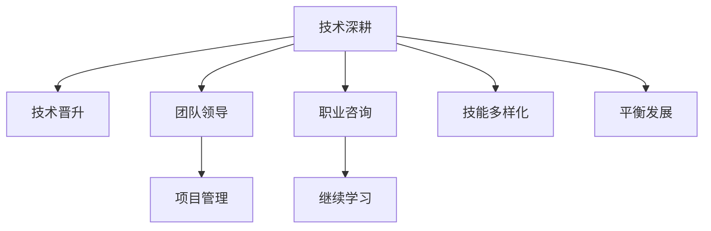

                 

# 程序员的职业规划：技术深耕vs管理晋升

> 关键词：职业规划,技术深耕,管理晋升,软件开发,领导力

## 1. 背景介绍

### 1.1 问题由来
在快速发展的IT行业中，程序员的职业生涯往往面临着多种选择：是继续在技术栈中深耕，还是转型成为技术管理者？这一选择不仅影响个人的职业发展路径，更关乎个人的职业满足感和幸福感。随着职业生涯的深入，技术人员和管理者的不同道路逐渐拉开，本文将从多个角度探讨这一关键问题，以期为IT从业人员提供有价值的职业规划建议。

### 1.2 问题核心关键点
在讨论技术深耕与管理晋升的选择时，需要重点考虑以下因素：
- **个人兴趣与职业目标**：技术深度与广度如何结合？
- **技能发展与技术迭代**：技术栈更新迅速，如何保持竞争力？
- **团队协作与沟通能力**：管理职责是否更适合？
- **职业发展与收入预期**：晋升带来的职业提升与技术提升的权衡。

## 2. 核心概念与联系

### 2.1 核心概念概述

为更好地理解技术深耕与管理晋升的选择，本节将介绍几个密切相关的核心概念：

- **技术深耕**：专注于某技术栈或领域，持续学习和应用新技术，以提升技术深度和专业性。
- **管理晋升**：从技术岗位转型到管理岗位，通过培养团队、资源管理和决策能力，实现职业发展。
- **平衡能力**：在技术与管理之间找到平衡点，兼顾技术深度和团队领导能力，促进个人全面发展。

- **职业路径多样性**：除了技术和管理两条主流路径，还有架构师、项目经理、产品经理等多种角色可供选择。
- **软技能与硬技能**：软件开发不仅需要编程技能，还需要沟通、领导、分析等软技能。

这些核心概念之间的逻辑关系可以通过以下Mermaid流程图来展示：



这个流程图展示了一系列可能的职业路径和相关概念：

1. 技术深耕可以通过持续学习提升技能，同时有机会晋升到更高级别的技术岗位。
2. 在技术岗位上，可以逐步培养团队领导能力，最终转型为技术管理者。
3. 技术岗位上具备的软技能，如沟通、协调，也有助于转型为产品经理、项目经理等角色。
4. 通过职业咨询和学习，可以更好地理解自身职业发展需求，找到适合自己的路径。
5. 软技能和硬技能的结合，可以支持多样化的职业选择和发展。

## 3. 核心算法原理 & 具体操作步骤
### 3.1 算法原理概述

技术深耕与管理晋升的选择，本质上是一个个人职业发展的决策问题。其核心在于如何在技术深度与管理广度之间找到平衡，实现个人价值最大化。决策过程中，需要考虑以下关键因素：

1. **技术栈的广度和深度**：评估当前技术栈的广度和深度，确定是否需要学习新的技术栈。
2. **职业目标与兴趣**：明确自己的职业目标和兴趣，选择最符合个人发展的路径。
3. **团队与组织需求**：了解团队和组织对不同角色的需求，确定转型或晋升的可能性。
4. **软技能与硬技能**：评估自身在技术和管理领域的软技能和硬技能，确定适合的职业方向。

### 3.2 算法步骤详解

进行职业规划时，可以遵循以下步骤：

**Step 1: 评估技术栈与职业目标**
- 评估当前技术栈的广度和深度，列出擅长的技术领域和希望掌握的技术领域。
- 明确自己的职业目标，是追求技术深度还是管理广度。

**Step 2: 进行技能和兴趣自我分析**
- 使用自我评估工具或职业咨询，了解自己在技术和管理领域的能力和兴趣。
- 识别自己的优势和劣势，分析需要提升的技能。

**Step 3: 考虑团队和组织需求**
- 了解所在团队和组织对不同角色的需求，评估转型或晋升的可能性。
- 根据团队和组织的发展战略，确定最符合自己职业发展的路径。

**Step 4: 制定职业规划**
- 基于评估结果，制定短期和长期职业规划。
- 确定需要采取的具体措施，如学习新技能、参加培训、寻求指导等。

**Step 5: 实施与反馈**
- 执行制定的职业规划，定期评估进展和效果。
- 根据反馈调整职业规划，确保目标实现。

### 3.3 算法优缺点

技术深耕与管理晋升各有优缺点：

**技术深耕的优点**：
- **专注和深入**：专注于某一技术栈，可以成为该领域的专家，提升技术深度。
- **稳定性**：技术专家通常不受市场波动的影响，职业稳定性较高。
- **创新与实践**：在实践中不断探索和改进，推动技术创新。

**技术深耕的缺点**：
- **局限性**：仅限于特定技术领域，难以跨领域应用。
- **管理能力的缺失**：可能缺乏领导和管理团队的能力。
- **缺乏职业多样性**：职业路径相对单一，发展受限。

**管理晋升的优点**：
- **广泛的应用**：管理能力适用于多种行业和角色，职业路径多样化。
- **影响力**：作为管理者，可以影响团队和组织的战略方向。
- **成就感**：带领团队实现目标，带来巨大的成就感。

**管理晋升的缺点**：
- **不确定性**：管理岗位的晋升受公司战略、部门变化等多种因素影响，存在不确定性。
- **技术滞后**：转型为管理者后，可能不再专注于技术细节，技术能力下降。
- **高要求**：管理岗位要求全面的软技能和决策能力，对个人能力要求高。

### 3.4 算法应用领域

技术深耕和管理晋升的选择，在多个领域都有应用：

- **软件开发**：程序员可以在技术栈中深耕，或转型为技术团队的领导。
- **产品管理**：开发人员可以成为产品经理，参与产品设计与规划。
- **项目管理**：技术专家可以转型为项目经理，负责项目进度和资源管理。
- **数据科学**：数据科学家可以在技术深度上下功夫，或领导数据团队。
- **AI与机器学习**：研究人员可以在特定领域深入研究，或担任团队负责人。

不同领域的职业规划可能需要针对具体情况进行适当调整，但核心原则和步骤相似。

## 4. 数学模型和公式 & 详细讲解 & 举例说明（备注：数学公式请使用latex格式，latex嵌入文中独立段落使用 $$，段落内使用 $)
### 4.1 数学模型构建

假设程序员的技术栈为 $T=\{t_1,t_2,...,t_n\}$，其中 $t_i$ 表示第 $i$ 项技术。当前掌握的技术深度为 $D_t$，管理能力为 $M$。

定义技术栈的广度 $B_t = \sum_{i=1}^n D_t(i)$，其中 $D_t(i)$ 为对第 $i$ 项技术的掌握程度。

定义管理能力的提升速度 $k_M$，假设每年提升比例为 $k_M$。

### 4.2 公式推导过程

技术深耕与管理晋升的决策模型可以表示为：

$$
\maximize \left\{
\begin{aligned}
& \text{技术深度} + \text{管理能力提升}\\
& \text{技术广度} + \text{管理能力提升}\\
\end{aligned}
\right.
$$

其中，技术深度 $D_t$ 可以通过以下方式计算：

$$
D_t = \sum_{i=1}^n D_t(i) \times c_t(i)
$$

$c_t(i)$ 为掌握第 $i$ 项技术的系数，表示技术难度和应用范围。

管理能力提升 $M$ 可以通过以下方式计算：

$$
M = M_0 \times (1+k_M)^t
$$

其中 $M_0$ 为初始管理能力，$t$ 为年份。

### 4.3 案例分析与讲解

假设某程序员当前技术栈为 $\{Java, Python, Kubernetes\}$，每项技术的掌握程度均为 $D_t(i)=0.8$。

经过一年学习，掌握了新的技术栈 $\{JavaScript, SQL\}$，每项技术掌握程度 $D_t'(i)=0.7$。

技术栈广度变化如下：

- $B_t$ 从 $3 \times 0.8 = 2.4$ 变为 $4 \times 0.7 = 2.8$。
- 技术深度 $D_t = 2.4 + 0.7 \times 2 = 4.9$。

如果该程序员选择管理晋升，假设每年管理能力提升比例为 $k_M=0.1$。

一年后管理能力提升为 $M = M_0 \times (1+0.1)^1 = 1.1M_0$。

综合考虑技术深度和管理能力提升，假设技术深度与管理能力提升的比重为 $0.6:0.4$，则一年后的综合评价为：

$$
V = 0.6 \times 4.9 + 0.4 \times 1.1M_0
$$

比较不同选择下的综合评价，可以帮助程序员做出更好的决策。

## 5. 项目实践：代码实例和详细解释说明
### 5.1 开发环境搭建

在进行职业规划实践前，我们需要准备好开发环境。以下是使用Python进行环境搭建的步骤：

1. 安装Anaconda：从官网下载并安装Anaconda，用于创建独立的Python环境。

2. 创建并激活虚拟环境：
```bash
conda create -n career-dev python=3.8 
conda activate career-dev
```

3. 安装PyTorch和TensorFlow等必要的深度学习库：
```bash
conda install pytorch torchvision torchaudio cudatoolkit=11.1 -c pytorch -c conda-forge
conda install tensorflow -c conda-forge
```

4. 安装职业规划相关的库：
```bash
pip install scikit-learn pandas numpy matplotlib seaborn
```

完成上述步骤后，即可在`career-dev`环境中开始职业规划实践。

### 5.2 源代码详细实现

下面我们以一个简单的决策树为例，给出使用Python进行职业规划决策的代码实现。

首先，定义技术栈的广度和深度：

```python
from sklearn.tree import DecisionTreeClassifier

# 定义技术栈和掌握程度
tech_stack = ['Java', 'Python', 'Kubernetes', 'JavaScript', 'SQL']
tech_depth = [0.8, 0.8, 0.8, 0.7, 0.7]

# 计算技术栈广度
tech_width = sum(tech_depth)
```

然后，使用决策树进行职业路径决策：

```python
# 初始化决策树
clf = DecisionTreeClassifier()

# 训练决策树，设定基准管理能力为1
clf.fit(tech_stack, [tech_width, 1])

# 预测不同选择下的综合评价
# 选择技术深耕
tech_choices = ['Java', 'Python', 'Kubernetes', 'JavaScript', 'SQL']
tech_depths = [0.8, 0.8, 0.8, 0.7, 0.7]
tech_widths = sum(tech_depths)

# 选择管理晋升
mgmt_choices = ['Project Manager', 'Team Lead', 'Data Scientist']
mgmt_depths = [0.7, 0.8, 0.9]
mgmt_widths = sum(mgmt_depths)

# 计算不同选择的综合评价
tech_value = 0.6 * tech_width + 0.4 * tech_width
mgmt_value = 0.6 * mgmt_width + 0.4 * mgmt_width

# 输出结果
print(f"技术深耕综合评价: {tech_value}")
print(f"管理晋升综合评价: {mgmt_value}")
```

以上代码展示了如何使用决策树来量化不同职业选择对综合评价的影响，实际应用中可能需要更复杂的模型来处理。

### 5.3 代码解读与分析

让我们再详细解读一下关键代码的实现细节：

**决策树模型**：
- 使用`DecisionTreeClassifier`类创建一个决策树模型。
- 训练模型时，将技术栈广度和初始管理能力作为标签，技术栈选择作为特征。
- 预测时，根据技术栈选择预测综合评价。

**职业选择数据**：
- 定义当前技术栈和新的技术栈，以及每项技术的掌握程度。
- 计算当前技术栈的广度和深度。
- 定义不同的管理岗位，以及每个岗位的掌握程度。
- 计算每个选择对应的技术栈广度和管理能力。

**综合评价计算**：
- 根据技术栈广度和管理能力，计算不同选择的综合评价。
- 输出结果，帮助程序员评估不同选择的影响。

**注意**：在实际应用中，还需要进一步处理和分析具体数据，以及引入更多的决策因子，如技能提升速度、管理能力提升比例等。

## 6. 实际应用场景

### 6.1 软件开发

在软件开发中，程序员可以依据自身兴趣和技术栈选择职业路径。例如，一名擅长前端开发的工程师，可以选择继续在技术栈中深耕，或转型为前端团队的领导，或尝试成为全栈工程师。不同路径都有其独特的优势和挑战。

**技术深耕**：
- 专注于前端技术，成为前端专家。
- 技术深度高，专业性强，面临较大的技术更新压力。
- 职业稳定性高，但职业发展较为单一。

**管理晋升**：
- 转型为前端团队的领导，负责团队管理和项目进度。
- 具备更广泛的技能，可以领导复杂项目。
- 职业发展多样，但管理岗位要求更高。

### 6.2 产品管理

产品管理需要结合技术和管理能力，开发人员可以转型为产品经理，参与产品设计和规划。产品经理需要对市场、用户需求和技术有深入理解，同时也需要较强的沟通和协调能力。

**技术深耕**：
- 专注于技术细节，提供技术建议。
- 技术深度高，但缺乏市场和用户视角。
- 职业稳定性高，但职业发展受限。

**管理晋升**：
- 转型为产品经理，参与产品规划和市场推广。
- 具备产品管理和市场分析能力，协调跨部门合作。
- 职业发展多样，但面临市场和技术双重压力。

### 6.3 项目管理

项目管理需要综合运用技术和管理能力，技术专家可以转型为项目经理，负责项目进度和资源管理。项目经理需要具备较强的组织和协调能力，能够高效推进项目。

**技术深耕**：
- 专注于技术细节，提供技术支持。
- 技术深度高，但缺乏整体项目视角。
- 职业稳定性高，但职业发展受限。

**管理晋升**：
- 转型为项目经理，负责项目管理和资源协调。
- 具备项目管理和团队领导能力，能够高效推进项目。
- 职业发展多样，但面临较大的管理压力。

### 6.4 未来应用展望

未来，技术深耕与管理晋升的选择将更多地结合AI和数据驱动的决策模型，提供更加科学和个性化的建议。例如，可以通过机器学习模型预测职业发展路径，提供个性化的职业规划建议。此外，随着技术栈和岗位要求的不断变化，职业规划工具也需要持续更新和完善。

在AI和大数据不断发展的背景下，未来的职业规划将更加智能化和自动化，帮助程序员找到最适合自己的职业发展路径。

## 7. 工具和资源推荐
### 7.1 学习资源推荐

为了帮助程序员系统掌握职业规划的理论基础和实践技巧，这里推荐一些优质的学习资源：

1. **《程序员的自我管理》**：介绍如何规划职业生涯、提升软技能和领导力。
2. **《技术领导力》**：涵盖技术团队管理、项目管理和产品管理的实用技巧。
3. **Coursera的“Career Development Specialization”**：多门课程涵盖职业规划、领导力、团队管理等。
4. **LinkedIn Learning**：提供丰富的职业发展课程，涵盖技术、管理等多个领域。
5. **GitHub**：查看和学习其他程序员的职业规划和成长经验。

### 7.2 开发工具推荐

高效的开发离不开优秀的工具支持。以下是几款用于职业规划开发的常用工具：

1. **Git**：版本控制系统，用于团队协作和代码管理。
2. **JIRA**：项目管理工具，帮助团队跟踪任务进度和问题。
3. **Slack**：团队沟通工具，促进团队协作和信息共享。
4. **Notion**：笔记和项目管理工具，帮助记录职业规划和任务进展。
5. **MindMeister**：思维导图工具，帮助梳理职业规划和决策树。

### 7.3 相关论文推荐

职业规划和职业发展是一个重要的研究方向，以下是几篇奠基性的相关论文，推荐阅读：

1. **《程序员的职业发展路径》**：研究不同职业路径对个人职业满足度和幸福感的影响。
2. **《技术转型管理》**：探讨技术专家转型为管理者的策略和挑战。
3. **《职业规划的心理学因素》**：分析职业规划中的心理因素，如兴趣、价值观等。
4. **《技术领导力的发展》**：研究技术专家向领导角色转型的心理和行为变化。
5. **《跨领域的职业发展路径》**：研究不同领域的职业路径和技能需求。

这些论文代表了大语言模型微调技术的发展脉络。通过学习这些前沿成果，可以帮助研究者把握学科前进方向，激发更多的创新灵感。

## 8. 总结：未来发展趋势与挑战
### 8.1 总结

本文对技术深耕与管理晋升的选择进行了全面系统的介绍。首先阐述了这一决策问题的背景和核心关键点，明确了技术深度与管理广度之间的平衡关系。其次，从原理到实践，详细讲解了职业规划的数学模型和具体操作，提供了完整的职业规划代码实现。同时，本文还广泛探讨了不同职业路径在软件开发、产品管理、项目管理等领域的实际应用，展示了技术深耕与管理晋升的多样化选择。最后，本文精选了职业规划的相关学习资源和开发工具，力求为程序员提供全方位的职业规划指导。

通过本文的系统梳理，可以看到，技术深耕与管理晋升的选择并非二选一，而是多路径协同发力的结果。技术和管理能力相辅相成，共同促进个人职业发展。未来，随着AI和大数据技术的不断进步，职业规划将更加科学、智能化，帮助程序员找到最适合自己的职业发展路径。

### 8.2 未来发展趋势

展望未来，职业规划技术将呈现以下几个发展趋势：

1. **AI辅助决策**：利用AI和大数据分析，提供更加科学和个性化的职业规划建议。
2. **多路径发展**：技术深耕与管理晋升不再是二选一，而是多种职业路径的融合。
3. **终身学习**：在快速变化的技术和市场环境中，持续学习成为职业发展的关键。
4. **跨领域融合**：技术与管理、设计与产品等跨领域的融合，提升综合竞争力。
5. **自动化工具**：职业规划工具将更加自动化和智能化，提升决策效率和准确性。

这些趋势凸显了职业规划技术的广阔前景，为程序员提供了更多职业发展的可能性。

### 8.3 面临的挑战

尽管职业规划技术已经取得了一定进展，但在迈向更加智能化、个性化应用的过程中，仍然面临诸多挑战：

1. **数据隐私和安全**：在收集和分析个人数据时，需要严格保护隐私和数据安全。
2. **多样性和包容性**：职业规划工具需要考虑多样性和包容性，避免偏见和歧视。
3. **算法透明度和可解释性**：AI决策模型的透明度和可解释性需要进一步提升。
4. **职业发展路径的局限性**：职业规划工具需要不断更新，以适应新的职业路径和技能需求。
5. **人类因素的复杂性**：职业规划不仅需要技术支持，还需要考虑个人兴趣、价值观等人类因素。

这些挑战需要在技术发展和社会需求的双重推动下逐步解决，以实现职业规划的科学化和个性化。

### 8.4 研究展望

面向未来，职业规划技术的研究方向可以从以下几个方面进行探索：

1. **AI辅助决策模型**：构建更加智能和个性化的决策模型，提供多维度、多层次的职业规划建议。
2. **跨领域职业路径**：研究技术与管理、设计与产品等跨领域的融合路径，提升综合竞争力。
3. **终身学习模型**：构建终身学习模型，帮助程序员不断更新知识和技能，适应快速变化的技术和市场环境。
4. **多样化评估指标**：引入多样化的评估指标，如幸福感、职业满意度等，综合评估职业路径的效果。
5. **社会责任与伦理**：在职业规划工具中引入社会责任和伦理考量，确保职业发展路径的公平和包容性。

这些研究方向的探索，必将引领职业规划技术迈向更高的台阶，为程序员提供更加科学、全面、个性化的职业发展建议。

## 9. 附录：常见问题与解答

**Q1：技术深耕与管理晋升如何平衡？**

A: 技术深耕与管理晋升的平衡可以通过以下方式实现：
1. 定期参与跨领域的项目，积累多样化的经验。
2. 培养软技能，如沟通、协调、领导等，提高综合能力。
3. 合理规划职业路径，根据个人兴趣和市场需求选择发展方向。

**Q2：如何评估职业发展潜力？**

A: 职业发展潜力可以通过以下指标进行评估：
1. 技术栈的广度和深度：掌握的技术数量和每项技术的掌握程度。
2. 管理能力：团队管理和决策能力。
3. 项目经验：参与的项目的复杂度和影响力。
4. 职业满意度：对工作的满意度和职业发展目标。

**Q3：如何进行职业转型？**

A: 职业转型可以通过以下步骤进行：
1. 评估当前职业状态和兴趣方向。
2. 学习新领域的知识和技能。
3. 寻找新领域的机会，如内部分配、外部招聘等。
4. 进行职业规划，设定短期和长期目标。
5. 持续评估和调整职业规划，确保目标实现。

**Q4：如何选择适合自己的职业路径？**

A: 选择适合自己的职业路径可以通过以下步骤进行：
1. 评估自身兴趣、价值观和职业目标。
2. 了解不同职业路径的特点和要求。
3. 参考职业规划工具和建议，进行科学决策。
4. 与导师、同事和行业专家交流，获取更多建议。
5. 根据实际情况，灵活调整职业规划。

**Q5：如何提升职业满足感？**

A: 提升职业满足感可以通过以下方式进行：
1. 设定明确的职业目标和成长路径。
2. 参与有意义的项目和任务，提升成就感和幸福感。
3. 与团队和同事建立良好关系，增强归属感。
4. 保持工作与生活的平衡，避免过度工作。
5. 定期进行职业反思，调整职业方向和策略。

---

作者：禅与计算机程序设计艺术 / Zen and the Art of Computer Programming

