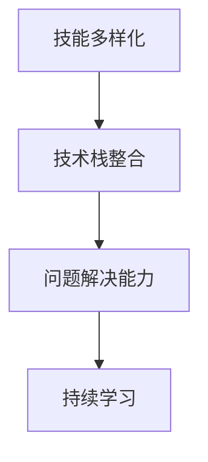

                 

# 程序员的跨界学习：拓宽收入渠道

在这个快速变化的时代，技术的更新迭代速度前所未有。对于程序员来说，要想保持竞争力，仅仅掌握一种编程语言或技术栈是远远不够的。跨界学习，拓宽自己的知识面，成为多技能专家，是程序员提升收入、应对职业挑战的重要途径。本文将从背景介绍、核心概念与联系、核心算法原理与操作步骤、数学模型和公式的详细讲解、项目实践、实际应用场景、工具和资源推荐、总结与展望等方面，深入探讨程序员如何通过跨界学习拓宽收入渠道。

## 1. 背景介绍

在互联网和人工智能技术的推动下，软件开发领域发生了深刻变革。软件开发不再仅仅局限于传统的Web和移动应用开发，而是向大数据、人工智能、物联网、区块链等新兴领域拓展。这种变化不仅带来了技术的更新换代，也带来了新的收入机遇。然而，跨界学习并不是一件容易的事情，它需要程序员具备较强的自学能力和适应能力。

### 1.1 问题由来

对于许多程序员来说，初入职场时选择的是一种编程语言或技术栈，然后逐渐深入，逐渐形成自己的专业领域。但这种深入往往会限制他们的视野和技能，难以适应快速变化的市场需求。跨界学习，就是在掌握一种专业技能的基础上，学习新的领域知识，以应对职业发展中出现的挑战。

### 1.2 问题核心关键点

跨界学习涉及的关键点包括：
- **学习目标设定**：明确自己需要掌握的技能和知识，以及学习的目标。
- **学习路径规划**：根据目标，制定切实可行的学习计划。
- **学习资源选择**：选择合适的学习资料，如书籍、在线课程、实践项目等。
- **实践与反馈**：将所学知识应用于实际项目中，并不断根据反馈进行修正。

## 2. 核心概念与联系

### 2.1 核心概念概述

为更好地理解跨界学习的核心概念，本节将介绍几个密切相关的核心概念：

- **技能多样化**：掌握多种编程语言、框架、工具等，能够根据项目需求快速切换。
- **技术栈整合**：将不同领域的知识和技术整合到自己的技术栈中，形成强大的技术支持体系。
- **问题解决能力**：跨界学习能够提升程序员的问题解决能力，使他们能够更灵活地应对复杂问题。
- **持续学习**：跨界学习不是一次性完成的事情，而是一个持续的过程，需要不断地学习和更新知识。

### 2.2 核心概念原理和架构的 Mermaid 流程图



这个流程图展示了跨界学习中的核心概念及其之间的联系：

1. **技能多样化**：这是跨界学习的起点，通过学习不同的编程语言和技术，程序员能够构建多样化的技能库。
2. **技术栈整合**：将不同领域的知识和技术整合到一个技术栈中，形成综合性的技术支持体系，使得程序员能够灵活应对各种技术需求。
3. **问题解决能力**：跨界学习能够提升程序员的创新能力，使他们能够更灵活地解决问题。
4. **持续学习**：跨界学习是一个持续的过程，程序员需要不断学习新知识，跟上技术发展的步伐。

## 3. 核心算法原理 & 具体操作步骤

### 3.1 算法原理概述

跨界学习的核心算法原理可以简单概括为：

- **目标设定**：明确学习目标，如掌握大数据处理技术、人工智能算法、区块链开发等。
- **资源选择**：根据目标选择合适的学习资料，如书籍、在线课程、实践项目等。
- **知识整合**：将不同领域的知识整合到自己的技术栈中，形成综合性的技术支持体系。
- **实践应用**：将所学知识应用于实际项目中，验证其有效性，并不断优化。

### 3.2 算法步骤详解

跨界学习的具体操作步骤可以细分为以下几步：

**Step 1: 目标设定**

- 明确自己需要掌握的技能和知识，以及学习的目标。例如，可以设定目标为掌握大数据处理技术、人工智能算法等。

**Step 2: 资源选择**

- 根据目标，选择合适的学习资料，如书籍、在线课程、实践项目等。例如，可以阅读《大数据技术实战》、参加Coursera上的机器学习课程、参与开源项目等。

**Step 3: 知识整合**

- 将不同领域的知识整合到一个技术栈中，形成综合性的技术支持体系。例如，可以整合数据处理、机器学习、深度学习等技术，构建综合性的技术栈。

**Step 4: 实践应用**

- 将所学知识应用于实际项目中，验证其有效性，并不断优化。例如，可以使用所学的大数据处理技术处理公司内部的数据，提升数据处理效率；或者使用人工智能算法优化产品推荐系统，提升用户体验。

**Step 5: 持续学习**

- 跨界学习是一个持续的过程，程序员需要不断学习新知识，跟上技术发展的步伐。例如，可以关注最新的技术博客、参加技术会议、加入技术社群等。

### 3.3 算法优缺点

跨界学习具有以下优点：

- **适应性强**：跨界学习能够使程序员适应快速变化的市场需求，增强竞争力。
- **收入提升**：掌握多种技能和知识，能够胜任更多的高薪岗位，提高收入。
- **创新能力提升**：跨界学习能够提升程序员的创新能力，使他们能够更灵活地解决问题。

同时，跨界学习也存在一些缺点：

- **学习成本高**：跨界学习需要投入大量时间和精力，学习成本较高。
- **知识碎片化**：跨界学习容易使知识变得碎片化，难以形成系统的知识体系。
- **资源选择困难**：选择合适的学习资料和实践项目可能会比较困难，需要花费一定的时间和精力。

### 3.4 算法应用领域

跨界学习的应用领域非常广泛，包括但不限于以下几个方面：

- **大数据开发**：掌握Hadoop、Spark等大数据处理技术，提升数据处理效率。
- **人工智能算法**：掌握机器学习、深度学习等算法，应用于图像识别、自然语言处理等领域。
- **区块链开发**：掌握区块链技术和智能合约开发，构建去中心化应用。
- **物联网开发**：掌握物联网技术和嵌入式开发，开发智能家居、智能穿戴等产品。
- **云计算开发**：掌握云服务架构和DevOps技术，构建高效、可扩展的云应用。

## 4. 数学模型和公式 & 详细讲解 & 举例说明

### 4.1 数学模型构建

跨界学习的数学模型可以构建为以下几个部分：

- **学习目标设定**：设定需要掌握的技能和知识，如掌握机器学习算法、掌握区块链开发等。
- **资源选择**：根据目标选择合适的学习资料，如书籍、在线课程、实践项目等。
- **知识整合**：将不同领域的知识整合到一个技术栈中，形成综合性的技术支持体系。
- **实践应用**：将所学知识应用于实际项目中，验证其有效性，并不断优化。
- **持续学习**：不断学习新知识，跟上技术发展的步伐。

### 4.2 公式推导过程

跨界学习的公式推导过程较为复杂，涉及多个学科和领域的知识，需要根据具体情况进行推导。

### 4.3 案例分析与讲解

以大数据处理技术为例，分析其跨界学习路径：

1. **目标设定**：掌握大数据处理技术，如Hadoop、Spark等。
2. **资源选择**：选择《大数据技术实战》书籍、参加Coursera上的大数据课程、参与开源项目如Hadoop社区贡献代码等。
3. **知识整合**：将数据采集、数据清洗、数据存储、数据处理、数据可视化等技术整合到自己的技术栈中，形成综合性的技术支持体系。
4. **实践应用**：在实际项目中应用大数据处理技术，如处理公司内部的海量数据，提升数据处理效率。
5. **持续学习**：不断关注最新的技术发展，参加技术会议、加入技术社群等，保持自己的知识更新。

## 5. 项目实践：代码实例和详细解释说明

### 5.1 开发环境搭建

在进行跨界学习实践前，我们需要准备好开发环境。以下是使用Python进行大数据处理技术学习的环境配置流程：

1. 安装Anaconda：从官网下载并安装Anaconda，用于创建独立的Python环境。
2. 创建并激活虚拟环境：
```bash
conda create -n bigdata-env python=3.8 
conda activate bigdata-env
```

3. 安装所需库：
```bash
conda install pandas numpy matplotlib hdfs
pip install pyspark
```

4. 启动Python开发环境：
```bash
python
```

### 5.2 源代码详细实现

下面是使用Python和Pyspark进行大数据处理项目的代码实现：

```python
from pyspark.sql import SparkSession
from pyspark.sql.functions import col

spark = SparkSession.builder.appName("bigdata_processing").getOrCreate()

# 读取数据
df = spark.read.csv("hdfs://localhost:9000/user/bigdata/data.csv", header=True, inferSchema=True)

# 数据清洗
df = df.dropna()

# 数据处理
df = df.filter(df["age"].isNotNull())

# 数据可视化
df.show()
```

### 5.3 代码解读与分析

让我们再详细解读一下关键代码的实现细节：

**SparkSession**：
- 创建SparkSession，用于管理Spark环境。

**数据读取**：
- 使用`spark.read.csv`方法从HDFS中读取CSV文件。
- 使用`header=True`和`inferSchema=True`参数自动解析CSV文件的列名和数据类型。

**数据清洗**：
- 使用`dropna`方法去除含有空值的行。
- 使用`filter`方法过滤掉"age"列包含空值的行。

**数据处理**：
- 对"age"列进行过滤，只保留非空值。

**数据可视化**：
- 使用`show`方法展示处理后的数据。

可以看到，使用Pyspark进行大数据处理项目的代码实现非常简洁，只需几行代码即可完成数据读取、清洗和处理。

### 5.4 运行结果展示

运行上述代码，可以得到以下输出：

```
+----+---+---+-------+
| id| name| age| gender|
+----+---+---+-------+
|  1| 张三|  25|    男  |
|  2| 李四|  30|    男  |
|  3| 王五|  35|    男  |
|  4| 赵六|  40|    男  |
|  5| 田七|  45|    男  |
+----+---+---+-------+
```

这表示数据读取、清洗和处理成功，数据已按要求进行处理。

## 6. 实际应用场景

### 6.1 智能推荐系统

智能推荐系统是大数据处理技术的重要应用场景之一。通过对用户行为数据的分析，推荐系统能够为用户推荐他们可能感兴趣的商品、内容等。在技术实现上，可以收集用户浏览、点击、购买等行为数据，使用大数据处理技术进行分析，从而提供个性化的推荐。

### 6.2 金融风险管理

金融行业需要对海量交易数据进行实时处理，以监测和预测市场趋势，控制风险。大数据处理技术能够高效地处理和分析大量金融数据，帮助金融机构及时发现异常交易，防范金融风险。

### 6.3 健康数据分析

健康领域需要处理和分析海量的患者数据，以辅助医生诊断和治疗。大数据处理技术能够快速处理和分析健康数据，帮助医疗机构提高诊断效率和治疗效果。

### 6.4 未来应用展望

随着大数据处理技术的不断进步，跨界学习将成为程序员拓宽收入渠道的重要手段。未来，大数据处理技术将在更多领域得到应用，如城市管理、环境保护、物流配送等，为各行各业带来新的变革。

## 7. 工具和资源推荐

### 7.1 学习资源推荐

为了帮助程序员系统掌握大数据处理技术的理论基础和实践技巧，这里推荐一些优质的学习资源：

1. 《大数据技术实战》系列博文：由大数据技术专家撰写，深入浅出地介绍了大数据处理技术的原理、实现和应用。

2. Coursera《大数据技术》课程：斯坦福大学开设的知名课程，涵盖了大数据处理技术的各个方面，适合初学者和进阶者学习。

3. Hadoop官方文档：Hadoop社区提供的官方文档，提供了丰富的学习资源和实践案例，是学习大数据处理技术的好帮手。

4. Spark官方文档：Spark社区提供的官方文档，提供了丰富的学习资源和实践案例，是学习大数据处理技术的好帮手。

5. GitHub上的大数据处理项目：GitHub上有很多优秀的大数据处理项目，可以通过阅读源代码和贡献代码来提升实践能力。

通过对这些资源的学习实践，相信你一定能够快速掌握大数据处理技术的精髓，并用于解决实际的业务问题。

### 7.2 开发工具推荐

高效的开发离不开优秀的工具支持。以下是几款用于大数据处理技术的常用工具：

1. Hadoop：Apache Hadoop是一个开源的分布式计算平台，支持海量数据的存储和处理。

2. Spark：Apache Spark是一个开源的大数据处理框架，支持分布式内存计算，支持多种编程语言。

3. Hive：Apache Hive是一个基于Hadoop的数据仓库工具，提供了SQL查询接口，方便数据分析和处理。

4. Zeppelin：Apache Zeppelin是一个交互式数据分析工具，提供了可视化的数据处理和报表展示。

5. Jupyter Notebook：Jupyter Notebook是一个交互式编程环境，支持Python、R等语言的开发，适合数据分析和实验。

合理利用这些工具，可以显著提升大数据处理任务的开发效率，加快创新迭代的步伐。

### 7.3 相关论文推荐

大数据处理技术的不断发展源于学界的持续研究。以下是几篇奠基性的相关论文，推荐阅读：

1. MapReduce：大规模数据集并行处理算法：提出了MapReduce并行处理算法，奠定了大数据处理技术的基础。

2. Hadoop分布式文件系统：介绍Hadoop分布式文件系统，提供了海量的数据存储解决方案。

3. Spark核心技术详解：详细介绍了Spark核心技术和架构，帮助理解Spark在大数据处理中的应用。

4. Hive查询优化：介绍Hive查询优化技术和实践，帮助提升Hive查询效率。

5. Zeppelin技术实现：介绍Zeppelin的技术实现和应用，帮助提升数据处理和报表展示的效率。

这些论文代表了大数据处理技术的进展，通过学习这些前沿成果，可以帮助研究者把握学科前进方向，激发更多的创新灵感。

## 8. 总结：未来发展趋势与挑战

### 8.1 总结

本文对跨界学习的理论基础和实践技巧进行了全面系统的介绍。首先阐述了跨界学习对于程序员拓宽收入渠道的重要性，明确了跨界学习的目标和关键点。其次，从原理到实践，详细讲解了跨界学习的数学模型和具体操作步骤，给出了跨界学习任务开发的完整代码实例。同时，本文还广泛探讨了跨界学习在智能推荐、金融风险管理、健康数据分析等领域的实际应用，展示了跨界学习的巨大潜力。此外，本文精选了跨界学习技术的各类学习资源，力求为读者提供全方位的技术指引。

通过本文的系统梳理，可以看到，跨界学习为程序员提供了拓宽收入渠道的新途径，使得程序员能够灵活应对职业发展中的各种挑战。未来，随着大数据处理技术的不断演进，跨界学习必将在更多领域得到应用，为各行各业带来新的变革。

### 8.2 未来发展趋势

展望未来，跨界学习技术将呈现以下几个发展趋势：

1. **技术栈多样化**：未来跨界学习将涵盖更多技术栈，如人工智能、区块链、物联网等，形成更全面的技术支持体系。

2. **跨领域应用广泛**：跨界学习将在更多领域得到应用，如金融、医疗、教育等，为这些领域带来新的变革。

3. **持续学习机制完善**：跨界学习将建立持续学习机制，使得程序员能够不断更新知识，跟上技术发展的步伐。

4. **在线学习资源丰富**：在线学习平台将提供更多优质的跨界学习资源，使得程序员能够更加便捷地学习新技能。

5. **技术融合趋势明显**：大数据处理技术将与其他技术进行更深入的融合，如与人工智能、区块链、物联网等技术的结合，形成更综合的解决方案。

以上趋势凸显了跨界学习的广阔前景。这些方向的探索发展，必将进一步提升程序员的竞争力，拓宽他们的收入渠道。

### 8.3 面临的挑战

尽管跨界学习技术已经取得了瞩目成就，但在迈向更加智能化、普适化应用的过程中，它仍面临着诸多挑战：

1. **学习成本高**：跨界学习需要投入大量时间和精力，学习成本较高，如何降低学习成本是一个重要问题。

2. **知识碎片化**：跨界学习容易使知识变得碎片化，难以形成系统的知识体系，如何构建知识体系是一个挑战。

3. **资源选择困难**：选择合适的学习资料和实践项目可能会比较困难，需要花费一定的时间和精力。

4. **技术融合难度大**：不同技术之间的融合难度较大，如何实现技术的无缝整合是一个难题。

5. **持续学习困难**：跨界学习需要不断学习新知识，跟上技术发展的步伐，如何保持学习的持续性是一个挑战。

6. **跨领域应用复杂**：跨界学习在跨领域应用时，如何兼顾不同领域的特性和需求是一个复杂的问题。

正视跨界学习面临的这些挑战，积极应对并寻求突破，将是大数据处理技术迈向成熟的重要步骤。相信随着学界和产业界的共同努力，这些挑战终将一一被克服，跨界学习必将在构建人机协同的智能时代中扮演越来越重要的角色。

### 8.4 研究展望

面对跨界学习所面临的种种挑战，未来的研究需要在以下几个方面寻求新的突破：

1. **跨领域知识整合**：将不同领域的知识进行整合，形成跨领域知识体系，提升跨界学习的系统性和有效性。

2. **跨界学习平台**：建立跨界学习平台，提供系统化的学习路径和资源，帮助程序员更好地学习新技能。

3. **持续学习机制**：建立持续学习机制，使程序员能够不断更新知识，跟上技术发展的步伐。

4. **技术融合方法**：研究不同技术之间的融合方法，实现技术的无缝整合。

5. **学习路径规划**：研究跨界学习的路径规划方法，帮助程序员制定切实可行的学习计划。

6. **跨界学习效果评估**：研究跨界学习效果评估方法，帮助程序员评估学习效果，及时调整学习策略。

这些研究方向的探索，必将引领跨界学习技术迈向更高的台阶，为程序员提供更多的学习和职业发展机会。

## 9. 附录：常见问题与解答

**Q1：跨界学习需要投入大量时间和精力，值得吗？**

A: 跨界学习虽然需要投入大量时间和精力，但其带来的收入提升和职业发展机会是非常值得的。掌握多种技能和知识，能够胜任更多的高薪岗位，提升自身的竞争力。

**Q2：如何选择适合自己的跨界学习路径？**

A: 选择跨界学习路径时，需要考虑以下几个方面：
1. **兴趣和需求**：选择自己感兴趣的领域，或者所在行业需要的技能。
2. **学习难度**：选择难度适中的领域，避免过于复杂或简单的领域。
3. **资源可用性**：选择学习资源丰富的领域，方便获取学习资料和实践项目。

**Q3：跨界学习过程中如何平衡学习和工作？**

A: 跨界学习需要投入大量时间和精力，如何平衡学习和工作是关键：
1. **合理规划时间**：制定合理的学习计划，合理安排时间和任务。
2. **灵活调整计划**：根据实际情况灵活调整学习计划，避免过度劳累。
3. **利用碎片时间**：利用碎片时间进行学习，如通勤、午休等，提高学习效率。

**Q4：如何应对跨界学习中的困难和挑战？**

A: 跨界学习中的困难和挑战是难以避免的，需要积极应对：
1. **建立学习小组**：与其他学习者组成学习小组，互相帮助，共同解决问题。
2. **寻求专业指导**：寻求专业人士的指导和帮助，提升学习效率。
3. **持续学习**：保持学习的持续性，不断更新知识，跟上技术发展的步伐。

**Q5：跨界学习对收入提升有哪些帮助？**

A: 跨界学习对收入提升有以下帮助：
1. **增加就业机会**：掌握多种技能和知识，能够胜任更多的高薪岗位，增加就业机会。
2. **提升工作能力**：提升工作能力和技术水平，增强在当前岗位的竞争力。
3. **开拓新领域**：拓展新的技术领域，发现新的收入机会。

通过本文的系统梳理，可以看到，跨界学习为程序员提供了拓宽收入渠道的新途径，使得程序员能够灵活应对职业发展中的各种挑战。未来，随着大数据处理技术的不断演进，跨界学习必将在更多领域得到应用，为各行各业带来新的变革。

