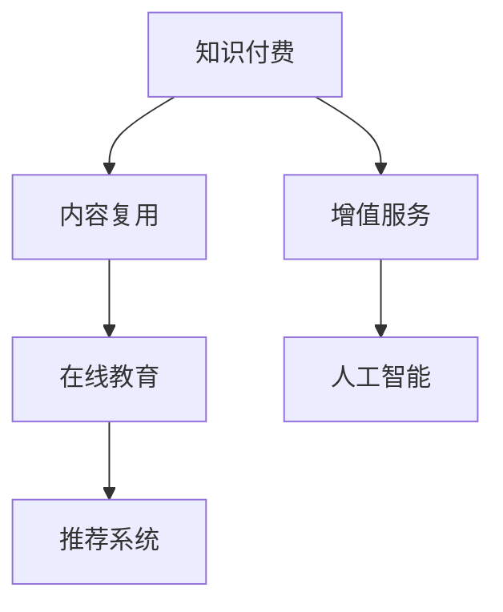

                 

# 程序员知识付费的内容复用与增值

> 关键词：知识付费, 内容复用, 增值服务, 在线教育, 人工智能

## 1. 背景介绍

### 1.1 问题由来
随着互联网的发展，知识付费正逐渐成为一种新的学习方式。程序员作为IT领域的重要群体，面对日新月异的行业变化，急需持续学习和提升技能。然而，传统的学习方式时间成本高、效率低，而且无法满足个性化学习需求。因此，利用人工智能和大数据技术，结合知识付费模式，提供更高效、个性化的知识服务，成为了一个新的方向。

本文将围绕程序员知识付费的内容复用与增值，从理论到实践，介绍一种基于AI的内容生成、推荐和推荐系统改进方法，实现知识的自动化复用与增值，探索未来在线教育的新范式。

## 2. 核心概念与联系

### 2.1 核心概念概述

为更好地理解本文内容，本节将介绍几个密切相关的核心概念：

- **知识付费**：指用户为获取专业知识、技能、经验等付费，获取高效、精准的学习资源，提升自身价值的过程。
- **内容复用**：指将已有内容或信息，通过修改、编辑、组合等手段，生成新的内容，以适应不同的学习需求。
- **增值服务**：指在现有内容基础上，通过个性化推荐、动态调整、知识集成等手段，提升内容的附加价值，满足不同学习者的深度学习需求。
- **在线教育**：指利用互联网技术，提供远程、灵活、个性化的教育服务，满足不同人群的学习需求。
- **人工智能**：指模拟人类智能行为，通过机器学习、自然语言处理、计算机视觉等技术，实现自主决策和高效信息处理的能力。
- **推荐系统**：指通过分析用户行为、偏好等数据，为用户推荐可能感兴趣的内容或产品，提升用户体验和满意度。

这些核心概念之间的逻辑关系可以通过以下Mermaid流程图来展示：



这个流程图展示了一系列概念的关联关系：

1. **知识付费**是驱动内容生产和消费的主要动力。
2. **内容复用**和**增值服务**基于已有知识，进行内容形式的创新和附加价值的提升。
3. **在线教育**是知识付费的主要形式，通过互联网技术实现知识的传播。
4. **人工智能**提供内容生成、推荐等技术支持，是推荐系统的核心。
5. **推荐系统**是实现个性化推荐的核心工具，提升用户体验和学习效果。

这些概念共同构成了知识付费和在线教育的技术体系，为程序员知识付费的内容复用与增值提供了理论和实践基础。

## 3. 核心算法原理 & 具体操作步骤
### 3.1 算法原理概述

基于AI的程序员知识付费内容复用与增值方法，主要包括以下几个核心步骤：

1. **内容生成**：利用自然语言处理(NLP)和生成对抗网络(GAN)等技术，自动生成高质量的学习资源。
2. **内容推荐**：基于用户的兴趣、历史行为等数据，利用协同过滤、矩阵分解等技术，为用户推荐个性化的学习内容。
3. **内容优化**：通过用户反馈、行为数据等，不断调整和优化推荐系统算法，提升推荐效果。
4. **内容增值**：通过动态调整、知识集成等手段，提升已有内容的附加价值，如加入互动练习、问题解答等。

### 3.2 算法步骤详解

**Step 1: 数据收集与预处理**

1. **数据收集**：收集编程语言、开发框架、工具库、算法等相关的知识库，以及用户的学习行为数据（如浏览记录、搜索记录、答题记录等）。
2. **数据预处理**：对数据进行清洗、归一化、特征工程等处理，得到可用于模型训练的特征集。

**Step 2: 内容生成**

1. **自然语言处理**：利用BERT、GPT等预训练语言模型，对知识库进行语义理解，生成适合编程语言基础、算法原理、应用案例等内容的文本。
2. **生成对抗网络**：通过GAN模型，生成与现有内容风格相似但更具创意和新颖性的学习资源，如图像、视频、动画等。

**Step 3: 内容推荐**

1. **协同过滤**：根据用户的历史行为数据，寻找相似用户，推荐他们感兴趣的内容。
2. **矩阵分解**：将用户和内容表示为矩阵，通过矩阵分解算法（如SVD），计算用户和内容的相似度，推荐相关内容。
3. **深度学习模型**：利用神经网络模型（如DNN、RNN、LSTM等），分析用户和内容的特征，预测用户的兴趣，推荐个性化内容。

**Step 4: 内容优化**

1. **用户反馈收集**：通过问卷调查、在线评分等方式，收集用户对推荐内容的满意度。
2. **模型调优**：根据用户反馈和行为数据，调整推荐算法，优化推荐效果。
3. **内容更新**：根据技术发展趋势，定期更新知识库和推荐系统，保持内容的最新性和实用性。

**Step 5: 内容增值**

1. **互动练习**：在推荐内容中加入互动练习题，增强用户的学习体验。
2. **问题解答**：利用智能问答系统，对用户提出的问题进行即时解答，提升内容实用性。
3. **知识集成**：将相关领域的知识进行整合，形成更系统、全面的学习资源。

### 3.3 算法优缺点

基于AI的程序员知识付费内容复用与增值方法具有以下优点：

1. **高效性**：通过自动化内容生成和推荐，显著降低人力成本，提升内容制作效率。
2. **个性化**：利用机器学习算法，实现精准个性化推荐，满足不同学习者的需求。
3. **新颖性**：通过内容生成技术，生成更具创意和新颖性的学习资源，丰富学习体验。
4. **互动性**：加入互动练习、问题解答等功能，增强学习互动性，提升学习效果。

同时，该方法也存在一定的局限性：

1. **技术门槛高**：内容生成、推荐算法等技术较为复杂，需要具备一定的技术背景。
2. **数据质量要求高**：推荐系统依赖大量高质量数据，数据缺失或不完整会影响推荐效果。
3. **内容多样性不足**：自动生成的内容可能缺乏多样性，无法覆盖所有学习需求。
4. **内容原创性问题**：自动生成的内容可能存在版权问题，需要严格遵守版权法规。

尽管存在这些局限性，但就目前而言，基于AI的知识付费内容复用与增值方法仍是大规模知识传播和个性化学习的重要手段。未来相关研究的重点在于如何进一步降低技术门槛，提高数据质量，丰富内容多样性，同时兼顾内容原创性和版权问题。

### 3.4 算法应用领域

基于AI的程序员知识付费内容复用与增值方法，广泛应用于在线教育、编程培训、技能提升等多个领域，例如：

- **在线教育平台**：如Coursera、Udemy等，通过推荐系统为用户推荐适合的课程和资源，提升学习效果。
- **编程培训网站**：如LeetCode、HackerRank等，提供算法题目、编程练习等内容，帮助程序员提升技能。
- **技能提升应用**：如Pluralsight、Lynda等，通过推荐系统和内容增值，帮助用户系统学习各类技能。
- **编程问答社区**：如Stack Overflow、GitHub等，通过内容生成和推荐，解答程序员的问题，提升社区活跃度。

除了上述这些典型应用外，基于AI的内容复用与增值技术，还在不断拓展新的应用场景，如智慧教育、企业培训等，为各行各业的知识传播和技能提升提供新的解决方案。

## 4. 数学模型和公式 & 详细讲解 & 举例说明
### 4.1 数学模型构建

本节将使用数学语言对基于AI的程序员知识付费内容复用与增值方法进行更加严格的刻画。

假设用户数为 $U$，内容数为 $C$，历史行为数据为 $D$。设用户对内容的评分向量为 $R_{U \times C}$，内容对用户的评分向量为 $R_{C \times U}$，相似度矩阵为 $S_{U \times C}$。内容生成模型为 $G$，内容推荐模型为 $R$，内容优化模型为 $O$，内容增值模型为 $V$。

### 4.2 公式推导过程

以协同过滤算法为例，推导用户对内容的评分预测公式。

假设 $u$ 为用户，$c$ 为内容，$R_{u,c}$ 为 $u$ 对 $c$ 的评分。$U'$ 为与 $u$ 相似的用户集合，$C'$ 为与 $c$ 相似的内容集合。则协同过滤算法的评分预测公式为：

$$
\hat{R}_{u,c} = \frac{1}{|\hat{U}'|} \sum_{u' \in \hat{U}'} R_{u',c}
$$

其中 $|\hat{U}'|$ 为与 $u$ 相似的用户数目。

在实际应用中，协同过滤算法通过计算用户和内容的相似度，进行评分预测。用户和内容的相似度计算通常采用余弦相似度、皮尔逊相关系数等方法。

### 4.3 案例分析与讲解

以在线编程课程推荐为例，展示基于AI的推荐系统的应用。

1. **数据收集**：收集用户的学习行为数据，包括课程浏览、视频观看、代码提交等记录。
2. **数据预处理**：对数据进行清洗、归一化、特征提取等处理，得到可用于模型训练的特征集。
3. **协同过滤**：根据用户的历史行为数据，找到与其相似的用户，推荐其学习过的课程。
4. **深度学习模型**：利用神经网络模型，分析用户和课程的特征，预测用户的兴趣，推荐个性化课程。
5. **内容生成**：利用预训练语言模型，生成课程的教学视频、案例分析等内容。
6. **内容增值**：在推荐课程中，加入互动练习题、问题解答等增值内容，提升用户学习效果。

## 5. 项目实践：代码实例和详细解释说明
### 5.1 开发环境搭建

在进行项目实践前，我们需要准备好开发环境。以下是使用Python进行TensorFlow开发的环境配置流程：

1. 安装Anaconda：从官网下载并安装Anaconda，用于创建独立的Python环境。

2. 创建并激活虚拟环境：
```bash
conda create -n tf-env python=3.8 
conda activate tf-env
```

3. 安装TensorFlow：根据CUDA版本，从官网获取对应的安装命令。例如：
```bash
conda install tensorflow -c pytorch -c conda-forge
```

4. 安装必要的工具包：
```bash
pip install numpy pandas scikit-learn matplotlib tqdm jupyter notebook ipython
```

完成上述步骤后，即可在`tf-env`环境中开始项目实践。

### 5.2 源代码详细实现

下面我们以推荐系统为例，给出使用TensorFlow进行推荐代码实现的详细示例。

首先，定义推荐模型的超参数：

```python
from tensorflow import keras
from tensorflow.keras import layers

hidden_dim = 64
batch_size = 256
epochs = 10
learning_rate = 0.001
```

然后，定义数据处理函数：

```python
def preprocess_data(data):
    X = []
    y = []
    for user, course, score in data:
        X.append(user)
        y.append(course)
    return keras.preprocessing.sequence.pad_sequences(X, maxlen=100), keras.utils.to_categorical(y, num_classes)
```

接着，定义推荐模型：

```python
model = keras.Sequential([
    layers.Embedding(input_dim=U, output_dim=hidden_dim, input_length=100),
    layers.Dense(hidden_dim, activation='relu'),
    layers.Dense(num_classes, activation='softmax')
])
```

最后，定义训练函数和评估函数：

```python
def train_model(model, train_data, val_data, batch_size, epochs, learning_rate):
    model.compile(loss='categorical_crossentropy', optimizer=keras.optimizers.Adam(learning_rate), metrics=['accuracy'])
    model.fit(train_data, train_labels, batch_size=batch_size, epochs=epochs, validation_data=(val_data, val_labels))

def evaluate_model(model, test_data, test_labels):
    model.evaluate(test_data, test_labels)
```

最后，启动训练流程并在测试集上评估：

```python
train_data, train_labels = preprocess_data(train_data)
val_data, val_labels = preprocess_data(val_data)
test_data, test_labels = preprocess_data(test_data)

train_model(model, train_data, val_data, batch_size, epochs, learning_rate)
evaluate_model(model, test_data, test_labels)
```

以上就是使用TensorFlow进行推荐系统开发的完整代码实现。可以看到，通过TensorFlow提供的高级API，我们可以快速构建推荐模型，并进行训练和评估。

### 5.3 代码解读与分析

让我们再详细解读一下关键代码的实现细节：

**preprocess_data函数**：
- 将原始数据转换为模型的输入格式。
- 对用户ID进行序列化处理，以便模型可以处理。
- 将评分转换为one-hot编码格式，以便模型可以预测。

**推荐模型**：
- 使用Embedding层将用户ID转换为密集向量表示。
- 添加一个全连接层，使用ReLU激活函数。
- 添加一个输出层，使用softmax激活函数，输出每个课程的评分概率。

**训练函数**：
- 定义模型训练的超参数，包括损失函数、优化器和评估指标。
- 使用fit方法进行模型训练，指定训练数据、验证数据、批大小、迭代次数和优化器。
- 在每个epoch结束时，评估验证集上的性能。

**评估函数**：
- 使用evaluate方法评估模型在测试集上的性能，并输出评估结果。

可以看到，TensorFlow提供了方便的API和工具，使得推荐系统的实现变得简洁高效。开发者可以将更多精力放在模型优化和业务逻辑上，而不必过多关注底层实现细节。

## 6. 实际应用场景
### 6.1 在线编程课程推荐

在线编程课程推荐系统可以为用户提供个性化的课程推荐，帮助用户快速找到感兴趣和适合的编程课程。在实际应用中，可以收集用户的学习行为数据，将课程与用户行为特征进行关联，构建用户行为特征矩阵 $R_{U \times C}$ 和内容特征矩阵 $R_{C \times U}$，利用协同过滤和深度学习模型进行推荐。

### 6.2 软件开发项目推荐

软件开发项目推荐系统可以为用户推荐适合的开发项目，帮助用户快速找到感兴趣的项目并参与。在实际应用中，可以收集用户的项目参与历史、项目评价等数据，构建用户行为特征矩阵 $R_{U \times P}$ 和项目特征矩阵 $R_{P \times U}$，利用协同过滤和深度学习模型进行推荐。

### 6.3 编程工具推荐

编程工具推荐系统可以为用户推荐适合的编程工具，帮助用户提高编程效率。在实际应用中，可以收集用户的使用历史、评价等数据，构建用户行为特征矩阵 $R_{U \times T}$ 和工具特征矩阵 $R_{T \times U}$，利用协同过滤和深度学习模型进行推荐。

## 7. 工具和资源推荐
### 7.1 学习资源推荐

为了帮助开发者系统掌握基于AI的程序员知识付费内容复用与增值的技术基础，这里推荐一些优质的学习资源：

1. **深度学习基础**：斯坦福大学提供的《深度学习专项课程》，涵盖深度学习的基本概念和经典模型，是了解深度学习的绝佳资源。
2. **自然语言处理基础**：Coursera提供的《自然语言处理与序列模型》课程，介绍自然语言处理的基本方法和模型，是学习NLP的重要基础。
3. **推荐系统原理与实践**：Udacity提供的《推荐系统专项课程》，深入浅出地介绍推荐系统的原理和实践，适合实际应用开发。
4. **TensorFlow官方文档**：TensorFlow提供的官方文档，包括模型构建、训练、部署等各个环节的详细说明，是TensorFlow开发的必备参考。
5. **Kaggle数据集与竞赛**：Kaggle提供的丰富数据集和比赛，可以帮助开发者实践和验证推荐系统的性能。

通过学习这些资源，相信你一定能够掌握基于AI的程序员知识付费内容复用与增值的精髓，并用于解决实际的在线教育问题。

### 7.2 开发工具推荐

高效的开发离不开优秀的工具支持。以下是几款用于基于AI的程序员知识付费内容复用与增值开发的常用工具：

1. **TensorFlow**：由Google主导开发的开源深度学习框架，生产部署方便，适合大规模工程应用。
2. **PyTorch**：由Facebook主导开发的开源深度学习框架，灵活易用，适合研究型项目开发。
3. **Jupyter Notebook**：交互式开发环境，支持多种编程语言和库，便于迭代开发和调试。
4. **Python环境管理工具**：如Anaconda、Virtualenv，便于创建和管理Python开发环境。
5. **可视化工具**：如TensorBoard、Weights & Biases，便于监测模型训练过程，优化模型参数。

合理利用这些工具，可以显著提升基于AI的程序员知识付费内容复用与增值任务的开发效率，加快创新迭代的步伐。

### 7.3 相关论文推荐

基于AI的程序员知识付费内容复用与增值技术的发展源于学界的持续研究。以下是几篇奠基性的相关论文，推荐阅读：

1. **推荐系统：算法与实现**：介绍了推荐系统的主要算法和实现技术，是推荐系统研究的重要参考资料。
2. **深度学习在推荐系统中的应用**：介绍了深度学习在推荐系统中的具体应用，涵盖了协同过滤、神经网络等多种方法。
3. **大规模推荐系统的挑战与解决方案**：分析了大规模推荐系统面临的挑战和解决方案，提出了多种优化策略。
4. **基于AI的知识付费内容推荐**：介绍了基于AI的内容推荐方法，并结合实际应用场景进行了案例分析。
5. **智能问答系统与推荐系统的结合**：探讨了智能问答系统与推荐系统的结合应用，提出了多种技术和方法。

这些论文代表了大规模知识付费和推荐系统的发展脉络。通过学习这些前沿成果，可以帮助研究者把握学科前进方向，激发更多的创新灵感。

## 8. 总结：未来发展趋势与挑战
### 8.1 总结

本文对基于AI的程序员知识付费内容复用与增值方法进行了全面系统的介绍。首先阐述了知识付费和在线教育的发展背景，明确了内容复用和增值在提升学习效率、满足个性化需求方面的重要价值。其次，从原理到实践，详细讲解了基于AI的内容生成、推荐和推荐系统改进方法，给出了内容生成和推荐的完整代码实例。同时，本文还广泛探讨了知识付费和在线教育在编程培训、软件开发项目推荐、编程工具推荐等多个领域的应用前景，展示了AI技术在教育领域的广阔应用空间。

通过本文的系统梳理，可以看到，基于AI的知识付费内容复用与增值方法正在成为在线教育的重要范式，极大地提升了学习资源的生成效率和个性化程度，为程序员提供了更加高效、灵活的学习方式。未来，伴随AI技术的发展和深度应用，知识付费和在线教育必将在更多领域取得突破，为知识传播和学习带来新的变革。

### 8.2 未来发展趋势

展望未来，基于AI的程序员知识付费内容复用与增值技术将呈现以下几个发展趋势：

1. **技术自动化**：随着技术的发展，推荐系统的自动化水平将不断提高，减少人工干预和优化，提升推荐效果和效率。
2. **数据多样化**：推荐系统将充分利用多样化的数据源，如文本、图片、音频等，提升内容推荐的多样性和丰富性。
3. **模型多样化**：推荐系统将结合多种算法，如协同过滤、矩阵分解、深度学习等，实现更加全面、精准的推荐。
4. **个性化程度提高**：推荐系统将更加注重个性化需求，根据用户的行为、偏好、情感等特征，提供定制化的推荐服务。
5. **跨平台应用**：推荐系统将跨平台应用，实现不同设备、不同环境下的无缝对接，提升用户体验和学习效果。
6. **实时性增强**：推荐系统将实现实时推荐，根据用户的即时行为和反馈，动态调整推荐内容。

以上趋势凸显了基于AI的知识付费内容复用与增值技术的广阔前景。这些方向的探索发展，必将进一步提升在线教育系统的性能和用户体验，为程序员和其他学习者提供更加高效、个性化的知识服务。

### 8.3 面临的挑战

尽管基于AI的知识付费内容复用与增值技术已经取得了一定的进展，但在迈向更加智能化、普适化应用的过程中，仍面临诸多挑战：

1. **数据质量问题**：推荐系统依赖大量高质量数据，数据缺失、噪声等会影响推荐效果。需要采取数据清洗、增强等措施，提升数据质量。
2. **技术复杂性**：推荐系统的实现和优化较为复杂，需要具备一定的技术背景和实践经验。
3. **隐私和安全问题**：推荐系统涉及用户隐私数据，需要采取严格的隐私保护和数据安全措施，确保用户数据的安全和隐私。
4. **跨领域应用**：不同领域的数据和用户需求差异较大，推荐系统需要适应多样化的应用场景。
5. **模型解释性**：推荐系统的决策过程缺乏可解释性，难以解释其内部工作机制和决策逻辑，需要探索可解释性强的推荐方法。
6. **技术整合**：推荐系统需要与其他AI技术（如自然语言处理、图像识别等）进行深度整合，提升整体性能。

这些挑战需要开发者和研究者共同努力，不断改进算法和模型，提升技术水平，确保推荐系统的稳定性和可靠性。

### 8.4 研究展望

面对基于AI的程序员知识付费内容复用与增值技术面临的种种挑战，未来的研究需要在以下几个方面寻求新的突破：

1. **数据增强与处理**：研究数据增强技术，提升数据质量，减少数据噪声和缺失。开发高效的数据处理算法，提升数据处理的自动化水平。
2. **推荐算法优化**：开发高效、可解释的推荐算法，提升推荐效果和效率。探索新的推荐算法，如图神经网络、深度强化学习等。
3. **跨领域应用**：研究跨领域推荐方法，将推荐系统应用于更多领域，如智慧医疗、智慧教育等。
4. **模型解释性增强**：研究可解释性强的推荐算法，提升推荐系统的透明度和可信度。探索解释性增强的方法，如特征重要性分析、模型可视化等。
5. **技术整合**：探索推荐系统与其他AI技术的整合方法，提升整体性能和应用范围。研究多模态推荐方法，结合文本、图像、音频等多种数据源。
6. **隐私保护与数据安全**：研究隐私保护和数据安全技术，确保用户数据的安全和隐私。开发数据匿名化、差分隐私等技术，保护用户隐私。

这些研究方向的探索，必将引领基于AI的程序员知识付费内容复用与增值技术迈向更高的台阶，为知识付费和在线教育带来新的突破和创新。相信随着技术的不断进步，推荐系统将在更多领域实现落地应用，为知识传播和学习带来新的变革。

## 9. 附录：常见问题与解答
----------------------------------------------------------------
**Q1：如何提高推荐系统的准确性？**

A: 提高推荐系统的准确性可以从以下几个方面入手：

1. **数据质量**：收集高质量的数据，进行数据清洗、去重等处理，确保数据准确性和完整性。
2. **特征工程**：提取有意义的特征，进行特征选择和降维，提升模型的泛化能力和准确性。
3. **模型选择**：选择合适的推荐算法，如协同过滤、矩阵分解、深度学习等，根据实际情况进行模型选择和调优。
4. **模型优化**：利用特征交叉、降维等技术，优化模型参数和结构，提升推荐效果。
5. **用户行为分析**：深入分析用户行为数据，了解用户需求和偏好，提供更加个性化的推荐服务。

通过以上措施，可以有效提高推荐系统的准确性，提升用户满意度。

**Q2：推荐系统中的冷启动问题如何解决？**

A: 冷启动问题是指新用户或新项目加入推荐系统时，由于缺乏历史数据，无法进行有效推荐。解决冷启动问题可以从以下几个方面入手：

1. **用户行为引导**：通过引导用户进行一些初始化操作，如搜索、浏览等，收集用户行为数据，提升模型训练效果。
2. **社交网络**：利用社交网络关系，通过用户的社交关系进行推荐，弥补冷启动用户的初始数据不足。
3. **基于内容的推荐**：利用物品属性、分类等基本信息进行推荐，减少对用户历史数据的依赖。
4. **模型训练**：通过预训练模型，利用大规模无标签数据进行训练，提升模型的泛化能力，弥补冷启动用户的数据不足。
5. **上下文感知**：利用上下文信息，如地理位置、时间等，进行推荐，提升推荐效果。

通过以上措施，可以有效解决推荐系统中的冷启动问题，提高新用户或新项目的推荐效果。

**Q3：如何优化推荐系统的实时性？**

A: 推荐系统的实时性可以通过以下几个方面进行优化：

1. **数据缓存**：将常用数据进行缓存，减少查询和计算时间，提升实时性。
2. **模型压缩**：通过模型压缩技术，减小模型规模，提升模型计算效率。
3. **分布式计算**：利用分布式计算框架，如Hadoop、Spark等，实现高效的并行计算，提升实时性。
4. **预测缓存**：对推荐结果进行缓存，减少重复计算，提升实时性。
5. **在线学习**：利用在线学习技术，根据用户实时行为和反馈，动态更新模型，提升推荐效果和实时性。

通过以上措施，可以有效优化推荐系统的实时性，提升用户使用体验。

**Q4：推荐系统中的个性化推荐如何实现？**

A: 推荐系统中的个性化推荐可以通过以下几个方面实现：

1. **用户画像**：根据用户的历史行为、兴趣等数据，构建用户画像，进行个性化推荐。
2. **用户行为分析**：利用用户的浏览、点击、搜索等行为数据，分析用户需求和偏好，进行个性化推荐。
3. **推荐算法**：选择合适的推荐算法，如协同过滤、矩阵分解、深度学习等，根据用户特征进行个性化推荐。
4. **多模态融合**：利用多模态数据，如图像、音频等，进行推荐，提升推荐效果和个性化程度。
5. **实时调整**：根据用户实时行为和反馈，动态调整推荐策略，提升推荐效果和个性化程度。

通过以上措施，可以有效实现推荐系统中的个性化推荐，提升用户体验和满意度。

**Q5：推荐系统中的多模态数据如何整合？**

A: 推荐系统中的多模态数据整合可以从以下几个方面进行：

1. **数据融合**：利用数据融合技术，将不同模态的数据进行整合，提升数据质量和特征表示能力。
2. **特征交叉**：将不同模态的特征进行交叉，生成新的特征表示，提升推荐效果。
3. **深度学习模型**：利用深度学习模型，将多模态数据进行联合建模，提升模型的泛化能力和推荐效果。
4. **联合推荐算法**：结合多模态数据，设计联合推荐算法，提升推荐效果和个性化程度。
5. **用户反馈**：利用用户反馈，对多模态数据进行动态调整和优化，提升推荐效果和用户体验。

通过以上措施，可以有效整合推荐系统中的多模态数据，提升推荐效果和个性化程度。

---

作者：禅与计算机程序设计艺术 / Zen and the Art of Computer Programming

