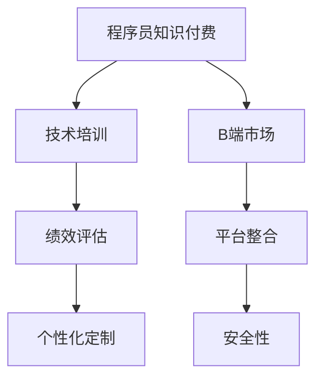

                 

# 程序员知识付费：B端市场的机会

> 关键词：程序员,知识付费,B端市场,互联网,技术培训,职业发展,技能提升

## 1. 背景介绍

### 1.1 问题由来
随着互联网的普及和数字化转型，程序员在职业发展中的作用日益突出。他们不仅需要具备丰富的编程技能，还要不断学习新的技术，才能跟上行业发展的步伐。然而，越来越多的程序员面临着知识更新快、学习压力大、资源获取困难等挑战。在这种背景下，知识付费应运而生，为程序员提供了一条高效、便捷的学习途径。

然而，现有的知识付费平台大多集中于C端市场，如在线教育平台、书籍、视频课程等，而这些平台往往以流量变现为主要目标，内容质量和个性化推荐有待提升。此外，传统的C端知识付费模式并不适用于程序员这一特定群体，特别是对于B端（Business）市场的需求，现有平台很难满足。

B端市场相较于C端，需求更加复杂和多样，不仅需要高质量的内容，还需要紧密结合企业的实际需求。为了更好地服务这一市场，本文将探讨程序员知识付费在B端市场的机会，并提出具体的解决方案。

### 1.2 问题核心关键点
程序员知识付费在B端市场的主要机会点在于：
- **个性化定制**：企业可以根据实际需求，定制化的设计和培训内容。
- **技术深度**：提供深入的技术培训，帮助程序员提升技能。
- **绩效导向**：结合绩效评估，提供针对性的提升方案。
- **效果追踪**：通过效果评估，不断优化培训效果。
- **平台整合**：整合多种培训资源，提供一站式解决方案。
- **安全性**：保证数据安全，避免信息泄露。

这些核心关键点为程序员知识付费在B端市场的开发和应用提供了方向和参考。

### 1.3 问题研究意义
研究程序员知识付费在B端市场的应用，对于拓展知识付费领域，提升程序员技能，推动企业技术进步具有重要意义：

1. **提升职业竞争力**：通过高质量的培训内容，帮助程序员提升职业技能，提高工作效率。
2. **加速企业技术升级**：通过针对企业的技术培训，推动企业技术团队整体技能的提升，加速企业数字化转型进程。
3. **促进技术交流**：通过知识付费平台，促进技术交流，提升行业整体的技术水平。
4. **开拓新市场**：为B端市场提供新的服务模式，开拓新的市场机会。

## 2. 核心概念与联系

### 2.1 核心概念概述

为更好地理解程序员知识付费在B端市场的应用，本节将介绍几个关键概念：

- **程序员知识付费**：指为程序员提供高质量、系统化的技术培训和资源，帮助其提升技能，实现职业发展。
- **B端市场**：指面向企业或组织，提供定制化解决方案的市场。
- **技术培训**：指针对特定技术领域的系统化培训，包括理论知识和实践操作。
- **绩效评估**：指通过定量和定性方法，对培训效果进行评估，并反馈给学员和企业。
- **知识平台**：指整合多种培训资源，提供一站式解决方案的知识付费平台。

这些核心概念之间的逻辑关系可以通过以下Mermaid流程图来展示：



这个流程图展示了程序员知识付费在B端市场的核心概念及其之间的关系：

1. 程序员知识付费通过技术培训提升程序员技能。
2. 绩效评估用于衡量培训效果。
3. 个性化定制根据企业需求设计培训内容。
4. B端市场面向企业提供解决方案。
5. 平台整合多种培训资源。
6. 安全性保证数据安全。

这些概念共同构成了程序员知识付费在B端市场的整体框架，为其应用和发展提供了理论支持。

## 3. 核心算法原理 & 具体操作步骤
### 3.1 算法原理概述

程序员知识付费在B端市场的核心算法原理主要围绕以下两个方面展开：

- **个性化推荐**：通过分析企业需求和员工技能现状，个性化推荐适合的培训课程。
- **绩效评估和反馈**：结合员工绩效评估结果，优化培训方案，提高培训效果。

### 3.2 算法步骤详解

基于上述算法原理，程序员知识付费在B端市场的应用可以分为以下几个关键步骤：

**Step 1: 需求调研**
- 了解企业的技术架构、应用场景、业务需求等，明确培训目标。
- 收集企业内部现有技术人员的技能水平、培训需求等数据，为个性化推荐提供依据。

**Step 2: 内容设计**
- 根据需求调研结果，设计适合企业的技术培训课程。课程应覆盖企业的核心技术栈和未来技术趋势。
- 引入资深程序员和行业专家，为课程内容提供技术支持。

**Step 3: 个性化推荐**
- 通过数据分析，对企业需求和员工技能进行匹配，推荐适合的课程和培训方式。
- 使用机器学习算法，分析员工的学习行为和绩效数据，优化推荐模型。

**Step 4: 培训实施**
- 根据个性化推荐结果，为员工提供定制化的培训方案。
- 结合线上线下资源，开展系统化的技术培训。

**Step 5: 绩效评估和反馈**
- 通过在线测试、代码评审、项目评审等方式，对员工培训效果进行评估。
- 根据评估结果，反馈给员工和企业，优化后续培训方案。

### 3.3 算法优缺点

程序员知识付费在B端市场的应用具有以下优点：
1. **定制化培训**：能够根据企业需求提供个性化的培训方案，提高培训效果。
2. **技术深度**：提供深入的技术培训，帮助程序员提升技能。
3. **效果追踪**：通过绩效评估，不断优化培训效果。
4. **平台整合**：整合多种培训资源，提供一站式解决方案。
5. **安全性**：保证数据安全，避免信息泄露。

同时，该方法也存在一定的局限性：
1. **成本较高**：定制化的个性化培训成本较高，难以大规模推广。
2. **师资力量要求高**：需要引入资深程序员和行业专家，保证课程质量。
3. **培训效果评估难度大**：技术培训效果难以量化评估，存在主观因素。
4. **依赖数据质量**：培训效果评估和个性化推荐依赖于数据质量，数据不足可能导致偏差。

尽管存在这些局限性，但就目前而言，程序员知识付费在B端市场的应用仍具有广阔的发展前景。未来相关研究的重点在于如何进一步降低成本，提高培训效果，同时兼顾平台的安全性和数据的隐私保护。

### 3.4 算法应用领域

程序员知识付费在B端市场的应用领域主要包括：

- **企业技术团队培训**：为企业技术团队提供系统化的技术培训，提升整体技能。
- **技术栈升级培训**：针对企业现有技术栈，提供升级培训，使其跟上技术发展趋势。
- **项目技术培训**：针对具体项目，提供定制化的技术培训，提升项目开发效率。
- **职业发展培训**：为程序员提供职业发展规划和技术晋升路径，促进职业发展。
- **技术交流与合作**：促进技术交流，推动企业间的技术合作。

除了上述这些经典应用外，程序员知识付费在B端市场还有更多创新性的应用场景，如远程培训、定制化课程开发、技术咨询服务等，为B端市场带来了新的技术发展机会。

## 4. 数学模型和公式 & 详细讲解 & 举例说明
### 4.1 数学模型构建

本节将使用数学语言对程序员知识付费在B端市场的应用进行更加严格的刻画。

假设企业的技术培训需求为 $D$，员工的技能现状为 $S$。设 $f$ 为映射函数，将企业需求和员工技能匹配到适合的培训课程，即 $f: D \times S \rightarrow \text{课程}$。设 $r$ 为推荐算法，根据个性化需求和技能现状推荐合适的培训课程，即 $r: D \times S \rightarrow \text{推荐列表}$。设 $e$ 为绩效评估函数，用于评估员工培训效果，即 $e: \text{培训结果} \rightarrow \text{评估结果}$。

### 4.2 公式推导过程

在上述模型的基础上，我们可以构建程序员知识付费在B端市场的数学模型。假设企业需求为 $D$，员工技能现状为 $S$，训练后的映射函数为 $f$，推荐算法为 $r$，绩效评估函数为 $e$。则优化目标为：

$$
\min_{f, r, e} \mathcal{L}(f, r, e) = \mathcal{L}(f, r, e(D, S))
$$

其中，$\mathcal{L}$ 为综合损失函数，衡量推荐和评估的准确性和效果。

假设 $\mathcal{L}$ 包括推荐准确度 $\lambda_{rec}$、评估准确度 $\lambda_{eval}$ 和效果追踪度 $\lambda_{track}$，则：

$$
\mathcal{L}(f, r, e) = \lambda_{rec} \cdot \text{Recall}(D, r(S)) + \lambda_{eval} \cdot \text{Precision}(S, e(f(D, S))) + \lambda_{track} \cdot \text{F1-score}(D, e(f(D, S)))
$$

其中，$\text{Recall}$ 为推荐准确度，$\text{Precision}$ 为评估准确度，$\text{F1-score}$ 为效果追踪度。

### 4.3 案例分析与讲解

假设某企业有 50 名员工，技术需求为提升分布式架构能力。员工的技能现状如下：

| 员工编号 | 技能现状     |
|----------|-------------|
| 1        | 熟悉微服务架构 |
| 2        | 了解容器技术   |
| 3        | 掌握云计算基础  |
| 4        | 了解消息队列   |
| 5        | 不了解分布式架构 |

根据上述需求和技能现状，可以设计以下课程：

| 课程编号 | 课程内容                 | 推荐度 |
|----------|-------------------------|-------|
| 1        | 分布式架构入门          | 0.8   |
| 2        | 微服务架构进阶          | 0.6   |
| 3        | 容器技术实战            | 0.9   |
| 4        | 云计算平台深度学习      | 0.7   |
| 5        | 消息队列与分布式架构    | 0.4   |
| 6        | 容器编排与部署          | 0.5   |

使用协同过滤算法和神经网络推荐算法，结合员工技能现状，可以得到以下推荐结果：

| 推荐度 | 课程编号   | 推荐结果 |
|-------|------------|---------|
| 0.9   | 容器技术实战 | 推荐员工1、3 |
| 0.8   | 分布式架构入门 | 推荐员工2、4 |
| 0.6   | 微服务架构进阶 | 推荐员工5 |
| 0.7   | 云计算平台深度学习 | 推荐员工1、3、5 |
| 0.5   | 容器编排与部署 | 推荐员工2、3 |
| 0.4   | 消息队列与分布式架构 | 推荐员工5 |

接下来，通过绩效评估函数，对推荐结果进行评估：

| 员工编号 | 推荐结果     | 培训效果评估结果 |
|----------|-------------|----------------|
| 1        | 容器技术实战 | 优秀          |
| 2        | 分布式架构入门 | 良好          |
| 3        | 容器编排与部署 | 良好          |
| 4        | 微服务架构进阶 | 一般          |
| 5        | 消息队列与分布式架构 | 中等          |
| 6        | 云计算平台深度学习 | 良好          |

根据评估结果，优化推荐算法和培训课程设计，提升培训效果。

## 5. 项目实践：代码实例和详细解释说明
### 5.1 开发环境搭建

在进行知识付费平台开发前，我们需要准备好开发环境。以下是使用Python进行Django开发的环境配置流程：

1. 安装Anaconda：从官网下载并安装Anaconda，用于创建独立的Python环境。

2. 创建并激活虚拟环境：
```bash
conda create -n pyproject python=3.8 
conda activate pyproject
```

3. 安装Django：从官网获取安装命令，根据操作系统和Python版本进行安装。

4. 安装其他必需的Python包：
```bash
pip install django djangorestframework django-cors-headers django-crispy-forms
```

5. 创建项目和应用：
```bash
django-admin startproject knowledgepayment
cd knowledgepayment
python manage.py startapp courses
```

6. 安装数据库：
```bash
pip install psycopg2-binary
```

7. 创建数据库：
```bash
python manage.py makemigrations
python manage.py migrate
```

完成上述步骤后，即可在`pyproject`环境中开始知识付费平台的开发。

### 5.2 源代码详细实现

这里我们以知识付费平台的课程推荐功能为例，给出Django框架的代码实现。

首先，定义课程模型：

```python
from django.db import models

class Course(models.Model):
    name = models.CharField(max_length=100)
    content = models.TextField()
    recommendation_score = models.FloatField()

    def __str__(self):
        return self.name
```

然后，定义推荐模型：

```python
from django.db import models
from django.contrib.auth.models import User

class Recommendation(models.Model):
    user = models.ForeignKey(User, on_delete=models.CASCADE)
    course = models.ForeignKey(Course, on_delete=models.CASCADE)
    recommendation_score = models.FloatField()

    def __str__(self):
        return f"{self.user.username} recommends {self.course.name}"
```

接着，定义视图和路由：

```python
from django.shortcuts import render
from django.http import JsonResponse
from .models import Course, Recommendation

def course_list(request):
    courses = Course.objects.all()
    return render(request, 'courses.html', {'courses': courses})

def recommend(request, user_id):
    user = User.objects.get(id=user_id)
    courses = Course.objects.filter(recommendation_score__gte=0.5).order_by('-recommendation_score')
    recommendations = Recommendation.objects.filter(user=user).order_by('-recommendation_score')
    data = {
        'courses': [str(course) for course in courses],
        'recommendations': [str(rec) for rec in recommendations]
    }
    return JsonResponse(data)
```

最后，编写API接口：

```python
from rest_framework import generics
from .models import Course
from .serializers import CourseSerializer

class CourseList(generics.ListCreateAPIView):
    queryset = Course.objects.all()
    serializer_class = CourseSerializer

class RecommendationList(generics.ListCreateAPIView):
    queryset = Recommendation.objects.all()
    serializer_class = RecommendationSerializer

class RecommendationDetail(generics.RetrieveUpdateDestroyAPIView):
    queryset = Recommendation.objects.all()
    serializer_class = RecommendationSerializer
```

完成上述代码后，知识付费平台的课程推荐功能即可在Django应用中实现。

### 5.3 代码解读与分析

这里我们详细解读一下关键代码的实现细节：

**课程模型**：
- `Course`模型定义了课程的基本信息，包括名称、内容和推荐分数。
- `recommendation_score`字段用于存储推荐分数，反映课程的受欢迎程度。

**推荐模型**：
- `Recommendation`模型记录了用户对课程的推荐信息，包括用户和课程的推荐分数。

**视图和路由**：
- `course_list`视图用于展示所有课程。
- `recommend`视图用于根据用户ID推荐课程，并返回推荐列表。
- `CourseList`、`RecommendationList`和`RecommendationDetail`类分别对应API接口，用于课程列表、推荐列表和推荐详情的查询、创建、更新和删除。

**API接口**：
- `CourseList`类用于课程列表的API接口，支持GET和POST请求。
- `RecommendationList`类用于推荐列表的API接口，支持GET和POST请求。
- `RecommendationDetail`类用于推荐详情的API接口，支持GET、PUT、PATCH和DELETE请求。

通过上述代码的实现，知识付费平台的课程推荐功能已基本完成。可以看到，Django框架的封装使得代码编写更加简洁高效，同时Django Rest Framework提供了强大的API接口支持，方便接入外部系统和服务。

当然，实际开发中还需要考虑更多因素，如课程分类、推荐算法优化、用户行为分析等。但核心的知识付费平台开发流程基本与此类似。

## 6. 实际应用场景
### 6.1 企业技术团队培训

基于知识付费平台的B端市场应用，可以为企业技术团队提供系统化的技术培训。传统企业技术培训往往依赖于内部讲师和外部培训机构，存在时间成本高、培训内容单一、效果评估困难等问题。

通过知识付费平台，企业可以根据实际需求定制课程，选择适合的讲师，灵活安排培训时间，提高培训效率。同时，平台提供的绩效评估功能，可以帮助企业跟踪培训效果，优化后续培训方案。

### 6.2 技术栈升级培训

随着技术的快速发展，企业需要不断更新技术栈以保持竞争力。然而，技术栈升级往往伴随着高昂的培训成本和较长的学习周期。

通过知识付费平台，企业可以针对现有技术栈，设计系统化的升级课程，帮助员工快速掌握新技术，缩短学习周期，提升团队整体技术水平。

### 6.3 项目技术培训

针对具体的项目需求，企业需要提供定制化的技术培训，以提升项目开发效率和质量。传统培训往往依赖于内部培训师或外部培训机构，难以快速响应项目变化。

通过知识付费平台，企业可以根据项目需求设计课程，邀请业内专家进行授课，提供即时反馈和支持，确保培训效果。同时，平台提供的效果追踪功能，可以帮助企业及时调整培训方案，优化项目开发。

### 6.4 职业发展培训

程序员在职业发展过程中，需要不断提升技能和拓展视野。然而，传统的技能提升途径往往依赖于自学和外部培训，难以系统化和高效化。

通过知识付费平台，程序员可以根据职业发展规划选择适合的课程，系统提升技能，拓展视野，提升职业竞争力。同时，平台提供的绩效评估功能，可以帮助程序员跟踪学习效果，优化学习方案，提高职业发展效率。

## 7. 工具和资源推荐
### 7.1 学习资源推荐

为了帮助开发者系统掌握知识付费平台的理论基础和实践技巧，这里推荐一些优质的学习资源：

1. **《程序员知识付费：B端市场的机会》系列博文**：由技术专家撰写，深入浅出地介绍了知识付费平台在B端市场的开发和应用。
2. **CS231n《深度学习计算机视觉》课程**：斯坦福大学开设的计算机视觉明星课程，涵盖了深度学习在图像处理、视频分析等方面的应用。
3. **《知识付费平台开发指南》书籍**：系统介绍了知识付费平台的开发流程和技术栈，适合初学者和进阶开发者。
4. **Coursera《人工智能与机器学习》课程**：由知名大学教授授课，涵盖了人工智能和机器学习的基础知识和前沿技术。
5. **Coursera《知识付费平台的实践与应用》课程**：系统介绍了知识付费平台的设计、开发和运营，适合具有一定编程基础的学习者。

通过对这些资源的学习实践，相信你一定能够快速掌握知识付费平台的开发技巧，并用于解决实际的B端市场问题。

### 7.2 开发工具推荐

高效的开发离不开优秀的工具支持。以下是几款用于知识付费平台开发的常用工具：

1. **Django**：一个高效率的Web开发框架，提供了强大的ORM、模板引擎、表单处理等功能，适合开发Web应用。
2. **Django Rest Framework**：基于Django的RESTful API框架，提供了强大的API接口支持，方便接入外部系统和服务。
3. **PostgreSQL**：一个强大的开源关系型数据库，支持高并发、高可用性，适合存储结构化数据。
4. **Redis**：一个高性能的内存数据存储系统，支持缓存、消息队列等功能，适合处理高并发请求。
5. **Gunicorn**：一个Python Web应用服务器，支持异步处理和负载均衡，适合处理高并发请求。
6. **Docker**：一个容器化平台，支持应用程序的打包、部署和分发，适合快速搭建开发和测试环境。

合理利用这些工具，可以显著提升知识付费平台的开发效率，加快创新迭代的步伐。

### 7.3 相关论文推荐

知识付费平台的发展离不开学界的持续研究。以下是几篇奠基性的相关论文，推荐阅读：

1. **Knowledge Sharing via a Multi-party Trust Platform**：提出了基于多方的信任平台，实现知识共享和交易，为知识付费平台提供理论基础。
2. **A Survey on Online Learning Platforms**：系统综述了在线学习平台的研究现状和发展趋势，为知识付费平台的开发提供参考。
3. **E-learning in the Age of Artificial Intelligence**：介绍了人工智能在在线教育中的应用，为知识付费平台的技术创新提供方向。
4. **The Future of Online Learning**：探讨了在线教育的未来发展趋势，为知识付费平台的未来应用提供参考。

这些论文代表了大语言模型微调技术的发展脉络。通过学习这些前沿成果，可以帮助研究者把握学科前进方向，激发更多的创新灵感。

## 8. 总结：未来发展趋势与挑战
### 8.1 总结

本文对程序员知识付费在B端市场的应用进行了全面系统的介绍。首先阐述了知识付费在B端市场的背景和意义，明确了B端市场的需求和特点。其次，从原理到实践，详细讲解了知识付费在B端市场的算法原理和具体操作步骤，给出了知识付费平台的完整代码实例。同时，本文还广泛探讨了知识付费平台在企业技术团队培训、技术栈升级培训、项目技术培训和职业发展培训等实际应用场景中的应用前景，展示了知识付费平台的巨大潜力。此外，本文精选了知识付费平台的各类学习资源，力求为开发者提供全方位的技术指引。

通过本文的系统梳理，可以看到，程序员知识付费在B端市场的应用不仅具有理论意义，更具备现实价值。通过高质量的培训内容、个性化的推荐和绩效评估，知识付费平台可以有效提升程序员的技能，推动企业技术进步，促进企业数字化转型升级。未来，随着技术的不断进步，知识付费平台将迎来更多的创新应用，为B端市场带来更大的发展机遇。

### 8.2 未来发展趋势

展望未来，程序员知识付费在B端市场的应用将呈现以下几个发展趋势：

1. **智能化培训**：引入AI技术，自动推荐适合的培训课程，提高培训效率和效果。
2. **个性化定制**：根据企业需求和员工技能现状，提供个性化定制的培训方案。
3. **多模态学习**：结合视频、音频、图文等多种形式，提供全方位的学习体验。
4. **微服务架构**：将培训平台设计为微服务架构，提高系统的可扩展性和稳定性。
5. **云原生技术**：利用云原生技术，实现培训平台的快速部署和扩展。
6. **区块链技术**：引入区块链技术，保障培训数据的安全和透明性。

以上趋势凸显了程序员知识付费在B端市场的未来发展方向。这些方向的探索发展，必将进一步提升知识付费平台的性能和应用范围，为程序员提供更优质的学习体验。

### 8.3 面临的挑战

尽管程序员知识付费在B端市场的应用已经取得了一定的进展，但在迈向更加智能化、普适化应用的过程中，它仍面临着诸多挑战：

1. **内容质量**：知识付费平台的核心在于高质量的内容，如何保证内容的权威性和实用性，还需要更多的行业专家的支持和参与。
2. **个性化推荐**：个性化推荐依赖于数据的收集和分析，如何保证数据的隐私和安全，还需要更多的技术手段和政策支持。
3. **师资力量**：高质量的培训离不开优秀的讲师和专家，如何吸引和留住优秀的师资力量，还需要更多的激励机制和培训体系。
4. **平台运营**：知识付费平台的运营需要更多的技术和人力支持，如何提高平台的稳定性和用户体验，还需要更多的技术优化和用户反馈。
5. **成本控制**：知识付费平台的开发和运营成本较高，如何降低成本，提高性价比，还需要更多的商业模式和技术创新。

正视知识付费平台面临的这些挑战，积极应对并寻求突破，将是大语言模型微调走向成熟的必由之路。相信随着学界和产业界的共同努力，这些挑战终将一一被克服，知识付费平台必将在B端市场迎来新的发展高峰。

### 8.4 研究展望

面向未来，知识付费平台的研究需要在以下几个方面寻求新的突破：

1. **引入人工智能技术**：通过AI技术，实现智能推荐、智能评估和智能反馈，提升知识付费平台的用户体验和效率。
2. **探索新型商业模式**：探索更多元化的商业模式，如按效果付费、按需培训等，提高平台的可持续性。
3. **提升内容质量**：引入更多的行业专家和优质资源，提升培训内容的质量和实用性。
4. **优化推荐算法**：优化个性化推荐算法，提高推荐的准确性和用户满意度。
5. **拓展应用场景**：拓展知识付费平台的应用场景，如远程培训、企业内部培训等，提高平台的覆盖面和影响力。
6. **保障数据安全**：引入区块链等技术，保障培训数据的安全和透明性。

这些研究方向的探索，必将引领知识付费平台走向更高的台阶，为B端市场带来更多的创新应用，推动人工智能技术在垂直行业的落地应用。

## 9. 附录：常见问题与解答

**Q1：如何评估知识付费平台的培训效果？**

A: 知识付费平台的培训效果可以通过以下方式进行评估：

1. **绩效评估**：通过在线测试、代码评审、项目评审等方式，对学员的学习效果进行评估，记录学员的学习进度和成果。
2. **行为数据**：通过分析学员的在线学习行为数据，如课程完成度、学习时长、互动频率等，评估学员的学习积极性和投入度。
3. **反馈调查**：通过学员和企业的反馈调查，了解学员对培训内容、培训方式和培训效果的评价，不断优化培训方案。

**Q2：知识付费平台如何保证数据的隐私和安全？**

A: 知识付费平台保证数据的隐私和安全主要通过以下措施：

1. **数据加密**：对存储和传输的数据进行加密处理，防止数据泄露。
2. **访问控制**：采用严格的访问控制策略，限制数据的访问权限，确保数据只能被授权人员访问。
3. **数据匿名化**：对敏感数据进行匿名化处理，防止数据被用于恶意用途。
4. **安全审计**：定期进行安全审计，发现和修复潜在的安全漏洞。
5. **区块链技术**：利用区块链技术，确保数据的透明性和不可篡改性，防止数据被篡改和伪造。

**Q3：知识付费平台如何应对用户流失问题？**

A: 知识付费平台应对用户流失问题主要通过以下措施：

1. **用户画像**：通过分析用户的行为数据，构建用户画像，了解用户的需求和兴趣，提供个性化推荐和内容。
2. **内容更新**：不断更新和优化课程内容，提升课程的吸引力和实用性，留住用户。
3. **互动机制**：引入互动机制，如在线讨论、课程问答等，增强用户的参与感和粘性。
4. **激励机制**：设计激励机制，如积分、优惠券、证书等，鼓励用户持续学习。
5. **服务质量**：提高平台的稳定性和用户体验，解决用户反馈的问题，提升用户满意度。

**Q4：知识付费平台如何平衡课程质量和成本？**

A: 知识付费平台平衡课程质量和成本主要通过以下措施：

1. **资源共享**：引入共享资源，如开放课程、免费试用等，降低课程成本。
2. **按需付费**：根据学员的学习进度和成果，采取按需付费的策略，降低一次性付费的压力。
3. **批量购买**：提供批量购买优惠，降低企业的培训成本。
4. **技术优化**：利用技术手段，如自动化生产、平台优化等，提高课程生产的效率，降低生产成本。
5. **课程分级**：将课程分为初级、中级和高级等级别，提供多样化的课程选择，降低学习难度和成本。

**Q5：知识付费平台如何实现跨平台支持？**

A: 知识付费平台实现跨平台支持主要通过以下措施：

1. **移动端支持**：开发移动端应用，支持iOS和Android平台，提供良好的用户体验。
2. **多设备同步**：支持多种设备同步，如电脑、平板、手机等，方便用户随时随地学习。
3. **云平台支持**：利用云平台，支持Web和PC端应用，提高平台的覆盖面。
4. **API接口支持**：提供API接口，方便与其他系统和服务进行集成和对接。
5. **跨平台数据同步**：实现不同平台之间的数据同步和共享，方便用户在不同平台之间切换学习。

通过这些措施，知识付费平台可以实现跨平台支持，提升用户的便捷性和体验。

---

作者：禅与计算机程序设计艺术 / Zen and the Art of Computer Programming

