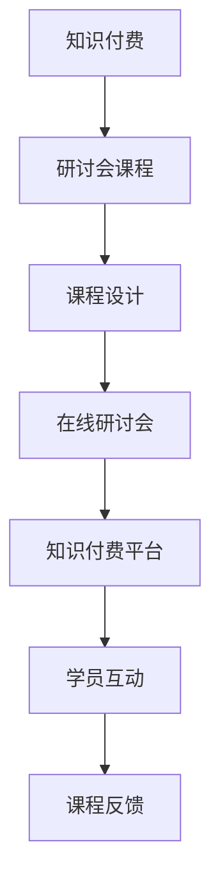

                 

# 程序员知识付费：打造研讨会课程

> 关键词：知识付费,研讨会课程,软件开发,在线学习,课程设计

## 1. 背景介绍

### 1.1 问题由来
随着互联网的普及和技术的快速发展，程序员群体面临的学习需求不断增长。然而，传统的线下教育资源受时间地点限制，难以满足所有人的学习需求。同时，全球新冠疫情爆发，更是加速了在线学习向主流化、规模化发展的趋势。

在这样的背景下，知识付费成为一种新的商业模式。程序员通过支付一定的费用，获取高质量的学习资源和知识，节省时间和成本，实现知识和技能的高效提升。与此同时，知识付费也促进了教育行业的繁荣，为教育者提供了新的收入来源。

## 2. 核心概念与联系

### 2.1 核心概念概述

为更好地理解知识付费和研讨会课程的构建，本节将介绍几个关键概念：

- 知识付费(Knowledge Paywalls)：用户为获取知识资源而支付费用的商业模式。它标志着知识和教育资源的商品化，也改变了用户的学习习惯和教育机构的运营模式。

- 研讨会(Seminars)：一种交互式学习形式，邀请专家通过演讲、案例讨论、互动问答等方式，向听众传授专业知识。在传统的线下场景中，研讨会通常需要参与者付出时间和交通成本，难以大规模普及。

- 在线研讨会(Online Seminars)：借助网络技术，将研讨会的形式搬到线上，使得全球各地的用户都能参与其中，极大地扩展了研讨会的影响力。

- 课程设计(Course Design)：基于教育学理论和心理学原理，对课程内容、形式、结构等进行系统规划和设计，以达成预期的学习目标。

- 知识付费课程(Knowledge Paywall Courses)：以在线研讨会的形式，通过知识付费平台提供高质量的课程内容，向学员收取费用，实现知识和技能传播。

这些概念之间相互联系，共同构成了知识付费和研讨会课程的发展框架。通过理解这些核心概念，可以更好地把握知识付费和研讨会课程的实施方法和应用场景。

### 2.2 核心概念原理和架构的 Mermaid 流程图



这个流程图展示了知识付费和研讨会课程从设计到实施的全过程：

1. 知识付费平台利用课程设计，制作高质量的在线研讨会课程。
2. 学员通过知识付费平台获取课程内容。
3. 在线研讨会平台提供互动和学习环境。
4. 学员通过互动交流，获得知识反馈。
5. 课程设计师和平台根据反馈不断优化课程。

## 3. 核心算法原理 & 具体操作步骤

### 3.1 算法原理概述

知识付费课程的在线研讨会部分，涉及以下几个核心算法和步骤：

- 课程设计算法：基于教育学和心理学理论，设计课程内容和形式，以最大限度提升学员的学习效果。
- 互动算法：实现学员与讲师之间的实时互动，如问答、投票、讨论等。
- 课程反馈算法：收集学员对课程的反馈意见，评估课程效果，并根据反馈优化课程设计。
- 个性化推荐算法：根据学员的学习历史和行为数据，推荐适合的课程和互动内容。

通过这些算法和步骤，知识付费课程能够提供高质量的学习体验，帮助学员高效掌握知识。

### 3.2 算法步骤详解

#### 3.2.1 课程设计算法

课程设计算法包含以下几个关键步骤：

1. 确定目标受众：根据学员的背景、知识水平和兴趣点，确定课程内容和难度。

2. 设计课程结构：将课程内容分解为多个模块，每个模块包括理论讲解和实践操作。

3. 选择教学工具：根据课程内容，选择适合的在线研讨会工具，如PPT演示、代码演示、视频讲解等。

4. 安排互动环节：设计互动问题、案例讨论、小组讨论等环节，增强学员的参与感和学习效果。

5. 评估和反馈：设置评估环节，通过小测验、项目作业等方式，评估学员学习成果，并收集反馈。

#### 3.2.2 互动算法

互动算法主要通过以下技术实现：

1. 实时问答：利用聊天室或即时消息工具，实现讲师和学员之间的实时问答。

2. 投票功能：通过投票工具，快速收集学员对某个问题的看法，并实时显示投票结果。

3. 小组讨论：使用在线协作工具，将学员分成小组，进行讨论和分享。

4. 代码演示：利用代码共享平台，展示和讲解编程示例。

5. 多媒体资源：集成视频、音频等多媒体资源，丰富课程内容。

#### 3.2.3 课程反馈算法

课程反馈算法主要通过以下步骤实现：

1. 收集反馈：课程结束后，向学员发送反馈问卷，收集对课程内容和形式的评价。

2. 分析反馈：使用数据挖掘和文本分析技术，分析反馈数据，识别出课程的优点和不足。

3. 优化课程：根据反馈，调整课程内容、形式和结构，优化学员的学习体验。

4. 持续改进：定期更新课程内容，引入最新技术和知识，保持课程的与时俱进。

#### 3.2.4 个性化推荐算法

个性化推荐算法主要通过以下技术实现：

1. 用户画像：根据学员的学习历史、行为数据，构建学员的用户画像。

2. 内容推荐：基于用户画像，推荐适合的课程和互动内容，增强学习效果。

3. 学习路径规划：根据学员的学习进度和兴趣点，推荐后续课程，形成系统的学习路径。

### 3.3 算法优缺点

知识付费课程的在线研讨会部分，具有以下优点：

- 灵活性强：学员可以根据自己的时间安排，随时随地参加课程，打破了时间和地点限制。
- 交互性强：通过互动环节，学员可以实时提问、讨论，增强了学习体验。
- 高质量资源：课程通常由专家设计，提供高质量的知识资源，帮助学员高效掌握知识。

同时，也存在一些缺点：

- 付费门槛高：课程收费相对较高，部分学员可能难以负担。
- 质量参差不齐：课程质量和讲师水平差异较大，部分课程可能未能满足学员的需求。
- 技术依赖：课程依赖于网络和设备，网络不稳定或设备故障可能会影响学习体验。

### 3.4 算法应用领域

知识付费课程的在线研讨会部分，主要应用于以下几个领域：

- 软件开发：提供软件开发工具和技术的教学课程，如Python编程、前端开发、后端开发等。
- 数据科学：提供数据处理、分析和机器学习等技能课程，帮助学员掌握大数据技术。
- 网络安全：提供网络安全知识和技能的教学课程，帮助学员掌握防护和攻击技术。
- 人工智能：提供人工智能基础和应用技能的教学课程，帮助学员掌握AI技术。
- 项目管理：提供项目管理工具和方法的教学课程，帮助学员掌握项目管理和团队协作技能。

此外，知识付费课程还适用于职业培训、技术认证、创业指导等多个领域，为不同层次的学员提供高质量的学习资源。

## 4. 数学模型和公式 & 详细讲解 & 举例说明

### 4.1 数学模型构建

知识付费课程的在线研讨会部分，涉及以下数学模型：

- 课程评估模型：用于评估学员学习成果的数学模型，常用的指标包括正确率、完成度、互动率等。
- 个性化推荐模型：用于推荐课程和互动内容的数学模型，常用的算法包括协同过滤、内容推荐、矩阵分解等。
- 时间序列模型：用于预测课程用户活跃度和学员学习进度的时间序列模型，常用的算法包括ARIMA、LSTM等。

### 4.2 公式推导过程

#### 4.2.1 课程评估模型

课程评估模型通过以下公式计算学员的学习成果：

$$
E = \frac{S + D + I}{3}
$$

其中，$S$ 为小测验的平均得分，$D$ 为项目作业的完成度，$I$ 为互动环节的活跃度。

#### 4.2.2 个性化推荐模型

个性化推荐模型通过以下公式计算学员推荐度：

$$
R = \alpha \cdot C + \beta \cdot H + \gamma \cdot T
$$

其中，$C$ 为用户画像特征向量，$H$ 为课程特征向量，$T$ 为学员和课程互动时间，$\alpha, \beta, \gamma$ 为权重系数。

#### 4.2.3 时间序列模型

时间序列模型通过以下公式预测用户活跃度：

$$
A_t = \alpha \cdot A_{t-1} + \beta \cdot X_t + \epsilon_t
$$

其中，$A_t$ 为第 $t$ 天用户活跃度，$A_{t-1}$ 为前一天用户活跃度，$X_t$ 为第 $t$ 天相关变量（如登录次数、课程发布数等），$\epsilon_t$ 为随机误差项，$\alpha, \beta$ 为系数。

### 4.3 案例分析与讲解

以一个简单的编程课程为例，分析知识付费课程的在线研讨会部分：

- **课程设计**：课程主要涵盖Python基础、数据结构、面向对象编程等内容，每节课包含理论讲解和代码演示。

- **互动算法**：在每节课的互动环节，讲师通过聊天室实时回答学员问题，学员可以进行代码编写并提交到共享平台上，与其他学员交流。

- **课程反馈**：课程结束后，讲师向学员发送反馈问卷，收集对课程内容的评价。通过数据分析，发现学员对数据结构部分反馈较好，但对面向对象编程部分评价较低，遂调整课程内容，增加面向对象编程的讲解时间。

- **个性化推荐**：根据学员的学习进度和兴趣点，课程推荐系统推荐后续课程，如Python进阶课程、算法与数据结构课程等。

## 5. 项目实践：代码实例和详细解释说明

### 5.1 开发环境搭建

在进行知识付费课程的在线研讨会开发前，我们需要准备好开发环境。以下是使用Python进行Django开发的环境配置流程：

1. 安装Anaconda：从官网下载并安装Anaconda，用于创建独立的Python环境。

2. 创建并激活虚拟环境：
```bash
conda create -n python-env python=3.8 
conda activate python-env
```

3. 安装Django：从官网获取对应的安装命令。例如：
```bash
pip install django==4.0
```

4. 安装开发工具：
```bash
pip install django-graphene[docs] django-cors-headers
```

5. 安装测试工具：
```bash
pip install django-test-case django-test-url django-environ
```

完成上述步骤后，即可在`python-env`环境中开始知识付费课程的开发实践。

### 5.2 源代码详细实现

下面我们以一个简单的知识付费课程为例，给出使用Django进行在线研讨会开发的PyTorch代码实现。

首先，定义课程模型和互动模型：

```python
from django.db import models

class Course(models.Model):
    title = models.CharField(max_length=255)
    description = models.TextField()
    create_date = models.DateTimeField(auto_now_add=True)

class Discussion(models.Model):
    course = models.ForeignKey(Course, on_delete=models.CASCADE)
    question = models.CharField(max_length=255)
    answer = models.TextField()
    create_date = models.DateTimeField(auto_now_add=True)
```

然后，定义互动功能视图和模型：

```python
from django.shortcuts import render
from django.http import JsonResponse

def discussion_view(request):
    discussions = Discussion.objects.all().order_by('-create_date')
    return JsonResponse({'discussions': [d.question for d in discussions]})

def answer_view(request, question_id):
    question = Discussion.objects.get(id=question_id)
    if request.method == 'POST':
        answer = request.POST.get('answer')
        question.answer = answer
        question.save()
    discussions = Discussion.objects.filter(course=question.course).order_by('-create_date')
    return JsonResponse({'discussions': [d.question for d in discussions]})
```

最后，启动开发服务器：

```bash
python manage.py runserver
```

至此，我们就完成了一个简单的知识付费课程在线研讨会的功能实现。可以看到，Django配合Python可以很方便地实现课程互动功能，开发者可以将更多精力放在课程内容和用户体验的设计上。

### 5.3 代码解读与分析

让我们再详细解读一下关键代码的实现细节：

**Course类**：
- `__init__`方法：初始化课程的标题、描述和创建时间。
- `__str__`方法：返回课程的字符串表示，便于在管理后台显示。

**Discussion类**：
- `__init__`方法：初始化讨论问题的课程、问题和答案。
- `__str__`方法：返回讨论问题的字符串表示，便于在管理后台显示。

**discussion_view函数**：
- 获取课程的所有讨论问题，按时间倒序排序。
- 通过JsonResponse将讨论问题列表返回给前端。

**answer_view函数**：
- 根据问题ID获取讨论问题。
- 如果请求方式为POST，则更新问题答案。
- 获取课程的所有讨论问题，按时间倒序排序。
- 通过JsonResponse将讨论问题列表返回给前端。

**Django运行服务器**：
- 启动Django开发服务器，通过访问指定地址，查看讨论问题的列表。

通过这些代码的详细解释，我们可以更好地理解Django框架的开发流程和功能实现。开发者可以根据具体需求，进一步扩展和优化课程互动功能。

## 6. 实际应用场景

### 6.1 软件开发培训

软件开发培训是知识付费课程的重要应用场景之一。传统软件开发培训往往依赖于线下课堂，受时间和地点限制。知识付费课程的在线研讨会部分，能够打破这些限制，使学员随时随地参加培训，提高学习效率。

例如，某公司可以利用知识付费课程的在线研讨会，邀请业内专家讲解最新开发工具和技术的最佳实践，如DevOps、云计算、区块链等。通过互动环节，学员可以随时提问，讲师可以实时回答，增强了学习体验。

### 6.2 数据科学应用

数据科学应用是知识付费课程的另一个重要应用场景。数据科学涉及大量复杂的数据处理和分析任务，线下培训难以满足学员的学习需求。知识付费课程的在线研讨会部分，能够提供高质量的教学资源和互动体验，帮助学员掌握数据科学技能。

例如，某大学可以邀请知名数据科学家讲解机器学习、深度学习、大数据等领域的最新进展，并提供代码演示、项目实战等互动环节，使学员能够快速掌握数据科学技能。

### 6.3 网络安全防护

网络安全防护是知识付费课程的重要应用场景之一。网络安全知识涉及复杂的技术细节和防护策略，线下培训难以覆盖所有知识点。知识付费课程的在线研讨会部分，能够提供系统化的网络安全课程和互动体验，帮助学员掌握防护和攻击技术。

例如，某安全公司可以邀请知名安全专家讲解常见网络攻击类型、防护策略和安全工具，并提供代码演示、案例分析等互动环节，使学员能够掌握网络安全技能。

### 6.4 未来应用展望

随着知识付费和在线研讨会的发展，未来知识付费课程的应用场景将更加广泛，影响也将更加深远。

在智慧医疗领域，知识付费课程可以为医疗专业人员提供最新的医学知识和技能培训，帮助其更好地应对复杂医疗问题，提高诊断和治疗的准确性。

在智能教育领域，知识付费课程可以为学生提供个性化、互动的学习体验，促进教育公平，提高教学质量。

在智慧城市治理中，知识付费课程可以为城市管理者和工程师提供系统化的知识和技能培训，提高城市管理的智能化水平，构建更安全、高效的未来城市。

此外，在企业生产、社会治理、文娱传媒等众多领域，知识付费课程也将不断涌现，为传统行业数字化转型升级提供新的技术路径。相信随着技术的日益成熟，知识付费课程必将在更多领域大放异彩，深刻影响人类的生产生活方式。

## 7. 工具和资源推荐

### 7.1 学习资源推荐

为了帮助开发者系统掌握知识付费和在线研讨会课程的设计和开发，这里推荐一些优质的学习资源：

1. 《知识付费平台设计与实现》系列博文：由知识付费领域专家撰写，深入浅出地介绍了知识付费平台的理论基础和实践技巧。

2. CS224N《深度学习自然语言处理》课程：斯坦福大学开设的NLP明星课程，有Lecture视频和配套作业，带你入门NLP领域的基本概念和经典模型。

3. 《在线研讨会设计指南》书籍：介绍在线研讨会的各个环节和最佳实践，帮助课程设计师提高课程质量。

4. Kaggle数据科学竞赛：提供丰富的数据集和算法竞赛，帮助开发者提升数据科学技能。

5. Coursera在线课程：提供大量高质量的在线课程，涵盖数据科学、编程、人工智能等多个领域，帮助开发者提升知识储备。

通过对这些资源的学习实践，相信你一定能够快速掌握知识付费课程的开发技巧，并用于解决实际的NLP问题。

### 7.2 开发工具推荐

高效的开发离不开优秀的工具支持。以下是几款用于知识付费课程开发的常用工具：

1. Django：基于Python的开源Web框架，灵活性强，支持多种数据存储方式，适合知识付费平台开发。

2. TensorFlow：由Google主导开发的开源深度学习框架，生产部署方便，适合大规模工程应用。

3. GraphQL：用于构建API的查询语言，支持动态数据查询和类型系统，适合知识付费平台的数据管理。

4. Docker：容器化技术，用于快速部署和扩展知识付费课程，支持多种操作系统和环境。

5. Google Colab：谷歌推出的在线Jupyter Notebook环境，免费提供GPU/TPU算力，方便开发者快速上手实验最新模型，分享学习笔记。

合理利用这些工具，可以显著提升知识付费课程的开发效率，加快创新迭代的步伐。

### 7.3 相关论文推荐

知识付费课程和在线研讨会的技术发展源于学界的持续研究。以下是几篇奠基性的相关论文，推荐阅读：

1. "Online Seminars: A New Paradigm for Online Education"（在线研讨会：在线教育的全新范式）：介绍在线研讨会的形式和优势，探讨其对教育的影响。

2. "Knowledge Paywalls: A New Business Model for Education"（知识付费：教育的新商业模式）：探讨知识付费的商业模式、市场应用和前景。

3. "The Effectiveness of Online Seminars in Higher Education"（在线研讨会的高等教育效果研究）：研究在线研讨会在高等教育中的应用效果和学生反馈。

4. "A Comparative Study of Knowledge Paywall Platforms"（知识付费平台比较研究）：比较分析不同知识付费平台的优缺点和应用场景。

5. "The Future of Online Learning in the COVID-19 Pandemic"（新冠疫情期间在线学习的发展趋势）：探讨新冠疫情对在线学习的影响和未来发展趋势。

这些论文代表了大语言模型微调技术的发展脉络。通过学习这些前沿成果，可以帮助研究者把握学科前进方向，激发更多的创新灵感。

## 8. 总结：未来发展趋势与挑战

### 8.1 总结

本文对知识付费和在线研讨会课程进行了全面系统的介绍。首先阐述了知识付费和在线研讨会课程的研究背景和意义，明确了在线研讨会课程在知识传播和教育应用中的独特价值。其次，从原理到实践，详细讲解了在线研讨会的数学模型和关键步骤，给出了知识付费课程开发的完整代码实例。同时，本文还广泛探讨了知识付费课程在软件开发、数据科学、网络安全等多个领域的应用前景，展示了知识付费课程的巨大潜力。此外，本文精选了知识付费课程的学习资源，力求为读者提供全方位的技术指引。

通过本文的系统梳理，可以看到，知识付费和在线研讨会课程正在成为教育技术的重要范式，极大地拓展了教育资源的应用边界，促进了知识传播和教育公平。未来，伴随知识付费和在线研讨会的持续演进，相信教育技术将会在更广阔的应用领域大放异彩，深刻影响人类的学习方式和认知智能。

### 8.2 未来发展趋势

展望未来，知识付费课程和在线研讨会的发展将呈现以下几个趋势：

1. 课程内容多样化：随着技术的发展和应用场景的拓展，在线课程内容将更加丰富多样，涵盖各个领域的最新知识和技术。

2. 互动体验提升：通过增强现实(AR)、虚拟现实(VR)等技术，在线研讨会将提供更加沉浸式的学习体验，增强学员的参与感和学习效果。

3. 个性化推荐优化：通过深度学习和数据挖掘技术，在线研讨会将提供更加精准的个性化推荐，满足学员个性化的学习需求。

4. 跨平台整合：在线研讨会将与社交媒体、在线教育平台等进行整合，提供更加无缝的学习体验。

5. 知识付费生态完善：知识付费平台将提供更完善的课程内容、互动工具和用户服务，形成完整的知识付费生态系统。

6. 社区化学习兴起：在线研讨会将通过社区化学习方式，增强学员之间的互动和交流，形成学习共同体。

以上趋势凸显了知识付费和在线研讨会的广阔前景。这些方向的探索发展，必将进一步提升知识付费课程的学习效果，促进教育技术的普及和应用。

### 8.3 面临的挑战

尽管知识付费课程和在线研讨会的技术发展迅速，但在迈向更加智能化、普适化应用的过程中，它仍面临诸多挑战：

1. 课程质量参差不齐：课程设计和讲师水平差异较大，部分课程可能未能满足学员的需求。

2. 技术门槛较高：课程开发和维护需要较强的技术实力，部分开发者可能难以胜任。

3. 学员自控能力不足：在线学习缺乏课堂纪律，部分学员可能难以保持学习状态。

4. 互动效果有限：线上互动环节无法替代线下课堂的即时反馈和情感互动，部分学员可能感到孤立。

5. 数据隐私保护：在线课程需要收集和分析学员的个人信息，如何保护数据隐私和安全，仍需进一步探索。

6. 收费模式单一：知识付费主要依赖一次性付费，部分学员可能难以承受高昂的费用。

7. 跨文化适应：在线课程面临全球用户，如何适应不同语言和文化背景，提供国际化的学习体验，仍需进一步优化。

正视知识付费和在线研讨会所面临的这些挑战，积极应对并寻求突破，将是大语言模型微调走向成熟的必由之路。相信随着学界和产业界的共同努力，这些挑战终将一一被克服，知识付费和在线研讨会将成为教育技术的重要支柱。

### 8.4 研究展望

面对知识付费和在线研讨会所面临的种种挑战，未来的研究需要在以下几个方面寻求新的突破：

1. 探索无监督和半监督课程设计方法。摆脱对大规模标注数据的依赖，利用自监督学习、主动学习等无监督和半监督范式，最大限度利用非结构化数据，实现更加灵活高效的课程设计。

2. 研究多模态课程设计技术。将符号化的先验知识，如知识图谱、逻辑规则等，与神经网络模型进行巧妙融合，引导课程设计过程学习更准确、合理的课程内容。

3. 引入更多先验知识。将专家知识与在线课程结合，形成更加全面、准确的信息整合能力，增强课程内容的权威性和实用性。

4. 引入更多交互技术。通过增强现实(AR)、虚拟现实(VR)等技术，增强在线课程的互动性和沉浸感，提供更加真实的模拟场景。

5. 优化推荐算法。通过深度学习和数据挖掘技术，提供更加精准的个性化推荐，满足学员个性化的学习需求。

6. 建立智能课程设计平台。利用人工智能和大数据技术，自动生成和优化课程内容，提高课程设计的效率和质量。

7. 提升数据隐私保护。通过数据匿名化、加密等技术，保护学员的个人信息，确保数据安全。

这些研究方向将引领知识付费和在线研讨会的技术进步，为教育技术的普及和应用提供强有力的支持。面向未来，知识付费和在线研讨会将成为教育技术的核心组成部分，推动教育技术的深度发展和广泛应用。

