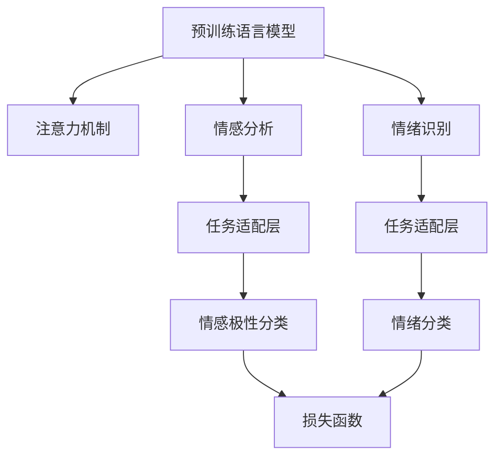

                 

# 第九章：情感分析和情绪识别

> 关键词：情感分析,情绪识别,深度学习,自然语言处理,语言模型,注意力机制,Transformer

## 1. 背景介绍

### 1.1 问题由来

情感分析和情绪识别是自然语言处理(NLP)中的重要研究方向，能够帮助人们理解和分析文本中的情感和情绪信息。情感分析旨在判断一段文本的情感极性(如正面、负面、中性)，广泛应用于社交媒体情感监测、产品评论分析、客户满意度评估等领域。情绪识别则是识别文本中具体情绪(如快乐、悲伤、愤怒等)，用于心理健康、情感辅导、用户行为分析等场景。

在传统NLP方法中，情感分析和情绪识别主要依赖于手工设计的特征工程和分类算法，如情感词典、SVM、逻辑回归等。然而，这些方法往往难以充分利用大规模语料库中的语言知识和语义信息，并且依赖于人工标注数据的数量和质量。近年来，深度学习特别是Transformer结构的出现，极大地推动了情感分析和情绪识别的发展。深度学习模型通过学习海量无标签数据，能够自动提取文本特征，构建高级语义表示，提升情感和情绪识别的准确率。

### 1.2 问题核心关键点

深度学习模型中，情感分析和情绪识别方法的核心在于构建合适的语义表示模型和任务适配层。常见的方法包括：

- 使用预训练语言模型(如BERT、GPT等)作为特征提取器，通过微调学习情感和情绪标签。
- 引入注意力机制，帮助模型关注与情感、情绪相关的语义信息。
- 设计更精细的任务适配层，针对具体任务(如情感分类、情绪识别)优化模型输出。
- 应用正则化、对抗训练等技术，提升模型鲁棒性和泛化能力。

此外，深度学习模型还可以结合时序信息、上下文信息，提升情感和情绪识别的准确率。例如，针对对话数据集，可以使用Transformer等结构捕捉对话中的情感和情绪变化；针对文本序列数据，可以引入RNN、LSTM等模型，利用上下文信息进行更准确的情感和情绪识别。

## 2. 核心概念与联系

### 2.1 核心概念概述

为更好地理解情感分析和情绪识别的深度学习实现，本节将介绍几个密切相关的核心概念：

- 情感分析(Sentiment Analysis)：判断一段文本的情感极性，通常分为极性判断(如正面、负面、中性)和情感强度评分。
- 情绪识别(Emotion Recognition)：识别文本中具体情绪，如快乐、悲伤、愤怒等，可以应用于心理健康、情感辅导等场景。
- 预训练语言模型(Pre-trained Language Model)：通过大规模无标签数据进行自监督预训练，学习到通用的语言表示。常用的预训练模型包括BERT、GPT等。
- 注意力机制(Attention Mechanism)：通过计算不同位置信息之间的重要性权重，帮助模型聚焦于与情感、情绪相关的语义信息。
- 任务适配层(Task-aware Layer)：根据具体任务需求，设计并适配合适的输出层和损失函数，优化模型在特定任务上的性能。

这些核心概念之间的逻辑关系可以通过以下Mermaid流程图来展示：



这个流程图展示了预训练语言模型、注意力机制和任务适配层在情感分析和情绪识别中的作用：

1. 预训练语言模型学习通用的语言表示。
2. 注意力机制帮助模型聚焦于与情感、情绪相关的语义信息。
3. 任务适配层针对具体任务设计并适配合适的输出层和损失函数。
4. 情感分析使用任务适配层输出情感极性分类结果。
5. 情绪识别使用任务适配层输出具体情绪分类结果。
6. 损失函数用于衡量模型输出与真实标签之间的差异。

这些核心概念共同构成了情感分析和情绪识别的深度学习框架，使其能够在各种场景下发挥强大的语义表示和情感分析能力。通过理解这些核心概念，我们可以更好地把握情感分析和情绪识别的工作原理和优化方向。

## 3. 核心算法原理 & 具体操作步骤
### 3.1 算法原理概述

深度学习模型中的情感分析和情绪识别，本质上是通过学习标注数据，构建通用的语言表示，并针对具体任务进行适配。其核心思想是：将预训练语言模型视作一个强大的"特征提取器"，通过微调学习情感和情绪标签，实现语义表示与任务标签的映射。

形式化地，假设预训练语言模型为 $M_{\theta}$，其中 $\theta$ 为预训练得到的模型参数。给定情感或情绪分类任务 $T$ 的标注数据集 $D=\{(x_i,y_i)\}_{i=1}^N, x_i \in \mathcal{X}, y_i \in \mathcal{Y}$，情感或情绪识别的优化目标是最小化损失函数 $\mathcal{L}(M_{\theta},D)$，其中 $\mathcal{Y}$ 为可能的情感或情绪类别集合。

常见的损失函数包括交叉熵损失、Focal Loss等。通过梯度下降等优化算法，微调过程不断更新模型参数 $\theta$，最小化损失函数 $\mathcal{L}$，使得模型输出逼近真实标签。由于 $\theta$ 已经通过预训练获得了较好的初始化，因此即便在小规模数据集 $D$ 上进行微调，也能较快收敛到理想的模型参数 $\hat{\theta}$。

### 3.2 算法步骤详解

深度学习模型中的情感分析和情绪识别一般包括以下几个关键步骤：

**Step 1: 准备预训练模型和数据集**
- 选择合适的预训练语言模型 $M_{\theta}$ 作为初始化参数，如 BERT、GPT等。
- 准备情感或情绪分类任务 $T$ 的标注数据集 $D$，划分为训练集、验证集和测试集。一般要求标注数据与预训练数据的分布不要差异过大。

**Step 2: 添加任务适配层**
- 根据任务类型，在预训练模型顶层设计合适的输出层和损失函数。
- 对于情感分析任务，通常在顶层添加线性分类器和交叉熵损失函数。
- 对于情绪识别任务，通常使用softmax层输出不同情绪类别的概率分布，并以交叉熵损失函数进行优化。

**Step 3: 设置微调超参数**
- 选择合适的优化算法及其参数，如 AdamW、SGD 等，设置学习率、批大小、迭代轮数等。
- 设置正则化技术及强度，包括权重衰减、Dropout、Early Stopping 等。
- 确定冻结预训练参数的策略，如仅微调顶层，或全部参数都参与微调。

**Step 4: 执行梯度训练**
- 将训练集数据分批次输入模型，前向传播计算损失函数。
- 反向传播计算参数梯度，根据设定的优化算法和学习率更新模型参数。
- 周期性在验证集上评估模型性能，根据性能指标决定是否触发 Early Stopping。
- 重复上述步骤直到满足预设的迭代轮数或 Early Stopping 条件。

**Step 5: 测试和部署**
- 在测试集上评估微调后模型 $M_{\hat{\theta}}$ 的性能，对比微调前后的精度提升。
- 使用微调后的模型对新样本进行推理预测，集成到实际的应用系统中。
- 持续收集新的数据，定期重新微调模型，以适应数据分布的变化。

以上是深度学习模型中进行情感分析和情绪识别的通用流程。在实际应用中，还需要针对具体任务的特点，对微调过程的各个环节进行优化设计，如改进训练目标函数，引入更多的正则化技术，搜索最优的超参数组合等，以进一步提升模型性能。

### 3.3 算法优缺点

深度学习模型中的情感分析和情绪识别方法具有以下优点：
1. 自动学习：深度学习模型通过学习大规模无标签数据，能够自动提取文本特征，构建高级语义表示，无需手工设计特征工程。
2. 泛化能力强：模型可以通过微调过程，学习通用的语言表示，并针对特定任务进行适配，提升模型泛化能力。
3. 效果显著：深度学习模型在情感分析和情绪识别任务上已经取得了多项最先进的结果，显著优于传统手工特征工程方法。
4. 参数高效：利用参数高效微调技术，在固定大部分预训练参数的情况下，仍可取得不错的微调效果。

同时，该方法也存在一定的局限性：
1. 依赖标注数据：微调的效果很大程度上取决于标注数据的质量和数量，获取高质量标注数据的成本较高。
2. 模型复杂度高：深度学习模型通常参数量庞大，计算复杂度高，难以在大规模数据集上高效训练。
3. 可解释性不足：深度学习模型的决策过程往往缺乏可解释性，难以对其推理逻辑进行分析和调试。
4. 训练成本高：深度学习模型需要大量的GPU算力进行训练，训练成本较高。

尽管存在这些局限性，但就目前而言，深度学习模型仍然是情感分析和情绪识别的主流方法。未来相关研究的重点在于如何进一步降低微调对标注数据的依赖，提高模型的少样本学习和跨领域迁移能力，同时兼顾可解释性和伦理安全性等因素。

### 3.4 算法应用领域

深度学习模型中的情感分析和情绪识别，已经广泛应用于诸多行业领域，包括但不限于：

- 社交媒体情感监测：实时监测社交媒体上的情感变化趋势，用于舆情分析、品牌管理等。
- 客户情感分析：分析客户评论、反馈，评估产品满意度，提升客户服务质量。
- 情感辅导：基于用户的社交媒体、聊天记录等数据，进行情感状态识别和心理辅导。
- 金融市场分析：通过分析新闻、公告等文本信息，识别市场情绪，预测股票市场走势。
- 智能客服：在客户对话中实时识别情感和情绪，进行情感安抚或服务推荐。
- 教育评价：分析学生的学习日志、考试回答，评估学生情感和情绪状态，提供个性化学习建议。

除了上述这些经典应用外，深度学习模型在情感分析和情绪识别方面的创新应用也在不断涌现，如基于生成模型的情绪生成、基于对比学习的情感对比分析等，为情感理解和情绪识别提供了新的思路和方法。

## 4. 数学模型和公式 & 详细讲解 & 举例说明
### 4.1 数学模型构建

假设情感或情绪分类任务 $T$ 的标注数据集 $D=\{(x_i,y_i)\}_{i=1}^N, x_i \in \mathcal{X}, y_i \in \mathcal{Y}$。预训练语言模型为 $M_{\theta}$，其中 $\theta$ 为模型参数。情感或情绪分类任务的损失函数为 $\mathcal{L}(M_{\theta},D)$。

对于情感分析任务，假设模型的输出为情感极性分类概率分布 $P_{\theta}(y|x)$，则交叉熵损失函数为：

$$
\mathcal{L}_{ce}(M_{\theta},D) = -\frac{1}{N}\sum_{i=1}^N \log P_{\theta}(y_i|x_i)
$$

对于情绪识别任务，假设模型的输出为情绪类别概率分布 $\hat{y} = \text{softmax}(M_{\theta}(x))$，则交叉熵损失函数为：

$$
\mathcal{L}_{ce}(M_{\theta},D) = -\frac{1}{N}\sum_{i=1}^N \log \hat{y}_i^{y_i}
$$

### 4.2 公式推导过程

以下我们以情感分类任务为例，推导交叉熵损失函数及其梯度的计算公式。

假设模型 $M_{\theta}$ 在输入 $x$ 上的输出为情感极性分类概率分布 $P_{\theta}(y|x)$，其中 $y \in \{1,2,3\}$ 表示正面、中性、负面情感。真实标签 $y_i \in \{1,2,3\}$。则情感分类的交叉熵损失函数定义为：

$$
\mathcal{L}_{ce}(M_{\theta},D) = -\frac{1}{N}\sum_{i=1}^N [y_i\log P_{\theta}(y_i|x_i)+(1-y_i)\log (1-P_{\theta}(y_i|x_i))]
$$

将其代入经验风险公式，得：

$$
\mathcal{L}(\theta) = -\frac{1}{N}\sum_{i=1}^N [y_i\log P_{\theta}(y_i|x_i)+(1-y_i)\log (1-P_{\theta}(y_i|x_i))]
$$

根据链式法则，损失函数对参数 $\theta_k$ 的梯度为：

$$
\frac{\partial \mathcal{L}(\theta)}{\partial \theta_k} = -\frac{1}{N}\sum_{i=1}^N \frac{\partial}{\partial \theta_k} [y_i\log P_{\theta}(y_i|x_i)+(1-y_i)\log (1-P_{\theta}(y_i|x_i))]
$$

其中 $\frac{\partial}{\partial \theta_k} [y_i\log P_{\theta}(y_i|x_i)]$ 可进一步展开，利用自动微分技术完成计算。

在得到损失函数的梯度后，即可带入参数更新公式，完成模型的迭代优化。重复上述过程直至收敛，最终得到适应情感分类任务的最优模型参数 $\theta^*$。

## 5. 项目实践：代码实例和详细解释说明
### 5.1 开发环境搭建

在进行情感分析或情绪识别任务微调实践前，我们需要准备好开发环境。以下是使用Python进行PyTorch开发的环境配置流程：

1. 安装Anaconda：从官网下载并安装Anaconda，用于创建独立的Python环境。

2. 创建并激活虚拟环境：
```bash
conda create -n pytorch-env python=3.8 
conda activate pytorch-env
```

3. 安装PyTorch：根据CUDA版本，从官网获取对应的安装命令。例如：
```bash
conda install pytorch torchvision torchaudio cudatoolkit=11.1 -c pytorch -c conda-forge
```

4. 安装Transformers库：
```bash
pip install transformers
```

5. 安装各类工具包：
```bash
pip install numpy pandas scikit-learn matplotlib tqdm jupyter notebook ipython
```

完成上述步骤后，即可在`pytorch-env`环境中开始微调实践。

### 5.2 源代码详细实现

下面我们以情感分类任务为例，给出使用Transformers库对BERT模型进行情感分析微调的PyTorch代码实现。

首先，定义情感分类任务的数据处理函数：

```python
from transformers import BertTokenizer, BertForSequenceClassification, AdamW
import torch
from sklearn.metrics import accuracy_score

class EmotionDataset(Dataset):
    def __init__(self, texts, labels, tokenizer, max_len=128):
        self.texts = texts
        self.labels = labels
        self.tokenizer = tokenizer
        self.max_len = max_len
        
    def __len__(self):
        return len(self.texts)
    
    def __getitem__(self, item):
        text = self.texts[item]
        label = self.labels[item]
        
        encoding = self.tokenizer(text, return_tensors='pt', max_length=self.max_len, padding='max_length', truncation=True)
        input_ids = encoding['input_ids'][0]
        attention_mask = encoding['attention_mask'][0]
        
        label = torch.tensor(label, dtype=torch.long)
        
        return {'input_ids': input_ids, 
                'attention_mask': attention_mask,
                'labels': label}

# 标签与id的映射
label2id = {'pos': 1, 'neu': 2, 'neg': 3}
id2label = {v: k for k, v in label2id.items()}

# 创建dataset
tokenizer = BertTokenizer.from_pretrained('bert-base-cased')
train_dataset = EmotionDataset(train_texts, train_labels, tokenizer)
dev_dataset = EmotionDataset(dev_texts, dev_labels, tokenizer)
test_dataset = EmotionDataset(test_texts, test_labels, tokenizer)
```

然后，定义模型和优化器：

```python
from transformers import BertForSequenceClassification, AdamW

model = BertForSequenceClassification.from_pretrained('bert-base-cased', num_labels=3)

optimizer = AdamW(model.parameters(), lr=2e-5)
```

接着，定义训练和评估函数：

```python
from torch.utils.data import DataLoader
from tqdm import tqdm
from sklearn.metrics import classification_report

device = torch.device('cuda') if torch.cuda.is_available() else torch.device('cpu')
model.to(device)

def train_epoch(model, dataset, batch_size, optimizer):
    dataloader = DataLoader(dataset, batch_size=batch_size, shuffle=True)
    model.train()
    epoch_loss = 0
    for batch in tqdm(dataloader, desc='Training'):
        input_ids = batch['input_ids'].to(device)
        attention_mask = batch['attention_mask'].to(device)
        labels = batch['labels'].to(device)
        model.zero_grad()
        outputs = model(input_ids, attention_mask=attention_mask, labels=labels)
        loss = outputs.loss
        epoch_loss += loss.item()
        loss.backward()
        optimizer.step()
    return epoch_loss / len(dataloader)

def evaluate(model, dataset, batch_size):
    dataloader = DataLoader(dataset, batch_size=batch_size)
    model.eval()
    preds, labels = [], []
    with torch.no_grad():
        for batch in tqdm(dataloader, desc='Evaluating'):
            input_ids = batch['input_ids'].to(device)
            attention_mask = batch['attention_mask'].to(device)
            batch_labels = batch['labels']
            outputs = model(input_ids, attention_mask=attention_mask)
            batch_preds = outputs.logits.argmax(dim=1).to('cpu').tolist()
            batch_labels = batch_labels.to('cpu').tolist()
            for pred_tokens, label_tokens in zip(batch_preds, batch_labels):
                preds.append(pred_tokens)
                labels.append(label_tokens)
                
    print(classification_report(labels, preds))
```

最后，启动训练流程并在测试集上评估：

```python
epochs = 5
batch_size = 16

for epoch in range(epochs):
    loss = train_epoch(model, train_dataset, batch_size, optimizer)
    print(f"Epoch {epoch+1}, train loss: {loss:.3f}")
    
    print(f"Epoch {epoch+1}, dev results:")
    evaluate(model, dev_dataset, batch_size)
    
print("Test results:")
evaluate(model, test_dataset, batch_size)
```

以上就是使用PyTorch对BERT进行情感分类任务微调的完整代码实现。可以看到，得益于Transformers库的强大封装，我们可以用相对简洁的代码完成BERT模型的加载和微调。

### 5.3 代码解读与分析

让我们再详细解读一下关键代码的实现细节：

**EmotionDataset类**：
- `__init__`方法：初始化文本、标签、分词器等关键组件。
- `__len__`方法：返回数据集的样本数量。
- `__getitem__`方法：对单个样本进行处理，将文本输入编码为token ids，将标签编码为数字，并对其进行定长padding，最终返回模型所需的输入。

**label2id和id2label字典**：
- 定义了标签与数字id之间的映射关系，用于将模型输出解码为真实的标签。

**训练和评估函数**：
- 使用PyTorch的DataLoader对数据集进行批次化加载，供模型训练和推理使用。
- 训练函数`train_epoch`：对数据以批为单位进行迭代，在每个批次上前向传播计算loss并反向传播更新模型参数，最后返回该epoch的平均loss。
- 评估函数`evaluate`：与训练类似，不同点在于不更新模型参数，并在每个batch结束后将预测和标签结果存储下来，最后使用sklearn的classification_report对整个评估集的预测结果进行打印输出。

**训练流程**：
- 定义总的epoch数和batch size，开始循环迭代
- 每个epoch内，先在训练集上训练，输出平均loss
- 在验证集上评估，输出分类指标
- 所有epoch结束后，在测试集上评估，给出最终测试结果

可以看到，PyTorch配合Transformers库使得BERT微调的代码实现变得简洁高效。开发者可以将更多精力放在数据处理、模型改进等高层逻辑上，而不必过多关注底层的实现细节。

当然，工业级的系统实现还需考虑更多因素，如模型的保存和部署、超参数的自动搜索、更灵活的任务适配层等。但核心的微调范式基本与此类似。

## 6. 实际应用场景
### 6.1 社交媒体情感监测

社交媒体情感监测是情感分析的重要应用之一，通过实时监测社交媒体上的情感变化趋势，了解公众情绪和舆情变化。社交媒体平台如微博、Twitter、Facebook等，每天都会产生海量文本数据，借助深度学习模型进行情感分析，可以及时捕捉情感波动，进行舆情预警和情感干预。

具体而言，可以将社交媒体数据进行清洗和预处理，得到文本和情感标签。使用微调后的BERT模型对文本进行情感分类，识别出情感极性和强度。将实时情感数据反馈给舆情预警系统，可以及时发现舆情异常，进行危机管理和情感安抚。

### 6.2 客户情感分析

客户情感分析是企业客户关系管理(CRM)的重要组成部分。通过对客户评论、反馈等文本数据进行情感分析，可以评估客户对产品、服务的满意度，发现潜在问题，提升客户服务质量。

在实际应用中，可以从客户反馈平台、客服系统、销售系统等渠道收集客户文本数据，使用微调后的BERT模型进行情感分类，统计情感分布和情感强度。结合情感趋势分析，可以识别出不同时间段、不同渠道的情感变化，评估产品改进的方向和优先级。

### 6.3 智能客服系统

智能客服系统是情感分析的重要应用场景，通过实时监测客户对话中的情感变化，提供个性化的服务推荐和情感安抚。在客户对话中，微调后的BERT模型可以识别客户的情感状态，判断其情绪变化，进行情感安抚和问题解答。

具体而言，可以将客户对话记录作为输入，使用微调后的BERT模型进行情感分类。根据情感分类结果，智能客服系统可以自动选择相应的回答模板，进行情感安抚或服务推荐。对于客户提出的问题，系统可以提供最相关的答案，提升客户满意度。

### 6.4 金融市场分析

金融市场分析是情绪识别的典型应用之一，通过分析市场新闻、公告等文本数据，识别市场情绪，预测股票市场走势。金融市场瞬息万变，舆情分析工具在实时监控股市波动、预测市场趋势方面发挥了重要作用。

具体而言，可以收集金融市场的新闻、公告等文本数据，使用微调后的BERT模型进行情绪识别，统计不同时间段的情绪分布。将情绪变化与股市指数、交易量等数据进行关联，可以建立情绪与股市波动的关联模型，预测市场趋势，提供投资建议。

## 7. 工具和资源推荐
### 7.1 学习资源推荐

为了帮助开发者系统掌握情感分析和情绪识别的理论基础和实践技巧，这里推荐一些优质的学习资源：

1. 《情感分析与情绪识别》系列博文：由大模型技术专家撰写，深入浅出地介绍了情感分析、情绪识别的核心原理和前沿技术。

2. 《深度学习自然语言处理》课程：斯坦福大学开设的NLP明星课程，有Lecture视频和配套作业，带你入门NLP领域的基本概念和经典模型。

3. 《情感分析与情绪识别》书籍：详细介绍了情感分析、情绪识别的基础理论和算法，适合初学者和研究人员阅读。

4. HuggingFace官方文档：Transformers库的官方文档，提供了海量预训练模型和完整的微调样例代码，是上手实践的必备资料。

5. EmoNet开源项目：包含大量情感、情绪相关的NLP数据集和模型，并提供了基于微调的baseline模型，助力情感、情绪技术发展。

通过对这些资源的学习实践，相信你一定能够快速掌握情感分析和情绪识别的精髓，并用于解决实际的NLP问题。
###  7.2 开发工具推荐

高效的开发离不开优秀的工具支持。以下是几款用于情感分析和情绪识别任务开发的常用工具：

1. PyTorch：基于Python的开源深度学习框架，灵活动态的计算图，适合快速迭代研究。大部分预训练语言模型都有PyTorch版本的实现。

2. TensorFlow：由Google主导开发的开源深度学习框架，生产部署方便，适合大规模工程应用。同样有丰富的预训练语言模型资源。

3. Transformers库：HuggingFace开发的NLP工具库，集成了众多SOTA语言模型，支持PyTorch和TensorFlow，是进行情感分析和情绪识别开发的利器。

4. Weights & Biases：模型训练的实验跟踪工具，可以记录和可视化模型训练过程中的各项指标，方便对比和调优。与主流深度学习框架无缝集成。

5. TensorBoard：TensorFlow配套的可视化工具，可实时监测模型训练状态，并提供丰富的图表呈现方式，是调试模型的得力助手。

6. Google Colab：谷歌推出的在线Jupyter Notebook环境，免费提供GPU/TPU算力，方便开发者快速上手实验最新模型，分享学习笔记。

合理利用这些工具，可以显著提升情感分析和情绪识别的开发效率，加快创新迭代的步伐。

### 7.3 相关论文推荐

情感分析和情绪识别的发展源于学界的持续研究。以下是几篇奠基性的相关论文，推荐阅读：

1. Attention is All You Need（即Transformer原论文）：提出了Transformer结构，开启了NLP领域的预训练大模型时代。

2. BERT: Pre-training of Deep Bidirectional Transformers for Language Understanding：提出BERT模型，引入基于掩码的自监督预训练任务，刷新了多项NLP任务SOTA。

3. Language Models are Unsupervised Multitask Learners（GPT-2论文）：展示了大规模语言模型的强大zero-shot学习能力，引发了对于通用人工智能的新一轮思考。

4. Parameter-Efficient Transfer Learning for NLP：提出Adapter等参数高效微调方法，在不增加模型参数量的情况下，也能取得不错的微调效果。

5. Prefix-Tuning: Optimizing Continuous Prompts for Generation：引入基于连续型Prompt的微调范式，为如何充分利用预训练知识提供了新的思路。

6. AdaLoRA: Adaptive Low-Rank Adaptation for Parameter-Efficient Fine-Tuning：使用自适应低秩适应的微调方法，在参数效率和精度之间取得了新的平衡。

这些论文代表了大语言模型微调技术的发展脉络。通过学习这些前沿成果，可以帮助研究者把握学科前进方向，激发更多的创新灵感。

## 8. 总结：未来发展趋势与挑战

### 8.1 总结

本文对情感分析和情绪识别的深度学习实现进行了全面系统的介绍。首先阐述了情感分析和情绪识别的研究背景和意义，明确了深度学习模型在情感分析和情绪识别中的应用前景。其次，从原理到实践，详细讲解了情感分析和情绪识别的数学原理和关键步骤，给出了情感和情绪识别任务开发的完整代码实例。同时，本文还广泛探讨了情感分析和情绪识别在社交媒体、客户服务、金融市场等场景中的应用，展示了深度学习模型在该领域的强大应用潜力。此外，本文精选了情感分析和情绪识别任务的相关学习资源，力求为读者提供全方位的技术指引。

通过本文的系统梳理，可以看到，深度学习模型在情感分析和情绪识别中的应用已经成为NLP领域的重要方向。得益于大规模语料的预训练和微调技术，模型能够在情感和情绪识别任务上取得优异的表现，提升了NLP技术的实际应用价值。未来，随着预训练语言模型和微调方法的持续演进，相信情感分析和情绪识别技术必将更加精准、高效、智能，为社会生产和生活带来深远影响。

### 8.2 未来发展趋势

展望未来，情感分析和情绪识别的深度学习模型将呈现以下几个发展趋势：

1. 模型规模持续增大。随着算力成本的下降和数据规模的扩张，预训练语言模型的参数量还将持续增长。超大规模语言模型蕴含的丰富语言知识，有望支撑更加复杂多变的情感和情绪识别任务。

2. 模型性能提升。随着模型架构和优化算法的不断改进，情感和情绪识别模型的性能也将逐步提升。引入自适应低秩适应、模型蒸馏等技术，可以进一步提升模型的泛化能力和鲁棒性。

3. 多模态融合。当前的情感和情绪识别模型主要聚焦于文本数据，未来将更多地融合多模态信息，如语音、图像、视频等，提升情感和情绪识别的准确性和鲁棒性。

4. 模型迁移能力增强。通过迁移学习、跨领域微调等方法，情感和情绪识别模型可以在不同领域、不同任务间进行迁移，提升模型的通用性和适应性。

5. 上下文感知增强。引入自注意力机制、上下文感知编码器等技术，可以提升模型对文本上下文信息的理解能力，实现更加精准的情感和情绪识别。

6. 实时应用部署。情感和情绪识别模型需要在实际应用中快速响应，实时部署成为重要趋势。优化模型的推理速度和资源占用，使得模型能够在大规模数据集上高效运行。

以上趋势凸显了情感分析和情绪识别的深度学习模型的广阔前景。这些方向的探索发展，必将进一步提升情感和情绪识别模型的性能和应用范围，为社会生产和生活带来深远影响。

### 8.3 面临的挑战

尽管深度学习模型在情感分析和情绪识别方面取得了显著进展，但在迈向更加智能化、普适化应用的过程中，仍面临诸多挑战：

1. 数据依赖性强。情感和情绪识别模型通常依赖于大量的标注数据进行训练，标注成本较高。如何获取更多高质量标注数据，以及如何利用无标注数据进行训练，是一大难题。

2. 模型泛化能力不足。当前情感和情绪识别模型面对域外数据时，泛化性能往往大打折扣。对于测试样本的微小扰动，模型容易出现过拟合。如何提高模型的泛化能力，避免过拟合，还需要更多理论和实践的积累。

3. 模型鲁棒性不足。情感和情绪识别模型面对噪声、伪造数据等异常情况，鲁棒性仍需进一步提升。如何增强模型的鲁棒性，使其能够在复杂多变的环境中稳定运行，是重要的研究方向。

4. 计算资源消耗大。情感和情绪识别模型参数量庞大，计算复杂度高，训练和推理过程中资源消耗较大。如何优化模型架构，降低计算复杂度，减少资源消耗，是模型在大规模数据集上高效训练的关键。

5. 可解释性不足。深度学习模型的决策过程往往缺乏可解释性，难以对其推理逻辑进行分析和调试。对于金融、法律等高风险应用，算法的可解释性和可审计性尤为重要。如何赋予情感和情绪识别模型更强的可解释性，将是亟待攻克的难题。

6. 安全性有待保障。情感和情绪识别模型可能学习到有偏见、有害的信息，通过微调传递到下游任务，产生误导性、歧视性的输出，给实际应用带来安全隐患。如何从数据和算法层面消除模型偏见，避免恶意用途，确保输出的安全性，也将是重要的研究课题。

7. 知识整合能力不足。现有的情感和情绪识别模型往往局限于任务内数据，难以灵活吸收和运用更广泛的先验知识。如何让情感和情绪识别模型更好地与外部知识库、规则库等专家知识结合，形成更加全面、准确的信息整合能力，还有很大的想象空间。

面对这些挑战，未来的研究需要在以下几个方面寻求新的突破：

1. 探索无监督和半监督微调方法。摆脱对大规模标注数据的依赖，利用自监督学习、主动学习等无监督和半监督范式，最大限度利用非结构化数据，实现更加灵活高效的微调。

2. 研究参数高效和计算高效的微调范式。开发更加参数高效的微调方法，在固定大部分预训练参数的同时，只更新极少量的任务相关参数。同时优化微调模型的计算图，减少前向传播和反向传播的资源消耗，实现更加轻量级、实时性的部署。

3. 引入更多先验知识。将符号化的先验知识，如知识图谱、逻辑规则等，与神经网络模型进行巧妙融合，引导微调过程学习更准确、合理的情感和情绪模型。同时加强不同模态数据的整合，实现视觉、语音等多模态信息与文本信息的协同建模。

4. 结合因果分析和博弈论工具。将因果分析方法引入情感和情绪识别模型，识别出模型决策的关键特征，增强输出解释的因果性和逻辑性。借助博弈论工具刻画人机交互过程，主动探索并规避模型的脆弱点，提高系统稳定性。

5. 纳入伦理道德约束。在模型训练目标中引入伦理导向的评估指标，过滤和惩罚有偏见、有害的输出倾向。同时加强人工干预和审核，建立模型行为的监管机制，确保输出符合人类价值观和伦理道德。

这些研究方向的探索，必将引领情感和情绪识别技术迈向更高的台阶，为构建安全、可靠、可解释、可控的智能系统铺平道路。面向未来，情感和情绪识别技术还需要与其他人工智能技术进行更深入的融合，如知识表示、因果推理、强化学习等，多路径协同发力，共同推动自然语言理解和智能交互系统的进步。只有勇于创新、敢于突破，才能不断拓展情感和情绪识别模型的边界，让智能技术更好地造福人类社会。

## 9. 附录：常见问题与解答

**Q1：情感分析和情绪识别是否适用于所有NLP任务？**

A: 情感分析和情绪识别主要适用于文本数据集，对情感和情绪的判断较为准确。但对于一些特定领域的任务，如医学、法律等，仅仅依靠通用语料预训练的模型可能难以很好地适应。此时需要在特定领域语料上进一步预训练，再进行微调，才能获得理想效果。

**Q2：微调过程中如何选择合适的学习率？**

A: 微调的学习率一般要比预训练时小1-2个数量级，如果使用过大的学习率，容易破坏预训练权重，导致过拟合。一般建议从1e-5开始调参，逐步减小学习率，直至收敛。也可以使用warmup策略，在开始阶段使用较小的学习率，再逐渐过渡到预设值。需要注意的是，不同的优化器(如AdamW、Adafactor等)以及不同的学习率调度策略，可能需要设置不同的学习率阈值。

**Q3：采用大模型微调时会面临哪些资源瓶颈？**

A: 当前主流的预训练大模型动辄以亿计的参数规模，对算力、内存、存储都提出了很高的要求。GPU/TPU等高性能设备是必不可少的，但即便如此，超大批次的训练和推理也可能遇到显存不足的问题。因此需要采用一些资源优化技术，如梯度积累、混合精度训练、模型并行等，来突破硬件瓶颈。同时，模型的存储和读取也可能占用大量时间和空间，需要采用模型压缩、稀疏化存储等方法进行优化。

**Q4：如何缓解微调过程中的过拟合问题？**

A: 过拟合是微调面临的主要挑战，尤其是在标注数据不足的情况下。常见的缓解策略包括：
1. 数据增强：通过回译、近义替换等方式扩充训练集
2. 正则化：使用L2正则、Dropout、Early Stopping 等避免过拟合
3. 对抗训练：引入对抗样本，提高模型鲁棒性
4. 参数高效微调：只调整少量参数(如Adapter、Prefix等)，减小过拟合风险
5. 多模型集成：训练多个微调模型，取平均输出，抑制过拟合

这些策略往往需要根据具体任务和数据特点进行灵活组合。只有在数据、模型、训练、推理等各环节进行全面优化，才能最大限度地发挥大模型微调的威力。

**Q5：微调模型在落地部署时需要注意哪些问题？**

A: 将微调模型转化为实际应用，还需要考虑以下因素：
1. 模型裁剪：去除不必要的层和参数，减小模型尺寸，加快推理速度
2. 量化加速：将浮点模型转为定点模型，压缩存储空间，提高计算效率
3. 服务化封装：将模型封装为标准化服务接口，便于集成调用
4. 弹性伸缩：根据请求流量动态调整资源配置，平衡服务质量和成本
5. 监控告警：实时采集系统指标，设置异常告警阈值，确保服务稳定性
6. 安全防护：采用访问鉴权、数据脱敏等措施，保障数据和模型安全

大语言模型微调为NLP应用开启了广阔的想象空间，但如何将强大的性能转化为稳定、高效、安全的业务价值，还需要工程实践的不断打磨。唯有从数据、算法、工程、业务等多个维度协同发力，才能真正实现人工智能技术在垂直行业的规模化落地。总之，微调需要开发者根据具体任务，不断迭代和优化模型、数据和算法，方能得到理想的效果。

---

作者：禅与计算机程序设计艺术 / Zen and the Art of Computer Programming

