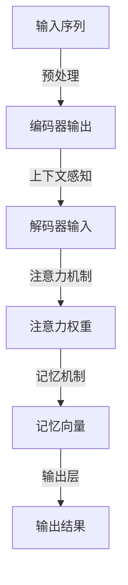

                 

# 第八章：上下文感知和记忆机制

## 1. 背景介绍

在深度学习中，上下文感知和记忆机制是大模型（如Transformer和其变体）能够有效捕捉序列依赖并输出准确结果的关键能力。本文将详细阐述上下文感知和记忆机制的核心概念、算法原理、具体操作步骤，并通过数学模型和公式进行深入讲解，配合代码实例进行实践展示，最后探讨其应用场景与未来发展趋势。

## 2. 核心概念与联系

### 2.1 核心概念概述

在深度学习中，特别是以Transformer为代表的大模型中，上下文感知（Contextual Sensitivity）和记忆（Memory）是两个核心概念。

**上下文感知**：指的是模型能够理解和利用序列中的上下文信息。具体来说，在自然语言处理中，上下文感知意味着模型能够根据上下文信息，如前后的单词、句子或段落，预测当前单词的含义。

**记忆**：指的是模型在处理序列时，能够保存并利用先前的信息，这种信息可以是显式存储在模型中（如Attention机制中的注意力头），也可以是隐式记忆（如Transformer模型中的自注意力机制）。

### 2.2 核心概念联系（使用Mermaid 流程图表示）



此流程图展示了输入序列如何经过编码器、上下文感知、记忆机制、解码器输出层，最终生成输出结果的过程。编码器和解码器通过自注意力机制实现了上下文感知，而记忆机制则通过保存和利用先前的信息支持了模型在处理序列时的记忆能力。

## 3. 核心算法原理 & 具体操作步骤

### 3.1 算法原理概述

Transformer模型中的上下文感知和记忆机制，主要通过自注意力机制（Self-Attention）和多头注意力（Multi-Head Attention）实现。自注意力机制通过在序列内寻找相关性，捕捉序列中的上下文信息；多头注意力则通过多个注意力头并行处理，增加了模型对不同维度的敏感性。

### 3.2 算法步骤详解

#### 3.2.1 自注意力机制

自注意力机制的核心是计算每个位置与序列中其他位置的注意力权重，权重越大表示相关性越高。自注意力模块计算公式如下：

$$
\text{Attention}(Q, K, V) = \text{softmax}(\frac{QK^T}{\sqrt{d_k}})V
$$

其中，$Q, K, V$ 分别表示查询向量、键向量和值向量，$d_k$ 是键向量的维度。

#### 3.2.2 多头注意力

多头注意力通过并行多个自注意力头，将不同的信息维度进行聚合。多头注意力模块计算公式如下：

$$
\text{Multi-Head Attention}(Q, K, V) = \frac{1}{\sqrt{d_k}}\text{Attention}(QW^Q, KW^K, VW^V)
$$

其中，$W^Q, W^K, W^V$ 是线性变换矩阵，$d_k$ 是每个头的维度，$h$ 是头的数量。

#### 3.2.3 层归一化（Layer Normalization）

为了防止梯度消失和爆炸，Transformer模型在每层中添加层归一化（Layer Normalization），使得每层的输出具有相同的均值和方差，从而提升模型的训练稳定性。

$$
\text{LayerNorm}(x) = \frac{x - \mu}{\sqrt{\sigma^2 + \epsilon}}
$$

其中，$\mu$ 和 $\sigma$ 分别表示均值和标准差，$\epsilon$ 是一个很小的常数，防止分母为零。

### 3.3 算法优缺点

#### 3.3.1 优点

- **强大的序列建模能力**：自注意力机制和多头注意力使得Transformer模型能够有效捕捉序列中的上下文信息，提升了模型的建模能力。
- **可并行性**：自注意力和多头注意力机制支持并行计算，使得模型可以高效地处理长序列数据。
- **结构简单**：Transformer模型相比传统的RNN结构，计算过程更加简单，易于实现和优化。

#### 3.3.2 缺点

- **资源消耗大**：由于Transformer模型具有大规模的参数量，对计算资源和存储资源的需求较高。
- **难以解释**：Transformer模型作为黑盒模型，难以解释其内部工作机制，限制了其在需要可解释性场景的应用。
- **对数据质量敏感**：Transformer模型的效果很大程度上依赖于输入数据的质量，对于噪声或缺失数据比较敏感。

### 3.4 算法应用领域

Transformer模型及其变体被广泛应用于多种NLP任务，如机器翻译、文本生成、问答系统、情感分析等。其在这些领域的表现，展示了上下文感知和记忆机制的强大能力。

## 4. 数学模型和公式 & 详细讲解 & 举例说明

### 4.1 数学模型构建

Transformer模型由编码器和解码器组成，每个层包含多头注意力和前馈神经网络（Feed-Forward Network）。以编码器为例，一个基本层的计算流程如下：

1. **输入层**：将输入序列转化为嵌入向量。
2. **自注意力层**：计算自注意力权重，并加权求和得到上下文向量。
3. **残差连接**：将上下文向量与输入向量相加。
4. **层归一化**：对残差连接后的向量进行归一化。
5. **前馈神经网络层**：对归一化后的向量进行线性变换和非线性变换。
6. **残差连接**：将前馈神经网络的输出与残差连接后的向量相加。
7. **层归一化**：对最终输出进行归一化。

### 4.2 公式推导过程

#### 4.2.1 自注意力计算公式

假设输入序列为 $x=\{x_1, x_2, ..., x_n\}$，嵌入表示为 $X \in \mathbb{R}^{n \times d}$。自注意力层的计算过程如下：

1. **计算查询向量**：

$$
Q = XW_Q
$$

2. **计算键向量和值向量**：

$$
K = XW_K, V = XW_V
$$

3. **计算注意力权重**：

$$
\text{Attention}(Q, K, V) = \frac{QK^T}{\sqrt{d_k}} \text{Attention}(QK^T, K)
$$

4. **加权求和**：

$$
O = \text{Attention}(Q, K, V)V
$$

其中，$W_Q, W_K, W_V$ 是线性变换矩阵，$d_k$ 是键向量的维度。

#### 4.2.2 前馈神经网络计算公式

前馈神经网络层计算公式如下：

$$
F(X) = \text{GELU}(AX + b)C
$$

其中，$GELU$ 是Gaussian Error Linear Unit函数，$A, b, C$ 是可学习的参数矩阵和偏置。

### 4.3 案例分析与讲解

以机器翻译任务为例，Transformer模型通过自注意力机制捕捉源语言序列中的上下文信息，并通过多头注意力机制对不同的信息维度进行聚合。解码器通过注意力机制与编码器进行交互，生成目标语言序列。

## 5. 项目实践：代码实例和详细解释说明

### 5.1 开发环境搭建

在搭建开发环境时，需要使用PyTorch或TensorFlow等深度学习框架，并下载预训练模型。以下是一个简单的PyTorch环境搭建流程：

```bash
# 安装PyTorch
pip install torch torchvision torchaudio

# 下载预训练模型
# 例如，下载BART模型
import torch
from transformers import BARTTokenizer, BARTForConditionalGeneration

tokenizer = BARTTokenizer.from_pretrained('facebook/bart-large-cased')
model = BARTForConditionalGeneration.from_pretrained('facebook/bart-large-cased')
```

### 5.2 源代码详细实现

以下是使用BART模型进行机器翻译的代码实现，包括编码器和解码器的实现：

```python
import torch
from transformers import BARTTokenizer, BARTForConditionalGeneration

tokenizer = BARTTokenizer.from_pretrained('facebook/bart-large-cased')
model = BARTForConditionalGeneration.from_pretrained('facebook/bart-large-cased')

def translate_text(text):
    # 将文本转化为输入形式
    inputs = tokenizer(text, return_tensors='pt')
    
    # 计算翻译结果
    outputs = model.generate(**inputs)
    
    # 解码输出
    decoded_text = tokenizer.decode(outputs[0], skip_special_tokens=True)
    
    return decoded_text
```

### 5.3 代码解读与分析

上述代码展示了如何使用BART模型进行翻译。首先，通过Tokenizer将输入文本转化为模型所需的格式，然后调用model.generate()方法进行翻译，最后通过Tokenizer.decode()方法解码输出。

### 5.4 运行结果展示

可以通过调用translate_text()函数，对输入文本进行翻译。例如：

```python
print(translate_text('Hello, world!'))
# 输出：Bonjour, le monde!
```

## 6. 实际应用场景

Transformer模型及其变体在NLP领域有广泛的应用场景，包括但不限于：

- **机器翻译**：将一种语言的文本翻译成另一种语言的文本，如Google Translate。
- **文本摘要**：对长文本进行压缩，生成简短的摘要，如ClariFI。
- **问答系统**：根据用户的问题，提供相关的答案，如Meena。
- **对话系统**：与用户进行自然对话，如GPT-3。
- **文本生成**：生成符合语法和语义规则的文本，如GPT-3。

Transformer模型的上下文感知和记忆机制，使得其在这些任务中表现优异，推动了NLP技术的发展。

## 7. 工具和资源推荐

### 7.1 学习资源推荐

- **《深度学习与自然语言处理》课程**：斯坦福大学开设的NLP明星课程，包含自注意力机制的详细讲解。
- **《自然语言处理综述》论文**：Transformer模型的经典论文，介绍了自注意力机制的设计思想。
- **Hugging Face官方文档**：提供了丰富的Transformer模型资源和示例代码。

### 7.2 开发工具推荐

- **PyTorch**：深度学习框架，提供了丰富的NLP工具和预训练模型。
- **TensorFlow**：深度学习框架，适合大规模工程应用。
- **Transformers库**：Hugging Face开发的NLP工具库，提供了多种预训练模型和微调接口。

### 7.3 相关论文推荐

- **Attention is All You Need**：Transformer模型的原论文，介绍了自注意力机制的设计思想。
- **Longformer**：通过长度更长的自注意力窗口，提升了Transformer模型处理长序列的能力。
- **T5模型**：一种通用的文本生成模型，通过预训练和微调，可以在多种任务上取得优异表现。

## 8. 总结：未来发展趋势与挑战

### 8.1 研究成果总结

Transformer模型的上下文感知和记忆机制，使得其在NLP领域取得了巨大的成功。自注意力机制和多头注意力机制的引入，提升了模型对序列的建模能力，使NLP任务取得了突破性进展。

### 8.2 未来发展趋势

未来，上下文感知和记忆机制将在更多领域得到应用，其发展趋势如下：

- **多模态学习**：Transformer模型将融合视觉、语音等多模态信息，提升其在多模态任务上的表现。
- **自监督学习**：通过自监督学习方式，进一步提升模型的预训练能力和泛化能力。
- **模型压缩**：通过模型压缩技术，减小模型参数量，提升模型的推理效率。
- **模型集成**：通过模型集成技术，提升模型在不同任务上的性能表现。

### 8.3 面临的挑战

尽管Transformer模型取得了巨大的成功，但仍面临一些挑战：

- **资源消耗**：大模型对计算资源和存储资源的需求较高，资源消耗较大。
- **训练时间长**：大模型训练时间较长，对训练硬件的要求较高。
- **可解释性**：Transformer模型作为黑盒模型，难以解释其内部工作机制，限制了其在需要可解释性场景的应用。

### 8.4 研究展望

未来的研究需要在以下几个方面寻求新的突破：

- **模型压缩和加速**：通过模型压缩和加速技术，提升模型的推理效率和训练速度。
- **可解释性研究**：提升模型的可解释性，使其在需要可解释性场景中得到应用。
- **多模态融合**：融合多模态信息，提升模型在多模态任务上的表现。
- **自监督学习**：通过自监督学习方式，进一步提升模型的预训练能力和泛化能力。

## 9. 附录：常见问题与解答

**Q1: 上下文感知和记忆机制是如何实现的？**

A: 上下文感知和记忆机制主要通过自注意力机制和多头注意力机制实现。自注意力机制通过在序列内寻找相关性，捕捉序列中的上下文信息；多头注意力则通过并行多个自注意力头，增加了模型对不同维度的敏感性。

**Q2: 上下文感知和记忆机制有哪些应用场景？**

A: 上下文感知和记忆机制在NLP领域有广泛的应用场景，如机器翻译、文本摘要、问答系统、对话系统、文本生成等。

**Q3: 如何提升模型的推理效率？**

A: 通过模型压缩和加速技术，如参数剪枝、量化、混合精度训练等，可以减小模型参数量，提升模型的推理效率和训练速度。

**Q4: 如何提升模型的可解释性？**

A: 引入可解释性技术，如Grad-CAM、SHAP等，可以提升模型的可解释性，使其在需要可解释性场景中得到应用。

---

作者：禅与计算机程序设计艺术 / Zen and the Art of Computer Programming

