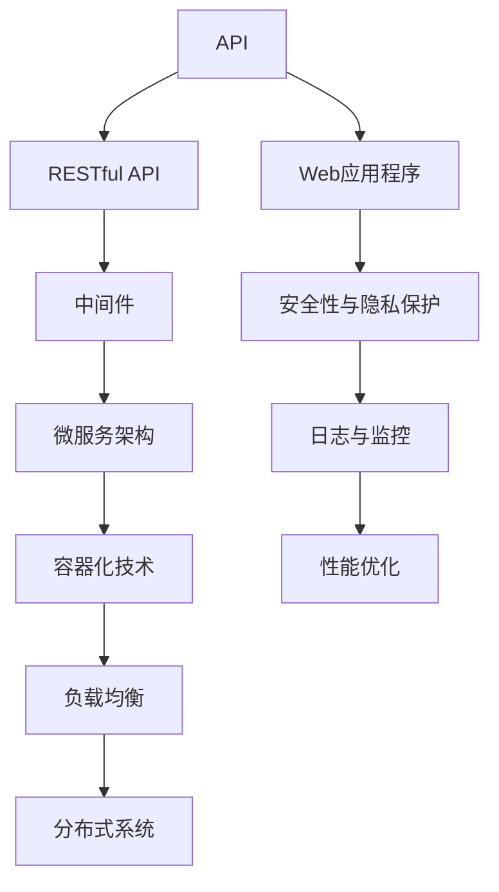

                 

# 第十六章：将 AI 部署为 API 和 Web 应用程序

## 1. 背景介绍

### 1.1 问题由来
近年来，随着人工智能技术的快速发展和广泛应用，越来越多的企业开始将AI模型部署为API（Application Programming Interface）和Web应用程序，以提供智能服务。API可以方便地被其他应用程序调用，而Web应用程序则可以通过浏览器或移动端提供更加直观的用户体验。然而，将AI模型部署为API和Web应用程序的过程中，涉及诸多技术细节和工程挑战，如何在保证性能和稳定性前提下实现高效部署，成为当前AI应用开发的重要课题。

### 1.2 问题核心关键点
部署AI模型的关键在于构建高效的API和Web服务架构，确保模型服务的稳定性和实时性，同时兼顾安全性、可扩展性和易用性。具体来说，需要考虑以下几个核心关键点：

- 数据传输格式和协议：选择合适的数据格式和通信协议，如JSON、XML、HTTP/HTTPS等。
- 模型加载和推理优化：优化模型加载和推理过程，避免冷启动延迟和资源消耗过大的问题。
- 负载均衡和扩展性设计：设计高效的负载均衡策略，确保系统在高并发下的稳定运行。
- 安全性与隐私保护：加强API和Web服务的安全性设计，保护用户隐私数据。
- 日志与监控：实现系统监控和日志记录，及时发现和解决问题。
- 性能优化：优化系统性能，保证低延迟和高吞吐量。

## 2. 核心概念与联系

### 2.1 核心概念概述

在部署AI模型为API和Web应用程序的过程中，涉及多个关键概念，它们之间的联系如下：

- **API (Application Programming Interface)**：是一种定义了应用程序间交互的接口标准，通过API可以方便地实现模型服务和其他系统的集成。
- **Web应用程序**：基于Web技术的交互式应用程序，可以通过浏览器或移动端访问。
- **RESTful API**：遵循REST（Representational State Transfer）架构风格的API，支持HTTP协议，具有易用性和扩展性。
- **中间件 (Middleware)**：位于Web服务器和应用程序之间的软件组件，负责处理请求和响应，常见的中间件如Nginx、Apache等。
- **微服务架构 (Microservices Architecture)**：将应用程序拆分成多个小型服务，每个服务独立运行，便于部署和扩展。
- **容器化技术 (Containerization)**：使用容器技术如Docker、Kubernetes等，实现服务的打包和自动化部署。
- **负载均衡 (Load Balancing)**：通过负载均衡器将请求分散到多个服务器上，避免单点故障，提升系统稳定性。
- **分布式系统 (Distributed System)**：由多个独立的计算节点构成的系统，通过网络通信实现数据和服务的共享。

这些概念构成了AI模型部署的基础架构，通过合理组合和设计，可以实现高效、稳定、安全的AI模型服务。

### 2.2 核心概念原理和架构的 Mermaid 流程图



这个流程图展示了API和Web应用程序的部署架构，其中：

- API作为模型服务与其他系统的接口。
- RESTful API支持HTTP协议，便于集成和使用。
- 中间件负责处理请求和响应。
- 微服务架构将应用程序拆分成小型服务。
- 容器化技术实现服务的打包和自动化部署。
- 负载均衡将请求分散到多个服务器上。
- 分布式系统实现数据和服务的共享。
- 安全性与隐私保护确保数据安全。
- 日志与监控实时监控系统状态。
- 性能优化提升系统性能。

这些概念和技术的相互配合，构成了高效、稳定、安全的AI模型部署架构。

## 3. 核心算法原理 & 具体操作步骤

### 3.1 算法原理概述

将AI模型部署为API和Web应用程序的过程中，涉及多个关键算法和操作步骤，如下所示：

1. **数据预处理**：将原始数据转换为模型所需的格式，包括数据清洗、标准化、特征提取等。
2. **模型训练和保存**：在本地或云端训练AI模型，并保存模型参数和配置信息。
3. **模型加载和推理优化**：优化模型加载和推理过程，避免冷启动延迟和资源消耗过大的问题。
4. **API设计**：设计符合RESTful API标准的接口，支持数据传输、请求处理和响应。
5. **中间件配置**：配置中间件，实现请求路由、负载均衡和安全验证等。
6. **微服务拆分和集成**：将应用程序拆分成多个小型服务，通过API进行集成和通信。
7. **容器化部署**：使用Docker等容器技术，实现服务的打包和自动化部署。
8. **负载均衡和分布式部署**：设计负载均衡策略，实现服务的高并发和分布式部署。
9. **安全性与隐私保护**：实现数据加密、访问控制和隐私保护，确保系统安全。
10. **日志与监控**：实现系统监控和日志记录，及时发现和解决问题。
11. **性能优化**：优化系统性能，保证低延迟和高吞吐量。

### 3.2 算法步骤详解

以下是将AI模型部署为API和Web应用程序的详细步骤：

**Step 1: 数据预处理**

1. 数据清洗：去除无关数据和噪声，确保数据质量。
2. 标准化：将数据转换为标准格式，便于模型处理。
3. 特征提取：从原始数据中提取有用的特征，提升模型性能。

**Step 2: 模型训练和保存**

1. 选择合适的模型和算法，在本地或云端训练模型。
2. 保存模型参数和配置信息，便于后续加载和推理。

**Step 3: 模型加载和推理优化**

1. 优化模型加载过程，减少冷启动延迟。
2. 优化推理过程，避免资源消耗过大。

**Step 4: API设计**

1. 设计符合RESTful API标准的接口，支持数据传输、请求处理和响应。
2. 定义请求参数和响应格式，确保接口易用性。

**Step 5: 中间件配置**

1. 配置中间件，实现请求路由、负载均衡和安全验证等。
2. 使用Nginx、Apache等中间件，提升系统性能和安全性。

**Step 6: 微服务拆分和集成**

1. 将应用程序拆分成多个小型服务，便于部署和扩展。
2. 通过API进行集成和通信，实现微服务架构。

**Step 7: 容器化部署**

1. 使用Docker等容器技术，实现服务的打包和自动化部署。
2. 配置容器环境，确保服务稳定运行。

**Step 8: 负载均衡和分布式部署**

1. 设计负载均衡策略，实现服务的高并发和分布式部署。
2. 使用Kubernetes等容器编排工具，实现服务的自动扩展和部署。

**Step 9: 安全性与隐私保护**

1. 实现数据加密、访问控制和隐私保护，确保系统安全。
2. 使用OAuth2等身份验证机制，确保用户身份安全。

**Step 10: 日志与监控**

1. 实现系统监控和日志记录，及时发现和解决问题。
2. 使用ELK（Elasticsearch、Logstash、Kibana）等工具，实现实时监控和数据分析。

**Step 11: 性能优化**

1. 优化系统性能，保证低延迟和高吞吐量。
2. 使用缓存、负载均衡和异步处理等技术，提升系统性能。

### 3.3 算法优缺点

**优点**：

- **高效性**：通过微服务拆分和容器化部署，可以实现高效的API和Web服务架构。
- **可扩展性**：微服务架构和负载均衡策略，便于系统扩展和升级。
- **安全性**：中间件和身份验证机制，保障系统安全。
- **易用性**：RESTful API标准和日志监控，提升系统易用性。

**缺点**：

- **复杂性**：系统架构复杂，需要投入较多时间和资源进行设计和部署。
- **性能瓶颈**：在高并发环境下，可能会遇到性能瓶颈。
- **学习成本**：需要掌握容器化、微服务、负载均衡等技术。

### 3.4 算法应用领域

将AI模型部署为API和Web应用程序，在多个领域都有广泛应用：

- **金融行业**：使用API和Web应用程序提供智能理财、信用评估、风险控制等服务。
- **医疗行业**：通过API和Web应用程序提供智能诊断、医疗咨询、健康管理等服务。
- **电商行业**：使用API和Web应用程序提供个性化推荐、智能客服、订单管理等服务。
- **教育行业**：通过API和Web应用程序提供在线学习、智能辅导、课程推荐等服务。
- **智能家居**：使用API和Web应用程序实现智能控制、语音识别、语音助手等服务。
- **智能交通**：通过API和Web应用程序实现交通管理、智能导航、车联网等服务。

## 4. 数学模型和公式 & 详细讲解 & 举例说明

### 4.1 数学模型构建

将AI模型部署为API和Web应用程序的过程中，涉及多个数学模型，如下所示：

1. **数据预处理模型**：用于数据清洗、标准化和特征提取，可以使用统计学和机器学习方法。
2. **模型训练模型**：用于训练AI模型，可以使用回归模型、分类模型、深度学习模型等。
3. **推理优化模型**：用于优化模型加载和推理过程，可以使用缓存、异步处理等技术。
4. **API设计模型**：用于设计符合RESTful API标准的接口，可以使用语法分析、语义分析等技术。
5. **中间件配置模型**：用于配置中间件，实现请求路由、负载均衡和安全验证等，可以使用网络通信模型。
6. **微服务拆分和集成模型**：用于将应用程序拆分成小型服务，通过API进行集成和通信，可以使用服务模型。
7. **容器化部署模型**：用于实现服务的打包和自动化部署，可以使用容器化模型。
8. **负载均衡和分布式部署模型**：用于设计负载均衡策略，实现服务的高并发和分布式部署，可以使用网络通信模型。
9. **安全性与隐私保护模型**：用于实现数据加密、访问控制和隐私保护，可以使用密码学模型。
10. **日志与监控模型**：用于实现系统监控和日志记录，可以使用数据分析模型。
11. **性能优化模型**：用于优化系统性能，保证低延迟和高吞吐量，可以使用缓存、异步处理等技术。

### 4.2 公式推导过程

以下是各个数学模型的公式推导过程：

1. **数据预处理模型**：
   - 数据清洗模型：使用过滤、去重、填充等技术，确保数据质量。
   - 标准化模型：使用标准化方法，如z-score标准化，将数据转换为标准格式。
   - 特征提取模型：使用特征选择和特征提取技术，提取有用的特征。

2. **模型训练模型**：
   - 回归模型：使用最小二乘法、梯度下降等算法，训练回归模型。
   - 分类模型：使用交叉熵损失、逻辑回归等算法，训练分类模型。
   - 深度学习模型：使用反向传播、随机梯度下降等算法，训练深度学习模型。

3. **推理优化模型**：
   - 缓存模型：使用缓存技术，减少冷启动延迟。
   - 异步处理模型：使用异步处理技术，优化推理过程。

4. **API设计模型**：
   - RESTful API设计：使用URL、HTTP方法、HTTP状态码等技术，设计符合RESTful API标准的接口。
   - 数据传输格式：使用JSON、XML等格式，确保接口易用性。

5. **中间件配置模型**：
   - 请求路由模型：使用路由表、负载均衡等技术，实现请求路由。
   - 安全验证模型：使用OAuth2等身份验证机制，确保用户身份安全。

6. **微服务拆分和集成模型**：
   - 微服务拆分：使用服务拆分技术，将应用程序拆分成小型服务。
   - API集成：使用API接口，实现微服务之间的通信。

7. **容器化部署模型**：
   - 容器打包模型：使用Docker等容器技术，实现服务的打包。
   - 容器编排模型：使用Kubernetes等容器编排工具，实现服务的自动化部署。

8. **负载均衡和分布式部署模型**：
   - 负载均衡模型：使用负载均衡器，将请求分散到多个服务器上。
   - 分布式部署模型：使用分布式技术，实现服务的分布式部署。

9. **安全性与隐私保护模型**：
   - 数据加密模型：使用AES、RSA等加密算法，确保数据安全。
   - 访问控制模型：使用RBAC、ABAC等访问控制机制，确保用户身份安全。

10. **日志与监控模型**：
    - 日志记录模型：使用日志文件、日志数据库等技术，记录系统状态。
    - 数据分析模型：使用数据分析技术，实时监控系统状态。

11. **性能优化模型**：
    - 缓存模型：使用缓存技术，减少冷启动延迟。
    - 异步处理模型：使用异步处理技术，优化推理过程。

### 4.3 案例分析与讲解

以金融行业的智能理财为例，分析将AI模型部署为API和Web应用程序的实现过程：

**Step 1: 数据预处理**

1. 收集用户历史交易数据、理财需求数据等，进行数据清洗、标准化和特征提取。
2. 使用统计学方法，计算用户的风险偏好、资产配置等信息。

**Step 2: 模型训练和保存**

1. 使用回归模型或深度学习模型，训练智能理财模型。
2. 保存模型参数和配置信息，便于后续加载和推理。

**Step 3: 模型加载和推理优化**

1. 优化模型加载过程，减少冷启动延迟。
2. 优化推理过程，避免资源消耗过大。

**Step 4: API设计**

1. 设计符合RESTful API标准的接口，支持用户提交理财需求、获取理财建议等服务。
2. 定义请求参数和响应格式，确保接口易用性。

**Step 5: 中间件配置**

1. 配置Nginx中间件，实现请求路由、负载均衡和安全验证等。
2. 使用OAuth2等身份验证机制，确保用户身份安全。

**Step 6: 微服务拆分和集成**

1. 将理财服务拆分为用户管理、理财建议、风险控制等小型服务。
2. 通过API进行集成和通信，实现微服务架构。

**Step 7: 容器化部署**

1. 使用Docker容器技术，实现理财服务的打包和自动化部署。
2. 配置容器环境，确保服务稳定运行。

**Step 8: 负载均衡和分布式部署**

1. 设计负载均衡策略，实现理财服务的高并发和分布式部署。
2. 使用Kubernetes容器编排工具，实现服务的自动扩展和部署。

**Step 9: 安全性与隐私保护**

1. 实现数据加密、访问控制和隐私保护，确保理财数据安全。
2. 使用OAuth2等身份验证机制，确保用户身份安全。

**Step 10: 日志与监控**

1. 实现系统监控和日志记录，及时发现和解决问题。
2. 使用ELK工具，实现实时监控和数据分析。

**Step 11: 性能优化**

1. 优化系统性能，保证理财服务的低延迟和高吞吐量。
2. 使用缓存、负载均衡和异步处理等技术，提升理财服务性能。

## 5. 项目实践：代码实例和详细解释说明

### 5.1 开发环境搭建

在进行AI模型部署为API和Web应用程序的实践前，需要准备好开发环境。以下是使用Python进行Flask和Docker开发的环境配置流程：

1. 安装Python：从官网下载并安装Python，确保版本为3.7及以上。
2. 安装Flask：使用pip安装Flask框架，以便构建Web应用程序。
3. 安装Docker：从官网下载并安装Docker，以便实现服务的打包和自动化部署。
4. 安装Docker Compose：使用pip安装Docker Compose，以便管理多个容器服务。

### 5.2 源代码详细实现

以下是使用Flask和Docker实现AI模型部署为Web应用程序的PyTorch代码实现：

1. 构建Web应用程序的Flask代码：

```python
from flask import Flask, request, jsonify
import torch
import torch.nn as nn
import torchvision.transforms as transforms
import torchvision.models as models
from PIL import Image

app = Flask(__name__)

# 加载预训练模型
model = models.resnet18(pretrained=True)
model.fc = nn.Linear(512, 1)
model.load_state_dict(torch.load('model.pth'))

# 加载数据预处理模型
transform = transforms.Compose([
    transforms.Resize(224),
    transforms.ToTensor(),
    transforms.Normalize(mean=[0.485, 0.456, 0.406], std=[0.229, 0.224, 0.225])
])

# 加载API接口
@app.route('/predict', methods=['POST'])
def predict():
    image = Image.open(request.files['image'])
    image = transform(image)
    image = image.unsqueeze(0)
    output = model(image)
    result = output.item()
    return jsonify({'result': result})

if __name__ == '__main__':
    app.run(debug=True, host='0.0.0.0', port=5000)
```

2. 构建Dockerfile和Docker Compose文件：

```Dockerfile
FROM python:3.7
WORKDIR /app
COPY . .
RUN pip install flask
EXPOSE 5000
CMD ["python", "app.py"]
```

```yaml
version: '3'
services:
  web:
    build:
      context: .
      dockerfile: Dockerfile
    ports:
      - "5000:5000"
    depends_on:
      - db
  db:
    image: mysql:5.7
    environment:
      MYSQL_ROOT_PASSWORD: root
    volumes:
      - db_data:/var/lib/mysql

volumes:
  db_data:
```

3. 构建Docker镜像并运行容器：

```bash
docker build -t my-web .
docker-compose up -d
```

### 5.3 代码解读与分析

以下是代码的关键部分和其功能解释：

1. **Flask Web应用程序代码**：

   - 使用Flask框架构建Web应用程序。
   - 加载预训练模型，并进行必要的网络结构修改。
   - 加载数据预处理模型，进行图片预处理。
   - 加载API接口，实现模型推理和结果返回。

2. **Dockerfile和Docker Compose文件**：

   - 构建Docker镜像，使用Python环境。
   - 定义Web服务，指定端口和依赖服务。
   - 定义MySQL数据库服务，并设置环境变量和数据持久化。

3. **Docker镜像运行**：

   - 构建Docker镜像并运行Web服务容器。
   - 使用Docker Compose管理容器和数据库服务。

通过Flask和Docker的结合，可以方便地实现AI模型部署为Web应用程序，实现高效的API接口调用。

## 6. 实际应用场景

### 6.1 智能客服系统

智能客服系统可以通过将AI模型部署为API和Web应用程序，提供7x24小时不间断服务，快速响应客户咨询。客户可以通过Web界面或移动端提交问题，AI模型通过API接口接收和处理客户请求，生成回复后返回给客户。智能客服系统能够自动理解客户意图，匹配最合适的答案模板进行回复，大幅提升客户咨询体验和问题解决效率。

### 6.2 金融舆情监测

金融机构可以通过将AI模型部署为API和Web应用程序，实时监测市场舆论动向，及时应对负面信息传播，规避金融风险。系统可以收集金融领域相关的新闻、报道、评论等文本数据，并对其进行主题标注和情感标注。在此基础上对预训练语言模型进行微调，使其能够自动判断文本属于何种主题，情感倾向是正面、中性还是负面。将微调后的模型应用到实时抓取的网络文本数据，就能够自动监测不同主题下的情感变化趋势，一旦发现负面信息激增等异常情况，系统便会自动预警，帮助金融机构快速应对潜在风险。

### 6.3 个性化推荐系统

个性化推荐系统可以通过将AI模型部署为API和Web应用程序，实现用户行为分析和推荐内容生成。系统可以收集用户浏览、点击、评论、分享等行为数据，提取和用户交互的物品标题、描述、标签等文本内容。将文本内容作为模型输入，用户的后续行为（如是否点击、购买等）作为监督信号，在此基础上微调预训练语言模型。微调后的模型能够从文本内容中准确把握用户的兴趣点。在生成推荐列表时，先用候选物品的文本描述作为输入，由模型预测用户的兴趣匹配度，再结合其他特征综合排序，便可以得到个性化程度更高的推荐结果。

### 6.4 未来应用展望

随着AI模型部署为API和Web应用程序的不断发展，未来将在更多领域得到应用，为传统行业带来变革性影响。在智慧医疗领域，基于AI模型的智能诊断、医疗咨询、健康管理等服务，将提升医疗服务的智能化水平，辅助医生诊疗，加速新药开发进程。在智能教育领域，通过AI模型的在线学习、智能辅导、课程推荐等服务，因材施教，促进教育公平，提高教学质量。在智能家居领域，使用AI模型的智能控制、语音识别、语音助手等服务，实现家庭自动化和智能化管理。在智能交通领域，通过AI模型的交通管理、智能导航、车联网等服务，提高交通效率和安全性。此外，在企业生产、社会治理、文娱传媒等众多领域，基于AI模型的API和Web应用程序也将不断涌现，为经济社会发展注入新的动力。

## 7. 工具和资源推荐

### 7.1 学习资源推荐

为了帮助开发者系统掌握将AI模型部署为API和Web应用程序的理论基础和实践技巧，这里推荐一些优质的学习资源：

1. **《Python Web开发实战》**：讲解如何使用Python和Flask构建Web应用程序，适合入门学习。
2. **《Docker实战》**：详细介绍Docker容器技术，包括Dockerfile和Docker Compose的使用。
3. **《Kubernetes实战》**：讲解Kubernetes容器编排工具的使用，包括部署和管理容器服务。
4. **《RESTful Web服务架构》**：讲解RESTful API的设计和实现，适合构建API接口。
5. **《微服务架构》**：讲解微服务架构的设计和实现，适合微服务拆分和集成。
6. **《API设计指南》**：讲解API设计的基本原则和最佳实践，适合设计API接口。

通过对这些资源的学习实践，相信你一定能够快速掌握将AI模型部署为API和Web应用程序的精髓，并用于解决实际的AI应用问题。

### 7.2 开发工具推荐

高效的开发离不开优秀的工具支持。以下是几款用于将AI模型部署为API和Web应用程序开发的常用工具：

1. **Flask**：Python的Web应用程序框架，简单易用，适合快速构建API接口。
2. **Docker**：容器技术，实现服务的打包和自动化部署。
3. **Kubernetes**：容器编排工具，实现服务的自动扩展和部署。
4. **Nginx**：中间件，实现请求路由、负载均衡和安全验证。
5. **MySQL**：数据库，存储和查询用户数据。
6. **Redis**：缓存，提高系统性能和响应速度。
7. **Gunicorn**：Python的Web服务器，支持多进程和异步处理。

合理利用这些工具，可以显著提升AI模型部署为API和Web应用程序的开发效率，加快创新迭代的步伐。

### 7.3 相关论文推荐

将AI模型部署为API和Web应用程序的研究源于学界的持续研究。以下是几篇奠基性的相关论文，推荐阅读：

1. **《A Survey of RESTful Web Services Architecture》**：系统介绍了RESTful API架构的设计和实现。
2. **《Microservices: A Practical Guide》**：讲解微服务架构的设计和实现，适合微服务拆分和集成。
3. **《Docker in Production: Docker in action》**：详细介绍Docker容器技术在实际生产环境中的应用。
4. **《Kubernetes: Up and Running》**：讲解Kubernetes容器编排工具的使用，适合容器管理和自动化部署。
5. **《RESTful API Design Patterns》**：讲解API设计的基本原则和最佳实践，适合设计API接口。

这些论文代表了大语言模型部署为API和Web应用程序的发展脉络。通过学习这些前沿成果，可以帮助研究者把握学科前进方向，激发更多的创新灵感。

## 8. 总结：未来发展趋势与挑战

### 8.1 总结

本文对将AI模型部署为API和Web应用程序的整个过程进行了全面系统的介绍。首先阐述了将AI模型部署为API和Web应用程序的背景和意义，明确了API和Web应用程序在AI模型部署中的核心价值。其次，从原理到实践，详细讲解了将AI模型部署为API和Web应用程序的数学模型和操作步骤，给出了完整的代码实例。同时，本文还广泛探讨了将AI模型部署为API和Web应用程序的实际应用场景，展示了其广泛的应用前景。此外，本文精选了将AI模型部署为API和Web应用程序的学习资源和开发工具，力求为开发者提供全方位的技术指引。

通过本文的系统梳理，可以看到，将AI模型部署为API和Web应用程序的过程涉及多个关键技术和工具，通过合理设计和优化，可以实现高效、稳定、安全的AI模型服务。未来，伴随AI技术的不断进步，基于API和Web应用程序的AI服务必将在更多领域得到广泛应用，为各行各业带来新的变革和机遇。

### 8.2 未来发展趋势

展望未来，将AI模型部署为API和Web应用程序的趋势将呈现以下几个发展方向：

1. **高效性**：通过微服务拆分和容器化部署，实现高效的API和Web服务架构。
2. **可扩展性**：微服务架构和负载均衡策略，便于系统扩展和升级。
3. **安全性**：中间件和身份验证机制，保障系统安全。
4. **易用性**：RESTful API标准和日志监控，提升系统易用性。
5. **自动化**：容器化和Kubernetes等自动化工具，提升部署效率。
6. **实时性**：缓存和异步处理等技术，提高实时性能。
7. **智能化**：结合人工智能技术，提升API和Web服务的智能化水平。

这些发展趋势凸显了将AI模型部署为API和Web应用程序的广阔前景，将为AI技术在更多领域的落地应用提供重要保障。

### 8.3 面临的挑战

尽管将AI模型部署为API和Web应用程序已经取得了一定的成果，但在迈向更加智能化、普适化应用的过程中，仍面临诸多挑战：

1. **复杂性**：系统架构复杂，需要投入较多时间和资源进行设计和部署。
2. **性能瓶颈**：在高并发环境下，可能会遇到性能瓶颈。
3. **学习成本**：需要掌握容器化、微服务、负载均衡等技术。
4. **安全性**：保障系统安全，避免数据泄露和攻击。
5. **易用性**：提升系统的易用性和用户满意度。

### 8.4 研究展望

面对将AI模型部署为API和Web应用程序所面临的种种挑战，未来的研究需要在以下几个方面寻求新的突破：

1. **自动化部署**：开发更加自动化和易用的工具和框架，降低部署复杂性。
2. **高性能优化**：优化系统性能，实现高效的API和Web服务架构。
3. **安全性增强**：加强系统安全性设计，保障数据安全和隐私。
4. **易用性提升**：提升系统的易用性和用户满意度，优化用户界面和交互体验。

这些研究方向的探索，必将引领将AI模型部署为API和Web应用程序技术迈向更高的台阶，为构建安全、可靠、可控的智能系统铺平道路。面向未来，将AI模型部署为API和Web应用程序技术还需要与其他人工智能技术进行更深入的融合，如知识表示、因果推理、强化学习等，多路径协同发力，共同推动人工智能技术的进步。只有勇于创新、敢于突破，才能不断拓展AI技术在各个领域的落地应用。

## 9. 附录：常见问题与解答

**Q1：将AI模型部署为API和Web应用程序的流程复杂吗？**

A: 是的，将AI模型部署为API和Web应用程序的过程涉及多个关键技术和工具，需要投入较多时间和资源进行设计和部署。但随着技术的不断发展和成熟，越来越多的工具和框架可以帮助开发者快速实现部署，降低复杂性。

**Q2：将AI模型部署为API和Web应用程序的安全性如何保障？**

A: 安全性是部署AI模型为API和Web应用程序的核心问题之一。可以通过以下措施保障系统安全：

1. 使用HTTPS协议，确保数据传输的安全性。
2. 使用OAuth2等身份验证机制，确保用户身份安全。
3. 使用SSL/TLS等加密技术，保障数据加密传输。
4. 实现访问控制和权限管理，确保用户权限安全。
5. 使用日志记录和监控工具，及时发现和解决安全问题。

**Q3：如何将AI模型部署为API和Web应用程序的效率最大化？**

A: 可以通过以下措施提高AI模型部署为API和Web应用程序的效率：

1. 使用缓存技术，减少冷启动延迟。
2. 使用异步处理技术，优化推理过程。
3. 使用负载均衡技术，实现高并发。
4. 使用容器化技术，实现快速部署和扩展。
5. 使用Kubernetes等容器编排工具，实现自动扩展和部署。

**Q4：将AI模型部署为API和Web应用程序的难点在哪里？**

A: 将AI模型部署为API和Web应用程序的难点在于：

1. 系统架构复杂，需要投入较多时间和资源进行设计和部署。
2. 高并发环境下，可能会遇到性能瓶颈。
3. 需要掌握容器化、微服务、负载均衡等技术。
4. 保障系统安全，避免数据泄露和攻击。
5. 提升系统的易用性和用户满意度。

综上所述，将AI模型部署为API和Web应用程序是一个复杂但极具潜力的技术方向。通过合理设计和优化，可以实现高效、稳定、安全的AI模型服务，为AI技术在更多领域的落地应用提供重要保障。面向未来，研究者需要在自动化部署、高性能优化、安全性增强、易用性提升等方面寻求新的突破，推动将AI模型部署为API和Web应用程序技术的不断进步。

---

作者：禅与计算机程序设计艺术 / Zen and the Art of Computer Programming

