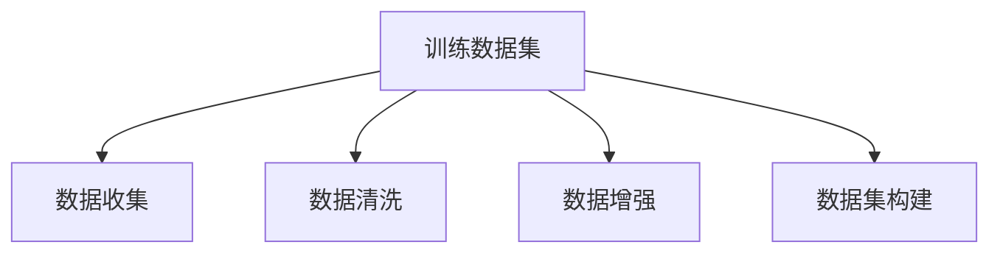

                 

# 第四章：训练数据和数据收集

> 关键词：训练数据,数据收集,数据增强,数据清洗,数据集构建

## 1. 背景介绍

### 1.1 问题由来

在人工智能领域，尤其是深度学习模型训练过程中，数据质量与数据量往往直接决定了模型性能。因此，训练数据和数据收集在模型构建中占据了极其重要的地位。训练数据集通常被称为模型学习的基础，没有高质量的数据，再复杂的模型也难以发挥其应有的潜力。

### 1.2 问题核心关键点

训练数据和数据收集的核心问题在于如何获得合适的、有足够量和质量的标注数据。标注数据的获取一般包括数据收集、清洗、标注等多个环节，需要耗费大量的人力和时间。同时，数据的不均衡、噪声等问题也影响了模型的性能。因此，如何高效、可靠地收集和构建训练数据集，是每一个AI开发者和研究人员必须面对的挑战。

### 1.3 问题研究意义

高质量的训练数据对模型性能至关重要，可以显著提高模型的泛化能力和鲁棒性。在实际应用中，训练数据的收集与处理直接影响系统的输出效果和可靠性，是构建高质量AI系统不可或缺的环节。通过对训练数据和数据收集的研究，可以提升数据集构建效率，降低成本，为模型优化和应用落地提供坚实的基础。

## 2. 核心概念与联系

### 2.1 核心概念概述

在深入讨论训练数据和数据收集的具体方法前，先简要介绍几个关键概念：

- **训练数据集**：用于训练模型的人工标注数据集，通常是模型学习的基础。训练数据集的质量、数量、多样性等会直接影响模型的学习效果。
- **数据收集**：从不同来源获取原始数据，进行预处理后，转化为可用于模型训练的标注数据的过程。数据收集的有效性和效率对训练数据集的构建至关重要。
- **数据清洗**：从原始数据中剔除噪声、处理缺失值和异常值等数据质量问题，确保数据集的高质量和高可用性。
- **数据增强**：通过对原始数据进行一系列变换，增加数据集的多样性和数量，提高模型的泛化能力。
- **数据集构建**：根据具体的任务和需求，设计合适的数据集，包括数据格式、样本分布、标注方式等，确保数据集的适用性和代表性。

这些概念之间的关系可以通过以下Mermaid流程图来展示：



该流程图展示了训练数据集的构建流程：从数据收集开始，经过数据清洗和数据增强，最终构建出适合模型训练的数据集。

## 3. 核心算法原理 & 具体操作步骤

### 3.1 算法原理概述

基于监督学习模型的训练，核心在于通过数据驱动，使模型学习到正确的预测规则。训练数据集的质量和多样性直接影响模型能否学习到泛化能力强的知识，从而在未知数据上表现良好。因此，构建高质量训练数据集，是训练高性能模型的基础。

### 3.2 算法步骤详解

构建高质量训练数据集通常包括以下几个步骤：

1. **数据收集**：从不同来源获取原始数据，包括公共数据集、网络爬虫抓取的数据、用户提供的数据等。
2. **数据清洗**：对原始数据进行清洗，包括去除噪声、处理缺失值、修正异常值等，确保数据的质量和完整性。
3. **数据标注**：根据具体的任务需求，对数据进行标注，包括分类、回归、文本生成等。标注通常需要人力，但也可以通过自动化工具辅助完成。
4. **数据增强**：通过一系列数据变换，增加数据集的多样性和数量，如旋转、缩放、裁剪、翻转等，以提高模型的泛化能力。
5. **数据集构建**：根据任务的特定需求，选择合适的数据格式、样本分布、标注方式等，构建适合模型训练的数据集。

### 3.3 算法优缺点

基于监督学习模型的训练数据和数据收集方法具有以下优点：

- **泛化能力强**：通过收集大量高质量的标注数据，模型能够在未知数据上表现良好，提升模型的泛化能力。
- **精度高**：标注数据通常经过严格筛选和校验，模型训练后的预测精度较高。
- **可解释性强**：标注数据提供了明确的标签信息，模型输出可解释性较好。

同时，该方法也存在一些局限性：

- **成本高**：高质量的标注数据获取成本较高，特别是在需要专业知识的领域。
- **数据收集难度大**：特别是一些冷门领域，数据获取难度较大，需要耗费大量时间和精力。
- **数据偏见**：标注数据可能存在偏见，影响模型的公平性和公正性。

### 3.4 算法应用领域

训练数据和数据收集方法广泛应用于各种深度学习任务中，包括但不限于：

- 图像识别：如图像分类、目标检测等，数据集包括大规模的图片和标注信息。
- 自然语言处理：如文本分类、情感分析、机器翻译等，数据集包括大规模的文本和标注信息。
- 语音识别：如语音转文字、语音情感分析等，数据集包括语音信号和文本标注。
- 推荐系统：如商品推荐、个性化推荐等，数据集包括用户行为数据和标注信息。
- 医疗诊断：如疾病诊断、医学影像分析等，数据集包括医疗数据和标注信息。

## 4. 数学模型和公式 & 详细讲解

### 4.1 数学模型构建

训练数据集通常表示为一个样本-标签对集 $\{(x_i, y_i)\}_{i=1}^N$，其中 $x_i$ 为输入样本，$y_i$ 为对应的标注标签。模型 $M$ 通过最小化损失函数 $\mathcal{L}$ 来训练，使得模型的预测输出尽可能接近真实标签：

$$
\min_{\theta} \sum_{i=1}^N \mathcal{L}(M(x_i), y_i)
$$

其中 $\theta$ 为模型参数，$\mathcal{L}$ 为损失函数。常见的损失函数包括交叉熵损失、均方误差损失等。

### 4.2 公式推导过程

以交叉熵损失为例，假设模型 $M$ 在输入 $x$ 上的输出为 $\hat{y}=M(x)$，真实标签 $y \in \{0,1\}$。则二分类交叉熵损失函数定义为：

$$
\ell(M(x),y) = -[y\log \hat{y} + (1-y)\log(1-\hat{y})]
$$

将其代入经验风险公式，得：

$$
\mathcal{L}(\theta) = -\frac{1}{N}\sum_{i=1}^N [y_i\log M(x_i)+(1-y_i)\log(1-M(x_i))]
$$

根据链式法则，损失函数对参数 $\theta_k$ 的梯度为：

$$
\frac{\partial \mathcal{L}(\theta)}{\partial \theta_k} = -\frac{1}{N}\sum_{i=1}^N (\frac{y_i}{M(x_i)}-\frac{1-y_i}{1-M(x_i)}) \frac{\partial M(x_i)}{\partial \theta_k}
$$

其中 $\frac{\partial M(x_i)}{\partial \theta_k}$ 可进一步递归展开，利用自动微分技术完成计算。

### 4.3 案例分析与讲解

以图像识别任务为例，训练数据集通常包括大规模的图片和标注信息。假设有一个包含1000个类别、每个类别有1000张图片的训练数据集。训练数据集的构建过程如下：

1. **数据收集**：从ImageNet、COCO等公共数据集中获取大规模图片数据。
2. **数据清洗**：对图片进行去噪、修正异常值、处理缺失值等操作，确保数据质量。
3. **数据标注**：由专家或标注工具对图片进行分类标注，如 dog、cat 等。
4. **数据增强**：通过旋转、缩放、翻转等变换，增加数据集的多样性。
5. **数据集构建**：将标注后的图片数据存储为合适格式，构建适合深度学习模型训练的数据集。

## 5. 项目实践：代码实例和详细解释说明

### 5.1 开发环境搭建

在进行训练数据和数据收集的实践前，我们需要准备好开发环境。以下是使用Python进行数据处理和构建的开发环境配置流程：

1. 安装Anaconda：从官网下载并安装Anaconda，用于创建独立的Python环境。
2. 创建并激活虚拟环境：
```bash
conda create -n data-env python=3.8 
conda activate data-env
```

3. 安装必要的Python库：
```bash
pip install pandas numpy scikit-learn matplotlib tqdm jupyter notebook ipython
```

4. 配置数据收集和处理工具：
```bash
pip install beautifulsoup4 requests
```

完成上述步骤后，即可在`data-env`环境中进行数据处理和构建。

### 5.2 源代码详细实现

下面我们以一个简单的文本分类任务为例，给出使用Python进行数据处理和构建的代码实现。

```python
import pandas as pd
import numpy as np
from sklearn.model_selection import train_test_split

# 读取数据
data = pd.read_csv('data.csv')

# 数据清洗
data = data.dropna()  # 去除缺失值
data = data.drop_duplicates()  # 去除重复记录

# 数据标注
data['label'] = data['category'].astype('category').cat.codes  # 将分类变量转化为数字标签

# 数据增强
data_augmented = data.copy()
data_augmented['text'] = data_augmented['text'].apply(lambda x: x + ' ' + str(np.random.randint(0, 100)))  # 在文本后添加随机数字

# 划分训练集和测试集
train_data, test_data = train_test_split(data, test_size=0.2)

# 保存数据集
train_data.to_csv('train_data.csv', index=False)
test_data.to_csv('test_data.csv', index=False)
```

### 5.3 代码解读与分析

这段代码实现了一个简单的数据清洗和构建流程，主要步骤如下：

1. **数据读取**：使用Pandas库读取CSV格式的数据文件，读取后存储为DataFrame对象。
2. **数据清洗**：通过dropna()和drop_duplicates()函数去除缺失值和重复记录，确保数据质量和一致性。
3. **数据标注**：将分类变量转化为数字标签，便于模型训练。
4. **数据增强**：通过在文本后添加随机数字，增加数据多样性。
5. **数据划分**：使用train_test_split()函数将数据集划分为训练集和测试集，便于模型评估和测试。
6. **数据保存**：将处理后的数据保存为CSV文件，便于后续处理和加载。

这段代码非常简洁，但涵盖了数据处理和构建的基本步骤。在实际应用中，还需要根据具体的任务需求进行更多细节处理，如数据格式转换、标注方式设计等。

## 6. 实际应用场景

### 6.1 智能客服系统

智能客服系统需要大量的历史对话数据，用于训练和优化对话模型。这些数据通常通过网络爬虫获取，需要进行清洗、标注和增强，构建高质量的数据集。例如，某电商公司的客服系统可以通过爬取用户历史聊天数据，并对其进行清洗、标注和增强，构建用于训练对话模型的数据集。

### 6.2 金融舆情监测

金融领域需要实时监测市场舆情，以获取最新的经济动态和市场情绪。通过爬取新闻、社交媒体等公共数据，并进行清洗、标注和增强，可以构建用于训练舆情监测模型的数据集。例如，某金融公司可以通过爬取新闻网站上的财经文章，并对其进行清洗、标注和增强，构建用于训练情感分析模型的数据集。

### 6.3 个性化推荐系统

推荐系统需要大量的用户行为数据，用于训练和优化推荐模型。这些数据通常通过日志记录、用户反馈等方式获取，并进行清洗、标注和增强，构建高质量的数据集。例如，某电商公司可以通过爬取用户浏览、点击、购买等行为数据，并对其进行清洗、标注和增强，构建用于训练推荐模型的数据集。

### 6.4 未来应用展望

未来，随着数据收集和处理技术的不断进步，训练数据和数据收集方法将更加高效和多样。具体展望如下：

1. **自动化数据标注**：通过自动化工具和深度学习模型，减少人工标注成本，提升数据标注效率。
2. **多模态数据融合**：融合文本、图像、语音等多种模态数据，构建更加全面和丰富的数据集，提升模型的多模态理解能力。
3. **实时数据流处理**：构建实时数据流处理系统，确保数据的时效性和实时性，满足模型训练和推理的需求。
4. **数据隐私保护**：在数据收集和处理过程中，加强数据隐私保护，确保用户隐私安全。
5. **分布式数据处理**：通过分布式计算和存储技术，处理大规模数据集，提升数据处理效率。

## 7. 工具和资源推荐

### 7.1 学习资源推荐

为了帮助开发者掌握训练数据和数据收集的理论基础和实践技巧，这里推荐一些优质的学习资源：

1. **《深度学习入门》**：由李沐等人所著，全面介绍了深度学习的原理和应用，包括数据收集和处理技术。
2. **《Python数据科学手册》**：由Jake VanderPlas等人所著，详细介绍了Python在数据处理和分析中的应用，适合入门学习。
3. **Kaggle平台**：提供大量公开数据集和竞赛任务，适合实践和实验。
4. **Coursera平台**：提供多门数据科学和机器学习的课程，涵盖数据收集和处理技术。

通过对这些资源的学习实践，相信你一定能够系统掌握训练数据和数据收集的技术，并将其应用于实际项目中。

### 7.2 开发工具推荐

高效的开发离不开优秀的工具支持。以下是几款用于数据处理和构建开发的常用工具：

1. **Pandas**：Python中常用的数据处理库，提供了丰富数据结构和操作函数，适合处理各种数据类型。
2. **NumPy**：Python中常用的数值计算库，支持高效的多维数组操作和数学运算。
3. **Scikit-learn**：Python中常用的机器学习库，提供了丰富的数据预处理和模型训练功能。
4. **BeautifulSoup**：Python中常用的HTML和XML解析库，适合处理网络爬虫获取的网页数据。
5. **TensorFlow**：由Google主导开发的深度学习框架，支持大规模数据处理和模型训练。

合理利用这些工具，可以显著提升数据处理和构建的效率，加快创新迭代的步伐。

### 7.3 相关论文推荐

训练数据和数据收集技术的发展源于学界的持续研究。以下是几篇奠基性的相关论文，推荐阅读：

1. **Data Augmentation with Generate Adversarial Perturbations**：介绍了一种基于生成对抗网络的图像数据增强方法。
2. **Text Data Augmentation Techniques**：总结了多种文本数据增强技术，如随机替换、随机删除、随机插入等。
3. **Supervised Sequence Labeling with Neural Networks**：介绍了基于神经网络的多分类序列标注技术，适用于NLP任务。
4. **Noise-Robust Training of Deep Neural Networks with Data Augmentation**：总结了多种数据增强技术在深度学习模型中的应用，包括噪声、扩充等。

这些论文代表了大数据处理和数据增强技术的发展脉络。通过学习这些前沿成果，可以帮助研究者把握学科前进方向，激发更多的创新灵感。

## 8. 总结：未来发展趋势与挑战

### 8.1 总结

本文对训练数据和数据收集方法进行了全面系统的介绍。首先阐述了训练数据和数据收集在深度学习模型构建中的重要性，明确了数据质量对模型性能的直接影响。其次，从原理到实践，详细讲解了训练数据和数据收集的具体步骤，给出了数据处理和构建的完整代码实例。同时，本文还广泛探讨了训练数据和数据收集在多个行业领域的应用前景，展示了其广泛的应用价值。

通过本文的系统梳理，可以看到，高质量的训练数据和高效的数据收集方法是大规模深度学习模型训练的基础，能够显著提升模型的泛化能力和性能。未来，随着数据处理和分析技术的不断进步，训练数据和数据收集方法将更加高效和多样，为深度学习模型的训练和应用提供坚实的保障。

### 8.2 未来发展趋势

展望未来，训练数据和数据收集技术将呈现以下几个发展趋势：

1. **自动化数据标注**：随着自动化标注技术的发展，未来数据标注将更加高效和准确，减少人工标注的误差和成本。
2. **实时数据流处理**：实时数据流处理技术将显著提升数据收集和处理的速度，满足模型训练和推理的实时性需求。
3. **分布式数据处理**：分布式计算和存储技术将使得大规模数据处理更加高效，满足大规模数据集的处理需求。
4. **数据隐私保护**：数据隐私保护技术将保障用户隐私安全，防止数据泄露和滥用。
5. **多模态数据融合**：多模态数据融合技术将提升模型的多模态理解能力，构建更加全面和丰富的数据集。

这些趋势凸显了训练数据和数据收集技术的广阔前景。这些方向的探索发展，必将进一步提升深度学习模型的性能和应用范围，为人工智能技术在更多领域的应用提供坚实的基础。

### 8.3 面临的挑战

尽管训练数据和数据收集技术已经取得了长足的发展，但在实际应用中，仍面临诸多挑战：

1. **数据标注成本高**：高质量标注数据的获取成本较高，特别是在需要专业知识的领域，数据标注难度大，成本高。
2. **数据偏见**：标注数据可能存在偏见，影响模型的公平性和公正性。
3. **数据隐私保护**：在数据收集和处理过程中，数据隐私保护问题仍然是一个难题。
4. **数据量不足**：对于一些冷门领域，数据获取难度较大，数据量不足会影响模型的泛化能力。
5. **数据质量问题**：数据存在噪声、缺失值、异常值等问题，影响模型的性能。

这些挑战需要研究者不断探索和创新，从数据收集、标注、处理等各个环节进行全面优化，才能真正实现训练数据和数据收集技术的突破。

### 8.4 研究展望

未来研究需要在以下几个方面寻求新的突破：

1. **自动化数据标注**：通过自动化工具和深度学习模型，减少人工标注成本，提升数据标注效率。
2. **多模态数据融合**：融合文本、图像、语音等多种模态数据，构建更加全面和丰富的数据集，提升模型的多模态理解能力。
3. **实时数据流处理**：构建实时数据流处理系统，确保数据的时效性和实时性，满足模型训练和推理的需求。
4. **数据隐私保护**：在数据收集和处理过程中，加强数据隐私保护，确保用户隐私安全。
5. **分布式数据处理**：通过分布式计算和存储技术，处理大规模数据集，提升数据处理效率。

这些研究方向的探索，必将引领训练数据和数据收集技术迈向更高的台阶，为深度学习模型的训练和应用提供坚实的保障。面向未来，训练数据和数据收集技术还需要与其他人工智能技术进行更深入的融合，如知识表示、因果推理、强化学习等，多路径协同发力，共同推动人工智能技术的发展。

## 9. 附录：常见问题与解答

**Q1：如何处理数据中的噪声和异常值？**

A: 处理数据中的噪声和异常值通常需要结合具体的业务需求进行，常用的方法包括：
1. 清洗数据：通过人工或自动化的方式，将明显的噪声和异常值从数据集中删除。
2. 平滑数据：使用平滑技术（如移动平均、低通滤波等）来减少噪声的影响。
3. 异常值检测：使用统计方法（如箱线图、z-score等）检测和修正异常值。
4. 数据增强：通过数据增强技术（如旋转、缩放、翻转等）增加数据多样性，减少噪声的影响。

这些方法需要根据具体任务和数据特点进行灵活组合，以最大限度地减少噪声和异常值对模型性能的影响。

**Q2：如何保证数据标注的准确性和一致性？**

A: 保证数据标注的准确性和一致性通常需要以下措施：
1. 标注规范：制定明确的标注规范和标准，确保标注的一致性。
2. 标注工具：使用可靠的标注工具，减少人为标注误差。
3. 标注审核：对标注结果进行审核，确保标注的准确性。
4. 标注反馈：建立标注反馈机制，及时修正标注错误。
5. 多标注者：通过多标注者标注，减少单个人为标注的误差。

这些措施需要结合具体的业务需求进行，以确保标注数据的高质量和高可用性。

**Q3：如何高效构建大规模数据集？**

A: 高效构建大规模数据集通常需要以下方法：
1. 自动化数据收集：使用网络爬虫、API接口等方式，自动获取大规模数据集。
2. 数据融合：将多个数据集进行融合，构建更加全面和丰富的数据集。
3. 数据增强：通过数据增强技术（如旋转、缩放、翻转等）增加数据多样性。
4. 分布式处理：通过分布式计算和存储技术，处理大规模数据集，提升数据处理效率。
5. 数据清洗：对数据进行清洗和预处理，去除噪声和异常值。

这些方法需要根据具体任务和数据特点进行灵活组合，以最大限度地提高数据构建的效率和质量。

**Q4：如何选择合适的人工标注工具？**

A: 选择合适的人工标注工具通常需要以下考虑：
1. 标注质量：选择标注质量高、准确性好的工具。
2. 标注效率：选择标注效率高、易用的工具。
3. 成本控制：选择成本低、易维护的工具。
4. 标注规范：选择符合标注规范和标准的工具。
5. 工具兼容性：选择与现有系统兼容性好、易于集成的工具。

这些考虑因素需要根据具体的业务需求进行，以确保标注数据的高质量和高可用性。

---

作者：禅与计算机程序设计艺术 / Zen and the Art of Computer Programming

