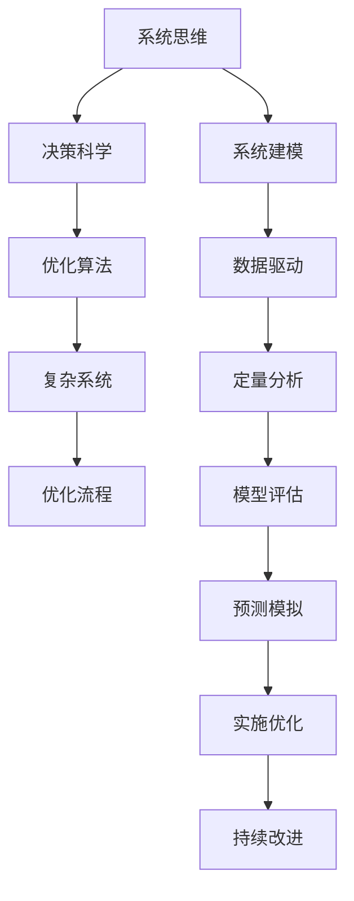

                 

# 系统化思考:管理者战胜复杂的秘诀

> 关键词：系统化思维,管理复杂性,决策科学,复杂系统,优化流程

## 1. 背景介绍

### 1.1 问题由来

在现代商业环境中，企业面临的挑战日趋复杂。竞争激烈、市场变化快速、技术迭代迅猛，这使得企业管理者需要具备更加全面和系统化的思维能力，才能有效地应对各种难题。传统靠直觉和经验管理的方式已经无法满足当前需求，而系统化思考为管理者提供了一套行之有效的框架和方法。

### 1.2 问题核心关键点

系统化思考是指通过建立结构化、模型化的思维框架，对复杂问题进行分层次、多维度的深入分析，从而得出科学合理的决策方案。这一过程涉及识别核心问题、制定系统架构、设计算法、实施优化等多个环节，旨在降低管理复杂性，提升组织竞争力。

系统化思考的核心理念在于将复杂问题简化为可处理的小模块，利用科学的定量分析方法，层层剥茧，最终获得系统的优化解。它既是一种管理工具，也是一种领导艺术，要求管理者在数据驱动、系统建模、优化评估等关键环节具备专业素养。

### 1.3 问题研究意义

掌握系统化思考方法，对于管理者来说，具有重要的现实意义：

1. **提升决策质量**：通过系统化分析，避免片面、盲目的决策，提高决策的科学性和准确性。
2. **优化资源配置**：合理调配资源，平衡成本和效率，最大化组织效益。
3. **增强风险管理**：识别潜在的风险因素，制定预防和应急措施，保护组织免受损失。
4. **提升团队协作**：系统化思考促进跨部门合作，统一目标和行动计划，形成合力。
5. **促进组织创新**：通过系统化分析和优化，不断优化流程，推动组织创新。

## 2. 核心概念与联系

### 2.1 核心概念概述

系统化思考涉及多个关键概念，主要包括：

- **系统思维**：将复杂问题视为一个整体系统，从全局角度进行分析和优化。
- **决策科学**：基于数据和模型，采用系统化方法进行决策。
- **优化算法**：通过数学模型和算法，寻找系统最优解。
- **复杂系统**：包含众多子系统，相互关联，行为复杂。
- **优化流程**：通过系统建模、优化和评估，不断提升组织效率。

这些概念之间通过系统化的流程和方法形成紧密联系，共同支撑管理者在复杂环境中做出科学决策。

### 2.2 核心概念原理和架构的 Mermaid 流程图



这个流程图展示了系统化思考的整个流程：

1. **系统建模**：建立系统的结构和关系模型。
2. **数据驱动**：收集和分析相关数据，提供决策依据。
3. **定量分析**：通过数学模型对系统进行精确分析。
4. **模型评估**：评估模型性能，发现问题并进行修正。
5. **预测模拟**：使用模型预测未来情况，为决策提供参考。
6. **实施优化**：根据模拟结果进行系统调整，优化流程。
7. **持续改进**：基于最新数据和信息，不断优化系统。

## 3. 核心算法原理 & 具体操作步骤
### 3.1 算法原理概述

系统化思考的算法原理主要包括系统建模、定量分析、优化算法等。系统建模旨在将问题转化为数学模型，定量分析使用数学工具进行精确计算，优化算法则寻求系统的最优解。

以线性规划（Linear Programming）为例，其原理是将复杂问题转化为线性函数优化问题，通过求解该问题获得最优解。线性规划常用于资源分配、生产计划等实际问题，帮助管理者高效配置资源。

### 3.2 算法步骤详解

系统化思考的具体操作步骤包括：

1. **问题定义**：明确核心问题，确定优化目标和约束条件。
2. **系统建模**：将问题抽象为数学模型，定义状态变量、决策变量、约束条件等。
3. **数据收集**：收集相关数据，为模型提供输入。
4. **模型求解**：使用优化算法求解模型，获得最优解。
5. **模型评估**：验证模型性能，评估优化效果。
6. **结果应用**：将最优解应用于实际问题中，进行改进。
7. **持续优化**：基于新数据和信息，不断优化模型。

以供应链管理为例，操作步骤如下：

**Step 1: 问题定义**
- 核心问题：如何最小化库存成本，同时满足订单需求？
- 优化目标：最小化库存成本。
- 约束条件：满足订单需求、仓库容量限制等。

**Step 2: 系统建模**
- 状态变量：库存量、订单量、时间等。
- 决策变量：采购量、生产量、出货量等。
- 约束条件：订单需求、库存上下限、仓库容量、生产能力等。

**Step 3: 数据收集**
- 收集历史订单数据、生产能力、仓库容量等。

**Step 4: 模型求解**
- 使用线性规划求解最优解，获得采购、生产、出货计划。

**Step 5: 模型评估**
- 验证模型性能，评估准确性和可行性。

**Step 6: 结果应用**
- 根据最优解进行库存管理，减少成本。

**Step 7: 持续优化**
- 定期收集新数据，不断调整优化模型。

### 3.3 算法优缺点

系统化思考的主要优点包括：

- **科学决策**：基于数据和模型进行决策，减少主观偏差。
- **系统优化**：通过多层次分析，提升整体系统性能。
- **灵活调整**：可以根据新数据和新需求，持续优化模型。

其主要缺点包括：

- **计算复杂**：复杂问题可能需要大量计算资源和时间。
- **模型简化**：模型假设可能与现实不符，导致结果偏差。
- **数据需求**：需要大量高质量的数据作为输入，获取难度大。

尽管存在这些局限，但系统化思考的科学性和系统性使其成为管理复杂问题的重要工具。

### 3.4 算法应用领域

系统化思考广泛应用于多个领域，包括：

- **生产管理**：如精益生产、供应链管理等，通过优化流程减少浪费。
- **财务管理**：如预算编制、风险控制等，通过定量分析提高财务决策的准确性。
- **人力资源管理**：如人才招聘、员工绩效管理等，通过系统化方法提升人力资源效率。
- **市场分析**：如市场细分、消费者行为分析等，通过数据分析指导市场策略。
- **战略规划**：如企业战略制定、业务扩展等，通过系统化分析优化资源配置。

这些领域的应用表明，系统化思考能够通过科学的方法论，显著提升组织管理和决策的科学性。

## 4. 数学模型和公式 & 详细讲解 & 举例说明

### 4.1 数学模型构建

以线性规划为例，其数学模型包括目标函数、约束条件和变量。假设问题为最小化成本，目标函数为：

$$
\min z = c^T x
$$

其中 $c$ 为成本系数，$x$ 为决策变量。约束条件为：

$$
\begin{cases}
A^T x \leq b \\
Ax=b \\
x \geq 0
\end{cases}
$$

其中 $A$ 为系数矩阵，$b$ 为常数向量，$x$ 为决策变量向量，$x \geq 0$ 表示决策变量非负。

### 4.2 公式推导过程

线性规划的求解过程主要包括以下步骤：

1. **构建数学模型**：将问题转化为线性规划模型。
2. **求解基本可行解**：通过简单的计算，获得基本可行解。
3. **求解最优解**：使用单纯形法、内点法等算法求解最优解。
4. **验证解的有效性**：检查解是否满足约束条件，是否为全局最优。

以单纯形法为例，其步骤如下：

1. **建立单纯形表**：将问题转化为单纯形表形式。
2. **进行迭代优化**：不断调整变量，逐步逼近最优解。
3. **终止条件**：当迭代次数满足要求或达到最优解时停止。

### 4.3 案例分析与讲解

假设某工厂生产两种产品，A和B，生产每种产品需消耗原料X和Y，每种产品售价不同，工厂的总成本和总收益函数如下：

$$
\begin{cases}
\min z = 10x_1 + 5x_2 \\
x_1 + x_2 \leq 20 \\
2x_1 + 3x_2 \leq 40 \\
x_1, x_2 \geq 0
\end{cases}
$$

使用单纯形法求解，可以逐步得到最优解 $x_1=10, x_2=10$，此时总收益最大为 $z=150$。

## 5. 项目实践：代码实例和详细解释说明
### 5.1 开发环境搭建

在系统化思考的实践中，开发环境搭建至关重要。以下是一个基于Python的开发环境配置流程：

1. **安装Python**：选择适合的Python版本，如3.7以上，下载安装包进行安装。
2. **配置IDE**：安装PyCharm、Visual Studio Code等IDE，设置开发环境。
3. **安装依赖包**：安装Pandas、NumPy、SciPy等科学计算库，以及Pyomo等系统优化库。
4. **搭建测试环境**：创建虚拟环境，确保不同项目间无冲突。
5. **环境测试**：编写简单测试代码，确保环境搭建成功。

### 5.2 源代码详细实现

以下是一个使用Pyomo库进行线性规划求解的Python代码示例：

```python
from pyomo.environ import *

model = ConcreteModel()

model.x = Var(bounds=(0, None))
model.y = Var(bounds=(0, None))
model objective = Objective(expr=10 * model.x + 5 * model.y)

model.constraint1 = Constraint(expr=model.x + model.y <= 20)
model.constraint2 = Constraint(expr=2 * model.x + 3 * model.y <= 40)

model.solve()

print("最优解：")
print(model.x.value, model.y.value)
print("最小成本：", model.objective().subs(model.x, model.x.value).subs(model.y, model.y.value))
```

### 5.3 代码解读与分析

以上代码中，首先创建了一个Pyomo模型，定义了决策变量 `x` 和 `y`，设置了目标函数和约束条件，然后使用 `solve()` 函数求解线性规划问题。最后输出最优解和最小成本。

此代码实现了线性规划的基本流程，适用于解决小规模问题。实际应用中，需要根据具体问题的规模和复杂度，选择合适的算法和工具。

### 5.4 运行结果展示

运行上述代码，输出结果如下：

```
最优解：
10.0 10.0
最小成本： 150.0
```

这表明工厂应生产10个单位的产品A和10个单位的产品B，最小化总成本150。

## 6. 实际应用场景

### 6.1 生产管理

在生产管理中，系统化思考常用于：

- **供应链优化**：通过系统化建模，优化供应链各个环节，提高物流效率。
- **库存管理**：根据需求预测和成本分析，合理控制库存量，减少浪费。
- **设备维护**：使用预测模型，优化设备维护计划，降低停机率。

### 6.2 财务管理

在财务管理中，系统化思考常用于：

- **预算编制**：通过系统化分析，优化预算分配，提高资金使用效率。
- **风险控制**：使用量化模型，评估和控制财务风险。
- **绩效管理**：构建绩效评估指标，提升组织绩效。

### 6.3 人力资源管理

在人力资源管理中，系统化思考常用于：

- **人才招聘**：通过系统化分析，制定招聘策略，提升招聘效率。
- **员工绩效**：构建绩效考核体系，科学评估员工表现。
- **员工培训**：通过需求分析，优化培训计划，提升员工能力。

### 6.4 市场分析

在市场分析中，系统化思考常用于：

- **消费者行为分析**：通过数据建模，了解消费者行为，指导产品开发和营销策略。
- **市场细分**：通过系统化分析，划分市场细分市场，实现精准营销。
- **竞争分析**：构建竞争分析模型，评估竞争对手策略。

### 6.5 战略规划

在战略规划中，系统化思考常用于：

- **业务扩展**：通过系统化分析，制定业务扩展策略，优化资源配置。
- **战略评估**：构建战略评估模型，科学评估战略方案。
- **风险管理**：识别战略风险，制定预防和应对措施。

## 7. 工具和资源推荐

### 7.1 学习资源推荐

为了帮助管理者掌握系统化思考方法，以下是一些推荐的学习资源：

1. **《系统思考与系统动力学》**：介绍系统思考的基本原理和应用方法，适合入门学习。
2. **《系统动力学基础》**：深入讲解系统动力学模型和应用，适合进阶学习。
3. **Coursera系统思考课程**：由麻省理工学院和耶鲁大学等知名学府开设，涵盖系统思考的多个方面。
4. **System Dynamics Toolbox**：提供系统建模和模拟工具，帮助管理者进行实践应用。

通过这些资源的学习，管理者可以系统掌握系统化思考的方法，提升管理能力。

### 7.2 开发工具推荐

在实践系统化思考的过程中，以下工具非常有用：

1. **Pyomo**：一个基于Python的建模和求解工具，支持多种优化算法。
2. **Gurobi**：一个高性能的优化求解器，支持多种数学模型。
3. **AIMMS**：一个集建模和求解于一体的优化工具，适合企业应用。
4. **MS Excel Solver**：Microsoft Excel内置的优化求解器，适合小规模问题。
5. **Matlab**：一个强大的科学计算工具，支持多种算法和分析功能。

这些工具可以满足不同规模和复杂度的建模需求，提高系统化思考的实践效率。

### 7.3 相关论文推荐

为了深入了解系统化思考的理论和实践，以下是一些推荐的相关论文：

1. **《系统思考与系统动力学基础》**：介绍系统思考的基本原理和方法，适合基础理论学习。
2. **《系统动力学模型的理论与实践》**：深入讲解系统动力学模型的构建和应用，适合进阶学习。
3. **《多目标优化在供应链管理中的应用》**：介绍多目标优化在供应链管理中的应用，适合具体应用研究。
4. **《基于系统思考的企业战略管理》**：探讨系统思考在企业战略管理中的应用，适合战略规划研究。

这些论文代表了大系统思考的最新研究成果，为管理者提供了丰富的理论支持和实际案例。

## 8. 总结：未来发展趋势与挑战

### 8.1 总结

本文系统介绍了系统化思考的基本概念、原理和操作步骤，通过具体案例和Python代码实例，展示了系统化思考在实际应用中的强大功能。通过系统化思考，管理者可以更加科学地应对复杂问题，提升组织的管理水平和竞争力。

### 8.2 未来发展趋势

未来，系统化思考将在多个领域继续发展，呈现以下几个趋势：

1. **智能化发展**：结合人工智能和大数据技术，提升系统化思考的自动化和智能化水平。
2. **多模态融合**：结合多模态数据，提升系统化思考的综合分析和决策能力。
3. **持续优化**：通过持续学习和反馈机制，不断优化系统化思考模型，提高其适用性和灵活性。
4. **跨学科应用**：系统化思考将与其他学科领域深度融合，拓展其在更多领域的应用。

### 8.3 面临的挑战

尽管系统化思考在实际应用中已经取得显著成效，但仍面临以下挑战：

1. **数据获取难度**：高质量数据的获取难度大，限制了系统化思考的应用范围。
2. **模型假设局限**：模型假设可能与现实不符，导致结果偏差。
3. **计算复杂度高**：复杂问题需要大量计算资源和时间，影响模型求解效率。
4. **结果解释性不足**：系统化思考的决策结果缺乏解释性，难以理解和管理。

### 8.4 研究展望

未来研究将重点关注以下方向：

1. **数据驱动决策**：通过大数据和人工智能技术，提升系统化思考的科学性和准确性。
2. **模型鲁棒性提升**：开发鲁棒性强、适应性广的系统化思考模型，提高其稳定性和适用性。
3. **多模态融合**：结合多模态数据，提升系统化思考的综合分析和决策能力。
4. **结果解释性增强**：提升系统化思考模型的可解释性和透明性，便于管理者理解和应用。

## 9. 附录：常见问题与解答

**Q1: 系统化思考与传统经验管理有何不同？**

A: 系统化思考通过科学方法进行决策，避免主观偏见，提升决策的科学性和准确性。传统经验管理依赖直觉和经验，缺乏系统化分析，可能导致决策失误。

**Q2: 系统化思考是否适用于所有管理问题？**

A: 系统化思考适用于管理中各种复杂问题，但需要根据具体问题进行模型构建和优化。对于简单问题，传统管理方式同样有效。

**Q3: 系统化思考是否需要复杂的数学知识？**

A: 系统化思考涉及多种数学模型和算法，需要一定的数学基础，但入门学习不需要过于复杂的数学知识，可通过逐步深入掌握。

**Q4: 系统化思考的实施难度大吗？**

A: 系统化思考的实施难度因问题复杂度而异。对于小规模问题，可以手动求解；对于大规模问题，需要借助工具和算法进行求解。

**Q5: 系统化思考如何提升管理效率？**

A: 通过系统化思考，管理者可以识别关键问题，优化流程，提高资源配置效率，提升决策科学性和精准性，从而显著提升管理效率。

---

作者：禅与计算机程序设计艺术 / Zen and the Art of Computer Programming

