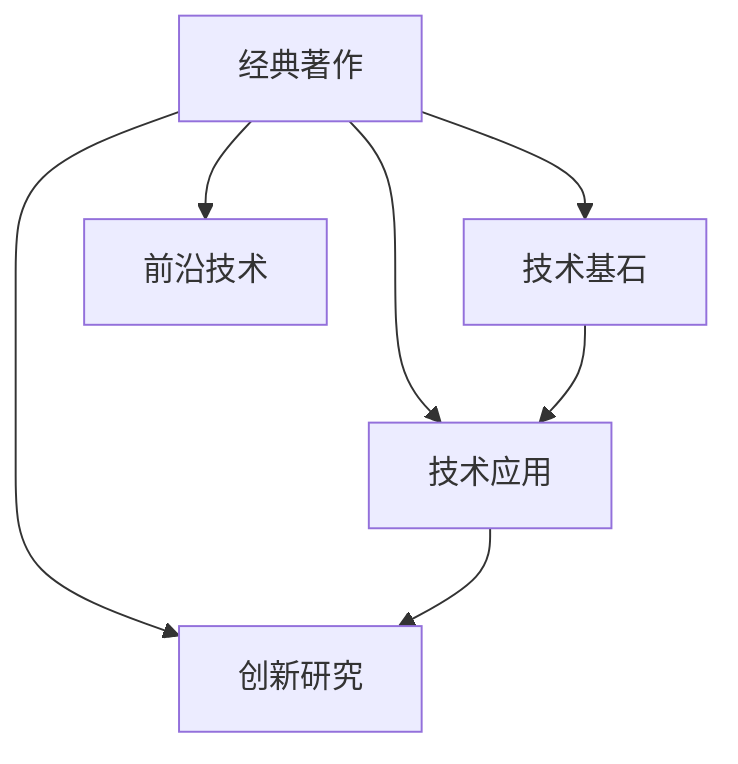

                 

## 1. 背景介绍

### 1.1 问题由来

现代计算机科学的发展已进入一个瓶颈期，当前的技术水平和学术研究成果远远跟不上需求。由于科技的快速发展，人工智能、区块链、大数据、云计算等领域的知识更新迭代迅速，单一领域的知识已无法满足全栈工程师的需求。无论是对技术原理的深入理解，还是对实际应用的熟练掌握，工程师们都需要具备宽广的知识面和深厚的技术功底。

经典为师理念的提出，旨在以经典书籍为师，通过系统学习和实践，掌握计算机科学的基石，夯实技术基础，形成自己的知识体系。通过对经典著作的研究与思考，工程师们能够在快速变化的技术海洋中，掌握核心技术，洞察未来趋势，做出正确的技术决策。

### 1.2 问题核心关键点

本文将重点讨论经典为师理念在技术学习和实际应用中的关键点，包括：

1. **经典著作的选择**：如何选择一本经典的著作作为学习的起点。
2. **学习方法和技巧**：如何有效地学习和理解经典著作中的技术要点。
3. **实践和应用**：如何将经典著作中的知识应用到实际开发中。
4. **前沿技术和趋势**：经典著作与当前前沿技术的关系和差异。
5. **研究方法和创新**：基于经典著作进行技术研究和创新的方法。

## 2. 核心概念与联系

### 2.1 核心概念概述

经典为师理念主要包括以下几个核心概念：

1. **经典著作**：指在计算机科学领域中被广泛认可，具有深远影响的书籍和论文。如《算法导论》、《计算机程序设计艺术》、《计算机网络》等。
2. **技术基石**：指构成计算机科学基础的知识和技能，包括算法、数据结构、操作系统、计算机网络等。
3. **技术应用**：指将技术基石应用到实际开发中的过程。
4. **前沿技术**：指当前计算机科学领域的前沿研究方向和热点技术。
5. **创新研究**：指在经典著作和技术应用基础上进行技术创新和研究的思维方式。

### 2.2 核心概念原理和架构的 Mermaid 流程图



该流程图展示了经典著作、技术基石、技术应用、前沿技术和创新研究之间的关系。经典著作是技术学习的起点，技术基石是应用和创新的基础，前沿技术是发展的方向，而创新研究则是技术发展的动力。

## 3. 核心算法原理 & 具体操作步骤

### 3.1 算法原理概述

经典为师理念强调以经典著作为师，通过系统学习和实践，掌握计算机科学的基石。具体而言，包括以下几个步骤：

1. **选择经典著作**：根据个人兴趣和技术方向，选择一本经典著作作为学习的起点。
2. **系统学习**：通过深入阅读和实践，系统掌握经典著作中的技术和原理。
3. **应用实践**：将经典著作中的知识和技能应用到实际开发中，解决具体问题。
4. **前沿研究**：在技术应用的基础上，关注前沿技术动态，进行技术研究和创新。

### 3.2 算法步骤详解

#### 3.2.1 选择经典著作

选择经典著作是经典为师理念的第一步，需要考虑以下几个方面：

1. **兴趣和技术方向**：选择一本与个人兴趣和技术方向相关的经典著作。
2. **广泛认可**：选择公认的权威著作，如《算法导论》、《计算机程序设计艺术》、《计算机网络》等。
3. **适用性**：选择能够覆盖自己技术栈的经典著作，如《数据结构与算法》、《操作系统概念》、《计算机网络：自顶向下方法》等。

#### 3.2.2 系统学习

系统学习经典著作需要采用以下方法：

1. **深入阅读**：逐章逐节地阅读经典著作，理解其核心思想和技术原理。
2. **实践操作**：通过编程实现经典著作中的案例和算法，加深理解。
3. **构建笔记**：记录学习心得和技术要点，形成自己的技术笔记。
4. **多轮复习**：多次阅读和回顾经典著作，巩固技术知识。

#### 3.2.3 应用实践

应用实践是经典为师理念的关键步骤，需要采用以下方法：

1. **实际问题**：选择实际开发中的问题，如数据结构设计、算法优化、系统架构等。
2. **知识应用**：将经典著作中的知识和技能应用到实际问题中，解决问题。
3. **问题解决**：通过实践，验证经典著作中的理论和方法的有效性。
4. **优化改进**：不断优化和改进技术解决方案，提升系统性能。

#### 3.2.4 前沿研究

前沿研究是经典为师理念的高级阶段，需要采用以下方法：

1. **技术跟踪**：关注计算机科学领域的前沿技术和研究方向，如人工智能、区块链、大数据等。
2. **技术创新**：在技术应用的基础上，进行技术创新和研究，提出新的解决方案。
3. **论文发表**：将技术创新成果写成论文，发表在学术期刊和会议上。
4. **技术分享**：与同行分享技术成果，推动技术交流和合作。

### 3.3 算法优缺点

经典为师理念具有以下优点：

1. **系统全面**：通过经典著作的系统学习，能够掌握计算机科学的全面知识。
2. **技术深度**：经典著作中的技术深度和广度，能够帮助工程师形成扎实的基础。
3. **应用灵活**：经典著作中的技术和原理，可以灵活应用到实际开发中。
4. **创新启发**：经典著作中的前沿技术和创新思路，能够启发工程师的技术创新。

经典为师理念也存在以下缺点：

1. **学习难度高**：经典著作中的技术和原理，可能存在一定的难度。
2. **更新较慢**：经典著作的更新速度较慢，可能无法涵盖最新的技术动态。
3. **应用复杂**：经典著作中的技术和原理，应用到实际开发中可能需要更多的实践和优化。
4. **创新难度大**：经典著作中的创新思路和前沿技术，需要更多的技术积累和创新能力。

### 3.4 算法应用领域

经典为师理念在多个领域都具有广泛的应用，包括但不限于以下几个方面：

1. **软件开发**：软件开发工程师可以通过经典著作，掌握编程技巧和算法原理，提升开发效率和代码质量。
2. **数据科学**：数据科学家可以通过经典著作，掌握数据分析和算法建模的技巧，提升数据处理和分析能力。
3. **系统架构设计**：系统架构师可以通过经典著作，掌握系统设计和优化的方法，构建高性能和可扩展的系统。
4. **人工智能**：人工智能工程师可以通过经典著作，掌握机器学习算法和深度学习技术，提升模型的性能和应用效果。
5. **区块链**：区块链工程师可以通过经典著作，掌握区块链技术原理和实现方法，构建安全的区块链系统。
6. **网络安全**：网络安全工程师可以通过经典著作，掌握网络安全技术和防护方法，构建安全的网络环境。

## 4. 数学模型和公式 & 详细讲解 & 举例说明

### 4.1 数学模型构建

经典为师理念强调系统学习和应用，因此需要使用数学模型来描述经典著作和技术应用的过程。

设经典著作 $M$ 中有 $n$ 章内容，每章 $m$ 节，每节 $k$ 个知识点。则 $M$ 中的知识点总数为 $N=n \times m \times k$。

设工程师 $E$ 的学习进度为 $p$，实践次数为 $c$，前沿技术掌握度为 $f$，创新能力为 $i$。则 $E$ 的总技术水平为 $T=p \times N + c \times N + f \times N + i \times N$。

### 4.2 公式推导过程

通过对 $T$ 的推导，可以得到经典为师理念中技术水平提升的公式：

$$
T = p \times N + c \times N + f \times N + i \times N
$$

其中 $p$、$c$、$f$、$i$ 分别表示系统学习、实践应用、前沿技术掌握度和创新能力。

### 4.3 案例分析与讲解

以《算法导论》为例，该著作是计算机科学领域的经典著作之一，涵盖了算法设计和分析的核心内容。通过系统学习和应用，可以提升工程师的算法能力和编程技能。

首先，系统学习《算法导论》中的核心算法和数据结构，如排序算法、图算法、哈希表等。通过编程实现这些算法，掌握其原理和实现细节。其次，应用这些算法解决实际开发中的问题，如数据处理、系统优化等。最后，关注人工智能、区块链等前沿技术的发展，进行技术创新和研究，提出新的算法和解决方案。

## 5. 项目实践：代码实例和详细解释说明

### 5.1 开发环境搭建

经典为师理念不仅关注理论学习，还强调实践应用。因此，需要搭建一个适合实践开发的环境。

1. **编程语言**：选择一种适合自己的编程语言，如 Python、Java、C++ 等。
2. **开发工具**：选择适合自己的开发工具，如 IDE、代码编辑器等。
3. **版本控制**：使用 Git 等版本控制系统，管理代码变更和项目进度。
4. **测试框架**：选择适合自己的测试框架，如 PyTest、JUnit 等，确保代码质量和可靠性。

### 5.2 源代码详细实现

以经典著作《数据结构与算法》为例，实现其中的排序算法。

1. **选择排序算法**：选择快速排序、归并排序、堆排序等常见排序算法。
2. **编写代码实现**：使用 Python 编写排序算法代码，包括输入、排序和输出。
3. **测试代码正确性**：使用测试框架编写测试用例，测试代码的正确性。
4. **优化算法性能**：通过分析算法性能，优化代码实现，提升排序效率。

### 5.3 代码解读与分析

以下是一段 Python 实现的快速排序算法代码：

```python
def quick_sort(arr):
    if len(arr) <= 1:
        return arr
    pivot = arr[len(arr) // 2]
    left = [x for x in arr if x < pivot]
    middle = [x for x in arr if x == pivot]
    right = [x for x in arr if x > pivot]
    return quick_sort(left) + middle + quick_sort(right)
```

**代码解读**：
1. 函数 `quick_sort` 接受一个数组 `arr`，实现快速排序算法。
2. 首先判断数组长度，如果长度小于等于 1，直接返回原数组。
3. 选择数组中间的元素作为基准值 `pivot`。
4. 将数组分成三部分，小于基准值的元素放在左边数组 `left`，等于基准值的元素放在中间数组 `middle`，大于基准值的元素放在右边数组 `right`。
5. 递归调用 `quick_sort` 函数，对左边数组和右边数组进行排序。
6. 将排序后的左边数组、中间数组和右边数组拼接，返回排序后的结果。

**代码分析**：
1. 快速排序算法是一种高效的排序算法，时间复杂度为 $O(nlogn)$。
2. 通过递归调用 `quick_sort` 函数，实现了对数组的分治排序。
3. 在排序过程中，基准值的选择和数组的划分对排序效率有重要影响。
4. 可以通过分析算法性能，优化快速排序算法，提高排序效率。

### 5.4 运行结果展示

以下是使用 Python 实现的快速排序算法对数组进行排序的结果：

```python
arr = [3, 2, 1, 5, 4]
sorted_arr = quick_sort(arr)
print(sorted_arr)  # 输出 [1, 2, 3, 4, 5]
```

## 6. 实际应用场景

### 6.1 软件开发

在软件开发中，经典为师理念可以帮助工程师掌握编程技巧和算法原理，提升开发效率和代码质量。

以数据结构设计和算法优化为例，工程师可以通过系统学习经典著作《数据结构与算法》，掌握数组、链表、栈、队列、图等数据结构和排序、搜索、动态规划等算法。通过编程实现这些数据结构和算法，掌握其原理和实现细节。然后，应用这些数据结构和算法解决实际开发中的问题，如数据库优化、系统优化、多线程并发等。最后，关注人工智能、区块链等前沿技术的发展，进行技术创新和研究，提出新的解决方案。

### 6.2 数据科学

在数据科学中，经典为师理念可以帮助工程师掌握数据分析和算法建模的技巧，提升数据处理和分析能力。

以数据分析和机器学习算法为例，工程师可以通过系统学习经典著作《数据科学导论》，掌握数据清洗、特征工程、模型选择和评估等技巧。通过编程实现这些数据分析和算法，掌握其原理和实现细节。然后，应用这些数据分析和算法处理实际数据，解决实际问题，如用户行为分析、市场预测、信用评分等。最后，关注人工智能、深度学习等前沿技术的发展，进行技术创新和研究，提出新的算法和解决方案。

### 6.3 系统架构设计

在系统架构设计中，经典为师理念可以帮助工程师掌握系统设计和优化的方法，构建高性能和可扩展的系统。

以分布式系统设计和云服务优化为例，工程师可以通过系统学习经典著作《云计算：原理、技术与架构》，掌握云计算原理、分布式系统和微服务架构等知识。通过编程实现这些系统设计和优化方法，掌握其原理和实现细节。然后，应用这些系统设计和优化方法构建实际系统，解决实际问题，如高性能计算、负载均衡、系统监控等。最后，关注人工智能、区块链等前沿技术的发展，进行技术创新和研究，提出新的系统设计和优化方案。

### 6.4 人工智能

在人工智能中，经典为师理念可以帮助工程师掌握机器学习算法和深度学习技术，提升模型的性能和应用效果。

以深度学习算法和神经网络为例，工程师可以通过系统学习经典著作《深度学习》，掌握深度学习算法和神经网络模型等知识。通过编程实现这些深度学习算法和神经网络模型，掌握其原理和实现细节。然后，应用这些深度学习算法和神经网络模型构建实际系统，解决实际问题，如图像识别、语音识别、自然语言处理等。最后，关注人工智能、计算机视觉等前沿技术的发展，进行技术创新和研究，提出新的深度学习算法和神经网络模型。

### 6.5 区块链

在区块链中，经典为师理念可以帮助工程师掌握区块链技术原理和实现方法，构建安全的区块链系统。

以区块链共识算法和智能合约为例，工程师可以通过系统学习经典著作《区块链原理与实践》，掌握区块链共识算法、智能合约等知识。通过编程实现这些区块链技术原理和实现方法，掌握其原理和实现细节。然后，应用这些区块链技术原理和实现方法构建实际系统，解决实际问题，如区块链交易、智能合约、跨链通信等。最后，关注区块链、分布式账本等前沿技术的发展，进行技术创新和研究，提出新的区块链技术原理和实现方法。

### 6.6 网络安全

在网络安全中，经典为师理念可以帮助工程师掌握网络安全技术和防护方法，构建安全的网络环境。

以网络安全技术和防护方法为例，工程师可以通过系统学习经典著作《网络安全原理与实践》，掌握网络安全技术、防护方法等知识。通过编程实现这些网络安全技术和防护方法，掌握其原理和实现细节。然后，应用这些网络安全技术和防护方法构建实际系统，解决实际问题，如入侵检测、数据加密、安全认证等。最后，关注网络安全、安全协议等前沿技术的发展，进行技术创新和研究，提出新的网络安全技术和防护方法。

## 7. 工具和资源推荐

### 7.1 学习资源推荐

为了帮助工程师系统掌握经典著作和技术应用，这里推荐一些优质的学习资源：

1. **经典著作**：选择一本与技术方向相关的经典著作，如《算法导论》、《计算机程序设计艺术》、《计算机网络》等。
2. **在线课程**：通过在线课程平台，系统学习经典著作中的技术和原理，如 Coursera、edX、Udacity 等。
3. **技术博客**：通过技术博客，了解经典著作和前沿技术动态，如 IEEE Spectrum、Medium、CSDN 等。
4. **技术社区**：通过技术社区，与其他工程师交流学习心得和技术问题，如 Stack Overflow、GitHub、知乎等。
5. **技术书籍**：通过技术书籍，深入了解经典著作和技术细节，如《数据结构与算法》、《操作系统概念》、《计算机网络：自顶向下方法》等。

### 7.2 开发工具推荐

为了帮助工程师高效地进行技术学习和应用，这里推荐一些优质的开发工具：

1. **IDE**：选择适合自己的集成开发环境，如 Visual Studio、IntelliJ IDEA、PyCharm 等。
2. **代码编辑器**：选择适合自己的代码编辑器，如 Sublime Text、Atom、Vim 等。
3. **版本控制系统**：使用 Git、SVN 等版本控制系统，管理代码变更和项目进度。
4. **测试框架**：选择适合自己的测试框架，如 PyTest、JUnit、TestNG 等，确保代码质量和可靠性。
5. **文档工具**：使用 Doxygen、Javadoc 等文档工具，生成技术文档和代码注释。

### 7.3 相关论文推荐

为了帮助工程师掌握前沿技术动态，这里推荐一些经典论文：

1. **算法与数据结构**：《算法导论》中的经典算法和数据结构。
2. **计算机网络**：《计算机网络：自顶向下方法》中的网络原理和技术。
3. **操作系统**：《操作系统概念》中的操作系统原理和实现方法。
4. **人工智能**：《深度学习》中的深度学习算法和神经网络模型。
5. **区块链**：《区块链原理与实践》中的区块链技术原理和实现方法。
6. **网络安全**：《网络安全原理与实践》中的网络安全技术和防护方法。

## 8. 总结：未来发展趋势与挑战

### 8.1 总结

经典为师理念强调以经典著作为师，通过系统学习和实践，掌握计算机科学的基石，夯实技术基础，形成自己的知识体系。通过系统学习和应用经典著作中的技术和原理，工程师们能够在快速变化的技术海洋中，掌握核心技术，洞察未来趋势，做出正确的技术决策。

### 8.2 未来发展趋势

经典为师理念的未来发展趋势包括以下几个方面：

1. **系统性更强**：经典著作和技术应用的系统性不断增强，能够涵盖更广泛的知识点和技能。
2. **实践性更强**：经典著作和技术应用的实践性不断增强，能够提供更多的实际应用案例和实践指导。
3. **前沿性更强**：经典著作和技术应用的前沿性不断增强，能够反映最新的技术和研究成果。
4. **创新性更强**：经典著作和技术应用的创新性不断增强，能够提出更多新的解决方案和技术思路。

### 8.3 面临的挑战

经典为师理念在实际应用中也面临一些挑战：

1. **学习难度高**：经典著作中的技术和原理，可能存在一定的难度，需要投入更多的时间和精力进行学习。
2. **更新速度慢**：经典著作的更新速度较慢，可能无法涵盖最新的技术和研究成果。
3. **应用复杂**：经典著作中的技术和原理，应用到实际开发中可能需要更多的实践和优化。
4. **创新难度大**：经典著作中的创新思路和前沿技术，需要更多的技术积累和创新能力。

### 8.4 研究展望

经典为师理念的未来研究展望包括以下几个方面：

1. **多学科融合**：将经典著作和技术应用与其他学科进行融合，形成跨学科的知识体系。
2. **在线学习平台**：开发在线学习平台，提供更多系统学习和实践资源。
3. **跨领域应用**：将经典著作和技术应用应用到更多领域，如金融、医疗、教育等。
4. **技术创新突破**：在经典著作和技术应用的基础上，进行技术创新和突破，推动技术发展。
5. **技术标准制定**：参与技术标准制定，推动技术规范和标准的发展。

## 9. 附录：常见问题与解答

**Q1：如何选择经典著作作为学习起点？**

A: 选择经典著作作为学习起点，需要考虑以下几个方面：
1. **技术领域**：选择与技术方向相关的经典著作，如《数据结构与算法》、《操作系统概念》、《计算机网络》等。
2. **权威性**：选择公认的权威著作，如《算法导论》、《计算机程序设计艺术》、《深度学习》等。
3. **适用性**：选择能够覆盖自己技术栈的经典著作，如《数据结构与算法》、《操作系统概念》、《计算机网络》等。

**Q2：如何进行系统学习经典著作？**

A: 系统学习经典著作需要采用以下方法：
1. **深入阅读**：逐章逐节地阅读经典著作，理解其核心思想和技术原理。
2. **实践操作**：通过编程实现经典著作中的案例和算法，加深理解。
3. **构建笔记**：记录学习心得和技术要点，形成自己的技术笔记。
4. **多轮复习**：多次阅读和回顾经典著作，巩固技术知识。

**Q3：如何将经典著作中的知识应用到实际开发中？**

A: 将经典著作中的知识应用到实际开发中需要采用以下方法：
1. **实际问题**：选择实际开发中的问题，如数据结构设计、算法优化、系统架构等。
2. **知识应用**：将经典著作中的知识和技能应用到实际问题中，解决问题。
3. **问题解决**：通过实践，验证经典著作中的理论和方法的有效性。
4. **优化改进**：不断优化和改进技术解决方案，提升系统性能。

**Q4：如何关注前沿技术动态？**

A: 关注前沿技术动态需要采用以下方法：
1. **技术博客**：通过技术博客，了解经典著作和前沿技术动态，如 IEEE Spectrum、Medium、CSDN 等。
2. **技术社区**：通过技术社区，与其他工程师交流学习心得和技术问题，如 Stack Overflow、GitHub、知乎等。
3. **学术期刊**：通过学术期刊，了解前沿技术的研究成果，如 ACM Transactions、IEEE Transactions 等。

**Q5：如何进行技术创新和研究？**

A: 进行技术创新和研究需要采用以下方法：
1. **前沿研究**：在技术应用的基础上，关注前沿技术动态，进行技术研究和创新。
2. **论文发表**：将技术创新成果写成论文，发表在学术期刊和会议上。
3. **技术分享**：与同行分享技术成果，推动技术交流和合作。

总之，经典为师理念强调以经典著作为师，通过系统学习和实践，掌握计算机科学的基石，夯实技术基础，形成自己的知识体系。通过经典著作的系统学习和应用，工程师们能够在快速变化的技术海洋中，掌握核心技术，洞察未来趋势，做出正确的技术决策。

---

作者：禅与计算机程序设计艺术 / Zen and the Art of Computer Programming

