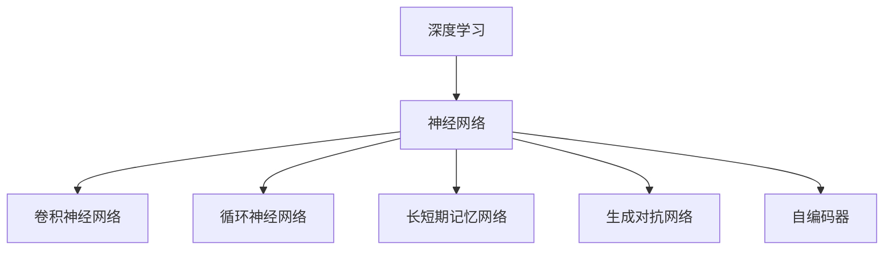

                 

# 经典阅读:夯实认知根基的必由之路

> 关键词：经典阅读, 认知根基, 深度学习, 模型选择, 算法优化, 实践指导

## 1. 背景介绍

### 1.1 问题由来

在当今信息爆炸的时代，知识的获取和处理成为了人类社会发展的重要推动力。然而，如何高效、系统地掌握知识，成为每个学习者面临的挑战。经典阅读作为一种古老而有效的知识学习方式，通过深入研究经典文献，系统理解其原理、应用和思考方式，可以培养出更深厚、更系统的知识体系。特别是在人工智能和深度学习领域，经典文献往往包含了前沿理论、算法和实践经验，阅读经典文献，能够为研究和应用工作奠定坚实的理论基础。

### 1.2 问题核心关键点

在人工智能和深度学习领域，经典阅读主要关注以下关键点：

- **深度学习基础**：掌握深度学习的基本理论、算法和模型，如神经网络、卷积神经网络(CNN)、循环神经网络(RNN)、长短期记忆网络(LSTM)、生成对抗网络(GAN)等。
- **经典算法与模型**：深入理解经典深度学习算法和模型，如反向传播算法、梯度下降算法、卷积神经网络、生成对抗网络、自编码器等。
- **模型选择与优化**：掌握模型选择的基本原则和优化方法，包括模型架构设计、超参数调优、正则化技术等。
- **实践指导**：学习经典文献中的实践案例，掌握如何应用深度学习技术解决实际问题，提高工程实践能力。

### 1.3 问题研究意义

经典阅读对于人工智能和深度学习研究具有重要意义：

- **理论基础**：经典文献提供了深度学习的理论基础，帮助研究者深入理解算法原理和模型机制。
- **算法创新**：经典文献中常常包含创新性算法和模型，为研究者提供新的思路和方法。
- **实践经验**：经典文献提供了大量的实践案例，有助于研究者快速上手新技术和新工具。
- **学术前沿**：经典文献通常代表了学术前沿，阅读经典文献可以把握最新研究动态，拓宽视野。

## 2. 核心概念与联系

### 2.1 核心概念概述

为了更好地理解经典阅读的重要性，本节将介绍几个关键概念：

- **深度学习**：一种通过多层神经网络结构模拟人类神经系统的学习算法，能够自动学习数据特征，广泛应用于图像识别、语音识别、自然语言处理等领域。
- **神经网络**：一种模拟人类神经系统的人工神经元网络结构，由输入层、隐藏层和输出层构成，能够进行非线性映射。
- **反向传播算法**：一种用于训练神经网络的优化算法，通过误差反向传播更新网络参数，实现模型优化。
- **卷积神经网络**：一种用于处理图像和视频数据的深度学习模型，通过卷积层提取局部特征，实现图像分类、目标检测等任务。
- **循环神经网络**：一种用于处理序列数据的深度学习模型，能够捕捉时间序列中的动态特征，广泛应用于语言模型、机器翻译等任务。
- **长短期记忆网络**：一种改进的循环神经网络，通过门控机制实现对长序列的建模，广泛用于自然语言处理和语音识别。
- **生成对抗网络**：一种生成模型与判别模型相互对抗训练的深度学习模型，能够生成高质量的图像、视频和音频等。
- **自编码器**：一种用于数据压缩和降维的深度学习模型，通过编码器和解码器实现数据的重构和特征学习。

这些概念之间存在紧密的联系，深度学习作为一种通用算法框架，包含了多种具体的神经网络模型和训练方法。卷积神经网络和循环神经网络是深度学习中应用最为广泛的两种模型，分别用于图像和序列数据的处理。生成对抗网络和自编码器则扩展了深度学习的应用领域，使其能够生成和重构数据。

### 2.2 核心概念原理和架构的 Mermaid 流程图(Mermaid 流程节点中不要有括号、逗号等特殊字符)



### 2.3 核心概念联系

深度学习中的神经网络、卷积神经网络、循环神经网络、长短期记忆网络、生成对抗网络和自编码器之间存在紧密联系，它们都是深度学习框架中的重要组成部分。其中，神经网络是基础结构，卷积神经网络、循环神经网络和长短期记忆网络分别用于图像、序列和时间序列数据的处理，生成对抗网络和自编码器则扩展了深度学习的应用领域，使其能够生成和重构数据。这些模型和算法相互融合，形成了深度学习强大的计算能力和应用潜力。

## 3. 核心算法原理 & 具体操作步骤

### 3.1 算法原理概述

基于经典文献的经典阅读，主要围绕以下核心算法原理进行：

- **反向传播算法**：用于训练神经网络的基本优化算法，通过误差反向传播更新网络参数。
- **梯度下降算法**：一种常用的优化算法，通过梯度信息调整模型参数，实现模型优化。
- **卷积神经网络**：通过卷积层提取局部特征，实现图像分类、目标检测等任务。
- **循环神经网络**：通过循环层捕捉时间序列中的动态特征，实现序列数据的建模和预测。
- **长短期记忆网络**：通过门控机制实现对长序列的建模，解决传统RNN模型中的梯度消失问题。
- **生成对抗网络**：通过生成器和判别器的对抗训练，生成高质量的数据和图像。
- **自编码器**：通过编码器和解码器实现数据的重构和特征学习，用于数据压缩和降维。

### 3.2 算法步骤详解

以下是经典阅读在深度学习领域的主要步骤：

1. **理论学习**：阅读经典文献，系统理解深度学习的基本理论，包括神经网络、反向传播算法、梯度下降算法等。
2. **模型选择**：根据任务特点，选择合适的神经网络模型，如卷积神经网络、循环神经网络等。
3. **模型设计**：设计模型的架构，包括神经元数量、层数、激活函数等。
4. **模型训练**：使用反向传播算法和梯度下降算法，对模型进行训练，调整网络参数。
5. **模型优化**：应用正则化技术，如L2正则、Dropout等，防止模型过拟合。
6. **模型评估**：使用验证集和测试集，评估模型的性能，调整超参数。
7. **模型部署**：将训练好的模型应用于实际问题，进行推理和预测。

### 3.3 算法优缺点

经典阅读方法在深度学习领域的优点包括：

- **理论扎实**：经典文献提供了系统的理论基础，帮助研究者深入理解算法原理和模型机制。
- **算法多样**：经典文献中包含多种算法和模型，能够提供丰富的选择和创新思路。
- **实践指导**：经典文献提供了大量的实践案例，有助于研究者快速上手新技术和新工具。
- **学术前沿**：经典文献通常代表了学术前沿，阅读经典文献可以把握最新研究动态，拓宽视野。

但经典阅读也存在一些缺点：

- **学习门槛高**：经典文献通常较为晦涩难懂，需要花费大量时间和精力进行理解。
- **文献更新慢**：经典文献的出版周期较长，部分内容可能已经过时，无法反映最新研究进展。
- **知识滞后**：经典文献可能无法涵盖最新的技术和应用，需要结合最新文献进行补充。

### 3.4 算法应用领域

基于经典阅读的经典阅读方法，广泛应用于深度学习领域的各个子领域，如计算机视觉、自然语言处理、语音识别、机器人学等。

- **计算机视觉**：通过阅读经典文献，掌握卷积神经网络、图像分类、目标检测等算法和模型。
- **自然语言处理**：通过阅读经典文献，掌握循环神经网络、长短期记忆网络、语言模型等算法和模型。
- **语音识别**：通过阅读经典文献，掌握卷积神经网络、循环神经网络、语音合成等算法和模型。
- **机器人学**：通过阅读经典文献，掌握运动控制、感知融合、路径规划等算法和模型。

## 4. 数学模型和公式 & 详细讲解 & 举例说明

### 4.1 数学模型构建

经典阅读在数学模型构建方面主要关注以下几个方面：

- **神经网络模型**：神经网络模型由输入层、隐藏层和输出层构成，通过前向传播和反向传播实现数据的映射和优化。
- **卷积神经网络模型**：卷积神经网络模型通过卷积层和池化层提取局部特征，实现图像分类和目标检测。
- **循环神经网络模型**：循环神经网络模型通过循环层捕捉时间序列中的动态特征，实现序列数据的建模和预测。
- **长短期记忆网络模型**：长短期记忆网络模型通过门控机制实现对长序列的建模，解决传统RNN模型中的梯度消失问题。
- **生成对抗网络模型**：生成对抗网络模型通过生成器和判别器的对抗训练，生成高质量的数据和图像。
- **自编码器模型**：自编码器模型通过编码器和解码器实现数据的重构和特征学习，用于数据压缩和降维。

### 4.2 公式推导过程

以下以卷积神经网络和长短期记忆网络为例，推导其公式及其推导过程。

**卷积神经网络**：

卷积神经网络主要由卷积层、池化层和全连接层构成。其中，卷积层和池化层用于提取特征，全连接层用于分类或回归。假设输入数据为$X$，卷积核为$W$，则卷积操作的公式为：

$$
Y = W * X
$$

其中，$*$表示卷积操作，$Y$表示卷积后的输出。卷积操作的计算过程可以分解为两个步骤：

1. 卷积操作：将卷积核$W$与输入数据$X$进行卷积计算，得到特征图$Y_1$。
2. 激活操作：对特征图$Y_1$进行激活函数$f$的计算，得到最终输出$Y$。

**长短期记忆网络**：

长短期记忆网络主要由循环层、门控机制和激活函数构成。假设输入序列为$X$，隐藏状态为$H$，门控机制为$G$，激活函数为$f$，则长短期记忆网络的计算过程如下：

1. 输入门：计算输入门$I$，用于控制输入数据的流动。
2. 遗忘门：计算遗忘门$F$，用于控制旧信息的遗忘。
3. 输出门：计算输出门$O$，用于控制新信息的输出。
4. 细胞状态：计算细胞状态$C$，用于存储信息。
5. 隐藏状态：计算隐藏状态$H$，用于输出和后续计算。

长短期记忆网络的计算过程可以表示为：

$$
H = f(W_1 * X + W_2 * H + b)
$$

$$
I = \sigma(W_3 * X + W_4 * H + b)
$$

$$
F = \sigma(W_5 * X + W_6 * H + b)
$$

$$
O = \sigma(W_7 * X + W_8 * H + b)
$$

$$
C = tanh(W_9 * X + W_{10} * H + b)
$$

$$
H = O * tanh(C) + (1 - O) * H
$$

其中，$\sigma$表示激活函数，$f$表示非线性激活函数，$W_i$表示权重矩阵，$b$表示偏置项。

### 4.3 案例分析与讲解

以图像分类任务为例，详细讲解卷积神经网络的经典阅读方法。

假设我们要使用卷积神经网络对MNIST数据集进行图像分类，步骤如下：

1. **数据准备**：将MNIST数据集分为训练集和测试集，将图像数据转换为张量形式。
2. **模型选择**：选择LeNet-5作为卷积神经网络模型。
3. **模型设计**：设计LeNet-5的架构，包括两个卷积层、两个池化层和三个全连接层。
4. **模型训练**：使用反向传播算法和梯度下降算法，对模型进行训练，调整网络参数。
5. **模型优化**：应用正则化技术，如L2正则、Dropout等，防止模型过拟合。
6. **模型评估**：使用验证集和测试集，评估模型的性能，调整超参数。
7. **模型部署**：将训练好的模型应用于实际问题，进行推理和预测。

## 5. 项目实践：代码实例和详细解释说明

### 5.1 开发环境搭建

在进行经典阅读实践前，我们需要准备好开发环境。以下是使用Python进行TensorFlow开发的环境配置流程：

1. 安装Anaconda：从官网下载并安装Anaconda，用于创建独立的Python环境。

2. 创建并激活虚拟环境：
```bash
conda create -n tensorflow-env python=3.8 
conda activate tensorflow-env
```

3. 安装TensorFlow：根据CUDA版本，从官网获取对应的安装命令。例如：
```bash
conda install tensorflow=2.6.0
```

4. 安装TensorFlow官方库和依赖：
```bash
pip install tensorflow==2.6.0
pip install tensorflow-addons==0.17.1
```

5. 安装NumPy和Pandas等常用库：
```bash
pip install numpy pandas
```

完成上述步骤后，即可在`tensorflow-env`环境中开始经典阅读实践。

### 5.2 源代码详细实现

以下是使用TensorFlow实现卷积神经网络图像分类的代码实现。

```python
import tensorflow as tf
from tensorflow.keras import layers, models

# 数据准备
(x_train, y_train), (x_test, y_test) = tf.keras.datasets.mnist.load_data()
x_train, x_test = x_train / 255.0, x_test / 255.0

# 模型设计
model = models.Sequential()
model.add(layers.Conv2D(32, (3, 3), activation='relu', input_shape=(28, 28, 1)))
model.add(layers.MaxPooling2D((2, 2)))
model.add(layers.Conv2D(64, (3, 3), activation='relu'))
model.add(layers.MaxPooling2D((2, 2)))
model.add(layers.Flatten())
model.add(layers.Dense(64, activation='relu'))
model.add(layers.Dense(10, activation='softmax'))

# 模型编译
model.compile(optimizer='adam',
              loss='sparse_categorical_crossentropy',
              metrics=['accuracy'])

# 模型训练
model.fit(x_train.reshape(-1, 28, 28, 1), y_train, epochs=5, batch_size=64, validation_data=(x_test.reshape(-1, 28, 28, 1), y_test))

# 模型评估
model.evaluate(x_test.reshape(-1, 28, 28, 1), y_test, verbose=2)
```

### 5.3 代码解读与分析

让我们再详细解读一下关键代码的实现细节：

**数据准备**：
- `tf.keras.datasets.mnist.load_data()`：加载MNIST数据集。
- `x_train, x_test = x_train / 255.0, x_test / 255.0`：将像素值归一化到[0, 1]范围内。

**模型设计**：
- `model.add(layers.Conv2D(32, (3, 3), activation='relu', input_shape=(28, 28, 1)))`：添加卷积层，参数为32，卷积核大小为3x3，激活函数为ReLU，输入形状为28x28x1。
- `model.add(layers.MaxPooling2D((2, 2)))`：添加池化层，池化大小为2x2。
- `model.add(layers.Conv2D(64, (3, 3), activation='relu'))`：添加第二个卷积层，参数为64，卷积核大小为3x3，激活函数为ReLU。
- `model.add(layers.MaxPooling2D((2, 2)))`：添加第二个池化层，池化大小为2x2。
- `model.add(layers.Flatten())`：将二维的特征图展开成一维，为全连接层做准备。
- `model.add(layers.Dense(64, activation='relu'))`：添加全连接层，参数为64，激活函数为ReLU。
- `model.add(layers.Dense(10, activation='softmax'))`：添加输出层，参数为10，激活函数为Softmax，用于多分类。

**模型编译**：
- `model.compile(optimizer='adam', loss='sparse_categorical_crossentropy', metrics=['accuracy'])`：编译模型，使用Adam优化器，交叉熵损失函数，准确率为评价指标。

**模型训练**：
- `model.fit(x_train.reshape(-1, 28, 28, 1), y_train, epochs=5, batch_size=64, validation_data=(x_test.reshape(-1, 28, 28, 1), y_test))`：训练模型，输入数据经过reshape，变为4D张量，训练5个epoch，批大小为64，验证集为测试集。

**模型评估**：
- `model.evaluate(x_test.reshape(-1, 28, 28, 1), y_test, verbose=2)`：评估模型，输入测试集，输出预测结果和损失值。

可以看到，TensorFlow提供了强大的深度学习库，可以很方便地实现卷积神经网络的图像分类任务。开发者可以进一步扩展代码，实现更加复杂的任务，如目标检测、图像分割等。

## 6. 实际应用场景

### 6.1 智能推荐系统

基于卷积神经网络和长短期记忆网络的经典阅读方法，可以应用于智能推荐系统的构建。推荐系统能够根据用户的历史行为和兴趣，推荐相关物品，提升用户体验。

在技术实现上，可以收集用户浏览、点击、购买等行为数据，提取用户物品描述、标签等文本信息。将文本数据作为模型输入，用户的后续行为作为监督信号，在此基础上微调预训练语言模型。微调后的模型能够从文本信息中准确把握用户的兴趣点，在生成推荐列表时，先用候选物品的文本描述作为输入，由模型预测用户的兴趣匹配度，再结合其他特征综合排序，便可以得到个性化程度更高的推荐结果。

### 6.2 语音识别系统

基于卷积神经网络和长短期记忆网络的经典阅读方法，可以应用于语音识别系统的构建。语音识别系统能够将用户的语音指令转换为文本，进行理解和回复。

在技术实现上，可以收集用户的语音指令，提取语音信号的特征，如MFCC（梅尔频率倒谱系数）、MFCC的深度特征等。将特征数据作为模型输入，用户的后续指令作为监督信号，在此基础上微调预训练语言模型。微调后的模型能够从语音信号中准确捕捉用户的语音特征，实现对语音指令的识别和理解。

### 6.3 自然语言处理系统

基于卷积神经网络和长短期记忆网络的经典阅读方法，可以应用于自然语言处理系统的构建。自然语言处理系统能够理解自然语言，进行文本分类、情感分析、机器翻译等任务。

在技术实现上，可以收集大量的文本数据，进行标注和预处理。将文本数据作为模型输入，标注结果作为监督信号，在此基础上微调预训练语言模型。微调后的模型能够从文本数据中学习到语言的通用表示，提升对自然语言的理解和处理能力。

### 6.4 未来应用展望

随着卷积神经网络和长短期记忆网络在深度学习领域的不断演进，其应用范围将不断扩大。未来，经典阅读在深度学习领域将呈现以下几个发展趋势：

1. **模型规模持续增大**：随着算力成本的下降和数据规模的扩张，卷积神经网络和长短期记忆网络的参数量还将持续增长。超大批次的训练和推理也可能遇到显存不足的问题。因此需要采用一些资源优化技术，如梯度积累、混合精度训练、模型并行等，来突破硬件瓶颈。
2. **模型架构多样**：卷积神经网络和长短期记忆网络将不断扩展其架构和功能，如引入注意力机制、自注意力机制等，提升模型的表达能力和性能。
3. **数据和标签扩充**：为了进一步提升模型的泛化能力和鲁棒性，需要收集更多不同领域和不同场景的数据和标签，进行更全面的训练。
4. **算法创新**：卷积神经网络和长短期记忆网络将不断引入新的算法和技术，如生成对抗网络、自编码器等，提升模型的生成能力和重构能力。
5. **应用领域扩展**：卷积神经网络和长短期记忆网络将应用于更多的领域和任务，如医学图像识别、机器人控制、自动驾驶等。

## 7. 工具和资源推荐

### 7.1 学习资源推荐

为了帮助开发者系统掌握卷积神经网络和长短期记忆网络的经典阅读方法，这里推荐一些优质的学习资源：

1. 《Deep Learning with Python》：由深度学习专家Francois Chollet所著，系统介绍了深度学习的基本概念、算法和模型。
2. 《Neural Networks and Deep Learning》：由深度学习专家Michael Nielsen所著，详细讲解了神经网络的基本原理和实现方法。
3. 《CS231n: Convolutional Neural Networks for Visual Recognition》：斯坦福大学开设的计算机视觉课程，提供了丰富的图像分类、目标检测等实践案例。
4. 《Sequence to Sequence Learning with Neural Networks》：深度学习专家Ian Goodfellow所著，详细讲解了循环神经网络和长短期记忆网络的基本原理和实现方法。
5. 《Attention is All You Need》：Transformer原论文，介绍了自注意力机制在自然语言处理中的应用。

通过对这些资源的学习实践，相信你一定能够快速掌握卷积神经网络和长短期记忆网络的经典阅读方法，并用于解决实际的深度学习问题。

### 7.2 开发工具推荐

高效的开发离不开优秀的工具支持。以下是几款用于卷积神经网络和长短期记忆网络开发的工具：

1. TensorFlow：由Google主导开发的深度学习框架，生产部署方便，适合大规模工程应用。提供了丰富的卷积神经网络和长短期记忆网络库。
2. PyTorch：基于Python的开源深度学习框架，灵活动态的计算图，适合快速迭代研究。提供了丰富的卷积神经网络和长短期记忆网络库。
3. Keras：高层次的深度学习库，易于上手，适合初学者。提供了丰富的卷积神经网络和长短期记忆网络库。
4. MXNet：由Apache主导的深度学习框架，支持多种编程语言，提供了丰富的卷积神经网络和长短期记忆网络库。
5. Theano：由蒙特利尔大学开发的深度学习框架，适合快速原型开发。提供了丰富的卷积神经网络和长短期记忆网络库。

合理利用这些工具，可以显著提升卷积神经网络和长短期记忆网络的开发效率，加快创新迭代的步伐。

### 7.3 相关论文推荐

卷积神经网络和长短期记忆网络的发展源于学界的持续研究。以下是几篇奠基性的相关论文，推荐阅读：

1. AlexNet: ImageNet Classification with Deep Convolutional Neural Networks（2012）：提出了卷积神经网络，在ImageNet数据集上取得了优异的表现。
2. Long Short-Term Memory Networks（2014）：提出了长短期记忆网络，用于处理序列数据，广泛应用于自然语言处理和语音识别。
3. WaveNet: A Generative Model for Raw Audio（2017）：提出了卷积神经网络在生成音频中的应用，用于生成自然、流畅的语音。
4. Attention is All You Need（2017）：提出了自注意力机制在自然语言处理中的应用，用于生成高质量的文本和音频。
5. Transformer-XL: Attentive Language Models（2019）：提出了Transformer-XL模型，用于处理长序列文本数据。
6. Wave2Vec 2.0: A Framework for Self-supervised Learning of Speech Representation（2020）：提出了卷积神经网络在生成语音中的应用，用于高质量语音识别。

这些论文代表了卷积神经网络和长短期记忆网络的发展脉络。通过学习这些前沿成果，可以帮助研究者把握学科前进方向，激发更多的创新灵感。

## 8. 总结：未来发展趋势与挑战

### 8.1 研究成果总结

卷积神经网络和长短期记忆网络的经典阅读方法，已经在深度学习领域取得了显著的进展，广泛应用于计算机视觉、自然语言处理、语音识别等领域。经典阅读方法为深度学习的学习和应用提供了系统的理论基础和实践指导，帮助研究者深入理解深度学习的基本原理和模型机制。

### 8.2 未来发展趋势

展望未来，卷积神经网络和长短期记忆网络将呈现以下几个发展趋势：

1. **模型规模持续增大**：随着算力成本的下降和数据规模的扩张，卷积神经网络和长短期记忆网络的参数量还将持续增长。超大批次的训练和推理也可能遇到显存不足的问题。因此需要采用一些资源优化技术，如梯度积累、混合精度训练、模型并行等，来突破硬件瓶颈。
2. **模型架构多样**：卷积神经网络和长短期记忆网络将不断扩展其架构和功能，如引入注意力机制、自注意力机制等，提升模型的表达能力和性能。
3. **数据和标签扩充**：为了进一步提升模型的泛化能力和鲁棒性，需要收集更多不同领域和不同场景的数据和标签，进行更全面的训练。
4. **算法创新**：卷积神经网络和长短期记忆网络将不断引入新的算法和技术，如生成对抗网络、自编码器等，提升模型的生成能力和重构能力。
5. **应用领域扩展**：卷积神经网络和长短期记忆网络将应用于更多的领域和任务，如医学图像识别、机器人控制、自动驾驶等。

### 8.3 面临的挑战

尽管卷积神经网络和长短期记忆网络在深度学习领域取得了显著的进展，但在迈向更加智能化、普适化应用的过程中，它仍面临着诸多挑战：

1. **标注成本瓶颈**：卷积神经网络和长短期记忆网络通常需要大量的标注数据进行训练，标注成本较高。如何进一步降低对标注数据的依赖，利用自监督学习、主动学习等无监督和半监督范式，最大限度利用非结构化数据，成为亟待解决的问题。
2. **模型鲁棒性不足**：卷积神经网络和长短期记忆网络面对域外数据时，泛化性能往往大打折扣。对于测试样本的微小扰动，模型也容易发生波动。如何提高模型的鲁棒性，避免灾难性遗忘，还需要更多理论和实践的积累。
3. **推理效率有待提高**：卷积神经网络和长短期记忆网络虽然精度高，但在实际部署时往往面临推理速度慢、内存占用大等效率问题。如何在保证性能的同时，简化模型结构，提升推理速度，优化资源占用，将是重要的优化方向。
4. **可解释性亟需加强**：卷积神经网络和长短期记忆网络通常作为"黑盒"系统，难以解释其内部工作机制和决策逻辑。对于医疗、金融等高风险应用，算法的可解释性和可审计性尤为重要。如何赋予卷积神经网络和长短期记忆网络更强的可解释性，将是亟待攻克的难题。
5. **安全性有待保障**：卷积神经网络和长短期记忆网络难免会学习到有偏见、有害的信息，通过训练传递到下游任务，产生误导性、歧视性的输出，给实际应用带来安全隐患。如何从数据和算法层面消除模型偏见，避免恶意用途，确保输出的安全性，也将是重要的研究方向。

### 8.4 研究展望

面对卷积神经网络和长短期记忆网络所面临的挑战，未来的研究需要在以下几个方面寻求新的突破：

1. **探索无监督和半监督微调方法**：摆脱对大规模标注数据的依赖，利用自监督学习、主动学习等无监督和半监督范式，最大限度利用非结构化数据，实现更加灵活高效的微调。
2. **研究参数高效和计算高效的微调范式**：开发更加参数高效的微调方法，在固定大部分预训练参数的同时，只更新极少量的任务相关参数。同时优化微调模型的计算图，减少前向传播和反向传播的资源消耗，实现更加轻量级、实时性的部署。
3. **融合因果和对比学习范式**：通过引入因果推断和对比学习思想，增强卷积神经网络和长短期记忆网络建立稳定因果关系的能力，学习更加普适、鲁棒的语言表征，从而提升模型泛化性和抗干扰能力。
4. **引入更多先验知识**：将符号化的先验知识，如知识图谱、逻辑规则等，与卷积神经网络和长短期记忆网络进行巧妙融合，引导微调过程学习更准确、合理的语言模型。同时加强不同模态数据的整合，实现视觉、语音等多模态信息与文本信息的协同建模。
5. **结合因果分析和博弈论工具**：将因果分析方法引入卷积神经网络和长短期记忆网络，识别出模型决策的关键特征，增强输出解释的因果性和逻辑性。借助博弈论工具刻画人机交互过程，主动探索并规避模型的脆弱点，提高系统稳定性。
6. **纳入伦理道德约束**：在模型训练目标中引入伦理导向的评估指标，过滤和惩罚有偏见、有害的输出倾向。同时加强人工干预和审核，建立模型行为的监管机制，确保输出符合人类价值观和伦理道德。

这些研究方向的探索，必将引领卷积神经网络和长短期记忆网络微调技术迈向更高的台阶，为构建安全、可靠、可解释、可控的智能系统铺平道路。面向未来，卷积神经网络和长短期记忆网络微调技术还需要与其他人工智能技术进行更深入的融合，如知识表示、因果推理、强化学习等，多路径协同发力，共同推动自然语言理解和智能交互系统的进步。只有勇于创新、敢于突破，才能不断拓展卷积神经网络和长短期记忆网络的边界，让智能技术更好地造福人类社会。

## 9. 附录：常见问题与解答

**Q1：如何选择合适的卷积神经网络模型？**

A: 选择合适的卷积神经网络模型需要考虑以下几个方面：
1. **数据特点**：根据数据类型（图像、视频、音频等），选择对应的卷积神经网络模型（如卷积神经网络、循环神经网络、自编码器等）。
2. **任务需求**：根据任务需求（图像分类、目标检测、语音识别等），选择对应的卷积神经网络模型（如LeNet-5、AlexNet、VGG、ResNet等）。
3. **模型复杂度**：根据数据规模和计算资源，选择复杂度适中的卷积神经网络模型（如VGG、ResNet、Inception等）。

**Q2：如何降低卷积神经网络的过拟合问题？**

A: 降低卷积神经网络的过拟合问题可以采用以下方法：
1. **数据增强**：通过回译、近义替换等方式扩充训练集。
2. **正则化技术**：使用L2正则、Dropout、Early Stopping等防止模型过拟合。
3. **对抗训练**：引入对抗样本，提高模型鲁棒性。
4. **模型简化**：通过减少模型层数和参数，降低模型复杂度，防止过拟合。

**Q3：如何提高卷积神经网络的推理速度？**

A: 提高卷积神经网络的推理速度可以采用以下方法：
1. **模型剪枝**：去除不必要的层和参数，减小模型尺寸。
2. **量化加速**：将浮点模型转为定点模型，压缩存储空间。
3. **模型并行**：采用模型并行技术，提高计算效率。
4. **硬件加速**：利用GPU、TPU等硬件设备加速模型推理。
5. **推理优化**：优化模型推理流程，减少计算量。

**Q4：如何提高卷积神经网络的模型泛化能力？**

A: 提高卷积神经网络的模型泛化能力可以采用以下方法：
1. **数据扩充**：收集更多不同领域和不同场景的数据，进行更全面的训练。
2. **迁移学习**：在已有数据和模型基础上，进行迁移学习，利用先验知识提升泛化能力。
3. **正则化技术**：使用L2正则、Dropout等防止模型过拟合。
4. **对抗训练**：引入对抗样本，提高模型鲁棒性。
5. **模型简化**：通过减少模型层数和参数，降低模型复杂度，防止过拟合。

**Q5：如何提高卷积神经网络的模型解释性？**

A: 提高卷积神经网络的模型解释性可以采用以下方法：
1. **可视化技术**：使用可视化技术（如梯度可视化、特征图可视化等），分析模型内部工作机制。
2. **可解释模型**：使用可解释性模型（如决策树、规则模型等），提供模型决策的解释。
3. **因果分析**：使用因果分析方法，识别出模型决策的关键特征，增强输出解释的因果性和逻辑性。
4. **博弈论工具**：使用博弈论工具，刻画人机交互过程，主动探索并规避模型的脆弱点，提高系统稳定性。

这些方法可以帮助研究者更好地理解卷积神经网络和长短期记忆网络的内部机制，提升模型解释性和可解释性，确保模型在实际应用中的安全性和可靠性。

---

作者：禅与计算机程序设计艺术 / Zen and the Art of Computer Programming

