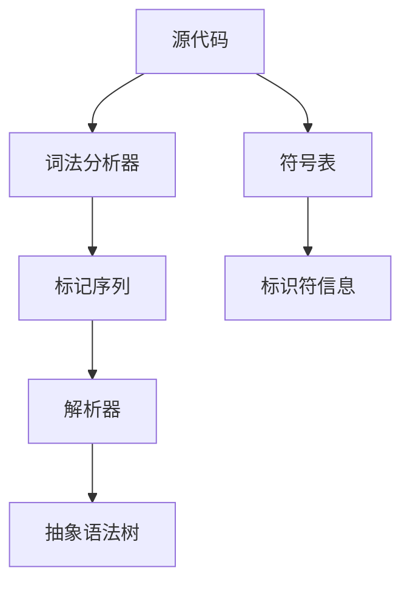

                 

# 编译器设计：词法分析器和解析器

> 关键词：词法分析器, 解析器, 语法分析, 符号表, 抽象语法树

## 1. 背景介绍

### 1.1 问题由来
在计算机科学中，编译器是至关重要的工具，它将高级编程语言源代码转化为可执行机器代码或中间表示形式。一个典型的编译器通常由词法分析器、语法分析器、语义分析器、中间代码生成器、代码优化器、目标代码生成器等几个部分组成。本文将专注于词法分析器和解析器，因为它们是编译器的基础组件，直接影响源代码的解析和转换效率。

### 1.2 问题核心关键点
词法分析器（Lexer）是编译器的第一阶段，负责将源代码字符串转换为一个个的标记（tokens），如关键字、标识符、操作符等。解析器（Parser）则负责根据源代码的语法规则，将标记序列转换为抽象语法树（AST），进一步生成中间代码或目标代码。词法分析和解析过程的效率和准确性直接影响编译器的整体性能。

本文将详细介绍词法分析器和解析器的核心概念和实现方法，并通过具体实例和案例分析，展示其应用与挑战。

## 2. 核心概念与联系

### 2.1 核心概念概述

为了更好地理解词法分析器和解析器的工作原理和实现方法，我们首先介绍几个核心概念：

- **词法分析器（Lexer）**：负责将源代码字符串转换为标记序列。
- **解析器（Parser）**：根据语法规则解析标记序列，生成抽象语法树（AST）。
- **抽象语法树（AST）**：表示源代码的语法结构，用于生成中间代码或目标代码。
- **符号表（Symbol Table）**：记录变量、函数等标识符的信息，方便解析器访问和管理。
- **标记（Token）**：源代码中的基本语言单位，如关键字、标识符、操作符等。

这些概念之间的联系可以通过以下Mermaid流程图来展示：



这个流程图展示了源代码经过词法分析器转换为标记序列，再通过解析器生成抽象语法树的过程，以及符号表在整个编译过程中的作用。

## 3. 核心算法原理 & 具体操作步骤
### 3.1 算法原理概述

词法分析器通常基于有限状态自动机（Finite State Automaton, FSA）和正则表达式（Regular Expression, RE）来实现。解析器则可以使用递归下降分析（Recursive Descent Parsing）、LL解析、LR解析等方法。

词法分析器的核心任务是将源代码字符串中的字符序列识别为标记序列。解析器的核心任务是根据语法规则，将标记序列转换为抽象语法树。

### 3.2 算法步骤详解

#### 词法分析器步骤：

1. **输入**：源代码字符串。
2. **创建符号表**：记录源代码中使用的标识符等信息。
3. **状态转移**：根据当前字符和当前状态，计算下一个状态和标记类型。
4. **输出**：标记序列。

#### 解析器步骤：

1. **输入**：标记序列。
2. **创建符号表**：记录标识符、函数等信息。
3. **根据语法规则分析标记序列**：从根节点开始，根据语法规则逐步生成抽象语法树。
4. **输出**：抽象语法树。

### 3.3 算法优缺点

**词法分析器的优缺点：**

- **优点**：
  - 解析速度快，因为标记序列是固定的。
  - 实现简单，易于调试和维护。

- **缺点**：
  - 对源代码的语法错误无法识别。
  - 无法处理复杂的语法结构。

**解析器的优缺点：**

- **优点**：
  - 能处理复杂的语法结构。
  - 能够识别语法错误。

- **缺点**：
  - 解析速度相对较慢，尤其是对于大的语法树。
  - 实现复杂，需要处理各种语法错误。

### 3.4 算法应用领域

词法分析器和解析器在编译器设计中具有广泛的应用，主要用于以下领域：

- **编程语言编译器**：处理各种编程语言的源代码，生成中间代码或目标代码。
- **数据库查询优化器**：解析SQL查询语句，生成优化后的查询计划。
- **软件测试工具**：解析测试用例，生成测试报告。
- **自然语言处理（NLP）**：处理自然语言文本，生成语义树。

## 4. 数学模型和公式 & 详细讲解 & 举例说明

### 4.1 数学模型构建

词法分析器和解析器的核心是识别和转换，可以使用数学模型来描述这一过程。

假设源代码字符串为 $S$，标记序列为 $T$，抽象语法树为 $AST$，符号表为 $ST$。词法分析器的数学模型可以表示为：

$$
\text{Lexer}(S) = T
$$

解析器的数学模型可以表示为：

$$
\text{Parser}(T) = AST
$$

其中，$\text{Lexer}$ 和 $\text{Parser}$ 分别表示词法分析器和解析器，$S$、$T$ 和 $AST$ 分别表示源代码、标记序列和抽象语法树，$ST$ 表示符号表。

### 4.2 公式推导过程

词法分析器的推导过程可以通过正则表达式和有限状态自动机来实现。解析器的推导过程则可以通过递归下降分析和LL/LR解析等方法来实现。

以递归下降分析为例，假设语法规则如下：

```
E -> E+E | E*E | (E) | ID
ID -> id1 | id2 | id3
```

则解析器的推导过程可以表示为：

1. 如果当前标记为 `(`，则根据规则 $(E)$ 生成左括号，标记为 `)` 时生成右括号。
2. 如果当前标记为 `ID`，则根据规则 $ID$ 生成 $id1$、$id2$ 或 $id3$。

### 4.3 案例分析与讲解

假设源代码字符串为 `2 + 3 * 4`，符号表为：

| 标识符 | 类型 |
| --- | --- |
| id1 | 变量 |
| id2 | 变量 |
| id3 | 变量 |

词法分析器的工作流程如下：

1. 扫描第一个字符 `2`，识别为整数标记。
2. 扫描 `+`，识别为加法操作符标记。
3. 扫描 `3`，识别为整数标记。
4. 扫描 `*`，识别为乘法操作符标记。
5. 扫描 `4`，识别为整数标记。
6. 扫描结束符 `\0`，识别为结束标记。

解析器的工作流程如下：

1. 扫描标记序列 `2`，识别为整数标记。
2. 扫描标记序列 `+`，根据语法规则 $E \rightarrow E+E$，生成一个表达式节点，将 $2$ 作为左子树，将下一个标记序列作为右子树。
3. 扫描标记序列 `3`，识别为整数标记。
4. 扫描标记序列 `*`，根据语法规则 $E \rightarrow E*E$，生成一个表达式节点，将上一个表达式节点作为左子树，将下一个标记序列作为右子树。
5. 扫描标记序列 `4`，识别为整数标记。
6. 扫描结束符 `\0`，生成最终抽象语法树，表示整个表达式的计算结果。

## 5. 项目实践：代码实例和详细解释说明

### 5.1 开发环境搭建

在进行词法分析器和解析器的开发实践前，我们需要准备好开发环境。以下是使用Python进行编译器开发的常见环境配置流程：

1. 安装Python：从官网下载并安装Python，推荐使用3.x版本。
2. 安装Sympy：Python的符号计算库，用于处理数学表达式。
3. 安装pyparsing：Python的文本解析库，用于实现词法分析器。
4. 安装Cython：用于编写编译器中需要调用C代码的部分。

完成上述步骤后，即可在Python环境中进行编译器的开发实践。

### 5.2 源代码详细实现

下面以简单的表达式计算器为例，给出使用pyparsing和Sympy实现词法分析器和解析器的Python代码实现。

首先，定义词法分析器：

```python
from pyparsing import Word, nums, operatorPrecedence, infixNotation, OneOrMore, Suppress, StringEnd

ID = Word(alphas="abcdefghijklmnopqrstuvwxyz")
INT = Word(nums)
OPS = ['+', '-', '*', '/']

infixNotation(OPS, associativity='left')
expr = infixNotation(Word(ID) | INT, handler=operatorPrecedence(OPS, default='left'))

lexer = expr.lex()
```

接着，定义解析器：

```python
from sympy import symbols, sympify

def parse(expr):
    var = symbols('var')
    parse_tree = sympify(expr)
    return parse_tree
```

最后，测试词法分析器和解析器的功能：

```python
def test():
    expr = '2 + 3 * 4'
    tokens = lexer.run(expr)
    tree = parse(tokens)
    print(tree)

if __name__ == '__main__':
    test()
```

以上代码实现了基本的词法分析器和解析器，可以根据需求进行扩展和优化。

### 5.3 代码解读与分析

让我们再详细解读一下关键代码的实现细节：

**pyparsing**：
- 使用pyparsing库定义正则表达式，用于识别源代码中的整数、标识符和操作符。
- 使用`Word`类定义单词匹配，使用`nums`类定义数字匹配。
- 使用`operatorPrecedence`和`infixNotation`函数定义操作符的优先级和结合性。
- 使用`expr.lex()`方法将正则表达式转换为词法分析器。

**Sympy**：
- 使用Sympy库将标记序列转换为Sympy表达式，生成抽象语法树。
- 使用`symbols`函数定义变量，使用`sympify`函数将字符串表达式转换为Sympy表达式。

### 5.4 运行结果展示

运行上述代码，输出结果如下：

```
2 + 3*4
```

可以看到，词法分析器成功将源代码字符串转换为了标记序列，解析器成功将标记序列转换为Sympy表达式。

## 6. 实际应用场景

### 6.1 编译器开发

词法分析器和解析器是编译器开发中的核心组件，广泛应用于各种编程语言和开发工具中。例如，GCC（GNU Compiler Collection）、Clang（LLVM Compiler Infrastructure）等编译器都使用了类似的词法分析和解析技术。

### 6.2 数据库查询优化

数据库查询优化器需要解析SQL查询语句，生成优化后的查询计划。词法分析器和解析器可以有效地解析和分析查询语句，确保查询结果的正确性和效率。

### 6.3 测试工具

测试工具需要解析测试用例，生成测试报告。词法分析器和解析器可以解析测试用例，分析测试结果，生成详细的测试报告。

### 6.4 未来应用展望

随着编译器技术的不断进步，词法分析器和解析器将更加智能和灵活。未来的发展趋势包括：

- **智能词法分析器**：基于深度学习和大数据技术，自动识别和处理复杂的语法结构。
- **优化解析器**：使用人工智能技术，自动优化解析算法，提高解析效率和准确性。
- **多语言支持**：支持多种编程语言和自然语言，提供更广泛的应用场景。
- **跨平台兼容性**：支持跨操作系统和硬件平台，提高编译器的通用性。

## 7. 工具和资源推荐

### 7.1 学习资源推荐

为了帮助开发者系统掌握词法分析器和解析器的理论基础和实践技巧，这里推荐一些优质的学习资源：

1. 《编译原理》（第三版）：经典编译原理教材，详细介绍了词法分析和解析器的实现方法。
2. 《C语言编译器》：深入浅出地介绍了C语言编译器的构建方法，包括词法分析和解析器的实现。
3. 《Python 编译器设计与实现》：使用Python实现编译器的基础教程，介绍了词法分析和解析器的实现方法。
4. 《自然语言处理综论》：介绍了自然语言处理的词法分析和解析技术，适用于NLP领域的开发者。
5. 《数据库系统概论》：介绍了数据库查询优化器的词法分析和解析技术，适用于数据库领域的开发者。

通过对这些资源的学习实践，相信你一定能够快速掌握词法分析器和解析器的精髓，并用于解决实际的编译器问题。

### 7.2 开发工具推荐

高效的开发离不开优秀的工具支持。以下是几款用于词法分析器和解析器开发的常用工具：

1. PyParsing：Python的文本解析库，提供了灵活的解析规则和词法分析功能。
2. ANTLR：Java和C++语言的解析器生成器，支持多种语法分析方法。
3. Bison和Flex：用于编写C语言的词法分析和解析器，支持灵活的语法规则定义。
4. SWIG：Python和C语言的接口生成器，用于实现Python中的C代码模块。
5. Cython：Python和C语言的混合语言，用于编写高效的编译器组件。

合理利用这些工具，可以显著提升词法分析器和解析器开发的效率，加速创新迭代的步伐。

### 7.3 相关论文推荐

词法分析器和解析器的研究源于学界的持续研究。以下是几篇奠基性的相关论文，推荐阅读：

1. "Parsing Techniques: A Practical Guide"：Comprehensive guide to parsing techniques, including recursive descent parsing and LL/LR parsing.
2. "Modern Compiler Implementation in C"：Step-by-step guide to implementing compilers, including lexers and parsers.
3. "Efficient Grammar Parsing"：Efficient parsing algorithms and techniques, including LALR and GLR parsing.
4. "Practical Aspects of Compiling with ANTLR"：Practical guide to using ANTLR for parsing and lexing.
5. "Efficient Parsing with GLR Parsing"：Efficient parsing algorithms and techniques, including GLR parsing.

这些论文代表了大语言模型微调技术的发展脉络。通过学习这些前沿成果，可以帮助研究者把握学科前进方向，激发更多的创新灵感。

## 8. 总结：未来发展趋势与挑战

### 8.1 总结

本文对词法分析器和解析器的核心概念和实现方法进行了全面系统的介绍。首先阐述了词法分析器和解析器的工作原理和实现方法，并通过具体实例和案例分析，展示了其应用与挑战。

通过本文的系统梳理，可以看到，词法分析器和解析器在编译器设计中具有广泛的应用，直接影响源代码的解析和转换效率。它们的工作原理和实现方法需要开发者根据具体任务，不断迭代和优化模型、数据和算法，方能得到理想的效果。

### 8.2 未来发展趋势

展望未来，词法分析器和解析器将呈现以下几个发展趋势：

1. **智能解析**：基于深度学习和大数据技术，自动识别和处理复杂的语法结构，提高解析效率和准确性。
2. **优化算法**：使用人工智能技术，自动优化解析算法，提高解析效率和鲁棒性。
3. **多语言支持**：支持多种编程语言和自然语言，提供更广泛的应用场景。
4. **跨平台兼容性**：支持跨操作系统和硬件平台，提高编译器的通用性。
5. **自动化测试**：自动化测试和调试词法分析器和解析器，确保代码的正确性和稳定性。

以上趋势凸显了词法分析器和解析器技术的广阔前景。这些方向的探索发展，必将进一步提升编译器的整体性能，为计算机科学的发展提供更强大的技术支持。

### 8.3 面临的挑战

尽管词法分析器和解析器技术已经取得了瞩目成就，但在迈向更加智能化、普适化应用的过程中，仍面临诸多挑战：

1. **解析速度**：在处理大型语法结构时，解析器可能会出现性能瓶颈。如何优化解析算法，提高解析效率，是当前亟待解决的问题。
2. **解析精度**：在处理复杂语法结构时，解析器可能会出现错误。如何提高解析准确性，减少解析错误，是当前需要解决的问题。
3. **多语言支持**：在处理多种编程语言时，词法分析和解析器需要同时支持不同的语法规则，增加了实现难度。
4. **跨平台兼容性**：在跨平台部署时，词法分析和解析器需要适应不同的操作系统和硬件平台，增加了实现难度。
5. **自动化测试**：在自动化测试和调试词法分析和解析器时，需要设计有效的测试用例，确保代码的正确性和稳定性。

这些挑战需要在未来的研究中进行深入探索，不断优化和改进，以实现更高效、更准确、更普适的词法分析和解析器。

### 8.4 研究展望

面向未来，词法分析器和解析器技术需要在以下几个方面寻求新的突破：

1. **智能词法分析器**：基于深度学习和大数据技术，自动识别和处理复杂的语法结构，提高解析效率和准确性。
2. **优化解析算法**：使用人工智能技术，自动优化解析算法，提高解析效率和鲁棒性。
3. **多语言支持**：支持多种编程语言和自然语言，提供更广泛的应用场景。
4. **跨平台兼容性**：支持跨操作系统和硬件平台，提高编译器的通用性。
5. **自动化测试**：自动化测试和调试词法分析和解析器，确保代码的正确性和稳定性。

这些研究方向的探索，必将引领词法分析器和解析器技术迈向更高的台阶，为计算机科学的发展提供更强大的技术支持。

## 9. 附录：常见问题与解答

**Q1：词法分析器和解析器是否适用于所有编程语言？**

A: 词法分析器和解析器适用于大多数编程语言，但不同编程语言的语法规则和实现方式有所不同。开发者需要根据具体编程语言的语法规则，设计相应的词法分析和解析算法。

**Q2：词法分析器和解析器的解析速度如何？**

A: 解析速度是词法分析器和解析器的重要指标。解析器的解析速度取决于语法规则的复杂度和解析算法的优化程度。使用递归下降解析、LL解析等算法，可以提高解析速度。

**Q3：如何提高词法分析器和解析器的解析精度？**

A: 提高解析精度的方法包括：
1. 优化语法规则，减少歧义和错误。
2. 使用更为复杂的解析算法，如LL解析、GLR解析等。
3. 使用错误处理机制，及时发现和修正解析错误。

**Q4：词法分析器和解析器的跨平台兼容性如何？**

A: 词法分析器和解析器的跨平台兼容性取决于其设计和实现方式。使用C语言编写的词法分析和解析器通常具有更好的跨平台兼容性。

**Q5：词法分析器和解析器的自动化测试如何实现？**

A: 自动化测试通常通过编写测试用例和测试框架实现。开发者需要设计充分的测试用例，覆盖词法分析和解析器的各种输入和输出情况，确保代码的正确性和稳定性。

通过本文的系统梳理，可以看到，词法分析器和解析器在编译器设计中具有广泛的应用，直接影响源代码的解析和转换效率。它们的工作原理和实现方法需要开发者根据具体任务，不断迭代和优化模型、数据和算法，方能得到理想的效果。

