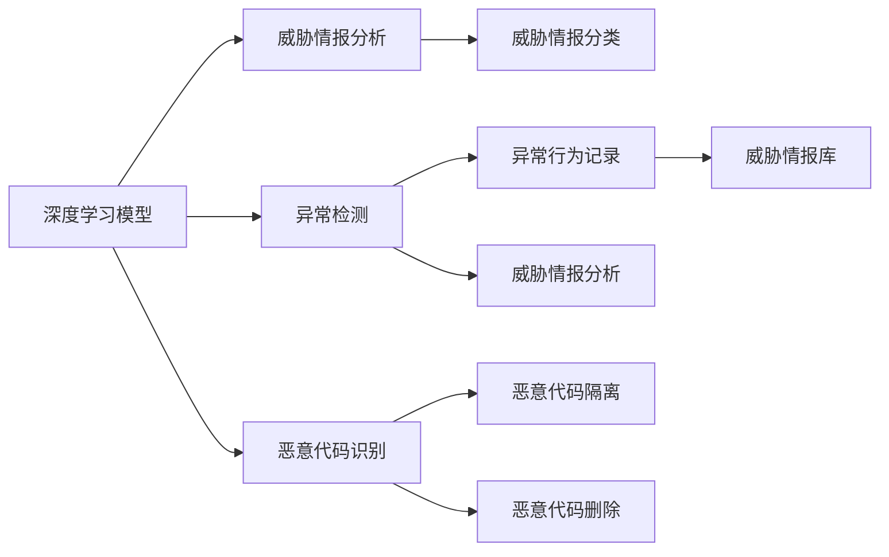

                 

# 网络安全创业：数字时代的守护者

## 1. 背景介绍

### 1.1 问题由来

在数字化浪潮席卷全球的今天，网络安全已经成为保障个人和企业数据安全、维护数字时代稳定与发展的关键。面对日益复杂的网络攻击手段，单纯依赖传统安全防护措施已经无法满足当前的安全需求。网络安全创业公司应运而生，成为数字时代的守护者，致力于构建更加全面、智能、高效的网络安全体系，帮助企业和个人抵御网络威胁，保障信息安全。

### 1.2 问题核心关键点

网络安全创业公司通过融合最新技术、先进算法和深度学习，为各类用户提供定制化、高性能的安全防护解决方案。以下是其核心关键点：

- **深度学习技术**：利用深度学习模型，进行异常行为检测、威胁情报分析、恶意代码识别等任务，提升安全防护的自动化和智能化水平。
- **先进算法**：结合机器学习和传统网络安全理论，设计针对性更强的安全策略和防护机制。
- **定制化服务**：针对不同行业、不同规模的用户需求，提供定制化的安全解决方案，确保防护措施的有效性。
- **实时监控与响应**：提供7x24小时的实时监控服务，及时响应各类安全事件，确保数据安全。
- **社区与合作**：建立开放的网络安全社区，促进技术与资源共享，加强与第三方合作伙伴的合作，提升整体安全防护能力。

### 1.3 问题研究意义

研究网络安全创业公司的核心技术，对于推动网络安全行业的发展，提升整体安全防护水平，具有重要意义：

- **推动行业创新**：网络安全创业公司不断引入新技术、新算法，推动整个网络安全行业的技术革新。
- **增强用户信任**：提供定制化、高性能的安全防护，增强用户对数字世界的信任感。
- **提升企业竞争力**：帮助企业构建坚固的网络安全防线，抵御各类网络攻击，提升市场竞争力。
- **促进产业升级**：通过创新技术的应用，推动传统行业向数字化、智能化转型，促进经济高质量发展。

## 2. 核心概念与联系

### 2.1 核心概念概述

为更好地理解网络安全创业公司的核心技术，本节将介绍几个密切相关的核心概念：

- **深度学习模型**：以神经网络为代表的深度学习模型，通过多层次的特征提取和信息融合，实现高效的数据处理和智能决策。
- **异常检测**：通过训练深度学习模型，识别数据中的异常行为，及时发现潜在的安全威胁。
- **威胁情报分析**：利用自然语言处理、图像识别等技术，分析和理解各类网络威胁情报，提升威胁识别的准确性。
- **恶意代码识别**：利用深度学习模型，识别和隔离恶意代码，防止其对系统造成损害。
- **机器学习算法**：包括监督学习、无监督学习、半监督学习等，用于模型训练、数据分类、异常检测等任务。

### 2.2 核心概念原理和架构的 Mermaid 流程图



这个流程图展示了大语言模型的核心概念及其之间的关系：

1. 深度学习模型是网络安全创业公司的基础，用于训练异常检测、威胁情报分析、恶意代码识别等核心算法。
2. 异常检测通过训练深度学习模型，识别异常行为，为威胁情报分析和恶意代码识别提供输入数据。
3. 威胁情报分析利用自然语言处理、图像识别等技术，对收集到的威胁情报进行分类和分析。
4. 恶意代码识别通过深度学习模型，识别并隔离恶意代码，防止其对系统造成损害。
5. 威胁情报库是威胁情报分析的输出，用于存储和检索各类网络威胁信息，提升威胁识别的准确性。

这些核心概念共同构成了网络安全创业公司的技术框架，确保了其在面对复杂网络威胁时的应对能力。

## 3. 核心算法原理 & 具体操作步骤

### 3.1 算法原理概述

网络安全创业公司利用深度学习模型和机器学习算法，进行异常检测、威胁情报分析、恶意代码识别等任务。其核心算法原理如下：

- **异常检测**：通过训练深度学习模型，对用户行为数据进行建模，检测数据中的异常点。异常点通常出现在行为模式发生显著变化的情况下，如访问异常、数据传输异常等。
- **威胁情报分析**：利用自然语言处理和图像识别技术，对网络威胁情报进行分析和分类。情报通常包含威胁类型、来源、影响范围等信息，有助于提升威胁识别的准确性和效率。
- **恶意代码识别**：通过深度学习模型，对代码进行特征提取和分类，识别出潜在的恶意代码。恶意代码往往包含特定的特征序列，可通过深度学习模型进行检测和隔离。

### 3.2 算法步骤详解

网络安全创业公司的算法步骤通常包括数据准备、模型训练、模型评估和模型部署四个阶段：

**Step 1: 数据准备**

- 收集用户行为数据、网络流量数据、代码样本等作为训练数据。
- 清洗数据，去除噪声和不相关的信息，确保数据的质量和有效性。
- 划分训练集、验证集和测试集，为模型训练和评估提供数据支持。

**Step 2: 模型训练**

- 选择合适的深度学习模型，如卷积神经网络(CNN)、循环神经网络(RNN)、Transformer等。
- 定义损失函数，如交叉熵、均方误差等，用于衡量模型的预测与真实标签之间的差异。
- 利用优化算法如Adam、SGD等，最小化损失函数，更新模型参数。
- 设置超参数，如学习率、批大小、迭代轮数等，进行模型训练。

**Step 3: 模型评估**

- 在验证集上评估模型的性能，如准确率、召回率、F1分数等指标。
- 利用混淆矩阵等工具，分析模型在不同类别上的表现，识别出模型的优势和不足。
- 根据评估结果调整模型参数，进行进一步优化。

**Step 4: 模型部署**

- 将训练好的模型部署到生产环境中，进行实时监控和分析。
- 设置警报机制，在检测到异常行为或威胁时，及时发出警报。
- 提供用户界面，展示模型分析结果，帮助用户进行决策和操作。

### 3.3 算法优缺点

网络安全创业公司的深度学习算法具有以下优点：

- **高准确率**：深度学习模型能够自动提取和融合数据中的高级特征，提升异常检测、威胁情报分析和恶意代码识别的准确性。
- **自动化处理**：模型能够自动处理大量的数据，减轻人工审核的工作量，提高防护效率。
- **实时响应**：模型能够实时分析数据，及时响应潜在的安全威胁，保障数据安全。

同时，该算法也存在一些局限性：

- **高计算需求**：深度学习模型通常需要大量的计算资源进行训练和推理，可能对硬件设备提出较高的要求。
- **数据依赖**：模型性能高度依赖于训练数据的质量和多样性，数据不足或存在偏差可能影响模型效果。
- **解释性不足**：深度学习模型往往是"黑盒"系统，难以解释其内部工作机制和决策逻辑，对模型的解释性和可信度提出了挑战。
- **对抗攻击脆弱**：模型可能受到对抗样本的攻击，导致误报或漏报，影响防护效果。

### 3.4 算法应用领域

网络安全创业公司的深度学习算法已在多个领域得到了广泛应用，如：

- **企业安全防护**：针对企业内网、外网、云平台等环境，提供安全防护方案，帮助企业构建坚固的网络安全防线。
- **互联网安全**：监测互联网流量，识别并阻止恶意网站、钓鱼邮件等网络威胁。
- **移动应用安全**：检测和隔离移动应用中的恶意代码和攻击行为，保障用户隐私和数据安全。
- **物联网安全**：监测物联网设备的网络行为，识别和防范潜在的安全威胁，保障设备安全。
- **工业控制安全**：检测和防范工业控制系统中的恶意代码和攻击行为，保障工业网络的安全稳定。

这些核心算法的应用，显著提升了网络安全创业公司的防护能力，为各类用户提供了全方位的安全保障。

## 4. 数学模型和公式 & 详细讲解 & 举例说明

### 4.1 数学模型构建

为了更严谨地阐述网络安全创业公司的算法原理，本节将使用数学语言对主要算法进行详细描述。

假设有一组用户行为数据 $D=\{(x_i,y_i)\}_{i=1}^N$，其中 $x_i$ 为用户行为特征向量，$y_i \in \{1,0\}$ 表示是否存在异常行为。

**异常检测模型的数学模型**：

- **监督学习模型**：利用标记好的异常数据 $D$ 训练模型 $M_{\theta}$，最小化损失函数 $\mathcal{L}$。
- **模型参数**：$\theta$ 为模型参数，包括卷积核、权重矩阵等。
- **损失函数**：$\mathcal{L}=\frac{1}{N}\sum_{i=1}^N \ell(y_i, M_{\theta}(x_i))$，其中 $\ell$ 为交叉熵损失函数。

**威胁情报分析模型的数学模型**：

- **自然语言处理**：将威胁情报文本 $T=\{t_i\}_{i=1}^M$ 转换为向量表示 $V=\{v_i\}_{i=1}^M$。
- **图像识别**：将威胁情报图片 $I=\{(i_j)\}_{j=1}^P$ 转换为特征向量 $F=\{f_j\}_{j=1}^P$。
- **融合模型**：将文本和图片向量 $V$ 和 $F$ 融合为向量 $S$，通过分类器 $C$ 输出威胁类型 $Z$。

**恶意代码识别模型的数学模型**：

- **特征提取**：利用深度学习模型 $M_{\theta}$ 提取代码特征 $F_x=\{f_x\}_{x=1}^N$。
- **分类器**：通过分类器 $C$ 输出分类结果 $Z$。

### 4.2 公式推导过程

以下对上述数学模型的关键公式进行详细推导：

**异常检测模型的公式推导**：

- **监督学习模型**：假设模型 $M_{\theta}$ 的输出为 $M_{\theta}(x_i) \in [0,1]$，表示 $x_i$ 为异常的概率。目标是最小化交叉熵损失：
$$
\mathcal{L}(\theta) = -\frac{1}{N}\sum_{i=1}^N [y_i\log M_{\theta}(x_i)+(1-y_i)\log(1-M_{\theta}(x_i))]
$$
- **损失函数导数**：求导得：
$$
\frac{\partial \mathcal{L}(\theta)}{\partial \theta} = -\frac{1}{N}\sum_{i=1}^N (\frac{y_i}{M_{\theta}(x_i)}-\frac{1-y_i}{1-M_{\theta}(x_i)}) \frac{\partial M_{\theta}(x_i)}{\partial \theta}
$$

**威胁情报分析模型的公式推导**：

- **自然语言处理**：将文本转换为向量 $v_i$ 的公式为：
$$
v_i = \text{Embedding}(t_i)
$$
其中，$\text{Embedding}$ 为嵌入层，将文本转换为高维向量。
- **图像识别**：将图片转换为特征向量 $f_j$ 的公式为：
$$
f_j = \text{CNN}(i_j)
$$
其中，$\text{CNN}$ 为卷积神经网络，提取图片特征。
- **融合模型**：将文本和图片向量融合的公式为：
$$
s_i = \text{Fusion}(v_i, f_j)
$$
其中，$\text{Fusion}$ 为特征融合层，将文本和图片向量融合为单一向量。
- **分类器**：利用分类器 $C$ 输出威胁类型的公式为：
$$
z_i = C(s_i)
$$
其中，$z_i$ 为威胁类型。

**恶意代码识别模型的公式推导**：

- **特征提取**：利用深度学习模型提取代码特征的公式为：
$$
f_x = M_{\theta}(x)
$$
其中，$f_x$ 为代码特征向量。
- **分类器**：利用分类器输出分类结果的公式为：
$$
z = C(f_x)
$$
其中，$z$ 为恶意代码分类。

### 4.3 案例分析与讲解

以威胁情报分析为例，对模型进行详细讲解：

假设有一组威胁情报数据 $T=\{t_1,t_2,...,t_M\}$，其中 $t_i$ 为威胁情报文本。通过自然语言处理将文本转换为向量 $v_i$：

$$
v_i = \text{Embedding}(t_i)
$$

然后，通过卷积神经网络对图片进行特征提取：

$$
f_j = \text{CNN}(i_j)
$$

将文本和图片向量融合为单一向量 $s_i$：

$$
s_i = \text{Fusion}(v_i, f_j)
$$

最后，利用分类器 $C$ 输出威胁类型：

$$
z_i = C(s_i)
$$

通过以上步骤，模型能够从文本和图片中提取和融合特征，识别威胁情报的类别，为威胁检测和防护提供支持。

## 5. 项目实践：代码实例和详细解释说明

### 5.1 开发环境搭建

在进行网络安全创业公司的算法实践前，我们需要准备好开发环境。以下是使用Python进行PyTorch开发的环境配置流程：

1. 安装Anaconda：从官网下载并安装Anaconda，用于创建独立的Python环境。

2. 创建并激活虚拟环境：
```bash
conda create -n security-env python=3.8 
conda activate security-env
```

3. 安装PyTorch：根据CUDA版本，从官网获取对应的安装命令。例如：
```bash
conda install pytorch torchvision torchaudio cudatoolkit=11.1 -c pytorch -c conda-forge
```

4. 安装Transformer库：
```bash
pip install transformers
```

5. 安装各类工具包：
```bash
pip install numpy pandas scikit-learn matplotlib tqdm jupyter notebook ipython
```

完成上述步骤后，即可在`security-env`环境中开始项目实践。

### 5.2 源代码详细实现

下面我们以恶意代码识别为例，给出使用Transformers库对BERT模型进行恶意代码识别的PyTorch代码实现。

首先，定义恶意代码识别任务的数据处理函数：

```python
from transformers import BertTokenizer
from torch.utils.data import Dataset
import torch

class MalwareDataset(Dataset):
    def __init__(self, texts, labels, tokenizer, max_len=128):
        self.texts = texts
        self.labels = labels
        self.tokenizer = tokenizer
        self.max_len = max_len
        
    def __len__(self):
        return len(self.texts)
    
    def __getitem__(self, item):
        text = self.texts[item]
        label = self.labels[item]
        
        encoding = self.tokenizer(text, return_tensors='pt', max_length=self.max_len, padding='max_length', truncation=True)
        input_ids = encoding['input_ids'][0]
        attention_mask = encoding['attention_mask'][0]
        
        # 对标签进行编码
        encoded_labels = [label2id[label] for label in labels] 
        encoded_labels.extend([label2id['normal']] * (self.max_len - len(encoded_labels)))
        labels = torch.tensor(encoded_labels, dtype=torch.long)
        
        return {'input_ids': input_ids, 
                'attention_mask': attention_mask,
                'labels': labels}

# 标签与id的映射
label2id = {'normal': 0, 'malware': 1}
id2label = {v: k for k, v in label2id.items()}

# 创建dataset
tokenizer = BertTokenizer.from_pretrained('bert-base-cased')

train_dataset = MalwareDataset(train_texts, train_labels, tokenizer)
dev_dataset = MalwareDataset(dev_texts, dev_labels, tokenizer)
test_dataset = MalwareDataset(test_texts, test_labels, tokenizer)
```

然后，定义模型和优化器：

```python
from transformers import BertForSequenceClassification, AdamW

model = BertForSequenceClassification.from_pretrained('bert-base-cased', num_labels=len(label2id))

optimizer = AdamW(model.parameters(), lr=2e-5)
```

接着，定义训练和评估函数：

```python
from torch.utils.data import DataLoader
from tqdm import tqdm
from sklearn.metrics import classification_report

device = torch.device('cuda') if torch.cuda.is_available() else torch.device('cpu')
model.to(device)

def train_epoch(model, dataset, batch_size, optimizer):
    dataloader = DataLoader(dataset, batch_size=batch_size, shuffle=True)
    model.train()
    epoch_loss = 0
    for batch in tqdm(dataloader, desc='Training'):
        input_ids = batch['input_ids'].to(device)
        attention_mask = batch['attention_mask'].to(device)
        labels = batch['labels'].to(device)
        model.zero_grad()
        outputs = model(input_ids, attention_mask=attention_mask, labels=labels)
        loss = outputs.loss
        epoch_loss += loss.item()
        loss.backward()
        optimizer.step()
    return epoch_loss / len(dataloader)

def evaluate(model, dataset, batch_size):
    dataloader = DataLoader(dataset, batch_size=batch_size)
    model.eval()
    preds, labels = [], []
    with torch.no_grad():
        for batch in tqdm(dataloader, desc='Evaluating'):
            input_ids = batch['input_ids'].to(device)
            attention_mask = batch['attention_mask'].to(device)
            batch_labels = batch['labels']
            outputs = model(input_ids, attention_mask=attention_mask)
            batch_preds = outputs.logits.argmax(dim=2).to('cpu').tolist()
            batch_labels = batch_labels.to('cpu').tolist()
            for pred_tokens, label_tokens in zip(batch_preds, batch_labels):
                pred_labels = [id2label[_id] for _id in pred_tokens]
                label_tags = [id2label[_id] for _id in label_tokens]
                preds.append(pred_labels[:len(label_tags)])
                labels.append(label_tags)
                
    print(classification_report(labels, preds))
```

最后，启动训练流程并在测试集上评估：

```python
epochs = 5
batch_size = 16

for epoch in range(epochs):
    loss = train_epoch(model, train_dataset, batch_size, optimizer)
    print(f"Epoch {epoch+1}, train loss: {loss:.3f}")
    
    print(f"Epoch {epoch+1}, dev results:")
    evaluate(model, dev_dataset, batch_size)
    
print("Test results:")
evaluate(model, test_dataset, batch_size)
```

以上就是使用PyTorch对BERT进行恶意代码识别任务微调的完整代码实现。可以看到，得益于Transformer库的强大封装，我们可以用相对简洁的代码完成BERT模型的加载和微调。

### 5.3 代码解读与分析

让我们再详细解读一下关键代码的实现细节：

**MalwareDataset类**：
- `__init__`方法：初始化文本、标签、分词器等关键组件。
- `__len__`方法：返回数据集的样本数量。
- `__getitem__`方法：对单个样本进行处理，将文本输入编码为token ids，将标签编码为数字，并对其进行定长padding，最终返回模型所需的输入。

**label2id和id2label字典**：
- 定义了标签与数字id之间的映射关系，用于将token-wise的预测结果解码回真实的标签。

**训练和评估函数**：
- 使用PyTorch的DataLoader对数据集进行批次化加载，供模型训练和推理使用。
- 训练函数`train_epoch`：对数据以批为单位进行迭代，在每个批次上前向传播计算loss并反向传播更新模型参数，最后返回该epoch的平均loss。
- 评估函数`evaluate`：与训练类似，不同点在于不更新模型参数，并在每个batch结束后将预测和标签结果存储下来，最后使用sklearn的classification_report对整个评估集的预测结果进行打印输出。

**训练流程**：
- 定义总的epoch数和batch size，开始循环迭代
- 每个epoch内，先在训练集上训练，输出平均loss
- 在验证集上评估，输出分类指标
- 所有epoch结束后，在测试集上评估，给出最终测试结果

可以看到，PyTorch配合Transformer库使得BERT微调的代码实现变得简洁高效。开发者可以将更多精力放在数据处理、模型改进等高层逻辑上，而不必过多关注底层的实现细节。

当然，工业级的系统实现还需考虑更多因素，如模型的保存和部署、超参数的自动搜索、更灵活的任务适配层等。但核心的微调范式基本与此类似。

## 6. 实际应用场景

### 6.1 企业安全防护

网络安全创业公司的深度学习算法可以应用于企业安全防护，构建坚固的网络安全防线，帮助企业应对各类网络威胁。具体应用包括：

- **网络流量监控**：实时监控企业内网和外网的网络流量，识别异常行为和潜在威胁。
- **终端安全防护**：检测和隔离恶意软件和病毒，保护企业终端设备的安全。
- **应用防护**：检测和防范应用中的安全漏洞和恶意行为，保障企业应用的安全稳定。
- **身份认证和访问控制**：通过深度学习模型分析用户行为，增强身份认证和访问控制的准确性和安全性。

### 6.2 互联网安全

网络安全创业公司的算法在互联网安全领域也有广泛应用，帮助用户防范各类网络威胁。具体应用包括：

- **钓鱼邮件检测**：通过深度学习模型分析邮件内容，识别和隔离钓鱼邮件，保护用户隐私和安全。
- **恶意网站防护**：检测并屏蔽恶意网站，防止用户访问有害内容。
- **网络攻击防护**：识别和防范各种网络攻击，如DDoS攻击、SQL注入攻击等。
- **漏洞扫描与修复**：通过深度学习模型自动扫描和修复网站漏洞，提升网站的安全性。

### 6.3 移动应用安全

网络安全创业公司的算法可以应用于移动应用安全，检测和防范移动应用中的安全威胁。具体应用包括：

- **恶意代码检测**：检测和隔离移动应用中的恶意代码，保护用户数据安全。
- **权限滥用检测**：检测和防范应用中的权限滥用行为，保障用户隐私。
- **漏洞检测与修复**：通过深度学习模型自动检测和修复移动应用中的漏洞，提升应用安全性。
- **行为分析**：通过深度学习模型分析用户行为，识别和防范恶意行为，保护用户安全。

### 6.4 物联网安全

网络安全创业公司的算法可以应用于物联网安全，监测和防范物联网设备中的安全威胁。具体应用包括：

- **设备行为分析**：通过深度学习模型分析物联网设备的行为，识别和防范潜在的安全威胁。
- **异常检测**：检测设备中的异常行为，及时发现和处理安全事件。
- **漏洞检测与修复**：通过深度学习模型自动检测和修复物联网设备中的漏洞，提升设备安全性。
- **远程监控与控制**：通过深度学习模型实时监控物联网设备，提升设备管理的智能化水平。

### 6.5 工业控制安全

网络安全创业公司的算法可以应用于工业控制安全，检测和防范工业控制系统中的安全威胁。具体应用包括：

- **工业网络监控**：实时监控工业网络流量，识别和防范潜在的安全威胁。
- **设备行为分析**：通过深度学习模型分析工业设备的行为，识别和防范恶意行为。
- **漏洞检测与修复**：通过深度学习模型自动检测和修复工业控制系统中的漏洞，提升系统安全性。
- **安全事件响应**：通过深度学习模型实时监测工业控制系统，及时响应安全事件。

这些核心算法的应用，显著提升了网络安全创业公司的防护能力，为各类用户提供了全方位的安全保障。

## 7. 工具和资源推荐

### 7.1 学习资源推荐

为了帮助开发者系统掌握网络安全创业公司的核心技术，这里推荐一些优质的学习资源：

1. 《深度学习网络安全》系列博文：由网络安全专家撰写，深入浅出地介绍了深度学习在网络安全中的应用。

2. 《网络安全攻防之道》课程：腾讯安全学院开设的网络安全课程，涵盖各种网络攻击和防御技术，适合网络安全爱好者学习。

3. 《深度学习网络安全》书籍：详细介绍了深度学习在网络安全中的各种应用，包括异常检测、威胁情报分析、恶意代码识别等。

4. Kaggle竞赛：参加Kaggle上的网络安全竞赛，实际应用深度学习技术解决安全问题，提升实战能力。

5. Cyberra开源项目：社区驱动的网络安全研究项目，提供丰富的开源数据和模型，适合开发者学习和研究。

通过对这些资源的学习实践，相信你一定能够快速掌握网络安全创业公司的核心技术，并用于解决实际的网络安全问题。

### 7.2 开发工具推荐

高效的开发离不开优秀的工具支持。以下是几款用于网络安全创业公司算法开发的工具：

1. PyTorch：基于Python的开源深度学习框架，灵活动态的计算图，适合快速迭代研究。大部分深度学习模型都有PyTorch版本的实现。

2. TensorFlow：由Google主导开发的开源深度学习框架，生产部署方便，适合大规模工程应用。同样有丰富的深度学习模型资源。

3. Transformers库：HuggingFace开发的NLP工具库，集成了众多SOTA深度学习模型，支持PyTorch和TensorFlow，是进行网络安全算法开发的利器。

4. Weights & Biases：模型训练的实验跟踪工具，可以记录和可视化模型训练过程中的各项指标，方便对比和调优。与主流深度学习框架无缝集成。

5. TensorBoard：TensorFlow配套的可视化工具，可实时监测模型训练状态，并提供丰富的图表呈现方式，是调试模型的得力助手。

6. Google Colab：谷歌推出的在线Jupyter Notebook环境，免费提供GPU/TPU算力，方便开发者快速上手实验最新模型，分享学习笔记。

合理利用这些工具，可以显著提升网络安全创业公司的算法开发效率，加快创新迭代的步伐。

### 7.3 相关论文推荐

网络安全创业公司的深度学习算法已经在多个领域得到了广泛应用，以下是几篇奠基性的相关论文，推荐阅读：

1. Attention is All You Need（即Transformer原论文）：提出了Transformer结构，开启了深度学习在网络安全中的应用。

2. BERT: Pre-training of Deep Bidirectional Transformers for Language Understanding：提出BERT模型，引入基于掩码的自监督预训练任务，刷新了多项网络安全任务SOTA。

3. Cyber Security Intelligence for the Enterprise：介绍了企业级网络安全情报分析的应用，提升威胁情报的准确性和效率。

4. A Survey of Deep Learning Techniques for Network Intrusion Detection：综述了深度学习在网络入侵检测中的应用，包括异常检测、行为分析等。

5. Deep Learning for Malware Classification and Detection：介绍了深度学习在恶意代码识别中的应用，利用卷积神经网络、循环神经网络等模型，提升恶意代码检测的准确性。

这些论文代表了大语言模型在网络安全领域的研究脉络。通过学习这些前沿成果，可以帮助研究者把握学科前进方向，激发更多的创新灵感。

## 8. 总结：未来发展趋势与挑战

### 8.1 总结

本文对网络安全创业公司的核心技术进行了全面系统的介绍。首先阐述了网络安全创业公司的重要性和核心关键点，明确了其技术框架和应用场景。其次，从原理到实践，详细讲解了网络安全创业公司的算法原理和关键步骤，给出了算法实现的全代码实例。同时，本文还广泛探讨了网络安全创业公司在多个领域的应用前景，展示了其广阔的发展空间。此外，本文精选了网络安全创业公司的各类学习资源，力求为读者提供全方位的技术指引。

通过本文的系统梳理，可以看到，网络安全创业公司通过深度学习等前沿技术，为网络安全防护提供了更加全面、智能、高效的安全解决方案。随着技术的不断进步，网络安全创业公司在打击网络威胁、保护数据安全方面的能力将进一步提升，为数字时代的信息安全保驾护航。

### 8.2 未来发展趋势

展望未来，网络安全创业公司的深度学习算法将呈现以下几个发展趋势：

1. **技术创新不断**：深度学习技术将不断引入新算法和新模型，提升威胁检测和防护的效率和准确性。

2. **多模态融合**：结合文本、图像、音频等多模态数据，进行全方位的安全检测和防护，提升系统的综合性能。

3. **自动化与智能化**：通过自动化和智能化手段，提升安全防护的效率和精度，降低人工审核的复杂度。

4. **跨领域融合**：网络安全创业公司将与其他AI技术进行更多融合，如自然语言处理、知识图谱等，提升整体防护能力。

5. **社区与合作**：建立开放的网络安全社区，促进技术与资源共享，加强与第三方合作伙伴的合作，提升整体安全防护能力。

6. **伦理与隐私保护**：加强算法伦理和隐私保护的研究，确保技术应用的合法性和安全性。

以上趋势凸显了网络安全创业公司的技术前景和创新空间。这些方向的探索发展，必将进一步提升网络安全防护的能力和水平，为数字时代的信息安全保驾护航。

### 8.3 面临的挑战

尽管网络安全创业公司的深度学习算法已经取得了瞩目成就，但在迈向更加智能化、普适化应用的过程中，它仍面临诸多挑战：

1. **计算资源需求高**：深度学习算法需要大量的计算资源进行训练和推理，对硬件设备提出较高要求。

2. **数据依赖**：算法性能高度依赖于训练数据的质量和多样性，数据不足或存在偏差可能影响模型效果。

3. **模型解释性不足**：深度学习模型往往是"黑盒"系统，难以解释其内部工作机制和决策逻辑，对模型的解释性和可信度提出了挑战。

4. **对抗攻击脆弱**：模型可能受到对抗样本的攻击，导致误报或漏报，影响防护效果。

5. **法律法规限制**：在数据收集、使用和传输等方面，需要遵守相关法律法规，确保数据安全和用户隐私。

6. **安全防护能力不足**：现有算法可能无法应对新型网络威胁，需要持续更新和优化。

正视这些挑战，积极应对并寻求突破，将是大语言模型在网络安全领域保持领先的重要保障。

### 8.4 研究展望

面对网络安全创业公司的深度学习算法所面临的种种挑战，未来的研究需要在以下几个方面寻求新的突破：

1. **减少计算资源依赖**：开发更加轻量级、高效的模型结构，降低硬件资源消耗。

2. **提高数据鲁棒性**：通过数据增强和生成对抗网络等技术，提高模型的数据鲁棒性，提升模型性能。

3. **增强模型解释性**：引入因果分析、符号推理等技术，增强模型的解释性和可信度。

4. **提升对抗攻击鲁棒性**：开发更强的对抗攻击检测技术，识别和防御对抗样本攻击。

5. **加强法律合规性**：在算法设计和应用过程中，加强数据隐私和伦理保护，确保技术应用的合法性和安全性。

6. **构建多模态安全模型**：结合文本、图像、音频等多模态数据，构建更加全面、智能的安全防护模型。

这些研究方向的探索，必将引领深度学习在网络安全领域迈向更高的台阶，为构建安全、可靠、智能的网络安全系统铺平道路。面向未来，网络安全创业公司需要不断创新，积极应对各种挑战，才能在数字时代的信息安全中发挥更大作用。

## 9. 附录：常见问题与解答

**Q1：网络安全创业公司如何进行数据准备？**

A: 数据准备是深度学习算法的基础。网络安全创业公司通常通过以下步骤进行数据准备：

1. **数据收集**：收集各类网络安全相关的数据，如网络流量、终端日志、恶意代码样本等。
2. **数据清洗**：去除数据中的噪声和冗余信息，确保数据的质量和有效性。
3. **数据划分**：将数据划分为训练集、验证集和测试集，供模型训练和评估使用。

**Q2：网络安全创业公司如何选择合适的深度学习模型？**

A: 选择合适的深度学习模型是网络安全创业公司算法开发的关键。通常需要考虑以下因素：

1. **模型性能**：选择性能优越的深度学习模型，如CNN、RNN、Transformer等，提升算法效果。
2. **模型复杂度**：考虑模型的计算资源需求，选择适合的模型结构。
3. **数据类型**：根据数据类型选择适合的模型，如文本数据可以使用Transformer，图像数据可以使用CNN。
4. **任务类型**：根据任务类型选择合适的模型，如异常检测可以使用CNN，恶意代码识别可以使用RNN。

**Q3：网络安全创业公司如何进行模型训练？**

A: 模型训练是深度学习算法的核心步骤。网络安全创业公司通常通过以下步骤进行模型训练：

1. **选择合适的优化器**：如Adam、SGD等，设定合适的学习率。
2. **定义损失函数**：如交叉熵、均方误差等，衡量模型的预测与真实标签之间的差异。
3. **设置训练参数**：如批大小、迭代轮数等，进行模型训练。
4. **评估模型性能**：在验证集上评估模型性能，根据评估结果调整模型参数，进行进一步优化。

**Q4：网络安全创业公司如何应用模型进行安全防护？**

A: 应用模型进行安全防护是深度学习算法的最终目标。网络安全创业公司通常通过以下步骤应用模型：

1. **模型部署**：将训练好的模型部署到生产环境中，进行实时监控和分析。
2. **设置警报机制**：在检测到异常行为或威胁时，及时发出警报。
3. **用户界面设计**：提供用户界面，展示模型分析结果，帮助用户进行决策和操作。

**Q5：网络安全创业公司如何应对模型对抗攻击？**

A: 应对模型对抗攻击是深度学习算法的挑战之一。网络安全创业公司通常通过以下方法应对模型对抗攻击：

1. **对抗样本检测**：利用对抗样本检测技术，识别和过滤对抗样本，提升模型的鲁棒性。
2. **模型加固**：通过对抗训练、数据增强等技术，提高模型的对抗攻击鲁棒性。
3. **多模型集成**：构建多模型集成系统，通过多个模型的协同工作，提升系统的整体鲁棒性。

通过这些措施，可以有效应对模型的对抗攻击，提升安全防护效果。

---

作者：禅与计算机程序设计艺术 / Zen and the Art of Computer Programming

