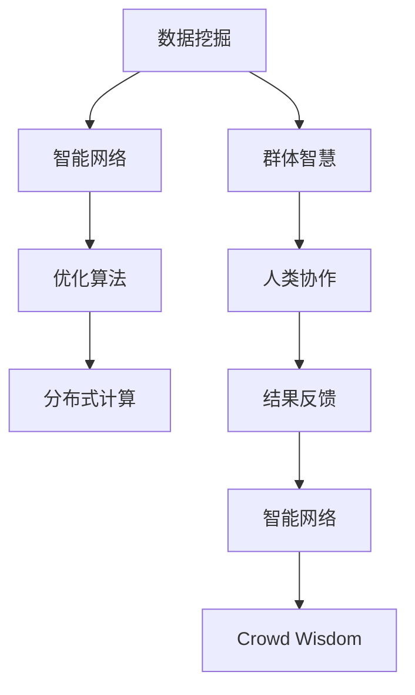

                 

# 群体智慧：人类计算的无限潜力

> 关键词：群体智慧,人类计算,分布式协作,智能网络,数据挖掘,优化算法

## 1. 背景介绍

### 1.1 问题由来
现代科技的飞速发展，使得大规模数据处理和计算变得前所未有的重要。然而，传统集中式计算的局限性逐渐显现，无法满足对速度、容量和灵活性不断提升的要求。在人类社会日益数字化、智能化的趋势下，一种新的计算范式应运而生——群体智慧，即通过大规模、分布式的人类协作，充分发挥集体的智慧和能力，实现计算的无限潜力。

### 1.2 问题核心关键点
群体智慧的核心在于通过网络和数据挖掘技术，将分散在各地的计算资源和知识整合起来，形成高效、动态的智能网络。这种智能网络具有自适应、自组织、自学习的能力，能够在复杂多变的场景中快速响应和优化，从而解决传统集中计算难以应对的难题。

### 1.3 问题研究意义
群体智慧的兴起，对计算资源的利用效率、知识共享机制、社会协作模式等诸多方面都带来了深刻影响。其研究意义在于：
- 提升计算能力：通过分布式协作，大幅提升数据处理和计算速度，实现前所未有的计算能力。
- 优化资源分配：动态调整计算资源，优化任务分配，最大化资源利用效率。
- 促进知识共享：打破信息孤岛，实现知识共享和创新。
- 强化社会协作：构建智能网络，促进大规模协同工作，提升社会生产力。
- 加速技术发展：加速新技术的研发和应用，推动经济社会进步。

## 2. 核心概念与联系

### 2.1 核心概念概述

为更好地理解群体智慧的原理和架构，本节将介绍几个关键概念：

- **群体智慧(Crowd Wisdom)**：利用大规模、分布式的人类协作，通过网络和数据挖掘技术，充分发挥集体的智慧和能力，实现高效、动态的智能网络。
- **智能网络(Intelligent Network)**：由众多节点和边构成的分布式系统，通过数据和信息的流动实现协作和优化。
- **分布式计算(Distributed Computing)**：将计算任务分解为多个子任务，分配给多个计算节点并行处理，最终将结果汇总输出的计算范式。
- **数据挖掘(Data Mining)**：通过算法发现数据中隐藏的规律和知识，支持智能网络的构建和优化。
- **优化算法(Optimization Algorithms)**：用于最大化智能网络的目标函数，提升网络性能和效率。

这些概念之间通过网络和数据挖掘技术紧密联系，形成一个有机整体。智能网络依赖于数据挖掘提取出的知识进行优化，而优化算法又进一步提升网络性能，实现群体智慧的高效运作。

### 2.2 核心概念原理和架构的 Mermaid 流程图



这个流程图展示了群体智慧的原理和架构：
1. **数据挖掘**：从海量数据中提取知识，为智能网络提供支持。
2. **智能网络**：利用提取出的知识进行优化和协作，形成高效的网络结构。
3. **优化算法**：通过优化算法提升智能网络的性能。
4. **分布式计算**：将计算任务分解为子任务，并行处理。
5. **群体智慧**：利用大规模人类协作和智能网络，实现高效的分布式计算。
6. **人类协作**：通过网络和数据共享，促进大规模协同工作。
7. **结果反馈**：智能网络根据反馈调整优化算法，实现自适应和自学习。

## 3. 核心算法原理 & 具体操作步骤

### 3.1 算法原理概述
群体智慧的核心算法原理包括分布式计算、数据挖掘和优化算法。分布式计算通过任务分解和并行处理，实现高效计算；数据挖掘通过算法发现数据中隐藏的规律和知识；优化算法则用于提升智能网络的目标函数，实现高效协作。

### 3.2 算法步骤详解
以下是群体智慧的主要操作步骤：

1. **数据收集与预处理**：从多个来源收集数据，并进行清洗和预处理，保证数据的质量和可用性。
2. **分布式任务分解**：将大任务分解为多个子任务，分配给不同节点并行处理。
3. **数据挖掘与知识提取**：使用数据挖掘算法提取数据中的关键信息，形成知识图谱和模式库。
4. **智能网络构建**：利用提取出的知识构建智能网络，并通过优化算法进行优化。
5. **分布式计算与协作**：在智能网络中进行分布式计算，利用协作和反馈机制提升性能。
6. **结果反馈与优化**：根据计算结果和性能指标，调整优化算法，实现自适应和自学习。
7. **任务结果汇总**：将计算结果汇总输出，形成最终服务。

### 3.3 算法优缺点
群体智慧的优势在于：
- 高效计算：通过分布式协作，实现高效的计算和数据处理。
- 知识共享：打破信息孤岛，实现大规模知识共享和创新。
- 自适应学习：智能网络具有自适应和自学习能力，能够快速响应变化。

然而，群体智慧也存在一些局限性：
- 数据质量依赖：群体智慧的效果很大程度上依赖于数据的质量和可用性。
- 网络通信开销：智能网络中的节点通信和数据传输会产生一定的开销，影响性能。
- 协作难度：大规模人类协作需要协调和管理，存在一定的复杂性。
- 安全性问题：智能网络中的数据安全和隐私保护问题需要特别关注。

### 3.4 算法应用领域
群体智慧在多个领域展现了强大的应用潜力：

- **智能交通**：通过分布式计算和协作，实现智能交通管理和优化，减少拥堵和事故。
- **供应链管理**：利用智能网络进行供应链优化，提升效率和降低成本。
- **金融风控**：通过数据挖掘和优化算法，实现金融风险评估和预测，保障金融安全。
- **环境保护**：利用智能网络和大数据技术，进行环境监测和污染治理。
- **医疗健康**：通过智能网络进行疾病预测和资源优化，提升医疗服务质量。
- **农业生产**：利用智能网络进行农业管理和优化，提高生产效率和质量。
- **社会治理**：构建智能网络进行社会事件监测和响应，提升治理水平。

## 4. 数学模型和公式 & 详细讲解 & 举例说明

### 4.1 数学模型构建

群体智慧的数学模型通常基于分布式计算、数据挖掘和优化算法的理论框架。以下以线性回归模型为例，简要介绍群体智慧中的数学模型构建过程。

假设群体智慧系统由 $N$ 个节点构成，每个节点处理的数据量为 $x_i \in \mathbb{R}^d$，对应的结果为 $y_i \in \mathbb{R}$。定义目标函数为均方误差：

$$
J(\mathbf{w}) = \frac{1}{N}\sum_{i=1}^N (y_i - \mathbf{w} \cdot x_i)^2
$$

其中 $\mathbf{w} \in \mathbb{R}^d$ 为待优化的参数。群体智慧的目标是最小化目标函数 $J(\mathbf{w})$。

### 4.2 公式推导过程

通过梯度下降算法，求得最优参数 $\mathbf{w}^*$ 的更新公式为：

$$
\mathbf{w} \leftarrow \mathbf{w} - \eta \nabla_{\mathbf{w}}J(\mathbf{w})
$$

其中 $\eta$ 为学习率，$\nabla_{\mathbf{w}}J(\mathbf{w})$ 为目标函数对参数 $\mathbf{w}$ 的梯度。

在实践中，为了提升计算效率，通常采用分布式梯度下降算法，将梯度计算和更新过程分布到各个节点上。例如，基于中心化的分布式梯度下降算法（SGD）和基于去中心化的分布式梯度下降算法（如Ring SGD、Star SGD等），都可以有效地实现参数更新。

### 4.3 案例分析与讲解
以下通过一个简单的案例来说明群体智慧的应用过程：

假设一个城市交通管理系统，需要优化信号灯的开关时机，减少交通拥堵。系统由多个监控摄像头和车辆传感器构成，每个摄像头和传感器收集的数据构成了输入 $x_i$，对应的交通流量 $y_i$ 为输出。

1. **数据收集与预处理**：从各个监控摄像头和车辆传感器收集数据，并进行清洗和预处理，去除噪音和异常值，保证数据的质量。
2. **分布式任务分解**：将交通流量的优化问题分解为多个子问题，分配给不同摄像头和传感器节点并行处理。
3. **数据挖掘与知识提取**：使用数据挖掘算法（如决策树、神经网络等）提取数据中的交通流量规律，形成知识图谱和模式库。
4. **智能网络构建**：利用提取出的知识构建智能网络，并通过优化算法（如遗传算法、粒子群算法等）进行优化。
5. **分布式计算与协作**：在智能网络中进行分布式计算，利用协作和反馈机制提升信号灯优化效果。
6. **结果反馈与优化**：根据交通流量优化结果和性能指标，调整优化算法，实现自适应和自学习。
7. **任务结果汇总**：将优化后的信号灯开关时机汇总输出，实现交通流量优化。

通过这个案例，可以看到群体智慧在优化实际问题中的作用。通过分布式计算和协作，系统能够高效地处理海量数据，并通过智能网络实现优化。

## 5. 项目实践：代码实例和详细解释说明

### 5.1 开发环境搭建

在实践中，群体智慧的开发通常需要分布式计算平台和数据挖掘工具的支持。以下是使用Apache Spark和Python进行群体智慧开发的开发环境配置流程：

1. 安装Apache Spark：从官网下载并安装Apache Spark，用于分布式计算。
2. 安装Python开发环境：安装Python 3.6+和必要的依赖库，如NumPy、Pandas等。
3. 配置Spark环境：配置Spark环境变量，如SPARK_HOME、HADOOP_HOME等。
4. 安装Spark分布式计算库：如Spark SQL、Spark Streaming等。
5. 安装数据挖掘工具：如Scikit-learn、XGBoost等。

完成上述步骤后，即可在Spark环境中开始群体智慧开发。

### 5.2 源代码详细实现

以下是一个简单的群体智慧示例代码，使用Apache Spark和Scikit-learn实现分布式数据挖掘和优化算法：

```python
from pyspark.sql import SparkSession
from pyspark.ml import Pipeline, RegressionModel
from pyspark.ml.feature import VectorAssembler
from sklearn.linear_model import LinearRegression
from sklearn.metrics import mean_squared_error

# 创建SparkSession
spark = SparkSession.builder.appName("Crowd Wisdom").getOrCreate()

# 数据收集与预处理
data = spark.read.csv("data.csv", header=True, inferSchema=True)
data = data.select("x1", "x2", "x3", "y")

# 数据挖掘与知识提取
assembler = VectorAssembler(inputCols=["x1", "x2", "x3"], outputCol="features")
pipeline = Pipeline(stages=[assembler])
model = pipeline.fit(data)
features = model.transform(data).select("features", "y")

# 分布式计算与协作
from pyspark.mllib.regression import LinearRegressionWithSGD
from pyspark.mllib.evaluation import RegressionMetrics

data = features.rdd
reg = LinearRegressionWithSGD.train(data, iterations=10, lambda_=0.1)
y_pred = reg.predict(data.map(lambda x: float(x[0])))
reg_params = reg.weights.toArray().tolist()

# 结果反馈与优化
metrics = RegressionMetrics(y_true=features.rdd.map(lambda x: float(x[1])), predicted=reg_params)
mse = metrics.meanSquaredError
print(f"Mean Squared Error: {mse}")

# 任务结果汇总
reg_params = [reg.getParam("regParo") for param in reg.params]
```

### 5.3 代码解读与分析

让我们再详细解读一下关键代码的实现细节：

- **Spark环境配置**：使用SparkSession创建Spark环境，并配置必要的变量。
- **数据收集与预处理**：从本地文件系统读取数据，并进行清洗和预处理，去除噪音和异常值。
- **数据挖掘与知识提取**：使用VectorAssembler将特征变量转换为向量，使用Pipeline进行数据挖掘，将特征变量映射到输出变量。
- **分布式计算与协作**：使用LinearRegressionWithSGD进行分布式线性回归计算，生成预测结果和模型参数。
- **结果反馈与优化**：使用RegressionMetrics计算均方误差，并输出结果。
- **任务结果汇总**：提取模型参数，完成优化和结果汇总。

可以看到，使用Spark和Scikit-learn等工具，可以轻松实现群体智慧的分布式数据挖掘和优化算法。开发者可以将更多精力放在数据处理和算法改进上，而不必过多关注底层的实现细节。

## 6. 实际应用场景

### 6.1 智能交通

群体智慧在智能交通管理中展现了巨大的应用潜力。通过分布式计算和协作，智能交通系统能够实时监测和优化交通流量，减少拥堵和事故，提升交通安全和效率。

在实践中，可以将交通流量数据、车辆位置、信号灯状态等信息作为输入，使用智能网络进行优化和协作，形成动态的交通管理策略。例如，基于实时数据，智能系统可以动态调整信号灯开关时机，优化交通流，减少拥堵。

### 6.2 供应链管理

供应链管理需要高效地协调和优化各个环节，实现资源的最优配置和利用。群体智慧可以通过分布式计算和协作，实现供应链的动态优化和调整。

在实践中，可以将供应链中的各个节点数据、订单信息、物流状态等作为输入，使用智能网络进行优化和协作，形成高效的供应链管理系统。例如，基于实时数据，智能系统可以动态调整库存和物流策略，优化供应链效率和成本。

### 6.3 金融风控

金融风控需要实时评估和预测风险，保障金融安全。群体智慧可以通过分布式计算和协作，实现金融风险的实时评估和预测。

在实践中，可以将金融数据、交易记录、市场行情等作为输入，使用智能网络进行优化和协作，形成实时的风险评估和预测系统。例如，基于实时数据，智能系统可以动态调整风险评估策略，预测市场波动和风险。

### 6.4 环境保护

环境保护需要实时监测和评估环境变化，制定有效的治理策略。群体智慧可以通过分布式计算和协作，实现环境监测和治理的优化和调整。

在实践中，可以将环境监测数据、气象数据、污染源数据等作为输入，使用智能网络进行优化和协作，形成智能环境监测和治理系统。例如，基于实时数据，智能系统可以动态调整污染治理策略，监测环境变化。

## 7. 工具和资源推荐

### 7.1 学习资源推荐

为了帮助开发者系统掌握群体智慧的理论基础和实践技巧，这里推荐一些优质的学习资源：

1. **《分布式计算：原理与实现》**：深入讲解分布式计算的原理和实现技术，涵盖Spark、Hadoop等主流平台。
2. **《数据挖掘与统计学习》**：全面介绍数据挖掘的算法和应用，包括数据预处理、特征提取、模型选择等。
3. **《机器学习实战》**：实战指南，通过具体案例介绍Scikit-learn等数据挖掘工具的使用。
4. **《智能网络与群体智慧》**：系统讲解智能网络和群体智慧的原理、架构和应用，提供实际案例和代码实现。
5. **Apache Spark官方文档**：详细介绍了Spark的配置、API和最佳实践，是学习Spark的好资源。
6. **Hadoop官方文档**：涵盖Hadoop生态系统的配置、开发和部署，提供丰富的示例代码。

通过对这些资源的学习实践，相信你一定能够快速掌握群体智慧的精髓，并用于解决实际的计算问题。

### 7.2 开发工具推荐

高效的开发离不开优秀的工具支持。以下是几款用于群体智慧开发的常用工具：

1. **Apache Spark**：基于内存计算的分布式计算平台，支持大规模数据处理和分析。
2. **Hadoop**：开源的分布式计算框架，支持大数据存储和处理。
3. **Scikit-learn**：基于Python的机器学习库，提供丰富的数据挖掘和优化算法。
4. **XGBoost**：高效的分布式决策树算法，支持大规模数据处理和优化。
5. **TensorBoard**：TensorFlow的可视化工具，实时监测模型训练状态和性能指标。
6. **Wealth & Biases**：模型训练的实验跟踪工具，记录和可视化模型训练过程中的各项指标。

合理利用这些工具，可以显著提升群体智慧的开发效率，加快创新迭代的步伐。

### 7.3 相关论文推荐

群体智慧的发展源于学界的持续研究。以下是几篇奠基性的相关论文，推荐阅读：

1. **分布式计算与网络**：《Paxos Made Simple》论文介绍了分布式一致性算法Paxos，是分布式计算领域的经典之作。
2. **数据挖掘与优化**：《K-means: A Theory of Simple Clustering》论文介绍了K-means算法，是数据挖掘领域的经典之作。
3. **智能网络与群体智慧**：《Swarm Intelligence: From Natural to Artificial Systems》书籍系统讲解了智能网络和群体智慧的原理、架构和应用。
4. **分布式优化算法**：《Linear Regression with Stochastic Gradient Descent》论文介绍了随机梯度下降算法，是分布式优化算法的重要基础。

这些论文代表了大数据计算和群体智慧的发展脉络。通过学习这些前沿成果，可以帮助研究者把握学科前进方向，激发更多的创新灵感。

## 8. 总结：未来发展趋势与挑战

### 8.1 研究成果总结

本文对群体智慧的原理和实践进行了全面系统的介绍。首先阐述了群体智慧的兴起背景和研究意义，明确了其在高效计算、知识共享、自适应学习等方面的独特价值。其次，从原理到实践，详细讲解了分布式计算、数据挖掘和优化算法的核心步骤，给出了群体智慧任务开发的完整代码实例。同时，本文还广泛探讨了群体智慧在智能交通、供应链管理、金融风控、环境保护等多个领域的应用前景，展示了群体智慧的巨大潜力。最后，本文精选了群体智慧技术的各类学习资源，力求为读者提供全方位的技术指引。

通过本文的系统梳理，可以看到，群体智慧通过分布式协作和大数据计算，实现了高效、动态的智能网络。其应用前景广阔，能够在多个领域提升效率和效果，推动社会生产力进步。未来，伴随分布式计算和数据挖掘技术的持续演进，群体智慧必将在计算资源利用效率、知识共享机制、社会协作模式等方面带来深刻变革。

### 8.2 未来发展趋势

展望未来，群体智慧的发展将呈现以下几个趋势：

1. **计算效率提升**：随着分布式计算平台和数据挖掘算法的进步，群体智慧的计算效率将进一步提升。
2. **智能网络优化**：通过引入更多优化算法和知识图谱，智能网络将更具自适应和学习能力。
3. **数据安全保障**：随着数据量的大幅增长，群体智慧的数据安全问题将受到更多关注，需要加强数据加密和隐私保护。
4. **边缘计算**：将计算任务下沉到边缘节点，减少中心节点的通信开销，提高系统响应速度。
5. **跨领域融合**：群体智慧将与其他AI技术（如机器学习、深度学习等）进行更深入的融合，形成更全面、更智能的系统。

这些趋势凸显了群体智慧的广阔前景，为未来的计算和智能化发展提供了新的可能性。

### 8.3 面临的挑战

尽管群体智慧技术已经取得了显著进展，但在迈向更加智能化、普适化应用的过程中，仍面临诸多挑战：

1. **数据质量与获取**：群体智慧的效果很大程度上依赖于数据的质量和获取难度，对于特定领域的数据获取和预处理仍需进一步优化。
2. **分布式协作复杂性**：大规模分布式协作需要复杂的协调和管理，如何提升协作效率和减少通信开销是重要课题。
3. **系统鲁棒性**：智能网络面临故障和攻击的风险，如何提升系统的鲁棒性和可靠性需要更多研究。
4. **隐私与安全**：智能网络中的数据安全和隐私保护问题需要特别关注，如何确保数据隐私和网络安全是关键挑战。
5. **计算资源管理**：分布式计算平台需要高效的资源管理策略，避免资源浪费和过度配置。

这些挑战需要在未来研究中不断克服，才能使群体智慧技术更好地服务于社会生产力和经济发展。

### 8.4 研究展望

面对群体智慧技术面临的诸多挑战，未来的研究需要在以下几个方面寻求新的突破：

1. **高效数据挖掘算法**：研究更高效、更智能的数据挖掘算法，提升数据处理和挖掘效率。
2. **分布式优化算法**：开发更高效的分布式优化算法，提升智能网络的协作和优化能力。
3. **边缘计算与分布式协作**：研究如何将计算任务下沉到边缘节点，减少中心节点的通信开销，提高系统响应速度。
4. **安全与隐私保护**：研究如何在保护数据隐私和安全的前提下，实现智能网络的协同工作。
5. **跨领域融合**：研究群体智慧与其他AI技术的融合，形成更全面、更智能的系统。

这些研究方向的探索，必将引领群体智慧技术迈向更高的台阶，为构建更高效、更智能、更安全的智能系统铺平道路。

## 9. 附录：常见问题与解答

**Q1: 群体智慧与分布式计算的区别是什么？**

A: 分布式计算是一种计算范式，通过将计算任务分解为多个子任务，分配给多个计算节点并行处理，最终将结果汇总输出。而群体智慧是一种利用大规模、分布式人类协作，通过网络和数据挖掘技术，充分发挥集体智慧和能力的计算范式。群体智慧不仅关注计算效率，还强调知识共享和协作，更具智能和自适应能力。

**Q2: 群体智慧的核心技术是什么？**

A: 群体智慧的核心技术包括分布式计算、数据挖掘和优化算法。分布式计算通过任务分解和并行处理，实现高效计算；数据挖掘通过算法发现数据中隐藏的规律和知识；优化算法则用于提升智能网络的目标函数，实现高效协作。

**Q3: 群体智慧在实际应用中面临哪些挑战？**

A: 群体智慧在实际应用中面临以下挑战：
1. 数据质量与获取：群体智慧的效果很大程度上依赖于数据的质量和获取难度，对于特定领域的数据获取和预处理仍需进一步优化。
2. 分布式协作复杂性：大规模分布式协作需要复杂的协调和管理，如何提升协作效率和减少通信开销是重要课题。
3. 系统鲁棒性：智能网络面临故障和攻击的风险，如何提升系统的鲁棒性和可靠性需要更多研究。
4. 隐私与安全：智能网络中的数据安全和隐私保护问题需要特别关注，如何确保数据隐私和网络安全是关键挑战。
5. 计算资源管理：分布式计算平台需要高效的资源管理策略，避免资源浪费和过度配置。

这些挑战需要在未来研究中不断克服，才能使群体智慧技术更好地服务于社会生产力和经济发展。

**Q4: 群体智慧如何与其他AI技术进行融合？**

A: 群体智慧可以与其他AI技术（如机器学习、深度学习等）进行更深入的融合，形成更全面、更智能的系统。例如，可以将群体智慧应用于自然语言处理任务，通过智能网络和数据挖掘技术，优化自然语言处理模型，提升其效果和效率。此外，群体智慧还可以应用于计算机视觉、语音识别等AI领域，通过分布式协作和大数据计算，提升这些领域的计算能力和效果。

---

作者：禅与计算机程序设计艺术 / Zen and the Art of Computer Programming

