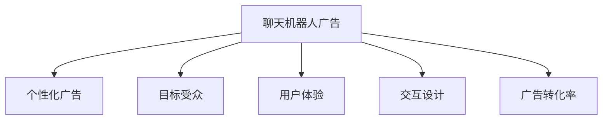

                 

# 聊天机器人广告业：个性化广告活动和目标受众

在数字时代，广告行业正经历着一场深刻的变革。传统的广告方式，如电视、广播、印刷等，正逐渐被在线广告所取代。这种转变，既带来了机遇，也带来了挑战。在线广告的优势在于其精准投放，能够针对用户的兴趣和行为进行个性化推荐，大幅提升广告转化率。在这一过程中，聊天机器人广告作为新型广告形式，以其个性化和互动性的特点，迅速崛起，成为广告业的新宠。

## 1. 背景介绍

### 1.1 问题由来

随着互联网的普及，用户对广告的容忍度越来越低。传统广告的被动接受方式，已经被主动选择所替代。用户不再简单地消费信息，而是希望根据自身需求选择内容，这种变化催生了个性化广告的需求。而聊天机器人作为一种新型交互方式，能够提供即时响应和个性化推荐，完美契合了这一需求。

### 1.2 问题核心关键点

聊天机器人广告的核心在于其个性化的用户体验。通过与用户的交互，聊天机器人能够动态调整广告内容和形式，匹配用户当前状态和需求，从而提升广告的吸引力和转化率。此外，聊天机器人广告还可以进行数据分析和用户行为跟踪，帮助广告主更精准地定位目标受众，实现更高效的广告投放。

### 1.3 问题研究意义

研究聊天机器人广告，对于提升广告投放效果、降低广告成本、改善用户体验具有重要意义：

1. 提升广告转化率：通过个性化推荐，聊天机器人能够将合适的广告推荐给最相关的用户，显著提高广告的点击率和转化率。
2. 降低广告成本：精准定位目标受众，避免无效广告投放，减少广告浪费，降低广告主成本。
3. 改善用户体验：互动式的广告形式，能够提供更加自然和高效的沟通方式，提升用户满意度。
4. 推动广告创新：聊天机器人广告作为一种新型广告形式，带来了新的广告投放方式和创意灵感，促进广告行业的技术创新。

## 2. 核心概念与联系

### 2.1 核心概念概述

为更好地理解聊天机器人广告，本节将介绍几个密切相关的核心概念：

- 聊天机器人(Chatbot)：一种能够通过自然语言处理(NLP)技术，与用户进行交互的人工智能程序。聊天机器人广告则是将聊天机器人嵌入广告系统，提供个性化推荐和交互式体验。
- 个性化广告(Personalized Advertising)：通过数据分析和算法优化，针对用户的行为和兴趣进行个性化推荐，从而提升广告效果。
- 目标受众(Target Audience)：广告投放需要明确的目标群体，通过用户画像、行为数据等，精准定位。
- 用户体验(User Experience, UX)：衡量广告效果的重要指标，涉及用户对广告形式的接受程度和互动体验。
- 交互设计(Interactive Design)：优化聊天机器人的交互流程和语言表达，提升用户满意度。
- 广告转化率(Advertising Conversion Rate)：广告投放的最终效果指标，反映用户对广告的响应程度。

这些核心概念之间的逻辑关系可以通过以下Mermaid流程图来展示：



这个流程图展示了个体概念之间的联系：

1. 聊天机器人广告利用个性化广告技术，通过目标受众分析和用户体验设计，提高广告转化率。
2. 交互设计是用户体验的重要组成部分，直接影响用户对广告的反应。
3. 广告转化率是广告投放效果的最终指标，影响广告策略的调整和优化。

## 3. 核心算法原理 & 具体操作步骤

### 3.1 算法原理概述

聊天机器人广告的核心算法原理在于利用机器学习技术，对用户行为和偏好进行分析和建模，从而实现个性化广告推荐。其核心步骤如下：

1. **数据收集**：收集用户的历史行为数据，包括浏览记录、点击行为、搜索关键词等。
2. **用户画像**：根据用户数据，生成用户画像，描述用户的兴趣、偏好和行为特征。
3. **广告推荐**：利用机器学习算法，如协同过滤、深度学习等，推荐最适合用户的广告。
4. **交互优化**：根据用户反馈，动态调整广告内容和形式，提升用户体验。
5. **效果评估**：分析广告效果，进行效果评估和优化调整。

### 3.2 算法步骤详解

**Step 1: 数据收集与预处理**
- 使用网站分析工具，如Google Analytics，收集用户行为数据。
- 将用户行为数据进行清洗和标注，去除噪声数据，转换为可用的格式。
- 对用户数据进行划分，分为训练集和测试集。

**Step 2: 用户画像生成**
- 利用用户历史行为数据，构建用户画像。
- 使用文本分析工具，如TF-IDF、LDA等，提取用户兴趣点。
- 通过协同过滤算法，生成用户相似度矩阵，构建用户画像。

**Step 3: 广告推荐模型训练**
- 选择适合的机器学习算法，如协同过滤、深度神经网络等。
- 使用训练集数据，训练广告推荐模型。
- 进行模型调参，选择最优模型。

**Step 4: 广告推荐与交互优化**
- 在测试集上评估广告推荐模型，计算效果指标。
- 根据用户反馈，动态调整广告内容和形式。
- 利用A/B测试，对比不同广告推荐策略的效果，选择最佳方案。

**Step 5: 效果评估与优化**
- 分析广告投放效果，计算广告转化率等关键指标。
- 根据效果评估结果，调整广告策略和投放方案。
- 持续优化广告推荐模型，提升广告效果。

### 3.3 算法优缺点

聊天机器人广告的优点包括：

- 个性化推荐：通过分析用户行为，提供个性化的广告推荐，提升广告转化率。
- 实时交互：聊天机器人能够实时与用户互动，提升用户参与度和满意度。
- 动态调整：根据用户反馈，动态调整广告内容和形式，提升广告效果。

然而，聊天机器人广告也存在一些缺点：

- 数据隐私问题：用户数据隐私保护成为一大挑战，需要严格遵守数据法律法规。
- 技术门槛高：聊天机器人广告涉及多种先进技术，如机器学习、自然语言处理等，对技术要求较高。
- 广告成本：聊天机器人广告的开发和维护成本较高，需要投入大量资源。

### 3.4 算法应用领域

聊天机器人广告目前已在多个领域得到广泛应用：

- **电商广告**：通过聊天机器人，电商企业能够提供个性化的产品推荐，提升用户购物体验。
- **金融广告**：金融公司利用聊天机器人，向用户提供个性化的理财和投资建议，提升用户粘性。
- **旅游广告**：旅游公司通过聊天机器人，向用户提供目的地信息和个性化旅行建议，提升旅游转化率。
- **医疗广告**：医疗广告公司利用聊天机器人，向用户提供健康咨询和个性化医疗建议，提升健康管理效果。
- **教育广告**：教育机构通过聊天机器人，向用户提供课程推荐和学习建议，提升用户教育参与度。

此外，聊天机器人广告还被应用于广告创意设计、社交媒体营销、媒体内容推荐等多个领域，为广告主提供更高效、更精准的广告投放方式。

## 4. 数学模型和公式 & 详细讲解 & 举例说明

### 4.1 数学模型构建

本节将使用数学语言对聊天机器人广告的算法进行更严格的刻画。

假设用户历史行为数据为 $D=\{(x_i,y_i)\}_{i=1}^N$，其中 $x_i$ 为用户的浏览记录、点击行为等，$y_i$ 为用户的标签，如年龄、性别、兴趣等。定义用户画像为 $P$，广告推荐模型为 $M$。

聊天机器人广告的优化目标是最小化广告推荐模型的误差，即：

$$
\min_{P,M} \sum_{i=1}^N \ell(M(x_i),y_i)
$$

其中 $\ell$ 为损失函数，可以是交叉熵损失或均方误差损失等。

### 4.2 公式推导过程

以交叉熵损失函数为例，假定广告推荐模型 $M$ 对用户 $x_i$ 的推荐结果为 $\hat{y}_i$，真实标签为 $y_i$，则交叉熵损失函数为：

$$
\ell(M(x_i),y_i) = -y_i \log \hat{y}_i - (1-y_i) \log (1-\hat{y}_i)
$$

将损失函数代入优化目标，得：

$$
\min_{P,M} \sum_{i=1}^N [-y_i \log \hat{y}_i - (1-y_i) \log (1-\hat{y}_i)]
$$

在得到损失函数后，即可使用梯度下降等优化算法，迭代优化用户画像 $P$ 和广告推荐模型 $M$，直至收敛。

### 4.3 案例分析与讲解

假设某电商平台希望通过聊天机器人广告提升用户转化率。平台收集了用户的历史浏览记录 $x_i$ 和点击行为 $y_i$，其中 $x_i$ 为“浏览某商品页面”，$y_i$ 为“购买该商品”。

使用协同过滤算法生成用户画像 $P$，将用户分为高价值用户和普通用户。高价值用户为喜欢购买高端商品的用户，普通用户为喜欢购买大众商品的用户。然后，利用深度神经网络 $M$ 对用户画像 $P$ 进行广告推荐。

在模型训练过程中，交叉熵损失函数 $\ell(M(x_i),y_i)$ 用于衡量广告推荐模型的预测效果。在测试集上，计算广告转化率，评估模型效果。根据效果评估结果，调整模型参数，优化广告策略。

## 5. 项目实践：代码实例和详细解释说明

### 5.1 开发环境搭建

在进行聊天机器人广告的开发前，我们需要准备好开发环境。以下是使用Python进行PyTorch开发的环境配置流程：

1. 安装Anaconda：从官网下载并安装Anaconda，用于创建独立的Python环境。

2. 创建并激活虚拟环境：
```bash
conda create -n pytorch-env python=3.8 
conda activate pytorch-env
```

3. 安装PyTorch：根据CUDA版本，从官网获取对应的安装命令。例如：
```bash
conda install pytorch torchvision torchaudio cudatoolkit=11.1 -c pytorch -c conda-forge
```

4. 安装TensorFlow：由Google主导开发的开源深度学习框架，生产部署方便，适合大规模工程应用。同样有丰富的预训练语言模型资源。

5. 安装TensorFlow：
```bash
pip install tensorflow
```

6. 安装各类工具包：
```bash
pip install numpy pandas scikit-learn matplotlib tqdm jupyter notebook ipython
```

完成上述步骤后，即可在`pytorch-env`环境中开始聊天机器人广告的开发实践。

### 5.2 源代码详细实现

下面我们以电商平台聊天机器人广告为例，给出使用TensorFlow进行深度神经网络训练的PyTorch代码实现。

首先，定义广告推荐模型：

```python
import tensorflow as tf
from tensorflow.keras import layers

class AdRecModel(tf.keras.Model):
    def __init__(self, input_dim, hidden_dim=64):
        super(AdRecModel, self).__init__()
        self.dense1 = layers.Dense(hidden_dim, activation='relu')
        self.dense2 = layers.Dense(1, activation='sigmoid')
    
    def call(self, inputs):
        x = self.dense1(inputs)
        x = self.dense2(x)
        return x
```

然后，定义数据集和数据增强：

```python
from tensorflow.keras.preprocessing import sequence
from tensorflow.keras.preprocessing.text import Tokenizer

class AdRecDataset(tf.keras.utils.Sequence):
    def __init__(self, data, labels, batch_size):
        self.data = data
        self.labels = labels
        self.batch_size = batch_size
        self.tokenizer = Tokenizer(num_words=10000, oov_token='<OOV>')
        self.tokenizer.fit_on_texts(self.data)
        self.sequence = []
        self.num_sequences = 0
        
    def __len__(self):
        return len(self.data) // self.batch_size
    
    def __getitem__(self, idx):
        start = idx * self.batch_size
        end = (idx + 1) * self.batch_size
        batch = self.data[start:end]
        batch_labels = self.labels[start:end]
        sequence = [self.tokenizer.texts_to_sequences(x) for x in batch]
        sequences = sequence[:end]
        labels = batch_labels[:end]
        return tf.data.Dataset.from_tensor_slices((sequences, labels))
```

接着，定义模型训练和评估函数：

```python
from tensorflow.keras.callbacks import EarlyStopping
from tensorflow.keras import optimizers

def train_model(model, data, labels, batch_size, epochs, validation_data):
    model.compile(loss='binary_crossentropy', optimizer=optimizers.Adam(learning_rate=0.01), metrics=['accuracy'])
    early_stopping = EarlyStopping(monitor='val_loss', patience=3)
    model.fit(data, labels, batch_size=batch_size, epochs=epochs, validation_data=validation_data, callbacks=[early_stopping])

def evaluate_model(model, test_data, test_labels, batch_size):
    model.evaluate(test_data, test_labels, batch_size=batch_size)
```

最后，启动训练流程并在测试集上评估：

```python
epochs = 10
batch_size = 32

# 假设已定义好数据集和标签
train_data = ...
train_labels = ...
test_data = ...
test_labels = ...

train_model(model, train_data, train_labels, batch_size, epochs, test_data)
evaluate_model(model, test_data, test_labels, batch_size)
```

以上就是使用TensorFlow对聊天机器人广告进行深度神经网络训练的完整代码实现。可以看到，TensorFlow提供了强大的计算图和模型优化工具，使得聊天机器人广告的开发更加高效。

### 5.3 代码解读与分析

让我们再详细解读一下关键代码的实现细节：

**AdRecModel类**：
- `__init__`方法：初始化模型结构，包含两个全连接层，一个输出层。
- `call`方法：定义模型前向传播逻辑，将输入数据通过全连接层，输出预测结果。

**AdRecDataset类**：
- `__init__`方法：初始化数据集，对文本数据进行分词和截断处理，转换为序列数据。
- `__len__`方法：返回数据集的长度。
- `__getitem__`方法：从数据集中随机抽取样本，将其转换为TensorFlow可用的格式。

**train_model函数**：
- 定义模型的编译过程，包括损失函数、优化器等。
- 定义EarlyStopping回调函数，监控模型在验证集上的表现，在连续3个epoch未提升时停止训练。
- 调用模型训练方法，进行模型训练。

**evaluate_model函数**：
- 使用测试集对模型进行评估，输出模型在测试集上的准确率和损失值。

**训练流程**：
- 定义总的epoch数和批大小，开始循环迭代
- 在每个epoch内，先进行训练，然后对测试集进行评估
- 重复上述步骤直至所有epoch训练完成

可以看到，TensorFlow配合深度学习框架的强大封装，使得聊天机器人广告的代码实现变得简洁高效。开发者可以将更多精力放在数据处理、模型改进等高层逻辑上，而不必过多关注底层的实现细节。

当然，工业级的系统实现还需考虑更多因素，如模型的保存和部署、超参数的自动搜索、更灵活的目标受众定义等。但核心的广告推荐逻辑基本与此类似。

## 6. 实际应用场景

### 6.1 智能客服系统

聊天机器人广告可以广泛应用于智能客服系统的构建。传统客服往往需要配备大量人力，高峰期响应缓慢，且一致性和专业性难以保证。而聊天机器人广告则可以通过个性化的推荐，提升用户的购物体验，降低人力成本，提升客服效率。

在技术实现上，可以收集客户的历史购物记录、浏览行为等数据，将其作为输入，通过聊天机器人广告进行个性化推荐。聊天机器人可以通过与客户的即时互动，实时获取用户的反馈，动态调整推荐策略，从而提升客户的购物转化率。

### 6.2 金融广告

金融广告公司可以利用聊天机器人广告，向客户推荐个性化的理财和投资建议。通过分析客户的财务状况、投资偏好等数据，生成个性化的广告内容，提高广告的点击率和转化率。聊天机器人广告的即时互动特性，还能够为客户提供实时的理财咨询，提升客户粘性和满意度。

### 6.3 旅游广告

旅游公司通过聊天机器人广告，向用户提供个性化的旅行建议和目的地推荐。通过收集用户的旅行偏好、历史搜索记录等数据，生成个性化的广告内容，提升用户的旅游转化率。聊天机器人广告的互动特性，还可以帮助用户规划旅行路线、预订酒店等，提升用户体验。

### 6.4 医疗广告

医疗广告公司可以利用聊天机器人广告，向用户提供个性化的健康咨询和医疗建议。通过分析用户的健康数据、病史等数据，生成个性化的广告内容，提高广告的点击率和转化率。聊天机器人广告的即时互动特性，还能够为客户提供实时的健康咨询，提升客户满意度和健康管理效果。

## 7. 工具和资源推荐

### 7.1 学习资源推荐

为了帮助开发者系统掌握聊天机器人广告的理论基础和实践技巧，这里推荐一些优质的学习资源：

1. 《深度学习理论与实践》系列博文：由大模型技术专家撰写，深入浅出地介绍了深度学习在广告推荐中的应用，包括聊天机器人广告的实现。

2. 《广告推荐系统》在线课程：斯坦福大学开设的广告推荐系统课程，详细讲解了广告推荐系统的设计思路和实现方法。

3. 《Advertise with Chatbots》书籍：全面介绍了聊天机器人广告的设计和实现方法，提供了丰富的案例和实战经验。

4. 《自然语言处理与广告推荐》课程：UCLA大学开设的自然语言处理课程，讲解了自然语言处理在广告推荐中的应用，包括聊天机器人广告的实现。

5. 《广告推荐系统实战》书籍：介绍了广告推荐系统的经典算法和实现方法，包括深度学习、协同过滤等技术在广告推荐中的应用。

通过对这些资源的学习实践，相信你一定能够快速掌握聊天机器人广告的精髓，并用于解决实际的广告推荐问题。

### 7.2 开发工具推荐

高效的开发离不开优秀的工具支持。以下是几款用于聊天机器人广告开发的常用工具：

1. TensorFlow：由Google主导开发的开源深度学习框架，生产部署方便，适合大规模工程应用。提供了丰富的广告推荐模型实现和优化工具。

2. PyTorch：基于Python的开源深度学习框架，灵活动态的计算图，适合快速迭代研究。广告推荐模型有PyTorch版本的实现。

3. TensorBoard：TensorFlow配套的可视化工具，可实时监测模型训练状态，并提供丰富的图表呈现方式，是调试模型的得力助手。

4. Weights & Biases：模型训练的实验跟踪工具，可以记录和可视化模型训练过程中的各项指标，方便对比和调优。

5. Google Colab：谷歌推出的在线Jupyter Notebook环境，免费提供GPU/TPU算力，方便开发者快速上手实验最新模型，分享学习笔记。

合理利用这些工具，可以显著提升聊天机器人广告的开发效率，加快创新迭代的步伐。

### 7.3 相关论文推荐

聊天机器人广告的发展源于学界的持续研究。以下是几篇奠基性的相关论文，推荐阅读：

1. Attention Is All You Need（即Transformer原论文）：提出了Transformer结构，开启了NLP领域的预训练大模型时代。

2. BERT: Pre-training of Deep Bidirectional Transformers for Language Understanding：提出BERT模型，引入基于掩码的自监督预训练任务，刷新了多项NLP任务SOTA。

3. Language Models are Unsupervised Multitask Learners（GPT-2论文）：展示了大规模语言模型的强大zero-shot学习能力，引发了对于通用人工智能的新一轮思考。

4. Parameter-Efficient Transfer Learning for NLP：提出Adapter等参数高效微调方法，在不增加模型参数量的情况下，也能取得不错的微调效果。

5. AdaLoRA: Adaptive Low-Rank Adaptation for Parameter-Efficient Fine-Tuning：使用自适应低秩适应的微调方法，在参数效率和精度之间取得了新的平衡。

这些论文代表了大语言模型微调技术的发展脉络。通过学习这些前沿成果，可以帮助研究者把握学科前进方向，激发更多的创新灵感。

## 8. 总结：未来发展趋势与挑战

### 8.1 总结

本文对聊天机器人广告进行了全面系统的介绍。首先阐述了聊天机器人广告的背景和研究意义，明确了其在提升广告效果、降低广告成本、改善用户体验等方面的独特价值。其次，从原理到实践，详细讲解了广告推荐模型的数学原理和关键步骤，给出了广告推荐任务的代码实例。同时，本文还广泛探讨了聊天机器人广告在智能客服、金融广告、旅游广告等多个行业领域的应用前景，展示了聊天机器人广告的广阔应用空间。

通过本文的系统梳理，可以看到，聊天机器人广告作为一种新型广告形式，凭借其个性化推荐和即时互动的特性，已经展示了强大的市场潜力。未来，伴随深度学习技术的发展和应用场景的拓展，聊天机器人广告必将成为广告行业的重要趋势，推动广告技术的不断进步。

### 8.2 未来发展趋势

展望未来，聊天机器人广告的发展趋势包括：

1. 深度学习技术的进步：深度学习模型能够更好地处理复杂的广告推荐问题，提升广告推荐的精度和效果。

2. 数据的多样化来源：广告推荐系统将更多地利用社交媒体、传感器等数据，获得更全面、准确的用户画像。

3. 模型的多模态融合：将视觉、语音等多模态数据与文本数据结合，提升广告推荐的全面性和准确性。

4. 推荐系统的智能化：利用强化学习、因果推理等技术，构建更加智能化的推荐系统，提升用户体验。

5. 跨领域应用的拓展：聊天机器人广告在更多领域得到应用，如医疗、教育、媒体等，形成新的业务增长点。

6. 算法伦理的重视：随着用户对隐私和公平的关注，广告推荐系统需要更多的伦理考量和数据保护措施。

以上趋势凸显了聊天机器人广告的广阔前景。这些方向的探索发展，必将进一步提升广告投放效果，推动广告技术的创新应用。

### 8.3 面临的挑战

尽管聊天机器人广告已经取得了瞩目成就，但在迈向更加智能化、普适化应用的过程中，它仍面临诸多挑战：

1. 数据隐私问题：用户数据隐私保护成为一大挑战，需要严格遵守数据法律法规。

2. 技术门槛高：聊天机器人广告涉及多种先进技术，如深度学习、自然语言处理等，对技术要求较高。

3. 广告成本：聊天机器人广告的开发和维护成本较高，需要投入大量资源。

4. 广告效果不稳定：广告推荐模型的效果受数据质量、模型参数等因素影响，稳定性有待提高。

5. 用户交互体验不足：聊天机器人广告的即时互动特性，需要不断优化，提升用户满意度。

6. 系统安全问题：广告推荐系统需要防止恶意攻击和数据泄露，保障系统的安全性。

正视聊天机器人广告面临的这些挑战，积极应对并寻求突破，将是实现广告技术成熟的重要步骤。相信随着学界和产业界的共同努力，这些挑战终将一一被克服，聊天机器人广告必将在广告投放中发挥更大的作用。

### 8.4 研究展望

面对聊天机器人广告所面临的种种挑战，未来的研究需要在以下几个方面寻求新的突破：

1. 探索更高效的数据获取方式：利用社交媒体、传感器等非结构化数据，获取更全面、准确的用户画像，减少对用户隐私的依赖。

2. 开发更智能化的广告推荐算法：利用深度学习、强化学习等技术，构建更加智能化的广告推荐系统，提升广告推荐的精度和效果。

3. 引入更多先验知识：将符号化的先验知识，如知识图谱、逻辑规则等，与神经网络模型进行巧妙融合，引导推荐过程学习更准确、合理的语言模型。

4. 实现多模态融合：将视觉、语音等多模态数据与文本数据结合，提升广告推荐的全面性和准确性。

5. 纳入伦理道德约束：在广告推荐系统中引入伦理导向的评估指标，过滤和惩罚有偏见、有害的输出倾向，确保广告推荐的公平性和道德性。

这些研究方向的探索，必将引领聊天机器人广告技术迈向更高的台阶，为广告主提供更高效、更精准的广告投放方式。面向未来，聊天机器人广告还需要与其他广告技术进行更深入的融合，如竞价广告、搜索引擎优化等，协同发力，共同推动广告行业的持续进步。

## 9. 附录：常见问题与解答

**Q1：聊天机器人广告如何平衡用户隐私和数据利用？**

A: 聊天机器人广告需要在用户隐私和数据利用之间取得平衡。以下是一些常用的策略：

1. 匿名化处理：在数据收集过程中，对用户的敏感信息进行匿名化处理，减少隐私泄露风险。

2. 数据最小化原则：仅收集和处理广告推荐所必需的数据，避免过度收集用户隐私信息。

3. 数据保护措施：对用户数据进行加密存储和传输，防止数据泄露和滥用。

4. 用户同意机制：在数据收集和使用前，明确告知用户并获得其同意，尊重用户的选择权。

5. 合规性审查：严格遵守数据隐私法律法规，如GDPR、CCPA等，确保数据使用的合法性。

通过这些措施，可以在利用数据提升广告推荐效果的同时，保护用户隐私，提升用户信任度。

**Q2：如何提升聊天机器人广告的效果？**

A: 提升聊天机器人广告的效果，可以从以下几个方面进行优化：

1. 数据质量：收集高质量的用户行为数据，减少噪声和异常数据，提高模型的准确性。

2. 模型选择：选择适合当前任务和数据特点的机器学习算法，如协同过滤、深度学习等，优化模型结构。

3. 特征工程：提取和选择重要的用户特征，如浏览历史、点击行为、搜索关键词等，提升模型表现。

4. 算法调参：调整模型参数和超参数，如学习率、正则化系数、批大小等，找到最优的模型配置。

5. 实时优化：根据用户反馈和行为变化，动态调整广告内容和形式，提升用户满意度。

6. 多模型集成：构建多个广告推荐模型，取平均输出或进行模型融合，提升广告推荐的效果和稳定性。

通过这些优化措施，可以显著提升聊天机器人广告的效果，提高广告的点击率和转化率。

**Q3：聊天机器人广告在实际应用中需要注意哪些问题？**

A: 聊天机器人广告在实际应用中，需要注意以下问题：

1. 数据隐私问题：确保用户数据隐私保护，遵守数据法律法规。

2. 技术实现问题：确保广告推荐模型的稳定性和可扩展性，避免系统崩溃和数据泄露。

3. 用户体验问题：优化广告推荐内容和形式，提升用户满意度。

4. 系统安全性问题：防止恶意攻击和数据泄露，保障系统安全性。

5. 效果评估问题：设计合理的广告效果评估指标，及时发现和解决问题。

6. 持续优化问题：根据用户反馈和市场变化，持续优化广告推荐策略，提升广告效果。

通过合理应对这些问题，可以在保证广告效果的同时，保护用户隐私和提升用户体验。

---

作者：禅与计算机程序设计艺术 / Zen and the Art of Computer Programming

