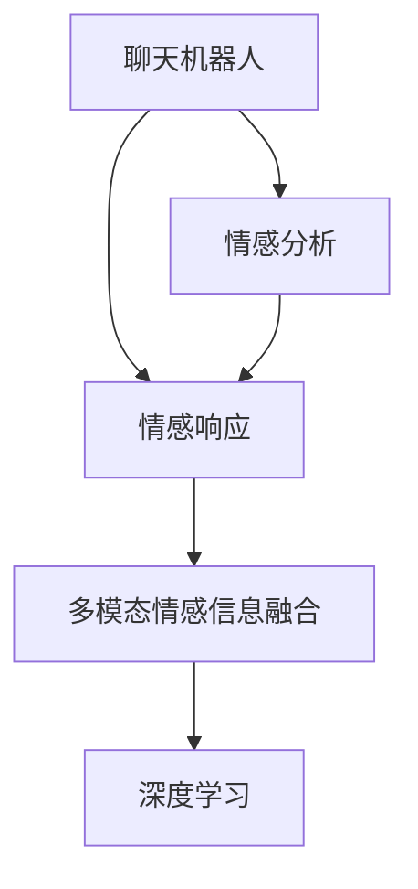

                 

# 聊天机器人情感连接的未来：人工智能伴侣和朋友

> 关键词：聊天机器人,情感连接,人工智能,人机交互,情感分析,自然语言处理,深度学习,情感计算

## 1. 背景介绍

### 1.1 问题由来
随着人工智能技术的飞速发展，聊天机器人已经从简单的自动回复系统，发展成为具备深度学习和自然语言处理能力的智能伙伴。现代聊天机器人不仅能处理基本的查询和指令，还能理解用户的情感和情绪，进行情感反馈和回应。这种情感连接的实现，是基于先进的自然语言处理技术和深度学习模型，使得机器人可以捕捉到用户语气、表情、语调等情感线索，进而生成更加自然和人性化的交流。

### 1.2 问题核心关键点
聊天机器人情感连接的核心在于构建高效的人机情感交互系统。通过深度学习模型，特别是情感分析技术，机器人可以理解用户的情感状态，并提供相应的情感反馈和情感回应，从而实现更紧密、更真实的情感连接。然而，这一过程面临诸多技术挑战，如情感识别的准确性、情感回应的自然度、多模态情感信息的融合等。

### 1.3 问题研究意义
研究聊天机器人的情感连接对于构建更加自然、人性化的交互系统具有重要意义：
1. **提升用户体验**：通过识别和回应用户的情感，聊天机器人可以更好地理解用户的真实需求和情绪状态，从而提供更加个性化和贴心的服务。
2. **促进人机协作**：情感连接使得聊天机器人在辅助决策、协作任务等方面更加灵活和有效，能够更好地辅助人类工作。
3. **推动社会进步**：聊天机器人能够提供情感支持、心理辅导等，帮助人们在社会交往和心理健康方面获得更好的支持。
4. **加速技术创新**：情感连接的实现推动了深度学习、自然语言处理等前沿技术的发展，为人工智能的进一步应用提供了新的方向。

## 2. 核心概念与联系

### 2.1 核心概念概述

为了更好地理解聊天机器人情感连接的原理，本节将介绍几个密切相关的核心概念：

- **聊天机器人(Chatbot)**：能够通过自然语言理解和生成与人进行交互的智能系统。聊天机器人可以应用于客服、教育、医疗等多个领域，提供自动化的服务。
- **情感分析(Affective Computing)**：通过计算机分析文本、语音、图像等多模态数据，识别和理解用户的情感状态，从而进行情感回应的技术。情感分析是聊天机器人情感连接的基础。
- **情感响应(Affective Response)**：聊天机器人根据用户情感状态，生成适当的情感回应，以增强用户交互体验。情感响应需要与用户的情感状态匹配，且回应自然、流畅。
- **多模态情感信息融合(Multimodal Emotion Fusion)**：利用语音、图像、文本等多种信息源，更全面、准确地识别和理解用户的情感状态，从而提供更丰富的情感反馈和回应。
- **深度学习(Deep Learning)**：一种基于神经网络的学习范式，能够处理复杂的数据结构，是实现情感分析和回应的主要技术手段。

这些核心概念之间的逻辑关系可以通过以下Mermaid流程图来展示：



这个流程图展示了几者之间的关系：

1. 聊天机器人通过深度学习技术，利用情感分析识别用户的情感状态。
2. 根据用户的情感状态，聊天机器人生成适当的情感回应。
3. 情感分析和回应过程中，融合多种模态的信息，以增强情感识别的准确性和回应的自然度。

## 3. 核心算法原理 & 具体操作步骤
### 3.1 算法原理概述

聊天机器人情感连接的实现，主要依赖于深度学习模型和情感分析技术。下面将从算法原理和具体操作步骤两个方面进行详细阐述。

### 3.2 算法步骤详解

**Step 1: 数据准备与预处理**

1. **数据收集**：收集包含情感标签的对话数据，如用户与客服的聊天记录、社交媒体上的用户评论等。
2. **数据标注**：为对话数据标注情感标签，如快乐、悲伤、愤怒等。可以使用情感词典、情感标注工具等方法。
3. **数据预处理**：对文本数据进行清洗、分词、归一化等预处理操作，准备输入到深度学习模型。

**Step 2: 构建情感分析模型**

1. **模型选择**：选择适合的深度学习模型，如循环神经网络(RNN)、卷积神经网络(CNN)、Transformer等。
2. **模型训练**：使用标注好的对话数据对模型进行训练，优化模型参数以提高情感识别准确性。
3. **模型验证与调优**：在验证集上评估模型性能，调整超参数以获得最佳结果。

**Step 3: 构建情感响应模型**

1. **生成模型**：基于情感分析的结果，构建情感回应模型，如生成式模型、序列到序列模型等。
2. **模型训练**：使用标注好的对话数据对生成模型进行训练，优化生成策略以生成自然、流畅的情感回应。
3. **模型融合**：将情感分析模型和生成模型进行融合，构建完整的情感连接系统。

**Step 4: 系统集成与部署**

1. **系统集成**：将情感分析模型和生成模型集成到聊天机器人系统中。
2. **用户交互**：在用户与聊天机器人的交互过程中，实时进行情感分析，并根据分析结果生成情感回应。
3. **部署与优化**：将集成好的系统部署到实际环境中，根据用户反馈和系统运行情况不断优化模型和系统性能。

### 3.3 算法优缺点

聊天机器人情感连接的算法具有以下优点：
1. **用户体验提升**：通过理解用户的情感状态，聊天机器人可以提供更加个性化和贴心的服务，增强用户满意度。
2. **系统灵活性增强**：情感分析模型的引入，使得聊天机器人能够处理复杂的情感信息，提升系统的灵活性和应对能力。
3. **技术鲁棒性提高**：多模态情感信息的融合，使得系统对单一信息源的依赖性降低，增强了系统的鲁棒性。

同时，该算法也存在一定的局限性：
1. **数据质量依赖**：情感分析模型的性能很大程度上依赖于数据质量和标注质量，获取高质量标注数据的成本较高。
2. **计算复杂度较高**：深度学习模型的计算复杂度较高，对硬件要求较高。
3. **情感识别的复杂性**：情感识别的复杂性和多样性，使得情感分析模型的构建和优化仍面临诸多挑战。
4. **情感回应的自然度**：生成自然、流畅的情感回应仍然是一个难题，需要进一步提升自然语言处理技术。

尽管存在这些局限性，但就目前而言，聊天机器人情感连接仍然是实现人机情感交互的重要方法。未来相关研究的重点在于如何进一步提升数据质量和标注效率，提高情感识别的准确性和回应的自然度，同时兼顾系统的鲁棒性和可扩展性。

### 3.4 算法应用领域

聊天机器人情感连接已经在多个领域得到广泛应用，例如：

- **客户服务**：在客服系统中引入情感分析模型，能够快速识别客户情绪，提供更贴心的服务。
- **教育辅助**：在在线教育平台中，通过情感分析模型，识别学生的情绪状态，提供个性化的学习建议。
- **心理健康**：在心理健康应用中，通过聊天机器人进行情感识别和反馈，提供心理辅导和支持。
- **娱乐互动**：在虚拟助手和智能家居系统中，通过情感识别和回应，提供更加自然和个性化的互动体验。
- **社交媒体**：在社交媒体平台上，通过情感分析模型，识别用户情感，提供情感支持和引导。

除了上述这些经典应用外，聊天机器人情感连接还被创新性地应用于更多场景中，如情感驱动的内容生成、情感导向的推荐系统等，为NLP技术带来了新的突破。

## 4. 数学模型和公式 & 详细讲解 & 举例说明
### 4.1 数学模型构建

聊天机器人情感连接主要依赖于深度学习模型和情感分析技术。这里主要介绍情感分析模型的数学模型构建。

**情感分析模型**：假设输入的对话文本为 $\text{x} \in \mathcal{X}$，输出为情感标签 $\text{y} \in \mathcal{Y}$。定义情感分析模型的损失函数为 $\mathcal{L}$，其中 $\mathcal{X}$ 为文本输入空间，$\mathcal{Y}$ 为情感标签空间。

情感分析模型的目标是最小化损失函数 $\mathcal{L}$，即：

$$
\theta^* = \mathop{\arg\min}_{\theta} \mathcal{L}(\theta)
$$

其中 $\theta$ 为模型参数，包括词嵌入、神经网络权重等。

### 4.2 公式推导过程

以循环神经网络(RNN)为例，推导情感分析模型的公式。

**循环神经网络(RNN)**：假设文本长度为 $T$，输入为 $\text{x}_t$，输出为 $\text{y}$。循环神经网络的结构如图1所示。

图1: 循环神经网络的结构

**情感分析模型的计算**：在RNN中，通过前向传播计算得到输出向量 $h_t$，然后通过全连接层输出情感标签 $\hat{y}$。损失函数 $\mathcal{L}$ 可以定义为交叉熵损失：

$$
\mathcal{L} = -\frac{1}{N}\sum_{i=1}^N \sum_{t=1}^T \ell(\hat{y}, y)
$$

其中 $N$ 为训练样本数，$\ell$ 为交叉熵损失函数。

### 4.3 案例分析与讲解

**案例1：情感分类**：假设模型输出为二分类问题（快乐或悲伤），则情感分类模型的损失函数可以表示为：

$$
\mathcal{L} = -\frac{1}{N}\sum_{i=1}^N \sum_{t=1}^T \ell(\hat{y}_t, y_t)
$$

其中 $\hat{y}_t$ 为模型在时间步 $t$ 的输出概率，$y_t$ 为标注的情感标签。

**案例2：情感回归**：假设模型输出为连续情感强度值，则情感回归模型的损失函数可以表示为：

$$
\mathcal{L} = -\frac{1}{N}\sum_{i=1}^N \sum_{t=1}^T \ell(\hat{y}_t, y_t)
$$

其中 $\hat{y}_t$ 为模型在时间步 $t$ 的输出情感强度值，$y_t$ 为标注的情感强度值。

## 5. 项目实践：代码实例和详细解释说明
### 5.1 开发环境搭建

在进行情感连接系统开发前，我们需要准备好开发环境。以下是使用Python进行TensorFlow开发的环境配置流程：

1. 安装Anaconda：从官网下载并安装Anaconda，用于创建独立的Python环境。

2. 创建并激活虚拟环境：
```bash
conda create -n tf-env python=3.8 
conda activate tf-env
```

3. 安装TensorFlow：根据CUDA版本，从官网获取对应的安装命令。例如：
```bash
conda install tensorflow=2.7 cudatoolkit=11.1 -c pytorch -c conda-forge
```

4. 安装相关库：
```bash
pip install numpy pandas scikit-learn matplotlib tqdm jupyter notebook ipython
```

完成上述步骤后，即可在`tf-env`环境中开始情感连接系统开发。

### 5.2 源代码详细实现

下面以情感分类为例，给出使用TensorFlow进行情感分析模型的PyTorch代码实现。

```python
import tensorflow as tf
from tensorflow.keras.layers import Embedding, LSTM, Dense
from tensorflow.keras.models import Sequential
from tensorflow.keras.preprocessing.text import Tokenizer
from tensorflow.keras.preprocessing.sequence import pad_sequences

# 假设文本数据已经预处理并存储在文本变量中

tokenizer = Tokenizer()
tokenizer.fit_on_texts(texts)
sequences = tokenizer.texts_to_sequences(texts)
padded_sequences = pad_sequences(sequences, maxlen=max_len, padding='post')

model = Sequential([
    Embedding(input_dim=vocab_size, output_dim=embedding_dim, input_length=max_len),
    LSTM(units=64),
    Dense(units=num_classes, activation='softmax')
])

model.compile(optimizer='adam', loss='categorical_crossentropy', metrics=['accuracy'])

model.fit(padded_sequences, labels, epochs=num_epochs, batch_size=batch_size)
```

这段代码使用了TensorFlow的Keras API，定义了一个简单的LSTM模型。首先，使用Tokenizer将文本转换为序列，并进行填充处理。然后，定义一个包含嵌入层、LSTM层和全连接层的模型，并编译模型。最后，使用fit方法训练模型。

### 5.3 代码解读与分析

让我们再详细解读一下关键代码的实现细节：

**Tokenizer**：使用Keras的Tokenizer类，将文本转换为序列。Tokenizer还负责词汇表的构建和ID映射。

**Embedding层**：将文本序列转换为稠密向量表示，以供模型处理。

**LSTM层**：通过LSTM网络处理文本序列，学习文本的长期依赖关系。

**Dense层**：将LSTM的输出映射到情感分类标签，输出概率分布。

**compile方法**：编译模型，指定优化器、损失函数和评估指标。

**fit方法**：使用训练数据训练模型，设定训练轮数和批大小。

可以看到，TensorFlow提供了丰富的API和工具，使得情感分析模型的开发相对简单。开发者可以将更多精力放在模型改进和数据处理上。

当然，在工业级的系统实现中，还需要考虑更多因素，如模型的保存和部署、超参数的自动搜索、更灵活的任务适配层等。但核心的情感分析模型构建基本与此类似。

## 6. 实际应用场景
### 6.1 情感分析在客服中的应用

在客服系统中，情感分析可以显著提升用户体验和满意度。传统客服系统往往需要人工干预，响应时间较长且缺乏一致性。通过引入情感分析模型，聊天机器人能够快速识别客户情绪，提供个性化、精准的服务。

具体而言，可以在客服系统中集成情感分析模型，实时监测客户与客服的对话，识别客户的情绪状态。根据情感状态，聊天机器人可以自动调整回答策略，如在客户生气时提供道歉和解决方案，在客户满意时表示感谢。如此构建的情感客服系统，能够大幅提升客户满意度和解决问题的效率。

### 6.2 情感分析在心理健康中的应用

在心理健康应用中，情感分析可以帮助识别用户的情绪状态，提供及时的情感支持和干预。心理健康问题通常表现为长期的情绪波动和心理压力，传统的问卷调查方法难以实时捕捉用户的情感变化。

情感分析模型可以实时分析用户的社交媒体帖子、聊天记录等，识别情绪波动。根据情感状态，聊天机器人可以提供情感引导、心理建议或连接专业心理咨询师，提供实时的情感支持和心理辅导。如此构建的情感心理健康系统，能够帮助用户在情感波动时获得及时的帮助，预防和缓解心理健康问题。

### 6.3 情感分析在教育中的应用

在在线教育平台中，情感分析可以帮助教师和系统更好地了解学生的学习状态和情绪变化，提供个性化的学习建议和辅导。传统教育方法往往忽视学生的情感状态，难以针对性地调整教学策略。

情感分析模型可以分析学生的学习日志、讨论帖子等，识别学生的情绪状态和学习态度。根据情感状态，教师和系统可以提供针对性的学习建议、激励和辅导，提升学生的学习效果和满意度。如此构建的情感教育系统，能够帮助学生在情感和认知上双方面提升，促进全面发展。

### 6.4 未来应用展望

随着情感分析技术的不断进步，未来聊天机器人情感连接的应用将更加广泛和深入。

在智慧城市治理中，情感分析可以用于城市事件监测、舆情分析、应急指挥等环节，提高城市管理的自动化和智能化水平，构建更安全、高效的未来城市。在医疗领域，情感分析可以用于病人情感监测、心理辅导、医疗决策支持等，提升医疗服务的智能化水平，辅助医生诊疗。

此外，在企业生产、社会治理、文娱传媒等众多领域，基于情感分析的聊天机器人情感连接也将不断涌现，为经济社会发展注入新的动力。相信随着技术的日益成熟，情感分析技术将成为聊天机器人情感连接的重要手段，推动人工智能技术向更加智能化、人性化发展。

## 7. 工具和资源推荐
### 7.1 学习资源推荐

为了帮助开发者系统掌握聊天机器人情感连接的理论基础和实践技巧，这里推荐一些优质的学习资源：

1. **《情感计算与情感交互》系列博文**：由情感计算专家撰写，深入浅出地介绍了情感计算的基本概念和关键技术。
2. **斯坦福大学CS224N课程**：斯坦福大学开设的情感计算课程，涵盖了情感分析、情感生成、情感感知等多个主题。
3. **《情感计算》书籍**：情感计算领域的经典著作，全面介绍了情感计算的理论、技术和应用。
4. **HuggingFace官方文档**：情感分析模型的官方文档，提供了丰富的预训练模型和完整的代码示例，是上手实践的必备资料。
5. **Kaggle情感分析竞赛**：参加Kaggle的情感分析竞赛，通过实战训练掌握情感分析模型的构建和优化。

通过对这些资源的学习实践，相信你一定能够快速掌握聊天机器人情感连接的精髓，并用于解决实际的NLP问题。

### 7.2 开发工具推荐

高效的开发离不开优秀的工具支持。以下是几款用于聊天机器人情感连接开发的常用工具：

1. **TensorFlow**：基于Python的开源深度学习框架，灵活动态的计算图，适合快速迭代研究。TensorFlow提供了丰富的API和工具，方便构建情感分析模型。
2. **Keras**：基于TensorFlow的高级API，提供了简单易用的接口，方便快速构建情感分析模型。
3. **NLTK**：自然语言处理工具包，提供了文本预处理、分词、情感分析等功能，是情感分析开发的常用工具。
4. **PyTorch**：基于Python的开源深度学习框架，灵活的动态计算图，适合进行复杂的情感分析模型构建。
5. **Weights & Biases**：模型训练的实验跟踪工具，可以记录和可视化模型训练过程中的各项指标，方便对比和调优。

合理利用这些工具，可以显著提升聊天机器人情感连接任务的开发效率，加快创新迭代的步伐。

### 7.3 相关论文推荐

聊天机器人情感连接的研究源于学界的持续研究。以下是几篇奠基性的相关论文，推荐阅读：

1. **"EAffectionNets: Bridging Emotional Processing and Human-Like Affection Recognition"**：提出了情感网络模型，用于识别用户的情感状态和情感连接。
2. **"RNN+CRF for Emotion Classification of Customer-Service Conversations"**：使用循环神经网络和条件随机场模型，实现了客户服务对话中的情感分类。
3. **"Deep Neural Network for Emotion Classification of Sentences"**：利用深度神经网络，实现了句子级别的情感分类。
4. **"Emotion Generation via Recurrent Neural Network"**：使用循环神经网络，实现了情感生成任务，能够生成自然、流畅的情感回应。
5. **"Attention-Based Attention Networks for Emotion Prediction"**：利用注意力机制，提升了情感预测模型的性能和泛化能力。

这些论文代表了大语言模型情感连接技术的发展脉络。通过学习这些前沿成果，可以帮助研究者把握学科前进方向，激发更多的创新灵感。

## 8. 总结：未来发展趋势与挑战
### 8.1 总结

本文对聊天机器人情感连接技术进行了全面系统的介绍。首先阐述了聊天机器人情感连接的研究背景和意义，明确了情感分析在构建智能情感连接系统中的核心作用。其次，从原理到实践，详细讲解了情感分析的数学模型和算法步骤，给出了情感分析任务开发的完整代码实例。同时，本文还广泛探讨了情感分析技术在多个行业领域的应用前景，展示了情感分析范式的巨大潜力。

通过本文的系统梳理，可以看到，聊天机器人情感连接技术正在成为NLP领域的重要范式，极大地拓展了聊天机器人的应用边界，为构建人机情感交互系统提供了新的解决方案。得益于深度学习、自然语言处理等前沿技术的发展，聊天机器人情感连接技术正逐渐走向成熟，成为人工智能技术应用的重要方向。

### 8.2 未来发展趋势

展望未来，聊天机器人情感连接技术将呈现以下几个发展趋势：

1. **技术鲁棒性提高**：未来将开发更加鲁棒的情感分析模型，减少对数据质量和标注质量的依赖，提升情感识别的准确性和回应的自然度。
2. **多模态情感信息融合**：将语音、图像、文本等多种信息源融合到情感分析模型中，提升情感识别的全面性和准确性。
3. **跨领域情感迁移**：利用迁移学习技术，将情感分析模型应用于不同领域，提升模型的泛化能力和适应性。
4. **实时情感分析**：通过在线学习技术，使得情感分析模型能够实时更新，提高系统的实时性和响应速度。
5. **情感生成模型优化**：优化情感生成模型，提升生成情感回应的自然度和多样性，使其更加贴合用户的真实情感需求。
6. **多智能体情感交互**：构建多智能体系统，实现复杂情感交互，提升系统的智能性和灵活性。

这些趋势凸显了聊天机器人情感连接技术的广阔前景。这些方向的探索发展，必将进一步提升聊天机器人情感连接的性能和应用范围，为构建更加智能、人性化的交互系统铺平道路。

### 8.3 面临的挑战

尽管聊天机器人情感连接技术已经取得了瞩目成就，但在迈向更加智能化、普适化应用的过程中，它仍面临诸多挑战：

1. **数据质量和标注成本**：情感分析模型的性能很大程度上依赖于数据质量和标注质量，获取高质量标注数据的成本较高。如何在保持高精度的情况下，降低标注成本，是一大难题。
2. **情感回应的自然度**：生成自然、流畅的情感回应仍然是一个难题，需要进一步提升自然语言处理技术。
3. **系统鲁棒性和泛化能力**：情感分析模型在不同领域、不同数据集上的泛化能力仍需提升，以适应更加复杂和多变的应用场景。
4. **情感识别的复杂性**：情感识别的复杂性和多样性，使得情感分析模型的构建和优化仍面临诸多挑战。
5. **隐私和伦理问题**：情感分析涉及用户隐私和伦理问题，如何保护用户隐私、避免情感偏见和歧视，是一大挑战。

尽管存在这些挑战，但聊天机器人情感连接技术仍具备广阔的应用前景和发展潜力。相信随着技术的不断进步和完善，这些问题将逐步得到解决，聊天机器人情感连接技术将走向更加成熟和普及。

### 8.4 研究展望

未来，聊天机器人情感连接技术需要在以下几个方面寻求新的突破：

1. **提升数据质量和标注效率**：开发自动标注工具，利用无监督学习、半监督学习等技术，降低情感分析对标注数据的依赖。
2. **增强情感回应的自然度**：研究更加高效和灵活的自然语言处理技术，提升情感回应的自然度和多样性。
3. **优化多模态情感融合**：利用深度学习技术，构建更加复杂和多模态的情感分析模型，提升情感识别的全面性和准确性。
4. **引入先验知识**：将符号化的先验知识，如知识图谱、逻辑规则等，与情感分析模型进行巧妙融合，增强情感识别的准确性和泛化能力。
5. **构建多智能体系统**：开发多智能体情感交互系统，实现复杂情感交互，提升系统的智能性和灵活性。
6. **保护隐私和伦理**：建立情感分析系统的隐私保护机制，确保用户数据的安全和匿名性，避免情感偏见和歧视。

这些研究方向将推动聊天机器人情感连接技术走向更加成熟和普及，为构建更加智能、人性化的人工智能系统提供新的解决方案。

## 9. 附录：常见问题与解答
### 9.1 Q1：如何选择合适的情感分析模型？

A: 选择合适的情感分析模型需要考虑多个因素，如数据类型、任务复杂度、模型参数量等。一般而言，以下几种模型较为常用：
- 循环神经网络(RNN)：适用于序列数据，如对话文本，能够捕捉文本的长期依赖关系。
- 卷积神经网络(CNN)：适用于静态文本数据，能够提取局部特征。
- 注意力机制模型(Attention)：能够更加灵活地处理文本序列，适用于多模态情感分析任务。
- Transformer模型：能够高效地处理大规模文本数据，适用于大规模语料预训练。

具体选择时，可以根据任务特点和数据特性进行试验对比，选择最合适的模型。

### 9.2 Q2：情感分析模型的训练过程中如何避免过拟合？

A: 过拟合是情感分析模型训练中常见的问题，可以通过以下方法进行缓解：
- 数据增强：通过对训练数据进行扩充，增加数据多样性，如随机截断、回译等。
- 正则化：使用L2正则、Dropout等技术，限制模型复杂度。
- 早停策略：在验证集性能不再提升时，停止训练，防止过拟合。
- 集成学习：将多个模型的预测结果进行集成，提升模型鲁棒性。
- 参数高效微调：只更新部分模型参数，保留大部分预训练权重不变，减少过拟合风险。

### 9.3 Q3：情感分析模型在实际应用中需要注意哪些问题？

A: 情感分析模型在实际应用中需要注意以下问题：
- 数据隐私和安全：确保用户数据的安全和匿名性，避免数据泄露和滥用。
- 情感偏见和歧视：避免情感分析模型学习到有偏见、有害的情感，保护用户权益。
- 模型的实时性和可扩展性：在实时场景中，情感分析模型需要高效、稳定地运行，同时具备良好的可扩展性。
- 系统的智能性和灵活性：通过多智能体系统和跨领域迁移学习，提升系统的智能性和适应性。
- 系统的稳定性和鲁棒性：在面对多变和复杂的数据时，情感分析模型需要具备良好的稳定性和鲁棒性。

合理处理这些问题，可以确保情感分析模型在实际应用中发挥最佳效果。

---

作者：禅与计算机程序设计艺术 / Zen and the Art of Computer Programming

