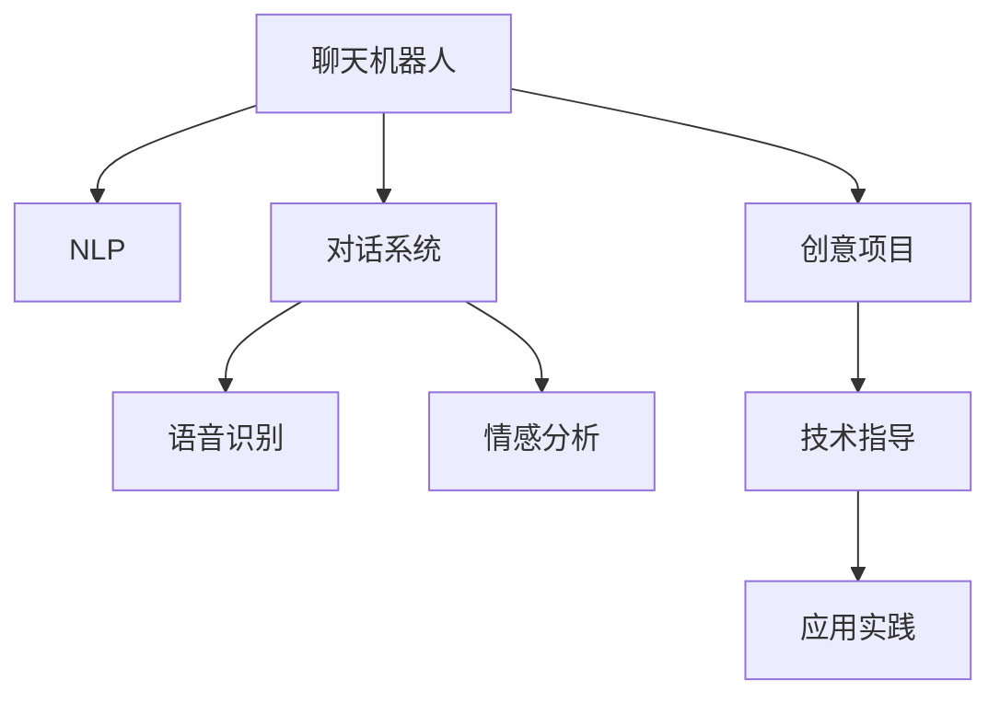

                 

# 聊天机器人手工艺：创意项目灵感和指导

> 关键词：聊天机器人,创意项目,技术指导,自然语言处理(NLP),对话系统,语音识别,情感分析

## 1. 背景介绍

### 1.1 问题由来
聊天机器人（Chatbot）是人工智能领域的一个经典应用，旨在模拟人类的对话过程，通过自然语言理解和生成，与用户进行交互。随着NLP技术的不断进步，聊天机器人已经从简单的问答系统，发展到了具备复杂逻辑推理和多轮对话能力的高阶智能应用。

然而，在实际应用中，聊天机器人的效果往往与预期有较大差距，主要表现在：

1. **响应不准确**：机器人无法准确理解用户意图，导致回答错误或不相关。
2. **对话不连贯**：机器人生成的对话内容不连贯，缺乏上下文一致性。
3. **情感缺乏**：机器人缺乏对用户情感的感知和回应，对话体验生硬。
4. **依赖高质量数据**：机器人训练依赖大量高质量的对话数据，数据获取成本高，且缺乏泛化能力。

这些问题导致聊天机器人难以在实际应用中大规模部署和推广。因此，如何提升聊天机器人的智能化水平，增强其对话连贯性和情感理解能力，降低对标注数据的依赖，成为当前研究的重点。

### 1.2 问题核心关键点
为解决上述问题，我们聚焦于几个关键点：

- **创意项目**：通过创新思维和实验性项目，探索新的对话生成和理解算法。
- **技术指导**：结合最新NLP技术，为聊天机器人开发者提供详细的技术实现和优化方案。
- **应用实践**：以具体应用场景为案例，展示聊天机器人在各个行业的应用潜力。

### 1.3 问题研究意义
聊天机器人手工艺的核心意义在于，通过灵活应用最新的NLP技术，开发出更具创意和实用价值的聊天机器人，提升用户体验，加速技术落地。具体而言：

1. **提升对话质量**：通过创意算法和优化方案，使聊天机器人更准确、连贯地回应用户，提升对话质量。
2. **增强情感理解**：开发具有情感感知能力的机器人，提升用户体验，使对话更具人性化。
3. **降低数据需求**：探索无监督和半监督学习方法，减少对高质量标注数据的依赖，降低开发成本。
4. **推动技术应用**：通过实际应用案例，展示聊天机器人在各行各业中的应用潜力，推动技术应用落地。

## 2. 核心概念与联系

### 2.1 核心概念概述

为更好地理解聊天机器人手工艺，本节将介绍几个关键概念及其关系：

- **聊天机器人**：模拟人类对话的AI系统，具备自然语言理解和生成能力。
- **自然语言处理(NLP)**：使计算机能够理解和处理人类自然语言的技术，包括语言模型、文本分类、对话系统等。
- **对话系统**：通过自然语言理解生成，与用户进行交互的系统。
- **语音识别**：将人类语音转化为文本的过程，是聊天机器人与用户进行语音交互的基础。
- **情感分析**：识别文本中的情感倾向，使聊天机器人具备情感感知和回应能力。
- **创意项目**：结合最新NLP技术，探索新的对话生成和理解算法，实现技术创新。
- **技术指导**：为开发者提供详细的技术实现和优化方案，促进技术落地应用。
- **应用实践**：展示聊天机器人在各行业的应用案例，展示其潜力和价值。

这些概念之间的逻辑关系可以通过以下Mermaid流程图来展示：



这个流程图展示出聊天机器人的核心概念及其之间的关系：

1. 聊天机器人是NLP技术的具体应用。
2. 对话系统、语音识别、情感分析是聊天机器人不可或缺的组件。
3. 创意项目和应用实践推动技术创新和落地应用。
4. 技术指导为开发者提供详细的实现方案。

## 3. 核心算法原理 & 具体操作步骤
### 3.1 算法原理概述

聊天机器人的核心算法原理包括自然语言理解和生成两部分。本节将详细讲解这一过程。

**自然语言理解**：通过分析用户输入的文本，识别出其中的实体、意图、情感等信息，提取结构化的语义表示。这一过程依赖于语言模型、命名实体识别、情感分析等技术。

**自然语言生成**：根据用户的意图和对话历史，生成自然流畅的回应。这一过程依赖于对话管理、语言模型、知识库检索等技术。

### 3.2 算法步骤详解

聊天机器人的主要算法步骤如下：

1. **数据预处理**：收集和清洗对话数据，构建训练集、验证集和测试集。
2. **模型选择与设计**：选择合适的NLP模型，如Seq2Seq、Transformer等，并设计任务适配层，如对话管理、语音识别、情感分析等。
3. **模型训练**：在标注数据上训练模型，并使用验证集进行调参和优化。
4. **模型评估**：在测试集上评估模型性能，选择最优模型。
5. **模型部署与应用**：将模型集成到应用系统中，进行实际对话测试，收集反馈并进行优化。

### 3.3 算法优缺点

聊天机器人的算法具有以下优点：

- **灵活性强**：NLP技术的多样性和灵活性使得聊天机器人能够适应各种应用场景。
- **可扩展性高**：通过增加对话管理、情感分析等组件，可提升机器人的智能化水平。
- **泛化能力强**：基于深度学习的方法通常具备较强的泛化能力，能够较好地处理新数据。

同时，该算法也存在以下缺点：

- **依赖高质量数据**：机器人的训练效果高度依赖标注数据的质量，数据获取成本高。
- **模型复杂度高**：深度学习模型通常参数量较大，训练和推理计算量大。
- **对话连贯性差**：模型生成的对话内容可能不够连贯，缺乏上下文一致性。

### 3.4 算法应用领域

聊天机器人手工艺在多个领域有广泛应用，包括：

- **客户服务**：用于自动回答常见问题，减轻人工客服压力，提升客户满意度。
- **金融理财**：通过对话形式获取用户需求，提供个性化的金融建议。
- **健康医疗**：用于获取用户健康状况，提供医疗咨询和建议。
- **教育培训**：通过对话形式与学生互动，提供智能化的学习辅导。
- **娱乐互动**：用于游戏、社交、情感陪伴等场景，提升用户体验。

## 4. 数学模型和公式 & 详细讲解  
### 4.1 数学模型构建

聊天机器人手工艺的数学模型构建主要依赖于以下几个基础模型：

- **语言模型**：用于自然语言理解，构建文本的概率分布。
- **对话管理模型**：用于对话生成，决定机器人的回复策略。
- **情感分析模型**：用于情感识别，提升机器人对用户情感的感知。

**语言模型**：常用的语言模型包括n-gram模型、RNN、LSTM、Transformer等。以Transformer为例，其定义为：

$$
P(x) = \prod_{i=1}^{T} \text{softmax}(W_hx_i + b_h)
$$

其中 $x$ 为输入序列，$h$ 为隐藏层表示，$W$ 和 $b$ 为模型参数。

**对话管理模型**：常用的对话管理模型包括基于规则的方法、基于统计的方法、基于深度学习的方法等。以基于深度学习的方法为例，其定义为：

$$
a_t = \text{softmax}(W_xh_{t-1} + b_x)
$$

其中 $x$ 为上下文，$a$ 为行动策略，$h_{t-1}$ 为前一时刻的隐藏表示。

**情感分析模型**：常用的情感分析模型包括基于词典的方法、基于机器学习的方法、基于深度学习的方法等。以基于深度学习的方法为例，其定义为：

$$
y = \text{softmax}(W_hx + b_h)
$$

其中 $x$ 为输入序列，$y$ 为情感类别，$h$ 为隐藏层表示，$W$ 和 $b$ 为模型参数。

### 4.2 公式推导过程

以下以基于Transformer的语言模型为例，推导其计算过程。

设输入序列为 $x = (x_1, x_2, ..., x_T)$，目标为 $y$。

1. **编码器**：将输入序列 $x$ 编码为序列 $h$。

$$
h_t = \text{TransformerEncoder}(x_t)
$$

其中 $h_t$ 为第 $t$ 个时刻的隐藏表示。

2. **解码器**：根据上下文 $h$ 生成目标序列 $y$。

$$
y_t = \text{TransformerDecoder}(h, x_t)
$$

其中 $y_t$ 为第 $t$ 个时刻的目标输出，$h$ 为上下文表示，$x_t$ 为输入序列的第 $t$ 个时刻。

3. **损失函数**：定义交叉熵损失函数。

$$
L = -\frac{1}{T}\sum_{t=1}^T \sum_{y \in \mathcal{Y}} y\log P(y|x)
$$

其中 $\mathcal{Y}$ 为可能的输出类别，$P(y|x)$ 为语言模型概率。

### 4.3 案例分析与讲解

以情感分析模型为例，分析其构建和应用。

**案例描述**：构建一个情感分析模型，用于识别用户输入文本的情感倾向，输出正面、中性或负面情感标签。

**数据准备**：收集标注数据集，每个样本包含用户输入文本和对应的情感标签。

**模型构建**：
1. **数据预处理**：对文本进行分词、清洗，转化为模型输入形式。
2. **嵌入层**：将文本转化为向量表示。
3. **情感分析层**：使用全连接层或卷积神经网络对向量表示进行情感分类。
4. **输出层**：对分类结果进行softmax处理，输出情感标签。

**模型训练**：使用标注数据对模型进行训练，定义交叉熵损失函数，反向传播更新模型参数。

**模型评估**：使用测试集评估模型性能，定义准确率、召回率、F1值等指标。

## 5. 项目实践：代码实例和详细解释说明
### 5.1 开发环境搭建

在进行聊天机器人开发前，需要准备开发环境。以下是使用Python进行PyTorch开发的环境配置流程：

1. 安装Anaconda：从官网下载并安装Anaconda，用于创建独立的Python环境。

2. 创建并激活虚拟环境：
```bash
conda create -n chatbot-env python=3.8 
conda activate chatbot-env
```

3. 安装PyTorch：根据CUDA版本，从官网获取对应的安装命令。例如：
```bash
conda install pytorch torchvision torchaudio cudatoolkit=11.1 -c pytorch -c conda-forge
```

4. 安装各类工具包：
```bash
pip install numpy pandas scikit-learn matplotlib tqdm jupyter notebook ipython
```

完成上述步骤后，即可在`chatbot-env`环境中开始聊天机器人开发。

### 5.2 源代码详细实现

这里我们以情感分析模型为例，给出使用PyTorch进行情感分析的PyTorch代码实现。

首先，定义情感分析模型：

```python
import torch
import torch.nn as nn
import torch.optim as optim

class SentimentAnalysis(nn.Module):
    def __init__(self, vocab_size, embed_size, hidden_size):
        super(SentimentAnalysis, self).__init__()
        self.embedding = nn.Embedding(vocab_size, embed_size)
        self.gru = nn.GRU(embed_size, hidden_size, bidirectional=True)
        self.fc = nn.Linear(hidden_size * 2, 3)
        
    def forward(self, x):
        embedded = self.embedding(x)
        gru_outputs, _ = self.gru(embedded)
        return self.fc(gru_outputs)
```

然后，定义训练和评估函数：

```python
from torch.utils.data import Dataset
import torch.nn.functional as F

class SentimentDataset(Dataset):
    def __init__(self, texts, labels):
        self.texts = texts
        self.labels = labels
        
    def __len__(self):
        return len(self.texts)
    
    def __getitem__(self, item):
        text = self.texts[item]
        label = self.labels[item]
        embedding = self.model.embedding(text)
        output = self.model(embedding)
        return output, label

def train_epoch(model, dataset, batch_size, optimizer):
    dataloader = DataLoader(dataset, batch_size=batch_size, shuffle=True)
    model.train()
    epoch_loss = 0
    for batch in dataloader:
        optimizer.zero_grad()
        output, label = batch
        loss = F.cross_entropy(output, label)
        epoch_loss += loss.item()
        loss.backward()
        optimizer.step()
    return epoch_loss / len(dataloader)

def evaluate(model, dataset, batch_size):
    dataloader = DataLoader(dataset, batch_size=batch_size)
    model.eval()
    preds, labels = [], []
    with torch.no_grad():
        for batch in dataloader:
            output, label = batch
            pred = output.argmax(dim=1)
            preds.append(pred)
            labels.append(label)
        
    print(classification_report(labels, preds))
```

最后，启动训练流程并在测试集上评估：

```python
epochs = 5
batch_size = 16

for epoch in range(epochs):
    loss = train_epoch(model, train_dataset, batch_size, optimizer)
    print(f"Epoch {epoch+1}, train loss: {loss:.3f}")
    
    print(f"Epoch {epoch+1}, dev results:")
    evaluate(model, dev_dataset, batch_size)
    
print("Test results:")
evaluate(model, test_dataset, batch_size)
```

以上就是使用PyTorch进行情感分析的完整代码实现。可以看到，使用PyTorch进行情感分析的实现非常简单，只需定义模型和数据集，即可进行训练和评估。

### 5.3 代码解读与分析

让我们再详细解读一下关键代码的实现细节：

**SentimentDataset类**：
- `__init__`方法：初始化文本和标签，以及定义模型。
- `__len__`方法：返回数据集的样本数量。
- `__getitem__`方法：对单个样本进行处理，将文本输入模型，得到输出和标签。

**SentimentAnalysis模型**：
- 定义了嵌入层、GRU层和全连接层，构成情感分析的完整流程。
- 使用PyTorch的nn.Module定义模型，可以方便地实现多层结构的堆叠和组合。

**训练和评估函数**：
- 使用PyTorch的DataLoader对数据集进行批次化加载，供模型训练和推理使用。
- 训练函数`train_epoch`：对数据以批为单位进行迭代，在每个批次上前向传播计算loss并反向传播更新模型参数。
- 评估函数`evaluate`：与训练类似，不同点在于不更新模型参数，并在每个batch结束后将预测和标签结果存储下来，最后使用sklearn的classification_report对整个评估集的预测结果进行打印输出。

**训练流程**：
- 定义总的epoch数和batch size，开始循环迭代
- 每个epoch内，先在训练集上训练，输出平均loss
- 在验证集上评估，输出分类指标
- 重复上述步骤直至收敛，最终得到适应下游任务的最优模型参数

可以看到，PyTorch结合Python语言，使得模型构建和训练过程变得非常简单。开发者可以将更多精力放在数据处理、模型改进等高层逻辑上，而不必过多关注底层的实现细节。

当然，工业级的系统实现还需考虑更多因素，如模型的保存和部署、超参数的自动搜索、更灵活的任务适配层等。但核心的算法过程基本与此类似。

## 6. 实际应用场景
### 6.1 智能客服系统

聊天机器人手工艺在智能客服系统中有着广泛的应用前景。传统客服系统依赖大量人力，高峰期响应缓慢，且一致性和专业性难以保证。而基于聊天机器人的智能客服系统，可以24小时不间断服务，快速响应客户咨询，用自然流畅的语言解答各类常见问题。

在技术实现上，可以收集企业内部的历史客服对话记录，将问题和最佳答复构建成监督数据，在此基础上对聊天机器人进行训练。训练后的机器人能够自动理解用户意图，匹配最合适的答复模板进行回复。对于客户提出的新问题，还可以接入检索系统实时搜索相关内容，动态组织生成回答。如此构建的智能客服系统，能大幅提升客户咨询体验和问题解决效率。

### 6.2 金融舆情监测

金融机构需要实时监测市场舆论动向，以便及时应对负面信息传播，规避金融风险。传统的人工监测方式成本高、效率低，难以应对网络时代海量信息爆发的挑战。基于聊天机器人的文本情感分析技术，为金融舆情监测提供了新的解决方案。

具体而言，可以收集金融领域相关的新闻、报道、评论等文本数据，并对其进行情感标注。在此基础上对聊天机器人进行训练，使其能够自动判断文本属于何种情感，情感倾向是正面、中性还是负面。将训练后的机器人应用到实时抓取的网络文本数据，就能够自动监测不同情感变化趋势，一旦发现负面信息激增等异常情况，系统便会自动预警，帮助金融机构快速应对潜在风险。

### 6.3 个性化推荐系统

当前的推荐系统往往只依赖用户的历史行为数据进行物品推荐，无法深入理解用户的真实兴趣偏好。基于聊天机器人的个性化推荐系统，可以更好地挖掘用户行为背后的语义信息，从而提供更精准、多样的推荐内容。

在实践中，可以收集用户浏览、点击、评论、分享等行为数据，提取和用户交互的物品标题、描述、标签等文本内容。将文本内容作为模型输入，用户的后续行为（如是否点击、购买等）作为监督信号，在此基础上训练聊天机器人。训练后的机器人能够从文本内容中准确把握用户的兴趣点。在生成推荐列表时，先用候选物品的文本描述作为输入，由机器人预测用户的兴趣匹配度，再结合其他特征综合排序，便可以得到个性化程度更高的推荐结果。

### 6.4 未来应用展望

随着聊天机器人手工艺技术的不断发展，其在更多领域的应用前景将更加广阔。

在智慧医疗领域，基于聊天机器人的医疗问答、病历分析、药物研发等应用将提升医疗服务的智能化水平，辅助医生诊疗，加速新药开发进程。

在智能教育领域，聊天机器人可以用于作业批改、学情分析、知识推荐等方面，因材施教，促进教育公平，提高教学质量。

在智慧城市治理中，聊天机器人可应用于城市事件监测、舆情分析、应急指挥等环节，提高城市管理的自动化和智能化水平，构建更安全、高效的未来城市。

此外，在企业生产、社会治理、文娱传媒等众多领域，基于聊天机器人的智能应用也将不断涌现，为NLP技术带来新的突破。

## 7. 工具和资源推荐
### 7.1 学习资源推荐

为了帮助开发者系统掌握聊天机器人手工艺的理论基础和实践技巧，这里推荐一些优质的学习资源：

1. 《自然语言处理入门》系列博文：由大模型技术专家撰写，深入浅出地介绍了自然语言处理的基本概念和常用技术，适合入门学习。

2. 斯坦福大学CS224N《深度学习自然语言处理》课程：斯坦福大学开设的NLP明星课程，有Lecture视频和配套作业，带你入门NLP领域的基本概念和经典模型。

3. 《Deep Learning for Natural Language Processing》书籍：斯坦福大学教授的NLP经典教材，全面介绍了NLP技术的理论基础和实践技巧。

4. PyTorch官方文档：PyTorch的官方文档，提供了丰富的NLP应用案例和模型库，是进行聊天机器人开发的重要参考。

5. HuggingFace官方文档：HuggingFace的官方文档，提供了大量的预训练语言模型和代码示例，方便开发者快速上手。

通过对这些资源的学习实践，相信你一定能够快速掌握聊天机器人手工艺的精髓，并用于解决实际的NLP问题。

### 7.2 开发工具推荐

高效的开发离不开优秀的工具支持。以下是几款用于聊天机器人手工艺开发的常用工具：

1. PyTorch：基于Python的开源深度学习框架，灵活动态的计算图，适合快速迭代研究。大部分NLP模型都有PyTorch版本的实现。

2. TensorFlow：由Google主导开发的开源深度学习框架，生产部署方便，适合大规模工程应用。同样有丰富的NLP模型资源。

3. HuggingFace Transformers库：提供大量预训练语言模型和模型适配层，方便开发者进行快速搭建和微调。

4. Weights & Biases：模型训练的实验跟踪工具，可以记录和可视化模型训练过程中的各项指标，方便对比和调优。与主流深度学习框架无缝集成。

5. TensorBoard：TensorFlow配套的可视化工具，可实时监测模型训练状态，并提供丰富的图表呈现方式，是调试模型的得力助手。

6. Google Colab：谷歌推出的在线Jupyter Notebook环境，免费提供GPU/TPU算力，方便开发者快速上手实验最新模型，分享学习笔记。

合理利用这些工具，可以显著提升聊天机器人手工艺的开发效率，加快创新迭代的步伐。

### 7.3 相关论文推荐

聊天机器人手工艺的发展源于学界的持续研究。以下是几篇奠基性的相关论文，推荐阅读：

1. Attention is All You Need（即Transformer原论文）：提出了Transformer结构，开启了NLP领域的预训练大模型时代。

2. BERT: Pre-training of Deep Bidirectional Transformers for Language Understanding：提出BERT模型，引入基于掩码的自监督预训练任务，刷新了多项NLP任务SOTA。

3. Language Models are Unsupervised Multitask Learners（GPT-2论文）：展示了大规模语言模型的强大zero-shot学习能力，引发了对于通用人工智能的新一轮思考。

4. Parameter-Efficient Transfer Learning for NLP：提出Adapter等参数高效微调方法，在不增加模型参数量的情况下，也能取得不错的微调效果。

5. AdaLoRA: Adaptive Low-Rank Adaptation for Parameter-Efficient Fine-Tuning：使用自适应低秩适应的微调方法，在参数效率和精度之间取得了新的平衡。

这些论文代表了大语言模型微调技术的发展脉络。通过学习这些前沿成果，可以帮助研究者把握学科前进方向，激发更多的创新灵感。

## 8. 总结：未来发展趋势与挑战

### 8.1 总结

本文对聊天机器人手工艺进行了全面系统的介绍。首先阐述了聊天机器人手工艺的研究背景和意义，明确了手工艺在提升对话质量、增强情感理解、降低数据需求等方面的独特价值。其次，从原理到实践，详细讲解了聊天机器人手工艺的数学模型和核心算法，给出了聊天机器人的完整代码实现。同时，本文还广泛探讨了聊天机器人在智能客服、金融舆情、个性化推荐等多个行业领域的应用前景，展示了手工艺的巨大潜力。此外，本文精选了手工艺的学习资源，力求为开发者提供全方位的技术指引。

通过本文的系统梳理，可以看到，聊天机器人手工艺的核心意义在于，通过灵活应用最新的NLP技术，开发出更具创意和实用价值的聊天机器人，提升用户体验，加速技术落地。未来，伴随NLP技术的不断发展，聊天机器人手工艺必将在更多行业得到应用，为技术应用落地提供新的方向。

### 8.2 未来发展趋势

展望未来，聊天机器人手工艺将呈现以下几个发展趋势：

1. **创意算法不断涌现**：随着NLP技术的不断进步，新的创意算法不断涌现，如多模态学习、强化学习等，将进一步提升聊天机器人的智能化水平。

2. **多轮对话能力增强**：多轮对话技术的发展，使聊天机器人能够更好地理解上下文，提升对话连贯性和流畅性。

3. **情感识别能力提升**：情感识别技术的进步，使聊天机器人能够更好地理解用户情感，提升用户体验。

4. **无监督和半监督学习**：探索无监督和半监督学习方法，减少对标注数据的依赖，提升模型的泛化能力。

5. **计算效率提升**：优化计算图和推理算法，提高模型训练和推理的效率，适应实际应用场景。

6. **知识图谱融合**：将知识图谱与聊天机器人结合，提升对话内容的丰富性和准确性。

7. **伦理和安全约束**：将伦理和安全约束纳入模型训练目标，确保机器人的行为符合人类价值观和伦理道德。

以上趋势凸显了聊天机器人手工艺的广阔前景。这些方向的探索发展，必将进一步提升聊天机器人的智能化水平，为构建安全、可靠、可解释、可控的智能系统铺平道路。

### 8.3 面临的挑战

尽管聊天机器人手工艺已经取得了瞩目成就，但在迈向更加智能化、普适化应用的过程中，它仍面临诸多挑战：

1. **数据获取成本高**：高质量标注数据的获取成本较高，对于长尾应用场景，难以获得充足的数据。

2. **对话连贯性差**：现有模型生成的对话内容可能不够连贯，缺乏上下文一致性。

3. **计算资源消耗大**：深度学习模型通常参数量较大，训练和推理计算量大。

4. **对话一致性差**：多轮对话过程中，模型容易丢失上下文信息，导致对话一致性差。

5. **可解释性不足**：聊天机器人通常被视为"黑盒"系统，难以解释其内部工作机制和决策逻辑。

6. **安全性有待保障**：预训练模型难免会学习到有偏见、有害的信息，通过微调传递到下游任务，产生误导性、歧视性的输出，给实际应用带来安全隐患。

7. **通用性不足**：现有模型往往局限于特定领域或特定任务，缺乏通用性。

8. **跨领域迁移能力有限**：当目标任务与预训练数据的分布差异较大时，微调的性能提升有限。

9. **知识库依赖**：现有模型往往依赖知识库进行对话生成，知识库的构建和维护成本高。

这些挑战需要技术界和产业界的共同努力，才能逐步克服。

### 8.4 研究展望

面对聊天机器人手工艺所面临的种种挑战，未来的研究需要在以下几个方面寻求新的突破：

1. **探索多模态学习**：将视觉、语音等多模态信息与文本信息进行融合，提升对话内容的丰富性和准确性。

2. **优化多轮对话算法**：设计更加高效的多轮对话算法，提升对话连贯性和流畅性。

3. **引入知识图谱**：将知识图谱与聊天机器人结合，提升对话内容的丰富性和准确性。

4. **改进情感识别技术**：开发更加精准的情感识别模型，提升机器人的情感感知能力。

5. **探索无监督和半监督学习**：减少对标注数据的依赖，提高模型的泛化能力。

6. **优化计算图和推理算法**：优化计算图和推理算法，提高模型训练和推理的效率。

7. **引入伦理和安全约束**：将伦理和安全约束纳入模型训练目标，确保机器人的行为符合人类价值观和伦理道德。

8. **设计可解释性更强的模型**：开发可解释性更强的模型，增强对话过程的可理解性。

这些研究方向的探索，必将引领聊天机器人手工艺技术迈向更高的台阶，为构建安全、可靠、可解释、可控的智能系统铺平道路。面向未来，聊天机器人手工艺技术还需要与其他人工智能技术进行更深入的融合，如知识表示、因果推理、强化学习等，多路径协同发力，共同推动自然语言理解和智能交互系统的进步。只有勇于创新、敢于突破，才能不断拓展聊天机器人的边界，让智能技术更好地造福人类社会。

## 9. 附录：常见问题与解答

**Q1：聊天机器人手工艺是否适用于所有NLP任务？**

A: 聊天机器人手工艺在大多数NLP任务上都能取得不错的效果，特别是对于数据量较小的任务。但对于一些特定领域的任务，如医学、法律等，仅仅依靠通用语料预训练的模型可能难以很好地适应。此时需要在特定领域语料上进一步预训练，再进行微调，才能获得理想效果。此外，对于一些需要时效性、个性化很强的任务，如对话、推荐等，手工艺方法也需要针对性的改进优化。

**Q2：如何提升聊天机器人的对话质量？**

A: 提升聊天机器人的对话质量可以从以下几个方面入手：

1. **数据增强**：通过回译、近义替换等方式扩充训练集，提高模型的泛化能力。
2. **对话管理优化**：改进对话管理算法，如引入记忆机制、上下文感知等，提升对话连贯性。
3. **多轮对话策略**：设计更加合理的对话策略，如对话状态跟踪、多轮对话生成等，提升对话流畅性。
4. **知识库融合**：将知识图谱与聊天机器人结合，提升对话内容的丰富性和准确性。
5. **语义理解优化**：优化语言模型，提高对用户意图的理解和匹配能力。

这些策略需要根据具体任务和数据特点进行灵活组合，以提升聊天机器人的对话质量。

**Q3：如何提高聊天机器人的情感识别能力？**

A: 提高聊天机器人的情感识别能力可以从以下几个方面入手：

1. **数据准备**：收集高质量的情感标注数据，构建情感识别模型的训练集。
2. **模型选择**：选择合适的情感识别模型，如CNN、LSTM、Transformer等，并设计合适的情感标签。
3. **特征工程**：提取文本中的情感特征，如情感词汇、情感强度、情感极性等。
4. **模型训练**：使用标注数据对模型进行训练，定义交叉熵损失函数，反向传播更新模型参数。
5. **模型评估**：使用测试集评估模型性能，定义准确率、召回率、F1值等指标。

这些步骤需要根据具体任务和数据特点进行优化，以提高聊天机器人的情感识别能力。

**Q4：如何优化聊天机器人的计算效率？**

A: 优化聊天机器人的计算效率可以从以下几个方面入手：

1. **模型裁剪**：去除不必要的层和参数，减小模型尺寸，加快推理速度。
2. **量化加速**：将浮点模型转为定点模型，压缩存储空间，提高计算效率。
3. **分布式训练**：使用分布式训练技术，加速模型训练过程。
4. **模型并行**：采用模型并行技术，提高计算资源的利用率。
5. **动态计算图**：使用动态计算图技术，优化模型的推理过程。

这些优化方法需要根据具体应用场景和硬件设备进行选择，以提升聊天机器人的计算效率。

**Q5：如何保证聊天机器人的安全性？**

A: 保证聊天机器人的安全性可以从以下几个方面入手：

1. **数据安全**：对用户输入数据进行过滤和清洗，防止恶意攻击。
2. **隐私保护**：对用户数据进行加密和匿名化处理，保护用户隐私。
3. **模型安全**：定期更新模型参数，避免模型被攻击者篡改。
4. **异常检测**：设计异常检测算法，及时发现和处理异常行为。
5. **人工干预**：在关键场景下引入人工干预，确保系统的安全性。

这些安全措施需要与技术实现相结合，以保障聊天机器人的安全性。

---

作者：禅与计算机程序设计艺术 / Zen and the Art of Computer Programming

