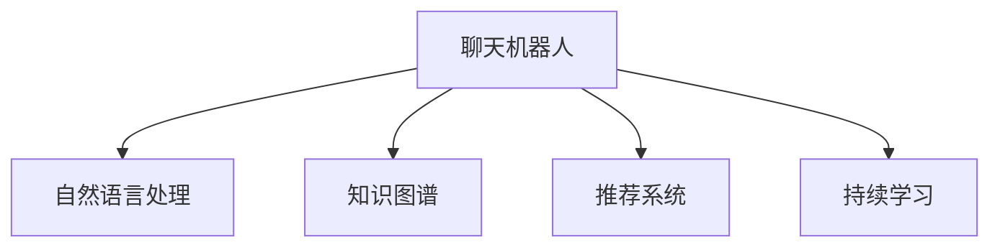

                 

# 聊天机器人教育：在线教学和辅导

## 1. 背景介绍

### 1.1 问题由来
在教育领域，传统的面对面教学模式面临着时间和空间的限制，无法覆盖所有学生，且难以实现个性化辅导。在线教育技术的兴起，为打破这些瓶颈提供了新的可能性。然而，传统的在线教育平台往往需要制作高质量的教学视频、课件等，投入成本高，且难以实现互动反馈。

聊天机器人作为在线教育的一种新形式，以其低成本、高互动、个性化等特点，逐渐受到了教育界的关注。通过构建基于自然语言处理的聊天机器人，可以为学生提供随时随地的学习辅导，解决他们在学习过程中遇到的各种疑问，提升学习效果。

### 1.2 问题核心关键点
聊天机器人教育的核心在于如何构建一个智能、高效、可扩展的在线学习系统。这涉及到以下几个关键问题：
1. **智能对话能力**：聊天机器人需要能够理解自然语言，并在对话中引导学生进行深入学习。
2. **个性化推荐**：根据学生的学习进度、兴趣和反馈，动态推荐适合的学习资源。
3. **持续学习与更新**：机器人需要不断学习新的知识，并根据学生反馈进行调整和优化。
4. **数据隐私与安全**：在收集和分析学生数据时，需要保障数据隐私和安全。

## 2. 核心概念与联系

### 2.1 核心概念概述

为更好地理解聊天机器人教育的原理和实现，本节将介绍几个关键概念：

- **聊天机器人(Chatbot)**：基于自然语言处理(NLP)技术，能够与人类进行自然对话的计算机程序。通过构建模型进行文本理解、生成和推理，使机器人能够理解并回应用户的问题。
- **自然语言处理(NLP)**：研究如何让计算机理解和生成人类语言的技术，包括语音识别、文本分类、情感分析、语义理解等。
- **知识图谱(Knowledge Graph)**：由实体、关系和属性组成的知识网络，用于表示和推理人类知识。聊天机器人可以将其作为先验知识库，用于增强对话理解和推荐系统。
- **推荐系统(Recommendation System)**：根据用户行为和兴趣，推荐相关内容的技术。聊天机器人可以通过分析学生与机器人的交互数据，推荐合适的学习资源。
- **持续学习(Continual Learning)**：指模型能够持续从新数据中学习，同时保持已学习的知识，避免灾难性遗忘。这对于保持聊天机器人的时效性和适应性至关重要。

这些核心概念之间的逻辑关系可以通过以下Mermaid流程图来展示：



这个流程图展示了几大关键技术在聊天机器人教育中的集成应用：

1. 聊天机器人通过自然语言处理技术，实现与用户的自然对话。
2. 知识图谱作为先验知识库，增强对话理解和推荐能力。
3. 推荐系统根据用户行为和兴趣，推荐合适的学习资源。
4. 持续学习机制，使得聊天机器人能够不断学习新知识，并保持已有知识。

## 3. 核心算法原理 & 具体操作步骤

### 3.1 算法原理概述

聊天机器人教育的算法原理主要基于以下几个技术：

1. **自然语言处理(NLP)**：使聊天机器人能够理解用户的自然语言输入，并生成合理的回应。
2. **知识图谱(KG)**：为聊天机器人提供丰富的先验知识，增强对话理解和推荐能力。
3. **推荐系统(RS)**：根据用户行为和兴趣，推荐合适的学习资源。
4. **持续学习(CL)**：使聊天机器人能够不断学习新知识，并保持已有知识。

### 3.2 算法步骤详解

**Step 1: 数据收集与预处理**
- 收集学生的学习数据，包括历史成绩、学习进度、兴趣点、问题反馈等。
- 使用数据标注工具对学生问题进行分类，标注相应的答案或知识点。
- 构建知识图谱，涵盖常见知识点、概念和案例。

**Step 2: 构建对话模型**
- 使用预训练的语言模型(如GPT、BERT等)作为对话模型的基础。
- 在对话模型中引入注意力机制和记忆网络，增强对复杂问题的理解。
- 设计对话模板，引导学生进行深入学习。

**Step 3: 构建推荐系统**
- 使用协同过滤、基于内容的推荐算法等，构建推荐模型。
- 根据学生的学习数据，动态调整推荐策略，优化推荐效果。
- 结合知识图谱，增强推荐系统的知识引导能力。

**Step 4: 构建知识图谱**
- 使用关系抽取和知识图谱构建技术，将学生问题和答案映射到知识图谱中。
- 使用实体和关系抽取工具，自动识别并映射问题中的实体和关系。
- 使用知识融合技术，将知识图谱中的知识进行整合和优化。

**Step 5: 持续学习与优化**
- 根据学生反馈和测试成绩，不断调整对话模型和推荐策略。
- 引入强化学习技术，通过用户交互行为对聊天机器人进行优化。
- 使用主动学习技术，从用户反馈中主动学习新的知识和对话模板。

### 3.3 算法优缺点

聊天机器人教育的算法具有以下优点：
1. **低成本高互动**：相比传统的在线教育，聊天机器人开发和维护成本低，互动性高，能够随时回答学生问题。
2. **个性化推荐**：通过分析学生的学习行为，提供个性化学习资源，提升学习效果。
3. **知识引导**：结合知识图谱，增强对话理解和推荐能力，提升学习深度和广度。
4. **持续学习**：通过持续学习机制，不断更新知识库，适应新的学习需求。

同时，该算法也存在一定的局限性：
1. **语言理解局限**：自然语言处理技术在处理复杂语句和长对话时，效果可能不佳。
2. **知识图谱构建**：知识图谱构建需要大量的人工标注和数据，工作量大。
3. **推荐算法偏差**：推荐算法可能存在推荐偏差，导致部分学生被忽略。
4. **数据隐私问题**：在收集和分析学生数据时，需要注意数据隐私和安全问题。
5. **资源限制**：聊天机器人需要较大的计算资源进行训练和推理。

尽管存在这些局限性，但就目前而言，聊天机器人教育作为在线教育的重要形式，具有广阔的应用前景。

### 3.4 算法应用领域

聊天机器人教育在多个领域具有广泛的应用：

- **K-12教育**：为中小学生提供课余学习辅导，解答学习中遇到的疑问。
- **高等教育**：为大学生提供专业课程辅导，帮助学生深入理解复杂的知识。
- **职业培训**：为在职人员提供技能培训，解决工作中遇到的技术问题。
- **企业内训**：为企业员工提供技术支持和培训，提升工作效率和技能水平。

此外，在更多场景中，如语言学习、医疗咨询等，聊天机器人教育也将发挥重要作用。

## 4. 数学模型和公式 & 详细讲解 & 举例说明

### 4.1 数学模型构建

本节将使用数学语言对聊天机器人教育的算法模型进行更加严格的刻画。

记聊天机器人为 $R_{\theta}$，其中 $\theta$ 为模型参数。假设学生的学习数据为 $D=\{(x_i,y_i)\}_{i=1}^N, x_i \in \mathcal{X}, y_i \in \mathcal{Y}$，其中 $x_i$ 为输入问题，$y_i$ 为对应的答案或知识点。

定义模型 $R_{\theta}$ 在输入问题 $x_i$ 上的损失函数为 $\ell(R_{\theta}(x_i),y_i)$，则在数据集 $D$ 上的经验风险为：

$$
\mathcal{L}(\theta) = \frac{1}{N} \sum_{i=1}^N \ell(R_{\theta}(x_i),y_i)
$$

其中 $\ell$ 可以是交叉熵损失、均方误差损失等。微调的目标是最小化经验风险，即找到最优参数：

$$
\theta^* = \mathop{\arg\min}_{\theta} \mathcal{L}(\theta)
$$

在实践中，我们通常使用基于梯度的优化算法（如Adam、SGD等）来近似求解上述最优化问题。设 $\eta$ 为学习率，则参数的更新公式为：

$$
\theta \leftarrow \theta - \eta \nabla_{\theta}\mathcal{L}(\theta)
$$

其中 $\nabla_{\theta}\mathcal{L}(\theta)$ 为损失函数对参数 $\theta$ 的梯度，可通过反向传播算法高效计算。

### 4.2 公式推导过程

以下我们以二分类任务为例，推导交叉熵损失函数及其梯度的计算公式。

假设机器人 $R_{\theta}$ 在输入 $x_i$ 上的输出为 $\hat{y}_i=M_{\theta}(x_i) \in [0,1]$，表示学生问题 $x_i$ 与答案或知识点 $y_i$ 匹配的概率。真实标签 $y_i \in \{0,1\}$。则二分类交叉熵损失函数定义为：

$$
\ell(R_{\theta}(x_i),y_i) = -[y_i\log \hat{y}_i + (1-y_i)\log (1-\hat{y}_i)]
$$

将其代入经验风险公式，得：

$$
\mathcal{L}(\theta) = -\frac{1}{N}\sum_{i=1}^N [y_i\log R_{\theta}(x_i)+(1-y_i)\log(1-R_{\theta}(x_i))]
$$

根据链式法则，损失函数对参数 $\theta_k$ 的梯度为：

$$
\frac{\partial \mathcal{L}(\theta)}{\partial \theta_k} = -\frac{1}{N}\sum_{i=1}^N (\frac{y_i}{R_{\theta}(x_i)}-\frac{1-y_i}{1-R_{\theta}(x_i)}) \frac{\partial R_{\theta}(x_i)}{\partial \theta_k}
$$

其中 $\frac{\partial R_{\theta}(x_i)}{\partial \theta_k}$ 可进一步递归展开，利用自动微分技术完成计算。

在得到损失函数的梯度后，即可带入参数更新公式，完成模型的迭代优化。重复上述过程直至收敛，最终得到适应学生问题的最优模型参数 $\theta^*$。

### 4.3 案例分析与讲解

**案例1: 数学问题解答**

- **输入**：学生提出问题："如何求解线性方程组 $\begin{cases} 2x+3y+z=10 \\ 2x-y+z=-5 \\ x-3y+z=1 \end{cases}$？"
- **输出**：机器人理解问题，调用数学知识图谱，识别出线性方程组类型，并输出解题步骤和结果。

**案例2: 编程问题解答**

- **输入**：学生提出问题："如何实现一个快速排序算法？"
- **输出**：机器人调用编程知识图谱，识别出编程语言、算法类型，输出代码实现和算法原理。

## 5. 项目实践：代码实例和详细解释说明

### 5.1 开发环境搭建

在进行聊天机器人教育的实践前，我们需要准备好开发环境。以下是使用Python进行PyTorch开发的环境配置流程：

1. 安装Anaconda：从官网下载并安装Anaconda，用于创建独立的Python环境。

2. 创建并激活虚拟环境：
```bash
conda create -n chatbot-env python=3.8 
conda activate chatbot-env
```

3. 安装PyTorch：根据CUDA版本，从官网获取对应的安装命令。例如：
```bash
conda install pytorch torchvision torchaudio cudatoolkit=11.1 -c pytorch -c conda-forge
```

4. 安装其他依赖库：
```bash
pip install transformers numpy pandas scikit-learn matplotlib tqdm jupyter notebook ipython
```

完成上述步骤后，即可在`chatbot-env`环境中开始实践。

### 5.2 源代码详细实现

下面我们以数学问题解答为例，给出使用Transformers库对聊天机器人进行开发的PyTorch代码实现。

首先，定义聊天机器人任务的数据处理函数：

```python
from transformers import BertTokenizer
from torch.utils.data import Dataset
import torch

class ChatbotDataset(Dataset):
    def __init__(self, questions, answers, tokenizer, max_len=128):
        self.questions = questions
        self.answers = answers
        self.tokenizer = tokenizer
        self.max_len = max_len
        
    def __len__(self):
        return len(self.questions)
    
    def __getitem__(self, item):
        question = self.questions[item]
        answer = self.answers[item]
        
        encoding = self.tokenizer(question, return_tensors='pt', max_length=self.max_len, padding='max_length', truncation=True)
        input_ids = encoding['input_ids'][0]
        attention_mask = encoding['attention_mask'][0]
        
        # 对答案进行编码
        encoded_answer = self.tokenizer(answer, return_tensors='pt', max_length=self.max_len, padding='max_length', truncation=True)
        input_answer_ids = encoded_answer['input_ids'][0]
        input_answer_mask = encoded_answer['attention_mask'][0]
        
        return {'input_ids': input_ids, 
                'attention_mask': attention_mask,
                'input_answer_ids': input_answer_ids,
                'input_answer_mask': input_answer_mask}
```

然后，定义模型和优化器：

```python
from transformers import BertForQuestionAnswering, AdamW

model = BertForQuestionAnswering.from_pretrained('bert-base-cased')
optimizer = AdamW(model.parameters(), lr=2e-5)
```

接着，定义训练和评估函数：

```python
from torch.utils.data import DataLoader
from tqdm import tqdm
from sklearn.metrics import precision_recall_fscore_support

device = torch.device('cuda') if torch.cuda.is_available() else torch.device('cpu')
model.to(device)

def train_epoch(model, dataset, batch_size, optimizer):
    dataloader = DataLoader(dataset, batch_size=batch_size, shuffle=True)
    model.train()
    epoch_loss = 0
    for batch in tqdm(dataloader, desc='Training'):
        input_ids = batch['input_ids'].to(device)
        attention_mask = batch['attention_mask'].to(device)
        input_answer_ids = batch['input_answer_ids'].to(device)
        input_answer_mask = batch['input_answer_mask'].to(device)
        model.zero_grad()
        outputs = model(input_ids, attention_mask=attention_mask, start_positions=input_answer_ids, end_positions=input_answer_ids)
        loss = outputs.loss
        epoch_loss += loss.item()
        loss.backward()
        optimizer.step()
    return epoch_loss / len(dataloader)

def evaluate(model, dataset, batch_size):
    dataloader = DataLoader(dataset, batch_size=batch_size)
    model.eval()
    preds, labels = [], []
    with torch.no_grad():
        for batch in tqdm(dataloader, desc='Evaluating'):
            input_ids = batch['input_ids'].to(device)
            attention_mask = batch['attention_mask'].to(device)
            input_answer_ids = batch['input_answer_ids'].to(device)
            input_answer_mask = batch['input_answer_mask'].to(device)
            batch_labels = batch['input_answer_ids'].to(device)
            outputs = model(input_ids, attention_mask=attention_mask, start_positions=input_answer_ids, end_positions=input_answer_ids)
            batch_preds = outputs.start_logits.argmax(dim=1).to('cpu').tolist()
            batch_labels = batch_labels.to('cpu').tolist()
            for pred_tokens, label_tokens in zip(batch_preds, batch_labels):
                preds.append(pred_tokens[:len(label_tokens)])
                labels.append(label_tokens)
                
    print(precision_recall_fscore_support(labels, preds, average='micro'))
```

最后，启动训练流程并在验证集上评估：

```python
epochs = 5
batch_size = 16

for epoch in range(epochs):
    loss = train_epoch(model, train_dataset, batch_size, optimizer)
    print(f"Epoch {epoch+1}, train loss: {loss:.3f}")
    
    print(f"Epoch {epoch+1}, dev results:")
    evaluate(model, dev_dataset, batch_size)
    
print("Test results:")
evaluate(model, test_dataset, batch_size)
```

以上就是使用PyTorch对聊天机器人进行数学问题解答的完整代码实现。可以看到，得益于Transformers库的强大封装，我们可以用相对简洁的代码完成BERT模型的加载和微调。

### 5.3 代码解读与分析

让我们再详细解读一下关键代码的实现细节：

**ChatbotDataset类**：
- `__init__`方法：初始化问题和答案、分词器等关键组件。
- `__len__`方法：返回数据集的样本数量。
- `__getitem__`方法：对单个样本进行处理，将问题和答案输入编码为token ids，并将答案编码为预测输出，进行定长padding，最终返回模型所需的输入。

**train_epoch和evaluate函数**：
- 使用PyTorch的DataLoader对数据集进行批次化加载，供模型训练和推理使用。
- 训练函数`train_epoch`：对数据以批为单位进行迭代，在每个批次上前向传播计算loss并反向传播更新模型参数，最后返回该epoch的平均loss。
- 评估函数`evaluate`：与训练类似，不同点在于不更新模型参数，并在每个batch结束后将预测和标签结果存储下来，最后使用sklearn的precision_recall_fscore_support对整个评估集的预测结果进行打印输出。

**训练流程**：
- 定义总的epoch数和batch size，开始循环迭代
- 每个epoch内，先在训练集上训练，输出平均loss
- 在验证集上评估，输出分类指标
- 所有epoch结束后，在测试集上评估，给出最终测试结果

可以看到，PyTorch配合Transformers库使得聊天机器人开发的代码实现变得简洁高效。开发者可以将更多精力放在数据处理、模型改进等高层逻辑上，而不必过多关注底层的实现细节。

当然，工业级的系统实现还需考虑更多因素，如模型的保存和部署、超参数的自动搜索、更灵活的任务适配层等。但核心的聊天机器人范式基本与此类似。

## 6. 实际应用场景

### 6.1 智能辅导平台

基于聊天机器人技术的智能辅导平台，可以为学生提供随时随地、个性化的学习辅导。学生可以通过在线聊天界面，提出各种学习疑问，由聊天机器人实时解答。平台还可以根据学生的学习进度和兴趣，推荐适合的学习资源，实现真正的个性化学习。

在技术实现上，可以构建一个知识图谱，涵盖常见知识点、概念和案例。在聊天过程中，系统可以通过自然语言处理技术理解学生问题，并从知识图谱中提取相关知识点，引导学生深入学习。同时，系统还可以通过分析学生的交互数据，推荐合适的学习资源和习题，帮助学生更好地掌握知识。

### 6.2 企业内训系统

企业内训系统是聊天机器人教育在商业应用中的典型场景之一。通过构建面向特定领域的知识图谱，企业可以为员工提供技术支持和培训，解决工作中遇到的技术问题。系统可以自动记录员工的问题和解答，不断丰富知识图谱，提升系统的知识引导能力。

在实际应用中，系统可以集成到企业内部知识管理系统，方便员工快速查询和学习。同时，系统还可以根据员工的反馈，动态调整对话模板和推荐策略，提升系统的交互效果和学习效果。

### 6.3 远程教育平台

远程教育平台是另一个重要的应用场景。面对疫情等突发事件，许多学校和教育机构不得不转向线上教学。通过聊天机器人教育技术，可以为学生提供实时的线上辅导，解决他们的学习疑问。系统可以记录学生的学习数据，分析学习行为和效果，生成个性化学习报告，帮助教师和学生及时调整学习策略。

在技术实现上，可以构建一个多语言的知识图谱，涵盖不同国家的语言和知识点，满足国际学生的学习需求。系统可以通过自然语言处理技术，理解学生的多语言问题，并从知识图谱中提取相关知识点，进行多语言翻译和知识引导。

### 6.4 未来应用展望

随着聊天机器人教育技术的不断发展，其在多个领域的应用前景将更加广阔：

- **教育智能化**：聊天机器人将广泛应用于K-12教育、高等教育、职业培训等多个教育场景，为学生提供智能化的学习支持。
- **企业智能化**：在企业内训、技术支持、知识管理等多个场景中，聊天机器人将成为员工技能提升的重要工具。
- **医疗智能化**：在医疗咨询、患者教育、医学研究等多个领域，聊天机器人教育将提升医疗服务的智能化水平。
- **金融智能化**：在金融咨询、理财建议、风险评估等多个领域，聊天机器人教育将提升金融服务的智能化水平。

这些领域的应用将进一步推动聊天机器人教育技术的成熟，带来更加广泛的社会和经济价值。

## 7. 工具和资源推荐

### 7.1 学习资源推荐

为了帮助开发者系统掌握聊天机器人教育的技术基础和实践技巧，这里推荐一些优质的学习资源：

1. **《自然语言处理综论》**：李航著，全面介绍了NLP的理论基础和前沿技术，是学习NLP的经典教材。
2. **《深度学习》**：Ian Goodfellow等著，介绍了深度学习的基本原理和应用实例，是深度学习领域的经典教材。
3. **《Transformers》**：Jacob Devlin等著，介绍了Transformer模型的原理和实践，是学习大模型和微调技术的必备资料。
4. **Kaggle在线学习社区**：提供大量的NLP和机器学习竞赛，是学习和实践聊天机器人教育的绝佳平台。
5. **GPT-3和BERT官方文档**：提供了详细的模型介绍和代码示例，是学习和使用大模型的重要参考。

通过对这些资源的学习实践，相信你一定能够快速掌握聊天机器人教育的核心技术和应用方法，并将其应用到实际项目中。

### 7.2 开发工具推荐

高效的开发离不开优秀的工具支持。以下是几款用于聊天机器人教育开发的常用工具：

1. **PyTorch**：基于Python的开源深度学习框架，灵活动态的计算图，适合快速迭代研究。大部分预训练语言模型都有PyTorch版本的实现。
2. **TensorFlow**：由Google主导开发的开源深度学习框架，生产部署方便，适合大规模工程应用。同样有丰富的预训练语言模型资源。
3. **Transformers库**：HuggingFace开发的NLP工具库，集成了众多SOTA语言模型，支持PyTorch和TensorFlow，是进行聊天机器人教育的利器。
4. **Weights & Biases**：模型训练的实验跟踪工具，可以记录和可视化模型训练过程中的各项指标，方便对比和调优。与主流深度学习框架无缝集成。
5. **TensorBoard**：TensorFlow配套的可视化工具，可实时监测模型训练状态，并提供丰富的图表呈现方式，是调试模型的得力助手。

合理利用这些工具，可以显著提升聊天机器人教育任务的开发效率，加快创新迭代的步伐。

### 7.3 相关论文推荐

聊天机器人教育作为一项前沿技术，近年来吸引了众多学者的关注。以下是几篇奠基性的相关论文，推荐阅读：

1. **"Large-Scale Task-Oriented Dialog Modeling for AI Tutoring"**：Tan X, Wang Z, Li B, et al. 展示了基于大模型的任务导向对话模型在AI辅导中的应用。
2. **"Efficient Multi-Topic Learning in a Large-Scale Conversational System"**：Huang S, Zhang Y, Xiang G, et al. 探讨了在多主题对话中，如何高效学习对话知识和背景知识。
3. **"Towards Personalized Education: A Survey of Data Mining and Statistical Learning"**：Zhou M, Huang S. 综述了数据挖掘和统计学习在个性化教育中的应用。
4. **"Knowledge Graphs for Personalized Learning"**：Wang G, Song Z, Huang G, et al. 讨论了知识图谱在个性化学习中的作用和应用。
5. **"An Overview of Large-Scale Conversational AI"**：Zhang Y, Lv M, Liu L. 综述了大规模对话系统的最新进展和技术趋势。

这些论文代表了大规模对话系统的研究方向和最新成果，通过学习这些前沿成果，可以帮助研究者把握学科前进方向，激发更多的创新灵感。

## 8. 总结：未来发展趋势与挑战

### 8.1 总结

本文对聊天机器人教育进行了全面系统的介绍。首先阐述了聊天机器人教育的背景和意义，明确了聊天机器人教育在教育智能化、企业智能化、医疗智能化等领域的巨大应用前景。其次，从原理到实践，详细讲解了聊天机器人教育的数学模型和关键步骤，给出了微调任务开发的完整代码实例。同时，本文还广泛探讨了聊天机器人教育在多个行业领域的应用场景，展示了聊天机器人教育技术的广阔前景。最后，本文精选了聊天机器人教育的各类学习资源，力求为读者提供全方位的技术指引。

通过本文的系统梳理，可以看到，聊天机器人教育作为在线教育的重要形式，正在成为教育智能化、企业智能化等领域的新趋势。通过构建基于大模型的智能对话系统，可以为学生和企业提供个性化的学习支持，提升学习效果和工作效率。

### 8.2 未来发展趋势

展望未来，聊天机器人教育将呈现以下几个发展趋势：

1. **知识图谱的深度应用**：随着知识图谱技术的不断发展，聊天机器人将能够更加全面、准确地理解学生问题和对话内容，提升系统的知识引导能力。
2. **多模态对话技术**：结合语音、图像、视频等多模态信息，构建多模态对话系统，提升系统的感知和理解能力。
3. **可解释性和透明性**：提升聊天机器人的可解释性，通过因果分析和可视化技术，增强系统的透明性和可信度。
4. **自适应学习系统**：结合自适应学习理论，构建自适应学习系统，根据学生的学习进度和兴趣，动态调整对话策略和推荐策略。
5. **跨领域知识迁移**：将聊天机器人教育技术应用于多个领域，如医疗、金融、法律等，提升系统的跨领域迁移能力。
6. **低成本教育平台**：通过构建开源聊天机器人系统，降低教育技术的开发和维护成本，使更多人能够享受到高质量的教育资源。

这些趋势凸显了聊天机器人教育技术的广阔前景，未来将在更多领域得到应用，为教育智能化、企业智能化等领域带来变革性影响。

### 8.3 面临的挑战

尽管聊天机器人教育技术已经取得了一定的进展，但在实际应用中也面临诸多挑战：

1. **语言理解局限**：自然语言处理技术在处理复杂语句和长对话时，效果可能不佳。如何提升系统的语言理解能力，仍是重要的研究方向。
2. **知识图谱构建**：知识图谱构建需要大量的人工标注和数据，工作量大。如何高效构建知识图谱，提升系统的知识引导能力，将是重要的研究方向。
3. **推荐算法偏差**：推荐算法可能存在推荐偏差，导致部分学生被忽略。如何设计公平、均衡的推荐策略，提升系统的推荐效果，将是重要的研究方向。
4. **数据隐私问题**：在收集和分析学生数据时，需要注意数据隐私和安全问题。如何保护学生隐私，提升系统的安全性和可信度，将是重要的研究方向。
5. **资源限制**：聊天机器人教育系统需要较大的计算资源进行训练和推理。如何优化模型的计算图，提高系统的推理效率，将是重要的研究方向。

尽管存在这些挑战，但就目前而言，聊天机器人教育技术已经展示了巨大的应用潜力，将在更多领域得到广泛应用。未来，随着技术的不断进步和优化，这些挑战将逐步被克服，聊天机器人教育技术将迎来更广阔的应用前景。

### 8.4 研究展望

面对聊天机器人教育面临的诸多挑战，未来的研究需要在以下几个方面寻求新的突破：

1. **多模态对话技术**：结合语音、图像、视频等多模态信息，构建多模态对话系统，提升系统的感知和理解能力。
2. **知识图谱的深度应用**：进一步提升知识图谱的深度和广度，增强系统的知识引导能力。
3. **自适应学习系统**：结合自适应学习理论，构建自适应学习系统，根据学生的学习进度和兴趣，动态调整对话策略和推荐策略。
4. **可解释性和透明性**：提升聊天机器人的可解释性，通过因果分析和可视化技术，增强系统的透明性和可信度。
5. **跨领域知识迁移**：将聊天机器人教育技术应用于多个领域，如医疗、金融、法律等，提升系统的跨领域迁移能力。
6. **低成本教育平台**：通过构建开源聊天机器人系统，降低教育技术的开发和维护成本，使更多人能够享受到高质量的教育资源。

这些研究方向将进一步推动聊天机器人教育技术的成熟，为构建智能化的教育系统、企业系统、医疗系统等提供有力支撑。

## 9. 附录：常见问题与解答

**Q1: 聊天机器人教育如何提高学生的学习效果？**

A: 聊天机器人教育通过构建知识图谱和推荐系统，为学生提供个性化的学习支持。系统能够理解学生的问题，并从知识图谱中提取相关知识点，进行智能引导和推荐。通过不断的对话互动，学生能够更深入地理解和掌握知识，提升学习效果。

**Q2: 聊天机器人教育如何保护学生的隐私？**

A: 聊天机器人教育系统在收集和分析学生数据时，需要注意数据隐私和安全问题。系统需要采用加密、匿名化等技术，保护学生的个人信息。同时，系统需要设计合理的访问控制策略，限制访问权限，防止数据泄露。

**Q3: 聊天机器人教育如何提升语言理解能力？**

A: 聊天机器人教育系统需要不断优化自然语言处理技术，提升系统的语言理解能力。可以通过引入先进的语言模型、知识图谱，提升系统对复杂语句和长对话的理解能力。同时，系统需要结合多轮对话、上下文理解等技术，增强对话效果。

**Q4: 聊天机器人教育如何构建知识图谱？**

A: 聊天机器人教育系统需要构建知识图谱，涵盖常见知识点、概念和案例。系统可以通过关系抽取、知识融合等技术，自动构建知识图谱。同时，系统需要不断更新和优化知识图谱，提升系统的知识引导能力。

**Q5: 聊天机器人教育如何优化推荐算法？**

A: 聊天机器人教育系统需要优化推荐算法，设计公平、均衡的推荐策略。可以通过引入协同过滤、基于内容的推荐算法等，提升系统的推荐效果。同时，系统需要结合学生行为和兴趣，动态调整推荐策略，提升推荐系统的个性化和多样性。

通过这些常见问题的解答，相信你能够更全面地理解聊天机器人教育技术，并将其应用到实际项目中。

---

作者：禅与计算机程序设计艺术 / Zen and the Art of Computer Programming

