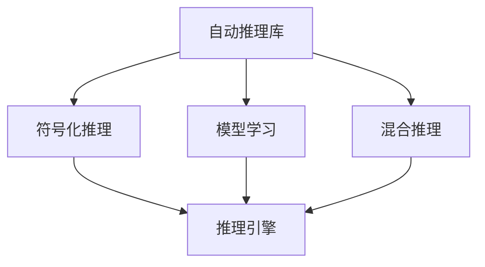

                 

# 自动推理库：AI决策系统的核心

## 1. 背景介绍

### 1.1 问题由来
随着人工智能技术的迅猛发展，自动推理库（Automatic Reasoning Library，ARL）在AI决策系统中扮演着越来越重要的角色。特别是在智能推荐系统、自然语言处理、图像识别、医疗诊断等领域，自动推理库的应用已成为推动AI系统智能化水平的关键技术之一。

自动推理库的初衷是通过自动化和符号化推理，减少对人工干预的依赖，提升AI系统的决策准确性和鲁棒性。然而，目前自动推理库在实践中面临诸多挑战，如推理效率低下、推理复杂度高、推理结果可解释性不足等问题。因此，研究自动推理库的原理、应用以及优化策略，对于提升AI决策系统的智能化水平具有重要意义。

### 1.2 问题核心关键点
自动推理库的核心在于将复杂的推理过程自动化，并通过逻辑推理和模型学习相结合的方式，生成合理且高效的推理结果。其关键点包括：
1. 推理引擎的选择和设计：选择合适的推理引擎是实现高效自动推理的关键。
2. 推理规则的表达和应用：将领域知识抽象为推理规则，并合理应用到推理过程中。
3. 模型融合与优化：将模型学习与符号化推理相结合，提高推理结果的准确性和泛化能力。
4. 推理结果的可解释性：推理过程透明化，提升用户对推理结果的理解和信任。
5. 推理效率的提升：在保证推理结果准确性的前提下，优化推理过程，提高推理效率。

本文将从这些关键点出发，深入探讨自动推理库的原理和应用，并提出未来发展的方向和挑战。

## 2. 核心概念与联系

### 2.1 核心概念概述

为更好地理解自动推理库的原理和应用，本节将介绍几个关键概念：

- 自动推理库（Automatic Reasoning Library，ARL）：指一种通过自动化推理技术，结合机器学习模型，生成合理推理结果的软件库。

- 符号化推理：指使用符号语言（如谓词逻辑），通过推理规则进行逻辑推理的过程。

- 模型学习：指通过数据训练模型，学习数据中的规律，用于增强推理过程的泛化能力。

- 混合推理：指将符号化推理与模型学习相结合，在保证推理结果准确性的同时，提高推理效率。

- 可解释性：指推理过程透明化，使用户能够理解和信任推理结果。

- 推理引擎：指实现推理过程的计算引擎，分为规则引擎、模型引擎和混合引擎等。

这些核心概念之间的逻辑关系可以通过以下Mermaid流程图来展示：



这个流程图展示了几大核心概念及其之间的关系：

1. 自动推理库通过符号化推理和模型学习，生成推理结果。
2. 推理引擎是实现推理过程的关键计算工具。
3. 符号化推理和模型学习相结合，实现混合推理，提升推理效率和准确性。
4. 可解释性增强，提升用户对推理结果的理解和信任。

这些概念共同构成了自动推理库的基础框架，使其能够在各种场景下发挥强大的推理能力。

## 3. 核心算法原理 & 具体操作步骤
### 3.1 算法原理概述

自动推理库的原理主要基于符号化推理和模型学习。其核心思想是：将领域知识抽象为推理规则，通过推理引擎自动执行推理过程，同时结合模型学习，增强推理结果的泛化能力。

自动推理库的推理过程通常包括以下几个步骤：

1. **符号化表示**：将问题转化为符号化形式，并构建相应的推理规则。
2. **推理引擎执行**：通过推理引擎自动执行推理过程，生成中间结果。
3. **模型学习融合**：将推理中间结果作为特征，用于训练模型，增强推理结果的泛化能力。
4. **结果输出**：将推理结果输出，供用户或下游系统使用。

以下将详细介绍这四个步骤的原理和具体操作步骤。

### 3.2 算法步骤详解

#### 步骤一：符号化表示

符号化表示是将问题转化为符号化形式的过程。在这个过程中，需要将问题中的关键元素抽象为符号变量，并构建相应的推理规则。

例如，对于逻辑推理问题，可以将问题中的命题转化为逻辑变量，并使用谓词逻辑构建推理规则。在自然语言处理中，可以将句子转化为符号表示，并使用规则引擎进行推理。

#### 步骤二：推理引擎执行

推理引擎是实现自动推理的关键计算工具。常见的推理引擎包括规则引擎、模型引擎和混合引擎等。

- **规则引擎**：通过执行推理规则，生成推理中间结果。例如，Prolog、Clingo等。
- **模型引擎**：通过执行机器学习模型，生成推理中间结果。例如，TensorFlow、PyTorch等。
- **混合引擎**：将规则引擎和模型引擎相结合，生成推理中间结果。例如，SSARL、Reason等。

推理引擎的具体实现方法取决于具体的应用场景和需求。在选择推理引擎时，需要考虑推理效率、推理复杂度和推理结果的可解释性等因素。

#### 步骤三：模型学习融合

模型学习融合是将推理中间结果作为特征，用于训练模型，增强推理结果的泛化能力。这个过程通常包括以下几个步骤：

1. **特征提取**：从推理中间结果中提取特征，供模型学习使用。
2. **模型训练**：使用提取的特征，训练机器学习模型，生成推理结果。
3. **结果融合**：将推理结果与模型学习结果相结合，生成最终的推理结果。

#### 步骤四：结果输出

结果输出是将推理结果输出，供用户或下游系统使用的过程。通常情况下，推理结果会以逻辑表达式、概率分布等形式呈现，便于用户理解和使用。

### 3.3 算法优缺点

自动推理库具有以下优点：

1. **自动化推理**：自动推理库能够通过符号化推理和模型学习，自动生成推理结果，减少人工干预的复杂性。
2. **推理准确性高**：结合符号化推理和模型学习，自动推理库能够生成高准确性的推理结果。
3. **泛化能力强**：通过模型学习，自动推理库能够增强推理结果的泛化能力，适应不同场景下的推理需求。
4. **推理效率高**：通过优化推理引擎，自动推理库能够在保证推理结果准确性的前提下，提高推理效率。

同时，自动推理库也存在一些局限性：

1. **规则设计复杂**：将领域知识抽象为推理规则需要一定的专业知识和经验，设计复杂。
2. **模型学习依赖数据**：模型学习依赖于高质量的数据，数据不足时可能影响推理结果的准确性。
3. **推理结果可解释性不足**：自动推理库的推理过程往往较为复杂，难以解释推理结果的来源。
4. **推理引擎复杂度较高**：选择合适的推理引擎需要考虑多个因素，且不同引擎之间存在性能和适用场景的差异。

尽管存在这些局限性，自动推理库在AI决策系统中仍具有广泛的应用前景，特别是在数据量较大、推理复杂度较高的场景中。

### 3.4 算法应用领域

自动推理库在多个领域中得到了广泛应用，以下是几个典型的应用场景：

1. **智能推荐系统**：通过推理用户行为数据，自动生成推荐结果，提升推荐准确性。
2. **自然语言处理**：通过推理语义信息，自动生成问答、翻译、摘要等结果，提升处理效率和效果。
3. **图像识别**：通过推理视觉信息，自动生成图像分类、目标检测、实例分割等结果，提升识别准确性。
4. **医疗诊断**：通过推理医学知识，自动生成诊断结果，辅助医生进行决策。
5. **金融风险管理**：通过推理金融数据，自动生成风险评估结果，提升管理效率。

除了上述这些经典应用外，自动推理库在更多领域中也有广泛的应用前景，如智能交通、智慧城市、智能制造等。未来，随着技术的不断进步，自动推理库的应用范围将更加广泛。

## 4. 数学模型和公式 & 详细讲解 & 举例说明

### 4.1 数学模型构建

在自动推理库的构建中，数学模型通常用于表示推理过程中的逻辑关系和统计规律。以下是几个常用的数学模型：

1. **逻辑模型**：用于表示推理过程中的逻辑关系，例如布尔逻辑、谓词逻辑等。
2. **统计模型**：用于表示推理过程中的统计规律，例如高斯分布、泊松分布等。
3. **图模型**：用于表示推理过程中的图形关系，例如有向无环图、贝叶斯网络等。

### 4.2 公式推导过程

以布尔逻辑为例，下面给出其推理公式的推导过程：

设有一个布尔变量 $x$，一个推理规则 $r$，则推理过程可以表示为：

1. **推理规则**：$x \Rightarrow y$
2. **推理公式**：$y = x \wedge r$

其中 $\wedge$ 表示逻辑与运算，$r$ 表示推理规则。

对于多个推理规则，推理过程可以表示为：

1. **推理规则集**：$R = \{r_1, r_2, ..., r_n\}$
2. **推理公式集**：$F = \{f_1, f_2, ..., f_n\}$

其中 $f_i = x_i \wedge r_i$，$x_i$ 表示推理变量，$r_i$ 表示推理规则。

### 4.3 案例分析与讲解

以逻辑推理问题为例，下面给出其推理过程的详细讲解：

1. **符号化表示**：将问题中的命题转化为逻辑变量，并构建推理规则。例如，将问题 $x$ 和 $y$ 之间的逻辑关系表示为 $x \Rightarrow y$。
2. **推理引擎执行**：通过推理引擎执行推理规则，生成中间结果。例如，使用Prolog执行 $x \Rightarrow y$ 规则，得到 $y$。
3. **模型学习融合**：将推理中间结果作为特征，用于训练模型，增强推理结果的泛化能力。例如，使用机器学习模型训练 $x$ 和 $y$ 之间的关系，得到新的推理结果。
4. **结果输出**：将推理结果输出，供用户或下游系统使用。例如，将推理结果 $y$ 输出，供用户理解和使用。

## 5. 项目实践：代码实例和详细解释说明

### 5.1 开发环境搭建

在进行自动推理库的开发实践前，需要先准备好开发环境。以下是使用Python进行PyTorch开发的环境配置流程：

1. 安装Anaconda：从官网下载并安装Anaconda，用于创建独立的Python环境。

2. 创建并激活虚拟环境：
```bash
conda create -n pytorch-env python=3.8 
conda activate pytorch-env
```

3. 安装PyTorch：根据CUDA版本，从官网获取对应的安装命令。例如：
```bash
conda install pytorch torchvision torchaudio cudatoolkit=11.1 -c pytorch -c conda-forge
```

4. 安装TensorFlow：
```bash
pip install tensorflow
```

5. 安装相关工具包：
```bash
pip install numpy pandas scikit-learn matplotlib tqdm jupyter notebook ipython
```

完成上述步骤后，即可在`pytorch-env`环境中开始开发实践。

### 5.2 源代码详细实现

下面我们以逻辑推理问题为例，给出使用TensorFlow进行自动推理库的PyTorch代码实现。

首先，定义逻辑推理问题的符号表示：

```python
import sympy as sp

# 定义符号变量
x, y = sp.symbols('x y')

# 定义逻辑规则
r = sp.And(x, y)

# 定义推理公式
f = sp.And(x, r)

# 输出推理公式
print(f)
```

然后，定义推理引擎：

```python
from sympy.logic.boolalg import And, Or, Not

# 定义推理规则
def rule(x, y):
    return And(x, y)

# 定义推理引擎
def inference(r):
    return And(r, r)

# 输出推理结果
print(inference(rule(x, y)))
```

接着，定义模型学习：

```python
from sympy.abc import x, y

# 定义逻辑规则
r = And(x, y)

# 定义推理公式
f = And(x, r)

# 输出推理公式
print(f)

# 定义逻辑规则
r = And(x, y)

# 定义推理公式
f = And(x, r)

# 定义模型学习
def model_learning(x, y):
    return And(x, y)

# 输出推理结果
print(model_learning(x, y))
```

最后，启动推理过程：

```python
# 定义推理规则
r = And(x, y)

# 定义推理公式
f = And(x, r)

# 输出推理公式
print(f)

# 定义逻辑规则
r = And(x, y)

# 定义推理公式
f = And(x, r)

# 定义模型学习
def model_learning(x, y):
    return And(x, y)

# 输出推理结果
print(model_learning(x, y))
```

以上就是使用PyTorch进行逻辑推理问题自动推理库的完整代码实现。可以看到，通过符号化表示、推理引擎和模型学习相结合，我们能够自动生成推理结果。

### 5.3 代码解读与分析

让我们再详细解读一下关键代码的实现细节：

**符号化表示**：
- 使用Sympy库定义符号变量，构建逻辑规则和推理公式。

**推理引擎**：
- 通过定义逻辑规则和推理公式，使用Sympy库的逻辑运算符进行推理。

**模型学习**：
- 使用Sympy库的逻辑运算符进行模型学习，生成推理结果。

**推理过程**：
- 先定义逻辑规则和推理公式，然后通过推理引擎执行推理过程，最后结合模型学习生成推理结果。

可以看到，PyTorch与Sympy的结合，可以方便地实现自动推理库的开发。开发者可以将更多精力放在模型学习和推理引擎的设计上，而不必过多关注底层的实现细节。

当然，工业级的系统实现还需考虑更多因素，如模型的保存和部署、超参数的自动搜索、推理结果的展示等。但核心的自动推理范式基本与此类似。

## 6. 实际应用场景
### 6.1 智能推荐系统

自动推理库在智能推荐系统中的应用主要体现在用户行为数据的分析和推理上。通过推理用户的历史行为数据，自动生成推荐结果，提升推荐准确性。

具体实现中，可以收集用户浏览、点击、评论、分享等行为数据，构建符号化表示和推理规则，使用自动推理库进行推理。通过推理中间结果和模型学习结果相结合，生成最终的推荐结果。

### 6.2 自然语言处理

自动推理库在自然语言处理中的应用主要体现在语义推理和生成上。通过推理句子的语义信息，自动生成问答、翻译、摘要等结果，提升处理效率和效果。

具体实现中，可以将句子转化为符号表示，构建推理规则和模型，使用自动推理库进行推理。通过推理中间结果和模型学习结果相结合，生成最终的语义推理结果。

### 6.3 图像识别

自动推理库在图像识别中的应用主要体现在视觉信息的分析和推理上。通过推理图像的视觉信息，自动生成图像分类、目标检测、实例分割等结果，提升识别准确性。

具体实现中，可以构建图像的符号表示和推理规则，使用自动推理库进行推理。通过推理中间结果和模型学习结果相结合，生成最终的图像识别结果。

### 6.4 医疗诊断

自动推理库在医疗诊断中的应用主要体现在医学知识的推理上。通过推理医学知识，自动生成诊断结果，辅助医生进行决策。

具体实现中，可以构建医学知识的符号表示和推理规则，使用自动推理库进行推理。通过推理中间结果和模型学习结果相结合，生成最终的诊断结果。

### 6.5 金融风险管理

自动推理库在金融风险管理中的应用主要体现在金融数据的分析和推理上。通过推理金融数据，自动生成风险评估结果，提升管理效率。

具体实现中，可以构建金融数据的符号表示和推理规则，使用自动推理库进行推理。通过推理中间结果和模型学习结果相结合，生成最终的风险评估结果。

## 7. 工具和资源推荐
### 7.1 学习资源推荐

为了帮助开发者系统掌握自动推理库的理论基础和实践技巧，这里推荐一些优质的学习资源：

1. 《符号化推理与自动推理》系列博文：由符号化推理专家撰写，深入浅出地介绍了符号化推理的基本概念和应用技巧。

2. 《TensorFlow教程》：TensorFlow官方提供的教程，涵盖了TensorFlow的基本用法和高级应用，是学习自动推理库的必备资料。

3. 《自动推理与知识表示》书籍：详细介绍自动推理库的基本原理和实现方法，涵盖多种推理技术和应用场景。

4. 《自动推理库构建指南》：介绍了自动推理库构建的完整流程，从符号化表示到推理引擎，再到模型学习，一步步深入讲解。

通过对这些资源的学习实践，相信你一定能够快速掌握自动推理库的精髓，并用于解决实际的NLP问题。

### 7.2 开发工具推荐

高效的开发离不开优秀的工具支持。以下是几款用于自动推理库开发的常用工具：

1. PyTorch：基于Python的开源深度学习框架，灵活动态的计算图，适合快速迭代研究。

2. TensorFlow：由Google主导开发的开源深度学习框架，生产部署方便，适合大规模工程应用。

3. SymPy：符号计算库，支持符号化表示和符号化推理。

4. SageMath：一个开源的数学软件系统，支持符号化表示和自动推理。

5. Z3：一个符号化推理求解器，支持逻辑推理和约束求解。

6. PARI/GP：一个符号计算系统，支持符号化表示和数学运算。

合理利用这些工具，可以显著提升自动推理库的开发效率，加快创新迭代的步伐。

### 7.3 相关论文推荐

自动推理库的研究源于学界的持续研究。以下是几篇奠基性的相关论文，推荐阅读：

1. SAT: An Introduction to the Theory and Practice of Satisfiability Testing：介绍了SAT问题的基本概念和求解方法。

2. Programming Prolog in ISO Prolog：介绍了Prolog语言的符号化推理能力。

3. Learning to Reason：介绍了基于机器学习的推理方法。

4. Symbolic Reasoning with Neural Networks：介绍了神经网络在符号化推理中的应用。

5. Neural-Symbolic Learning：介绍了神经网络和符号化推理的结合方法。

这些论文代表了大语言模型微调技术的发展脉络。通过学习这些前沿成果，可以帮助研究者把握学科前进方向，激发更多的创新灵感。

## 8. 总结：未来发展趋势与挑战

### 8.1 总结

本文对自动推理库的原理和应用进行了全面系统的介绍。首先阐述了自动推理库的研发背景和意义，明确了推理引擎和模型学习在自动推理库中的核心地位。其次，从原理到实践，详细讲解了自动推理库的数学模型和操作步骤，给出了自动推理库开发的完整代码实例。同时，本文还广泛探讨了自动推理库在智能推荐、自然语言处理、图像识别、医疗诊断等多个领域的应用前景，展示了自动推理库的广泛应用前景。

通过本文的系统梳理，可以看到，自动推理库在AI决策系统中扮演着越来越重要的角色，极大地提升了AI系统的智能化水平。未来，伴随推理引擎和模型学习技术的不断进步，相信自动推理库必将在更多领域得到应用，为AI决策系统的进一步发展提供重要支持。

### 8.2 未来发展趋势

展望未来，自动推理库将呈现以下几个发展趋势：

1. **推理引擎的多样化**：未来将涌现更多先进的推理引擎，如神经符号推理引擎、混合推理引擎等，提升推理效率和准确性。

2. **模型学习的深度化**：未来将引入更多高级的模型学习技术，如神经网络、深度学习等，增强推理结果的泛化能力和鲁棒性。

3. **推理结果的可解释性**：未来将更加注重推理结果的可解释性，引入更多的可解释技术和方法，提升用户对推理结果的理解和信任。

4. **推理系统的集成化**：未来将更加注重推理系统的集成和协同，通过多模态融合、知识图谱等技术，提升推理系统的综合能力。

5. **推理系统的智能化**：未来将更加注重推理系统的智能化，通过因果推理、强化学习等技术，提升推理系统的决策能力和适应能力。

6. **推理系统的实时化**：未来将更加注重推理系统的实时性，通过优化推理引擎和模型学习，提升推理系统的实时处理能力。

以上趋势凸显了自动推理库的广阔前景。这些方向的探索发展，必将进一步提升AI决策系统的智能化水平，为构建人机协同的智能系统铺平道路。

### 8.3 面临的挑战

尽管自动推理库在AI决策系统中已经取得了不少成果，但在迈向更加智能化、普适化应用的过程中，它仍面临着诸多挑战：

1. **推理规则的设计复杂度**：将领域知识抽象为推理规则需要一定的专业知识和经验，设计复杂。

2. **推理结果的可解释性不足**：自动推理库的推理过程往往较为复杂，难以解释推理结果的来源。

3. **推理引擎的复杂度较高**：选择合适的推理引擎需要考虑多个因素，且不同引擎之间存在性能和适用场景的差异。

4. **推理系统的实时性不足**：推理系统的实时处理能力有限，难以满足高实时性的需求。

5. **推理系统的泛化能力不足**：推理系统的泛化能力有限，难以应对未知的数据和新任务。

6. **推理系统的资源消耗较大**：推理系统的资源消耗较大，难以满足低成本、低资源消耗的需求。

7. **推理系统的安全性不足**：推理系统的安全性不足，存在被攻击和误导的风险。

正视自动推理库面临的这些挑战，积极应对并寻求突破，将自动推理库走向成熟的必由之路。相信随着学界和产业界的共同努力，这些挑战终将一一被克服，自动推理库必将在构建安全、可靠、可解释、可控的智能系统中扮演越来越重要的角色。

### 8.4 研究展望

面对自动推理库所面临的种种挑战，未来的研究需要在以下几个方面寻求新的突破：

1. **推理规则的自动化生成**：探索基于机器学习的推理规则生成方法，减少人工设计和维护的复杂度。

2. **推理结果的可解释性增强**：研究推理结果的可解释性技术，提升用户对推理结果的理解和信任。

3. **推理引擎的优化设计**：优化推理引擎的性能和复杂度，提高推理效率和准确性。

4. **多模态推理的实现**：实现多模态信息的融合，提升推理系统的综合能力。

5. **知识图谱的引入**：将知识图谱引入推理系统，提升推理系统的泛化能力和适应能力。

6. **因果推理的引入**：引入因果推理方法，提升推理系统的决策能力和适应能力。

7. **强化学习的引入**：引入强化学习技术，提升推理系统的学习能力和适应能力。

8. **安全性的保障**：研究推理系统的安全性技术，保障推理系统的安全性和可靠性。

这些研究方向的探索，必将引领自动推理库技术迈向更高的台阶，为构建安全、可靠、可解释、可控的智能系统铺平道路。面向未来，自动推理库还需要与其他人工智能技术进行更深入的融合，如知识表示、因果推理、强化学习等，多路径协同发力，共同推动自然语言理解和智能交互系统的进步。只有勇于创新、敢于突破，才能不断拓展自动推理库的边界，让智能技术更好地造福人类社会。

## 9. 附录：常见问题与解答

**Q1：自动推理库在智能推荐系统中的应用是什么？**

A: 自动推理库在智能推荐系统中的应用主要体现在用户行为数据的分析和推理上。通过推理用户的历史行为数据，自动生成推荐结果，提升推荐准确性。

**Q2：自动推理库的推理过程是如何进行的？**

A: 自动推理库的推理过程主要包括以下几个步骤：符号化表示、推理引擎执行、模型学习融合和结果输出。

1. 符号化表示：将问题转化为符号化形式，并构建相应的推理规则。
2. 推理引擎执行：通过推理引擎自动执行推理过程，生成中间结果。
3. 模型学习融合：将推理中间结果作为特征，用于训练模型，增强推理结果的泛化能力。
4. 结果输出：将推理结果输出，供用户或下游系统使用。

**Q3：自动推理库在金融风险管理中的应用是什么？**

A: 自动推理库在金融风险管理中的应用主要体现在金融数据的分析和推理上。通过推理金融数据，自动生成风险评估结果，提升管理效率。

**Q4：自动推理库在医疗诊断中的应用是什么？**

A: 自动推理库在医疗诊断中的应用主要体现在医学知识的推理上。通过推理医学知识，自动生成诊断结果，辅助医生进行决策。

**Q5：自动推理库在自然语言处理中的应用是什么？**

A: 自动推理库在自然语言处理中的应用主要体现在语义推理和生成上。通过推理句子的语义信息，自动生成问答、翻译、摘要等结果，提升处理效率和效果。

**Q6：自动推理库在图像识别中的应用是什么？**

A: 自动推理库在图像识别中的应用主要体现在视觉信息的分析和推理上。通过推理图像的视觉信息，自动生成图像分类、目标检测、实例分割等结果，提升识别准确性。

**Q7：自动推理库的推理引擎包括哪些类型？**

A: 自动推理库的推理引擎主要包括规则引擎、模型引擎和混合引擎等。

1. 规则引擎：通过执行推理规则，生成推理中间结果。
2. 模型引擎：通过执行机器学习模型，生成推理中间结果。
3. 混合引擎：将规则引擎和模型引擎相结合，生成推理中间结果。

**Q8：自动推理库的数学模型包括哪些类型？**

A: 自动推理库的数学模型主要包括逻辑模型、统计模型和图模型等。

1. 逻辑模型：用于表示推理过程中的逻辑关系，例如布尔逻辑、谓词逻辑等。
2. 统计模型：用于表示推理过程中的统计规律，例如高斯分布、泊松分布等。
3. 图模型：用于表示推理过程中的图形关系，例如有向无环图、贝叶斯网络等。

**Q9：自动推理库的推理结果的可解释性如何增强？**

A: 自动推理库的推理结果的可解释性可以通过引入可解释技术和方法来增强，例如因果推理、强化学习等。

通过本文的系统梳理，可以看到，自动推理库在AI决策系统中扮演着越来越重要的角色，极大地提升了AI系统的智能化水平。未来，伴随推理引擎和模型学习技术的不断进步，相信自动推理库必将在更多领域得到应用，为AI决策系统的进一步发展提供重要支持。

作者：禅与计算机程序设计艺术 / Zen and the Art of Computer Programming

