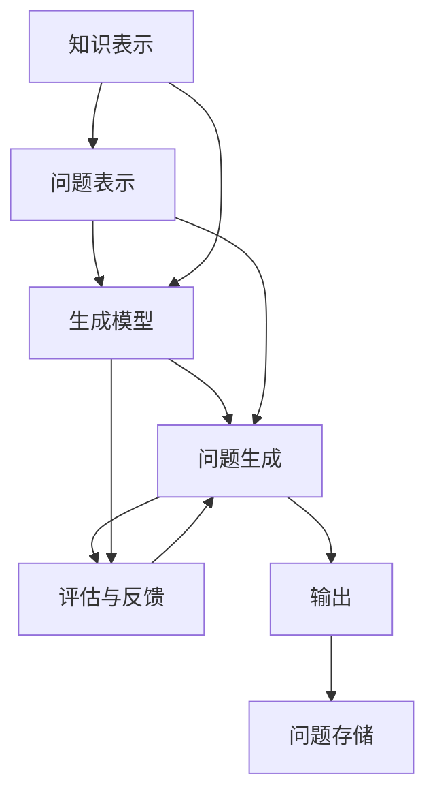

                 

# 自动问题生成：教育与测试应用

> 关键词：自动问题生成, 教育, 测试, 学习评估, 自适应学习, 智能题库, 算法与模型

## 1. 背景介绍

### 1.1 问题由来
在教育领域，尤其是高等教育和职业培训中，问题生成（Question Generation, QG）技术日益成为提升教学质量的重要手段。传统的教学方法往往依赖于教师手动编写题库，这一过程耗时费力，且易受教师个人经验和主观意愿影响，导致题库质量参差不齐。自动问题生成技术能够高效生成大量高质量的考试题和习题，为大规模个性化教育提供支撑，从而推动教学质量和效率的全面提升。

### 1.2 问题核心关键点
自动问题生成技术的核心在于如何构建一个智能、高效、具有多样化表达的问题生成系统。该系统需具备以下几个关键能力：
1. 理解课程内容和知识点，生成与课程内容高度相关的问题。
2. 掌握不同难度和复杂度的生成技巧，确保生成的问题既符合教学需求，又具备适度的挑战性。
3. 融合学生的学习数据和行为特征，实现自适应生成，适应学生的个性化学习需求。
4. 输出形式灵活多样，支持文本、图像、声音等多模态问题表达。

本文旨在全面系统地介绍自动问题生成技术，重点探讨其在教育与测试中的应用。从核心算法原理、具体操作步骤、数学模型构建，到实际应用场景和未来发展趋势，全面解析该技术的精髓。

## 2. 核心概念与联系

### 2.1 核心概念概述

自动问题生成（Question Generation, QG）技术旨在利用人工智能方法，自动生成适合特定课程或主题的考试题和习题，为教学和评估提供高质量的数据支撑。QG系统通常包括以下几个核心组件：

- **知识表示(Knowledge Representation)**：将课程内容和知识点以结构化或半结构化的形式表达出来，供问题生成模型使用。
- **问题表示(Question Representation)**：描述问题特征和结构，如问题类型、难度、知识点分布等。
- **生成模型(Generative Model)**：利用机器学习算法生成符合问题表示要求的自然语言问题。
- **评估与反馈(Evaluation & Feedback)**：对生成的问题进行质量评估，并根据评估结果进行调整优化。

### 2.2 核心概念原理和架构的 Mermaid 流程图



该流程图展示了自动问题生成系统的基本架构和数据流动路径：

1. **知识表示**：将课程和知识点以结构化数据形式输入。
2. **问题表示**：根据知识表示生成问题特征和结构。
3. **生成模型**：利用知识表示和问题表示生成自然语言问题。
4. **问题生成**：将生成的自然语言问题转换为可理解的题型或习题。
5. **评估与反馈**：对生成的问题进行质量评估，并反馈至生成模型进行优化。
6. **问题存储**：将生成的问题和答案存储，形成题库。
7. **问题输出**：将问题应用于教学和评估中，辅助教学和评估。

## 3. 核心算法原理 & 具体操作步骤

### 3.1 算法原理概述

自动问题生成系统的核心算法原理主要基于自然语言生成（Natural Language Generation, NLG）技术和自适应学习（Adaptive Learning）方法。具体而言：

- **自然语言生成技术**：旨在生成符合语法和语义规范的自然语言文本，包括但不限于文本、对话、描述等。
- **自适应学习技术**：根据学生学习数据和行为特征，自动调整生成问题的难度和复杂度，实现个性化学习。

### 3.2 算法步骤详解

自动问题生成系统的具体步骤包括：

1. **知识表示与问题表示**
   - 将课程内容转化为结构化数据，如知识图谱、本体论、分类层次结构等。
   - 设计问题模板，定义问题类型、难度、知识点分布等特征。

2. **生成模型训练**
   - 选择适当的生成模型，如基于规则的模板匹配、基于统计的语言模型（如RNN、LSTM、Transformer）或基于深度学习的生成模型（如GPT、BERT）。
   - 使用标注数据（包含问题和答案）训练生成模型，优化生成质量。

3. **问题生成与调整**
   - 根据问题模板和知识表示生成初步问题。
   - 对生成的问题进行语法、语义和逻辑检查，确保生成的问题符合教学要求。
   - 引入自适应学习机制，根据学生学习数据和行为特征调整问题难度和分布。

4. **评估与优化**
   - 设计问题质量评估指标，如语法正确性、语义相关性、知识点覆盖度等。
   - 利用评估结果指导生成模型的优化，提高生成质量。

5. **问题输出与存储**
   - 将生成的问题和答案存入数据库或知识库，形成题库。
   - 将问题应用于教学和评估中，评估学生学习效果。

### 3.3 算法优缺点

自动问题生成技术的主要优点包括：
1. 高效生成：能够快速生成大量高质量的问题，节省教师时间和精力。
2. 个性化学习：结合学生学习数据，实现自适应生成，适应个性化学习需求。
3. 教学辅助：为教师提供丰富的教学工具和资源，提升教学效果。
4. 灵活输出：支持多模态问题表达，增强学习体验和效果。

同时，该技术也存在以下局限：
1. 依赖数据：生成模型的质量和效果高度依赖于数据的质量和量。
2. 缺乏创造力：自动生成的答案可能缺乏原创性和深度，需要人工审核。
3. 系统复杂性：构建和维护高复杂度的生成系统，技术门槛较高。
4. 伦理与隐私：生成的数据和问题可能涉及学生隐私，需关注数据保护问题。

### 3.4 算法应用领域

自动问题生成技术在教育与测试领域具有广泛应用前景，涵盖以下几个方面：

- **考试题库生成**：为各类学科、年级和考试类型的标准化考试生成题库，减少教师工作负担。
- **个性化学习系统**：为在线教育平台提供个性化问题生成功能，辅助自适应学习。
- **智能辅导系统**：构建智能化的学习辅导系统，实时生成个性化问题，提升学习效果。
- **职业培训**：为职业培训课程生成实用的技能测试题，提高培训效果和就业竞争力。

## 4. 数学模型和公式 & 详细讲解 & 举例说明

### 4.1 数学模型构建

自动问题生成系统可以构建为序列到序列（Sequence-to-Sequence, Seq2Seq）模型，将知识表示和问题表示转化为问题文本。其中，知识表示部分可以采用图结构表示法，问题表示部分可以设计为包含问题类型、难度、知识点分布等特征的向量。

### 4.2 公式推导过程

以基于Transformer的Seq2Seq模型为例，问题生成过程如下：

$$
\text{Input: } K=\{\text{课程知识点}, \text{知识关系}\}, P=\{\text{问题类型}, \text{难度}, \text{知识点分布}\}
$$

$$
\text{Output: } Q=\text{自然语言问题}
$$

其中，$K$为知识表示，$P$为问题表示。模型通过编码器将$K$和$P$转换为隐藏表示$H$，再通过解码器生成问题文本$Q$。具体推导如下：

$$
H = \text{Encoder}(K, P)
$$

$$
Q = \text{Decoder}(H)
$$

其中，$\text{Encoder}$和$\text{Decoder}$分别表示编码器和解码器，采用Transformer结构。

### 4.3 案例分析与讲解

以生成数学题为例，假设课程知识点为“函数导数”，问题类型为“计算题”，难度为“中等”，知识点分布为“所有知识点”。

知识表示$K$可以表示为：
$$
K = \{(\text{函数导数}, \text{重要}), (\text{导数的定义}, \text{基础}), (\text{常见导数公式}, \text{基础}), (\text{导数的应用}, \text{中高级})\}
$$

问题表示$P$可以表示为：
$$
P = \{(\text{计算题}, \text{中等}), (\text{所有知识点}, \text{所有})\}
$$

模型通过编码器将$K$和$P$转换为隐藏表示$H$，再通过解码器生成问题文本$Q$。生成的数学题示例如下：

```
已知函数$f(x)=x^2+2x+1$，求导数$f'(x)$。
```

## 5. 项目实践：代码实例和详细解释说明

### 5.1 开发环境搭建

自动问题生成系统的开发环境搭建主要包括以下步骤：

1. 安装Python和相关依赖包：使用Anaconda创建虚拟环境，安装TensorFlow、PyTorch、NLTK等。
2. 准备知识表示数据：收集课程内容和知识点，构建知识图谱或分类层次结构。
3. 准备问题表示数据：设计问题模板，定义问题类型、难度、知识点分布等特征。
4. 准备训练数据：收集标注数据（包含问题和答案），划分为训练集、验证集和测试集。

### 5.2 源代码详细实现

以基于Transformer的Seq2Seq模型为例，生成数学题的部分代码如下：

```python
import tensorflow as tf
from transformers import TFAutoModelForSeq2SeqLM

class QGModel(tf.keras.Model):
    def __init__(self, config, voc_size):
        super(QGModel, self).__init__()
        self.encoder = TFAutoModelForSeq2SeqLM(config)
        self.decoder = TFAutoModelForSeq2SeqLM(config)
        self.tokenizer = AutoTokenizer.from_pretrained('bert-base-uncased')
        self.vocab_size = voc_size
        self.config = config
    
    def call(self, input_ids):
        # 编码器编码
        encoder_output, encoder_states = self.encoder(input_ids, attention_mask=input_ids != 0)
        
        # 解码器生成
        decoder_input = tf.expand_dims(input_ids, 0)
        outputs = self.decoder(decoder_input, encoder_output)
        
        # 输出问题文本
        predicted_ids = tf.reshape(outputs, (-1, self.vocab_size))
        predicted_ids = tf.argmax(predicted_ids, axis=-1)
        return predicted_ids

# 构建模型
model = QGModel(config, vocab_size=10000)
model.compile(optimizer=tf.keras.optimizers.Adam(learning_rate=0.001), loss=tf.keras.losses.SparseCategoricalCrossentropy(from_logits=True), metrics=[tf.keras.metrics.SparseCategoricalAccuracy()])

# 训练模型
model.fit(x_train, y_train, batch_size=32, epochs=10, validation_data=(x_val, y_val))
```

### 5.3 代码解读与分析

上述代码实现了一个基于Transformer的Seq2Seq模型，用于生成数学题。主要包括以下几个步骤：

1. 初始化模型：构建编码器和解码器，加载预训练模型参数。
2. 定义模型调用函数：将输入序列编码，通过解码器生成问题文本。
3. 模型编译：配置优化器、损失函数和评估指标。
4. 模型训练：使用训练集数据训练模型，验证集进行模型验证。

通过上述代码，开发者可以构建简单的自动问题生成系统，用于生成特定领域的数学题。

### 5.4 运行结果展示

训练完成后，模型可以用于生成新的数学题。例如，使用训练好的模型生成如下问题：

```
已知函数$f(x)=x^2+2x+1$，求导数$f'(x)$。
```

## 6. 实际应用场景

### 6.1 教育应用

在教育领域，自动问题生成技术广泛应用于考试题库生成、个性化学习系统、智能辅导系统等多个场景，具体应用包括：

- **考试题库生成**：根据课程大纲和知识点生成标准化考试题库，涵盖各种难度和题型，提升考试公平性和有效性。
- **个性化学习系统**：为在线教育平台提供个性化问题生成功能，根据学生学习数据和行为特征，实时生成个性化问题，提升学习效果。
- **智能辅导系统**：构建智能化的学习辅导系统，实时生成个性化问题，辅助学生自主学习，提供实时反馈和建议。

### 6.2 测试应用

自动问题生成技术还可以应用于各类测试场景，提升测试质量和效率，具体应用包括：

- **人力资源招聘**：为招聘测试生成多模态问题，包括文本、图像、声音等，评估应聘者的综合素质和能力。
- **医疗考试**：为医学考试生成多样化的问题，涵盖基础知识、临床应用、实际操作等，全面评估医学生的能力。
- **工业培训**：为职业技能培训生成实用性强的技能测试题，提高培训效果和就业竞争力。

## 7. 工具和资源推荐

### 7.1 学习资源推荐

自动问题生成技术涉及自然语言处理、深度学习、教育技术等多个领域，以下是一些推荐的学习资源：

1. 《自然语言处理综论》（Speech and Language Processing, SLP）：由Daniel Jurafsky和James H. Martin合著，全面介绍自然语言处理的基础知识和前沿技术。
2. 《深度学习》（Deep Learning）：由Ian Goodfellow、Yoshua Bengio和Aaron Courville合著，介绍深度学习的理论和实践。
3. 《教育技术基础》（Educational Technology Fundamentals）：介绍教育技术和教学方法，结合自动问题生成技术进行讲解。
4. 《自适应学习系统设计与开发》（Designing and Developing Adaptive Learning Systems）：介绍自适应学习系统的设计理念和开发方法，结合自动问题生成技术进行讲解。

### 7.2 开发工具推荐

自动问题生成系统的开发涉及自然语言处理、深度学习、教育技术等多个领域，以下是一些推荐的开发工具：

1. TensorFlow：谷歌开源的深度学习框架，支持多种深度学习模型的构建和训练。
2. PyTorch：Facebook开源的深度学习框架，灵活高效，支持动态计算图。
3. HuggingFace Transformers：NLP领域最流行的库之一，提供了多种预训练模型和工具，便于问题生成模型的构建和训练。
4. NLTK：自然语言处理工具包，提供各种文本处理功能，如分词、词性标注、句法分析等。
5. spaCy：开源的自然语言处理库，提供高效的分词、句法分析、实体识别等功能。

### 7.3 相关论文推荐

自动问题生成技术的研究涉及自然语言处理、深度学习、教育技术等多个领域，以下是一些推荐的相关论文：

1. "Training Recurrent Neural Networks to Generate Natural Language"（2015）：提出使用RNN生成自然语言的方法，为自动问题生成技术奠定了基础。
2. "A Neural Attention Model for Abstractive Question Answering"（2016）：提出使用Transformer模型生成自然语言问题，为Seq2Seq模型在问题生成中的应用提供了参考。
3. "SAM-LAN: Semi-Annotated Massive Language Annotation for Education"（2018）：提出使用半监督学习方法大规模标注数据，提高自动问题生成的质量。
4. "Adaptive Question Generation in Science Education"（2019）：研究如何结合学生学习数据，实现自适应生成问题，提升学习效果。
5. "Knowledge-Based Automatic Question Generation"（2020）：提出基于知识图谱的问题生成方法，提升生成问题的质量和多样性。

## 8. 总结：未来发展趋势与挑战

### 8.1 研究成果总结

本文系统介绍了自动问题生成技术，涵盖知识表示、问题表示、生成模型、评估与优化等多个方面。该技术通过自然语言生成技术和自适应学习方法，高效生成高质量的考试题和习题，广泛应用于教育与测试领域，具有广泛的应用前景。

### 8.2 未来发展趋势

未来自动问题生成技术的发展趋势主要包括以下几个方面：

1. **智能化程度提升**：随着深度学习技术的发展，生成模型的智能化程度将进一步提升，能够生成更加丰富多样、符合教学需求的问题。
2. **个性化学习增强**：结合学生学习数据和行为特征，实现自适应生成，适应个性化学习需求。
3. **多模态问题表达**：支持文本、图像、声音等多模态问题表达，提升学习体验和效果。
4. **跨学科应用拓展**：拓展到更多学科领域，如医学、法律、金融等，提供更广泛的应用场景。
5. **数据驱动优化**：通过大规模数据驱动模型优化，提升生成问题的质量和多样性。

### 8.3 面临的挑战

尽管自动问题生成技术在教育与测试领域具有广泛应用前景，但也面临诸多挑战：

1. **数据依赖**：生成模型的质量和效果高度依赖于数据的质量和量，如何高效获取和利用数据是关键。
2. **技术复杂性**：构建和维护高复杂度的生成系统，技术门槛较高，需要跨学科知识。
3. **伦理与隐私**：生成的数据和问题可能涉及学生隐私，需关注数据保护问题。
4. **鲁棒性与多样性**：生成的问题可能存在多样性和鲁棒性不足的问题，需要进一步优化。

### 8.4 研究展望

未来自动问题生成技术的研究方向主要包括以下几个方面：

1. **无监督和半监督学习**：探索无监督和半监督学习范式，减少对大规模标注数据的依赖。
2. **多模态问题生成**：研究如何支持文本、图像、声音等多模态问题表达，提升学习体验和效果。
3. **自适应学习机制**：研究如何更好地结合学生学习数据和行为特征，实现自适应生成。
4. **跨学科应用**：拓展到更多学科领域，如医学、法律、金融等，提供更广泛的应用场景。
5. **伦理与隐私保护**：研究如何在保护隐私的前提下，提高生成问题的质量和多样性。

## 9. 附录：常见问题与解答

### Q1: 自动问题生成技术是否只适用于标准化考试？

A: 自动问题生成技术不仅适用于标准化考试，还可应用于个性化学习、智能辅导等多个场景，能够根据学生的学习情况和需求，生成符合教学目标的问题，提升学习效果。

### Q2: 自动问题生成的答案是否具有创新性和深度？

A: 自动问题生成的答案可能缺乏原创性和深度，需要人工审核。但可以通过结合教师评阅和学生自评机制，提高生成答案的质量。

### Q3: 自动问题生成技术如何实现跨学科应用？

A: 自动问题生成技术需要结合不同学科的知识表示和问题表示，设计对应的生成模型和评估机制，才能实现跨学科应用。

### Q4: 自动问题生成技术如何保护学生隐私？

A: 自动问题生成技术需严格遵守数据保护法律法规，如GDPR等，确保生成数据和问题不会泄露学生隐私。

### Q5: 自动问题生成技术在教育领域有哪些具体应用？

A: 自动问题生成技术在教育领域的具体应用包括考试题库生成、个性化学习系统、智能辅导系统等多个场景，能够提升教学质量和效率。

---

作者：禅与计算机程序设计艺术 / Zen and the Art of Computer Programming

