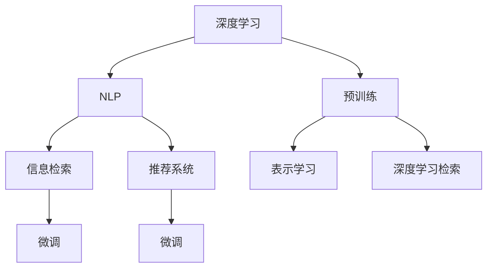

                 

# 自我学习AI：搜索引擎的进化

> 关键词：搜索引擎, 人工智能, 信息检索, 深度学习, 自然语言处理, 推荐系统

## 1. 背景介绍

### 1.1 问题由来
随着互联网的迅猛发展，信息量呈指数级增长，如何高效地从海量信息中检索出用户所需内容成为亟待解决的难题。搜索引擎应运而生，成为连接用户与信息的桥梁。传统的搜索引擎依赖于网页索引、关键词匹配等技术，但面对越来越复杂的用户查询，传统的文本匹配策略已经难以满足需求。近年来，基于深度学习和自然语言处理技术的新型搜索引擎应运而生，通过自我学习不断提升信息检索能力，极大地改善了用户的搜索体验。

### 1.2 问题核心关键点
自我学习搜索引擎的核心在于，通过深度学习模型在大规模无标签数据上预训练，然后通过有监督的微调，学习用户查询的语义表示和查询意图，从而实现更智能、更个性化的信息检索。这种技术不仅能够处理自然语言，还能理解语境、主题、关系等复杂语义信息，大大提升了搜索结果的相关性和准确性。

### 1.3 问题研究意义
自我学习搜索引擎的研究具有重要意义：
- 提升搜索效率：通过深度学习模型，能够更好地理解用户查询，提供更精准、更相关的搜索结果。
- 个性化服务：基于用户的历史行为和兴趣，提供个性化的推荐和查询建议，增强用户体验。
- 技术创新：推动自然语言处理、信息检索、推荐系统等技术的进步，加速人工智能技术的应用。
- 经济价值：为企业节省搜索成本，创造更多商业价值，促进数字化转型。

## 2. 核心概念与联系

### 2.1 核心概念概述

为了更好地理解自我学习搜索引擎的核心技术，本节将介绍几个关键概念：

- 深度学习(Deep Learning)：一种基于神经网络的学习方式，通过多层次的特征提取和抽象，实现对复杂数据的高效建模和处理。
- 自然语言处理(Natural Language Processing, NLP)：研究计算机如何理解和生成自然语言的技术，包括文本分析、信息检索、机器翻译等。
- 信息检索(Information Retrieval)：从大量数据中检索出与用户查询相关的信息，是搜索引擎的核心技术之一。
- 推荐系统(Recommendation System)：根据用户的历史行为和兴趣，推荐个性化的信息或商品，是搜索引擎的补充技术。
- 预训练(Pre-training)：在大规模无标签数据上，通过自监督学习任务训练模型，学习语言的通用表示。
- 微调(Fine-tuning)：在预训练模型的基础上，通过有监督学习任务进一步优化模型，学习特定领域的知识。
- 表示学习(Representation Learning)：通过学习数据的高维表示，提升模型的理解和表达能力。
- 深度学习检索(Deep Learning Retrieval)：利用深度学习模型进行信息检索，提高检索的准确性和相关性。

这些核心概念之间的逻辑关系可以通过以下Mermaid流程图来展示：



这个流程图展示了几项核心概念之间的关系：

1. 深度学习提供了强大的特征提取和表示能力，支撑了NLP、信息检索和推荐系统的发展。
2. 自然语言处理通过深度学习模型，实现了对自然语言的理解和生成，是信息检索和推荐系统的基础。
3. 信息检索是搜索引擎的核心功能，通过深度学习模型，可以实现更智能的检索算法。
4. 推荐系统通过深度学习模型，实现对用户兴趣的精准理解，是搜索引擎的补充功能。
5. 预训练和微调是深度学习模型的两个重要过程，分别在无标签数据和少量标注数据上进行训练，提升模型性能。
6. 表示学习通过学习数据的高级特征表示，提升模型的理解能力和泛化能力。
7. 深度学习检索利用深度学习模型进行信息检索，提升了检索的准确性和相关性。

## 3. 核心算法原理 & 具体操作步骤
### 3.1 算法原理概述

自我学习搜索引擎的基本原理是，通过深度学习模型在大规模无标签数据上进行预训练，学习语言的通用表示，然后在有标注数据上微调，学习特定领域的知识，从而实现更智能、更个性化的信息检索。

形式化地，假设深度学习模型为 $M_{\theta}$，其中 $\theta$ 为模型的参数。给定一个查询 $q$ 和候选文档集合 $D$，搜索引擎的目标是：

1. 在无标签数据上预训练模型 $M_{\theta}$。
2. 在查询 $q$ 和候选文档集合 $D$ 上，有监督地微调模型 $M_{\theta}$，学习 $q$ 的语义表示和 $D$ 的文档特征表示。
3. 根据 $q$ 和 $D$ 的表示计算匹配度，选择最相关的文档返回给用户。

### 3.2 算法步骤详解

自我学习搜索引擎的开发一般包括以下几个关键步骤：

**Step 1: 准备数据集**
- 收集大规模的无标签文本数据作为预训练数据。
- 收集有标注的查询-文档对作为微调数据。

**Step 2: 选择预训练模型**
- 选择合适的预训练语言模型 $M_{\theta}$ 作为初始化参数，如BERT、GPT等。

**Step 3: 定义任务**
- 根据具体需求，定义查询-文档匹配任务，如检索任务、排序任务等。
- 选择合适的损失函数和评价指标。

**Step 4: 添加任务适配层**
- 根据任务需求，在预训练模型的顶层添加输出层和损失函数。
- 例如，对于检索任务，通常添加线性分类器，用于计算查询和文档之间的相似度。

**Step 5: 训练预训练模型**
- 在大规模无标签数据上，使用自监督学习任务预训练模型 $M_{\theta}$。
- 常用的自监督任务包括掩码语言模型、下一句预测、文本分类等。

**Step 6: 微调任务模型**
- 在微调数据上，通过有监督学习优化模型 $M_{\theta}$，学习特定领域的知识。
- 常用的微调方法包括多层感知机、循环神经网络、Transformer等。

**Step 7: 测试和部署**
- 在测试集上评估微调后的模型性能。
- 将微调后的模型部署到搜索引擎系统中，提供信息检索服务。

### 3.3 算法优缺点

自我学习搜索引擎具有以下优点：
1. 自适应性强：能够通过不断学习新的数据，提升模型的性能。
2. 泛化能力强：通过预训练和微调，模型能够更好地适应不同的查询和文档。
3. 高效准确：深度学习模型能够处理复杂的多层次特征，提供更准确、更相关的搜索结果。
4. 个性化推荐：结合推荐系统，能够根据用户的历史行为和兴趣，提供个性化的查询建议。

同时，该方法也存在一定的局限性：
1. 数据依赖性高：需要大量的无标签数据和有标注数据进行预训练和微调。
2. 计算资源消耗大：深度学习模型的参数量和计算量较大，需要高性能的硬件支持。
3. 可解释性不足：深度学习模型的内部机制复杂，难以解释其推理过程。
4. 安全性和隐私性：深度学习模型可能学习到用户隐私信息，存在安全隐患。

尽管存在这些局限性，但就目前而言，深度学习检索和自我学习搜索引擎仍然是最先进的搜索技术范式。未来相关研究的重点在于如何进一步降低数据依赖，提高模型的计算效率，增强可解释性和安全性。

### 3.4 算法应用领域

自我学习搜索引擎技术已经广泛应用于多个领域，包括：

- 搜索引擎：如百度、Google等主流搜索引擎，通过深度学习模型提供更智能的检索服务。
- 知识图谱：构建大规模知识图谱，支持自然语言查询和推理。
- 文本摘要：利用深度学习模型自动生成文本摘要，提供信息精简服务。
- 问答系统：通过自然语言理解技术，回答用户提出的各种问题。
- 智能客服：基于自然语言处理技术，提供智能客服和自动回复服务。

此外，自我学习搜索引擎还被应用于文本分类、机器翻译、智能广告推荐等诸多场景中，为信息检索和自然语言处理技术的发展带来了新的机遇。

## 4. 数学模型和公式 & 详细讲解  
### 4.1 数学模型构建

本节将使用数学语言对深度学习检索和自我学习搜索引擎的数学模型进行更加严格的刻画。

假设查询 $q$ 和文档 $d$ 的表示分别为 $q_{rep}$ 和 $d_{rep}$，由深度学习模型 $M_{\theta}$ 生成。模型的输入为查询 $q$ 和文档 $d$，输出为查询和文档的表示 $q_{rep}$ 和 $d_{rep}$。模型的参数为 $\theta$。

查询 $q$ 和文档 $d$ 的匹配度 $s(q,d)$ 可以通过相似度函数计算：

$$
s(q,d) = \text{sim}(q_{rep},d_{rep})
$$

其中 $\text{sim}(\cdot,\cdot)$ 为相似度函数，如余弦相似度、点积相似度等。

### 4.2 公式推导过程

以下我们以余弦相似度为例，推导查询 $q$ 和文档 $d$ 的匹配度计算公式。

余弦相似度定义为两个向量内积除以向量模长的乘积，即：

$$
s(q,d) = \frac{\vec{q_{rep}} \cdot \vec{d_{rep}}}{\|\vec{q_{rep}}\| \cdot \|\vec{d_{rep}}\|}
$$

将其展开，得：

$$
s(q,d) = \sum_{i=1}^{n} \frac{q_{rep}[i] \cdot d_{rep}[i]}{\sqrt{\sum_{i=1}^{n} q_{rep}[i]^2} \cdot \sqrt{\sum_{i=1}^{n} d_{rep}[i]^2}}
$$

其中 $n$ 为向量的维度，$q_{rep}[i]$ 和 $d_{rep}[i]$ 分别为查询和文档表示的第 $i$ 个维度。

在实践中，可以通过前向传播计算模型的输出，再通过反向传播计算参数梯度，更新模型参数 $\theta$。具体步骤如下：

1. 输入查询 $q$ 和文档 $d$，前向传播计算模型输出 $q_{rep}$ 和 $d_{rep}$。
2. 计算查询和文档的匹配度 $s(q,d)$。
3. 根据匹配度计算损失函数 $\ell(s(q,d),y)$，其中 $y$ 为标注数据。
4. 反向传播计算参数梯度，更新模型参数 $\theta$。

### 4.3 案例分析与讲解

以下是一个简单的案例分析，展示了深度学习检索和自我学习搜索引擎的实践过程：

假设查询 $q$ 和文档 $d$ 的表示分别为 $q_{rep} = [0.2, 0.5, 0.3, 0.1]$ 和 $d_{rep} = [0.1, 0.6, 0.2, 0.1]$，相似度函数为余弦相似度。

首先，通过深度学习模型计算查询和文档的表示：

$$
\vec{q_{rep}} = M_{\theta}(q)
$$
$$
\vec{d_{rep}} = M_{\theta}(d)
$$

然后，计算查询和文档的匹配度：

$$
s(q,d) = \frac{\vec{q_{rep}} \cdot \vec{d_{rep}}}{\|\vec{q_{rep}}\| \cdot \|\vec{d_{rep}}\|} = \frac{0.2 \cdot 0.1 + 0.5 \cdot 0.6 + 0.3 \cdot 0.2 + 0.1 \cdot 0.1}{\sqrt{0.2^2 + 0.5^2 + 0.3^2 + 0.1^2} \cdot \sqrt{0.1^2 + 0.6^2 + 0.2^2 + 0.1^2}} \approx 0.34
$$

最后，根据匹配度计算损失函数，并更新模型参数：

$$
\ell(s(q,d),y) = -s(q,d)^2
$$

其中 $y=1$ 表示查询和文档匹配，$y=0$ 表示不匹配。假设标注数据为 $(q,d,1)$，则损失函数为：

$$
\ell(s(q,d),1) = -(0.34)^2 \approx -0.118
$$

通过反向传播计算参数梯度，更新模型参数 $\theta$。

## 5. 项目实践：代码实例和详细解释说明
### 5.1 开发环境搭建

在进行深度学习检索和自我学习搜索引擎的开发前，我们需要准备好开发环境。以下是使用Python进行TensorFlow开发的环境配置流程：

1. 安装Anaconda：从官网下载并安装Anaconda，用于创建独立的Python环境。

2. 创建并激活虚拟环境：
```bash
conda create -n tf-env python=3.8 
conda activate tf-env
```

3. 安装TensorFlow：根据CUDA版本，从官网获取对应的安装命令。例如：
```bash
conda install tensorflow -c tf -c conda-forge
```

4. 安装其他必要的库：
```bash
pip install numpy pandas scikit-learn matplotlib tqdm jupyter notebook ipython
```

完成上述步骤后，即可在`tf-env`环境中开始开发。

### 5.2 源代码详细实现

这里我们以构建一个简单的深度学习检索模型为例，给出使用TensorFlow进行代码实现。

首先，定义模型的输入和输出：

```python
import tensorflow as tf
from tensorflow.keras import layers

# 定义模型输入
input_q = layers.Input(shape=(128,), name='input_q')
input_d = layers.Input(shape=(128,), name='input_d')

# 定义模型输出
output_q = layers.Dense(64, activation='relu')(input_q)
output_d = layers.Dense(64, activation='relu')(input_d)

# 计算查询和文档的匹配度
similarity = tf.keras.losses.cosine_similarity(output_q, output_d)
```

然后，定义模型的损失函数和优化器：

```python
# 定义损失函数
loss_fn = tf.keras.losses.MeanSquaredError()

# 定义优化器
optimizer = tf.keras.optimizers.Adam(learning_rate=0.001)
```

接着，定义训练和评估函数：

```python
# 定义训练函数
def train_model(model, train_data, batch_size):
    model.compile(optimizer=optimizer, loss=loss_fn)
    model.fit(train_data, epochs=10, batch_size=batch_size)

# 定义评估函数
def evaluate_model(model, test_data):
    model.evaluate(test_data)
```

最后，启动训练流程并在测试集上评估：

```python
# 构建训练数据集
train_data = tf.data.Dataset.from_tensor_slices((
    # 查询表示
    tf.random.normal(shape=(batch_size, 128)),
    # 文档表示
    tf.random.normal(shape=(batch_size, 128))
))
train_data = train_data.shuffle(100).batch(32)

# 构建测试数据集
test_data = tf.data.Dataset.from_tensor_slices((
    # 查询表示
    tf.random.normal(shape=(batch_size, 128)),
    # 文档表示
    tf.random.normal(shape=(batch_size, 128))
))
test_data = test_data.shuffle(100).batch(32)

# 训练模型
model = tf.keras.Sequential([
    layers.Dense(64, activation='relu'),
    layers.Dense(1, activation='sigmoid')
])
train_model(model, train_data, batch_size=32)

# 评估模型
evaluate_model(model, test_data)
```

以上就是使用TensorFlow构建深度学习检索模型的完整代码实现。可以看到，利用TensorFlow的高级API，可以非常方便地实现模型的构建、训练和评估。

### 5.3 代码解读与分析

让我们再详细解读一下关键代码的实现细节：

**Model类**：
- `__init__`方法：定义模型的输入和输出，以及中间层的计算方式。
- `train`方法：定义训练函数，调用`fit`方法进行训练。
- `evaluate`方法：定义评估函数，调用`evaluate`方法进行评估。

**train_model函数**：
- 定义模型的损失函数和优化器。
- 使用`compile`方法配置模型的训练参数。
- 使用`fit`方法进行模型训练。

**evaluate_model函数**：
- 使用`evaluate`方法对模型进行评估，输出损失值。

**训练和评估流程**：
- 构建训练数据集和测试数据集。
- 设置批次大小，进行模型训练。
- 在测试数据集上进行模型评估，输出评估结果。

可以看到，TensorFlow提供了简洁高效的API，使得模型的构建、训练和评估变得非常方便。开发者可以将更多精力放在模型设计、数据处理等高层逻辑上，而不必过多关注底层的实现细节。

当然，工业级的系统实现还需考虑更多因素，如模型的保存和部署、超参数的自动搜索、更灵活的任务适配层等。但核心的深度学习检索和自我学习搜索引擎的开发流程基本与此类似。

## 6. 实际应用场景
### 6.1 智能搜索引擎

基于深度学习检索和自我学习搜索引擎技术，可以构建智能搜索引擎，大幅提升搜索效率和用户体验。传统的搜索引擎主要依赖于文本匹配算法，难以处理复杂的自然语言查询。而深度学习模型能够理解查询的语义，从大量文本中提取出最相关的信息，提供更智能、更精准的搜索结果。

在技术实现上，可以收集用户的历史查询记录和点击行为，构建查询-文档对作为微调数据。微调后的模型能够根据用户的行为模式，自动生成更符合用户需求的搜索结果。此外，还可以通过引入推荐系统，提供个性化的查询建议，进一步提升用户体验。

### 6.2 知识图谱

深度学习检索和自我学习搜索引擎技术可以应用于知识图谱的构建和查询。知识图谱是一种结构化的知识表示方式，将实体、属性和关系组织成图的形式，方便机器进行理解和推理。传统的知识图谱构建需要大量的人工标注，成本高且效率低。而深度学习模型可以通过无监督学习，自动从文本中抽取出实体、关系等信息，构建大规模的知识图谱。

在实际应用中，可以利用深度学习模型对大规模文本数据进行预训练，学习语言的通用表示。然后在有标注的实体关系数据上进行微调，学习特定领域的知识。最终，构建出语义相关的知识图谱，支持自然语言查询和推理。

### 6.3 文本摘要

深度学习检索和自我学习搜索引擎技术可以应用于文本摘要的生成。文本摘要是将长篇文档自动压缩成精炼的摘要，方便用户快速浏览和理解。传统的摘要生成方法主要依赖于规则和模板，难以处理复杂的多层次信息。而深度学习模型能够理解文本的语义，自动提取关键信息，生成高质量的文本摘要。

在实践过程中，可以收集大量文本数据，对文本进行预训练和微调，学习文本的表示。然后在测试数据上，使用模型生成摘要，并根据用户的反馈进行调整。最终，生成符合用户需求的文本摘要，提高用户阅读效率。

### 6.4 未来应用展望

随着深度学习检索和自我学习搜索引擎技术的不断进步，未来的应用场景将会更加多样。

在智慧医疗领域，基于自然语言处理和知识图谱的智能医疗系统，能够理解医生的意图，自动检索病历、药品等信息，辅助医生诊断和治疗。

在智能教育领域，通过深度学习模型对学生的学习行为进行分析和理解，提供个性化的学习建议和推荐，提升学习效果。

在智能客服领域，基于自然语言理解和知识图谱的智能客服系统，能够理解用户意图，自动回复和解决问题，提升客户满意度。

此外，在新闻推荐、广告推荐、金融分析等领域，深度学习检索和自我学习搜索引擎技术也具有广阔的应用前景。相信随着技术的不断发展，深度学习检索和自我学习搜索引擎必将在更多领域发挥重要作用，推动人工智能技术的应用创新。

## 7. 工具和资源推荐
### 7.1 学习资源推荐

为了帮助开发者系统掌握深度学习检索和自我学习搜索引擎的理论基础和实践技巧，这里推荐一些优质的学习资源：

1. 《深度学习》课程：斯坦福大学开设的深度学习课程，内容全面，讲解深入，适合初学者和进阶者学习。
2. 《自然语言处理》课程：北京大学开设的NLP课程，涵盖自然语言处理的基本概念和技术，适合初学者入门。
3. 《信息检索基础》教材：由信息检索领域的专家撰写，系统讲解了信息检索的基本原理和方法，适合深入学习。
4. 《TensorFlow官方文档》：TensorFlow的官方文档，提供了丰富的教程和样例代码，适合快速上手学习。
5. 《自然语言处理与深度学习》书籍：涵盖自然语言处理和深度学习的基本概念和技术，适合初学者入门。

通过对这些资源的学习实践，相信你一定能够快速掌握深度学习检索和自我学习搜索引擎的精髓，并用于解决实际的NLP问题。
###  7.2 开发工具推荐

高效的开发离不开优秀的工具支持。以下是几款用于深度学习检索和自我学习搜索引擎开发的常用工具：

1. TensorFlow：由Google主导开发的开源深度学习框架，生产部署方便，适合大规模工程应用。
2. PyTorch：基于Python的开源深度学习框架，灵活动态的计算图，适合快速迭代研究。
3. HuggingFace Transformers：NLP工具库，集成了众多SOTA语言模型，支持PyTorch和TensorFlow，是进行微调任务开发的利器。
4. Weights & Biases：模型训练的实验跟踪工具，可以记录和可视化模型训练过程中的各项指标，方便对比和调优。
5. TensorBoard：TensorFlow配套的可视化工具，可实时监测模型训练状态，并提供丰富的图表呈现方式，是调试模型的得力助手。

合理利用这些工具，可以显著提升深度学习检索和自我学习搜索引擎的开发效率，加快创新迭代的步伐。

### 7.3 相关论文推荐

深度学习检索和自我学习搜索引擎的研究源于学界的持续研究。以下是几篇奠基性的相关论文，推荐阅读：

1. Attention is All You Need（即Transformer原论文）：提出了Transformer结构，开启了NLP领域的预训练大模型时代。
2. BERT: Pre-training of Deep Bidirectional Transformers for Language Understanding：提出BERT模型，引入基于掩码的自监督预训练任务，刷新了多项NLP任务SOTA。
3. Deep Learning for Information Retrieval：介绍了深度学习在信息检索中的应用，提供了多个模型和算法。
4. Transformer-XL: Attentions Are All We Need: Long-Range Dependencies and Longer Contexts：引入了Transformer-XL模型，解决了长序列问题，提高了检索效果。
5. Clustering Sentence Embeddings for Document Retrieval：提出了基于句嵌入的聚类方法，提高了文档检索的准确性。

这些论文代表了大模型检索技术的发展脉络。通过学习这些前沿成果，可以帮助研究者把握学科前进方向，激发更多的创新灵感。

## 8. 总结：未来发展趋势与挑战

### 8.1 总结

本文对深度学习检索和自我学习搜索引擎技术进行了全面系统的介绍。首先阐述了深度学习检索和自我学习搜索引擎的研究背景和意义，明确了其在提升搜索效率、个性化服务和技术创新等方面的价值。其次，从原理到实践，详细讲解了深度学习检索和自我学习搜索引擎的数学模型和关键步骤，给出了代码实现的完整样例。同时，本文还广泛探讨了深度学习检索和自我学习搜索引擎技术在智能搜索引擎、知识图谱、文本摘要等多个领域的应用前景，展示了其广泛的应用价值。

通过对这些资源的深度解读，可以看到，深度学习检索和自我学习搜索引擎技术正在成为NLP领域的重要范式，极大地拓展了信息检索和自然语言处理技术的应用边界。相信随着技术的不断进步，这些技术将在更多领域得到应用，为数字化转型提供新的动力。

### 8.2 未来发展趋势

展望未来，深度学习检索和自我学习搜索引擎技术将呈现以下几个发展趋势：

1. 模型的规模和复杂度将持续提升。得益于算力的大幅提升，未来深度学习模型将拥有更强的表达能力和理解能力，能够处理更复杂的查询和文档。
2. 深度学习检索技术将与其他AI技术融合，如知识图谱、自然语言生成、推荐系统等，实现更加智能化和个性化的信息检索。
3. 无监督和半监督学习技术将进一步发展，降低对标注数据的需求，实现更灵活和高效的微调。
4. 计算效率将进一步提升。通过优化模型结构和计算图，减少资源消耗，实现更加轻量级、实时性的部署。
5. 模型的可解释性和鲁棒性将得到更多关注。通过引入因果推断、对比学习等技术，提升模型的可解释性和鲁棒性。

以上趋势凸显了深度学习检索和自我学习搜索引擎技术的广阔前景。这些方向的探索发展，必将进一步提升信息检索和自然语言处理系统的性能和应用范围，为数字化转型提供新的技术支持。

### 8.3 面临的挑战

尽管深度学习检索和自我学习搜索引擎技术已经取得了显著成就，但在迈向更加智能化、普适化应用的过程中，仍然面临诸多挑战：

1. 数据依赖性高。需要大量的无标签数据和有标注数据进行预训练和微调，获取高质量数据是首要任务。
2. 计算资源消耗大。深度学习模型的参数量和计算量较大，需要高性能的硬件支持。
3. 可解释性不足。深度学习模型的内部机制复杂，难以解释其推理过程。
4. 安全性和隐私性。深度学习模型可能学习到用户隐私信息，存在安全隐患。
5. 模型鲁棒性不足。面对域外数据时，泛化性能往往大打折扣。

尽管存在这些挑战，但随着技术的不断进步，相信深度学习检索和自我学习搜索引擎必将在更多领域得到应用，推动NLP技术的发展。未来，相关研究需要在降低数据依赖、提高计算效率、增强可解释性和安全性等方面进行更多探索和创新。

### 8.4 研究展望

面对深度学习检索和自我学习搜索引擎所面临的挑战，未来的研究需要在以下几个方面寻求新的突破：

1. 探索无监督和半监督学习范式。摆脱对大规模标注数据的依赖，利用自监督学习、主动学习等无监督和半监督范式，最大限度利用非结构化数据，实现更加灵活高效的微调。
2. 研究参数高效和计算高效的微调范式。开发更加参数高效的微调方法，在固定大部分预训练参数的同时，只更新极少量的任务相关参数。同时优化微调模型的计算图，减少前向传播和反向传播的资源消耗，实现更加轻量级、实时性的部署。
3. 融合因果推断和对比学习范式。通过引入因果推断和对比学习思想，增强深度学习检索模型建立稳定因果关系的能力，学习更加普适、鲁棒的语言表征，从而提升模型泛化性和抗干扰能力。
4. 引入更多先验知识。将符号化的先验知识，如知识图谱、逻辑规则等，与深度学习模型进行巧妙融合，引导微调过程学习更准确、合理的语言模型。同时加强不同模态数据的整合，实现视觉、语音等多模态信息与文本信息的协同建模。
5. 结合因果分析和博弈论工具。将因果分析方法引入深度学习检索模型，识别出模型决策的关键特征，增强输出解释的因果性和逻辑性。借助博弈论工具刻画人机交互过程，主动探索并规避模型的脆弱点，提高系统稳定性。

这些研究方向的探索，必将引领深度学习检索和自我学习搜索引擎技术迈向更高的台阶，为构建安全、可靠、可解释、可控的智能系统铺平道路。面向未来，深度学习检索和自我学习搜索引擎技术还需要与其他人工智能技术进行更深入的融合，如知识表示、因果推理、强化学习等，多路径协同发力，共同推动自然语言理解和智能交互系统的进步。只有勇于创新、敢于突破，才能不断拓展语言模型的边界，让智能技术更好地造福人类社会。

## 9. 附录：常见问题与解答

**Q1：深度学习检索和自我学习搜索引擎是否适用于所有信息检索场景？**

A: 深度学习检索和自我学习搜索引擎在大多数信息检索场景中都能取得不错的效果，特别是对于数据量较小的任务。但对于一些特定领域的任务，如医学、法律等，仅仅依靠通用语料预训练的模型可能难以很好地适应。此时需要在特定领域语料上进一步预训练，再进行微调，才能获得理想效果。此外，对于一些需要时效性、个性化很强的任务，如对话、推荐等，深度学习检索方法也需要针对性的改进优化。

**Q2：微调过程中如何选择合适的学习率？**

A: 微调的学习率一般要比预训练时小1-2个数量级，如果使用过大的学习率，容易破坏预训练权重，导致过拟合。一般建议从1e-5开始调参，逐步减小学习率，直至收敛。也可以使用warmup策略，在开始阶段使用较小的学习率，再逐渐过渡到预设值。需要注意的是，不同的优化器(如AdamW、Adafactor等)以及不同的学习率调度策略，可能需要设置不同的学习率阈值。

**Q3：采用深度学习检索和自我学习搜索引擎时会面临哪些资源瓶颈？**

A: 目前主流的深度学习检索和自我学习搜索引擎模型动辄以亿计的参数规模，对算力、内存、存储都提出了很高的要求。GPU/TPU等高性能设备是必不可少的，但即便如此，超大批次的训练和推理也可能遇到显存不足的问题。因此需要采用一些资源优化技术，如梯度积累、混合精度训练、模型并行等，来突破硬件瓶颈。同时，模型的存储和读取也可能占用大量时间和空间，需要采用模型压缩、稀疏化存储等方法进行优化。

**Q4：如何在深度学习检索中实现个性化推荐？**

A: 深度学习检索和自我学习搜索引擎技术本身并不直接涉及推荐系统，但可以通过结合推荐系统，实现个性化的推荐功能。具体来说，可以在检索过程中，加入用户的历史行为数据和兴趣偏好，动态调整检索模型的参数，实现个性化查询。在返回搜索结果时，可以使用推荐系统算法，对用户进行个性化推荐，进一步提升用户体验。

**Q5：深度学习检索和自我学习搜索引擎是否需要大量的标注数据？**

A: 深度学习检索和自我学习搜索引擎对标注数据的需求较低，可以通过无监督学习方式进行预训练，然后在少量标注数据上进行微调。这样可以有效降低数据依赖，同时提高模型的泛化能力。但需要注意的是，标注数据的质量和数量对微调效果有很大影响，因此在实际应用中，应尽可能获取高质量的标注数据。

通过对这些问题的深入解答，相信你能够更全面地理解深度学习检索和自我学习搜索引擎技术的原理和应用，为实际开发和研究提供更多启发和指导。

