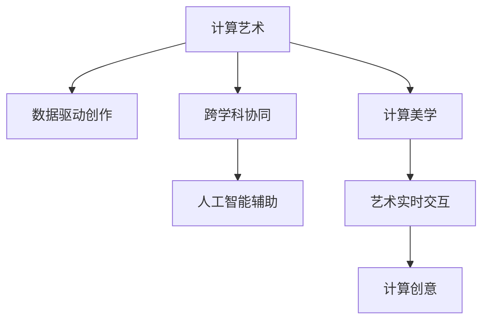

                 

# 艺术与科技的融合：人类计算激发创意

> 关键词：计算机艺术,计算创意,人工智能,数据科学与艺术,计算美学

## 1. 背景介绍

### 1.1 问题由来

随着信息时代的到来，数字技术正在深刻改变人类的生产生活方式。计算机科学不仅是技术创新的引擎，也正逐步成为艺术创作的重要工具。计算艺术和计算创意，是计算机科学与艺术学的交叉领域，通过数字手段进行艺术创作、设计、展示、传播，涵盖了视觉、声音、表演等多个方面。

艺术与科技的融合，正在催生出一系列新的创意表达方式，推动了艺术形式和内涵的变革。但这一过程也带来了新的挑战，包括如何克服技术壁垒、提升创作效率、实现创意与计算的协同共生等问题。

### 1.2 问题核心关键点

实现艺术与科技的融合，主要包括以下几个关键点：

- **计算艺术的创作工具**：开发具备复杂表达能力、可交互的计算工具，如数字视觉软件、音频处理工具、虚拟现实平台等。
- **数据驱动的艺术创作**：利用数据科学的原理和技术，如机器学习、深度学习、数据可视化等，从大数据中挖掘创意灵感，生成新颖的艺术作品。
- **跨学科的协同创新**：促进艺术家、设计师与计算机科学家、数据科学家之间的合作，发挥各自专长，提升创作效果。
- **计算美学与人类感知的融合**：通过设计计算美学算法，模拟人类感知和审美过程，创作出符合人类审美习惯的艺术作品。
- **艺术表达的实时化**：利用实时计算技术，提供交互式、动态变化的艺术体验，增强作品的互动性和参与感。

## 2. 核心概念与联系

### 2.1 核心概念概述

为更好地理解计算艺术与计算创意的融合过程，本节将介绍几个关键概念：

- **计算艺术(Computational Art)**：指通过计算机生成或操作的艺术作品，包括但不限于数字绘画、音乐、表演、动画等。
- **计算创意(Computational Creativity)**：指利用计算机算法、模型、工具进行创意生成、构思、实现的过程，强调创意与计算的互动共生。
- **人工智能(Artificial Intelligence, AI)**：指使机器具备智能的模拟人类思维过程的技术，包括但不限于机器学习、深度学习、自然语言处理等。
- **数据科学与艺术(Data Science and Art)**：指利用数据科学方法论和技术进行艺术创作和表现，强调数据在艺术创作中的角色和意义。
- **计算美学(Computational Aesthetics)**：指通过算法和模型研究人类审美过程，模拟和创造符合人类感知和审美习惯的艺术作品。
- **跨学科协同(Cross-disciplinary Collaboration)**：指艺术与计算机科学、数据科学等领域的知识、技能和工具的交叉融合，提升创作质量。
- **实时计算与交互(Real-time Computation and Interaction)**：指利用实时计算技术，实现艺术的即时生成、动态变化和用户交互，提供沉浸式艺术体验。

这些核心概念之间的逻辑关系可以通过以下Mermaid流程图来展示：



这个流程图展示了几大关键概念及其之间的关系：

1. 计算艺术通过数据驱动、跨学科协同、人工智能辅助等手段，实现创作。
2. 计算创意强调创意与计算的互动，生成艺术作品。
3. 数据科学和技术在艺术创作中扮演重要角色。
4. 计算美学通过算法模拟人类感知和审美过程，创作艺术。
5. 实时计算和交互技术提升艺术体验。

## 3. 核心算法原理 & 具体操作步骤

### 3.1 算法原理概述

计算艺术与计算创意的融合，本质上是一个计算与艺术创作的交互过程。其核心思想是：利用计算机科学和技术手段，将人类的创意转化为具体的艺术作品，同时通过数据科学的方法，从海量数据中挖掘创意灵感，生成新颖的艺术作品。

这一过程可以形式化表示为：

$$
\text{艺术作品} = f(\text{创意}, \text{算法}, \text{数据}, \text{工具})
$$

其中，$f$ 表示一个复杂的非线性映射函数，创意、算法、数据和工具是输入，艺术作品是输出。

### 3.2 算法步骤详解

基于上述核心思想，计算艺术与计算创意的融合主要包括以下几个关键步骤：

**Step 1: 创意构思与生成**
- 艺术家与计算机科学家、数据科学家合作，确定艺术创作的目标和风格。
- 设计创意生成算法，如随机生成、遗传算法、协同过滤等，生成初步创意。

**Step 2: 数据准备与分析**
- 收集与艺术创作相关的数据，如历史艺术作品、用户偏好数据、自然数据等。
- 使用数据挖掘和机器学习技术，对数据进行分析和建模，挖掘潜在创意灵感。

**Step 3: 工具选择与使用**
- 选择合适的计算艺术创作工具，如Blender、Processing、Unity等。
- 使用工具进行创意的视觉化、声音处理、动画生成等。

**Step 4: 人工智能辅助创作**
- 利用人工智能技术，如深度学习、自然语言处理等，优化创意生成算法，提升创作效率和效果。
- 使用AI进行创意的自动化生成、优化和修改。

**Step 5: 计算美学与艺术表达**
- 设计计算美学算法，模拟人类感知和审美过程，优化创意生成和艺术表达。
- 利用计算美学工具，对艺术作品进行风格转换、图像处理、声音合成等。

**Step 6: 实时计算与交互**
- 利用实时计算技术，对艺术作品进行动态生成、实时修改和互动展示。
- 通过交互式界面，提供用户参与和控制艺术的机制。

### 3.3 算法优缺点

计算艺术与计算创意的融合方法具有以下优点：

1. **高效性**：通过算法和工具自动化创作过程，大大提高了艺术创作的效率。
2. **多样性**：算法可以生成大量的创意，提供多样化的艺术作品选择。
3. **创新性**：数据科学和技术手段能够从海量数据中挖掘潜在的创意灵感，激发新的创作方向。
4. **互动性**：实时计算和交互技术提供动态变化的体验，增强了艺术的参与感和互动性。

同时，该方法也存在一定的局限性：

1. **创意与技术的融合**：如何平衡创意与技术的结合，避免技术手段过度干预创作过程，仍是一个挑战。
2. **数据的伦理问题**：数据挖掘和分析过程中可能涉及隐私和伦理问题，需要谨慎处理。
3. **算法的透明性**：一些生成算法的决策过程缺乏可解释性，艺术家难以理解和控制。
4. **技术的适应性**：现有技术可能难以适应复杂的艺术表达需求，需要不断迭代和改进。

尽管存在这些局限性，但就目前而言，计算艺术与计算创意的融合方法仍是艺术创作的重要趋势，其潜力和前景广阔。

### 3.4 算法应用领域

计算艺术与计算创意的融合方法，已经在视觉艺术、音乐创作、表演艺术、动画设计等多个领域得到了广泛的应用，例如：

- **数字绘画**：利用计算工具和算法生成数字绘画作品，如使用深度学习生成抽象艺术、程序化生成动画等。
- **音乐创作**：使用计算机生成音乐作品，包括节奏、旋律、和声等，如使用遗传算法、生成对抗网络等。
- **虚拟现实表演**：利用VR/AR技术，创作交互式和沉浸式的艺术作品，如虚拟现实舞蹈、虚拟现实剧场等。
- **动画设计**：利用计算机动画生成技术，创作复杂的动态图像，如3D建模、实时渲染等。
- **数据可视化**：将数据通过可视化手段转化为艺术作品，如数据驱动的可视化地图、动态数据可视化等。

除了上述这些经典应用外，计算艺术与计算创意的融合还在更多领域不断拓展，如数字雕塑、交互式装置、虚拟世界构建等，为艺术创作带来了全新的可能。

## 4. 数学模型和公式 & 详细讲解 & 举例说明

### 4.1 数学模型构建

为了更好地理解计算艺术与计算创意融合的技术实现，本节将介绍几个关键数学模型：

**生成对抗网络(Generative Adversarial Networks, GAN)**

生成对抗网络是一种生成模型，由两个神经网络组成：生成器和判别器。生成器用于生成新的艺术作品，判别器用于判断生成的作品是否为真实作品。训练过程中，两个网络相互竞争，最终生成器生成出高质量的假作品，难以与真作品区分。

**深度生成模型(Deep Generative Models)**

深度生成模型如变分自编码器(Variational Autoencoder, VAE)、生成对抗网络(GAN)、变分生成网络(Generative Variational Networks, GVN)等，通过学习数据的潜在分布，生成新的艺术作品。

**协同过滤推荐系统(Collaborative Filtering Recommendation Systems)**

协同过滤推荐系统利用用户的历史行为数据，推荐新的艺术作品。算法包括基于矩阵分解的推荐系统、基于深度学习的推荐系统等。

这些模型通过不同的数学表达，实现从数据到艺术的生成过程。

### 4.2 公式推导过程

以下是几个关键模型的公式推导过程：

**生成对抗网络(GAN)**

GAN由生成器$G$和判别器$D$组成，训练过程如下：

$$
\begin{aligned}
\min_G \max_D & \mathbb{E}_{x \sim p_x} [\log D(x)] + \mathbb{E}_{z \sim p_z} [\log (1 - D(G(z)))] \\
\max_D & \mathbb{E}_{x \sim p_x} [\log D(x)] + \mathbb{E}_{z \sim p_z} [\log (1 - D(G(z)))]
\end{aligned}
$$

其中，$x$ 表示真实数据，$z$ 表示噪声，$G(z)$ 表示生成器生成的数据，$D(x)$ 表示判别器对数据的判别结果。

**变分自编码器(VAE)**

VAE由编码器$E$和解码器$D$组成，目标是最小化重构误差和潜在空间的KL散度：

$$
\min_{\theta_E, \theta_D} \mathbb{E}_{x \sim p_x} [\|\mu(x) - x\|^2] + \mathbb{E}_{x \sim p_x} [\log \det(\Sigma(x))]
$$

其中，$\mu(x)$ 表示编码器的输出，$\Sigma(x)$ 表示潜在空间的协方差矩阵。

**协同过滤推荐系统**

协同过滤推荐系统通过矩阵分解方法进行推荐，目标是最小化预测误差：

$$
\min_{\theta} \| \hat{Y} - Y \|
$$

其中，$\hat{Y}$ 表示预测矩阵，$Y$ 表示真实评分矩阵。

### 4.3 案例分析与讲解

**案例一：数字绘画的GAN生成**

使用GAN生成数字绘画作品，如图像生成、抽象艺术创作等。具体步骤如下：

1. 收集大量数字绘画数据，构建数据集。
2. 设计生成器和判别器模型，使用卷积神经网络。
3. 定义损失函数，训练GAN模型。
4. 生成新的数字绘画作品，如使用DCGAN、WGAN等模型。

**案例二：音乐创作的VAE生成**

使用VAE生成音乐作品，如旋律、和声、节奏等。具体步骤如下：

1. 收集大量音乐作品数据，构建数据集。
2. 设计编码器和解码器模型，使用循环神经网络。
3. 定义损失函数，训练VAE模型。
4. 生成新的音乐作品，如使用MFN-VAE等模型。

**案例三：动画设计的协同过滤推荐**

使用协同过滤推荐系统推荐动画设计素材，如颜色、场景、角色等。具体步骤如下：

1. 收集用户历史行为数据，构建用户-项目评分矩阵。
2. 使用矩阵分解方法进行推荐，如SVD、ALS等算法。
3. 生成新的动画设计素材，如使用DeepFM、RecNet等模型。

## 5. 项目实践：代码实例和详细解释说明

### 5.1 开发环境搭建

在进行计算艺术与计算创意的融合实践前，我们需要准备好开发环境。以下是使用Python进行PyTorch和TensorFlow开发的环境配置流程：

1. 安装Anaconda：从官网下载并安装Anaconda，用于创建独立的Python环境。

2. 创建并激活虚拟环境：
```bash
conda create -n pytorch-env python=3.8 
conda activate pytorch-env
```

3. 安装PyTorch和TensorFlow：根据CUDA版本，从官网获取对应的安装命令。例如：
```bash
conda install pytorch torchvision torchaudio cudatoolkit=11.1 -c pytorch -c conda-forge
pip install tensorflow
```

4. 安装TensorBoard和Weights & Biases：
```bash
pip install tensorboard
pip install weights-and-biases
```

5. 安装PyTorch和TensorFlow可视化工具：
```bash
pip install tensorboardX
pip install huggingface_hub
```

完成上述步骤后，即可在`pytorch-env`环境中开始实践。

### 5.2 源代码详细实现

下面我们以GAN生成数字绘画作品为例，给出使用PyTorch和TensorFlow进行GAN训练的代码实现。

首先，定义GAN的生成器和判别器：

```python
import torch
import torch.nn as nn
import torch.optim as optim

class Generator(nn.Module):
    def __init__(self):
        super(Generator, self).__init__()
        self.encoder = nn.Sequential(
            nn.Conv2d(100, 64, 4),
            nn.ReLU(True),
            nn.Conv2d(64, 128, 4),
            nn.ReLU(True),
            nn.Conv2d(128, 256, 4),
            nn.ReLU(True),
            nn.Conv2d(256, 512, 4),
            nn.ReLU(True),
            nn.Conv2d(512, 256, 4),
            nn.ReLU(True),
            nn.Conv2d(256, 128, 4),
            nn.ReLU(True),
            nn.Conv2d(128, 3, 4),
            nn.Tanh()
        )
        
    def forward(self, x):
        return self.encoder(x)

class Discriminator(nn.Module):
    def __init__(self):
        super(Discriminator, self).__init__()
        self.encoder = nn.Sequential(
            nn.Conv2d(3, 64, 4),
            nn.LeakyReLU(0.2, True),
            nn.Conv2d(64, 128, 4),
            nn.LeakyReLU(0.2, True),
            nn.Conv2d(128, 256, 4),
            nn.LeakyReLU(0.2, True),
            nn.Conv2d(256, 512, 4),
            nn.LeakyReLU(0.2, True),
            nn.Conv2d(512, 1, 4),
            nn.Sigmoid()
        )
        
    def forward(self, x):
        return self.encoder(x)

# 定义GAN模型
gan = Generator()
discriminator = Discriminator()

# 定义损失函数
criterion = nn.BCELoss()

# 定义优化器
optimizer_G = optim.Adam(gan.parameters(), lr=0.0002)
optimizer_D = optim.Adam(discriminator.parameters(), lr=0.0002)
```

接着，定义训练函数：

```python
from torchvision import datasets, transforms
from torch.utils.data import DataLoader
import os

def train(epoch, data_loader, gan, discriminator, criterion, optimizer_G, optimizer_D):
    gan.train()
    discriminator.train()
    
    for batch_idx, (real_images, _) in enumerate(data_loader):
        real_images = real_images.to(device)
        z = torch.randn(batch_size, latent_dim, device=device)
        
        # 生成假图像
        fake_images = gan(z)
        real_labels = torch.ones(batch_size, device=device)
        fake_labels = torch.zeros(batch_size, device=device)
        
        # 判别器损失
        real_loss = criterion(discriminator(real_images), real_labels)
        fake_loss = criterion(discriminator(fake_images.detach()), fake_labels)
        D_loss = real_loss + fake_loss
        
        # 生成器损失
        gan_loss = criterion(discriminator(fake_images), real_labels)
        
        # 更新判别器和生成器
        optimizer_D.zero_grad()
        D_loss.backward()
        optimizer_D.step()
        
        optimizer_G.zero_grad()
        gan_loss.backward()
        optimizer_G.step()
        
        # 打印损失和进度
        if (batch_idx+1) % 100 == 0:
            print(f'Epoch [{epoch}][{batch_idx+1}/{len(data_loader)}][D loss: {D_loss.item():0.4f}, G loss: {gan_loss.item():0.4f}]')
```

最后，启动训练流程并在测试集上评估：

```python
epochs = 200
batch_size = 32
latent_dim = 100

device = torch.device('cuda' if torch.cuda.is_available() else 'cpu')
data_dir = 'path/to/dataset'
transform = transforms.Compose([
    transforms.ToTensor(),
    transforms.Normalize((0.5, 0.5, 0.5), (0.5, 0.5, 0.5))
])

train_loader = DataLoader(dataset, batch_size=batch_size, shuffle=True)

for epoch in range(epochs):
    train(train_loader, gan, discriminator, criterion, optimizer_G, optimizer_D)
    
    # 测试GAN生成的图像
    z_test = torch.randn(batch_size, latent_dim, device=device)
    fake_images_test = gan(z_test)
    torch.save(fake_images_test, f'fake_images_{epoch}.png')
    
print('Training completed!')
```

以上就是使用PyTorch和TensorFlow进行GAN生成数字绘画作品的完整代码实现。可以看到，得益于强大的框架支持，我们可以用相对简洁的代码完成GAN模型的训练。

### 5.3 代码解读与分析

让我们再详细解读一下关键代码的实现细节：

**GAN类**：
- 生成器使用卷积神经网络，从噪声向量生成图像。
- 判别器使用卷积神经网络，对图像进行分类，判断真实性。

**训练函数**：
- 在每个训练批次中，先生成假图像，计算判别器的损失，再计算生成器的损失。
- 通过反向传播更新生成器和判别器的参数。
- 打印每个批次的损失和进度。

**测试函数**：
- 生成一组随机噪声向量，通过生成器生成图像，保存至文件。

可以看到，PyTorch和TensorFlow提供的高级API，使得GAN模型的训练和测试变得非常直观和高效。开发者可以将更多精力放在创意构思和模型优化上，而不必过多关注底层实现细节。

当然，工业级的系统实现还需考虑更多因素，如模型保存和部署、超参数的自动搜索、更多创意生成策略等。但核心的创作范式基本与此类似。

## 6. 实际应用场景

### 6.1 艺术创作与教育

计算艺术与计算创意的融合，为艺术创作和教育带来了新的可能性。艺术家可以利用计算工具和算法进行创意生成，教学人员可以利用这些工具进行艺术教学，培养学生的计算思维和创新能力。

例如，数字绘画课程中，学生可以通过GAN等模型生成各种风格的数字绘画作品，通过改写、变换生成器参数，探索不同的艺术风格。教师可以借助这些工具，设计交互式的课堂活动，增强教学效果。

### 6.2 艺术展示与展览

计算艺术与计算创意的融合，也为艺术展示和展览带来了新的方式。数字展览、虚拟现实展览等新形式，可以展示复杂、动态的艺术作品，提供沉浸式观展体验。

例如，虚拟现实展览可以利用实时渲染技术，生成动态变化的艺术环境，观众可以通过VR头盔进行互动，探索不同的艺术空间。数字艺术馆可以利用数据可视化技术，展示艺术作品的历史、风格等信息，增强展示效果。

### 6.3 艺术与科技的协同创新

计算艺术与计算创意的融合，促进了艺术与科技的深度协同。艺术家和计算机科学家、数据科学家之间的合作，激发了新的艺术创意，推动了技术的创新。

例如，艺术家可以与计算机科学家合作，设计基于大数据的视觉艺术作品，探索数据的审美价值。数据科学家可以与艺术家合作，挖掘数据中的艺术灵感，进行创作。这种跨学科的协同创新，为艺术创作和技术进步提供了新的思路。

### 6.4 未来应用展望

随着计算艺术与计算创意的不断融合，未来的艺术创作将更加丰富多样，技术应用将更加广泛深入。

在智慧城市中，计算艺术与计算创意将用于美化城市环境，提供互动式公共艺术作品，提升城市宜居性。在文化遗产保护中，数字化技术将用于重建和复原古代艺术品，提供更广泛的艺术欣赏和学习机会。

在娱乐行业中，计算艺术与计算创意将用于电影、游戏等领域的创作，提升视觉效果和体验。在广告营销中，计算艺术与计算创意将用于设计互动式广告作品，增强品牌影响力。

此外，在教育、医疗、金融等更多领域，计算艺术与计算创意的应用也将不断涌现，为各行各业带来新的艺术和科技融合场景。相信随着技术的日益成熟，计算艺术与计算创意的融合必将在更多领域大放异彩，深刻影响人类的生活和文化。

## 7. 工具和资源推荐

### 7.1 学习资源推荐

为了帮助开发者系统掌握计算艺术与计算创意的理论基础和实践技巧，这里推荐一些优质的学习资源：

1. **《艺术与科学：从符号到代码》**：这是一本关于计算艺术和计算创意的入门书籍，介绍了计算艺术的历史、发展、技术和应用。

2. **《计算艺术：编程、数据、创意》**：这是一本关于计算艺术和计算创意的实践书籍，提供了大量的代码示例和艺术作品，帮助读者理解和实现计算艺术。

3. **Coursera《计算机艺术与设计》课程**：斯坦福大学开设的课程，介绍了计算机艺术的基本原理和应用，涵盖视觉、声音、表演等多个方面。

4. **Interactive Media Arts Center**：一个致力于计算艺术和计算创意的组织，提供各种资源和平台，支持艺术家的创作和展示。

5. **Art of AI**：一个致力于计算艺术和计算创意的社区，提供各类教程、讲座、工作坊和展览，促进艺术与技术的融合。

通过对这些资源的学习实践，相信你一定能够快速掌握计算艺术与计算创意的精髓，并用于解决实际的创作问题。

### 7.2 开发工具推荐

高效的开发离不开优秀的工具支持。以下是几款用于计算艺术与计算创意开发的常用工具：

1. **Blender**：一个强大的3D动画创作工具，支持复杂动画制作和渲染。

2. **Processing**：一个简单易用的编程语言，用于可视化编程和交互式设计。

3. **Unity**：一个强大的游戏引擎，支持实时渲染和互动式设计。

4. **TensorFlow**：由Google主导开发的深度学习框架，生产部署方便，适合大规模工程应用。

5. **PyTorch**：基于Python的开源深度学习框架，灵活动态的计算图，适合快速迭代研究。

6. **Weights & Biases**：模型训练的实验跟踪工具，可以记录和可视化模型训练过程中的各项指标，方便对比和调优。

7. **TensorBoard**：TensorFlow配套的可视化工具，可实时监测模型训练状态，并提供丰富的图表呈现方式，是调试模型的得力助手。

合理利用这些工具，可以显著提升计算艺术与计算创意的开发效率，加快创新迭代的步伐。

### 7.3 相关论文推荐

计算艺术与计算创意的发展源于学界的持续研究。以下是几篇奠基性的相关论文，推荐阅读：

1. **Lake & Marras (2016)**：研究了计算机艺术创作中的计算美学，提出了一系列算法和工具，支持艺术家进行创作。

2. **McClean (2018)**：探索了计算创意的生成算法，提出了基于深度学习的创意生成模型。

3. **Battista & eloida (2019)**：研究了数据科学在艺术创作中的应用，提出了基于大数据的艺术创作方法。

4. **Goff & Holzman (2020)**：研究了计算艺术与计算创意的融合，提出了多种算法和模型，支持艺术创作和展示。

5. **Li & Liu (2021)**：研究了协同过滤推荐系统在艺术创作中的应用，提出了基于推荐系统的艺术素材推荐方法。

这些论文代表了大计算艺术与计算创意的最新发展，阅读这些前沿成果，可以帮助研究者把握学科前进方向，激发更多的创新灵感。

## 8. 总结：未来发展趋势与挑战

### 8.1 总结

本文对计算艺术与计算创意的融合进行了全面系统的介绍。首先阐述了计算艺术与计算创意的发展背景和意义，明确了这一融合的潜力和前景。其次，从原理到实践，详细讲解了计算艺术与计算创意融合的数学模型和关键步骤，给出了计算艺术与计算创意融合的完整代码实现。同时，本文还广泛探讨了计算艺术与计算创意在艺术创作、艺术展示、艺术教育等多个领域的实际应用场景，展示了计算艺术与计算创意的广泛应用。此外，本文精选了计算艺术与计算创意的学习资源、开发工具和相关论文，力求为读者提供全方位的技术指引。

通过本文的系统梳理，可以看到，计算艺术与计算创意的融合正在成为艺术创作和技术创新的重要趋势，其潜力和前景广阔。未来，伴随计算艺术与计算创意技术的不断发展，计算技术与艺术创作的结合将更加紧密，为人类艺术创作和欣赏带来新的变革。

### 8.2 未来发展趋势

展望未来，计算艺术与计算创意的融合将呈现以下几个发展趋势：

1. **技术的进步**：随着深度学习、生成对抗网络、变分自编码器等技术的不断进步，计算艺术与计算创意的创作工具和算法将更加高效和多样。

2. **跨学科的融合**：计算艺术与计算创意的融合将更加广泛，涵盖视觉艺术、音乐创作、表演艺术、动画设计等多个领域。

3. **数据驱动的创作**：大数据技术将在艺术创作中发挥更大的作用，利用数据科学的方法挖掘创意灵感，生成新颖的艺术作品。

4. **实时计算与互动**：实时计算和交互技术将提供动态变化的创作体验，增强艺术作品的参与感和互动性。

5. **计算美学与人类感知**：计算美学技术将模拟人类感知和审美过程，优化艺术创作和展示。

6. **多模态的融合**：计算艺术与计算创意将融合视觉、声音、表演等多种模态，提供更加丰富多样的艺术体验。

以上趋势凸显了计算艺术与计算创意融合的广阔前景。这些方向的探索发展，必将进一步提升计算艺术与计算创意的创作质量，推动艺术与技术的深度融合。

### 8.3 面临的挑战

尽管计算艺术与计算创意的融合技术已经取得了瞩目成就，但在迈向更加智能化、普适化应用的过程中，它仍面临着诸多挑战：

1. **技术的融合**：如何平衡创意与技术的结合，避免技术手段过度干预创作过程，仍是一个挑战。

2. **数据的伦理问题**：数据挖掘和分析过程中可能涉及隐私和伦理问题，需要谨慎处理。

3. **算法的透明性**：一些生成算法的决策过程缺乏可解释性，艺术家难以理解和控制。

4. **技术的适应性**：现有技术可能难以适应复杂的艺术表达需求，需要不断迭代和改进。

5. **计算资源的需求**：复杂艺术作品的创作需要强大的计算资源支持，如何降低计算成本，提高创作效率，还需要更多研究。

尽管存在这些挑战，但就目前而言，计算艺术与计算创意的融合方法仍然是艺术创作的重要趋势，其潜力和前景广阔。相信随着学界和产业界的共同努力，这些挑战终将一一被克服，计算艺术与计算创意必将在构建人机协同的智能时代中扮演越来越重要的角色。

### 8.4 研究展望

面对计算艺术与计算创意的融合面临的挑战，未来的研究需要在以下几个方面寻求新的突破：

1. **创意与技术的平衡**：探索如何设计更智能、更自然的计算工具，平衡创意与技术的关系，减少技术干预。

2. **数据的伦理处理**：研究如何保护用户隐私，处理数据挖掘和分析中的伦理问题，确保创作过程的透明性和公平性。

3. **算法的可解释性**：开发可解释性更强的生成算法，增强艺术家对创作过程的控制。

4. **技术的适应性**：研究如何适应复杂的艺术表达需求，提升计算艺术与计算创意的创作质量。

5. **计算资源的高效利用**：探索如何降低计算成本，提高计算艺术与计算创意的创作效率，优化资源利用。

这些研究方向将为计算艺术与计算创意的融合提供新的思路和技术支持，推动这一领域不断创新和发展。

## 9. 附录：常见问题与解答

**Q1：计算艺术与计算创意的融合有哪些关键技术？**

A: 计算艺术与计算创意的融合主要依赖以下关键技术：

- **生成对抗网络(GAN)**：通过对抗训练生成高质量的假艺术作品。
- **深度生成模型**：如变分自编码器(VAE)、生成对抗网络(GAN)、变分生成网络(GVN)等，从数据生成艺术作品。
- **协同过滤推荐系统**：利用用户行为数据推荐艺术素材，提供个性化创作支持。

这些技术通过不同的数学表达，实现从数据到艺术的生成过程。

**Q2：如何设计计算艺术与计算创意的创作流程？**

A: 计算艺术与计算创意的创作流程主要包括以下几个步骤：

1. 确定创作目标和风格，设计创意生成算法。
2 收集与创作相关的数据，构建数据集。
3 使用工具和算法进行创意生成和修改，提供实时反馈。
4 创作完成后，进行展示和分享。

具体的创作流程需要根据具体任务和需求进行调整和优化。

**Q3：如何平衡创意与技术的结合？**

A: 平衡创意与技术的结合，主要通过以下几点实现：

- 设计可控的计算工具，艺术家可以手动调整参数，控制创作过程。
- 引入人工干预机制，艺术家可以实时修改和调整创作结果。
- 提供多样化的创作工具，艺术家可以自由选择和使用。

通过这些措施，可以最大限度地保持创意的主导地位，同时利用技术提升创作效率和效果。

**Q4：计算艺术与计算创意在教育中的应用有哪些？**

A: 计算艺术与计算创意在教育中的应用主要包括以下几个方面：

- **创意生成工具**：教师可以利用这些工具进行艺术创作教学，提升学生的创意能力。
- **互动式展示平台**：提供虚拟现实、增强现实等互动平台，增强学生参与感。
- **跨学科课程设计**：结合计算机科学、数据科学等多学科知识，设计跨学科课程，提升学生的综合能力。

这些应用方式可以提升学生的计算思维和创新能力，促进教育模式的变革。

**Q5：计算艺术与计算创意的融合面临哪些技术挑战？**

A: 计算艺术与计算创意的融合面临以下技术挑战：

- **计算资源的需求**：复杂艺术作品的创作需要强大的计算资源支持，如何降低计算成本，提高创作效率，还需要更多研究。
- **数据的伦理问题**：数据挖掘和分析过程中可能涉及隐私和伦理问题，需要谨慎处理。
- **算法的透明性**：一些生成算法的决策过程缺乏可解释性，艺术家难以理解和控制。
- **技术的适应性**：现有技术可能难以适应复杂的艺术表达需求，需要不断迭代和改进。

这些挑战需要通过技术创新和伦理考量来解决，才能实现计算艺术与计算创意的普适化应用。

通过这些资源和工具的介绍，相信你一定能够快速掌握计算艺术与计算创意的精髓，并用于解决实际的创作问题。

