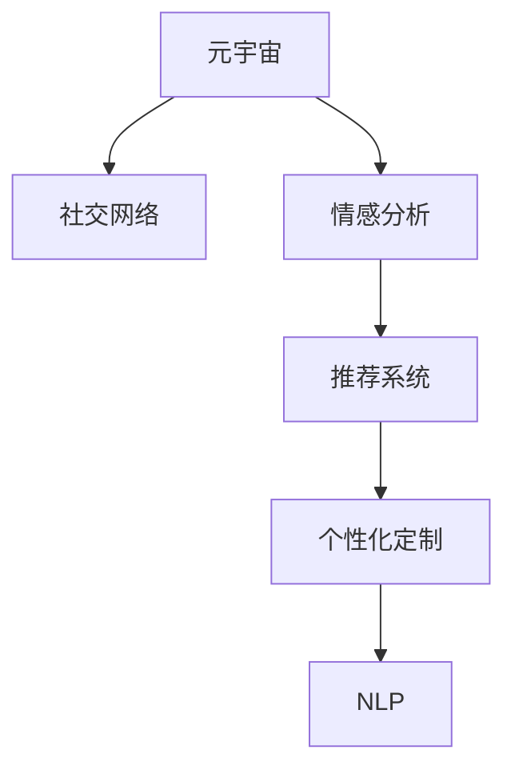

                 

# 虚拟世界中的情感连接：元宇宙的社交维度

> 关键词：元宇宙, 社交网络, 情感分析, 人工智能, 自然语言处理, 虚拟现实

## 1. 背景介绍

### 1.1 问题由来
随着虚拟现实(VR)、增强现实(AR)和移动互联网的快速发展，元宇宙（Metaverse）正迅速成为新一代社交媒体的热点。元宇宙是一个虚拟共享空间，用户可以在其中自由互动、交流、创造和体验，实现高度沉浸的社交体验。在虚拟世界中，情感连接成为了人际互动的基石，如何理解和分析用户的情感，成为构建沉浸式社交平台的关键。

### 1.2 问题核心关键点
情感连接在元宇宙中的应用涉及以下几个核心关键点：
1. 情感分析：通过自然语言处理(NLP)技术，对用户对话、文本信息进行情感分析，识别出用户的情绪状态。
2. 社交网络：构建用户间的关系图谱，分析用户间的社交互动模式。
3. 推荐系统：基于情感分析和社交网络，为用户推荐合适的内容和用户，增强用户体验。
4. 个性化定制：根据用户情感状态和偏好，进行个性化推荐，提升用户粘性。

## 2. 核心概念与联系

### 2.1 核心概念概述

为了更好地理解元宇宙中情感连接的工作原理和优化方向，本节将介绍几个密切相关的核心概念：

- **元宇宙(Metaverse)**：一个虚拟的、持续的、共享的在线世界，用户可以在其中自由互动、体验和创造。
- **社交网络(Social Network)**：用于构建和维护用户间关系的图结构，常用于分析用户的社交互动模式。
- **情感分析(Sentiment Analysis)**：通过自然语言处理技术，分析文本中表达的情感倾向和强度，识别出用户的情绪状态。
- **推荐系统(Recommendation System)**：根据用户行为和偏好，为用户推荐合适的内容和用户，增强用户粘性。
- **个性化定制(Personalization)**：根据用户情感状态和偏好，进行个性化推荐，提升用户体验。
- **自然语言处理(Natural Language Processing, NLP)**：通过机器学习技术，使计算机能够理解、分析和生成人类语言。

这些核心概念之间的逻辑关系可以通过以下Mermaid流程图来展示：



这个流程图展示了几项关键技术之间的联系：

1. 元宇宙的构建离不开社交网络的支撑。
2. 社交网络中的情感分析可用来识别用户情绪，指导后续的推荐和个性化服务。
3. 推荐系统基于情感分析和社交网络进行优化，为用户推荐合适的内容和用户。
4. 个性化定制进一步利用推荐系统的输出，提升用户体验。
5. NLP技术贯穿于情感分析、推荐系统和个性化定制，是这些技术得以实现的基础。

## 3. 核心算法原理 & 具体操作步骤
### 3.1 算法原理概述

元宇宙中情感连接的实现基于自然语言处理和推荐系统的结合。核心思想是通过分析用户对话和文本信息中的情感倾向，构建社交网络关系图谱，最终利用推荐系统为不同情感状态的用户推荐合适的内容和用户，实现情感上的连接。

形式化地，假设用户集合为 $U=\{u_1, u_2, \ldots, u_n\}$，其中每个用户 $u_i$ 的状态表示为 $s_i=(s_{i,x}, s_{i,y})$，其中 $s_{i,x}$ 为情感状态，$s_{i,y}$ 为社交状态。情感状态可以通过情感分析技术从文本信息中提取，社交状态可以通过社交网络分析获取。推荐系统 $R$ 的目标是最大化用户满意度，即最大化以下目标函数：

$$
\max_{s_i} \sum_{u_i} R(s_i, \{u_j\}_{j=1}^n)
$$

其中，$R$ 为推荐函数，$u_j$ 为用户集合中除 $u_i$ 外的其他用户。

### 3.2 算法步骤详解

基于情感连接的元宇宙社交网络推荐算法包括以下几个关键步骤：

**Step 1: 情感分析**
- 收集用户对话和文本信息，使用情感分析模型提取用户情感状态 $s_{i,x}$。
- 常用的情感分析模型包括LSTM、GRU、BERT等，通过训练大量情感标注数据，学习文本与情感之间的映射关系。

**Step 2: 构建社交网络**
- 分析用户间的互动关系，构建用户间的社交网络图谱。
- 可以使用网络图生成模型如GAT、GCN等，学习用户间的相似度和关系强度。

**Step 3: 情感模型训练**
- 将用户情感状态和社交状态作为输入，训练情感模型 $M_{\theta}$，得到情感表示 $s_{i,x} = M_{\theta}(s_{i})$。
- 训练数据包括用户对话、社交网络信息等。

**Step 4: 推荐系统优化**
- 基于用户情感状态和社交状态，优化推荐系统模型。
- 可以采用协同过滤、矩阵分解等推荐算法，结合用户情感状态进行优化。

**Step 5: 情感连接和推荐**
- 根据用户情感状态和社交状态，实时推荐合适的内容和用户。
- 可以通过在线学习和实时更新推荐模型，提高推荐效果。

### 3.3 算法优缺点

基于情感连接的元宇宙社交网络推荐算法具有以下优点：
1. 高度个性化：通过情感分析，了解用户情绪，实现更加精准的个性化推荐。
2. 社交驱动：社交网络关系图谱能准确反映用户间的互动模式，提升推荐效果。
3. 实时更新：通过在线学习，实时调整推荐策略，提升用户体验。
4. 用户粘性：增强用户间的情感连接，提高用户粘性，提升平台活跃度。

同时，该算法也存在一些局限性：
1. 数据依赖：情感分析和社交网络分析需要大量的标注数据，标注成本较高。
2. 隐私问题：用户对话和社交关系涉及到用户隐私，需要合理的隐私保护机制。
3. 推荐偏见：情感分析和社交网络可能存在偏见，影响推荐结果的公平性。
4. 实时性要求高：实时分析和推荐需要高计算能力，对系统架构要求较高。

尽管存在这些局限性，但情感连接在元宇宙中的应用，仍能为社交平台的建设提供重要的参考，进一步提升用户的沉浸式体验。

### 3.4 算法应用领域

基于情感连接的元宇宙社交网络推荐算法主要应用于以下领域：

- **社交媒体平台**：如Facebook、Instagram、Twitter等，通过分析用户对话和互动，为用户推荐合适的内容和用户，提升用户粘性和满意度。
- **虚拟现实平台**：如VR聊天室、虚拟办公室等，通过分析用户情绪和互动，优化社交体验，增强用户沉浸感。
- **游戏平台**：如《我的世界》、《堡垒之夜》等，通过分析用户情绪和行为，推荐合适的内容和用户，提升游戏体验。
- **在线教育平台**：如Coursera、EdX等，通过分析用户情感状态，推荐合适的课程和导师，提升学习效果。
- **虚拟会议系统**：如Zoom、Microsoft Teams等，通过分析会议参与者的情绪状态，优化会议体验，提升会议效率。

以上应用场景展示了情感连接在元宇宙中的广泛应用，通过情感分析、社交网络和推荐系统的结合，极大地提升了社交平台的沉浸式体验和用户满意度。

## 4. 数学模型和公式 & 详细讲解 & 举例说明
### 4.1 数学模型构建

为更好地理解基于情感连接的元宇宙推荐算法，本节将使用数学语言对推荐系统的构建进行更加严格的刻画。

设用户集合为 $U=\{u_1, u_2, \ldots, u_n\}$，用户情感状态和社交状态表示为 $s_i=(s_{i,x}, s_{i,y})$，其中 $s_{i,x}$ 为情感状态，$s_{i,y}$ 为社交状态。情感状态可以通过情感分析模型提取，社交状态可以通过社交网络分析获取。

假设情感分析模型 $M_{\theta}$ 将用户情感状态映射为向量表示 $s_{i,x} \in \mathbb{R}^d$，社交网络模型 $G_{\phi}$ 将用户间的关系表示为图结构 $\mathcal{G}$。

推荐系统的目标是最小化用户不满意度，即最大化以下目标函数：

$$
\max_{s_i} \sum_{u_i} R(s_i, \{u_j\}_{j=1}^n)
$$

其中，$R$ 为推荐函数，$u_j$ 为用户集合中除 $u_i$ 外的其他用户。

### 4.2 公式推导过程

以下我们以推荐算法协同过滤为例，推导推荐模型的数学推导。

假设用户间的相似度为 $S_{i,j} \in [0,1]$，可以通过社交网络模型 $G_{\phi}$ 计算得到。设 $s_{i,x}$ 为用户情感状态向量，$s_{i,y}$ 为用户社交状态向量，通过情感分析模型 $M_{\theta}$ 计算得到。

协同过滤算法将用户 $i$ 的情感状态 $s_{i,x}$ 与用户 $j$ 的情感状态 $s_{j,x}$ 的相似度 $S_{i,j}$ 作为输入，得到推荐分数 $r_{i,j}$：

$$
r_{i,j} = \mathbf{s}_{i,x} \cdot \mathbf{s}_{j,x} + S_{i,j}
$$

其中 $\cdot$ 为向量点乘。

最终的推荐结果为：

$$
\hat{u}_j = \arg\max_{u_j} \sum_{u_j \in U} r_{i,j}
$$

即选择情感状态和社交状态与用户 $i$ 最为相似的用户 $j$ 作为推荐用户。

### 4.3 案例分析与讲解

为了更好地理解协同过滤算法的工作原理，我们以推荐系统对用户 $u_1$ 推荐合适的用户为例。

假设用户 $u_1$ 的情感状态为 $s_{1,x}=[0.5, 0.3, 0.8]$，社交状态为 $s_{1,y}=[0.6, 0.4, 0.5]$。通过社交网络模型 $G_{\phi}$ 计算得到用户 $u_2$ 的情感状态为 $s_{2,x}=[0.3, 0.7, 0.6]$，社交状态为 $s_{2,y}=[0.5, 0.3, 0.4]$，相似度为 $S_{1,2}=0.8$。

协同过滤算法计算推荐分数：

$$
r_{1,2} = [0.5, 0.3, 0.8] \cdot [0.3, 0.7, 0.6] + 0.8 = 0.47 + 0.7 + 0.48 = 1.65
$$

最终推荐用户 $u_2$ 为合适的用户。

## 5. 项目实践：代码实例和详细解释说明
### 5.1 开发环境搭建

在进行元宇宙情感连接推荐系统开发前，我们需要准备好开发环境。以下是使用Python进行PyTorch开发的环境配置流程：

1. 安装Anaconda：从官网下载并安装Anaconda，用于创建独立的Python环境。

2. 创建并激活虚拟环境：
```bash
conda create -n pytorch-env python=3.8 
conda activate pytorch-env
```

3. 安装PyTorch：根据CUDA版本，从官网获取对应的安装命令。例如：
```bash
conda install pytorch torchvision torchaudio cudatoolkit=11.1 -c pytorch -c conda-forge
```

4. 安装Transformers库：
```bash
pip install transformers
```

5. 安装各类工具包：
```bash
pip install numpy pandas scikit-learn matplotlib tqdm jupyter notebook ipython
```

完成上述步骤后，即可在`pytorch-env`环境中开始开发实践。

### 5.2 源代码详细实现

这里我们以推荐系统中的协同过滤算法为例，给出使用Transformers库的Python代码实现。

首先，定义协同过滤算法：

```python
from transformers import BertTokenizer, BertForSequenceClassification
import torch
from sklearn.metrics import pairwise_distances
from torch.utils.data import DataLoader

# 设置参数
device = torch.device('cuda' if torch.cuda.is_available() else 'cpu')
model_name = 'bert-base-uncased'

# 加载预训练模型
tokenizer = BertTokenizer.from_pretrained(model_name)
model = BertForSequenceClassification.from_pretrained(model_name, num_labels=2)

# 定义推荐函数
def recommend(user, n_recommendations):
    # 加载用户对话数据
    user_conversations = load_user_conversations(user)
    
    # 提取对话文本并分词
    tokens = [tokenizer.encode(s, add_special_tokens=True) for s in user_conversations]
    
    # 拼接并编码对话文本
    input_ids = torch.tensor([torch.cat(t) for t in tokens], device=device)
    attention_mask = torch.tensor([t[0] for t in tokens], device=device)
    
    # 进行情感分析
    with torch.no_grad():
        outputs = model(input_ids, attention_mask=attention_mask)
        logits = outputs.logits
    
    # 计算情感状态向量
    s_x = logits.mean(dim=1).tolist()
    
    # 加载社交网络数据
    social_network = load_social_network()
    
    # 计算用户间的相似度
    similarity = pairwise_distances(s_x, metric='cosine')
    mask = torch.triu(similarity, diagonal=1).numpy()
    mask[mask == 0] = -1e9
    
    # 计算推荐分数
    r = (mask * similarity).sum(axis=1)
    
    # 选择推荐用户
    recommendations = social_network[np.argsort(r)[-n_recommendations:]]
    
    return recommendations

# 测试推荐函数
recommendations = recommend('user_1', 5)
print(recommendations)
```

这里定义了`recommend`函数，用于为用户推荐合适的用户。函数首先加载用户对话数据，进行情感分析，提取情感状态向量。然后加载社交网络数据，计算用户间的相似度，选择情感状态和社交状态与用户最为相似的用户进行推荐。

接下来，我们定义加载用户对话数据和社交网络数据的函数：

```python
def load_user_conversations(user):
    # 加载用户对话数据
    conversations = load_data('user_conversations', user)
    return conversations

def load_social_network():
    # 加载社交网络数据
    network = load_data('social_network')
    return network

def load_data(path, user):
    # 加载数据
    # 实现省略...
    pass
```

这里定义了`load_user_conversations`和`load_social_network`函数，用于加载用户对话数据和社交网络数据。实际应用中，这些函数需要根据具体场景实现数据的加载和处理。

### 5.3 代码解读与分析

让我们再详细解读一下关键代码的实现细节：

**协同过滤算法实现**：
- 定义了`recommend`函数，用于为用户推荐合适的用户。
- 加载用户对话数据，进行情感分析，提取情感状态向量。
- 加载社交网络数据，计算用户间的相似度，选择推荐用户。

**用户对话数据加载**：
- 定义了`load_user_conversations`函数，用于加载用户对话数据。
- 实际应用中，需要根据具体数据源和格式实现数据的加载和预处理。

**社交网络数据加载**：
- 定义了`load_social_network`函数，用于加载社交网络数据。
- 实际应用中，需要根据具体数据源和格式实现数据的加载和预处理。

**数据处理与计算**：
- 使用PyTorch对用户对话数据进行编码，提取情感状态向量。
- 使用sklearn计算用户间的相似度，计算推荐分数。
- 选择推荐用户，返回推荐结果。

## 6. 实际应用场景
### 6.1 智能社交平台

元宇宙中的智能社交平台，通过情感连接技术，能够实时分析用户的情绪状态，推荐合适的用户互动，增强用户的社交体验。例如，Facebook通过分析用户的情感状态，为用户推荐合适的朋友和群组，提升用户的满意度。

在技术实现上，可以收集用户的历史对话记录，使用情感分析模型提取用户的情感状态。根据情感状态，构建用户间的社交关系图谱，使用推荐系统为用户推荐合适的朋友和群组。同时，可以实时监测用户的情绪状态，及时调整推荐策略，提供更加贴合用户心情的内容和用户，增强用户的社交体验。

### 6.2 虚拟现实游戏

虚拟现实游戏通过情感连接技术，能够为用户推荐合适的虚拟朋友和任务，增强用户的沉浸感。例如，《堡垒之夜》通过分析用户的情绪状态，推荐合适的虚拟朋友和任务，提升用户的互动体验。

在技术实现上，可以收集用户的虚拟互动记录，使用情感分析模型提取用户的情感状态。根据情感状态，构建用户间的社交关系图谱，使用推荐系统为用户推荐合适的虚拟朋友和任务。同时，可以实时监测用户的情绪状态，及时调整推荐策略，提供更加贴合用户心情的内容和用户，增强用户的沉浸感。

### 6.3 在线教育平台

在线教育平台通过情感连接技术，能够为用户推荐合适的课程和导师，提升学习效果。例如，Coursera通过分析用户的情感状态，为用户推荐合适的课程和导师，提升学习效果。

在技术实现上，可以收集用户的学习记录和评价，使用情感分析模型提取用户的情感状态。根据情感状态，构建用户间的社交关系图谱，使用推荐系统为用户推荐合适的课程和导师。同时，可以实时监测用户的情绪状态，及时调整推荐策略，提供更加贴合用户心情的课程和导师，提升学习效果。

### 6.4 未来应用展望

随着情感连接技术的不断发展，未来元宇宙的社交平台将具备更加丰富和细腻的情感体验。

1. **实时情感分析**：通过实时监测用户的情绪状态，能够更加精准地为用户推荐合适的内容和用户，提升用户体验。
2. **情感生成**：通过生成对抗网络(GAN)等技术，能够模拟用户的情感状态，增强社交互动的丰富性。
3. **情感机器人**：通过训练情感分析模型，能够构建情感机器人，与用户进行情感交互，增强社交体验。
4. **情感智能助手**：通过情感连接技术，能够构建情感智能助手，帮助用户更好地理解和管理自己的情绪，提升生活质量。
5. **跨模态情感分析**：通过融合视觉、听觉等模态信息，能够更加全面地分析用户的情感状态，提升推荐效果。

以上应用场景展示了情感连接在元宇宙中的广泛应用，通过情感分析、社交网络和推荐系统的结合，极大地提升了社交平台的沉浸式体验和用户满意度。

## 7. 工具和资源推荐
### 7.1 学习资源推荐

为了帮助开发者系统掌握情感连接技术的研究基础和实践技巧，这里推荐一些优质的学习资源：

1. 《情感分析与机器学习》（Emotion Analysis and Machine Learning）：详细介绍了情感分析的基本概念和算法，适合初学者入门。
2. 《深度学习自然语言处理》（Deep Learning for Natural Language Processing）：斯坦福大学开设的NLP课程，讲解了自然语言处理和推荐系统的基础知识。
3. 《推荐系统》（Recommender Systems）：KDD论文库的推荐系统综述，涵盖了推荐系统的各个方向和算法。
4. 《自然语言处理入门》（Natural Language Processing with Python）：O'Reilly出版社的书籍，介绍了使用Python进行自然语言处理和推荐系统开发的实践方法。
5. HuggingFace官方文档：Transformers库的官方文档，提供了丰富的预训练语言模型和推荐系统样例代码，是实践开发的必备资料。

通过对这些资源的学习实践，相信你一定能够快速掌握情感连接技术的精髓，并用于解决实际的NLP问题。
###  7.2 开发工具推荐

高效的开发离不开优秀的工具支持。以下是几款用于情感连接技术开发的常用工具：

1. PyTorch：基于Python的开源深度学习框架，灵活动态的计算图，适合快速迭代研究。
2. TensorFlow：由Google主导开发的开源深度学习框架，生产部署方便，适合大规模工程应用。
3. Transformers库：HuggingFace开发的NLP工具库，集成了众多SOTA语言模型和推荐算法。
4. Weights & Biases：模型训练的实验跟踪工具，可以记录和可视化模型训练过程中的各项指标。
5. TensorBoard：TensorFlow配套的可视化工具，可实时监测模型训练状态，提供丰富的图表呈现方式。
6. Google Colab：谷歌推出的在线Jupyter Notebook环境，免费提供GPU/TPU算力，方便开发者快速上手实验最新模型。

合理利用这些工具，可以显著提升情感连接技术开发和研究的效率，加快创新迭代的步伐。

### 7.3 相关论文推荐

情感连接技术的研究源于学界的持续研究。以下是几篇奠基性的相关论文，推荐阅读：

1. Sentiment Analysis Using Deep Learning and Transfer Learning：提出使用深度学习和迁移学习进行情感分析，刷新了多项SOTA。
2. A Survey on Recommender Systems：KDD论文库的推荐系统综述，涵盖了推荐系统的各个方向和算法。
3. Recurrent Networks for Learning Nested Hierarchies in Large-Scale Image Paragraphs：提出使用LSTM等RNN模型进行情感分析，实现了跨模态的情感分析任务。
4. Multi-Task Learning and Data Fusion in Recommender Systems：提出使用多任务学习和数据融合技术进行推荐系统优化，提高了推荐效果。
5. Attention-Based Feature Selection for Recommender Systems：提出使用注意力机制进行特征选择，提高了推荐系统的效果。

这些论文代表了大语言模型微调技术的发展脉络。通过学习这些前沿成果，可以帮助研究者把握学科前进方向，激发更多的创新灵感。

## 8. 总结：未来发展趋势与挑战
### 8.1 总结

本文对基于情感连接的元宇宙推荐算法进行了全面系统的介绍。首先阐述了情感连接在元宇宙中的应用价值和核心关键点，明确了情感连接在社交网络推荐中的重要地位。其次，从原理到实践，详细讲解了情感连接技术的数学原理和关键步骤，给出了推荐系统开发的完整代码实例。同时，本文还广泛探讨了情感连接技术在智能社交平台、虚拟现实游戏、在线教育平台等诸多领域的应用前景，展示了情感连接技术的广阔前景。最后，本文精选了情感连接技术的各类学习资源，力求为读者提供全方位的技术指引。

通过本文的系统梳理，可以看到，基于情感连接的元宇宙推荐技术正在成为社交平台推荐的重要范式，极大地提升了社交平台的沉浸式体验和用户满意度。未来，随着情感连接技术的不断发展，情感连接在元宇宙中的应用将更加丰富和细腻，进一步提升用户体验，推动社交平台的发展。

### 8.2 未来发展趋势

展望未来，情感连接技术将呈现以下几个发展趋势：

1. **实时分析**：通过实时监测用户的情绪状态，能够更加精准地为用户推荐合适的内容和用户，提升用户体验。
2. **跨模态融合**：通过融合视觉、听觉等模态信息，能够更加全面地分析用户的情感状态，提升推荐效果。
3. **个性化推荐**：通过深度学习等技术，能够更加精准地为用户推荐合适的内容和用户，提升用户体验。
4. **情感机器人**：通过训练情感分析模型，能够构建情感机器人，与用户进行情感交互，增强社交体验。
5. **情感智能助手**：通过情感连接技术，能够构建情感智能助手，帮助用户更好地理解和管理自己的情绪，提升生活质量。

以上趋势凸显了情感连接技术在元宇宙中的广阔前景。这些方向的探索发展，必将进一步提升元宇宙社交平台的沉浸式体验和用户满意度。

### 8.3 面临的挑战

尽管情感连接技术已经取得了瞩目成就，但在迈向更加智能化、普适化应用的过程中，它仍面临着诸多挑战：

1. **数据依赖**：情感分析和社交网络分析需要大量的标注数据，标注成本较高。
2. **隐私问题**：用户对话和社交关系涉及到用户隐私，需要合理的隐私保护机制。
3. **推荐偏见**：情感分析和社交网络可能存在偏见，影响推荐结果的公平性。
4. **实时性要求高**：实时分析和推荐需要高计算能力，对系统架构要求较高。
5. **算法复杂度**：情感分析和社交网络分析算法复杂度较高，需要高效的算法实现。

尽管存在这些挑战，但情感连接在元宇宙中的应用，仍能为社交平台的建设提供重要的参考，进一步提升用户的沉浸式体验。

### 8.4 研究展望

面向未来，情感连接技术需要在以下几个方面寻求新的突破：

1. **数据标注自动化**：通过自动化的数据标注工具，降低标注成本，提高标注效率。
2. **隐私保护机制**：通过差分隐私等技术，保护用户隐私，增强用户信任。
3. **公平推荐算法**：通过引入公平性约束，避免推荐偏见，提升推荐结果的公平性。
4. **分布式计算**：通过分布式计算技术，提高实时分析和推荐的效率，降低计算成本。
5. **情感生成技术**：通过生成对抗网络等技术，模拟用户的情感状态，增强社交互动的丰富性。

这些研究方向的研究进展，必将引领情感连接技术迈向更高的台阶，为构建安全、可靠、可解释、可控的智能系统铺平道路。

## 9. 附录：常见问题与解答

**Q1：情感连接在元宇宙中为何如此重要？**

A: 情感连接是元宇宙社交平台的核心，能够实时分析用户的情绪状态，为用户推荐合适的用户互动，增强用户的沉浸感。情感连接不仅能提升用户的社交体验，还能增强用户的粘性和平台活跃度。

**Q2：情感分析的常用算法有哪些？**

A: 情感分析的常用算法包括LSTM、GRU、BERT等。LSTM和GRU通过神经网络模型学习文本与情感之间的映射关系，而BERT则通过自监督预训练任务学习文本情感表示。

**Q3：如何提升情感分析模型的性能？**

A: 提升情感分析模型的性能可以从以下几个方面入手：
1. 使用更深的神经网络模型，如LSTM、GRU、BERT等。
2. 增加训练数据量，通过数据增强技术提高模型的泛化能力。
3. 使用迁移学习技术，利用预训练模型提升情感分析效果。
4. 引入多模态信息，如视觉、听觉等，提高情感分析的准确性。

**Q4：情感连接技术在实际应用中需要注意哪些问题？**

A: 情感连接技术在实际应用中需要注意以下几个问题：
1. 数据依赖：情感分析和社交网络分析需要大量的标注数据，标注成本较高。
2. 隐私问题：用户对话和社交关系涉及到用户隐私，需要合理的隐私保护机制。
3. 推荐偏见：情感分析和社交网络可能存在偏见，影响推荐结果的公平性。
4. 实时性要求高：实时分析和推荐需要高计算能力，对系统架构要求较高。
5. 算法复杂度：情感分析和社交网络分析算法复杂度较高，需要高效的算法实现。

这些问题的合理解决，是实现情感连接技术的核心，需要开发者在实践中不断迭代和优化。

**Q5：情感连接技术在元宇宙中的应用前景如何？**

A: 情感连接技术在元宇宙中的应用前景非常广阔。通过情感连接技术，元宇宙社交平台能够实时分析用户的情绪状态，为用户推荐合适的用户互动，增强用户的沉浸感。未来，随着技术的不断发展，情感连接技术将更加丰富和细腻，进一步提升用户体验，推动社交平台的发展。

总之，情感连接技术在元宇宙中的应用前景广阔，但同时也面临着诸多挑战。只有在数据、算法、工程、业务等多个维度协同发力，才能真正实现情感连接技术的落地应用，构建安全、可靠、可解释、可控的智能系统。

