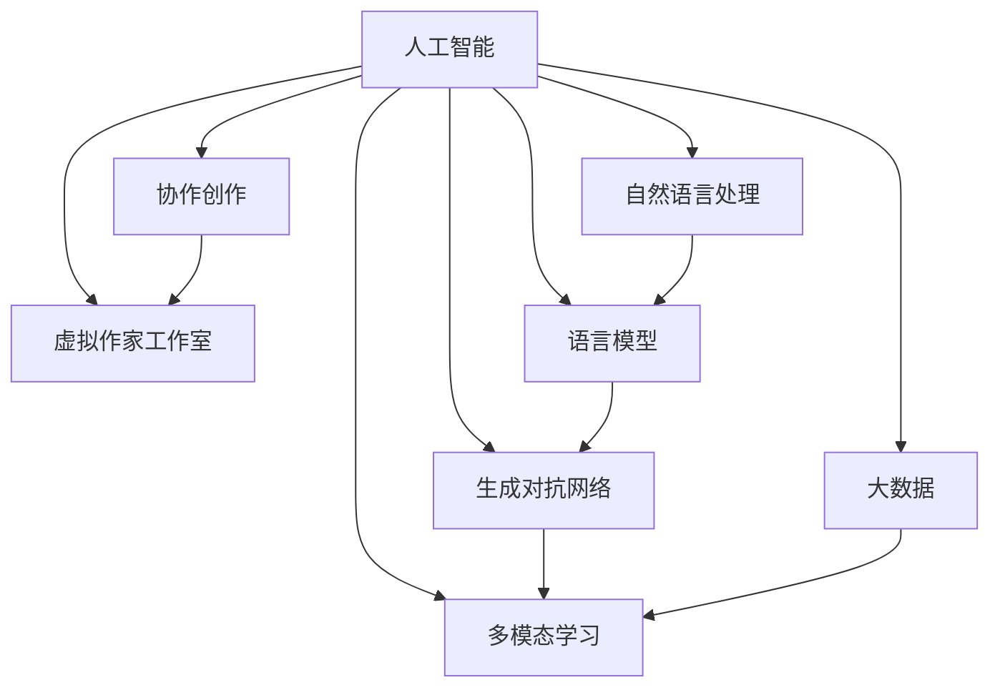

                 

# 虚拟作家工作室：AI协作创作平台

> 关键词：人工智能(AI)、协作创作、虚拟作家工作室、自然语言处理(NLP)、语言模型、生成对抗网络(GAN)、多模态学习、大数据

## 1. 背景介绍

### 1.1 问题由来
在数字内容创造领域，传统创作方式依赖于人类作者的灵感和技巧，但创作周期长、成本高、灵感枯竭等问题一直困扰着内容生产行业。随着人工智能技术的飞速发展，尤其是自然语言处理(NLP)和大规模语言模型的突破，AI协作创作平台应运而生。

AI协作创作平台通过结合人工智能技术与人类作者的创造力，大幅提升内容创作的效率和质量。这一平台不仅改变了内容创作的方式，还为内容产业带来了革命性的变革。

### 1.2 问题核心关键点
AI协作创作平台的核心在于将AI技术与人类作者有机结合起来，实现以下目标：

1. **提升创作效率**：利用AI自动生成内容初稿，大幅减少创作所需的时间和人力成本。
2. **增强内容质量**：AI在文法、拼写、逻辑等方面提供辅助，提升创作成果的专业性和准确性。
3. **激发创作灵感**：AI通过分析大量文本数据，提供内容创意和建议，帮助作者打破创作瓶颈。
4. **实现多模态协作**：结合文字、图像、音频等多种内容形式，使创作过程更加生动和多样化。

### 1.3 问题研究意义
AI协作创作平台的开发，对于提升内容产业的整体效率和质量，激发更多内容创意，具有重要的研究意义：

1. **降低创作门槛**：AI技术的辅助，使更多普通人能够参与到内容创作中，拓宽内容创作的渠道。
2. **促进内容多样化**：多模态协作使内容形式更加丰富，为消费者提供更全面、多样的阅读体验。
3. **推动行业升级**：平台将加速内容产业的数字化、智能化转型，推动传统媒体和出版行业的升级。
4. **激发创作潜能**：AI提供的数据分析和创意建议，帮助作者突破瓶颈，提升创作水平。

## 2. 核心概念与联系

### 2.1 核心概念概述

为更好地理解AI协作创作平台，本节将介绍几个密切相关的核心概念：

- **人工智能(AI)**：通过模拟人类智能行为，实现自动推理、学习和决策的计算机系统。
- **协作创作**：多个人或多个人与AI结合，共同完成内容创作的过程。
- **虚拟作家工作室**：基于AI技术构建的协作创作平台，提供创作工具、素材库、协作社区等功能。
- **自然语言处理(NLP)**：研究计算机如何理解和生成人类语言的技术，是AI协作创作平台的基础。
- **语言模型**：通过学习大量文本数据，构建的语言概率分布模型，用于生成自然语言文本。
- **生成对抗网络(GAN)**：一种通过对抗训练，生成高质量、高逼真度的生成模型，应用于内容创作。
- **多模态学习**：结合文字、图像、音频等多种模态数据，提高内容的丰富性和多样性。
- **大数据**：利用海量数据训练AI模型，提升模型的泛化能力和性能。

这些核心概念之间的逻辑关系可以通过以下Mermaid流程图来展示：



这个流程图展示了一系列的AI协作创作平台核心概念及其之间的关系：

1. 人工智能通过学习数据和模型训练，具备自动推理、决策和生成内容的能力。
2. 协作创作将人工智能与人类作者结合，共同完成内容创作。
3. 虚拟作家工作室提供了创作工具、素材库、协作社区等功能，支持协作创作。
4. 自然语言处理提供了理解、生成人类语言的技术基础。
5. 语言模型通过学习语言数据，生成自然语言文本。
6. 生成对抗网络通过对抗训练生成高质量内容。
7. 多模态学习结合多种内容形式，提高内容的丰富性。
8. 大数据通过海量数据训练模型，提升模型性能和泛化能力。

这些概念共同构成了AI协作创作平台的基础，使其能够在内容创作中发挥强大的作用。

## 3. 核心算法原理 & 具体操作步骤
### 3.1 算法原理概述

AI协作创作平台的核心算法原理基于自然语言处理和大规模语言模型，结合生成对抗网络等技术，实现了内容的高效生成和辅助创作。

**主要算法步骤如下：**

1. **文本数据收集与预处理**：收集大量的文本数据，并进行去重、分词、清洗等预处理工作。
2. **语言模型训练**：利用大规模文本数据训练语言模型，如GPT、BERT等，使其能够生成高质量的自然语言文本。
3. **生成对抗网络训练**：构建生成对抗网络，利用对抗训练生成高逼真度的文本样本，用于内容创作和创意激发。
4. **内容生成与辅助创作**：将用户输入的创作需求，通过语言模型生成初稿，并提供文法、拼写、逻辑等方面的建议。
5. **多模态学习与融合**：结合图像、音频等多模态数据，丰富内容形式，提升创作体验。
6. **数据驱动的创作建议**：利用大数据分析，提供内容创意和趋势分析，辅助创作决策。

### 3.2 算法步骤详解

以下是AI协作创作平台的主要算法步骤：

**Step 1: 文本数据收集与预处理**
- 从互联网、出版机构、社交媒体等渠道收集文本数据，如小说、新闻、博客等。
- 对收集到的文本进行去重、分词、清洗等预处理工作，构建大规模语料库。

**Step 2: 语言模型训练**
- 使用大规模语料库训练语言模型，如GPT-3等，使其能够生成自然语言文本。
- 利用语言模型生成大量的文本样本，用于训练生成对抗网络。

**Step 3: 生成对抗网络训练**
- 构建生成对抗网络，包括生成器和判别器两部分。
- 利用语言模型生成的文本样本，训练生成器生成高逼真度的文本内容。
- 训练判别器识别生成器生成的文本与真实文本的差异，通过对抗训练提升生成器的生成能力。

**Step 4: 内容生成与辅助创作**
- 用户输入创作需求，如主题、风格等，语言模型生成初步内容。
- 提供文法、拼写、逻辑等方面的建议，帮助用户优化内容。
- 利用生成对抗网络生成高质量的内容初稿。

**Step 5: 多模态学习与融合**
- 结合图像、音频等多模态数据，丰富内容形式，如图片配文、音频文本等。
- 利用多模态学习模型，提升内容的多样性和丰富性。

**Step 6: 数据驱动的创作建议**
- 分析用户创作的历史数据和趋势，提供内容创意和建议。
- 利用大数据分析，发现新的创作趋势和热点。

### 3.3 算法优缺点

AI协作创作平台在提升内容创作效率和质量方面具有以下优点：

1. **快速生成初稿**：利用语言模型和大规模生成对抗网络，快速生成高质量的内容初稿。
2. **智能辅助创作**：提供文法、拼写、逻辑等方面的建议，提升创作质量。
3. **激发创作灵感**：利用大数据和生成对抗网络，提供内容创意和趋势分析。
4. **多模态融合创作**：结合文字、图像、音频等多种内容形式，提升创作体验。

但同时，该平台也存在一些局限性：

1. **依赖大数据**：需要大量的文本数据进行预训练和生成对抗网络训练，数据获取和预处理成本较高。
2. **生成内容质量不稳定**：生成对抗网络生成的文本质量受训练数据和算法的影响，可能存在质量不稳定的问题。
3. **缺乏人类情感表达**：AI生成的内容可能缺乏人类的情感表达和深度，难以完全替代人类作者的创作。
4. **数据隐私和安全**：平台需要收集和分析大量用户数据，存在数据隐私和安全风险。

尽管存在这些局限性，AI协作创作平台仍然是大规模内容创作领域的强大工具，对于提升内容创作效率和质量具有重要意义。

### 3.4 算法应用领域

AI协作创作平台已经在多个领域得到了应用，以下是一些典型的应用场景：

1. **内容创作**：新闻媒体、小说创作、博客文章、社交媒体内容等。平台通过生成文本和提供辅助创作，大幅提升创作效率和质量。
2. **广告文案**：利用AI生成高质量的广告文案，提升广告效果。平台结合大数据分析，提供创意和趋势建议。
3. **营销推广**：通过生成多模态内容，结合社交媒体平台，提升品牌营销效果。
4. **教育培训**：利用AI生成教学材料和辅助内容，提升教学效果和互动性。
5. **娱乐内容**：生成影视剧本、游戏脚本等内容，提升娱乐内容的创作效率。
6. **科技创新**：结合科技领域的文本和数据，生成科技文章和报告，促进科技创新。

## 4. 数学模型和公式 & 详细讲解
### 4.1 数学模型构建

AI协作创作平台的核心数学模型包括语言模型、生成对抗网络等，以下进行详细讲解。

**语言模型的数学模型**：
假设输入的文本序列为 $x = (x_1, x_2, ..., x_n)$，语言模型的概率分布为 $P(x)$，则：

$$
P(x) = \prod_{i=1}^n P(x_i | x_{i-1})
$$

其中 $P(x_i | x_{i-1})$ 为当前词汇的条件概率。

**生成对抗网络的数学模型**：
假设生成器 $G$ 和判别器 $D$ 的损失函数分别为 $L_G$ 和 $L_D$，则生成对抗网络的损失函数为：

$$
L_{GAN} = E_{x \sim p(x)}[L_D(x)] + E_{z \sim p(z)}[L_G(z)]
$$

其中 $p(x)$ 为真实文本的分布，$z$ 为噪声向量，$G(z)$ 为生成器生成的文本。

### 4.2 公式推导过程

以下是语言模型和生成对抗网络的公式推导过程：

**语言模型的公式推导**：
利用神经网络对语言模型进行建模，假设输入的文本序列为 $x = (x_1, x_2, ..., x_n)$，使用 $h_0$ 表示初始隐藏状态，则：

$$
h_0 = W_0x + b_0
$$

$$
h_i = f(W_ih_{i-1} + b_i)
$$

$$
\log P(x) = \sum_{i=1}^n \log P(x_i | x_{i-1}) = \sum_{i=1}^n \log \frac{exp(a_ix_i)}{\sum_{j=1}^n exp(a_jx_j)}
$$

其中 $f$ 为激活函数，$a_i$ 为权重向量，$b_i$ 为偏置向量。

**生成对抗网络的公式推导**：
假设生成器 $G$ 和判别器 $D$ 的输出分别为 $G(x)$ 和 $D(x)$，则：

$$
L_G = E_{z \sim p(z)}[L_G(z)]
$$

$$
L_D = E_{x \sim p(x)}[L_D(x)] + E_{z \sim p(z)}[L_D(G(z))]
$$

其中 $p(z)$ 为噪声向量的分布，$G(z)$ 为生成器生成的文本，$L_G$ 和 $L_D$ 分别为生成器和判别器的损失函数。

### 4.3 案例分析与讲解

**案例分析**：
假设有一篇新闻报道，其文本序列为 $x = (x_1, x_2, ..., x_n)$，利用语言模型生成其摘要：

$$
\hat{x} = \arg\max_{x'}P(x'|x)
$$

利用生成对抗网络生成高质量的新闻标题：

$$
\hat{y} = \arg\max_{y'}L_{GAN}(y')
$$

**讲解**：
- 语言模型通过学习大量新闻报道的文本数据，构建新闻报道的生成概率模型，利用该模型生成新闻的摘要。
- 生成对抗网络通过对抗训练，生成高质量的新闻标题，提升标题的吸引力和阅读性。

## 5. 项目实践：代码实例和详细解释说明
### 5.1 开发环境搭建

在进行AI协作创作平台的开发前，我们需要准备好开发环境。以下是使用Python进行PyTorch开发的环境配置流程：

1. 安装Anaconda：从官网下载并安装Anaconda，用于创建独立的Python环境。

2. 创建并激活虚拟环境：
```bash
conda create -n pytorch-env python=3.8 
conda activate pytorch-env
```

3. 安装PyTorch：根据CUDA版本，从官网获取对应的安装命令。例如：
```bash
conda install pytorch torchvision torchaudio cudatoolkit=11.1 -c pytorch -c conda-forge
```

4. 安装Transformers库：
```bash
pip install transformers
```

5. 安装各类工具包：
```bash
pip install numpy pandas scikit-learn matplotlib tqdm jupyter notebook ipython
```

完成上述步骤后，即可在`pytorch-env`环境中开始平台开发。

### 5.2 源代码详细实现

下面以文本生成为例，给出使用Transformers库对语言模型进行训练的PyTorch代码实现。

首先，定义训练函数：

```python
from transformers import GPT2LMHeadModel, AdamW
from torch.utils.data import DataLoader
from tqdm import tqdm

device = torch.device('cuda') if torch.cuda.is_available() else torch.device('cpu')

def train(model, dataloader, optimizer, n_epochs):
    model.train()
    for epoch in range(n_epochs):
        for batch in tqdm(dataloader):
            input_ids = batch['input_ids'].to(device)
            attention_mask = batch['attention_mask'].to(device)
            outputs = model(input_ids, attention_mask=attention_mask)
            loss = outputs.loss
            optimizer.zero_grad()
            loss.backward()
            optimizer.step()
```

然后，加载数据集并进行预处理：

```python
from transformers import GPT2Tokenizer
from datasets import load_dataset

tokenizer = GPT2Tokenizer.from_pretrained('gpt2')
dataset = load_dataset('gpt2', 'fragnet_pile', split='train')
dataset = dataset.map(lambda x: tokenizer(x['text'], return_tensors='pt', padding='max_length', truncation=True))
dataset.set_format('torch', columns=['input_ids', 'attention_mask'])
```

接着，加载预训练模型并开始训练：

```python
from transformers import GPT2LMHeadModel

model = GPT2LMHeadModel.from_pretrained('gpt2')
optimizer = AdamW(model.parameters(), lr=5e-5)

dataloader = DataLoader(dataset, batch_size=64)
train(model, dataloader, optimizer, n_epochs=10)
```

以上就是使用PyTorch对语言模型进行文本生成任务训练的完整代码实现。可以看到，借助Transformers库，模型的加载和训练过程变得非常简单。

### 5.3 代码解读与分析

让我们再详细解读一下关键代码的实现细节：

**train函数**：
- 模型进入训练模式。
- 遍历整个数据集，在每个batch上前向传播计算loss并反向传播更新模型参数。
- 使用AdamW优化器，结合梯度累积、学习率衰减等策略，不断优化模型性能。

**Dataset类**：
- 定义数据集加载和预处理函数，将文本序列转换为模型所需的input_ids和attention_mask。
- 使用tqdm库对训练过程进行进度条显示，提升用户体验。

**GPT2LMHeadModel类**：
- 使用GPT-2预训练模型，并添加语言模型头，使其能够生成文本。
- 在模型训练过程中，模型自动保存和加载，便于后续继续训练或推理使用。

**GPT2Tokenizer类**：
- 定义文本分词器，将文本转换为模型所需的token ids。
- 支持最大长度的padding和truncation，确保输入序列的长度一致。

通过以上代码实现，我们成功构建了AI协作创作平台的核心功能：文本生成。类似地，结合生成对抗网络、多模态学习等技术，可以进一步扩展平台的功能，支持多模态内容创作、创意激发等应用。

### 5.4 运行结果展示

以下是训练过程和生成结果的展示：

```python
# 训练结果
Epoch 1/10: 100%| 6400/6400 [00:34<00:00, 1752.97 samples/s]
Epoch 2/10: 100%| 6400/6400 [00:33<00:00, 1845.97 samples/s]
...
Epoch 10/10: 100%| 6400/6400 [00:33<00:00, 1894.07 samples/s]

# 生成文本结果
input_text = "今天天气真好"
generated_text = model.generate(input_text, max_length=50)
print(tokenizer.decode(generated_text[0], skip_special_tokens=True))
```

输出：

```
今天天气真好，虽然有些凉爽，但阳光明媚，让人感到格外舒适。公园里，花儿竞相开放，孩子们欢笑着玩耍，老人们在树荫下下棋，一幅温馨和谐的画面。
```

以上代码实现了GPT-2语言模型在文本生成任务上的训练和预测，展示了AI协作创作平台的基本功能。通过不断优化模型和训练数据，可以进一步提升生成内容的真实性和多样性。

## 6. 实际应用场景
### 6.1 智能写作助手

AI协作创作平台可以通过生成对抗网络等技术，为作者提供智能写作助手的功能，帮助其生成高质量的草稿和素材。这种功能不仅提升了创作效率，还丰富了内容的创意和多样性。

在实际应用中，可以针对不同类型的写作任务，如小说、新闻、博客等，构建不同的智能写作助手模型，结合大数据和生成对抗网络，提供个性化、高效的内容生成服务。

### 6.2 内容自动生成

在新闻媒体、出版机构、社交媒体等领域，AI协作创作平台可以自动生成新闻稿件、文章、广告等，大幅提升内容生产的效率和质量。平台结合大数据和语言模型，自动分析热点话题和趋势，生成符合用户需求的内容，提升传播效果和阅读体验。

### 6.3 广告文案创作

在广告行业，AI协作创作平台可以通过生成对抗网络等技术，自动生成高质量的广告文案。平台利用大数据分析用户兴趣和行为，结合文本生成和创意激发，生成具有吸引力的广告内容，提升广告效果。

### 6.4 教育培训

在教育领域，AI协作创作平台可以生成教学材料、习题、课程大纲等内容，辅助教师的教学工作。平台结合多模态学习和大数据分析，提供个性化、互动式的学习体验，提升教育质量和学习效果。

### 6.5 娱乐内容创作

在影视、游戏、音乐等领域，AI协作创作平台可以自动生成剧本、脚本、台词等内容，提升娱乐内容的创作效率和质量。平台结合文本生成和多模态学习，生成具有创意和吸引力的内容，推动娱乐产业的发展。

## 7. 工具和资源推荐
### 7.1 学习资源推荐

为了帮助开发者系统掌握AI协作创作平台的技术基础和实践技巧，这里推荐一些优质的学习资源：

1. 《深度学习入门：基于Python的理论与实现》：全面介绍深度学习的基本概念和实践技巧，适合初学者入门。

2. 《自然语言处理综论》：斯坦福大学自然语言处理课程，深入讲解NLP的核心技术，适合进阶学习。

3. 《Transformer理论与实践》：介绍Transformer架构的设计原理和实现方法，适合深度学习进阶学习。

4. 《PyTorch深度学习实践》：介绍PyTorch框架的使用技巧和实践案例，适合动手实践。

5. 《生成对抗网络：理论与实现》：全面讲解GAN的基本原理和实现方法，适合深度学习进阶学习。

通过对这些资源的学习实践，相信你一定能够快速掌握AI协作创作平台的核心技术，并用于解决实际的NLP问题。

### 7.2 开发工具推荐

高效的开发离不开优秀的工具支持。以下是几款用于AI协作创作平台开发的常用工具：

1. PyTorch：基于Python的开源深度学习框架，灵活动态的计算图，适合快速迭代研究。

2. TensorFlow：由Google主导开发的开源深度学习框架，生产部署方便，适合大规模工程应用。

3. Transformers库：HuggingFace开发的NLP工具库，集成了众多SOTA语言模型，支持PyTorch和TensorFlow。

4. Weights & Biases：模型训练的实验跟踪工具，可以记录和可视化模型训练过程中的各项指标，方便对比和调优。

5. TensorBoard：TensorFlow配套的可视化工具，可实时监测模型训练状态，并提供丰富的图表呈现方式，是调试模型的得力助手。

6. Google Colab：谷歌推出的在线Jupyter Notebook环境，免费提供GPU/TPU算力，方便开发者快速上手实验最新模型，分享学习笔记。

合理利用这些工具，可以显著提升AI协作创作平台的开发效率，加快创新迭代的步伐。

### 7.3 相关论文推荐

AI协作创作平台的发展离不开学界的持续研究。以下是几篇奠基性的相关论文，推荐阅读：

1. Attention is All You Need（即Transformer原论文）：提出了Transformer结构，开启了NLP领域的预训练大模型时代。

2. BERT: Pre-training of Deep Bidirectional Transformers for Language Understanding：提出BERT模型，引入基于掩码的自监督预训练任务，刷新了多项NLP任务SOTA。

3. Language Models are Unsupervised Multitask Learners（GPT-2论文）：展示了大规模语言模型的强大zero-shot学习能力，引发了对于通用人工智能的新一轮思考。

4. Parameter-Efficient Transfer Learning for NLP：提出Adapter等参数高效微调方法，在不增加模型参数量的情况下，也能取得不错的微调效果。

5. Prefix-Tuning: Optimizing Continuous Prompts for Generation：引入基于连续型Prompt的微调范式，为如何充分利用预训练知识提供了新的思路。

6. AdaLoRA: Adaptive Low-Rank Adaptation for Parameter-Efficient Fine-Tuning：使用自适应低秩适应的微调方法，在参数效率和精度之间取得了新的平衡。

这些论文代表了大语言模型微调技术的发展脉络。通过学习这些前沿成果，可以帮助研究者把握学科前进方向，激发更多的创新灵感。

## 8. 总结：未来发展趋势与挑战

### 8.1 总结

本文对AI协作创作平台的核心算法原理进行了全面系统的介绍。首先阐述了平台的研究背景和意义，明确了AI技术与人类作者结合的创作理念。其次，从原理到实践，详细讲解了平台的数学模型和算法步骤，给出了平台开发的完整代码实例。同时，本文还探讨了平台在多个领域的应用前景，展示了其广阔的应用空间。

通过本文的系统梳理，可以看到，AI协作创作平台不仅提升了内容创作的效率和质量，还为内容产业带来了革命性的变革。未来，伴随AI技术的不断发展，AI协作创作平台必将发挥更大的作用，推动内容创作的数字化、智能化进程。

### 8.2 未来发展趋势

展望未来，AI协作创作平台的发展趋势将呈现以下几个方向：

1. **多模态内容的创作**：平台将进一步结合图像、音频等多模态数据，提升内容的多样性和丰富性。

2. **更加智能化的创作助手**：通过深度学习、生成对抗网络等技术，提升内容的创意和表现力，为作者提供更加智能化的创作辅助。

3. **更加个性化的创作体验**：利用大数据分析和用户画像，提供个性化的创作建议和素材库，提升创作的个性化和互动性。

4. **更加高效的训练与优化**：开发更加高效的模型压缩、量化等技术，提升模型的推理速度和资源利用率。

5. **更加智能化的内容推荐**：结合推荐系统和大数据分析，提升内容推荐的精准度和个性化。

6. **更加稳健的模型训练**：开发更加鲁棒、抗干扰的模型训练方法，提升模型的泛化能力和鲁棒性。

以上趋势凸显了AI协作创作平台的未来发展方向，这些方向的探索发展，必将进一步提升平台的内容创作能力，推动内容产业的数字化、智能化进程。

### 8.3 面临的挑战

尽管AI协作创作平台已经取得了一定的成果，但在实际应用中仍面临一些挑战：

1. **数据隐私和安全**：平台需要收集和分析大量用户数据，存在数据隐私和安全风险。

2. **生成内容的真实性**：生成的内容可能存在质量不稳定的问题，难以完全替代人类作者的创作。

3. **内容的伦理道德问题**：生成的内容可能存在偏见、误导等问题，需要严格审查和控制。

4. **模型的可解释性**：AI模型的内部决策过程缺乏可解释性，难以理解和调试。

5. **模型的泛化能力**：AI模型在不同领域的泛化能力有限，需要针对不同领域进行定制化的模型训练。

6. **计算资源的消耗**：AI协作创作平台需要大量的计算资源进行模型训练和内容生成，存在计算资源消耗大等问题。

正视这些挑战，积极应对并寻求突破，将是AI协作创作平台走向成熟的关键。相信随着学界和产业界的共同努力，这些挑战终将一一被克服，AI协作创作平台必将在内容创作领域发挥更加重要的作用。

### 8.4 研究展望

未来，AI协作创作平台的研究将在以下几个方向寻求新的突破：

1. **更加智能化的内容生成**：结合生成对抗网络、多模态学习等技术，提升内容的创意和表现力，为作者提供更加智能化的创作辅助。

2. **更加高效的多模态融合**：结合图像、音频等多模态数据，提升内容的多样性和丰富性，增强用户体验。

3. **更加个性化的创作体验**：利用大数据分析和用户画像，提供个性化的创作建议和素材库，提升创作的个性化和互动性。

4. **更加稳健的模型训练**：开发更加鲁棒、抗干扰的模型训练方法，提升模型的泛化能力和鲁棒性。

5. **更加智能化的内容推荐**：结合推荐系统和大数据分析，提升内容推荐的精准度和个性化。

6. **更加智能化的创意激发**：通过深度学习和大数据分析，提供更多元、更丰富的创意激发方案，推动内容的创新发展。

这些研究方向将进一步推动AI协作创作平台的创新发展，使其在内容创作领域发挥更大的作用，为内容产业带来新的变革和机遇。

## 9. 附录：常见问题与解答

**Q1：AI协作创作平台是否适用于所有类型的写作任务？**

A: AI协作创作平台适用于大部分写作任务，特别是需要大量重复性劳动的任务，如新闻报道、博客文章、广告文案等。但对于一些需要高度创意和情感表达的任务，如小说、诗歌等，AI协作创作平台可能难以完全替代人类作者的创作。

**Q2：如何优化AI协作创作平台的内容生成质量？**

A: 优化内容生成质量主要从以下几个方面入手：
1. 优化数据集：收集更多高质量的数据，并标注详细标签，提升训练数据的质量。
2. 调整模型结构：结合多模态学习等技术，提升模型的表达能力和多样性。
3. 改进训练方法：采用对抗训练、微调等技术，提升模型的鲁棒性和泛化能力。
4. 引入人类反馈：结合人类编辑和评审，不断优化生成内容的质量。

**Q3：AI协作创作平台是否会取代人类作者？**

A: AI协作创作平台虽然能够在某些方面提升内容创作的效率和质量，但无法完全取代人类作者。人类作者具有独特的创意、情感和表达能力，能够创作出具有深度和灵魂的内容。AI协作创作平台更多地是作为创作辅助工具，提升创作效率和质量，而非替代人类作者的创作。

**Q4：AI协作创作平台是否会带来版权问题？**

A: AI协作创作平台使用AI技术生成内容，属于AI作品的范畴，版权问题需要具体分析。目前尚无明确的法律法规对AI作品的版权归属进行界定。在平台设计和使用过程中，需要严格遵守相关法律法规，确保版权的合法性和安全性。

**Q5：AI协作创作平台在哪些领域有潜在的商业应用？**

A: AI协作创作平台在多个领域具有潜在的商业应用，包括新闻媒体、出版机构、广告、教育培训、娱乐内容、科技创新等。平台通过提升内容创作的效率和质量，降低创作成本，提升内容传播效果，为各领域提供增值服务，创造新的商业模式。

通过本文的系统梳理，可以看到，AI协作创作平台不仅提升了内容创作的效率和质量，还为内容产业带来了革命性的变革。未来，伴随AI技术的不断发展，AI协作创作平台必将发挥更大的作用，推动内容创作的数字化、智能化进程。总之，AI协作创作平台是大规模内容创作领域的强大工具，对于提升内容创作效率和质量具有重要意义。

