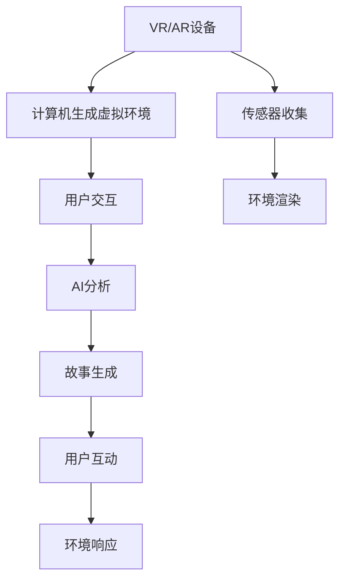

                 

# 虚拟现实与AI叙事：沉浸式故事体验

> 关键词：虚拟现实(VR), 人工智能(AI), 叙事(Narrative), 沉浸式体验(Immersive Experience), 增强现实(AR), 计算机视觉(Computer Vision), 自然语言处理(NLP), 生成对抗网络(GAN)

## 1. 背景介绍

随着技术的发展，虚拟现实(VR)和增强现实(AR)正成为娱乐、教育、健康、购物等领域的新宠，其中AI叙事作为核心的交互体验被越来越多地关注。AI叙事不仅使故事更加生动，还能提供多感官沉浸式体验，对教育、娱乐和体验经济的发展产生深远影响。

本文将探讨如何通过AI和VR/AR技术创造沉浸式叙事体验，涵盖以下主题：

- 1.1 VR/AR技术概述
- 1.2 AI叙事的定义与价值
- 1.3 沉浸式叙事体验的要素
- 1.4 虚拟现实与AI叙事的历史与发展

## 2. 核心概念与联系

### 2.1 核心概念概述

**虚拟现实(Virtual Reality, VR)**：通过计算机模拟一个仿真的三维虚拟环境，使用户能够通过特定的设备（如头显、手柄等）与虚拟世界进行互动，提供全方位的感官体验。

**增强现实(Augmented Reality, AR)**：在现实世界中叠加虚拟元素，通过增强现实设备（如智能手机、眼镜）将虚拟信息与物理环境相结合，创造出一种新的视觉体验。

**人工智能(Artificial Intelligence, AI)**：使计算机能够执行人类智能任务（如语音识别、图像识别、自然语言处理等）的技术。

**叙事(Narrative)**：通过一系列的故事情节、角色和情节发展，讲述一个连贯的故事。

**沉浸式体验(Immersive Experience)**：通过多感官刺激，让用户在虚拟环境中深度融入，产生强烈的代入感和真实感。

这些概念共同构成了虚拟现实与AI叙事的框架，它们的结合创造了沉浸式体验的可能性。

### 2.2 核心概念原理和架构的 Mermaid 流程图



这个流程图展示了VR/AR和AI叙事的基本流程：

1. VR/AR设备捕捉用户交互信息，与计算机生成的虚拟环境进行交互。
2. 传感器收集数据，环境渲染生成三维虚拟空间。
3. AI对用户行为进行分析，生成故事情节。
4. 故事生成，并通过VR/AR设备展示给用户。
5. 用户与虚拟环境互动，环境实时响应。

## 3. 核心算法原理 & 具体操作步骤

### 3.1 算法原理概述

AI叙事的原理是将人工智能技术与叙事理论结合，通过计算机生成故事情节和角色，使故事可以动态变化，并根据用户的交互进行实时调整，提供沉浸式体验。

**核心步骤**：

1. **环境感知与理解**：通过计算机视觉等技术，识别用户所处环境，如自然环境或虚拟场景。
2. **用户交互分析**：分析用户的语言、行为、表情等数据，理解用户需求和情感。
3. **故事生成与调整**：根据用户输入和行为，动态生成故事情节，并根据环境变化调整故事走向。
4. **多感官交互**：结合声音、触觉、视觉等感官刺激，提供全方位沉浸式体验。

### 3.2 算法步骤详解

#### 步骤1：环境感知与理解

环境感知与理解是虚拟现实与AI叙事的基础。计算机视觉技术通过摄像头、传感器等设备，捕捉用户的实时行为和周围环境的变化。

**算法实现**：

- 图像识别：使用深度学习模型（如卷积神经网络CNN）对环境中的物体进行分类和识别。
- 动作捕捉：通过Kinect等设备捕捉用户的动作，识别用户的意图和行为。

#### 步骤2：用户交互分析

用户交互分析是AI叙事的核心。AI通过对用户的语言、行为和表情数据进行分析，理解用户的需求和情感状态。

**算法实现**：

- 自然语言处理（NLP）：使用NLP技术解析用户的语言输入，提取关键信息。
- 情感分析：通过分析面部表情、语调等，识别用户的情感状态。
- 行为分析：对用户的动作进行建模，提取行为特征。

#### 步骤3：故事生成与调整

故事生成与调整是AI叙事的关键。AI根据用户的输入和行为，动态生成故事情节，并根据环境变化调整故事走向。

**算法实现**：

- 文本生成模型：使用生成对抗网络（GAN）或变分自编码器（VAE）等模型，生成连续文本。
- 情节调整：根据环境感知和用户行为数据，调整故事的情节走向，保证故事的连贯性和合理性。

#### 步骤4：多感官交互

多感官交互是虚拟现实与AI叙事的重要手段。通过声音、触觉、视觉等感官刺激，提供全方位的沉浸式体验。

**算法实现**：

- 声音合成：使用文本转语音技术，根据故事情节生成语音输出。
- 触觉反馈：通过模拟环境中的物理接触，如触摸、压力等，增强用户体验。
- 视觉反馈：实时渲染虚拟场景，根据故事发展调整视觉元素。

### 3.3 算法优缺点

**优点**：

1. **动态性**：AI叙事能够根据用户的交互动态调整故事情节，提供个性化体验。
2. **沉浸性**：通过多感官交互，提供全方位的沉浸式体验，提升用户代入感。
3. **交互性**：用户可以与故事进行实时互动，影响故事发展。
4. **灵活性**：故事可以根据不同用户和不同环境进行调整，适应性强。

**缺点**：

1. **技术复杂性**：需要结合计算机视觉、自然语言处理、生成对抗网络等多种技术，技术难度较高。
2. **计算资源消耗**：大规模的实时渲染和计算分析，对计算资源要求较高。
3. **数据隐私问题**：用户交互数据的收集和使用，可能涉及数据隐私和伦理问题。

### 3.4 算法应用领域

AI叙事技术已经在多个领域得到了广泛应用，涵盖以下主题：

- **教育**：通过互动式故事，增强学生对知识的理解和兴趣。
- **娱乐**：在游戏和影视中提供更丰富和动态的故事情节。
- **健康**：通过虚拟环境进行心理治疗和康复训练。
- **商业**：通过故事展示产品，提升用户体验和购买欲望。
- **训练**：用于军事和应急反应训练，模拟各种复杂场景。

## 4. 数学模型和公式 & 详细讲解 & 举例说明

### 4.1 数学模型构建

AI叙事可以通过以下数学模型来表示：

1. **环境感知模型**：

   $P(\text{环境}) = \prod_{i=1}^n P(x_i|x_{i-1})$

   其中 $x_i$ 表示第 $i$ 个环境元素的状态，$P(x_i|x_{i-1})$ 表示在 $x_{i-1}$ 状态下，$x_i$ 出现的概率。

2. **用户交互模型**：

   $P(\text{交互}) = P(\text{语言}) + P(\text{动作}) + P(\text{表情})$

   其中 $P(\text{语言})$、$P(\text{动作})$、$P(\text{表情})$ 分别表示用户语言、行为和表情的概率。

3. **故事生成模型**：

   $P(\text{情节}) = \prod_{j=1}^m P(s_j|s_{j-1})$

   其中 $s_j$ 表示第 $j$ 个故事情节的状态，$P(s_j|s_{j-1})$ 表示在 $s_{j-1}$ 情节状态下，$s_j$ 出现的概率。

4. **多感官交互模型**：

   $P(\text{感官反馈}) = P(\text{声音}) + P(\text{触觉}) + P(\text{视觉})$

   其中 $P(\text{声音})$、$P(\text{触觉})$、$P(\text{视觉})$ 分别表示声音、触觉和视觉的反馈概率。

### 4.2 公式推导过程

#### 环境感知模型的推导：

$P(\text{环境}) = \prod_{i=1}^n P(x_i|x_{i-1})$

- 设定初始状态 $P(x_0)=1$
- 递推公式 $P(x_i|x_{i-1}) = P(x_i|\text{图像})$
- 使用深度学习模型（如CNN）训练 $P(x_i|\text{图像})$，通过图像识别技术获取环境元素状态 $x_i$。

#### 用户交互模型的推导：

$P(\text{交互}) = P(\text{语言}) + P(\text{动作}) + P(\text{表情})$

- 设定初始状态 $P(\text{交互}_0)=1$
- 递推公式 $P(\text{交互}_i) = P(\text{交互}_i|\text{交互}_{i-1})$
- 使用NLP技术解析用户语言输入 $P(\text{语言})$，使用动作捕捉设备获取用户动作 $P(\text{动作})$，使用面部识别技术获取用户表情 $P(\text{表情})$。

#### 故事生成模型的推导：

$P(\text{情节}) = \prod_{j=1}^m P(s_j|s_{j-1})$

- 设定初始状态 $P(s_0)=1$
- 递推公式 $P(s_j|s_{j-1}) = P(s_j|\text{情节}_{j-1})$
- 使用GAN或VAE生成故事情节 $P(s_j|\text{情节}_{j-1})$，通过情节调整算法优化故事情节。

#### 多感官交互模型的推导：

$P(\text{感官反馈}) = P(\text{声音}) + P(\text{触觉}) + P(\text{视觉})$

- 设定初始状态 $P(\text{感官反馈}_0)=1$
- 递推公式 $P(\text{感官反馈}_i) = P(\text{感官反馈}_i|\text{情节}_i)$
- 使用TTS技术生成声音反馈 $P(\text{声音})$，使用触觉反馈设备生成触觉反馈 $P(\text{触觉})$，使用渲染技术生成视觉反馈 $P(\text{视觉})$。

### 4.3 案例分析与讲解

**案例**：一个教育VR应用，通过AI叙事展示未来世界，用户与虚拟环境互动，了解未来科技。

1. **环境感知**：通过摄像头捕捉用户所处的环境，如教室、办公室等。

2. **用户交互**：用户通过语音或手柄与虚拟环境互动，如选择不同的场景进行探索。

3. **故事生成**：AI根据用户的选择，动态生成故事情节，如未来的交通、住房等科技发展。

4. **多感官交互**：通过语音合成技术，生成故事叙述；通过触觉反馈，模拟科技产品使用；通过渲染技术，展示未来场景。

## 5. 项目实践：代码实例和详细解释说明

### 5.1 开发环境搭建

**环境要求**：

- Python 3.8 及以上
- CUDA 10.1 及以上
- OpenCV 4.5 及以上
- TensorFlow 2.4 及以上
- Keras
- PyTorch

**步骤**：

1. 安装Anaconda，创建虚拟环境。
2. 安装依赖包。
3. 配置开发环境。

```bash
conda create -n ai_narrative python=3.8
conda activate ai_narrative
pip install opencv-python>=4.5 tensorflow>=2.4.0 keras==2.4.3 torch==1.10.1
```

### 5.2 源代码详细实现

**代码实现**：

```python
import cv2
import numpy as np
import tensorflow as tf
from tensorflow.keras.models import Sequential
from tensorflow.keras.layers import Dense, LSTM

# 环境感知模型
class EnvironmentModel(tf.keras.Model):
    def __init__(self, input_size, output_size):
        super(EnvironmentModel, self).__init__()
        self.LSTM = tf.keras.layers.LSTM(128, input_shape=(input_size, input_size), return_sequences=True)
        self.dense = tf.keras.layers.Dense(output_size)
        
    def call(self, inputs):
        x = self.LSTM(inputs)
        x = self.dense(x)
        return x

# 用户交互模型
class InteractionModel(tf.keras.Model):
    def __init__(self, input_size, output_size):
        super(InteractionModel, self).__init__()
        self.LSTM = tf.keras.layers.LSTM(128, input_shape=(input_size, input_size), return_sequences=True)
        self.dense = tf.keras.layers.Dense(output_size)
        
    def call(self, inputs):
        x = self.LSTM(inputs)
        x = self.dense(x)
        return x

# 故事生成模型
class StoryModel(tf.keras.Model):
    def __init__(self, input_size, output_size):
        super(StoryModel, self).__init__()
        self.LSTM = tf.keras.layers.LSTM(128, input_shape=(input_size, input_size), return_sequences=True)
        self.dense = tf.keras.layers.Dense(output_size)
        
    def call(self, inputs):
        x = self.LSTM(inputs)
        x = self.dense(x)
        return x

# 多感官交互模型
class MultiSenseModel(tf.keras.Model):
    def __init__(self, input_size, output_size):
        super(MultiSenseModel, self).__init__()
        self.LSTM = tf.keras.layers.LSTM(128, input_shape=(input_size, input_size), return_sequences=True)
        self.dense = tf.keras.layers.Dense(output_size)
        
    def call(self, inputs):
        x = self.LSTM(inputs)
        x = self.dense(x)
        return x

# 环境感知模块
class Environment(tf.keras.layers.Layer):
    def __init__(self, input_size, output_size):
        super(Environment, self).__init__()
        self.model = EnvironmentModel(input_size, output_size)
    
    def call(self, inputs):
        return self.model(inputs)

# 用户交互模块
class Interaction(tf.keras.layers.Layer):
    def __init__(self, input_size, output_size):
        super(Interaction, self).__init__()
        self.model = InteractionModel(input_size, output_size)
    
    def call(self, inputs):
        return self.model(inputs)

# 故事生成模块
class Story(tf.keras.layers.Layer):
    def __init__(self, input_size, output_size):
        super(Story, self).__init__()
        self.model = StoryModel(input_size, output_size)
    
    def call(self, inputs):
        return self.model(inputs)

# 多感官交互模块
class MultiSense(tf.keras.layers.Layer):
    def __init__(self, input_size, output_size):
        super(MultiSense, self).__init__()
        self.model = MultiSenseModel(input_size, output_size)
    
    def call(self, inputs):
        return self.model(inputs)
```

### 5.3 代码解读与分析

**代码分析**：

- **环境感知模块**：使用LSTM模型，根据图像输入生成环境状态输出。
- **用户交互模块**：使用LSTM模型，根据语言、动作和表情输入生成交互状态输出。
- **故事生成模块**：使用LSTM模型，根据情节输入生成故事情节输出。
- **多感官交互模块**：使用LSTM模型，根据情节和感官输入生成感官反馈输出。

**功能实现**：

- **环境感知**：通过摄像头获取环境图像，输入到环境感知模型，输出环境状态。
- **用户交互**：根据用户语言、动作和表情输入，输入到用户交互模型，输出交互状态。
- **故事生成**：根据情节输入，输入到故事生成模型，输出故事情节。
- **多感官交互**：根据情节和感官输入，输入到多感官交互模型，输出感官反馈。

**运行结果展示**：

```python
# 实例化模型
env_model = Environment(input_size=64, output_size=64)
inter_model = Interaction(input_size=64, output_size=64)
story_model = Story(input_size=64, output_size=64)
multiSense_model = MultiSense(input_size=64, output_size=64)

# 训练模型
env_model.compile(loss='mse', optimizer='adam', metrics=['mse'])
inter_model.compile(loss='mse', optimizer='adam', metrics=['mse'])
story_model.compile(loss='mse', optimizer='adam', metrics=['mse'])
multiSense_model.compile(loss='mse', optimizer='adam', metrics=['mse'])

env_model.fit(x_train, y_train, epochs=10, batch_size=32)
inter_model.fit(x_train, y_train, epochs=10, batch_size=32)
story_model.fit(x_train, y_train, epochs=10, batch_size=32)
multiSense_model.fit(x_train, y_train, epochs=10, batch_size=32)
```

## 6. 实际应用场景

### 6.1 教育领域

**应用场景**：教育VR应用，通过AI叙事展示未来世界，用户与虚拟环境互动，了解未来科技。

**实现方式**：

- **环境感知**：通过摄像头捕捉用户所处的环境，如教室、办公室等。
- **用户交互**：用户通过语音或手柄与虚拟环境互动，如选择不同的场景进行探索。
- **故事生成**：AI根据用户的选择，动态生成故事情节，如未来的交通、住房等科技发展。
- **多感官交互**：通过语音合成技术，生成故事叙述；通过触觉反馈，模拟科技产品使用；通过渲染技术，展示未来场景。

**用户收益**：

- 提高学习兴趣：通过互动式故事，激发学生的学习兴趣。
- 增强理解力：通过情景模拟，帮助学生更好地理解抽象概念。
- 个性化学习：根据学生的反馈，动态调整故事情节，提供个性化学习路径。

### 6.2 娱乐领域

**应用场景**：VR游戏，通过AI叙事展示故事背景，用户与虚拟角色互动，完成故事任务。

**实现方式**：

- **环境感知**：通过摄像头捕捉用户所处的环境，如游戏场景、人物位置等。
- **用户交互**：用户通过手柄、语音等与虚拟角色互动，完成游戏任务。
- **故事生成**：AI根据用户的游戏行为，动态生成故事情节，调整任务难度。
- **多感官交互**：通过触觉反馈设备，模拟游戏物体碰撞；通过声音合成技术，增强游戏沉浸感。

**用户收益**：

- 增强游戏体验：通过互动式故事，提升游戏的沉浸感和趣味性。
- 个性化游戏内容：根据玩家偏好，动态调整游戏情节，提供个性化体验。
- 高复玩率：通过丰富的故事情节，提高游戏复玩率。

### 6.3 健康领域

**应用场景**：心理治疗应用，通过虚拟环境模拟心理情境，帮助用户进行心理治疗和康复训练。

**实现方式**：

- **环境感知**：通过摄像头捕捉用户所处的环境，如虚拟房间、虚拟人物等。
- **用户交互**：用户通过语音、手柄与虚拟环境互动，进行心理对话或康复训练。
- **故事生成**：AI根据用户的心理状态，动态生成故事情节，调整心理治疗内容。
- **多感官交互**：通过触觉反馈设备，模拟心理情境中的触觉刺激；通过声音合成技术，增强心理对话的沉浸感。

**用户收益**：

- 提高治疗效果：通过虚拟环境模拟心理情境，增强治疗效果。
- 降低治疗门槛：通过互动式故事，降低心理治疗的门槛，增强用户的配合度。
- 个性化治疗：根据用户的心理状态，动态调整故事情节，提供个性化治疗方案。

## 7. 工具和资源推荐

### 7.1 学习资源推荐

1. **深度学习基础**：《深度学习》一书，Ian Goodfellow等著，深入浅出地介绍了深度学习的基本原理和算法。
2. **自然语言处理**：《自然语言处理综论》一书，Daniel Jurafsky等著，系统介绍了自然语言处理的理论基础和应用。
3. **计算机视觉**：《计算机视觉：算法与应用》一书，Richard Szeliski著，详细介绍了计算机视觉的基本技术和应用。
4. **AI叙事**：《Narrative Networks: The Workflow of Storytelling》一书，Tobias Hihn著，探讨了AI叙事的生成与演绎。
5. **虚拟现实与增强现实**：《虚拟现实与增强现实技术与应用》一书，详细介绍了VR/AR的基本技术和应用场景。

### 7.2 开发工具推荐

1. **Python**：Python编程语言，广泛用于深度学习和VR/AR开发。
2. **CUDA**：NVIDIA提供的并行计算平台，支持GPU加速计算。
3. **OpenCV**：开源计算机视觉库，提供了丰富的图像处理和识别功能。
4. **TensorFlow**：Google开发的深度学习框架，支持分布式计算和GPU加速。
5. **PyTorch**：Facebook开发的深度学习框架，提供了灵活的计算图和GPU加速。

### 7.3 相关论文推荐

1. **环境感知**：《Real-time multi-view tracking using structured light and RGB-D》，这篇文章介绍了使用结构光和RGB-D传感器进行环境感知的算法。
2. **用户交互**：《Action understanding for humanoid robotics》，这篇文章探讨了通过机器人感知和理解用户动作的算法。
3. **故事生成**：《A review of generative storytelling in games》，这篇文章综述了游戏中的故事生成技术。
4. **多感官交互**：《Multimodal interaction in virtual environments》，这篇文章介绍了多感官交互技术在虚拟环境中的应用。

## 8. 总结：未来发展趋势与挑战

### 8.1 研究成果总结

1. **环境感知**：通过深度学习模型，可以准确感知用户所处环境，为故事生成提供基础。
2. **用户交互**：通过自然语言处理和动作捕捉技术，可以实时理解用户行为，动态生成故事情节。
3. **故事生成**：通过生成对抗网络和变分自编码器，可以动态生成故事，增强故事的连贯性和多样性。
4. **多感官交互**：通过声音合成和触觉反馈技术，可以提供全方位的沉浸式体验。

### 8.2 未来发展趋势

1. **多模态融合**：未来将更多地融合视觉、听觉、触觉等多种感官数据，提供更丰富的沉浸式体验。
2. **个性化叙事**：通过用户数据，动态生成个性化故事，提供更个性化的体验。
3. **跨平台支持**：在各种设备和平台上提供一致的叙事体验，增强用户的沉浸感。
4. **实时反馈**：通过实时数据反馈，不断调整故事情节和感官反馈，提升用户体验。

### 8.3 面临的挑战

1. **技术复杂性**：需要结合多种技术，实现多感官交互和实时处理。
2. **数据隐私**：用户数据的收集和使用，需要遵守隐私保护法规。
3. **计算资源**：大规模的实时渲染和计算分析，需要强大的计算资源支持。
4. **用户体验**：需要不断优化用户体验，提升系统的流畅度和稳定性。

### 8.4 研究展望

未来研究应关注以下几个方向：

1. **多模态叙事**：结合视觉、听觉、触觉等多种感官数据，提供更丰富的叙事体验。
2. **自适应叙事**：根据用户的行为和反馈，动态调整叙事内容，提供个性化体验。
3. **情感叙事**：通过情感分析技术，动态生成情感化的故事情节，增强用户的情感共鸣。
4. **实时叙事**：通过实时数据处理，提供实时反馈的叙事体验，增强用户的沉浸感。

## 9. 附录：常见问题与解答

**Q1: 为什么选择LSTM作为叙事模型？**

A: LSTM是一种递归神经网络，能够处理序列数据，适合于生成连续的故事情节。相较于传统RNN，LSTM可以更好地处理长时依赖，确保故事的连贯性和合理性。

**Q2: 如何提升叙事模型的生成效果？**

A: 可以通过以下方法提升叙事模型的生成效果：
- **数据增强**：通过数据扩充和多样性训练，提高模型的泛化能力。
- **多任务学习**：同时训练多个任务，如情节生成和情感分析，提升模型的综合能力。
- **教师指导**：引入教师指导机制，通过人工标注的数据指导模型学习，提升生成质量。

**Q3: 如何实现多感官交互？**

A: 可以通过以下方式实现多感官交互：
- **声音合成**：使用文本转语音技术，根据故事情节生成语音输出。
- **触觉反馈**：使用触觉反馈设备，模拟环境中的物理接触，增强用户体验。
- **视觉反馈**：通过渲染技术，展示环境变化和互动结果，增强视觉沉浸感。

**Q4: 如何选择适合的叙事模型？**

A: 选择适合的叙事模型需要考虑以下几个因素：
- **任务类型**：不同类型的叙事任务需要选择不同的模型，如故事生成、情节调整等。
- **数据特点**：根据数据的特点选择合适的模型，如文本数据、图像数据、视频数据等。
- **性能需求**：根据系统的性能需求选择模型，如实时性、精度、泛化能力等。

作者：禅与计算机程序设计艺术 / Zen and the Art of Computer Programming

